# Master index

> This is the master index of the Optimism Docs.

## Table of contents

  - [Bridging guides](#bridging-guides)
    - [Bridging basics](#bridging-basics)
    - [Custom bridges](#custom-bridges)
    - [Sending data between L1 and L2](#sending-data-between-l1-and-l2)
    - [Using the Standard Bridge](#using-the-standard-bridge)
  - [Building apps on the Superchain](#building-apps-on-the-superchain)
  - [Build interoperable apps on Superchain devnet](#build-interoperable-apps-on-superchain-devnet)
  - [Getting started with Interop](#getting-started-with-interop)
  - [Deploying a SuperchainERC20 (Starter Kit)](#deploying-a-superchainerc20-(starter-kit))
  - [Testing apps for the Superchain](#testing-apps-for-the-superchain)
  - [App developer tools](#app-developer-tools)
    - [Build tools](#build-tools)
      - [Account abstraction](#account-abstraction)
      - [Analytics tools](#analytics-tools)
      - [Block explorers](#block-explorers)
      - [Superchain Ecosystem repo](#superchain-ecosystem-repo)
      - [Testnet faucets](#testnet-faucets)
      - [OP Mainnet NFT tools](#op-mainnet-nft-tools)
      - [Oracles](#oracles)
    - [Connect tools](#connect-tools)
      - [Networks](#networks)
      - [RPC & Node providers](#rpc-&-node-providers)
    - [Supersim Multichain Development Environment](#supersim-multichain-development-environment)
  - [Transaction guides](#transaction-guides)
    - [Estimating transaction fees on OP Mainnet](#estimating-transaction-fees-on-op-mainnet)
    - [TransactionFees](#transactionfees)
    - [Setting transaction gas parameters on OP Mainnet](#setting-transaction-gas-parameters-on-op-mainnet)
    - [Transaction statuses on OP Mainnet](#transaction-statuses-on-op-mainnet)
    - [Troubleshooting transactions](#troubleshooting-transactions)
  - [App dev tutorials](#app-dev-tutorials)
    - [Bridging tutorials](#bridging-tutorials)
      - [Bridging ERC-20 tokens to OP Mainnet with the Optimism SDK](#bridging-erc-20-tokens-to-op-mainnet-with-the-optimism-sdk)
      - [Bridging ETH to OP Mainnet with Viem](#bridging-eth-to-op-mainnet-with-viem)
      - [Communicating between OP Stack and Ethereum in Solidity](#communicating-between-op-stack-and-ethereum-in-solidity)
      - [Bridging your custom ERC-20 token using the Standard Bridge](#bridging-your-custom-erc-20-token-using-the-standard-bridge)
      - [Bridging Your Standard ERC-20 Token Using the Standard Bridge](#bridging-your-standard-erc-20-token-using-the-standard-bridge)
    - [Interop tutorials](#interop-tutorials)
      - [Bridge Crosschain Eth](#bridge-crosschain-eth)
      - [Contract Calls](#contract-calls)
      - [Deploy Superchain Erc20](#deploy-superchain-erc20)
      - [Event Contests](#event-contests)
      - [Event Reads](#event-reads)
      - [Relay Messages Cast](#relay-messages-cast)
      - [Relay Messages Viem](#relay-messages-viem)
      - [Transfer SuperchainERC20](#transfer-superchainerc20)
    - [Supersim guides and tutorials](#supersim-guides-and-tutorials)
      - [Chain environment tutorials](#chain-environment-tutorials)
        - [OPChainA (chainID 901)](#opchaina-(chainid-901))
        - [OPChainB (chainID 902)](#opchainb-(chainid-902))
        - [Included contracts](#included-contracts)
      - [Deposit transactions](#deposit-transactions)
      - [Getting started guides](#getting-started-guides)
        - [First steps](#first-steps)
        - [Installation](#installation)
      - [CLI reference guides](#cli-reference-guides)
        - [Fork mode](#fork-mode)
        - [Vanilla mode](#vanilla-mode)
    - [Transaction tutorials](#transaction-tutorials)
      - [Estimating transaction costs on OP Stack](#estimating-transaction-costs-on-op-stack)
      - [Tracing deposits and withdrawals](#tracing-deposits-and-withdrawals)
      - [Triggering OP Stack transactions from Ethereum](#triggering-op-stack-transactions-from-ethereum)
  - [Contribute](#contribute)
    - [Contribute to Optimism Docs](#contribute-to-optimism-docs)
    - [Contribute to the OP Stack](#contribute-to-the-op-stack)
    - [Docs style guide](#docs-style-guide)
  - [Resources](#resources)
    - [glossary](#glossary)
  - [Superchain Interoperability explainer](#superchain-interoperability-explainer)
  - [Getting started with the OP Stack](#getting-started-with-the-op-stack)
  - [Superchain explainer](#superchain-explainer)
  - [Superchain testnets' blob fee bug](#superchain-testnets'-blob-fee-bug)
  - [Preparing for custom gas tokens deprecation](#preparing-for-custom-gas-tokens-deprecation)
  - [Preparing for Holocene breaking changes](#preparing-for-holocene-breaking-changes)
  - [Preparing for Pectra breaking changes](#preparing-for-pectra-breaking-changes)
  - [Preparing for Optimism SDK deprecation](#preparing-for-optimism-sdk-deprecation)
  - [Upgrade 13 OPCM and incident response improvements](#upgrade-13-opcm-and-incident-response-improvements)
  - [Upgrade 14 MT-Cannon and Isthmus L1 Contracts](#upgrade-14-mt-cannon-and-isthmus-l1-contracts)
  - [Chain Operators](#chain-operators)
    - [Chain architecture](#chain-architecture)
    - [Configuration](#configuration)
      - [Batcher configuration](#batcher-configuration)
      - [Chain Operator Configurations](#chain-operator-configurations)
      - [Proposer Configuration](#proposer-configuration)
      - [Rollup deployment configuration](#rollup-deployment-configuration)
    - [Deploy](#deploy)
      - [OP Stack genesis creation](#op-stack-genesis-creation)
      - [OP Stack deployment overview](#op-stack-deployment-overview)
      - [OP Stack Smart Contract Deployment](#op-stack-smart-contract-deployment)
    - [Features](#features)
      - [How to run an Alt-DA mode chain](#how-to-run-an-alt-da-mode-chain)
      - [Bridged USDC Standard on OP Stack](#bridged-usdc-standard-on-op-stack)
      - [OP Stack preinstalls](#op-stack-preinstalls)
      - [Span Batches](#span-batches)
    - [Management](#management)
      - [Chain operator best practices](#chain-operator-best-practices)
      - [Using Blobs](#using-blobs)
      - [Key management](#key-management)
      - [Rollup operations](#rollup-operations)
      - [Using snap sync for chain operators](#using-snap-sync-for-chain-operators)
      - [Troubleshooting chain operations](#troubleshooting-chain-operations)
    - [How to start a self-hosted chain](#how-to-start-a-self-hosted-chain)
    - [Tools](#tools)
      - [Chain monitoring options](#chain-monitoring-options)
      - [Block explorer](#block-explorer)
      - [Fjord fee parameter calculator](#fjord-fee-parameter-calculator)
      - [How to configure challenger for your chain](#how-to-configure-challenger-for-your-chain)
      - [Conductor](#conductor)
      - [Deployer](#deployer)
      - [op-txproxy](#op-txproxy)
      - [op-validator](#op-validator)
      - [proxyd](#proxyd)
    - [Tutorials](#tutorials)
      - [Adding attributes to the derivation function](#adding-attributes-to-the-derivation-function)
      - [Adding a precompile](#adding-a-precompile)
      - [Running a Local Development Environment](#running-a-local-development-environment)
      - [Creating your own L2 rollup testnet](#creating-your-own-l2-rollup-testnet)
      - [Integrating a new DA layer with Alt-DA](#integrating-a-new-da-layer-with-alt-da)
      - [Modifying predeployed contracts](#modifying-predeployed-contracts)
  - [Node Operators](#node-operators)
    - [Node architecture](#node-architecture)
    - [Configuration](#configuration)
      - [Node base configuration](#node-base-configuration)
      - [Consensus layer configuration options (op-node)](#consensus-layer-configuration-options-(op-node))
      - [Execution layer configuration options (op-geth)](#execution-layer-configuration-options-(op-geth))
    - [JSON-RPC API](#json-rpc-api)
    - [Management](#management)
      - [Using blobs](#using-blobs)
      - [Node Metrics and Monitoring](#node-metrics-and-monitoring)
      - [Accessing pre-regenesis history](#accessing-pre-regenesis-history)
      - [Using snap sync for node operators](#using-snap-sync-for-node-operators)
      - [Snapshots](#snapshots)
      - [Node Troubleshooting](#node-troubleshooting)
    - [Network upgrades](#network-upgrades)
    - [Node software releases](#node-software-releases)
    - [How to run a node in the Superchain](#how-to-run-a-node-in-the-superchain)
    - [Tutorials](#tutorials)
      - [Running a Node With Docker](#running-a-node-with-docker)
      - [Building a Superchain node from source](#building-a-superchain-node-from-source)
      - [Running a Superchain node from source](#running-a-superchain-node-from-source)
  - [Beta Features](#beta-features)
    - [Alt-DA Mode Explainer](#alt-da-mode-explainer)
  - [OP Stack components](#op-stack-components)
  - [Design philosophy & design principles](#design-philosophy-&-design-principles)
  - [Running a local development environment](#running-a-local-development-environment)
  - [Differences between Ethereum and OP Stack Chains](#differences-between-ethereum-and-op-stack-chains)
  - [Overview](#overview)
  - [Fault Proofs](#fault-proofs)
    - [Fault proof VM: Cannon](#fault-proof-vm:-cannon)
    - [OP-Challenger explainer](#op-challenger-explainer)
    - [Fault proofs explainer](#fault-proofs-explainer)
    - [FP system components](#fp-system-components)
    - [Fault proofs Mainnet security](#fault-proofs-mainnet-security)
    - [Fault proof VM: MIPS.sol](#fault-proof-vm:-mips.sol)
  - [Features](#features)
    - [SendRawTransactionConditional explainer](#sendrawtransactionconditional-explainer)
  - [Getting started with the OP Stack](#getting-started-with-the-op-stack)
  - [Interop](#interop)
    - [Superchain interop compatible tokens](#superchain-interop-compatible-tokens)
    - [Superchain interoperability explainer](#superchain-interoperability-explainer)
    - [Crosschain security measures for safe interoperability](#crosschain-security-measures-for-safe-interoperability)
    - [Interop message passing overview](#interop-message-passing-overview)
    - [OP-Supervisor](#op-supervisor)
    - [Interoperability predeploys](#interoperability-predeploys)
    - [Reading Logs with Superchain Interop](#reading-logs-with-superchain-interop)
    - [Interop reorg awareness](#interop-reorg-awareness)
    - [SuperchainERC20](#superchainerc20)
    - [Superchain ETH](#superchain-eth)
    - [Interop](#interop)
      - [Superchain interop devnet](#superchain-interop-devnet)
      - [Release candidate - Alpha](#release-candidate---alpha)
      - [Supersim](#supersim)
    - [Interop tutorials](#interop-tutorials)
      - [Bridging native cross-chain ETH transfers](#bridging-native-cross-chain-eth-transfers)
      - [Making crosschain contract calls (ping pong)](#making-crosschain-contract-calls-(ping-pong))
      - [Custom SuperchainERC20 tokens](#custom-superchainerc20-tokens)
      - [Deploying a SuperchainERC20](#deploying-a-superchainerc20)
      - [Deploying crosschain event composability (contests)](#deploying-crosschain-event-composability-(contests))
      - [Making crosschain event reads (tic-tac-toe)](#making-crosschain-event-reads-(tic-tac-toe))
      - [Interop message passing tutorial](#interop-message-passing-tutorial)
      - [Relaying interop messages using `cast`](#relaying-interop-messages-using-`cast`)
      - [Relaying interop messages using `viem`](#relaying-interop-messages-using-`viem`)
      - [Transferring a SuperchainERC20](#transferring-a-superchainerc20)
  - [OP Contracts Manager](#op-contracts-manager)
  - [Overview](#overview)
  - [Research](#research)
    - [Block time research](#block-time-research)
  - [Rollup](#rollup)
    - [Derivation pipeline](#derivation-pipeline)
    - [Sequencer outages](#sequencer-outages)
    - [Rollup protocol overview](#rollup-protocol-overview)
  - [Security](#security)
    - [Audit reports](#audit-reports)
    - [OP Stack security model](#op-stack-security-model)
    - [OP Stack security FAQs](#op-stack-security-faqs)
    - [Pausing the bridge](#pausing-the-bridge)
    - [Security policy and bug bounty program](#security-policy-and-bug-bounty-program)
  - [Smart Contract overview](#smart-contract-overview)
  - [Transactions](#transactions)
    - [Cross-Domain Overview](#cross-domain-overview)
    - [Deposit flow](#deposit-flow)
    - [Transaction fees on OP Mainnet](#transaction-fees-on-op-mainnet)
    - [Forced Transaction](#forced-transaction)
    - [Transaction finality](#transaction-finality)
    - [Transaction flow](#transaction-flow)
    - [Withdrawal flow](#withdrawal-flow)
  - [Contract Addresses](#contract-addresses)
  - [The Blockspace and Standard Rollup charters](#the-blockspace-and-standard-rollup-charters)
  - [OP Stack networks and public RPC endpoints](#op-stack-networks-and-public-rpc-endpoints)
  - [Privileged Roles in OP Stack Chains](#privileged-roles-in-op-stack-chains)
  - [What makes a chain standard?](#what-makes-a-chain-standard?)
  - [Superchain explainer](#superchain-explainer)
  - [The Superchain Registry](#the-superchain-registry)
  - [Superchain upgrades](#superchain-upgrades)
  - [Bridged token addresses](#bridged-token-addresses)

---


## Bridging guides

> Learn about bridging basics, custom bridges, data transmission between L1 and L2, and using the standard bridge in OP Stack.

*source: `app-developers/bridging.mdx`*

import { Card, Cards } from 'nextra/components'

# Bridging guides

Looking to build an application that sends ETH, tokens, or data between OP Mainnet and Ethereum?
You'll find some useful guides and tutorials in this area of the docs.
For instance, if you want to learn how to bridge a token from Ethereum to OP Mainnet (or vice versa!), you should check out the [Standard Token Bridge](bridging/standard-bridge).

If you're looking for something more advanced, take a look at the guide on [sending data between L1 and L2](bridging/messaging).
Contracts on one chain can trigger contract functions on the other chain, which is pretty cool!
The Standard Token Bridge for OP Mainnet even uses this same message-passing infrastructure under the hood.

<Cards>
  <Card title="Bridging basics" href="/app-developers/bridging/basics" icon={} />
    <Card title="Standard bridge" href="/app-developers/bridging/standard-bridge" icon={} />
  <Card title="Custom bridges" href="/app-developers/bridging/custom-bridge" icon={} />
  <Card title="Sending data between L1 and L2" href="/app-developers/bridging/messaging" icon={} />
</Cards>

---


### Bridging basics

> Learn about the fundamentals of sending data and tokens between Ethereum and OP Mainnet.

*source: `app-developers/bridging/basics.mdx`*

# Bridging basics

OP Mainnet is a "Layer 2" system and is fundamentally connected to Ethereum.
However, OP Mainnet is also a distinct blockchain with its own blocks and transactions.
App developers commonly need to move data and tokens between OP Mainnet and Ethereum.
This process of moving data and tokens between the two networks is called "bridging".

## Sending tokens

One of the most common use cases for bridging is the need to send ETH or ERC-20 tokens between OP Mainnet and Ethereum.
OP Mainnet has a system called the [Standard Bridge](./standard-bridge) that makes it easy to move tokens in both directions.
If you mostly need to bridge tokens, make sure to check out the [Standard Bridge](./standard-bridge) guide.

## Sending data

Under the hood, the Standard Bridge is just an application that uses the OP Mainnet [message passing system to send arbitrary data between Ethereum and OP Mainnet](./messaging).
Applications can use this system to have a contract on Ethereum interact with a contract on OP Mainnet, and vice versa.
All of this is easily accessible with a simple, clean API.

## Next steps

Ready to start bridging?
Check out these tutorials to get up to speed fast.

*   [Learn how to bridge ERC-20 tokens with viem](/app-developers/tutorials/bridging/cross-dom-bridge-erc20)
*   [Learn how to bridge ETH with viem](/app-developers/tutorials/bridging/cross-dom-bridge-eth)
*   [Learn how to create a standard bridged token](/app-developers/tutorials/bridging/standard-bridge-standard-token)
*   [Learn how to create a custom bridged token](/app-developers/tutorials/bridging/standard-bridge-custom-token)

---


### Custom bridges

> Important considerations when building custom bridges for OP Mainnet.

*source: `app-developers/bridging/custom-bridge.mdx`*

import { Callout } from 'nextra/components'

# Custom bridges

Custom token bridges are any bridges other than the [Standard Bridge](./standard-bridge).
You may find yourself in a position where you need to build a custom token bridge because the Standard Bridge doesn't completely support your use case.
This guide provides important information you should be aware of when building a custom bridge.

<Callout>
  Custom bridges can bring a significant amount of complexity and risk to any project.
  Before you commit to a custom bridge, be sure that the [Standard Bridge](./standard-bridge) definitely does not support your use case.
  [Building a custom bridged token](/app-developers/tutorials/bridging/standard-bridge-custom-token) is often sufficient for projects that need more flexibility.
</Callout>

## Guidelines

Custom bridges can use any design pattern you can think of.
However, with increased complexity comes increased risk.
Consider directly extending or modifying the [`StandardBridge`](https://github.com/ethereum-optimism/optimism/blob/87dd5a4743380b717dac44a4e55c5e6e60e32684/packages/contracts-bedrock/src/universal/StandardBridge.sol) contract before building your own bridge contracts from scratch.
Doing so will provide you with an audited foundation upon which you can add extra logic.

If you choose not to extend the `StandardBridge` contract, you may still want to follow the interface that the `StandardBridge` provides.
Bridges that extend this interface will be compatible with the [Superchain Bridges UI](https://app.optimism.io/bridge).
You can read more about the design of the Standard Bridge in the guide on [Using the Standard Bridge](./standard-bridge).

## The Superchain Token List

The [Superchain Token List](/superchain/tokenlist) exists to help users and developers find the right bridged representations of tokens native to another blockchain.
Once you've built and tested your custom bridge, make sure to register any tokens meant to flow through this bridge by [making a pull request against the Superchain Token List repository](https://github.com/ethereum-optimism/ethereum-optimism.github.io#adding-a-token-to-the-list).
You **must** deploy your bridge to OP Sepolia before it can be added to the Superchain Token List.

## Next steps

You can explore several examples of custom bridges for OP Mainnet:

*   [NFT Bridge](https://github.com/ethereum-optimism/optimism/blob/v1.1.4/packages/contracts-bedrock/src/L1/L1ERC721Bridge.sol)
*   [L2 DAI Token Bridge](https://optimistic.etherscan.io/address/0x467194771dae2967aef3ecbedd3bf9a310c76c65#code) and [deployed addresses](https://github.com/ethereum-optimism/ethereum-optimism.github.io/blob/master/data/DAI/data.json)
*   [SNX Bridge](https://github.com/ethereum-optimism/ethereum-optimism.github.io/blob/master/data/SNX/data.json)

---


### Sending data between L1 and L2

> Learn how bridging works between L1 and L2, how to use it, and what to watch out for.

*source: `app-developers/bridging/messaging.mdx`*

import { Callout } from 'nextra/components'

# Sending data between L1 and L2

Smart contracts on L1 (Ethereum) can interact with smart contracts on L2 (OP Mainnet) through a process called "bridging".
This page explains how bridging works, how to use it, and what to watch out for.

<Callout type="info">
  This is a high-level overview of the bridging process.
  For a step-by-step tutorial on how to send data between L1 and L2, check out the [Solidity tutorial](/app-developers/tutorials/bridging/cross-dom-solidity).
</Callout>

## Understanding contract calls

It can be easier to understand bridging if you first have a basic understanding of how contracts on EVM-based blockchains like OP Mainnet and Ethereum communicate within the *same* network.
The interface for sending messages *between* Ethereum and OP Mainnet is designed to mimic the standard contract communication interface as much as possible.

Here's how a contract on Ethereum might trigger a function within another contract on Ethereum:

```solidity
contract MyContract {
    function doTheThing(address myContractAddress, uint256 myFunctionParam) public {
        MyOtherContract(myContractAddress).doSomething(myFunctionParam);
    }
}
```

Here, `MyContract.doTheThing` triggers a call to `MyOtherContract.doSomething`.
Under the hood, Solidity is triggering the code for `MyOtherContract` by sending an [ABI encoded](https://docs.soliditylang.org/en/v0.8.23/abi-spec.html) call for the `doSomething` function.
A lot of this complexity is abstracted away to simplify the developer experience.
Solidity also has manual encoding tools that allow us to demonstrate the same process in a more verbose way.

Here's how you might manually encode the same call:

```solidity
contract MyContract {
    function doTheThing(address myContractAddress, uint256 myFunctionParam) public {
        myContractAddress.call(
            abi.encodeCall(
                MyOtherContract.doSomething,
                (
                    myFunctionParam
                )
            )
        );
    }
}
```

Here you're using the [low-level "call" function](https://docs.soliditylang.org/en/v0.8.23/units-and-global-variables.html#members-of-address-types) and one of the [ABI encoding functions built into Solidity](https://docs.soliditylang.org/en/v0.8.23/units-and-global-variables.html#abi-encoding-and-decoding-functions).
Although these two code snippets look a bit different, they're doing the exact same thing.
Because of limitations of Solidity, **the OP Stack's bridging interface is designed to look like the second code snippet**.

## Basics of communication between layers

At a high level, the process for sending data between L1 and L2 is pretty similar to the process for sending data between two contracts on Ethereum (with a few caveats).
Communication between L1 and L2 is made possible by a pair of special smart contracts called the "messenger" contracts.
Each layer has its own messenger contract, which serves to abstract away some lower-level communication details, a lot like how HTTP libraries abstract away physical network connections.

We won't get into *too* much detail about these contracts here.
The most important thing that you need to know is that each messenger contract has a `sendMessage` function that allows you to send a message to a contract on the other layer.

```solidity
function sendMessage(
    address _target,
    bytes memory _message,
    uint32 _minGasLimit
) public;
```

The `sendMessage` function has three parameters:

1.  The `address _target` of the contract to call on the other layer.
2.  The `bytes memory _message` calldata to send to the contract on the other layer.
3.  The `uint32 _minGasLimit` minimum gas limit that can be used when executing the message on the other layer.

This is basically equivalent to:

```solidity
address(_target).call{gas: _minGasLimit}(_message);
```

Except, of course, that you're calling a contract on a completely different network.

This is glossing over a lot of the technical details that make this whole thing work under the hood, but this should be enough to get you started.
Want to call a contract on OP Mainnet from a contract on Ethereum?
It's dead simple:

```solidity
// Pretend this is on L2
contract MyOptimisticContract {
    function doSomething(uint256 myFunctionParam) public {
        // ... some sort of code goes here
    }
}

// And pretend this is on L1
contract MyContract {
    function doTheThing(address myOptimisticContractAddress, uint256 myFunctionParam) public {
        messenger.sendMessage(
            myOptimisticContractAddress,
            abi.encodeCall(
                MyOptimisticContract.doSomething,
                (
                    myFunctionParam
                )
            ),
            1000000 // or use whatever gas limit you want
        )
    }
}
```

<Callout type="info">
  You can find the addresses of the `L1CrossDomainMessenger` and the `L2CrossDomainMessenger` contracts on OP Mainnet and OP Sepolia on the [Contract Addresses](/superchain/addresses) page.
</Callout>

## Communication speed

Unlike calls between contracts on the same blockchain, calls between Ethereum and OP Mainnet are *not* instantaneous.
The speed of a cross-chain transaction depends on the direction in which the transaction is sent.

### For L1 to L2 transactions

Transactions sent from L1 to L2 take **approximately 1-3 minutes** to get from Ethereum to OP Mainnet, or from Sepolia to OP Sepolia.
This is because the Sequencer waits for a certain number of L1 blocks to be created before including L1 to L2 transactions to avoid potentially annoying [reorgs](https://www.alchemy.com/overviews/what-is-a-reorg).

### For L2 to L1 transactions

Transactions sent from L2 to L1 take **approximately 7 days** to get from OP Mainnet to Ethereum, or from OP Sepolia to Sepolia.
This is because the bridge contract on L1 must wait for the L2 state to be *proven* to the L1 chain before it can relay the message.

The process of sending transactions from L2 to L1 involves four distinct steps:

1.  The L2 transaction that sends a message to L1 is sent to the Sequencer.
    This is just like any other L2 transaction and takes just a few seconds to be confirmed by the Sequencer.

2.  The block containing the L2 transaction is proposed to the L1.
    This typically takes approximately 20 minutes.

3.  A proof of the transaction is submitted to the [`OptimismPortal`](https://github.com/ethereum-optimism/optimism/blob/111f3f3a3a2881899662e53e0f1b2f845b188a38/packages/contracts-bedrock/src/L1/OptimismPortal.sol#L209) contract on L1.
    This can be done any time after step 2 is complete.

4.  The transaction is finalized on L1.
    This can *only* be done after the [fault challenge period](#understanding-the-challenge-period) has elapsed.
    This period is 7 days on Ethereum and a few seconds on Sepolia.
    This waiting period is a core part of the security model of the OP Stack and cannot be circumvented.

## Accessing `msg.sender`

Contracts frequently make use of `msg.sender` to make decisions based on the calling address.
For example, many contracts will use the [Ownable](https://github.com/OpenZeppelin/openzeppelin-contracts/blob/master/contracts/access/Ownable.sol) pattern to selectively restrict access to certain functions.
Because messages are essentially shuttled between L1 and L2 by the messenger contracts, **the `msg.sender` you'll see when receiving one of these messages will be the messenger contract** corresponding to the layer you're on.

In order to get around this, you can find a `xDomainMessageSender` function to each messenger:

```solidity
function xDomainMessageSender() public returns (address);
```

If your contract has been called by one of the messenger contracts, you can use this function to see who's *actually* sending this message.
Here's how you might implement an `onlyOwner` modifier on L2:

```solidity
modifier onlyOwner() {
    require(
        msg.sender == address(messenger)
        && messenger.xDomainMessageSender() == owner
    );
    _;
}
```

## Fees for sending data between L1 and L2

### For L1 to L2 transactions

The majority of the cost of an L1 to L2 transaction comes from the smart contract execution on L1.
When sending an L1 to L2 transaction, you send to the [`L1CrossDomainMessenger`](https://github.com/ethereum-optimism/optimism/blob/111f3f3a3a2881899662e53e0f1b2f845b188a38/packages/contracts-bedrock/src/L1/L1CrossDomainMessenger.sol) contract, which then sends a call to the [`OptimismPortal`](https://github.com/ethereum-optimism/optimism/blob/111f3f3a3a2881899662e53e0f1b2f845b188a38/packages/contracts-bedrock/src/L1/OptimismPortal.sol) contract.
This involves some execution on L1, which costs gas.
The total cost is ultimately determined by gas prices on Ethereum when you're sending the cross-chain transaction.

L1 to L2 execution also triggers contract execution on L2.
The `OptimismPortal` contract charges you for this L2 execution by burning a dynamic amount of L1 gas during your L1 to L2 transaction, depending on the gas limit you requested on L2.
The amount of L1 gas charged increases when more people are sending L1 to L2 transactions (and decreases when fewer people are sending L1 to L2 transactions).

<Callout>
  Since the gas amount charged is dynamic, the gas burn can change from block to block.
  You should always add a buffer of at least 20% to the gas limit for your L1 to L2 transaction to avoid running out of gas.
</Callout>

### For L2 to L1 transactions

Each message from L2 to L1 requires three transactions:

1.  An L2 transaction that *initiates* the transaction, which is priced the same as any other transaction made on OP Mainnet.

2.  An L1 transaction that *proves* the transaction.
    This transaction can only be submitted after L2 block, including your L2 transaction, is proposed on L1.
    This transaction is expensive because it includes verifying a [Merkle trie](/connect/resources/glossary#merkle-patricia-trie) inclusion proof on L1.

3.  An L1 transaction that *finalizes* the transaction.
    This transaction can only be submitted after the transaction challenge period (7 days on mainnet) has passed.

The total cost of an L2 to L1 transaction is therefore the combined cost of the L2 initialization transaction and the two L1 transactions.
The L1 proof and finalization transactions are typically significantly more expensive than the L2 initialization transaction.

## Understanding the challenge period

One of the most important things to understand about L1 ⇔ L2 interaction is that **mainnet messages sent from Layer 2 to Layer 1 cannot be relayed for at least 7 days**.
This means that any messages you send from Layer 2 will only be received on Layer 1 after this one-week period has elapsed.
We call this period of time the "challenge period" because it is the time during which a transaction can be challenged with a [fault proof](/stack/rollup/overview#fault-proofs).

Optimistic Rollups are "optimistic" because they're based around the idea of publishing the *result* of a transaction to Ethereum without actually executing the transaction on Ethereum.
In the "optimistic" case, this transaction result is correct and one can completely avoid the need to perform complicated (and expensive) logic on Ethereum.

However, one still needs to find a way to prevent incorrect transaction results from being published in place of correct ones.
Here's where the "fault proof" comes into play.
Whenever a transaction result is published, it's considered "pending" for a period of time known as the challenge period.
During this period of time, anyone may re-execute the transaction *on Ethereum* in an attempt to demonstrate that the published result was incorrect.

If someone can prove that a transaction result is faulty, then the result is scrubbed from existence and anyone can publish another result in its place (hopefully the correct one this time, financial punishments make faulty results *very* costly for their publishers).
Once the window for a given transaction result has fully passed without a challenge, the result can be considered fully valid (or else someone would've challenged it).

Anyway, the point here is that **you don't want to be making decisions about Layer 2 transaction results from inside a smart contract on Layer 1 until this challenge period has elapsed**.
Otherwise you might be making decisions based on an invalid transaction result.
As a result, L2 ⇒ L1 messages sent using the standard messenger contracts cannot be relayed until they've waited out the full challenge period.

---


### Using the Standard Bridge

> Learn the basics of using the Standard Bridge to move tokens between Layer 1 and Layer 2.

*source: `app-developers/bridging/standard-bridge.mdx`*

import { Callout, Steps } from 'nextra/components'

# Using the Standard Bridge

The Standard Bridge is a basic token bridging system available on OP Mainnet and all other standard OP Stack chains.
The Standard Bridge allows you to easily move ETH and most ERC-20 tokens between Ethereum and OP Mainnet.
Transfers from Ethereum to OP Mainnet via the Standard Bridge are usually completed within 1-3 minutes.
Transfers from OP Mainnet to Ethereum are completed in 7 days as a result of the [withdrawal challenge period](./messaging#understanding-the-challenge-period).

The Standard Bridge is fully permissionless and supports standard ERC-20 tokens.
Other bridging systems also exist that provide different features and security properties.
You may wish to explore some of these options to find the bridge that works best for you and your application.

<Callout type="error">
  The Standard Bridge **does not** support [**fee on transfer tokens**](https://github.com/d-xo/weird-erc20#fee-on-transfer) or [**rebasing tokens**](https://github.com/d-xo/weird-erc20#balance-modifications-outside-of-transfers-rebasingairdrops) because these types of tokens may cause bridge accounting errors.
</Callout>

## Design

The Standard Bridge allows users to convert tokens that are native to one chain (like Ethereum) into a representation of those tokens on the other chain (like OP Mainnet).
Users can then convert these bridged representations back into their original native tokens at any time.

This bridging mechanism functions identically in both directions — tokens native to OP Mainnet can be bridged to Ethereum, just like tokens native to Ethereum can be bridged to OP Mainnet.
Here you'll get to understand how the Standard Bridge works when moving tokens from Ethereum to OP Mainnet.
Since the bridging mechanism is mirrored on both sides, this will also explain how the bridge works in the opposite direction.

### Architecture

The Standard Bridge is composed of two contracts, the [`L1StandardBridge`](https://github.com/ethereum-optimism/optimism/blob/65ec61dde94ffa93342728d324fecf474d228e1f/packages/contracts-bedrock/contracts/L1/L1StandardBridge.sol) (on `Ethereum`) and the [`L2StandardBridge`](https://github.com/ethereum-optimism/optimism/blob/65ec61dde94ffa93342728d324fecf474d228e1f/packages/contracts-bedrock/contracts/L2/L2StandardBridge.sol) (on `OP Mainnet`).
These two contracts interact with one another via the `CrossDomainMessenger` system for sending messages between Ethereum and OP Mainnet.
You can read more about the `CrossDomainMessenger` in the guide on [Sending Data Between L1 and L2](./messaging).

### Bridged tokens

The Standard Bridge utilizes bridged representations of tokens that are native to another blockchain.
Before a token native to one chain can be bridged to the other chain, a bridged representation of that token must be created on the receiving side.

A bridged representation of a token is an ERC-20 token that implements the [`IOptimismMintableERC20`](https://github.com/ethereum-optimism/optimism/blob/2e647210882d961f04055e656590d90ad98c9934/packages/contracts-bedrock/src/universal/IOptimismMintableERC20.sol#L6-L18) interface.
This interface includes a few functions that the `StandardBridge` contracts use to manage the bridging process.
All bridged versions of tokens **must** implement this interface to be used with the `StandardBridge`.
Native tokens do not need to implement this interface.

A native token may have more than one bridged representation at the same time.
Users must always specify which bridged token they wish to use when using the bridge.
Different bridged representations of the same native token are considered entirely independent tokens.

### Bridging native tokens

The Standard Bridge uses a "lock-and-mint" mechanism to convert native tokens into their bridged representations.
This means that **native tokens are locked** into the Standard Bridge on one side, after which **bridged tokens are minted** on the other side.
The process for bridging a native token involves a few steps.

<Steps>
  {<h3>User gives the Standard Bridge an allowance</h3>}

  The Standard Bridge must be able to pull tokens from the user to lock them into the bridge contract.
  To do this, the user must first give the bridge an [allowance](https://eips.ethereum.org/EIPS/eip-20#approve) to transfer the number of tokens that the user wishes to convert into a bridged representation.

  {<h3>User calls the bridging function</h3>}

  After providing a sufficient allowance, the user calls the [`bridgeERC20To`](https://github.com/ethereum-optimism/optimism/blob/2e647210882d961f04055e656590d90ad98c9934/packages/contracts-bedrock/src/universal/StandardBridge.sol#L193-L217) function on the `StandardBridge` contract on the chain where the native token lives (e.g., the `L1StandardBridge` contract if the token is native to Ethereum).

  The user must provide the following parameters to this function call:

  *   `address _localToken`: Address of the native token on the sending side.
  *   `address _remoteToken`: Address of the bridged representation on the receiving side.
  *   `address _to`: Address of the recipient of these tokens, usually the sender's address.
  *   `uint256 _amount`: Number of tokens to transfer.
  *   `uint32 _minGasLimit`: Gas to use to complete the transfer on the receiving side.
  *   `bytes calldata _extraData`: Optional identify extra data.

  <Callout>
    Users can also trigger the [`bridgeERC20`](https://github.com/ethereum-optimism/optimism/blob/2e647210882d961f04055e656590d90ad98c9934/packages/contracts-bedrock/src/universal/StandardBridge.sol#L168-L191) function instead of `bridgeERC20To` to avoid needing to specify the `address _to` parameter.
    Doing so will automatically set the `address _to` parameter to the `msg.sender`.

    **The `bridgeERC20` function can be potentially dangerous for users with [smart contract wallets](https://web.archive.org/web/20231012141406/https://blockworks.co/news/what-are-smart-contract-wallets) as some smart contract wallets cannot be deployed at the same address on every blockchain.**
    To help users avoid potentially losing access to tokens by accident, the `bridgeERC20` function will always revert when triggered from a smart contract.
    Smart contract wallet users and other smart contracts should therefore use the `bridgeERC20To` function instead.
  </Callout>

  {<h3>The Standard Bridge locks the transferred tokens</h3>}

  When the user triggers the `bridgeERC20To` function while transferring a native token, the Standard Bridge will pull the `_amount` of `_localToken` tokens from the user's address and lock them inside of the bridge contract.
  A record of all locked tokens is stored within a [`deposits` mapping](https://github.com/ethereum-optimism/optimism/blob/2e647210882d961f04055e656590d90ad98c9934/packages/contracts-bedrock/src/universal/StandardBridge.sol#L41-L42) that keeps track of the total number of tokens deposited for a given `_localToken` and `_remoteToken` pair.

  Since a native token may have more than one bridged representation, the `deposits` token must keep track of the deposit pools for each `_localToken`/`_remoteToken` pair independently.

  To illustrate, suppose that two users deposit 100 units of the same native token, `Token A`, but wish to receive two different bridged tokens, `Token B` and `Token C`.
  Although the Standard Bridge would now have a total balance of 200 units of `Token A`, the mapping would show that the `Token A`/`Token B` pool and the `Token A`/`Token C` pool both have only 100 units.

  {<h3>The Standard Bridge sends a minting message</h3>}

  After locking the native tokens, the Standard Bridge contract on the sending side will trigger a cross-chain message to the Standard Bridge contract on the receiving side via the [`CrossDomainMessenger`](./messaging) system.
  This message tells the receiving side to **mint** tokens according to the parameters specified by the user.
  Specifically, this message is an encoded call to the [`finalizeBridgeERC20`](https://github.com/ethereum-optimism/optimism/blob/2e647210882d961f04055e656590d90ad98c9934/packages/contracts-bedrock/src/universal/StandardBridge.sol#L250-L287) function on the other Standard Bridge contract.
  At this point, execution ends on the sending side.

  {<h3>The minting message is executed</h3>}

  Once the minting message is sent, it must be relayed to the receiving side.
  Message relaying is automatic when sending from Ethereum to OP Mainnet but requires additional user transactions when sending from OP Mainnet to Ethereum.
  Read more about the message relaying process in the guide to [Sending Data Between L1 and L2](./messaging#communication-speed).

  When the message is relayed, the `finalizeBridgeERC20` function will be triggered on the receiving Standard Bridge contract.
  This function will receive the `_minGasLimit` gas defined by the user to execute to completion.

  {<h3>The minting message is authenticated</h3>}

  Upon execution, `finalizeBridgeERC20` verifies a number of things about the incoming request:

  *   [The request must have originated from the Standard Bridge contract on the other blockchain](https://github.com/ethereum-optimism/optimism/blob/2e647210882d961f04055e656590d90ad98c9934/packages/contracts-bedrock/src/universal/StandardBridge.sol#L269).
  *   [The Standard Bridge must not be in an emergency paused state](https://github.com/ethereum-optimism/optimism/blob/2e647210882d961f04055e656590d90ad98c9934/packages/contracts-bedrock/src/universal/StandardBridge.sol#L271).
  *   [The bridged token must properly implement the `IOptimismMintableERC20` interface](https://github.com/ethereum-optimism/optimism/blob/2e647210882d961f04055e656590d90ad98c9934/packages/contracts-bedrock/src/universal/StandardBridge.sol#L272).
  *   [The bridged token must recognize the original native token as its `remoteToken()`](https://github.com/ethereum-optimism/optimism/blob/2e647210882d961f04055e656590d90ad98c9934/packages/contracts-bedrock/src/universal/StandardBridge.sol#L273-L276).

  {<h3>The bridged token is minted</h3>}

  If the minting message is fully verified, `finalizeBridgeERC20` will [mint tokens to the recipient](https://github.com/ethereum-optimism/optimism/blob/2e647210882d961f04055e656590d90ad98c9934/packages/contracts-bedrock/src/universal/StandardBridge.sol#L278) equal to the number of tokens originally deposited on the other blockchain.
  For this to work properly, the bridged representation of the native token must correctly implement a `mint` function that allows the Standard Bridge to mint tokens arbitrarily.
  This is part of the [`IOptimismMintableERC20`](https://github.com/ethereum-optimism/optimism/blob/8ed8be8806208976e63421bd68779477d12295b5/packages/contracts-bedrock/src/universal/IOptimismMintableERC20.sol) interface.

  This completes the process of bridging native tokens.
  This process is identical in both the Ethereum to OP Mainnet and OP Mainnet to Ethereum directions.
</Steps>

### Bridging non-native tokens

The Standard Bridge uses a "burn-and-unlock" mechanism to convert bridged representations of tokens back into their native tokens.
This means that **bridged tokens are burned** on the Standard Bridge on one side, after which **native tokens are unlocked** on the other side.
The process for bridging a non-native, bridged representation of a token involves a few steps.

<Steps>
  {<h3>User calls the bridging function</h3>}

  Unlike when bridging native tokens, users do not need to provide an approval to trigger a transfer of a bridged token because the Standard Bridge should already have the ability to `burn` these tokens.
  Here, the user calls the [`bridgeERC20To`](https://github.com/ethereum-optimism/optimism/blob/2e647210882d961f04055e656590d90ad98c9934/packages/contracts-bedrock/src/universal/StandardBridge.sol#L193-L217) function on the `StandardBridge` contract on the chain where the bridged token lives (e.g., the `L2StandardBridge` contract if the token is bridged to OP Mainnet).

  The user must provide the following parameters to this function call:

  *   `address _localToken`: Address of the bridged token on the sending side.
  *   `address _remoteToken`: Address of the native token on the receiving side.
  *   `address _to`: Address of the recipient of these tokens, usually the sender's address.
  *   `uint256 _amount`: Number of tokens to transfer.
  *   `uint32 _minGasLimit`: Gas to use to complete the transfer on the receiving side.
  *   `bytes calldata _extraData`: Optional identify extra data.

  {<h3>The Standard Bridge burns the transferred tokens</h3>}

  When the user triggers the `bridgeERC20To` function while transferring a bridge token, [the Standard Bridge will burn the corresponding `_amount` of tokens from the sender's address](https://github.com/ethereum-optimism/optimism/blob/2e647210882d961f04055e656590d90ad98c9934/packages/contracts-bedrock/src/universal/StandardBridge.sol#L345).

  {<h3>The Standard Bridge sends an unlock message</h3>}

  After burning the bridged tokens, the Standard Bridge contract on the sending side will trigger a cross-chain message to the Standard Bridge contract on the receiving side via the [`CrossDomainMessenger`](./messaging) system.
  This message tells the receiving side to **unlock** tokens according to the parameters specified by the user.
  Specifically, this message is an encoded call to the [`finalizeBridgeERC20`](https://github.com/ethereum-optimism/optimism/blob/2e647210882d961f04055e656590d90ad98c9934/packages/contracts-bedrock/src/universal/StandardBridge.sol#L250-L287) function on the other Standard Bridge contract.
  At this point, execution ends on the sending side.

  {<h3>The unlock message is executed</h3>}

  Once the unlock message is sent, it must be relayed to the receiving side.
  Message relaying is automatic when sending from Ethereum to OP Mainnet but requires additional user transactions when sending from OP Mainnet to Ethereum.
  Read more about the message relaying process in the guide to [Sending Data Between L1 and L2](./messaging#communication-speed).

  When the message is relayed, the `finalizeBridgeERC20` function will be triggered on the receiving Standard Bridge contract.
  This function will receive the `_minGasLimit` gas defined by the user to execute to completion.

  {<h3>The unlock message is authenticated</h3>}

  Upon execution, `finalizeBridgeERC20` verifies a number of things about the incoming request:

  *   [The request must have originated from the Standard Bridge contract on the other blockchain](https://github.com/ethereum-optimism/optimism/blob/2e647210882d961f04055e656590d90ad98c9934/packages/contracts-bedrock/src/universal/StandardBridge.sol#L269).
  *   [The Standard Bridge must not be in an emergency paused state](https://github.com/ethereum-optimism/optimism/blob/2e647210882d961f04055e656590d90ad98c9934/packages/contracts-bedrock/src/universal/StandardBridge.sol#L271).

  {<h3>The native token is unlocked</h3>}

  If the unlock message is fully verified, `finalizeBridgeERC20` will [unlock and transfer tokens to the recipient](https://github.com/ethereum-optimism/optimism/blob/2e647210882d961f04055e656590d90ad98c9934/packages/contracts-bedrock/src/universal/StandardBridge.sol#L280-L281) equal to the number of tokens originally burned on the other blockchain.

  This completes the process of bridging native tokens.
  This process is identical in both the Ethereum to OP Mainnet and OP Mainnet to Ethereum directions.
</Steps>

### Bridging ETH

The Standard Bridge contracts can also be used to bridge ETH from Ethereum to OP Mainnet and vice versa.
The ETH bridging process is generally less complex than the ERC-20 bridging process.
Users simply need to trigger and send ETH to the [`bridgeETH`](https://github.com/ethereum-optimism/optimism/blob/2e647210882d961f04055e656590d90ad98c9934/packages/contracts-bedrock/src/universal/StandardBridge.sol#L143-L150) or [`bridgeETHTo`](https://github.com/ethereum-optimism/optimism/blob/2e647210882d961f04055e656590d90ad98c9934/packages/contracts-bedrock/src/universal/StandardBridge.sol#L152-L166) functions on either blockchain.

<Callout>
  Users can also deposit ETH from Ethereum to OP Mainnet by sending a basic ETH transfer from an EOA to the `L1StandardBridgeProxy`.
  This works because the `L1StandardBridgeProxy` contains a [`receive`](https://github.com/ethereum-optimism/optimism/blob/2e647210882d961f04055e656590d90ad98c9934/packages/contracts-bedrock/src/universal/StandardBridge.sol#L119-L121) function.
  You can find the mainnet and testnet addresses on the [Contract Addresses](/superchain/addresses) page.
</Callout>

## Tutorials

*   [Learn how to bridge ERC-20 tokens with viem](/app-developers/tutorials/bridging/cross-dom-bridge-erc20)
*   [Learn how to bridge ETH with viem](/app-developers/tutorials/bridging/cross-dom-bridge-eth)
*   [Learn how to create a standard bridged token](/app-developers/tutorials/bridging/standard-bridge-standard-token)
*   [Learn how to create a custom bridged token](/app-developers/tutorials/bridging/standard-bridge-custom-token)

## Superchain Token List

The [Superchain Token List](/superchain/tokenlist) exists to help users discover the right bridged token addresses for any given native token.
Consider checking this list to make sure that you're not using the wrong bridged representation of a token when bridging a native token.

Developers who are creating their own bridged tokens should consider [adding their token](https://github.com/ethereum-optimism/ethereum-optimism.github.io#adding-a-token-to-the-list) to the Superchain Token List.
Tokens on the Superchain Token List will automatically appear on certain tools like the [Superchain Bridges UI](https://app.optimism.io/bridge).

### Searching the Token List

You should strongly consider using the Superchain Token List to verify that you're using the correct bridged representation of a token when bridging a native token.
Doing so can help you avoid accidentally bridging to the wrong token and locking up your native token permanently.

You can easily find the bridged representation of a token for OP Mainnet on the [Bridged Token Addresses](/superchain/tokenlist#op-mainnet) page.
If you want to find the bridged representation of a token for another chain, use the following steps.

<Steps>
  {<h3>Find the token you want to bridge</h3>}

  The Superchain Token List is organized by the token's address and native blockchain.
  [Search the token list](https://github.com/ethereum-optimism/ethereum-optimism.github.io/blob/master/optimism.tokenlist.json) for the token you want to bridge to confirm that it's included in the list.
  Make sure that the chain ID in the entry matches the chain ID of the blockchain you're bridging from.
  Retrieve the token's name and symbol from the list.

  {<h3>Find the bridged representation of the token</h3>}

  Once you've found the token you want to bridge, look for the token's name and symbol in the list.
  Find the entry that matches the name and symbol of the token you want to bridge and where the chain ID matches the chain ID of the blockchain you're bridging to.
  The address of this entry is the address of the bridged representation of the token you want to bridge.
</Steps>

---


## Building apps on the Superchain

> Learn the basics of building apps on the Superchain.

*source: `app-developers/building-apps.mdx`*

import { Steps } from 'nextra/components'

# Building apps on the Superchain

This guide explains the basics of OP Stack development.
OP Stack chains are [EVM equivalent](https://web.archive.org/web/20231127160757/https://medium.com/ethereum-optimism/introducing-evm-equivalence-5c2021deb306), meaning they run a slightly modified version of the same `geth` you run on mainnet.
Therefore, the differences between OP Stack development and Ethereum development are minor.
But a few differences [do exist](/stack/differences).

## OP Stack chains endpoint URLs

To access any Ethereum type network you need an endpoint. [These providers](/app-developers/tools/connect/rpc-providers) support our networks.

### Network choice

For development purposes we recommend you use either a local development network or [OP Sepolia](https://sepolia-optimism.etherscan.io).
That way you don't need to spend real money.
If you need ETH on OP Sepolia for testing purposes, [you can use this faucet](https://console.optimism.io/faucet?utm_source=docs).

## Interacting with contracts on OP Stack chains

We have Hardhat's Greeter contract on OP Sepolia at address [0x9d334aFBa83865E67a9219830ADA57aaA9406681](https://sepolia-optimism.etherscan.io/address/0x9d334aFBa83865E67a9219830ADA57aaA9406681#code).
You can verify your development stack configuration by interacting with it.

## Development stacks

As you can see in the different development stacks below, the way you deploy contracts and interact with them on OP Stack chains is almost identical to the way you do it with L1 Ethereum.
The most visible difference is that you have to specify a different endpoint (of course).
For more detail, see the guide on [Differences between Ethereum and OP Stack Chains](/stack/differences).

*   [Apeworx](https://www.apeworx.io/)
*   [Brownie](https://eth-brownie.readthedocs.io/en/stable/install.html)
*   [Foundry](https://getfoundry.sh/)
*   [Hardhat](https://hardhat.org/)
*   [Remix](https://remix.ethereum.org)
*   [Truffle](https://trufflesuite.com/)
*   [Waffle](https://getwaffle.io/)

## Best practices

### Use provided EVM

It is best to start development with the EVM provided by the development stack.
Not only is it faster, but such EVMs often have extra features, such as the [ability to log messages from Solidity](https://hardhat.org/tutorial/debugging-with-hardhat-network.html) or a [graphical user interface](https://trufflesuite.com/ganache/).

### Debug before deploying

After you are done with that development, debug your decentralized application using either a [development network](/stack/dev-net) or a [Sepolia test network](/superchain/networks).
This lets you debug parts that are OP Stack chains specific such as calls to bridges to transfer ETH or tokens between layers.

Only when you have a version that works well on a test network should you deploy to the production network, where every transaction has a cost.

### Contract source verification

You don't have to upload your source code to [block explorers](/app-developers/tools/build/block-explorers), but it is a good idea.
On the test network, it lets you issue queries and transactions from the explorer's user interface.
On the production network, it lets users know exactly what your contract does, which is conducive to trust.

Just remember, if you use [the Etherscan API](https://explorer.optimism.io/apis), you need one API key for OP Stack chains and a separate one for OP Sepolia.

---


## Build interoperable apps on Superchain devnet

> Learn about deploying contracts, cross-chain messaging, and tutorials to help you build applications on the Superchain.

*source: `app-developers/get-started.mdx`*

import { Cards, Card, Callout } from 'nextra/components'

# Build interoperable apps on Superchain devnet

Reimagine your app with Superchain Interop to deliver the unified UX your users expect. Hack on net-new, bold use cases on Interop devnet.

<Callout type="info">
  Explore the [Superchain Dev Console](https://console.optimism.io/) to build, launch, and grow your app on the Superchain.
</Callout>

## Connect to Superchain Interop

Select a network to build, test, and quickly iterate on interoperable apps.

| Local network                                                                                                   | Devnet                                                                                                            |
| :-------------------------------------------------------------------------------------------------------------- | :---------------------------------------------------------------------------------------------------------------- |
| Build and iterate on your apps with Supersim – a local multi-chain dev environment.                             | Deploy your app to devnet – a testnet developmental version – to conduct large-scale testing.                     |
| <ul><li>RPC Endpoint: `local RPC URL` </li><li>Chain ID: `local chain ID`</li><li>Block explorer: TBD</li></ul> | <ul><li>RPC Endpoint: `devnet RPC URL`</li><li>Chain ID: `devnet chain ID`</li><li> Block explorer: TBD</li></ul> |
| [Supersim](tutorials/supersim)                                                                                  | [Devnet Docs](/stack/interop/tools/devnet)                                                                        |

## Deploy your app to devnet in minutes

The SuperchainERC20 Starter Kit allows you to focus on what to deploy, not how to deploy. It's a streamlined toolkit that simplifies deploying your interoperable app, letting you focus on your core business logic.

*   [Get the Starter Kit](starter-kit)

## Tools & resources for building interoperable apps

| Tool                                                                          | Description                                                             |
| ----------------------------------------------------------------------------- | ----------------------------------------------------------------------- |
| [Superchain Faucet](https://console.optimism.io/faucet?utm_source=docs)       | One stop shop to grab testnet ETH for any Superchain network.           |
| [Supersim](tools/supersim)                                                    | Local multi-chain testing environment for smart contracts.              |
| [Super CLI](https://github.com/ethereum-optimism/super-cli)                   | Command-line tool for seamless multichain app deployment and testing.   |
| [Superchain Relayer](https://github.com/ethereum-optimism/superchain-relayer) | UI for monitoring and managing cross-chain transactions.                |
| [Interop Docs](/stack/interop)                                                | Comprehensive Interop information in the Optimism Docs.                 |
| [Superchain Dev Console](https://console.optimism.io/)                        | Comprensive tool to build, launch, and grow your app on the Superchain. |

## Handy step-by-step guides

<Cards>
  <Card title="Supersim tutorials" href="/app-developers/tutorials/supersim" icon={} />

  <Card title="Interop tutorials" href="/app-developers/tutorials/interop" icon={} />

  <Card title="Transaction tutorials" href="/app-developers/tutorials/transactions" icon={} />

  <Card title="Bridging tutorials" href="/app-developers/tutorials/bridging" icon={} />
</Cards>

## Discover and build net-new use cases with Superchain Interop

There is so much more than just bridge abstraction. Hack on the various cutting-edge applications that are uniquely enabled by Superchain Interop. Here are some ideas to get you started:

| Superloans                                                                         | Superlend                                                                                                           | SuperCDP                                                                                                         |
| :--------------------------------------------------------------------------------- | :------------------------------------------------------------------------------------------------------------------ | :--------------------------------------------------------------------------------------------------------------- |
| Use collateral on ChainA and ChainB to execute an arbitrage opportunity on ChainA. | Deposit ETH into lending protocols across chains for optimal yield, with automatic rebalancing based on best rates. | Collateralized crosschain debt protocol that holds assets and issues a SuperchainERC20 on user preferred chains. |

## Join app dev community and build together

Join the OP Labs team and fellow Superchain Interop builders to share ideas, provide feedback, ask questions, and get the [support](https://github.com/ethereum-optimism/developers/discussions) you need.

*   [Join Discord community](https://discord.gg/optimism)

---


## Getting started with Interop

> Learn the basics of interoperability on the Superchain.

*source: `app-developers/interop.mdx`*

import InteropExplainer from '@/pages/stack/interop/explainer.mdx'

<InteropExplainer />

---


## Deploying a SuperchainERC20 (Starter Kit)

> Learn how to quickly build and deploy a SuperchainERC20 token across the Superchain using the SuperchainERC20 Starter Kit.

*source: `app-developers/starter-kit.mdx`*

import { Callout, Steps } from 'nextra/components'
import Image from 'next/image'
import { Tabs } from 'nextra/components'

<Callout>
The SuperchainERC20 standard is ready for production use with active Mainnet deployments. 
Please note that the OP Stack interoperability upgrade, required for crosschain messaging, is currently still in active development.
</Callout>

# Deploying a SuperchainERC20 (Starter Kit)

The [SuperchainERC20 Starter Kit](https://github.com/ethereum-optimism/superchainerc20-starter) is a development toolkit designed to simplify the creation, deployment, and testing of SuperchainERC20 tokens. It leverages cross-chain interoperability for the deployment of ERC20 tokens that can be used across different blockchains in the Superchain ecosystem.

## How it works

Here's a breakdown of what's under the hood:

*   **Cross-Chain Interoperability**: SuperchainERC20 tokens can move across multiple chains. This is possible by using the [IERC-7802](https://eips.ethereum.org/EIPS/eip-7802) interface, which lets tokens be minted on one chain and burned on another to maintain a consistent supply.

*   **Superchain Network**: The Superchain is a network of connected blockchains, allowing smooth data and asset flow. By using Optimism's scaling solutions, the Superchain reduces gas fees and speeds up transactions.

*   **Deployment**: The kit helps deploy SuperchainERC20 tokens on Ethereum-compatible chains, including setting up contracts, minting, burning, and cross-chain communication.

*   **Testing**: Test scripts simulate real token transfers across chains to ensure everything works properly before going live.

## Setup

<Steps>
  ### Install `foundry`

  `supersim` requires `anvil` to be installed.

  Follow the [Foundry toolchain](https://book.getfoundry.sh/getting-started/installation) guide for detailed instructions.

  ### Clone the repo

  Next, you need to clone and navigate to the repo:

  ```sh
  git clone https://github.com/ethereum-optimism/superchainerc20-starter.git
  cd superchainerc20-starter
  ```

  ### Install dependencies

  Install project dependencies using `pnpm`:

  ```sh
  pnpm i
  ```

  ### Initialize .env files

  ```sh
  pnpm init:env
  ```

  ### Start the development environment

  This command will:

  *   Start the `supersim` local development environment
  *   Deploy the smart contracts to the test networks
  *   Launch the example frontend application

  ```sh
  pnpm dev
  ```

  <details>

    <summary>Sanity check</summary>

    Browse to [the console](http://localhost:5173/), mint some tokens and transfer them.

  </details>
</Steps>

## Deploy SuperchainERC20s

<Steps>
  ### Configure RPC urls

  This repository includes a script to automatically fetch the public RPC URLs for each chain listed in the [Superchain Registry](https://github.com/ethereum-optimism/superchain-registry/blob/main/chainList.json) and add them to the `[rpc_endpoints]` configuration section of `foundry.toml`.

  The script ensures that only new RPC URLs are appended, preserving any URLs already present in `foundry.toml`. To execute this script, run:

  ```sh
  pnpm contracts:update:rpcs
  ```

  ### Modify deploy config parameters

  The deployment configuration for token deployments is managed through the `deploy-config.toml` file. Below is a detailed breakdown of each configuration section:

  #### `[deploy-config]`

  This section defines parameters for deploying token contracts.

  | Parameter | Description                                                                                                                                                               | Example                                |
  | --------- | ------------------------------------------------------------------------------------------------------------------------------------------------------------------------- | ----------------------------------- |
  | `salt`    | A unique identifier used for deploying token contracts via \[`Create2`]. This value along with the contract bytecode ensures that contract deployments are deterministic. | `salt = "ethers phoenix"`              |
  | `chains`  | Lists the chains where the token will be deployed. Each chain must correspond to an entry in the `[rpc_endpoints]` section of `foundry.toml`.                             | `chains = ["op_chain_a","op_chain_b"]` |

  #### `[token]`

  Deployment configuration for the token that will be deployed.

  | Parameter       | Description                                                                                                                                                                                                                                                   | Example                                                        |
  | --------------- | ------------------------------------------------------------------------------------------------------------------------------------------------------------------------------------------------------------------------------------------------------------- | -------------------------------------------------------------- |
  | `owner_address` | The address designated as the owner of the token. The `L2NativeSuperchainERC20.sol` contract included in this repo extends the [`Ownable`](https://github.com/Vectorized/solady/blob/c3b2ffb4a3334ea519555c5ea11fb0e666f8c2bc/src/auth/Ownable.sol) contract. | `owner_address = "0xf39Fd6e51aad88F6F4ce6aB8827279cffFb92266"` |
  | `name`          | The token's name.                                                                                                                                                                                                                                             | `name = "TestSuperchainERC20"`                                 |
  | `symbol`        | The token's symbol.                                                                                                                                                                                                                                           | `symbol = "TSU"`                                               |
  | `decimals`      | The number of decimal places the token supports.                                                                                                                                                                                                              | `decimals = 18`                                                |

  ### Deploy a token

  *   Before proceeding, ensure that your `deploy-config.toml` file is fully configured (see the [Modify Deploy Config Parameters](#modify-deploy-config-parameters) section setup details).
  *   Also, confirm that the `[rpc_endpoints]` section in `foundry.toml` is properly set up by following the instructions in [Configure RPC urls](#configure-rpc-urls).

  <Callout>
    Deployments are executed through the `SuperchainERC20Deployer.s.sol` script. This script deploys tokens across each specified chain in the deployment configuration using `Create2`, ensuring deterministic contract addresses for each deployment. The script targets the `L2NativeSuperchainERC20.sol` contract by default. If you need to modify the token being deployed, either update this file directly or point the script to a custom token contract of your choice.
  </Callout>

  *   To execute a token deployment run:

  ```sh
  pnpm contracts:deploy:token

  ```
</Steps>

## Best practices for deploying SuperchainERC20

### Use `Create2` to deploy SuperchainERC20

`Create2` ensures that the address is deterministically determined by the bytecode of the contract and the provided salt. This is crucial because in order for cross-chain transfers of `SuperchainERC20`s to work with interop, the tokens must be deployed at the same address across all chains.

### Set safe `crosschainMint` and `crosschainBurn` permissions

For best security practices `SuperchainERC20Bridge` should be the only contract with permission to call `crosschainMint` and `crosschainBurn`. These permissions are set up by default when using the `SuperchainERC20` contract.

## Next Steps

*   Test your token deployment on multiple chains using [Supersim](/app-developers/tools/supersim) and run simple [end-to-end integration tests](https://github.com/ethereum-optimism/superchainerc20-starter/blob/main/README.md#-e2e-tests).
*   For specific use cases, check out our guides for [bridging a SuperchainERC20 token to another chain](https://github.com/ethereum-optimism/superchainerc20-starter/blob/main/README.md#-example-how-to-bridge-a-superchainerc20-token-to-another-chain) or [modifying an existing ERC20 contract to be interoperable](https://github.com/ethereum-optimism/superchainerc20-starter/blob/main/README.md#updating-an-erc20-contract-to-be-interoperable).
*   Questions about Interop? Check out our collection of [interop guides](/stack/interop) or check out this [Superchain interop design video walk-thru](https://www.youtube.com/watch?v=FKc5RgjtGes).

---


## Testing apps for the Superchain

> Learn best practices for testing apps on the Superchain.

*source: `app-developers/testing-apps.mdx`*

# Testing apps for the Superchain

For the most part, running applications on OP Stack chains is identical to running them on Ethereum, so the testing is identical too.
In this guide, you learn the best practices for OP Stack testing where there are differences.

## Unit tests and single layer integration tests

The vast majority of tests do not involve any OP Stack-specific features.
In those cases, while you *could* test everything on an OP Stack chain or a test network, that would normally be inefficient.
Most Ethereum development stacks include features that make testing easier, which normal Ethereum clients, such as geth (and our modified version, `op-geth`) don't support.
Therefore, it is a good idea to run the majority of tests, which do not rely on OP Stack-specific features, in the development stack.
It is a lot faster.

It is a best practice to design and run thorough tests across an OP test network, either in your [local multichain development environment](/app-developers/tools/supersim), our [devnets](/stack/public-devnets), or on [the test network](/superchain/networks#op-sepolia), depending on your use case. Alternatively, with [Tenderly Virtual TestNets](https://docs.tenderly.co/virtual-testnets?mtm_campaign=ext-docs&mtm_kwd=optimism)you can run tests with complete integration with existing protocols, access to unlimited faucets, continuous state sync, and access to development tools such as Debugger and Simulator UI.
Running proper testing is key to identifying fringe cases where the equivalence between OP Stack chains and Ethereum breaks down (or where Ethereum mainnet itself and the development stack may be non-equivalent in a production environment).

## Multilayer integration tests

Some apps need OP Stack-specific features that aren't available as part of the development stack.
For example, if your decentralized application relies on [inter-domain communication](/app-developers/bridging/messaging), the effort of developing a stub to let you debug it in a development stack is probably greater than the hassle of having the automated test go to [a local multichain development environment](/app-developers/tools/supersim) each time.

## Testing and Staging with Tenderly

Tenderly [Virtual TestNets](https://docs.tenderly.co/virtual-testnets?mtm_campaign=ext-docs&mtm_kwd=optimism) provide a powerful environment for testing OP Stack applications with mainnet-like conditions. They offer several advantages for testing OP Stack applications:

*   **Mainnet State Replication**: Virtual TestNets can sync with the latest OP Stack mainnet state, allowing you to test against real network conditions and interact with up-to-date protocols without spending real assets.
*   **Unlimited Faucet**: Access [unlimited test tokens](https://docs.tenderly.co/virtual-testnets/unlimited-faucet?mtm_campaign=ext-docs&mtm_kwd=optimism) for both native currency and ERC-20 tokens, enabling comprehensive testing of complex DeFi interactions.
*   **Collaborative Testing**: Your entire team can access the same testing environment, making it easier to debug issues and validate fixes.
*   **CI/CD Integration**: Incorporate automated testing in your deployment pipeline using [Virtual TestNets' API](https://docs.tenderly.co/reference/api#/operations/createAlert?mtm_campaign=ext-docs&mtm_kwd=optimism) and [GitHub Actions integration](https://docs.tenderly.co/virtual-testnets/ci-cd/github-actions-foundry?mtm_campaign=ext-docs&mtm_kwd=optimism).
*   **Development tools**: Rely on the built-in [developer explorer](https://docs.tenderly.co/developer-explorer?mtm_campaign=ext-docs&mtm_kwd=optimism) and debugging tools to analyze test transactions and contract interactions.

## Integration with other products

In many cases a decentralized application requires the services of other contracts.
For example, [Perpetual v. 2](https://docs.perp.com/docs/guides/integration-guide) cannot function without [Uniswap v. 3](https://uniswap.org/blog/uniswap-v3).

*   If that is the case, you can use [mainnet forking](/app-developers/tutorials/supersim/reference/fork). It works with OP Stack chains.
*   Create a Virtual TestNet to get access to third party contracts (e.g. Uniswap) and it's latest or historical state.
*   Alternatively, you can connect to our [test network](/superchain/networks#op-sepolia) if those contracts are also deployed there (in many cases they are).

---


## App developer tools

> Learn about app developer tools for the OP Stack.

*source: `app-developers/tools.mdx`*

import { Card, Cards } from 'nextra/components'

# App developer tools

Welcome to the app developer tools!

If you are already familiar with [building on the OP Stack](/stack/getting-started) and just need the tools to get cracking, you are in the right place!

## Connecting

<Cards>
  <Card title="Networks and RPC Endpoints" href="/superchain/networks" icon={} />

  <Card title="Node & RPC Providers" href="/app-developers/tools/connect/rpc-providers" icon={} />

  <Card title="Connect Tools" href="/app-developers/tools/connect" icon={} />

</Cards>

## Building

<Cards>
  <Card title="Faucets" href="/app-developers/tools/build/faucets" icon={} />

  <Card title="Oracles" href="/app-developers/tools/build/oracles" icon={} />

  <Card title="NFT Tools" href="/app-developers/tools/build/nft-tools" icon={} />

  <Card title="Block Explorers" href="/app-developers/tools/build/block-explorers" icon={} />

  <Card title="Account Abstraction" href="/app-developers/tools/build/account-abstraction" icon={} />

  <Card title="Superchain Bridges" href="https://app.optimism.io/bridge" icon={} />

  <Card title="Viem" href="https://viem.sh/op-stack/" icon={} />

  <Card title="Superchain Faucet" href="https://console.optimism.io/faucet?utm_source=docs" icon={} />

  <Card title="Superchain Dev Console" href="https://console.optimism.io/?utm_source=docs" icon={} />

  <Card title="Analytics Tools" href="/app-developers/tools/build/analytics-tools" icon={} />

  <Card title="Gas Tracker" href="https://optimistic.grafana.net/public-dashboards/c84a5a9924fe4e14b270a42a8651ceb8?orgId=1&refresh=5m" icon={} />

  <Card title="Fee Parameter Calculator" href="/operators/chain-operators/tools/fee-calculator" icon={} />
  
  <Card title="Supersim Multichain Development Environment" href="/app-developers/tools/supersim" icon={} />

  <Card title="Build Tools" href="/app-developers/tools/build" icon={} />

  <Card title="OP Mainnet Explorer" href="https://optimistic.etherscan.io/" icon={} />
</Cards>

---


### Build tools

> This guide provides detailed information and resources about building in the Optimism ecosystem.

*source: `app-developers/tools/build.mdx`*

import { Card, Cards } from 'nextra/components'

# Build tools

This section provides information on account abstraction, block explorers, testnet faucets, OP Mainnet NFT tools and oracles. You'll find guides, reference, tool, API to help you understand and work with these topics.

<Cards>

  <Card title="Testnet faucets" href="/app-developers/tools/build/faucets" icon={} />

  <Card title="Superchain dev console" href="https://console.optimism.io/?utm_source=docs" icon={} />

  <Card title="Supersim" href="/app-developers/tools/supersim" icon={} />

  <Card title="SuperchainERC20 starter kit" href="/app-developers/starter-kit" icon={} />

  <Card title="Superchain Ecosystem repo" href="/app-developers/tools/build/ecosystem-overview" icon={} />

  <Card title="Analytics tools" href="/app-developers/tools/build/analytics-tools" icon={} />

  <Card title="Superchain bridges" href="https://app.optimism.io/bridge" icon={} />

  <Card title="Gas tracker" href="https://optimistic.grafana.net/public-dashboards/c84a5a9924fe4e14b270a42a8651ceb8?orgId=1&refresh=5m" icon={} />

  <Card title="Oracles" href="/app-developers/tools/build/oracles" icon={} />

  <Card title="Account abstraction" href="/app-developers/tools/build/account-abstraction" icon={} />

  <Card title="Block explorers" href="/app-developers/tools/build/block-explorers" icon={} />

  <Card title="OP Mainnet NFT tools" href="/app-developers/tools/build/nft-tools" icon={} />

</Cards>

---


#### Account abstraction

> This guide explains how to use account abstraction to remove friction from your app experience

*source: `app-developers/tools/build/account-abstraction.mdx`*

import { Callout } from 'nextra/components'

# Account abstraction

<Callout type="default">
  This page includes providers that meet specific [inclusion criteria](#inclusion-criteria), as outlined below. Please visit the [community account abstractions page](https://github.com/ethereum-optimism/developers/blob/main/community/tools/account-abstraction.md) for an additional listing of third-party account abstraction tools.
</Callout>

[ERC-4337](https://www.erc4337.io/docs/paymasters/introduction), also known as Account Abstraction, enables more opportunities for apps and wallet developers to innovate on user experiences, including the ability to:

*   Batch transactions together (e.g. approve and execute a swap in one go)
*   Offer wallets with easy recovery and no seed phrase
*   Sponsor the gas fees for transactions
*   Enable users to pay gas in the token(s) of their choice

## Bundlers

The OP Stack includes support for the `eth_sendRawTransactionConditional` RPC method to assist bundlers on shared 4337 mempools. See the [specification](/stack/features/send-raw-transaction-conditional) for how this method is implemented in op-geth.

If used by the chain operator, also see the supplemental [op-txproxy](/operators/chain-operators/tools/op-txproxy) service which may apply additional restrictions prior to reaching the block builder.

<Callout type="info">
    As of today, this endpoint is not enabled by default in the stack. The operator must explicitly configure this.
</Callout>

## Superchain paymaster

The Superchain paymaster is an ERC-4337 verifying paymaster that sponsors transactions for smart accounts on the Superchain. Use the Superchain Paymaster to get your transactions sponsored to remove friction from your app experience. 

## Account abstraction tools

Ready to enable account abstraction experiences in your app? Here's some helpful information on account abstraction infrastructure like ERC-4337 bundler and gas manager APIs that are available on OP Mainnet:

*   [Alchemy](https://www.alchemy.com/account-abstraction): 
    Account Kit is a complete solution for account abstraction. Using Account Kit, you can create a smart contract wallet for every user that leverages account abstraction to simplify every step of your app's onboarding experience. It also offers Gas Manager and Bundler APIs for sponsoring gas and batching transactions.

*   [Biconomy](https://docs.biconomy.io/): is an Account Abstraction toolkit that enables you to provide the simplest UX for your app or wallet. It offers modular smart accounts, as well as paymasters and bundlers as a service for sponsoring gas and executing transactions at scale.

*   [GroupOS](https://docs.groupos.xyz/introduction/group-os): provides Smart Wallets that are ERC-4337 compliant smart wallets, offering full flexibility, programmability and extensibility as well as out-of-the-box toolkit groups need to gaslessly onboard and activate wallets to games, applications, and/or protocols.

*   [Openfort](https://openfort.xyz/docs): offers a comprehensive account abstraction solution for Web3 gaming and apps. It provides identity management, smart contract wallets, gas sponsorship, and session keys to simplify user onboarding and enhance gameplay experiences in non JS environments.

*   [Pimlico](https://docs.pimlico.io/): provides an infrastructure platform that makes building smart accounts simpler. If you are developing, an ERC-4337 smart account, they provide bundlers, verifying paymasters, ERC-20 paymasters, and much more.

*   [Reown](https://reown.com/?utm_source=optimism&utm_medium=docs&utm_campaign=backlinks) gives developers the tools to build user experiences that make digital ownership effortless, intuitive, and secure. Using Reown's AppKit SDK, you can enable your users to create a smart wallet using their social logins, configure a paymaster to sponsor gas fees, enable chain abstraction and a lot more.

*   [Safe](https://docs.safe.global/home/what-is-safe): provides modular smart account infrastructure and account abstraction stack via their Safe\{Core\} Account Abstraction SDK, API, and Protocol.

*   [Stackup](https://docs.stackup.sh/docs): provides smart account tooling for building account abstraction within your apps. They offer Paymaster and Bundler APIs for sponsoring gas and sending account abstraction transactions.

*   [thirdweb](https://portal.thirdweb.com/react/v5/account-abstraction/get-started?utm_source=opdocs&utm_medium=docs):
    offers the complete tool-kit to leverage account abstraction technology to enable seamless user experiences for your users. This includes Account Factory contracts that lets your users spin up Smart Accounts, Bundler for UserOps support, and Paymaster to enable gas sponsorships. 

## Helpful tips

*   [EIP-1271 Signature Validation](https://eip1271.io/)
*   [Making smart accounts work with WalletConnect v2](https://safe-global.notion.site/WalletConnect-v2-update-Issues-and-solutions-for-smart-wallets-3fc32fad6af4485fa5823eaebd486819)

## Inclusion criteria

Developer teams who want to feature products/tools on this page must meet the following criteria:

1.  **ongoing partnership** with Optimism whether formal agreement, RPGF, RFP, collaborated on specific initiatives, etc.;
2.  **established user base** and OP ecosystem engagement such as governance participation, homegrown TG or Discord participation, etc.; and
3.  **actively maintained developer tool** that aligns with OP's commitment to a magical developer experience (e.g., easy-to-use, easy-to-integrate, great DevX, highly rated by community, etc.)

For teams that are supporting but still establishing a user base, we encourage you to share your tool in the [developer forum](https://github.com/ethereum-optimism/developers/discussions/categories/show-and-tell) and signup to share your tool at the next [demo day](https://community.optimism.io/docs/contribute/demo-day/).

---


#### Analytics tools

> Learn about platforms you can use to gather analytics and setup customizations about OP Mainnet.

*source: `app-developers/tools/build/analytics-tools.mdx`*

# Analytics tools

The following guide lists platforms you can use to gather analytics and setup customizations about OP Mainnet.

## Blocknative

[Blocknative](https://www.blocknative.com/) lets you [decode](http://docs.blocknative.com/ethernow/batch-decoder-api) and [analyze](https://docs.blocknative.com/blocknative-data-archive/blob-archive) OP Stack Batches submitted to the Ethereum L1. You can inspect, analyze, decode, and download the data of any batch – confirmed on-chain or not – via public APIs or visually through the [Ethernow Explorer](http://ethernow.xyz). Below you can find links to the different resources:

*   [Batch Decoding API](http://docs.blocknative.com/ethernow/batch-decoder-api): decode OP Stack Batch transactions into its human-readable, JSON format.
*   [Blob Archive API](https://docs.blocknative.com/blocknative-data-archive/blob-archive): take any versioned hash of an OP Stack Blob and receive the blob data (even beyond the 4096 epoch window of storage).
*   [Mempool Archive](https://docs.blocknative.com/blocknative-data-archive/mempool-archive): Analyze any OP Stack transaction that was in the Ethereum mempool to see detection time, time pending, gas, etc.
*   [Ethernow explorer](http://ethernow.xyz): Visually see transactions and batches enter the mempool and get organized into blocks. Use this filter to see OP Stack Batches enter the mempool and land on-chain.

## Tenderly

[Tenderly](https://tenderly.co/?mtm_campaign=ext-docs&mtm_kwd=optimism) provides comprehensive monitoring and security solutions for OP-powered Chains, allowing you to stay informed and respond proactively to potential issues in real time.

*   Configure [Tenderly Alerts](https://docs.tenderly.co/alerts/intro-to-alerts?mtm_campaign=ext-docs&mtm_kwd=optimism) for monitoring wallets and setting up real-time notifications on transactions and contract events. Notifications trigger external webhooks, PagerDuty, or chat apps like Telegram and Slack.
*   Rely on [Developer Explorer](https://docs.tenderly.co/developer-explorer?mtm_campaign=ext-docs&mtm_kwd=optimism) to monitor and analyze transaction execution with high level of details.
*   Use [Web3 Actions](https://docs.tenderly.co/web3-actions/intro-to-web3-actions?mtm_campaign=ext-docs&mtm_kwd=optimism) to automate predefined responses, improving security and user experience.
*   Integrate [Simulation RPC](https://docs.tenderly.co/simulations/single-simulations#simulate-via-rpc?mtm_campaign=ext-docs&mtm_kwd=optimism) to predict transaction outcomes such as the expected asset changes, precise gas usage, and emitted events.

## Dune analytics

[Dune Analytics](https://dune.com) allows anyone to create dashboards that present information about OP Chains (OP Mainnet, Base, and Zora are available). See [Dune Docs](https://dune.com/docs/) for more info.
You can find a list of community created dashboards for OP Chains [here](https://dune.com/browse/dashboards?q=tags%3Aop%2Coptimism%2Csuperchain\&order=trending\&time_range=24h), or [create your own](https://docs.dune.com/#queries) dashboard.

Here are some of our favorite dashboards so far:

*   [OP Chains / Superchain - L2 Activity, Chain Economics](https://dune.com/oplabspbc/op-stack-chains-l1-activity)
*   [OP Chains / Superchain - Popular Apps & Project Usage Trends](https://dune.com/oplabspbc/superchain-op-chains-apps-and-project-usage-trends)
*   [By OP Chain - L2/L1 Chain Economics](https://dune.com/oplabspbc/optimism-l2-l1-economics)
*   [OP Token House Delegates](https://dune.com/optimismfnd/optimism-op-token-house)
*   [Superchain NFTs](https://dune.com/oplabspbc/superchain-nfts)

## Additional tools and resources

Here are some additional tools and resources for OP Mainnet analytics and development:

*   L2 Usage and Comparison: [growthepie](https://www.growthepie.xyz/)
*   OP Analytics (Incentive Tracking, Helper Functions, Public Analysis): [OP Analytics on GitHub](https://github.com/ethereum-optimism/op-analytics)
*   Contribute to NumbaNERDs: [Issues on GitHub](https://github.com/ethereum-optimism/op-analytics/issues)

---


#### Block explorers

> Learn about different block explorers you can use to interact with contracts and view transaction history for OP Mainnet and OP Sepolia.

*source: `app-developers/tools/build/block-explorers.mdx`*

import { Callout } from 'nextra/components'

# Block explorers

This reference guide lists different block explorers you can use to interact with contract source code and view transaction history for OP Mainnet and OP Sepolia.

<Callout type="default">
  This page includes providers that meet specific [inclusion criteria](#inclusion-criteria), as outlined below. Please visit the [community block explorers page](https://github.com/ethereum-optimism/developers/blob/main/community/tools/block-explorers.md) for an additional listing of third-party block explorers.
</Callout>

## Blockscout

We have a Blockscout explorer for [OP Mainnet](https://optimism.blockscout.com) and [OP Sepolia](https://optimism-sepolia.blockscout.com/). It includes:

*   [Verified testnet contract source code, along with the ability to interact with it](https://optimism.blockscout.com/verified-contracts)
*   [Detailed testnet transaction information](https://optimism.blockscout.com/tx/0xa1b04233084d4067ec0bb3e09301012900f0e209f14a3d406f3d6dc696eea138)

Blockscout also has some OP-Mainnet-specific features:

*   [An interactive list of deposits (L1-L2)](https://optimism.blockscout.com/l2-deposits)
*   [An interactive list of withdrawals (L2-L1)](https://optimism.blockscout.com/l2-withdrawals)
*   [Transaction batches](https://optimism.blockscout.com/l2-txn-batches)
*   [App marketplace](https://optimism.blockscout.com/apps)
*   And much more!

## Etherscan

We have Etherscan explorers for the [OP Mainnet](https://explorer.optimism.io) and the [OP Sepolia](https://sepolia-optimistic.etherscan.io/).
Etherscan has lots of tools to help you debug transactions.

Optimistic Etherscan has all the tools you expect from Etherscan, such as:

*   [Verified contract source code, along with the ability to interact with it](https://explorer.optimism.io/address/0x420000000000000000000000000000000000000F#code)
*   [Detailed transaction information](https://explorer.optimism.io/tx/0x292423266d6da24126dc4e0e81890c22a67295cc8b1a987e71ad84748511452f)
*   And everything else you might find on Etherscan!

It's also got some OP-Mainnet-specific features:

*   [A list of L1-to-L2 transactions](https://explorer.optimism.io/txsEnqueued)
*   [A list of L2-to-L1 transactions](https://explorer.optimism.io/txsExit)
*   [A tool for finalizing L2-to-L1 transactions](https://explorer.optimism.io/messagerelayer)
*   And more! Just check it out and click around to find all of the available features.

## Superscan by Routescan

[Superscan](https://superscan.network) is the dev-focused Superchain explorer unified at the ecosystem level, powered by [Routescan](https://routescan.io). On the Superscan, developers can quickly glance at transactions, blocks, addresses, deployed contracts and more across the Superchain in unified pages.

The Superscan currently includes:

*   Mainnet - OP Mainnet, Base, Zora, Mode, Cyber, Orderly, Fraxtal, Public Goods Network
*   Testnet - Zora, Mode, Orderly, Fraxtal

## Once Upon

If you're building on multiple chains, Once Upon's [Superchain block explorer](https://www.onceupon.gg/) consolidates transaction data across all OP Chains, offering developers a unified view of all Superchain activity, including testnets.

Once Upon currently supports:

*   Mainnet - Ethereum, OP Mainnet, Base, Zora, Public Goods Network
*   Sepolia - Ethereum, OP Sepolia, Base, Zora, Public Goods Network, Lyra, Mode


## Tenderly

Tenderly's [Developer Explorer](https://docs.tenderly.co/developer-explorer?mtm_campaign=ext-docs&mtm_kwd=optimism) for OP Mainnet and Op Sepolia allows you to monitor and inspect transactions, providing high level of details and additional tools:

Tenderly Developer Explorer lets you:

*   Keep track of specific [contracts](https://docs.tenderly.co/developer-explorer/contracts?mtm_campaign=ext-docs&mtm_kwd=optimism) and their transactions
*   Inspect [transaction execution](https://docs.tenderly.co/developer-explorer/inspect-transaction?mtm_campaign=ext-docs&mtm_kwd=optimism) with fully decoded transaction trace
*   [Debug](https://docs.tenderly.co/debugger?mtm_campaign=ext-docs&mtm_kwd=optimism) failing and [simulate](https://docs.tenderly.co/simulator-ui/using-simulation-ui?mtm_campaign=ext-docs&mtm_kwd=optimism) correct transactions before sending them on-chain
*   Evaluate [function-level gas usage](https://docs.tenderly.co/debugger/gas-profiler?mtm_campaign=ext-docs&mtm_kwd=optimism) for any transaction
*   Set up [Alerts](https://docs.tenderly.co/alerts/tutorials-and-quickstarts/alerting-quickstart-guide?mtm_campaign=ext-docs&mtm_kwd=optimism) to monitor interactions, access control, asset transfers, and contracts' state changes
*   Create a [Virtual TestNet](https://docs.tenderly.co/virtual-testnets?mtm_campaign=ext-docs&mtm_kwd=optimism) from a specific OP Mainnet or OP Chain transaction for systematic research


## Access to pre-regenesis history

Because of our final regenesis on 11 November 2021, older transactions are not part of the current blockchain and do not appear on [Etherscan](https://explorer.optimism.io/).
However, you **can** access transaction history between 23 June 2021 and the final regenesis using a number of different tools. For detailed instructions, see [Regenesis History](/operators/node-operators/management/regenesis-history).

## Inclusion criteria

Developer teams who want to feature products/tools on this page must meet the following criteria:

1.  **ongoing partnership** with Optimism whether formal agreement, RPGF, RFP, collaborated on specific initiatives, etc.;
2.  **established user base** and OP ecosystem engagement such as governance participation, homegrown TG or Discord participation, etc.; and
3.  **actively maintained developer tool** that aligns with OP's commitment to a magical developer experience (e.g., easy-to-use, easy-to-integrate, great DevX, highly-rated by community, etc.)

For teams that are supporting but still establishing a user base, we encourage you to share your tool on the [community block explorers page](https://github.com/ethereum-optimism/developers/blob/main/community/tools/block-explorers.md).
You can also promote your tool in the [developer forum](https://github.com/ethereum-optimism/developers/discussions/categories/show-and-tell) and signup to share your tool at the next [demo day](https://community.optimism.io/docs/contribute/demo-day/).

## Next Steps

*   Please visit the [community block explorers page](https://github.com/ethereum-optimism/developers/blob/main/community/tools/block-explorers.md) for a listing of third-party block explorers used by the Optimism developer community.
*   Looking for other developer tools? See [developer tools overview](/app-developers/tools) to explore more options!

---


#### Superchain Ecosystem repo

> Learn about an ecosystem of libraries and utilities tailored to help you deploy applications on the OP Stack.

*source: `app-developers/tools/build/ecosystem-overview.mdx`*

import { Cards, Card } from 'nextra/components'

# Superchain Ecosystem repo

The [Superchain ecosystem repository](https://github.com/ethereum-optimism/ecosystem) is a comprehensive resource of libraries, utilities, and forkable code examples specifically tailored for builders deploying applications on the OP Stack.
The Superchain ecosystem repository was developed to help ease and expedite the development process for all builders working on the OP Stack, helping them deliver value to the community without the necessity of mastering every detail of how the protocol itself operates.

## Getting started

Our initial launch includes a [bridge tutorial](/stack/interop/tutorials/bridge-crosschain-eth) that demonstrates how to bridge ETH and any ERC20 tokens listed in the [Superchain Token List](/superchain/tokenlist). This tutorial serves as a reference for anyone looking to build their own bridge, providing a clearer understanding of how to interact with the protocol on both the L1 and L2 sides.

Additionally, we provide a package containing common utilities essential for developers interacting with both L1 and L2. One such package is [viem-optimism](https://github.com/ethereum-optimism/ecosystem/tree/main/packages/viem), which offers utilities for interacting with the OP Stack using the viem library.

<Cards>
  <Card title="Superchain Interop " href="https://github.com/ethereum-optimism/ecosystem/tree/a309bfd496f5072a64ce154204e5f72f56fe8163/packages/viem/src/actions/interop" icon={} />
  <Card title="viem-optimism" href="https://github.com/ethereum-optimism/ecosystem/tree/a309bfd496f5072a64ce154204e5f72f56fe8163/packages/viem/src/actions" icon={} />
</Cards>

## Contribute

If you would like to see more examples related to the OP Stack, feel free to [leave an issue](https://github.com/ethereum-optimism/ecosystem/issues).

---


#### Testnet faucets

> Learn how to get testnet ETH on test networks like Sepolia and OP Sepolia for development and testing purposes.

*source: `app-developers/tools/build/faucets.mdx`*

import { Callout } from 'nextra/components'

# Testnet faucets

Faucets are developers tools that allow you to get free ETH (and other tokens) on test networks like Sepolia and OP Sepolia so that you can send transactions and create smart contracts.
Here you'll find a list of active faucets that you can try out.
Different faucets use different authentication methods, so you may have to try a few before you find one that works for you.
Faucets can occasionally also run out of ETH, so if you're having trouble getting ETH from a faucet, try another one.

<Callout type="default">
  This page includes providers that meet specific [inclusion criteria](#inclusion-criteria), as outlined below. Please visit the [community faucets page](https://github.com/ethereum-optimism/developers/blob/main/community/tools/faucets.md) for an additional listing of third-party faucets.
</Callout>

<Callout>
  Tokens on test networks like Sepolia or OP Sepolia have no value and are only meant for testing.
  Optimists only take what they need so that others can use faucets too!
</Callout>

## Superchain faucet

The [Superchain Faucet](https://console.optimism.io/faucet?utm_source=docs) is a developer tool hosted by Optimism that allows developers to get free testnet ETH to test apps on testnet OP Chains like Base Sepolia, OP Sepolia, PGN Sepolia, Zora Sepolia, and other OP Chains in the Superchain.
The Superchain Faucet is a great place to start if you're looking for testnet ETH.

## Additional faucets

| Faucet Name                                                                                                                     | Supported Networks                                                                                                                    |
| ------------------------------------------------------------------------------------------------------------------------------- | ------------------------------------------------------------------------------------------------------------------------------------- |
| [Alchemy Faucet](https://sepoliafaucet.com)                                                                                     | Sepolia                                                                                                                               |
| [Infura Faucet](https://www.infura.io/faucet/sepolia)                                                                           | Sepolia                                                                                                                               |
| [QuickNode Faucet](https://faucet.quicknode.com/optimism/)                                                                      | Sepolia, OP Sepolia                                                                                                                   |
| [Farcaster Frame Faucet by LearnWeb3](https://warpcast.com/haardikkk/0x28f4237d)                                                | Sepolia, OP Sepolia                                                                                                                   |
| [LearnWeb3 Web App Faucet](https://learnweb3.io/faucets)                                                                        | Sepolia, OP Sepolia                                                                                                                   |
| [Native USDC Faucet](https://faucet.circle.com/)                                                                                | Sepolia, OP Sepolia                                                                                                                   |
| [ETHGlobal Testnet Faucet](https://ethglobal.com/faucet)                                                                        | Sepolia, OP Sepolia, Base Sepolia, Zora Sepolia, Holesky                                                                              |
| [Ethereum Ecosystem Faucets](https://www.ethereum-ecosystem.com/faucets)                                                        | Sepolia, OP Sepolia, Base Sepolia                                                                                                     |
| [thirdweb Sepolia Faucet](https://thirdweb.com/sepolia?utm_source=opdocs\&utm_medium=docs)                                      | Sepolia                                                                                                                               |
| [thirdweb OP Sepolia Faucet](https://thirdweb.com/op-sepolia-testnet?utm_source=opdocs\&utm_medium=docs)                        | OP Sepolia                                                                                                                            |
| [Tenderly Unlimited Faucet](https://docs.tenderly.co/virtual-testnets/unlimited-faucet?mtm_campaign=ext-docs\&mtm_kwd=optimism) | OP Sepolia, OP Mainnet, and [85+ other networks](https://docs.tenderly.co/supported-networks?mtm_campaign=ext-docs\&mtm_kwd=optimism) |

## Bridge from Sepolia

If you have testnet ETH on Sepolia, you can bridge it to OP Sepolia (and vice versa) using the [Superchain Bridges UI](https://app.optimism.io/bridge) or this collection of [Superchain Testnet Tools](https://www.superchain.tools/).

## Inclusion criteria

Developer teams who want to feature products/tools on this page must meet the following criteria:

1.  **ongoing partnership** with Optimism whether formal agreement, RPGF, RFP, collaborated on specific initiatives, etc.;
2.  **established user base** and OP ecosystem engagement such as governance participation, homegrown TG or Discord participation, etc.; and
3.  **actively maintained developer tool** that aligns with OP's commitment to a magical developer experience (e.g., easy-to-use, easy-to-integrate, great DevX, highly-rated by community, etc.)

For teams that are supporting but still establishing a user base, we encourage you to share your tool on the [community faucets page](https://github.com/ethereum-optimism/developers/blob/main/community/tools/faucets.md).
You can also promote your tool in the [developer forum](https://github.com/ethereum-optimism/developers/discussions/categories/show-and-tell) and signup to share your tool at the next [demo day](https://community.optimism.io/docs/contribute/demo-day/).

## Next steps

*   If you're new to onchain development, check out [Optimism Unleashed](https://cryptozombies.io/en/optimism) by CryptoZombies and [Superchain Builder NFT](https://web.archive.org/web/20231218203510/https://blog.thirdweb.com/guides/optimism-superchain-faucet-nft/) by ThirdWeb.
*   If you're familiar with onchain development, check out the [Optimism Ecosystem's Contributions Dashboard](https://github.com/ethereum-optimism/ecosystem-contributions) for project ideas that the Optimism Collective is looking for.
*   Looking for other developer tools? See [developer tools overview](/app-developers/tools) to explore more options!

---


#### OP Mainnet NFT tools

> Learn the basics of creating an NFT on OP Mainnet.

*source: `app-developers/tools/build/nft-tools.mdx`*

import { Callout } from 'nextra/components'

# OP Mainnet NFT tools

## The OP Mainnet NFT ecosystem


## Statistics

[Click here for statistics about NFTs on OP Mainnet](https://dune.com/oplabspbc/optimism-nft-secondary-marketplaces)

## Creator tools

These tools are available on OP Mainnet:

*   [NiftyKit](https://niftykit.com/)
*   [nft-inator](https://nft-inator.com/)
*   [Unlock](https://unlock-protocol.com/) (time-bound NFTs for membership)
*   [thirdweb](https://thirdweb.com/?utm_source=opdocs\&utm_medium=docs)
*   [Crossmint](https://crossmint.com/?utm_source=backlinks\&utm_medium=docs\&utm_campaign=optimism)

## Feature comparison

<Callout>
  This list was last updated early February 2024, but new features are implemented all the time.
</Callout>

|                    | NiftyKit                                                                   | NFT-Inator                                                                | Mintplex                                                      | Zero Code NFT                         | thirdweb                                                                                                            | Crossmint                                                                                                                                                                         |
| ------------------ | -------------------------------------------------------------------------- | ------------------------------------------------------------------------- | ------------------------------------------------------------- | ------------------------------------- | ------------------------------------------------------------------------------------------------------------------- | --------------------------------------------------------------------------------------------------------------------------------------------------------------------------------- |
| Multi-chain        | 3                                                                          | 5                                                                         | 6                                                             | 11                                    | 2500+ [(all EVM chains)](https://thirdweb.com/dashboard/infrastructure/rpc-edge?utm_source=opdocs\&utm_medium=docs) | 9                                                                                                                                                                                 |
| Generator          | ❌                                                                          | ✅                                                                         | ❌                                                             | ❌                                     | ❌                                                                                                                   | ❌                                                                                                                                                                                 |
| ERC-20   support   | ❌                                                                          | ❌                                                                         | ✅                                                             | ✅                                     | ✅                                                                                                                   | ❌                                                                                                                                                                                 |
| ERC-721A support   | ✅                                                                          | ✅                                                                         | ✅                                                             | ✅                                     | ✅                                                                                                                   | ✅                                                                                                                                                                                 |
| ERC-1155 support   | ❌                                                                          | ❌                                                                         | ✅                                                             | ❌                                     | ✅                                                                                                                   | ✅                                                                                                                                                                                 |
| DAO support        | ❌                                                                          | ❌                                                                         | ❌                                                             | ✅                                     | ✅                                                                                                                   | ❌                                                                                                                                                                                 |
| No Code deployment | ✅                                                                          | ✅                                                                         | ✅                                                             | ✅                                     | ✅                                                                                                                   | ✅                                                                                                                                                                                 |
| Pricing / Fee      | [Flat membership fee plus 2.5%-10% of the sales](https://app.niftykit.com) | 2% commission on primary sales                                            | Paywall for premium features                                  | Test for free, $499 for OpenSea setup | See the [pricing page](https://thirdweb.com/pricing) for more details                                               | [Mint API Pricing](https://docs.crossmint.com/docs/pricing?utm_source=backlinks\&utm_medium=docs\&utm_campaign=optimism). NFT Checkouts free for seller (Unlimited transactions). |
| Image Hosting      | [NFT storage](https://nft.storage/) / [Pinata](https://www.pinata.cloud/)  | [NFT storage](https://nft.storage/) / [Pinata](https://www.pinata.cloud/) | Up to creators. Recommend [Pinata](https://www.pinata.cloud/) | [IPFS](https://ipfs.tech/)            | [IPFS](https://ipfs.tech/)                                                                                          | [IPFS](https://ipfs.tech/) and [Arweave](https://www.arweave.org/).                                                                                                               |

## NFT data APIs

*   [Moralis](https://docs.moralis.io/web3-data-api/evm/reference/nft-api?utm_source=op-docs\&utm_medium=partner-docs)
*   [Alchemy](https://docs.alchemy.com/reference/nft-api-quickstart)
*   [SimpleHash](https://simplehash.com/)
*   [QuickNode](https://www.quicknode.com/nft-api)
*   [Reservoir](https://docs.reservoir.tools/reference/optimism)
*   [NFTScan](https://docs.nftscan.com/reference/evm/get-nfts-by-account)

## Marketplaces

*   [OpenSea](https://opensea.io/rankings?chain=optimism)
*   [Tofu](https://tofunft.com/optimism)
*   [Circular Art](https://www.circularart.xyz/)

---


#### Oracles

> Learn about different oracles and how you can use them to access offchain data onchain as well as random number generation.

*source: `app-developers/tools/build/oracles.mdx`*

import { Callout } from 'nextra/components'

# Oracles

<Callout type="default">
  This page includes providers that meet specific [inclusion criteria](#inclusion-criteria), as outlined below. Please visit the [community oracles page](https://github.com/ethereum-optimism/developers/blob/main/community/tools/oracles.md) for an additional listing of third-party Oracles.
</Callout>

This reference guide lists different Oracles you can use when building on Optimism. [Oracles](https://ethereum.org/en/developers/docs/oracles/) provide offchain data onchain. This allows code running on a blockchain to access a wide variety of information.
For example, a [stablecoin](https://ethereum.org/en/stablecoins/) that accepts ETH as collateral needs to know the ETH/USD exchange rate:

*   How many stablecoins can we give a user for a given amount of ETH?
*   Do we need to liquidate any deposits because they are under collateralized?

## Security and decentralization

Different oracles have different security assumptions and different levels of decentralization.
Usually they are either run by the organization that produces the information, or have a mechanism to reward entities that provide accurate information and penalize those that provide incorrect information.

## Types of oracles

There are two types of oracles:

1.  **Push oracles** are updated continuously and always have up to date information available onchain.

2.  **Pull oracles** are only updated when information is requested by a contract.
    Pull oracles are themselves divided into two types:
    1.  Double-transaction oracles, which require two transactions.
        The first transaction is the request for information, which usually causes the oracle to emit an event that triggers some offchain mechanism to provide the answer (through its own transaction).
        The second transaction actually reads onchain the result from the oracle and uses it.
    2.  Single-transaction oracles, which only require one transaction. The way this works is that the transaction that requests the information includes a callback (address and the call data to provide it).
        When the oracle is updated (which also happens through a transaction, but one that is not sent by the user), the oracle uses the callback to inform a contract of the result.

## Random number generation (RGN)

Random number generation in blockchain applications ensures that smart contracts can access unbiased random values. This is essential for certain use cases like generative NFTs, gaming, commit & reveal schemes and more. Various approaches include using a trusted third party, blockhash-based methods, Verifiable Random Functions (VRF), quantum random numbers to name a few. Each method has trade-offs between simplicity, security, and trust assumptions, allowing developers to select the most suitable option for their use case.

## List of oracles

### Gas oracle

OP Mainnet provides a [Gas Price Oracle](https://github.com/ethereum-optimism/optimism/blob/233ede59d16cb01bdd8e7ff662a153a4c3178bdd/packages/contracts/contracts/L2/predeploys/OVM_GasPriceOracle.sol) that provides information about [gas prices and related parameters](/stack/transactions/fees).
It can also calculate the total cost of a transaction for you before you send it.

This contract is a predeploy at address `0x420000000000000000000000000000000000000F`:

*   [On OP Mainnet](https://explorer.optimism.io/address/0x420000000000000000000000000000000000000F#readContract)
*   [On OP Sepolia](https://sepolia-optimistic.etherscan.io/address/0x420000000000000000000000000000000000000F)

This is a push Oracle.
OP Mainnet (and the testnets) updates the gas price parameters onchain whenever those parameters change.
The L1 gas price, which can be volatile, is only pushed once every 5 minutes, and each time can change only by up to 20%.

*   [Blocknative](https://docs.blocknative.com/gas-prediction) provides real-time gas estimation powered by predictive modeling to forecast gas price distribution for select OP Stack chains, including OP Mainnet and Base. The [API](https://docs.blocknative.com/gas-prediction) is also available on Ethereum Mainnet to estimate base fee costs.

### API3

The [API3 Market](https://market.api3.org/optimism) provides access to 200+ price feeds on [Optimism Mainnet](https://market.api3.org/optimism) and [Testnet](https://market.api3.org/optimism-sepolia-testnet). The price feeds operate as a native push oracle and can be activated instantly via the Market UI.

The price feeds are delivered by an aggregate of [first-party oracles](https://docs.api3.org/oev-searchers/glossary.html#first-party-oracles) using signed data and support [OEV recapture]().
[https://docs.api3.org/dapps/integration/security-considerations.html#oracle-extractable-value-oev](https://docs.api3.org/dapps/integration/security-considerations.html#oracle-extractable-value-oev)
Unlike traditional data feeds, reading [API3 price feeds](https://docs.api3.org/oev-searchers/in-depth/#dapps-catalog) enables dApps to auction off the right to update the price feeds to searcher bots which facilitates more efficient liquidation processes for users and LPs of DeFi money markets. The OEV recaptured is returned to the dApp.

API3's QRNG provides dApps with truly random numbers based on quantum mechanics at no charge. More details [here](https://api3.org/)

### Chainlink

[Chainlink](https://chain.link/) is the industry-standard decentralized computing platform powering the verifiable web.
Chainlink powers verifiable applications and high-integrity markets for banking, DeFi, global trade, gaming, and other major sectors.

Chainlink provides a number of [price feeds](https://docs.chain.link/docs/optimism-price-feeds/).
Those feeds are available on the production network @ [Op Mainnet](https://docs.chain.link/data-feeds/price-feeds/addresses?network=optimism\&page=1#optimism-mainnet).

*   Data Feeds: Chainlink Data Feeds provide a secure, reliable, and decentralized source of off-chain data to power unique smart contract use cases for DeFi and beyond.
*   Automation: Chainlink Automation is an ultra-reliable and performant smart contract automation solution enabling developers to quickly scale their operations in a verifiable, decentralized, and cost-efficient manner, to build next-generation apps.
*   CCIP: Chainlink CCIP provides a secure interoperability protocol for powering token transfers and sending arbitrary messages cross-chain.

This is a push Oracle. See the [Using Data Feeds guide](https://docs.chain.link/docs/get-the-latest-price/) to learn how to use the Chainlink feeds.

*   Chainlink VRF provides cryptographically secure randomness for blockchain-based applications. More details [here](https://chain.link/vrf)

### Chronicle

The first Oracle on Ethereum, Chronicle's decentralized Oracle network was originally built within MakerDAO for the development of DAI and is now available to builders on OP Mainnet and the Superchain.

*   **Data Feeds**: Builders can choose from 65+ data feeds, including crypto assets, yield rates, and RWAs. Chronicle's data is sourced via custom-built data models, only utilizing Tier 1 Primary Sources, such as the markets where tokens are actively traded, including Coinbase, Binance, Uniswap, and Curve.
*   **Transparency & Integrity**: Chronicle's Oracle network is fully transparent and verifiable. Via [The Chronicle](https://chroniclelabs.org/dashboard/oracle/DAI/USD?blockchain=OPT\&txn=0x53e60e6e79eb938e5ca3ca6c56b0795e003dd6b3a17cfd810ca5042b3d33b680\&contract=0x104916d38828DA8B83a88A1775Aa058e1F0B1647), the data supply chain for any Oracle can be viewed in real-time and historically, including data sources and the identity of all Validators/Signers. Users can cryptographically challenge the integrity of every Oracle update using the 'verify' feature. Data is independently sourced by a [community of Validators](https://chroniclelabs.org/validators), including Gitcoin, Etherscan, Infura, DeFi Saver, and MakerDAO.
*   **Gas Efficiency:** Pioneering the Schnorr-based Oracle architecture, Chronicle's Oracles use 60-80% less gas per update than other Oracle providers. This lowest cost per update allows Push Oracle updates to be made more regularly, ensuring more accurate and granular data reporting.

Every Oracle implementation is customized to fit your needs. Implement one of our existing data models or contact Chronicle to develop custom Oracle data feeds via [Discord](https://discord.gg/CjgvJ9EspJ) or [Email](mailto:gm@chroniclelabs.org). Developers can dive deeper into Chronicle Protocol's architecture and unique design choices [via the docs](https://docs.chroniclelabs.org/).

### Gelato

[Gelato VRF](https://www.gelato.network/) enables smart contracts on Optimism to access verifiable randomness. Gelato VRF offers real randomness for blockchain applications by leveraging Drand, a trusted decentralized source for random numbers.

Gelato VRF (Verifiable Random Function) provides trustable randomness on EVM-compatible blockchains. Here's a brief overview:

*   Contract Deployment: Use GelatoVRFConsumerBase.sol as an interface for requesting random numbers.
*   Requesting Randomness: Emit the RequestedRandomness event to signal the need for a random number.
*   Processing: Gelato VRF fetches the random number from Drand.
*   Delivery: The fulfillRandomness function delivers the random number to the requesting contract.

Ready to integrate? Head over to the [Gelato VRF Quick Start Guide](https://docs.gelato.network/web3-services/vrf/quick-start).

### Pyth Network

The Pyth Network is a financial oracle network which delivers over 400 low-latency, high-fidelity price feeds across cryptocurrencies, FX pairs, equities, ETFs, and commodities.

*   Pyth's price data is sourced from over [95 first-party sources](https://pyth.network/publishers) including exchanges, market makers, and financial services providers.
*   Pyth [Price Feeds](https://www.pyth.network/developers/price-feed-ids) offer both the real-time spot price of the asset as well as an accompanying confidence interval band around that price
*   The Pyth [TradingView](https://docs.pyth.network/guides/how-to-create-tradingview-charts) integration allows users to view and display Pyth prices on their own website and UI.

You can explore the full catalog of Pyth Price Feed IDs for [OP Mainnet and Sepolia (EVM Stable)](https://www.pyth.network/developers/price-feed-ids).

*   Pyth Entropy allows developers to quickly and easily generate secure random numbers on the blockchain. More details [here](https://pyth.network/blog/secure-random-numbers-for-blockchains)

### RedStone

[RedStone](https://redstone.finance/) offers flexible Data Feeds for Lending Markets, Perpetuals, Options, Stablecoins, Yield Aggregators and other types of novel DeFi protocols. The infrastructure is well battle-tested and secures hundreds of millions of USD across mainnet.

Builders can choose how they want to consume the data among 3 dedicated models:

*   [RedStone Core](https://docs.redstone.finance/docs/dapps/redstone-pull/) (pull oracle) - less than 10s update time, broad spectrum of feeds, best for most use cases. All [Core Price Feeds](https://app.redstone.finance/#/app/tokens) are available on OP Mainnet & OP Sepolia.
*   [RedStone Classic](https://docs.redstone.finance/docs/dapps/redstone-push/) (push oracle) - for protocols designed for the traditional oracle interface, customizable heartbeat and deviation threshold.
*   [Hybrid (push + push) ERC7412](https://docs.redstone.finance/docs/dapps/redstone-erc7412/) - specifically for Perps and Options, highest update frequency and front-running protection.

Interested in integration? [Get in contact](https://discord.com/invite/PVxBZKFr46) with the RedStone team!

## Inclusion criteria

Developer teams who want to feature products/tools on this page must meet the following criteria:

1.  **ongoing partnership** with Optimism whether formal agreement, RPGF, RFP, collaborated on specific initiatives, etc.;
2.  **established user base** and OP ecosystem engagement such as governance participation, homegrown TG or Discord participation, etc.; and
3.  **actively maintained developer tool** that aligns with OP's commitment to a magical developer experience (e.g., easy-to-use, easy-to-integrate, great DevX, highly-rated by community, etc.)

For teams that are supporting but still establishing a user base, we encourage you to share your tool on the [community oracles page](https://github.com/ethereum-optimism/developers/blob/main/community/tools/oracles.md).
You can also promote your tool in the [developer forum](https://github.com/ethereum-optimism/developers/discussions/categories/show-and-tell) and signup to share your tool at the next [demo day](https://community.optimism.io/docs/contribute/demo-day/).

## Next steps

*   Please visit the [community oracles page](https://github.com/ethereum-optimism/developers/blob/main/community/tools/oracles.md) for a listing of third-party Oracles used by the Optimism developer community.
*   Looking for other developer tools? See [developer tools overview](/app-developers/tools) to explore more options!

---


### Connect tools

> Learn about connect in the Optimism ecosystem. This guide provides detailed information and resources about connect.

*source: `app-developers/tools/connect.mdx`*

import { Card, Cards } from 'nextra/components'

# Connect tools

This section provides information on networks and RPC & node providers. You'll find reference to help you understand and work with these topics.

<Cards>
  <Card title="Networks & RPC endpoints" href="/app-developers/tools/connect/networks" icon={} />

  <Card title="RPC & node providers" href="/app-developers/tools/connect/rpc-providers" icon={} />
</Cards>

---


#### Networks

> Learn about networks in the Optimism ecosystem. This guide provides detailed information and resources about networks.

*source: `app-developers/tools/connect/networks.mdx`*

import OPNetworks from '@/pages/superchain/networks.mdx'

<OPNetworks />

---


#### RPC & Node providers

> Learn about different RPC and node providers to help you connect to an Optimism node.

*source: `app-developers/tools/connect/rpc-providers.mdx`*

import { Callout } from 'nextra/components'

# RPC & Node providers

This reference guide lists different RPC and node providers to help you connect to an Optimism node.

<Callout type="default">
  This page includes providers that meet specific [inclusion criteria](#inclusion-criteria), as outlined below. Please visit the [community node providers page](https://github.com/ethereum-optimism/developers/blob/main/community/tools/node-providers.md) for an additional listing of third-party node providers.
</Callout>

## Ankr

### Description and pricing

[Ankr](https://www.ankr.com/) provides a geo-distributed and decentralized (free) public and premium (Pay-as-you-go) [Optimism RPC](https://www.ankr.com/rpc/optimism/) comprised of many independent blockchain nodes running worldwide for low-latency and incredibly reliable connections.

Moreover, Ankr offers access to developer tooling on OP Mainnet (and testnets) like SDKs and [Advanced APIs](https://www.ankr.com/advanced-api/) such as NFT, Token and Query API.

### Supported networks

*   OP Mainnet
*   OP Sepolia

## Alchemy

### Description and pricing

[Alchemy](https://docs.alchemy.com/reference/optimism-api-quickstart/?a=818c11a8da) is a popular API provider and developer platform. Its robust, free tier offers access to enhanced features like SDKs and enhanced APIs and hosted OP Mainnet and testnet nodes.

### Supported networks

*   OP Mainnet
*   OP Sepolia

## All That Node

### Description and pricing

[All That Node](https://www.allthatnode.com/protocol/optimism.dsrv) is a high-performance and reliable RPC provider offering full and archive nodes on both Optimism Mainnet and Sepolia Testnet. It provides flexible access through HTTPS and WebSocket protocols, supporting a wide range of use cases with free plans, paid plans, and dedicated nodes, ideal for developers and enterprises alike.

### Supported networks

*   OP Mainnet
*   OP Sepolia

## Blockdaemon

### Description and pricing

Blockdaemon provides institutional-grade blockchain infrastructure, including node, staking, and API solutions, with premium RPC services optimized for [Optimism](https://docs.blockdaemon.com/reference/how-to-access-optimism-api). With free and enhanced options, Blockdaemon's RPC API allows developers to securely interact with on-chain data, broadcast transactions, and build dApps with minimal setup, offering streamlined access to enriched blockchain data and 99.9% uptime reliability to meet diverse needs.

[Sign up for a free Blockdaemon account here](https://app.blockdaemon.com/signin/register)

### Supported networks

*   OP Mainnet

## BlockJoy

### Description and pricing

[BlockJoy](https://blockjoy.com) specializes in fast, dedicated, unmetered blockchain nodes on bare metal, purpose-built Web3 infrastructure without Docker, Kubernetes, or Ansible. Run on your infrastructure or ours with one-click deployment of fully synced OP archive nodes.

### Supported networks

*   OP Mainnet ( reth, geth, and erigon clients )
*   OP Sepolia

## Chainstack

### Description and pricing

[Chainstack](https://chainstack.com/build-better-with-optimism/) provides global & regional load-balanced nodes that are full & archive with debug & trace APIs. For the free tier, the Developer plan is available and you can sign up with GitHub account or other social logins. Chainstack also has special discounts available.

### Supported networks

*   OP Mainnet
*   OP Sepolia

## dRPC

### Description and pricing

[dRPC](https://drpc.org) provides geo-distributed, auto-scalable OP Mainnet and OP Sepolia nodes. For more information, visit [dRPC's chainlist for Optimism](https://drpc.org/chainlist/optimism). dRPC supports Websocket and all methods, including debug and trace methods.
For early-stage startups, dRPC and Optimism Collective provide OP Mainnet nodes from 3 geo clusters without method restrictions and are totally free!
For commercial nodes, dRPC uses a pay-as-you-go model without hidden fees and rate limits. Feel free to try fast and reliable nodes.

### Supported networks

*   OP Mainnet
*   OP Sepolia

## GetBlock

### Description and pricing

[GetBlock](https://getblock.io/nodes/op/?utm_source=op-docs&utm_medium=partner-docs) provides reliable access to full blockchain nodes via RPC, supporting multiple networks, including Optimism. The service is designed for developers building dApps, smart contracts, and blockchain projects, offering scalable and efficient infrastructure.
GetBlock offers Pay-as-You-Go flexible pricing based on actual usage, suitable for unpredictable workloads, starting from $29. A free plan for testing includes 40K requests daily.

### Supported networks

*   OP Mainnet
*   OP Sepolia

## Infura

### Description and pricing

[Infura](https://infura.io) is a Web3 infrastructure provider that offers free access to hosted [OP Mainnet and testnet nodes](https://docs.infura.io/infura/networks/optimism), with the option to upgrade to [paid plans](https://www.infura.io/pricing) for more features. With Infura's highly performant Optimism node infrastructure, developers can eliminate the need for syncing or complex setups and get reliable and consistent access to the Optimism blockchain.

[Sign up for a free Infura account here](https://developer.metamask.io/register)

### Supported networks

*   OP Mainnet
*   OP Sepolia

## Moralis

### Description and pricing

[Moralis](https://moralis.io/?utm_source=op-docs\&utm_medium=partner-docs) is a popular Node and API provider for both real-time and indexed blockchain data. Moralis is the only major infrastructure provider in blockchain with a SOC2 Type 2 certification. You can use Moralis for free, or upgrade to a [paid plan](https://moralis.io/pricing/?utm_source=op-docs\&utm_medium=partner-docs) for more features and benefits.

[Sign up for a free Moralis account here](https://admin.moralis.io/register/?utm_source=op-docs\&utm_medium=partner-docs)

### Supported networks

*   OP Mainnet

## QuickNode

### Description and pricing

[QuickNode](https://www.quicknode.com/chains/optimism) offers access to hosted OP Mainnet (and testnet) nodes for free.
With the option to upgrade to a premium plan for additional features, we allow you to focus solely on optimizing your application while we manage the complex infrastructure.

### Supported networks

*   OP Mainnet
*   OP Sepolia

## Tenderly

### Description and pricing

[Tenderly](https://www.tenderly.co?mtm_campaign=ext-docs&mtm_kwd=optimism) offers high-performance RPC access for OP Mainnet and testnet nodes, with global routing and soft rate limits, providing consistent support for developers. With a free tier and premium plans, Tenderly offers a comprehensive range of features. Identify and resolve issues faster, minimize latency, and ensure reliable dApp performance with built-in debugging, testing, monitoring tools, and development and staging infrastructure. Ensure your dApp's performance with enterprise-grade RPC access that scales seamlessly, delivering low latency and high availability across multiple regions.

### Supported networks

*   OP Mainnet
*   OP Sepolia


## Inclusion criteria

Developer teams who want to feature products/tools on this page must meet the following criteria:

1.  **ongoing partnership** with Optimism whether formal agreement, RPGF, RFP, collaborated on specific initiatives, etc.;
2.  **established user base** and OP ecosystem engagement such as governance participation, homegrown TG or Discord participation, etc.; and
3.  **actively maintained developer tool** that aligns with OP's commitment to a magical developer experience (e.g., easy-to-use, easy-to-integrate, great DevX, highly-rated by community, etc.)

For teams that are supporting but still establishing a user base, we encourage you to share your tool on the [community node providers page](https://github.com/ethereum-optimism/developers/blob/main/community/tools/node-providers.md).
You can also promote your tool in the [developer forum](https://github.com/ethereum-optimism/developers/discussions/categories/show-and-tell) and signup to share your tool at the next [demo day](https://community.optimism.io/docs/contribute/demo-day/).

## Next steps

*   Please visit the [community node providers page](https://github.com/ethereum-optimism/developers/blob/main/community/tools/node-providers.md) for a listing of third-party node providers used by the Optimism developer community.
*   Looking for other developer tools? See [developer tools overview](/app-developers/tools) to explore more options!

---


### Supersim Multichain Development Environment

> Learn how to use the Supersim local dev environment tool designed to simulate the Optimism Superchain.

*source: `app-developers/tools/supersim.mdx`*

import { Callout } from 'nextra/components'

# Supersim Multichain Development Environment

<Callout>
  Interop is currently in active development and not yet ready for production use. The information provided here may change. Check back regularly for the most up-to-date information.
</Callout>

[Supersim](https://github.com/ethereum-optimism/Supersim) is a local development environment tool designed to simulate the Optimism Superchain for developers building multi-chain applications. It provides a simplified way to test and develop applications that interact with multiple chains within the Superchain ecosystem.

## Supersim workflow

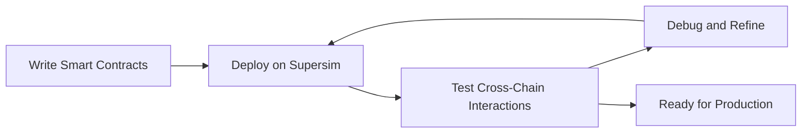

This diagram illustrates the typical workflow for developers using supersim, from writing smart contracts to testing and refining cross-chain interactions.

## Features and benefits

*   Simulates multiple OP Stack chains locally (e.g., chain 901, 902)
*   Supports testing of cross-chain messaging and interactions
*   Includes pre-deployed interoperability contracts
*   Offers a CLI interface for starting and managing Supersim instances
*   Provides local JSON-RPC endpoints for each simulated chain
*   Allows for custom configuration of chain parameters
*   Facilitates testing of Superchain-specific features like SuperchainERC20 tokens
*   Easy to use with common Ethereum development tools 
*   Supports chain forking

## Supersim CLI interaction

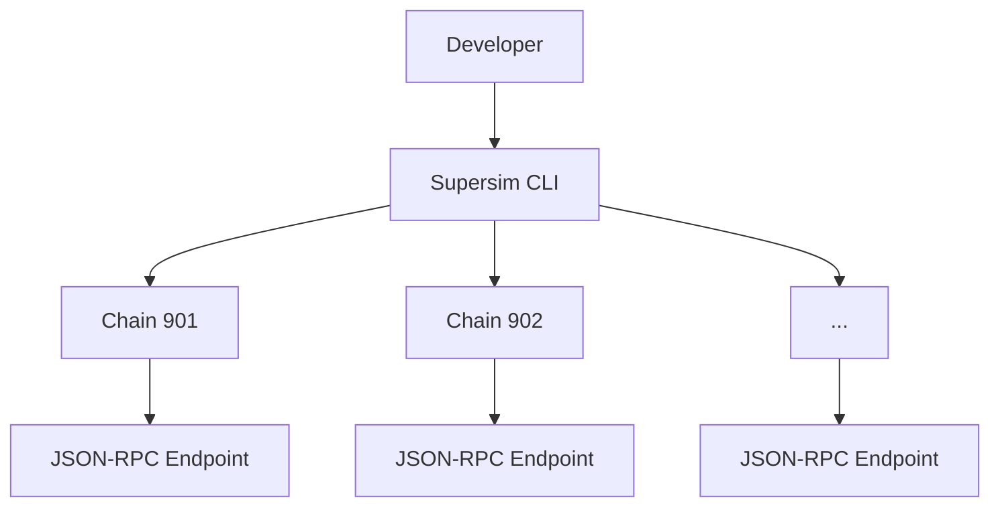

This diagram illustrates how developers interact with Supersim through the CLI, which simulates OP Stack specific features (specifically interop) on locally run chains, each with its own JSON-RPC endpoint and pre-deployed interoperability contracts.

## Next steps

*   Build a [revolutionary app](/app-developers/get-started) that uses multiple blockchains within the Superchain
*   Deploy a [SuperchainERC20](/stack/interop/tutorials/deploy-superchain-erc20) to the Superchain
*   View more [Supersim tutorials](/app-developers/tutorials/supersim)

---


## Transaction guides

> Guide to understanding and working with transactions on OP Stack, including fee estimation, gas parameters, and troubleshooting.

*source: `app-developers/transactions.mdx`*

import { Card, Cards } from 'nextra/components'

# Transaction guides

This section provides information on transactions in OP Mainnet, including fee estimation, gas parameters, transaction statuses, and troubleshooting. You'll find guides to help you understand and work with these topics.

<Cards>
  <Card title="Learn about transaction fees" href="/app-developers/transactions/fees" icon={} />
  <Card title="Estimate transaction fees" href="/app-developers/transactions/estimates" icon={} />
  <Card title="Setting transaction gas parameters" href="/app-developers/transactions/parameters" icon={} />
  <Card title="Transaction statuses" href="/app-developers/transactions/statuses" icon={} />
  <Card title="Troubleshooting transactions" href="/app-developers/transactions/troubleshooting" icon={} />
</Cards>

---


### Estimating transaction fees on OP Mainnet

> Learn how to properly estimate the total cost of a transaction on OP Mainnet.

*source: `app-developers/transactions/estimates.mdx`*

import { Callout, Steps } from 'nextra/components'

# Estimating transaction fees on OP Mainnet

<Callout>
Check out the guide on understanding [Transaction Fees on OP Mainnet](./fees) for an in-depth explanation of how OP Mainnet transaction fees work.
</Callout>

It's important to properly estimate the cost of a transaction on OP Mainnet before submitting it to the network.
Here you'll learn how to estimate both of the components that make up the total cost of an OP Mainnet transaction, the [execution gas fee](./fees#execution-gas-fee) and the [L1 data fee](./fees#l1-data-fee).
Make sure to read the guide on [Transaction Fees on OP Mainnet](./fees) for a detailed look at how these fees work under the hood.

## Execution gas fee 

<Callout type="info">
Estimating the execution gas fee on OP Mainnet is just like estimating the execution gas fee on Ethereum.
Steps are provided here for reference and convenience, but you can use the same tooling that you'd use to estimate the execution gas fee for a transaction on Ethereum.
</Callout>

A transaction's execution gas fee is exactly the same fee that you would pay for the same transaction on Ethereum.
This fee is equal to the amount of gas used by the transaction multiplied by the gas price attached to the transaction.
Refer to the guide on [Transaction Fees on OP Mainnet](./fees#execution-gas-fee) for more information about the execution gas fee.

When estimating the execution gas fee for a transaction, you'll need to know the gas limit and the [max fee per gas](https://ethereum.org/en/developers/docs/gas/#maxfee) for the transaction.
Your transaction fee will then be the product of these two values.
Refer to the guide on [Setting Transaction Gas Parameters on OP Mainnet](./parameters) to learn how to select an appropriate gas limit and max fee per gas for your transaction.

<Steps>

{<h3>Estimate the gas limit</h3>}

Using the same tooling that you'd use to estimate the gas limit for a transaction on Ethereum, estimate the gas limit for your transaction on OP Mainnet.
OP Mainnet is designed to be [EVM equivalent](https://web.archive.org/web/20231127160757/https://medium.com/ethereum-optimism/introducing-evm-equivalence-5c2021deb306) so transactions will use the same amount of gas on OP Mainnet as they would on Ethereum.
This means you can feed your transaction to the [`eth_estimateGas`](https://ethereum.org/en/developers/docs/apis/json-rpc/#eth_estimategas) JSON-RPC method just like you would on Ethereum. Alternatively, use Tenderly's [`tenderly_estimateGas`](https://docs.tenderly.co/node/rpc-reference/optimism-mainnet/tenderly_estimateGas) for 100% accurate gas estimations.

{<h3>Estimate the max fee per gas</h3>}

Like Ethereum, OP Mainnet uses an `EIP-1559` style fee market to determine the current base fee per gas.
You can then additionally specify a priority fee (also known as a tip) to incentivize the Sequencer to include your transaction more quickly.
Make sure to check out the guide on [Setting Transaction Gas Parameters on OP Mainnet](./parameters) to learn more about how to select an appropriate max fee per gas for your transaction.

</Steps>

## L1 data fee

<Callout type="info">
The Viem library provides a convenient method for estimating the L1 data fee for a transaction.
Check out the tutorial on [Estimating Transaction Costs on OP Mainnet](/app-developers/tutorials/transactions/sdk-estimate-costs) to learn how to use the Viem library to estimate the L1 data fee for your transaction.
Keep reading if you'd like to learn how to estimate the L1 data fee without the Viem library.
</Callout>

The L1 data fee is a fee paid to the Sequencer for the cost of publishing your transaction to Ethereum.
This fee is paid in ETH and is calculated based on the size of your transaction in bytes and the current gas price on Ethereum.
Refer to the guide on [Transaction Fees on OP Mainnet](./fees#l1-data-fee) for more information about the L1 data fee.

Unlike the execution gas fee, the L1 data fee is an **intrinsic** fee for every transaction.
This fee is automatically charged based on the size of your transaction and the current Ethereum gas price.
You currently cannot specify a custom L1 data fee for your transaction.

<Callout>
The L1 data fee is paid based on the current Ethereum gas price as tracked within the [`GasPriceOracle`](https://github.com/ethereum-optimism/optimism/blob/233ede59d16cb01bdd8e7ff662a153a4c3178bdd/packages/contracts/contracts/L2/predeploys/OVM_GasPriceOracle.sol) smart contract.
This gas price is updated automatically by the OP Mainnet protocol.
Your transaction will be charged the Ethereum gas price seen by the protocol at the time that your transaction is included in an OP Mainnet block.
This means that the L1 data fee for your transaction may differ from your estimated L1 data fee.
</Callout>

<Steps>

{<h3>Serialize your transaction</h3>}

The L1 data fee is calculated based on the size of your serialized transaction in bytes.
Most Ethereum tooling will provide a method for serializing a transaction.
For instance, Ethers.js provides the [`ethers.utils.serializeTransaction`](https://docs.ethers.org/v5/api/utils/transactions/#utils-serializeTransaction) method.

{<h3>Estimate the L1 data fee</h3>}

Once you have serialized your transaction, you can estimate the L1 data fee by calling the [`getL1Fee`](https://github.com/ethereum-optimism/optimism/blob/233ede59d16cb01bdd8e7ff662a153a4c3178bdd/packages/contracts/contracts/L2/predeploys/OVM_GasPriceOracle.sol#L109-L124) method on the [`GasPriceOracle`](https://github.com/ethereum-optimism/optimism/blob/233ede59d16cb01bdd8e7ff662a153a4c3178bdd/packages/contracts/contracts/L2/predeploys/OVM_GasPriceOracle.sol) smart contract available on OP Mainnet and all OP Stack chains.
This method takes the serialized transaction as input and returns the L1 data fee in wei using the formula described in the [Transaction Fees on OP Mainnet](./fees#l1-data-fee) guide.

<Callout>
Fee estimation is typically performed before the transaction is signed.
As a result, the `getL1Fee` method assumes that your input is an **unsigned** Ethereum transaction.
</Callout>

</Steps>

### Tooling

Several tools are available to help you estimate the L1 Data Fee for your transaction.
Selecting the right tool for your use case will depend on your specific needs.

*   [Viem](https://viem.sh/op-stack#getting-started-with-op-stack) provides first-class support for OP Stack chains, including OP Mainnet. You can use Viem to estimate gas costs and send cross-chain transactions (like transactions through the Standard Bridge system). It's strongly recommended to use Viem if you are able to do so as it will provide the best native support at the moment.

### Future proofing

The L1 Data Fee formula is subject to change in the future, especially as the data availability landscape evolves.
As a result, it's important to future-proof your transaction fee estimation code to ensure that it will continue to function properly as the L1 Data Fee formula changes.

*   Use existing [tooling](#tooling) to estimate the L1 Data Fee for your transaction if possible. This tooling will be updated to reflect any changes to the L1 Data Fee formula. This way you won't need to modify your code to account for any changes to the formula.
*   Use the `getL1Fee` method on the `GasPriceOracle` if you are unable to use existing tooling. The `getL1Fee` method will be updated to reflect any changes to the L1 Data Fee formula. It's strongly recommended that you do **not** implement the L1 Data Fee formula yourself.

---


### TransactionFees

> Learn about fees in the Optimism ecosystem. This guide provides detailed information and resources about fees.

*source: `app-developers/transactions/fees.mdx`*

import TransactionFees from '@/pages/stack/transactions/fees.mdx'

<TransactionFees />

---


### Setting transaction gas parameters on OP Mainnet

> Learn how to set gas parameters for transactions on OP Mainnet.

*source: `app-developers/transactions/parameters.mdx`*

import { Steps } from 'nextra/components'

# Setting transaction gas parameters on OP Mainnet

OP Mainnet is designed to be [EVM equivalent](https://web.archive.org/web/20231127160757/https://medium.com/ethereum-optimism/introducing-evm-equivalence-5c2021deb306) which means that it is as compatible with Ethereum as possible, down to the client software used to run OP Mainnet nodes.
Like Ethereum, OP Mainnet has an EIP-1559 style fee mechanism that dynamically adjusts a [base fee](https://ethereum.org/en/developers/docs/gas/#base-fee) that acts as the minimum fee that a transaction must pay to be included in a block.
OP Mainnet also allows transactions to pay a [priority fee](https://ethereum.org/en/developers/docs/gas/#priority-fee) (also known as a tip) to incentivize the Sequencer to include transactions more quickly.

Setting the base fee and the priority fee appropriately is important to ensure that your transactions are included in a timely manner.
This guide will walk you through some best practices for determining the base fee and priority fee for your transactions.

## Selecting the base fee

The base fee is the minimum fee that a transaction must pay to be included in a block.
Transactions that specify a maximum fee per gas that is less than the current base fee cannot be included in the blockchain.

The simplest way to select a base fee is to look at the latest available OP Mainnet block.
Each OP Mainnet block includes the current base fee and the amount of gas used within that block.
You can use this information to predict a reasonable maximum fee for your transaction.

Note that, like Ethereum, the base fee is not explicitly defined within a transaction.
Instead, the maximum base fee is determined as the difference between the `maxFeePerGas` and the `maxPriorityFeePerGas` fields of any given transaction.

<Steps>
  {<h3>Retrieve the latest block</h3>}

  Using the JSON-RPC API or your favorite Ethereum library, retrieve the latest block on OP Mainnet.

  {<h3>Retrieve the base fee and gas used</h3>}

  From the block, retrieve the `baseFeePerGas` and `gasUsed` fields.

  {<h3>Predict the next base fee</h3>}

  OP Mainnet adjusts the base fee based on the amount of gas used in the previous block.
  If the previous block used more than 5m gas (of the 30m gas limit), then the base fee will increase by up to 10%.
  If the previous block used less than 5m gas, then the base fee will decrease by up to 10%.
  Refer to the [OP Mainnet EIP-1559 Parameters](/stack/differences#eip-1559-parameters) section for more details.

  {<h3>Select a base fee per gas</h3>}

  Using the current base fee per gas and the amount of gas used in the previous block, you can predict the next base fee per gas.
  If you are highly sensitive to the base fee, you may want to select a base fee per gas that is either 10% higher or 10% lower than the previous base fee.
  However, you may run the risk that your transaction will not be included in a block quickly.
  If you are less sensitive to the base fee, you may wish to simply use a large multiple of the previous base fee (e.g. 2x).
</Steps>

## Selecting the priority fee

The priority fee is an optional tip that can be paid to the Sequencer to incentivize them to include your transaction more quickly.
The priority fee is paid in addition to the base fee.

The simplest way to select a priority fee is to use the [`eth_maxPriorityFeePerGas`](https://docs.alchemy.com/reference/eth-maxpriorityfeepergas) JSON-RPC method to retrieve an estimate for an acceptable priority fee.
Many Ethereum libraries will provide a function to call this JSON-RPC method.
You can also use the [`eth_feeHistory`](https://docs.alchemy.com/reference/eth-feehistory) JSON-RPC method to retrieve historical priority fee data.
You can then use this data to predict a reasonable priority fee for your transaction.

Alternatively, you can rely on Tenderly's [`tenderly_gasPrice`](https://docs.tenderly.co/node/rpc-reference/optimism-mainnet/tenderly_gasPrice?mtm_campaign=ext-docs\&mtm_kwd=optimism) to get real-time gas predictions with 3 levels of likelihood for transaction inclusion.

---


### Transaction statuses on OP Mainnet

> Learn about the statuses transactions can have on OP Mainnet.

*source: `app-developers/transactions/statuses.mdx`*

# Transaction statuses on OP Mainnet

Transactions on OP Mainnet can have a number of different statuses depending on where a transaction is in the process of being included in the blockchain.
Understanding these statuses can help you troubleshoot issues, build safer applications, and display more accurate information to your users.

## Pending

**Instant after sending to the Sequencer**

A transaction is considered "pending" when it has been sent to the Sequencer but has not yet been included in a block.
This is the first status a transaction will have after being sent to the Sequencer.
At this point the transaction is not part of the blockchain and there is no guarantee that the transaction will be included in the blockchain.

The list of all pending transactions can be retrieved by calling the standard JSON-RPC method [`eth_getBlockByNumber`](https://ethereum.org/en/developers/docs/apis/json-rpc/#eth_getblockbynumber) with the parameter `pending` as the block number.

## Sequencer confirmed or unsafe

**Typically within 2-4 seconds**

A transaction is considered "sequencer confirmed" or "unsafe" when it has been included in a block by the Sequencer but that block has **not** yet been published to Ethereum.
Although the transaction is included in a block, it is still possible for the transaction to be excluded from the final blockchain if the Sequencer fails to publish the block to Ethereum within the [Sequencing Window](/connect/resources/glossary#sequencing-window) (approximately 12 hours).
Applications should make sure to consider this possibility when displaying information about transactions that are in this state.

The latest "sequencer confirmed" block can be retrieved by calling the standard JSON-RPC method [`eth_getBlockByNumber`](https://ethereum.org/en/developers/docs/apis/json-rpc/#eth_getblockbynumber) with the parameter `safe` as the block number and comparing this to the result returned for the `latest` block.
If the `safe` block is behind the `latest` block, then the earliest "sequencer confirmed" block is the `safe` block plus one.

## Published to Ethereum or safe

**Typically within 5-10 minutes, up to 12 hours**

A transaction is considered "safe" when it has been included in a block by the Sequencer and that block has been published to Ethereum but that block is not yet finalized.
Once a block has been published to Ethereum there is a high likelihood that the block will be included in the final blockchain.
However, it is still possible for the block to be excluded from the final blockchain if the Ethereum blockchain experiences a reorganization.

The latest "safe" block can be retrieved by calling the standard JSON-RPC method [`eth_getBlockByNumber`](https://ethereum.org/en/developers/docs/apis/json-rpc/#eth_getblockbynumber) with the parameter `safe` as the block number.

Transactions typically become "safe" within a few minutes of becoming "sequencer confirmed".


## Finalized

**Typically within 15-20 minutes, up to 12 hours**

A transaction is considered "finalized" when it has been included in a block by the Sequencer, that block has been published to Ethereum, and that block has been finalized.
Once a block has been finalized it is guaranteed to be included in the OP Mainnet blockchain.
Applications that require the highest level of certainty that a transaction will be included in the blockchain should wait until the transaction is "finalized" before considering the transaction to be successful.

The latest "finalized" block can be retrieved by calling the standard JSON-RPC method [`eth_getBlockByNumber`](https://ethereum.org/en/developers/docs/apis/json-rpc/#eth_getblockbynumber) with the parameter `finalized` as the block number.

---


### Troubleshooting transactions

> Learn how to troubleshoot common problems with transactions.

*source: `app-developers/transactions/troubleshooting.mdx`*

# Troubleshooting transactions

## Transactions stuck in the transaction pool

OP Chain uses EIP-1559, but with different parameters than L1 Ethereum.
As a result, while the base fee on L1 can grow by up to 12.5% in a twelve-second period (in the case of a single 30M gas block), the L2 base fee can grow by up to 77% (in the case of six 30M gas blocks).
However, it still shrinks by only up to 12.5% in the same twelve-second period (if all the blocks are empty).

If the maximum fee per gas specified by the transaction is less than the block base fee, it does not get included until the base fee drops to below the value in the transaction.
When this happens, some users may see their transaction become stuck. 
No ETH is lost, but the transaction does not clear on its own. 

We have a workaround that users and wallet operators can implement immediately, and we expect a protocol-level fix to be live by the end of Q4.

### Recommendation

Set the maximum fee per gas for transactions to a relatively high value, such as 0.1 gwei. 
This will *not* increase the transaction cost because the same base fee, determined by a formula, is charged to all the transactions in the block. 
To save on the cost of L2 gas you want to minimize the max priority fee.

Also, if the [current base fee](https://optimistic.grafana.net/public-dashboards/c84a5a9924fe4e14b270a42a8651ceb8?orgId=1&refresh=5m) is comparable to 0.1 gwei or higher, you might want to suggest to users a higher multiple of the base fee than you would on L1 Ethereum because it can grow faster in the time interval between transaction creation and transaction signing and submission. 

#### Recommendations for wallet developers

Wallets are usually in charge of determining the default priority fee and max fee that a transaction would include, so the above recommendations can be applied directly.


#### Recommendations for app developers

As an app developer, you can usually override the default recommendation of the wallet
(see, for example, [ethers](https://github.com/ethers-io/ethers.js/blob/v5.7/packages/contracts/lib/index.d.ts#L10-L11)). 
As long as not all wallets are upgraded according to our recommendations, it makes sense for apps to get the current base fee and recommend a value based on that.


#### Recommendations for users

As a user, you are the final authority on transaction fields. Sometimes when submitting a transaction, the gas fee is set too low, and it gets stuck in the transaction pool (a.k.a. mempool). If you want to push that transaction through, [you can cancel it by submitting another transaction with the same nonce](https://info.etherscan.com/how-to-cancel-ethereum-pending-transactions/). This method increases the fee and the sequencer will process it from the mempool quicker.

## Deposit transactions don't have a chainId on L2

  [Deposit transactions](https://specs.optimism.io/protocol/deposits.html#the-deposited-transaction-type) are transactions added to the L2 blockchain as part of the block derivation process.
  These transactions come from a dummy address and don't have a signature.
  Because in Ethereum the chainID is encoded as part of the signature, this means there is no recoverable chainID for these transactions.

  This is not a problem because the only source of deposit transactions is the block derivation process. 
  There shouldn't be a need to recover the chainID.

---


## App dev tutorials

> A collection of tutorials for app developers building on OP Stack, covering topics such as bridging tokens, deploying contracts, and estimating transaction costs.

*source: `app-developers/tutorials.mdx`*

import { Card, Cards } from 'nextra/components'

# App dev tutorials

If you're a bit more familiar with the OP Stack and Ethereum, you can try walking through one of the tutorials put together by the Optimism community. They'll help you get a head start when building your first Optimistic project.

## Bridging
<Cards>
  <Card title="Communicating between OP Stack and Ethereum in Solidity" href="/app-developers/tutorials/bridging/cross-dom-solidity" icon={} />
  <Card title="Bridging ERC-20 tokens with the Optimism SDK" href="/app-developers/tutorials/bridging/cross-dom-bridge-erc20" icon={} />
  <Card title="Bridging ETH with Viem" href="/app-developers/tutorials/bridging/cross-dom-bridge-eth" icon={} />
  <Card title="Bridging your custom ERC-20 token using the Standard Bridge" href="/app-developers/tutorials/bridging/standard-bridge-custom-token" icon={} />
  <Card title="Bridging your standard ERC-20 token using the Standard Bridge" href="/app-developers/tutorials/bridging/standard-bridge-standard-token" icon={} />
  <Card title="Bridging tutorials" href="/app-developers/tutorials/bridging" icon={} />
</Cards>

## Transactions
<Cards>
  <Card title="Estimating transaction costs on OP Stack" href="/app-developers/tutorials/transactions/sdk-estimate-costs" icon={} />
  <Card title="Tracing deposits and withdrawals" href="/app-developers/tutorials/transactions/sdk-trace-txns" icon={} />
  <Card title="Triggering OP Stack transactions from Ethereum" href="/app-developers/tutorials/transactions/send-tx-from-eth" icon={} />
  <Card title="Transaction tutorials" href="/app-developers/tutorials/transactions" icon={} />
</Cards>

## Supersim
<Cards>
  <Card title="Getting Started: Installation" href="/app-developers/tutorials/supersim/getting-started/installation" icon={} />
  <Card title="Getting Started: First Steps" href="/app-developers/tutorials/supersim/getting-started/first-steps" icon={} />
  <Card title="CLI: Vanilla mode (non-forked)" href="/app-developers/tutorials/supersim/reference/vanilla" icon={} />
  <Card title="CLI: Fork mode" href="/app-developers/tutorials/supersim/reference/fork" icon={} />
  <Card title="Included Contracts" href="/app-developers/tutorials/supersim/chain-env/included-contracts" icon={} />
  <Card title="OPChainA (chainID 901)" href="/app-developers/tutorials/supersim/chain-env/chain-a" icon={} />
  <Card title="OPChainB (chainID 902)" href="/app-developers/tutorials/supersim/chain-env/chain-b" icon={} />
  <Card title="Deposit transactions" href="/app-developers/tutorials/supersim/deposit-transactions" icon={} />
  <Card title="Supersim guides and tutorials" href="/app-developers/tutorials/supersim" icon={} />
</Cards>

## Interop
<Cards>
  <Card title="Deploying a SuperchainERC20" href="/app-developers/tutorials/interop/deploy-superchain-erc20" icon={} />
  <Card title="Transferring a SuperchainERC20" href="/app-developers/tutorials/interop/transfer-superchainERC20" icon={} />
  <Card title="Bridging native cross-chain ETH transfers" href="/app-developers/tutorials/interop/bridge-crosschain-eth" icon={} />
  <Card title="Relaying interop messages using `cast`" href="/app-developers/tutorials/interop/relay-messages-cast" icon={} />
  <Card title="Relaying interop messages using `viem`" href="/app-developers/tutorials/interop/relay-messages-viem" icon={} />
  <Card title="Interop tutorials" href="/app-developers/tutorials/interop" icon={} />
</Cards>

You can also [suggest a new tutorial](https://github.com/ethereum-optimism/docs/issues/new?assignees=\&labels=tutorial%2Cdocumentation%2Ccommunity-request\&projects=\&template=suggest_tutorial.yaml\&title=%5BTUTORIAL%5D+Add+PR+title) if you have something specific in mind. We'd love to grow this list!

---


### Bridging tutorials

> A collection of app developer tutorials focused on bridging.

*source: `app-developers/tutorials/bridging.mdx`*

import { Card, Cards } from 'nextra/components'

# Bridging tutorials

This is a collection of app developer tutorials focused on bridging.

<Cards>
  <Card title="Communicating between OP Stack and Ethereum in Solidity" href="/app-developers/tutorials/bridging/cross-dom-solidity" icon={} />
  <Card title="Bridging ERC-20 tokens with the Optimism SDK" href="/app-developers/tutorials/bridging/cross-dom-bridge-erc20" icon={} />
  <Card title="Bridging ETH with Viem" href="/app-developers/tutorials/bridging/cross-dom-bridge-eth" icon={} />
  <Card title="Bridging your custom ERC-20 token using the Standard Bridge" href="/app-developers/tutorials/bridging/standard-bridge-custom-token" icon={} />
  <Card title="Bridging your standard ERC-20 token using the Standard Bridge" href="/app-developers/tutorials/bridging/standard-bridge-standard-token" icon={} />
</Cards>

---


#### Bridging ERC-20 tokens to OP Mainnet with the Optimism SDK

> Learn how to use the Optimism SDK to transfer ERC-20 tokens between Layer 1 (Ethereum or Sepolia) and Layer 2 (OP Mainnet or OP Sepolia).

*source: `app-developers/tutorials/bridging/cross-dom-bridge-erc20.mdx`*

import { Callout, Steps } from 'nextra/components'
import { WipCallout } from '@/components/WipCallout'

<WipCallout />

# Bridging ERC-20 tokens to OP Mainnet with the Optimism SDK


This tutorial explains how you can use the [Optimism SDK](https://sdk.optimism.io) to bridge ERC-20 tokens from L1 (Ethereum or Sepolia) to L2 (OP Mainnet or OP Sepolia).
The Optimism SDK is an easy way to add bridging functionality to your javascript-based application.
It also provides some safety rails to prevent common mistakes that could cause tokens to be made inaccessible.

Behind the scenes, the Optimism SDK uses the [Standard Bridge](/app-developers/bridging/standard-bridge) contracts to transfer tokens.
Make sure to check out the [Standard Bridge guide](/app-developers/bridging/standard-bridge) if you want to learn more about how the bridge works under the hood.

<Callout type="error">
  The Standard Bridge **does not** support [**fee on transfer
  tokens**](https://github.com/d-xo/weird-erc20#fee-on-transfer) or [**rebasing
  tokens**](https://github.com/d-xo/weird-erc20#balance-modifications-outside-of-transfers-rebasingairdrops)
  because they can cause bridge accounting errors.
</Callout>

## Supported networks

The Optimism SDK supports any of the [Superchain networks](/superchain/networks).
[Some Superchain networks](https://sdk.optimism.io/enums/l2chainid) are already included in the SDK by default.
If you want to use a network that isn't included by default, you can simply [instantiate the SDK with the appropriate contract addresses](/app-developers/get-started).

## Dependencies

*   [node](https://nodejs.org/en/)
*   [pnpm](https://pnpm.io/installation)

## Create a demo project

You're going to use the Optimism SDK for this tutorial.
Since the Optimism SDK is a [Node.js](https://nodejs.org/en/) library, you'll need to create a Node.js project to use it.

<Steps>
  {<h3>Make a Project Folder</h3>}

  ```bash
  mkdir op-sample-project
  cd op-sample-project
  ```

  {<h3>Initialize the Project</h3>}

  ```bash
  pnpm init
  ```

  {<h3>Install the Optimism SDK</h3>}

  ```bash
  pnpm add @eth-optimism/sdk
  ```

  {<h3>Install ethers.js</h3>}

  ```bash
  pnpm add ethers@^5
  ```
</Steps>

<Callout type="info">
  Want to create a new wallet for this tutorial? If you have
  [`cast`](https://book.getfoundry.sh/getting-started/installation) installed
  you can run `cast wallet new` in your terminal to create a new wallet and get
  the private key.
</Callout>

## Get ETH on Sepolia and OP Sepolia

This tutorial explains how to bridge tokens from Sepolia to OP Sepolia.
You will need to get some ETH on both of these testnets.

<Callout type="info">
  You can use [this faucet](https://sepoliafaucet.com) to get ETH on Sepolia.
  You can use the [Superchain
  Faucet](https://console.optimism.io/faucet?utm_source=docs) to get ETH on OP
  Sepolia.
</Callout>

## Add a private key to your environment

You need a private key to sign transactions.
Set your private key as an environment variable with the `export` command.
Make sure this private key corresponds to an address that has ETH on both Sepolia and OP Sepolia.

```bash
export TUTORIAL_PRIVATE_KEY=0x...
```

## Start the Node REPL

You're going to use the Node REPL to interact with the Optimism SDK.
To start the Node REPL, run the following command in your terminal:

```bash
node
```

This will bring up a Node REPL prompt that allows you to run javascript code.

## Import dependencies

You need to import some dependencies into your Node REPL session.

<Steps>
  {<h3>Import the Optimism SDK</h3>}

  ```js file=<rootDir>/public/tutorials/cross-dom-bridge-erc20.js#L3 hash=26b2fdb17dd6c8326a54ec51f0769528
  ```

  {<h3>Import ethers.js</h3>}

  ```js file=<rootDir>/public/tutorials/cross-dom-bridge-erc20.js#L4 hash=69a65ef97862612e4978b8563e6dbe3a
  ```
</Steps>

## Set session variables

You'll need a few variables throughout this tutorial.
Let's set those up now.

<Steps>
  {<h3>Load your private key</h3>}

  ```js file=<rootDir>/public/tutorials/cross-dom-bridge-erc20.js#L6 hash=755b77a7ffc7dfdc186f36c37d3d847a
  ```

  {<h3>Create the RPC providers and wallets</h3>}

  ```js file=<rootDir>/public/tutorials/cross-dom-bridge-erc20.js#L8-L11 hash=9afdce50665ae93bce602068071ffaa1
  ```

  {<h3>Set the L1 and L2 ERC-20 addresses</h3>}

  This tutorial uses existing ERC-20 tokens that have been deployed on Sepolia and OP Sepolia.
  These tokens are designed for testing the bridging process.

  ```js file=<rootDir>/public/tutorials/cross-dom-bridge-erc20.js#L13-L14 hash=d8f0d4c8124782a6cd36097ff31010e5
  ```

  <Callout>
    If you're coming from the [Bridging Your Standard ERC-20 Token to OP Mainnet
    Using the Standard Bridge](./standard-bridge-standard-token) or [Bridging Your
    Custom ERC-20 Token to OP Mainnet Using the Standard
    Bridge](./standard-bridge-custom-token) tutorials, you can use the addresses
    of your own ERC-20 tokens here instead.
  </Callout>
</Steps>

## Get L1 tokens

You're going to need some tokens on L1 that you can bridge to L2.
The L1 testing token located at [`0x5589BB8228C07c4e15558875fAf2B859f678d129`](https://sepolia.etherscan.io/address/0x5589BB8228C07c4e15558875fAf2B859f678d129) has a `faucet` function that makes it easy to get tokens.

<Steps>
  {<h3>Set the ERC20 ABI</h3>}

  ```js file=<rootDir>/public/tutorials/cross-dom-bridge-erc20.js#L16 hash=d1caeba8dc014637e2b0b72f5cd076d0
  ```

  {<h3>Create a Contract instance for the L1 token</h3>}

  ```js file=<rootDir>/public/tutorials/cross-dom-bridge-erc20.js#L18 hash=9f9d7e38319ff5263e0e99d80d495554
  ```

  {<h3>Request some tokens</h3>}

  ```js file=<rootDir>/public/tutorials/cross-dom-bridge-erc20.js#L21-L22 hash=3533ec5426e8845fdb9af1e9e8d3de4c
  ```

  {<h3>Check your token balance</h3>}

  ```js file=<rootDir>/public/tutorials/cross-dom-bridge-erc20.js#L25 hash=d7a60aa394d1055555c2aeab2a2e111d
  ```
</Steps>

## Deposit tokens

Now that you have some tokens on L1, you can deposit those tokens into the `L1StandardBridge` contract.
You'll then receive the same number of tokens on L2 in return.

<Steps>
  {<h3>Define the amount to deposit</h3>}

  The testing token has 18 decimal places, so you'll want to define a variable that represents one token.

  ```js file=<rootDir>/public/tutorials/cross-dom-bridge-erc20.js#L27 hash=9349517ae6165a8798e49750da8faeee
  ```

  {<h3>Create a CrossChainMessenger instance</h3>}

  The Optimism SDK exports a `CrossChainMessenger` class that makes it easy to interact with the `L1StandardBridge` contract.

  Create an instance of the `CrossChainMessenger` class:

  ```js file=<rootDir>/public/tutorials/cross-dom-bridge-erc20.js#L29-L34 hash=997b9c4cdd5fb1f9d4e0882a683ae016
  ```

  {<h3>Allow the Standard Bridge to access your tokens</h3>}

  Before you can deposit your tokens, you'll need to give the Standard Bridge contract an allowance of tokens on L1.
  This will allow the Standard Bridge to pull these tokens out of your address and escrow inside the bridge.

  ```js file=<rootDir>/public/tutorials/cross-dom-bridge-erc20.js#L37-L38 hash=3d9347e57540e808d71230c1bbe49db5
  ```

  {<h3>Deposit your tokens</h3>}

  Now you can deposit your tokens into the Standard Bridge contract.

  ```js file=<rootDir>/public/tutorials/cross-dom-bridge-erc20.js#L41-L42 hash=0dc6191c87c0a371d7a469ed98190e57
  ```

  <Callout>
    Using a smart contract wallet? As a safety measure, `depositERC20` will fail
    if you try to deposit ETH from a smart contract wallet without specifying a
    `recipient`. Add the `recipient` option to the `depositERC20` call to fix
    this. Check out the [Optimism SDK
    docs](https://sdk.optimism.io/classes/crosschainmessenger#depositERC20-2) for
    more info on the options you can pass to `depositERC20`.
  </Callout>

  {<h3>Wait for the deposit to be relayed</h3>}

  You can use the `waitForMessageStatus` function to wait for the deposit to be relayed to L2.

  ```js file=<rootDir>/public/tutorials/cross-dom-bridge-erc20.js#L45 hash=659971675ab8d53bc2bd5196f72c873b
  ```

  {<h3>Check your token balance on L1</h3>}

  You should now have one less token on L1.

  ```js file=<rootDir>/public/tutorials/cross-dom-bridge-erc20.js#L48 hash=d7a60aa394d1055555c2aeab2a2e111d
  ```

  {<h3>Create a Contract instance for the L2 token</h3>}

  ```js file=<rootDir>/public/tutorials/cross-dom-bridge-erc20.js#L50 hash=d7ab5afad79dafcb7be976c3d0d3df84
  ```

  {<h3>Check your token balance on L2</h3>}

  You should now have one more token on L2.

  ```js file=<rootDir>/public/tutorials/cross-dom-bridge-erc20.js#L53 hash=b332b68817359e4c6e991ed83de6e490
  ```
</Steps>

## Withdraw tokens

You just bridged some tokens from L1 to L2.
Nice!
Now you're going to repeat the process in reverse to bridge some tokens from L2 to L1.

<Steps>
  {<h3>Start your withdrawal on L2</h3>}

  The first step to withdrawing tokens from L2 to L1 is to start the withdrawal on L2.

  ```js file=<rootDir>/public/tutorials/cross-dom-bridge-erc20.js#L56-L57 hash=b97f906085a2c350d9113488ea9b1d45
  ```

  {<h3>Check your token balance on L2</h3>}

  You should now have one less token on L2, but your token balance on L1 will not have changed yet.

  ```js file=<rootDir>/public/tutorials/cross-dom-bridge-erc20.js#L60 hash=b332b68817359e4c6e991ed83de6e490
  ```

  {<h3>Wait until the withdrawal is ready to prove</h3>}

  The second step to withdrawing tokens from L2 to L1 is to prove to the bridge on L1 that the withdrawal happened on L2.
  You first need to wait until the withdrawal is ready to prove.

  ```js file=<rootDir>/public/tutorials/cross-dom-bridge-erc20.js#L63 hash=e8b55ec0f16f90ba4d4197cf47ff8e6d
  ```

  <Callout type="info">
    This step can take a few minutes. Feel free to take a quick break while you
    wait.
  </Callout>

  {<h3>Prove the withdrawal on L1</h3>}

  Once the withdrawal is ready to be proven, you'll send an L1 transaction to prove that the withdrawal happened on L2.

  ```js file=<rootDir>/public/tutorials/cross-dom-bridge-erc20.js#L66 hash=fee5f5e924472ee9daceb681ccae1cb9
  ```

  {<h3>Wait until the withdrawal is ready for relay</h3>}

  The final step to withdrawing tokens from L2 to L1 is to relay the withdrawal on L1.
  This can only happen after the fault proof period has elapsed.
  On OP Mainnet, this takes 7 days.

  <Callout>
    We're currently testing fault proofs on OP Sepolia, so withdrawal times
    reflect Mainnet times.
  </Callout>

  ```js file=<rootDir>/public/tutorials/cross-dom-bridge-erc20.js#L69 hash=55a41ac5586b8a688ffd6dfbb20f2d15
  ```

  {<h3>Relay the withdrawal on L1</h3>}

  Once the withdrawal is ready to be relayed, you can finally complete the withdrawal process.

  ```js file=<rootDir>/public/tutorials/cross-dom-bridge-erc20.js#L85 hash=f8d30944dad1664d82b9fdf14da59f9e
  ```

  {<h3>Wait until the withdrawal is relayed</h3>}

  Now you simply wait until the message is relayed.

  ```js file=<rootDir>/public/tutorials/cross-dom-bridge-erc20.js#L88 hash=c2c14a739c44011a058e9848a0019f15
  ```

  {<h3>Check your token balance on L1</h3>}

  You should now have one more token on L1.

  ```js file=<rootDir>/public/tutorials/cross-dom-bridge-erc20.js#L91 hash=d7a60aa394d1055555c2aeab2a2e111d
  ```
</Steps>

## Next steps

Congrats!
You've just deposited and withdrawn tokens using the Optimism SDK.
You should now be able to write applications that use the Optimism SDK to transfer ERC-20 tokens between L1 and L2.
Although this tutorial used Sepolia and OP Sepolia, the same process works for Ethereum and OP Mainnet.

---


#### Bridging ETH to OP Mainnet with Viem

> Learn how to use Viem to transfer ETH between Layer 1 (Ethereum or Sepolia) and Layer 2 (OP Mainnet or OP Sepolia).

*source: `app-developers/tutorials/bridging/cross-dom-bridge-eth.mdx`*

import { Callout, Steps, Tabs } from 'nextra/components'

# Bridging ETH to OP Mainnet with Viem

This tutorial explains how you can use [Viem](https://viem.sh) to bridge ETH from L1 (Ethereum or Sepolia) to L2 (OP Mainnet or OP Sepolia).
Viem is a TypeScript interface for Ethereum that provides low-level stateless primitives for interacting with Ethereum.
It offers an easy way to add bridging functionality to your JavaScript-based application.

Behind the scenes, Viem uses the [Standard Bridge](/app-developers/bridging/standard-bridge) contracts to transfer ETH and ERC-20 tokens.
Make sure to check out the [Standard Bridge guide](/app-developers/bridging/standard-bridge) if you want to learn more about how the bridge works under the hood.

## Supported networks

Viem supports any of the [Superchain networks](/superchain/networks).
The OP Stack networks are included in Viem by default.
If you want to use a network that isn't included by default, you can add it to Viem's chain configurations.

## Dependencies

*   [node](https://nodejs.org/en/)
*   [pnpm](https://pnpm.io/installation)

## Create a demo project

You're going to use Viem for this tutorial.
Since Viem is a [Node.js](https://nodejs.org/en/) library, you'll need to create a Node.js project to use it.

<Steps>
  {<h3>Make a project folder</h3>}

  ```bash
  mkdir bridge-eth
  cd bridge-eth
  ```

  {<h3>Initialize the project</h3>}

  ```bash
  pnpm init
  ```

  {<h3>Install the Viem library</h3>}

  ```bash
  pnpm add viem
  ```
</Steps>

<Callout type="info">
  Want to create a new wallet for this tutorial?
  If you have [`cast`](https://book.getfoundry.sh/getting-started/installation) installed you can run `cast wallet new` in your terminal to create a new wallet and get the private key.
</Callout>

## Get ETH on Sepolia

This tutorial explains how to bridge ETH from Sepolia to OP Sepolia.
You will need to get some ETH on Sepolia to follow along.

<Callout type="info">
  You can use [this faucet](https://sepoliafaucet.com) to get ETH on Sepolia.
</Callout>

## Add a private key to your environment

You need a private key in order to sign transactions.
Set your private key as an environment variable with the export command.
Make sure this private key corresponds to an address that has ETH on Sepolia.

```bash
export TUTORIAL_PRIVATE_KEY=0x...
```

## Start the Node REPL

You're going to use the Node REPL to interact with Viem.
To start the Node REPL run the following command in your terminal:

```bash
node
```

This will bring up a Node REPL prompt that allows you to run JavaScript code.

## Import dependencies

You need to import some dependencies into your Node REPL session.

<Steps>
{<h3>Import Viem and other packages</h3>}

```js file=<rootDir>/public/tutorials/cross-dom-bridge-eth.js#L3-L6 hash=88319dda3322e76accb9e50222d30abc
```

{<h3>Load private key and set account</h3>}

```js file=<rootDir>/public/tutorials/cross-dom-bridge-eth.js#L9-L10 hash=251ec91fdff9dbc613b459ca3b9fb8bd
```

{<h3>Create L1 public client for reading from the Sepolia network</h3>}

```js file=<rootDir>/public/tutorials/cross-dom-bridge-eth.js#L13-L16 hash=6f2335d67920c219b5fd3590f8450cac
```


{<h3>Create L1 wallet client for sending transactions on Sepolia</h3>}

```js file=<rootDir>/public/tutorials/cross-dom-bridge-eth.js#L19-L23 hash=a9b217aef7c065eaf3f2a7222494a3e1
```


{<h3>Create L2 public client for interacting with OP Sepolia</h3>}

```js file=<rootDir>/public/tutorials/cross-dom-bridge-eth.js#L26-L29 hash=dd7868fc9ab8f8a34768c8a83232409b
```

{<h3>Create L2 wallet client on OP Sepolia</h3>}

```js file=<rootDir>/public/tutorials/cross-dom-bridge-eth.js#L32-L36 hash=6f91578c5b155d7abfeecf2297ee9f70
```

</Steps>

## Get ETH on Sepolia

You're going to need some ETH on L1 that you can bridge to L2.
You can get some Sepolia ETH from [this faucet](https://sepoliafaucet.com).

## Deposit ETH

Now that you have some ETH on L1 you can deposit that ETH into the `OptimismPortalProxy` contract. You'll then receive the same number of ETH on L2 in return.

<Tabs items={['depositETH', 'Full Code']}>
  <Tabs.Tab>
    <Steps>
      {<h3>Check your wallet balance on L1</h3>}

      See how much ETH you have on L1 so you can confirm that the deposit worked later on.

      ```js file=<rootDir>/public/tutorials/cross-dom-bridge-eth.js#L38-L39 hash=a77304eb0a056ba30aaa21eee60bcafa
      ```

      <Callout type="info">
        We used `formatEther` method from `viem` to format the balance to ether.
      </Callout>

      {<h3>Create the deposit transaction</h3>}

      Use `buildDepositTransaction` to build the deposit transaction parameters on the L2.

      ```js file=<rootDir>/public/tutorials/cross-dom-bridge-eth.js#L44-L47 hash=01a8dadb00216636f18b72758236d4b0
      ```

      {<h3>Send the deposit transaction</h3>}

      Send the deposit transaction on L1 and log the L1 transaction hash.

      ```js file=<rootDir>/public/tutorials/cross-dom-bridge-eth.js#L49-L50 hash=6c47f29f428cc4c7f6d4ad322e4feaec
      ```

      {<h3>Wait for L1 transaction</h3>}

      Wait for the L1 transaction to be processed and log the receipt.

      ```js file=<rootDir>/public/tutorials/cross-dom-bridge-eth.js#L52-L53 hash=bccea143ce3571de154531c40e9a0d04
      ```

      {<h3>Extract the L2 transaction hash</h3>}

      Extracts the corresponding L2 transaction hash from the L1 receipt, and logs it.
      This hash represents the deposit transaction on L2.

      ```js file=<rootDir>/public/tutorials/cross-dom-bridge-eth.js#L55-L56 hash=07a053f25193bcfcb9dae397091d755a
      ```

      {<h3>Wait for the L2 transaction to be processed</h3>}

      Wait for the L2 transaction to be processed and confirmed and logs the L2 receipt to verify completion.

      ```js file=<rootDir>/public/tutorials/cross-dom-bridge-eth.js#L58-L62 hash=4ab7fdff1700699951ced567db6d4710
      ```
    </Steps>
  </Tabs.Tab>

  <Tabs.Tab>
      ```js file=<rootDir>/public/tutorials/cross-dom-bridge-eth.js#L3-L63 hash=1198e2379e95a0e6c72c03692f10e9ee
      ```
  </Tabs.Tab>
</Tabs>

<Callout>
  Using a smart contract wallet?
  As a safety measure, `depositETH` will fail if you try to deposit ETH from a smart contract wallet without specifying a `recipient`.
  Add the `recipient` option to the `depositETH` call to fix this.
</Callout>

## Withdraw ETH

You just bridged some ETH from L1 to L2.
Nice!
Now you're going to repeat the process in reverse to bridge some ETH from L2 to L1.

<Tabs items={['withdrawETH', 'Full code']}>
  <Tabs.Tab>
    <Steps>
      {<h3>Create the withdrawal transaction</h3>}

      Uses `buildWithdrawalTransaction` to create the withdrawal parameters.
      Converts the withdrawal amount to `wei` and specifies the recipient on L1.

      ```js file=<rootDir>/public/tutorials/cross-dom-bridge-eth.js#L68-L72 hash=cd22b075bb05dc05ac92c5502aa0568f
      ```

      {<h3>Executing the withdrawal</h3>}

      This sends the withdrawal transaction on L2, which initiates the withdrawal process on L2 and logs a transaction hash for tracking the withdrawal.

      ```js file=<rootDir>/public/tutorials/cross-dom-bridge-eth.js#L74-L75 hash=e5f3d46ba9f417fddfa4b861f3f6f208
      ```

      {<h3>Confirming L2 transaction</h3>}

      Wait one hour (max) for the L2 Output containing the transaction to be proposed, and log the receipt, which contains important details like the block number etc.

      ```js file=<rootDir>/public/tutorials/cross-dom-bridge-eth.js#L77-L78 hash=37f83c57e384910a0e5bf7040c52aa7a
      ```

      {<h3>Wait for withdrawal prove</h3>}

      Next, is to prove to the bridge on L1 that the withdrawal happened on L2. To achieve that, you first need to wait until the withdrawal is ready to prove.

      ```js file=<rootDir>/public/tutorials/cross-dom-bridge-eth.js#L80-L83 hash=c1c63ecb4c7f47bc2779fedabb5f70ab
      ```

      Build parameters to prove the withdrawal on the L2.

      ```js file=<rootDir>/public/tutorials/cross-dom-bridge-eth.js#L85-L88 hash=2bc88cda19bd39bfa89451906e4e1ae7
      ```

      {<h3>Prove the withdrawal on the L1</h3>}

      Once the withdrawal is ready to be proven, you'll send an L1 transaction to prove that the withdrawal happened on L2.

      ```js file=<rootDir>/public/tutorials/cross-dom-bridge-eth.js#L90-L92 hash=312b1d49267d75ec0475bc507ae9a742
      ```

      {<h3>Wait for withdrawal finalization</h3>}

      Before a withdrawal transaction can be finalized, you will need to wait for the finalization period.
      This can only happen after the fault proof period has elapsed. On OP Mainnet, this takes 7 days.

      ```js file=<rootDir>/public/tutorials/cross-dom-bridge-eth.js#L94-L97 hash=15e6f754d2e9f11a03f400813efef383
      ```

      <Callout>
        We're currently testing fault proofs on OP Sepolia, so withdrawal times
        reflect Mainnet times.
      </Callout>

      {<h3>Finalize the withdrawal</h3>}

      ```js file=<rootDir>/public/tutorials/cross-dom-bridge-eth.js#L99-L102 hash=02f0f111055d889d627785754e6935ae
      ```

      {<h3>Wait until the withdrawal is finalized</h3>}

      ```js file=<rootDir>/public/tutorials/cross-dom-bridge-eth.js#L104-L106 hash=b3e63b66595ba34594c366e69a451abe
      ```

      {<h3>Check the withdrawal status</h3>}

      ```js file=<rootDir>/public/tutorials/cross-dom-bridge-eth.js#L108-L112 hash=3bd3e14a6c32270cc75d6b691e7b0c91
      ```
    </Steps>
  </Tabs.Tab>

  <Tabs.Tab>

  ```js file=<rootDir>/public/tutorials/cross-dom-bridge-eth.js#L68-L111 hash=4a8d4d442b95aaf0853147420eb131af
  ```

  </Tabs.Tab>
</Tabs>

## Important Considerations

<Callout type="warning">
  *   Challenge period: The 7-day withdrawal challenge Period is crucial for security.
  *   Gas costs: Withdrawals involve transactions on both L2 and L1, each incurring gas fees.
  *   Private Key handling: Use secure key management practices in real applications.
  *   RPC endpoint security: Keep your API key (or any RPC endpoint) secure.
</Callout>

## Next Steps

*   Develop a user interface for easier interaction with these bridging functions.
*   Implement robust error handling and retry mechanisms for production use.

You've just deposited and withdrawn ETH using `viem/op-stack`.
You should now be able to write applications that use `viem/op-stack` to transfer ETH between L1 and L2.
Although this tutorial used Sepolia and OP Sepolia, the same process works for Ethereum and OP Mainnet.

---


#### Communicating between OP Stack and Ethereum in Solidity

> Learn how to write Solidity contracts on OP Stack and Ethereum that can talk to each other.

*source: `app-developers/tutorials/bridging/cross-dom-solidity.mdx`*

import { Steps, Callout, Tabs } from 'nextra/components'

# Communicating between OP Stack and Ethereum in Solidity

This tutorial explains how to write Solidity contracts on OP Stack and Ethereum that can talk to each other.
Here you'll use a contract on OP Stack that can set a "greeting" variable on a contract on Ethereum, and vice-versa.
This is a simple example, but the same technique can be used to send any kind of message between the two chains.

You won't actually be deploying any smart contracts as part of this tutorial.
Instead, you'll reuse existing contracts that have already been deployed to OP Stack and Ethereum.
Later in the tutorial you'll learn exactly how these contracts work so you can follow the same pattern to deploy your own contracts.

<Callout type="info">
Just looking to bridge tokens between OP Stack and Ethereum?
Check out the tutorial on [Bridging ERC-20 Tokens to OP Stack With the viem](./cross-dom-bridge-erc20).
</Callout>

## Message passing basics

OP Stack uses a smart contract called the `CrossDomainMessenger` to pass messages between OP Stack and Ethereum.
Both chains have a version of this contract (the `L1CrossDomainMessenger` and the `L2CrossDomainMessenger`).
Messages sent from Ethereum to OP Stack are automatically relayed behind the scenes.
Messages sent from OP Stack to Ethereum must be explicitly relayed with a second transaction on Ethereum.
Read more about message passing in the guide to [Sending Data Between L1 and L2](/app-developers/bridging/messaging).

## Dependencies

*   [node](https://nodejs.org/en/)
*   [pnpm](https://pnpm.io/installation)

## Get ETH on Sepolia and OP Sepolia

This tutorial explains how to send messages from Sepolia to OP Sepolia.
You will need to get some ETH on both of these testnets.

<Callout type="info">
You can use [this faucet](https://sepoliafaucet.com/) to get ETH on Sepolia.
You can use the [Superchain Faucet](https://console.optimism.io/faucet?utm_source=docs) to get ETH on OP Sepolia.
</Callout>

## Review the contracts
You're about to use two contracts that have already been deployed to Sepolia and OP Sepolia, the `Greeter` contracts.
You can review the source code for the L1 `Greeter` contract [here on Etherscan](https://sepolia.etherscan.io/address/0x31A6Dd971306bb72f2ffF771bF30b1B98dB8B2c5#code).
You can review the source code for the L2 `Greeter` contract [here on Etherscan](https://sepolia-optimism.etherscan.io/address/0x5DE8a2957eddb140567fF90ba5d57bc9769f3055#code).
Both contracts have exactly the same source code.

Feel free to review the source code for these two contracts now if you'd like.
This tutorial will explain how these contracts work in detail later on in the [How It Works](#how-it-works) section below.

## Interact with the L1 Greeter

You're first going to use the L1 `Greeter` contract to set the greeting on the L2 `Greeter` contract.
You'll send a transaction directly to the L1 `Greeter` contract which will ask the `L1CrossDomainMessenger` to send a message to the L2 `Greeter` contract.
After just a few minutes, you'll see the corresponding greeting set on the L2 `Greeter` contract.

<Steps>

{<h3>Connect to Etherscan</h3>}

Sending a message to the L2 `Greeter` contract via the L1 `Greeter` contract requires that you call the `sendGreeting` function.
For simplicity, you'll interact with the contract directly on Etherscan.
Open up the [L1 `Greeter` contract on Sepolia Etherscan](https://sepolia.etherscan.io/address/0x31A6Dd971306bb72f2ffF771bF30b1B98dB8B2c5#writeContract) and click the "Connect to Web3" button.

{<h3>Send your greeting</h3>}

Put a greeting into the field next to the "sendGreeting" function and click the "Write" button.
You can use any greeting you'd like.

{<h3>Wait a few minutes</h3>}

It will take a few minutes for your message to reach L2.
Feel free to take a quick break while you wait.

<Callout type="info">
You can use Viem to programmatically check the status of any message between L1 and L2.
Later on in this tutorial you'll learn how to use Viem and the `waitToProve` function to wait for various message statuses.
This same function can be used to wait for a message to be relayed from L1 to L2.
</Callout>

{<h3>Check the L2 Greeter</h3>}

After a few minutes, you should see the greeting on the L2 `Greeter` contract change to the greeting you set.
Open up the [L2 `Greeter` contract on OP Sepolia Etherscan](https://sepolia-optimism.etherscan.io/address/0x5DE8a2957eddb140567fF90ba5d57bc9769f3055#readContract) and click the "Read Contract" button.
Paste your address into the field next to the "greeting" function and click the "Query" button.
You should see the message you sent from L1.

<Callout>
Haven't seen your message yet?
You might need to wait a little longer.
L2 transactions triggered on L1 are typically processed within one minute but can occasionally be slightly delayed.
</Callout>

</Steps>

## Interact with the L2 Greeter

Now you're going to use the L2 `Greeter` contract to set the greeting on the L1 `Greeter` contract.
You'll send a transaction directly to the L2 `Greeter` contract which will ask the `L2CrossDomainMessenger` to send a message to the L1 `Greeter` contract.
Unlike the previous step, you'll need to relay the message from L2 to L1 yourself!
You'll do this by sending two transactions on Sepolia, one proving transaction and one relaying transaction.

<Steps>

{<h3>Connect to Etherscan</h3>}

Just like before, sending a message to the L1 `Greeter` contract via the L2 `Greeter` contract requires that you call the `sendGreeting` function.
Open up the [L2 `Greeter` contract on OP Sepolia Etherscan](https://sepolia-optimism.etherscan.io/address/0x5DE8a2957eddb140567fF90ba5d57bc9769f3055#writeContract) and click the "Connect to Web3" button.

{<h3>Send your greeting</h3>}

Put a greeting into the field next to the "sendGreeting" function and click the "Write" button.
You can use any greeting you'd like.

<Callout>
Copy the transaction hash from the transaction you just sent.
You'll need this for the next few steps.
Feel free to keep this tab open so you can easily copy the transaction hash later.
</Callout>

{<h3>Create a demo project folder</h3>}

You're going to use the viem to prove and relay your message to L1.

```bash
mkdir cross-dom
cd cross-dom
```

{<h3>Initialize the project</h3>}

Set up the project as a basic Node.js project with `pnpm` or your favorite package manager.

```bash
pnpm init
```

{<h3>Install viem</h3>}

Install Viem with `pnpm` or your favorite package manager.

```bash
pnpm add viem
```

{<h3>Add your private key to your environment</h3>}

You need a private key in order to sign transactions.
Set your private key as an environment variable with the `export` command.
Make sure this is the private key for the address you used to send the transaction to the L2 `Greeter` contract.

```bash
export TUTORIAL_PRIVATE_KEY=0x...
```

{<h3>Add your transaction hash to your environment</h3>}

You'll also need the hash of the transaction you sent to the L2 `Greeter` contract.
Set this as an environment variable with the `export` command.

```bash
export TUTORIAL_TRANSACTION_HASH=0x...
```

{<h3>Start a Node REPL</h3>}

Now you'll use the Node.js REPL to run a few commands.
Start the Node.js REPL with the `node` command.

```bash
node
```

{<h3>Import viem</h3>}

```js file=<rootDir>/public/tutorials/cross-dom-solidity.js#L3-L6 hash=ab7ce5835f34a359602c8fe03080c3ed
```

{<h3>Create the RPC providers and wallets</h3>}

```js file=<rootDir>/public/tutorials/cross-dom-solidity.js#L8-L20 hash=9500ca6be35774522cce2260cd8e9cb6
```

{<h3>Wait until the message is ready to prove</h3>}

Next, you will send messages from L2 to L1 is to prove that the message was sent on L2.
You first need to wait until the message is ready to prove.

```js file=<rootDir>/public/tutorials/cross-dom-solidity.js#L22-L30 hash=0e460f24fc394acdcdb7f06df0188e31
```

<Callout type="info">
This step can take a few minutes.
Feel free to take a quick break while you wait.
</Callout>

{<h3>Prove the message on L1</h3>}

Once the message is ready to be proven, you'll send an L1 transaction to prove that the message was sent on L2.

```js file=<rootDir>/public/tutorials/cross-dom-solidity.js#L32-L36 hash=6b44abbea96103df0513d098ae6e6659
```

{<h3>Build parameters to prove the withdrawal on the L2</h3>}

```js file=<rootDir>/public/tutorials/cross-dom-solidity.js#L38-L44 hash=a31f720f43df1680f5488ea233cc9506
```

{<h3>Wait until the message is ready for relay</h3>}

The final step to sending messages from L2 to L1 is to relay the messages on L1.
This can only happen after the fault proof period has elapsed.
On OP Stack, this takes 7 days.

<Callout>
We're currently testing fault proofs on OP Sepolia, so withdrawal times reflect Mainnet times.
</Callout>

```js file=<rootDir>/public/tutorials/cross-dom-solidity.js#L46-L50 hash=8c08d1f4c6a7f5d1754a411b3590530d
```

{<h3>Relay the message on L1</h3>}

Once the withdrawal is ready to be relayed you can finally complete the message sending process.

```js file=<rootDir>/public/tutorials/cross-dom-solidity.js#L52-L54 hash=d64917e14a9004ef0b81e3f08003d5cd
```

{<h3>Wait until the message is relayed</h3>}

Now you simply wait until the message is relayed.

```js file=<rootDir>/public/tutorials/cross-dom-solidity.js#L56-L62 hash=5a0d3a97f8d71f11c1e46c5e4a734ffb
```

{<h3>Check the L1 Greeter</h3>}

Now that you've relayed the message, you should see the greeting on the L1 `Greeter` contract change to the greeting you set.
Open up the [L1 `Greeter` contract on Sepolia Etherscan](https://sepolia.etherscan.io/address/0x31A6Dd971306bb72f2ffF771bF30b1B98dB8B2c5#readContract) and click the "Read Contract" button.
Paste your address into the field next to the "greeting" function and click the "Query" button.
You should see the message you sent from L2.

</Steps>

## How it works

Congratulations!
You've successfully sent a message from L1 to L2 and from L2 to L1.
This section will explain how the `Greeter` contracts work so you can follow the same pattern to deploy your own contracts.
Luckily, both `Greeter` contracts are exactly the same so it's easy to see how everything comes together.

### The Messenger variable

The `Greeter` contract has a `MESSENGER` variable that keeps track of the `CrossDomainMessenger` contract on the current chain.
Check out the [Contract Addresses page](/superchain/addresses) to see the addresses of the `CrossDomainMessenger` contracts on whichever network you'll be using.

```solidity file=<rootDir>/public/tutorials/cross-dom-solidity.sol#L14 hash=ce8be857d4b4e1992cd3c16b8f2864b9
```

### The other Greeter variable

The `Greeter` contract also has an `OTHER_GREETER` variable that keeps track of the `Greeter` contract on the other chain.
On L1, this variable is set to the address of the L2 `Greeter` contract, and vice-versa.

```solidity file=<rootDir>/public/tutorials/cross-dom-solidity.sol#L15 hash=eedd8c3050a83e56f37f367c6faa6f5d
```

### The Greetings mapping

The `Greeter` contract keeps track of the different greetings that users have sent inside a `greetings` mapping.
By using a mapping, this contract can keep track of greetings from different users at the same time.

```solidity file=<rootDir>/public/tutorials/cross-dom-solidity.sol#L16 hash=832732d9d5aface44c16c1ae9ecde7b2
```

### The Constructor

The `Greeter` has a simple constructor that sets the `MESSENGER` and `OTHER_GREETER` variables.

```solidity file=<rootDir>/public/tutorials/cross-dom-solidity.sol#L18-L24 hash=718f3dc498975548eec30da99e47adf2
```

### The sendGreeting function

The `sendGreeting` function is the most important function in the `Greeter` contract.
This is what you called earlier to send messages in both directions.
All this function is doing is using the `sendMessage` function found within the `CrossChainMessenger` contract to send a message to the `Greeter` contract on the other chain.

Here, the first parameter is the address of the recipient of the message (the `Greeter` contract on the other chain).
The second parameter is the ABI-encoded function call to the `setMessage` function.
The final parameter is the gas limit that gets used when the message is relayed on the other side.

```solidity file=<rootDir>/public/tutorials/cross-dom-solidity.sol#L26-L38 hash=3104a6775fe3a505cf2f84b71b078aee
```

### The setGreeting function

The `setMessage` function is the function that actually sets the greeting.
This function is called by the `CrossDomainMessenger` contract on the other chain.
It checks explicitly that the function can only be called by the `CrossDomainMessenger` contract.
It also checks that the `CrossChainMessenger` is saying that the message came from the `Greeter` contract on the other chain.
Finally, it sets the greeting in the `greetings` mapping.

```solidity file=<rootDir>/public/tutorials/cross-dom-solidity.sol#L40-L52 hash=f50a94e77ecb2f76b9fe278b058a79e4
```

<Callout>
The two `require` statements in this function are important!
Without them, anyone could call this function and set the greeting to whatever they want.
You can follow a similar pattern in your own smart contracts.
</Callout>

## Conclusion

You just learned how you can write Solidity contracts on Sepolia and OP Sepolia that can talk to each other.
You can follow the same pattern to write contracts that can talk to each other on Ethereum and OP Stack.

This sort of cross-chain communication is useful for a variety of reasons.
For example, the [Standard Bridge](/app-developers/bridging/standard-bridge) contracts use this same system to bridge ETH and ERC-20 tokens between Ethereum and OP Stack.

One cool way to take advantage of cross-chain communication is to do most of your heavy lifting on OP Stack and then send a message to Ethereum only when you have important results to share.
This way you can take advantage of the low gas costs on OP Stack while still being able to use Ethereum when you need it.

---


#### Bridging your custom ERC-20 token using the Standard Bridge

> Learn how to bridge your custom ERC-20 token using the standard bridge.

*source: `app-developers/tutorials/bridging/standard-bridge-custom-token.mdx`*

import { Callout, Steps } from 'nextra/components'
import { WipCallout } from '@/components/WipCallout'

# Bridging your custom ERC-20 token using the Standard Bridge

In this tutorial, you'll learn how to bridge a custom ERC-20 token from Ethereum to an OP Stack chain using the Standard Bridge system.
This tutorial is meant for developers who already have an existing ERC-20 token on Ethereum and want to create a bridged representation of that token on OP Mainnet.

This tutorial explains how you can create a custom token that conforms to the [`IOptimismMintableERC20`](https://github.com/ethereum-optimism/optimism/blob/v1.12.2/packages/contracts-bedrock/src/universal/IOptimismMintableERC20.sol) interface so that it can be used with the Standard Bridge system.
A custom token allows you to do things like trigger extra logic whenever a token is deposited.
If you don't need extra functionality like this, consider following the tutorial on [Bridging Your Standard ERC-20 Token Using the Standard Bridge](./standard-bridge-standard-token) instead.

<Callout type="error">
  The Standard Bridge **does not** support [**fee on transfer tokens**](https://github.com/d-xo/weird-erc20#fee-on-transfer) or [**rebasing tokens**](https://github.com/d-xo/weird-erc20#balance-modifications-outside-of-transfers-rebasingairdrops) because they can cause bridge accounting errors.
</Callout>

## About OptimismMintableERC20s

The Standard Bridge system requires that L2 representations of L1 tokens implement the [`IOptimismMintableERC20`](https://github.com/ethereum-optimism/optimism/blob/v1.12.2/packages/contracts-bedrock/src/universal/IOptimismMintableERC20.sol) interface.
This interface is a superset of the standard ERC-20 interface and includes functions that allow the bridge to properly verify deposits/withdrawals and mint/burn tokens as needed.
Your L2 token contract must implement this interface in order to be bridged using the Standard Bridge system.
This tutorial will show you how to create a custom token that implements this interface.

## Dependencies

*   [node](https://nodejs.org/en/)
*   [pnpm](https://pnpm.io/installation)

## Get ETH on Sepolia and OP Sepolia

This tutorial explains how to create a bridged ERC-20 token on OP Sepolia.
You will need to get some ETH on both of these testnets.

<Callout type="info">
  You can use [this faucet](https://sepoliafaucet.com/) to get ETH on Sepolia.
  You can use the [Superchain Faucet](https://console.optimism.io/faucet?utm_source=docs) to get ETH on OP Sepolia.
</Callout>

## Add OP Sepolia to your wallet

This tutorial uses [Remix](https://remix.ethereum.org) to deploy contracts.
You will need to add the OP Sepolia network to your wallet in order to follow this tutorial.
You can use [this website](https://chainid.link?network=op-sepolia) to connect your wallet to OP Sepolia.

## Get an L1 ERC-20 token address

You will need an L1 ERC-20 token for this tutorial.
If you already have an L1 ERC-20 token deployed on Sepolia, you can skip this step.
Otherwise, you can use the testing token located at [`0x5589BB8228C07c4e15558875fAf2B859f678d129`](https://sepolia.etherscan.io/address/0x5589BB8228C07c4e15558875fAf2B859f678d129) that includes a `faucet()` function that can be used to mint tokens.

## Create an L2 ERC-20 token

Once you have an L1 ERC-20 token, you can create a corresponding L2 ERC-20 token on OP Sepolia.
This tutorial will use [Remix](https://remix.ethereum.org) so you can easily deploy a token without a framework like [Hardhat](https://hardhat.org) or [Foundry](https://getfoundry.sh).
You can follow the same general process within your favorite framework if you prefer.

In this section, you'll be creating an ERC-20 token that can be deposited but cannot be withdrawn.
This is just one example of the endless ways in which you could customize your L2 token.

<Steps>
  {<h3>Open Remix</h3>}

  Navigate to [Remix](https://remix.ethereum.org) in your browser.

  {<h3>Create a new file</h3>}

  Click the 📄 ("Create new file") button to create a new empty Solidity file.
  You can name this file whatever you'd like, for example `MyCustomL2Token.sol`.

  {<h3>Copy the example contract</h3>}

  Copy the following example contract into your new file:

  ```solidity file=<rootDir>/public/tutorials/standard-bridge-custom-token.sol#L1-L189 hash=087b70cdb85338a213497a64dd049322
  ```

  {<h3>Review the example contract</h3>}

  Take a moment to review the example contract. It's closely based on the official [`OptimismMintableERC20`](https://github.com/ethereum-optimism/optimism/blob/v1.12.2/packages/contracts-bedrock/src/universal/OptimismMintableERC20.sol) contract with one key modification:

  The `burn` function has been modified to always revert, making it impossible to withdraw tokens back to L1.

  Since the bridge needs to burn tokens when users want to withdraw them to L1, this means that users will not be able to withdraw tokens from this contract. Here's the key part of the contract that prevents withdrawals:

  ```solidity file=<rootDir>/public/tutorials/standard-bridge-custom-token.sol#L136-L156 hash=632f4649d3ce66c28ec34f58046a8890
  ```

  {<h3>Compile the contract</h3>}

  Save the file to automatically compile the contract.
  If you've disabled auto-compile, you'll need to manually compile the contract by clicking the "Solidity Compiler" tab (this looks like the letter "S") and press the blue "Compile" button.

  Make sure you're using Solidity compiler version 0.8.15 (the same version used in the official Optimism contracts).

  {<h3>Deploy the contract</h3>}

  Open the deployment tab (this looks like an Ethereum logo with an arrow pointing left).
  Make sure that your environment is set to "Injected Provider", your wallet is connected to OP Sepolia, and Remix has access to your wallet.
  Then, select the `MyCustomL2Token` contract from the deployment dropdown and deploy it with the following parameters:

  ```text
  _bridge:      "0x4200000000000000000000000000000000000010" // L2 Standard Bridge address
  _remoteToken: "<L1 ERC-20 address>"                        // Your L1 token address
  _name:        "My Custom L2 Token"                         // Your token name
  _symbol:      "MCL2T"                                      // Your token symbol
  ```

  Note: The L2 Standard Bridge address is a predefined address on all OP Stack chains, so it will be the same on OP Sepolia and OP Mainnet.
</Steps>

## Bridge some tokens

Now that you have an L2 ERC-20 token, you can bridge some tokens from L1 to L2.
Check out the tutorial on [Bridging ERC-20 tokens with viem](./cross-dom-bridge-erc20) to learn how to bridge your L1 ERC-20 to L2s using viem.
Remember that the withdrawal step will *not* work for the token you just created!
This is exactly what this tutorial was meant to demonstrate.

## Add to the Superchain Token List

The [Superchain Token List](https://github.com/ethereum-optimism/ethereum-optimism.github.io#readme) is a common list of tokens deployed on chains within the Optimism Superchain.
This list is used by services like the [Superchain Bridges UI](https://app.optimism.io/bridge).
If you want your OP Mainnet token to be included in this list, take a look at the [review process and merge criteria](https://github.com/ethereum-optimism/ethereum-optimism.github.io#review-process-and-merge-criteria).

---


#### Bridging Your Standard ERC-20 Token Using the Standard Bridge

> Learn how to bridge your standard ERC-20 token using the standard bridge.

*source: `app-developers/tutorials/bridging/standard-bridge-standard-token.mdx`*

import { Callout, Steps } from 'nextra/components'

# Bridging Your Standard ERC-20 Token Using the Standard Bridge

In this tutorial you'll learn how to bridge a standard ERC-20 token from Ethereum to an OP Stack chain using the Standard Bridge system.
This tutorial is meant for developers who already have an existing ERC-20 token on Ethereum and want to create a bridged representation of that token on layer 2.

This tutorial explains how to use the [`OptimismMintableERC20Factory`](https://github.com/ethereum-optimism/optimism/blob/develop/packages/contracts-bedrock/src/universal/OptimismMintableERC20Factory.sol) to deploy a standardized ERC-20 token on layer 2.
Tokens created by this factory contract are compatible with the Standard Bridge system and include basic logic for deposits, transfers, and withdrawals.
If you want to include specialized logic within your L2 token, see the tutorial on [Bridging Your Custom ERC-20 Token Using the Standard Bridge](./standard-bridge-custom-token) instead.

<Callout type="error">
The Standard Bridge **does not** support [**fee on transfer tokens**](https://github.com/d-xo/weird-erc20#fee-on-transfer) or [**rebasing tokens**](https://github.com/d-xo/weird-erc20#balance-modifications-outside-of-transfers-rebasingairdrops) because they can cause bridge accounting errors.
</Callout>

## About OptimismMintableERC20s

The Standard Bridge system requires that L2 representations of L1 tokens implement the [`IOptimismMintableERC20`](https://github.com/ethereum-optimism/optimism/blob/v1.12.0/packages/contracts-bedrock/src/universal/OptimismMintableERC20.sol) interface.
This interface is a superset of the standard ERC-20 interface and includes functions that allow the bridge to properly verify deposits/withdrawals and mint/burn tokens as needed.
Your L2 token contract must implement this interface in order to be bridged using the Standard Bridge system.
This tutorial will show you how to use the [`OptimismMintableERC20Factory`](https://github.com/ethereum-optimism/optimism/blob/develop/packages/contracts-bedrock/src/universal/OptimismMintableERC20Factory.sol) to create a basic standardized ERC-20 token on layer 2.

## Dependencies

*   [cast](https://book.getfoundry.sh/getting-started/installation)

## Get ETH on Sepolia and OP Sepolia

This tutorial explains how to create a bridged ERC-20 token on OP Sepolia.
You will need to get some ETH on both of these testnets.

<Callout type="info">
You can use [this faucet](https://sepoliafaucet.com) to get ETH on Sepolia.
You can use the [Superchain Faucet](https://console.optimism.io/faucet?utm_source=docs) to get ETH on OP Sepolia.
</Callout>

## Get an L1 ERC-20 token address

You will need an L1 ERC-20 token for this tutorial.
If you already have an L1 ERC-20 token deployed on Sepolia, you can skip this step.
Otherwise, you can use the testing token located at [`0x5589BB8228C07c4e15558875fAf2B859f678d129`](https://sepolia.etherscan.io/address/0x5589BB8228C07c4e15558875fAf2B859f678d129) that includes a `faucet()` function that can be used to mint tokens.

## Create an L2 ERC-20 Token

Once you have an L1 ERC-20 token, you can use the [`OptimismMintableERC20Factory`](https://github.com/ethereum-optimism/optimism/blob/develop/packages/contracts-bedrock/src/universal/OptimismMintableERC20Factory.sol) to create a corresponding L2 ERC-20 token on OP Sepolia.
All tokens created by the factory implement the `IOptimismMintableERC20` interface and are compatible with the Standard Bridge system.

<Steps>

{<h3>Add a private key to your environment</h3>}

You'll need a private key in order to sign transactions.
Set your private key as an environment variable with the `export` command.
Make sure this private key corresponds to an address that has ETH on OP Sepolia.

```bash
export TUTORIAL_PRIVATE_KEY=0x...
```

{<h3>Add an OP Sepolia RPC URL to your environment</h3>}

You'll need an RPC URL in order to connect to OP Sepolia.
Set your RPC URL as an environment variable with the `export` command.

```bash file=<rootDir>/public/tutorials/standard-bridge-standard-token.sh#L1 hash=a1c505198f7753f7d2114f4a018d7889
```

{<h3>Add your L1 ERC-20 token address to your environment</h3>}

You'll need to know the address of your L1 ERC-20 token in order to create a bridged representation of it on OP Sepolia.
Set your L1 ERC-20 token address as an environment variable with the `export` command.

```bash file=<rootDir>/public/tutorials/standard-bridge-standard-token.sh#L3-L4 hash=c505f3eb6ddd80d8fbdddf4d7b17852a
```

{<h3>Deploy your L2 ERC-20 token</h3>}

You can now deploy your L2 ERC-20 token using the [`OptimismMintableERC20Factory`](https://github.com/ethereum-optimism/optimism/blob/develop/packages/contracts-bedrock/src/universal/OptimismMintableERC20Factory.sol).
Use the `cast` command to trigger the deployment function on the factory contract.
This example command creates a token with the name "My Standard Demo Token" and the symbol "L2TKN".
The resulting L2 ERC-20 token address is printed to the console.

```bash file=<rootDir>/public/tutorials/standard-bridge-standard-token.sh#L6 hash=1ecfdc6106e0c5179b182d66b5171c2c
```

</Steps>

## Bridge some tokens

Now that you have an L2 ERC-20 token, you can bridge some tokens from L1 to L2.
Check out the tutorial on [Bridging ERC-20 tokens with viem](./cross-dom-bridge-erc20) to learn how to bridge your L1 ERC-20 to L2s using viem.

## Add to the Superchain Token List

The [Superchain Token List](https://github.com/ethereum-optimism/ethereum-optimism.github.io#readme) is a common list of tokens deployed on chains within the Optimism Superchain.
This list is used by services like the [Superchain Bridges UI](https://app.optimism.io/bridge).
If you want your OP Mainnet token to be included in this list, take a look at the [review process and merge criteria](https://github.com/ethereum-optimism/ethereum-optimism.github.io#review-process-and-merge-criteria).

---


### Interop tutorials

> A collection of app developer tutorials focused on interop.

*source: `app-developers/tutorials/interop.mdx`*

import { Card, Cards } from 'nextra/components'

# Interop tutorials

This is a collection of app developer tutorials focused on interop.

<Cards>
  <Card title="Deploying a SuperchainERC20" href="/app-developers/tutorials/interop/deploy-superchain-erc20" icon={} />
  <Card title="Transferring a SuperchainERC20" href="/app-developers/tutorials/interop/transfer-superchainERC20" icon={} />
  <Card title="Bridging native cross-chain ETH transfers" href="/app-developers/tutorials/interop/bridge-crosschain-eth" icon={} />
  <Card title="Relaying interop messages using `cast`" href="/app-developers/tutorials/interop/relay-messages-cast" icon={} />
  <Card title="Relaying interop messages using `viem`" href="/app-developers/tutorials/interop/relay-messages-viem" icon={} />
  <Card title="Making crosschain contract calls (ping pong)" href="/app-developers/tutorials/interop/contract-calls" icon={} />
  <Card title="Making crosschain event reads (tic-tac-toe)" href="/app-developers/tutorials/interop/event-reads" icon={} />
  <Card title="Deploying crosschain event composability (contests)" href="/app-developers/tutorials/interop/event-contests" icon={} />
</Cards>

---


#### Bridge Crosschain Eth

> Learn how to bridge native cross-chain ETH transfers.

*source: `app-developers/tutorials/interop/bridge-crosschain-eth.mdx`*

import CrosschainETH from '@/pages/stack/interop/tutorials/bridge-crosschain-eth.mdx'

<CrosschainETH />

---


#### Contract Calls

> Learn how to make crosschain contract calls using ping pong.

*source: `app-developers/tutorials/interop/contract-calls.mdx`*

import ContractCalls from '@/pages/stack/interop/tutorials/contract-calls.mdx'

<ContractCalls />

---


#### Deploy Superchain Erc20

> Learn how to issue assets on SuperchainERC20.

*source: `app-developers/tutorials/interop/deploy-superchain-erc20.mdx`*

import DeploySuperERC20 from '@/pages/stack/interop/tutorials/deploy-superchain-erc20.mdx'

<DeploySuperERC20 />

---


#### Event Contests

> Learn how to deploy crosschain event composability using contests.

*source: `app-developers/tutorials/interop/event-contests.mdx`*

import EventContests from '@/pages/stack/interop/tutorials/event-contests.mdx'

<EventContests />

---


#### Event Reads

> Learn how to make crosschain event reads using tic-tac-toe.

*source: `app-developers/tutorials/interop/event-reads.mdx`*

import EventReads from '@/pages/stack/interop/tutorials/event-reads.mdx'

<EventReads />

---


#### Relay Messages Cast

> Learn how to relay interop messages using `cast` commands.

*source: `app-developers/tutorials/interop/relay-messages-cast.mdx`*

import RelayCast from '@/pages/stack/interop/tutorials/relay-messages-cast.mdx'

<RelayCast />

---


#### Relay Messages Viem

> Learn how to relay interop messages using `viem`.

*source: `app-developers/tutorials/interop/relay-messages-viem.mdx`*

import RelayViem from '@/pages/stack/interop/tutorials/relay-messages-viem.mdx'

<RelayViem />

---


#### Transfer SuperchainERC20

> Learn how to transfer a SuperchainERC20 between chains using L2ToL2CrossDomainMessenger.

*source: `app-developers/tutorials/interop/transfer-superchainERC20.mdx`*

import TransferSuperERC20 from '@/pages/stack/interop/tutorials/transfer-superchainERC20.mdx'

<TransferSuperERC20 />

---


### Supersim guides and tutorials

> A collection of guides and tutorials to understanding and working with Supersim.

*source: `app-developers/tutorials/supersim.mdx`*

import { Card, Cards } from 'nextra/components'

# Supersim guides and tutorials

This is a collection of guides and tutorials to understanding and working with Supersim, including getting started, CLI reference, and chain environment.

## General
<Cards>
  <Card title="Supersim explainer" href="/app-developers/tools/supersim" icon={} />
  <Card title="Getting started" href="/app-developers/tutorials/supersim/getting-started" icon={} />
  <Card title="CLI reference" href="/app-developers/tutorials/supersim/reference" icon={} />
  <Card title="Chain environment" href="/app-developers/tutorials/supersim/chain-env" icon={} />
</Cards>


## Tutorials
<Cards>
  <Card title="Getting started: Installation" href="/app-developers/tutorials/supersim/getting-started/installation" icon={} />
  <Card title="Getting started: First Steps" href="/app-developers/tutorials/supersim/getting-started/first-steps" icon={} />
  <Card title="CLI: vanilla mode (non-forked)" href="/app-developers/tutorials/supersim/reference/vanilla" icon={} />
  <Card title="CLI: fork mode" href="/app-developers/tutorials/supersim/reference/fork" icon={} />
  <Card title="Included contracts" href="/app-developers/tutorials/supersim/chain-env/included-contracts" icon={} />
  <Card title="OPChainA (chainID 901)" href="/app-developers/tutorials/supersim/chain-env/chain-a" icon={} />
  <Card title="OPChainB (chainID 902)" href="/app-developers/tutorials/supersim/chain-env/chain-b" icon={} />
  <Card title="Deposit transactions" href="/app-developers/tutorials/supersim/deposit-transactions" icon={} />
</Cards>

---


#### Chain environment tutorials

> A collection of tutorials on understanding and configuring your chain environment using Supersim.

*source: `app-developers/tutorials/supersim/chain-env.mdx`*

import { Card, Cards } from 'nextra/components'

# Chain environment tutorials

These tutorials are for understanding and configuring your chain environment using Supersim.

<Cards>
  <Card title="Included contracts" href="/app-developers/tutorials/supersim/chain-env/included-contracts" icon={} />

  <Card title="OPChainA (chainID 901)" href="/app-developers/tutorials/supersim/chain-env/chain-a" icon={} />

  <Card title="OPChainB (chainID 902)" href="/app-developers/tutorials/supersim/chain-env/chain-b" icon={} />
</Cards>

---


##### OPChainA (chainID 901)

> Learn network details and contract addresses for OPChainA (chainID 901).

*source: `app-developers/tutorials/supersim/chain-env/chain-a.mdx`*

import { Callout, Steps } from 'nextra/components'

# OPChainA (chainID 901)

This guide provides network details and contract addresses for OPChainA (chainID 901) when running `supersim` vanilla mode.

## Network details

| **Parameter** | **Value**                                      |
| ------------- | ---------------------------------------------- |
| **Name**      | OPChainA                                       |
| **Chain ID**  | 901                                            |
| **RPC URL**   | [http://127.0.0.1:9545](http://127.0.0.1:9545) |

## Contract addresses

### L1 contracts

```json
{
  "AddressManager": "0x78d21C9820A9135215202A9a8D6521483D4b75cD",
  "AnchorStateRegistry": "0x21799f09394c50220CCD95E7dAc1cdD774FC871a",
  "AnchorStateRegistryProxy": "0xa6F40d5770b3509aB40B2effa5cb544D29743ec7",
  "DelayedWETH": "0x49BBFf1629824A1e7993Ab5c17AFa45D24AB28c9",
  "DelayedWETHProxy": "0x309DA6B9a8fE16afD7D067528d358E55314bEa6b",
  "DisputeGameFactory": "0x20B168142354Cee65a32f6D8cf3033E592299765",
  "DisputeGameFactoryProxy": "0x444689B81D485bc58AB81aC02A95a937fAa152D7",
  "L1CrossDomainMessenger": "0x094e6508ba9d9bf1ce421fff3dE06aE56e67901b",
  "L1CrossDomainMessengerProxy": "0xcd712b03bc6424BF45cE6C29Fc90FFDece228F6E",
  "L1ERC721Bridge": "0x5C4F5e749A61a9503c4AAE8a9393e89609a0e804",
  "L1ERC721BridgeProxy": "0x018dC24a6617c47cAa00C3fA25097214B2D4F447",
  "L1StandardBridge": "0xb7900B27Be8f0E0fF65d1C3A4671e1220437dd2b",
  "L1StandardBridgeProxy": "0x8d515eb0e5F293B16B6bBCA8275c060bAe0056B0",
  "L2OutputOracle": "0x19652082F846171168Daf378C4fD3ee85a0D4A60",
  "L2OutputOracleProxy": "0x6cE0530E823e23be85D8e151FB023605eB4F6d43",
  "Mips": "0xB3A0348310a0ff78E5FbDB7f14BB7d3e02d40773",
  "OptimismMintableERC20Factory": "0x39Aea2Dd53f2d01c15877aCc2791af6BDD7aD567",
  "OptimismMintableERC20FactoryProxy": "0x15c855966C196Be3a8ca747E8A8Bf40928d4741f",
  "OptimismPortal": "0x37a418800d0c812A9dE83Bc80e993A6b76511B57",
  "OptimismPortal2": "0xfcbb237388CaF5b08175C9927a37aB6450acd535",
  "OptimismPortalProxy": "0xF5fe61a258CeBb54CCe428F76cdeD04Cbc12F53d",
  "PreimageOracle": "0x3bd7E801E51d48c5d94Ea68e8B801DFFC275De75",
  "ProtocolVersions": "0xfbfD64a6C0257F613feFCe050Aa30ecC3E3d7C3F",
  "ProtocolVersionsProxy": "0x6dA4f6489039d9f4F3144954DDF5bb2F4986e90b",
  "ProxyAdmin": "0xe32a4D31ffD5596542DAc8239a1DE3Fff9d63475",
  "SafeProxyFactory": "0x4a05c09875DE2DD5B81Bc01dd46eD4699b181bfA",
  "SafeSingleton": "0x99A395CE6d6b37CaaCBad64fB42d556b6CA73a48",
  "SuperchainConfig": "0x068E44eB31e111028c41598E4535be7468674D0A",
  "SuperchainConfigProxy": "0x7E6c6ebCF109fa23277b86bdA39738035C21BB86",
  "SystemConfig": "0x6167B477F8d9138aa509f54b2800443857e28c0f",
  "SystemConfigProxy": "0xf32919Ed2490b56EaD65E72749894aE4C9523320",
  "SystemOwnerSafe": "0xc052b7316C87390E555aF97D42bCd5FB6d5eEFDa"
}
```

### L2 contracts

```json
{
  // OP Stack predeploys
  "L2ToL1MessagePasser": "0x4200000000000000000000000000000000000016",
  "L2CrossDomainMessenger": "0x4200000000000000000000000000000000000007",
  "L2StandardBridge": "0x4200000000000000000000000000000000000010",
  "L2ERC721Bridge": "0x4200000000000000000000000000000000000014",
  "SequencerFeeVault": "0x4200000000000000000000000000000000000011",
  "OptimismMintableERC20Factory": "0x4200000000000000000000000000000000000012",
  "OptimismMintableERC721Factory": "0x4200000000000000000000000000000000000017",
  "L1BlockInterop": "0x4200000000000000000000000000000000000015",
  "GasPriceOracle": "0x420000000000000000000000000000000000000F",
  "ProxyAdmin": "0x4200000000000000000000000000000000000018",
  "BaseFeeVault": "0x4200000000000000000000000000000000000019",
  "L1FeeVault": "0x420000000000000000000000000000000000001A",
  "GovernanceToken": "0x4200000000000000000000000000000000000042",
  "SchemaRegistry": "0x4200000000000000000000000000000000000020",
  "EAS": "0x4200000000000000000000000000000000000021",
  "CrossL2Inbox": "0x4200000000000000000000000000000000000022",
  "L2ToL2CrossDomainMessenger": "0x4200000000000000000000000000000000000023",
  "SuperchainWETH": "0x4200000000000000000000000000000000000024",
  "SuperchainTokenBridge": "0x4200000000000000000000000000000000000028",

  // Periphery
  "L2NativeSuperchainERC20": "0x420beeF000000000000000000000000000000001"
}
```

## Next steps

*   Learn how to [deposit transactions](/app-developers/tutorials/supersim/deposit-transactions) with Supersim, using a much simpler approach that bypasses the derivation pipeline.
*   For more info about how Superchain interoperability works under the hood, [check out the specs](https://specs.optimism.io/interop/overview.html).

---


##### OPChainB (chainID 902)

> Learn network details and contract addresses for OPChainB (chainID 902).

*source: `app-developers/tutorials/supersim/chain-env/chain-b.mdx`*

import { Callout, Steps } from 'nextra/components'

# OPChainB (chainID 902)

This guide provides network details and contract addresses for OPChainB (chainID 902) when running `supersim` vanilla mode.

## Network details

| **Parameter** | **Value**                                      |
| ------------- | ---------------------------------------------- |
| **Name**      | OPChainB                                       |
| **Chain ID**  | 902                                            |
| **RPC URL**   | [http://127.0.0.1:9546](http://127.0.0.1:9546) |

## Contract addresses

### L1 contracts

```json
{
  "AddressManager": "0xafB51A0f73C8409AeA1207DF7f39885c927BeA46",
  "AnchorStateRegistry": "0x05493149c84A71063f7948127bb931f8377F779C",
  "AnchorStateRegistryProxy": "0xfd0269a716A59fF125Bd7eb65Cd3427C8555bab7",
  "DelayedWETH": "0x49BBFf1629824A1e7993Ab5c17AFa45D24AB28c9",
  "DelayedWETHProxy": "0xA63353128502269b4A4A4c2677fE316cd9ad4397",
  "DisputeGameFactory": "0x20B168142354Cee65a32f6D8cf3033E592299765",
  "DisputeGameFactoryProxy": "0x5F416fEb15c8B382d338FDBDb7D44967ca2b59BC",
  "L1CrossDomainMessenger": "0x094e6508ba9d9bf1ce421fff3dE06aE56e67901b",
  "L1CrossDomainMessengerProxy": "0xeCA0f912b4bd255f3851951caE5775CC9400aA3B",
  "L1ERC721Bridge": "0x5C4F5e749A61a9503c4AAE8a9393e89609a0e804",
  "L1ERC721BridgeProxy": "0xDCE41E6C0901586EE27Eac329EBD4b5fe5A7170d",
  "L1StandardBridge": "0xb7900B27Be8f0E0fF65d1C3A4671e1220437dd2b",
  "L1StandardBridgeProxy": "0x67B2aB287a32bB9ACe84F6a5A30A62597b10AdE9",
  "L2OutputOracle": "0x19652082F846171168Daf378C4fD3ee85a0D4A60",
  "L2OutputOracleProxy": "0x006Af3fB62c4BE4fB0393995d364BbFe6b0F3CB2",
  "Mips": "0xB3A0348310a0ff78E5FbDB7f14BB7d3e02d40773",
  "OptimismMintableERC20Factory": "0x39Aea2Dd53f2d01c15877aCc2791af6BDD7aD567",
  "OptimismMintableERC20FactoryProxy": "0x1A2A942d891e525D1Ab192578a378980729fD585",
  "OptimismPortal": "0x35e67BC631C327b60C6A39Cff6b03a8adBB19c2D",
  "OptimismPortal2": "0xfcbb237388CaF5b08175C9927a37aB6450acd535",
  "OptimismPortalProxy": "0xdfC9DEAbEEbDaa7620C71e2E76AEda32919DE5f2",
  "PreimageOracle": "0x3bd7E801E51d48c5d94Ea68e8B801DFFC275De75",
  "ProtocolVersions": "0xfbfD64a6C0257F613feFCe050Aa30ecC3E3d7C3F",
  "ProtocolVersionsProxy": "0xE139cB0CDa5EF722870068ea331d0989776A7aDf",
  "ProxyAdmin": "0xff5E6C2Af859f70B875BA59B958BEde60E36bf69",
  "SafeProxyFactory": "0xb68f3B057fE3c6CdDF9DB35837Ea769FCc81978a",
  "SafeSingleton": "0xeeB44D84d505AbD958d032e90704c56443eB3ED0",
  "SuperchainConfig": "0x068E44eB31e111028c41598E4535be7468674D0A",
  "SuperchainConfigProxy": "0x2ED4AA34573c36bF3856e597501aEf9d9Dc1687C",
  "SystemConfig": "0x6167B477F8d9138aa509f54b2800443857e28c0f",
  "SystemConfigProxy": "0x2Db03FE998D7c20E4B65afD1f50f04Ec4BfAb694",
  "SystemOwnerSafe": "0xBF3830711B7c559042453B7546dB4736eFB4245e"
}
```

### L2 contracts

```json
{
  // OP Stack predeploys
  "L2ToL1MessagePasser": "0x4200000000000000000000000000000000000016",
  "L2CrossDomainMessenger": "0x4200000000000000000000000000000000000007",
  "L2StandardBridge": "0x4200000000000000000000000000000000000010",
  "L2ERC721Bridge": "0x4200000000000000000000000000000000000014",
  "SequencerFeeVault": "0x4200000000000000000000000000000000000011",
  "OptimismMintableERC20Factory": "0x4200000000000000000000000000000000000012",
  "OptimismMintableERC721Factory": "0x4200000000000000000000000000000000000017",
  "L1BlockInterop": "0x4200000000000000000000000000000000000015",
  "GasPriceOracle": "0x420000000000000000000000000000000000000F",
  "ProxyAdmin": "0x4200000000000000000000000000000000000018",
  "BaseFeeVault": "0x4200000000000000000000000000000000000019",
  "L1FeeVault": "0x420000000000000000000000000000000000001A",
  "GovernanceToken": "0x4200000000000000000000000000000000000042",
  "SchemaRegistry": "0x4200000000000000000000000000000000000020",
  "EAS": "0x4200000000000000000000000000000000000021",
  "CrossL2Inbox": "0x4200000000000000000000000000000000000022",
  "L2ToL2CrossDomainMessenger": "0x4200000000000000000000000000000000000023",
  "SuperchainWETH": "0x4200000000000000000000000000000000000024",
  "SuperchainTokenBridge": "0x4200000000000000000000000000000000000028",

  // Periphery
  "L2NativeSuperchainERC20": "0x420beeF000000000000000000000000000000001"
}
```

## Next steps

*   Learn how to [deposit transactions](/app-developers/tutorials/supersim/deposit-transactions) with Supersim, using a much simpler approach that bypasses the derivation pipeline.
*   For more info about how Superchain interoperability works under the hood, [check out the specs](https://specs.optimism.io/interop/overview.html).

---


##### Included contracts

> Learn about the Supersim included contracts.

*source: `app-developers/tutorials/supersim/chain-env/included-contracts.mdx`*

import { Callout, Steps } from 'nextra/components'

# Included contracts

The `supersim` chain environment includes contracts already deployed to help replicate the Superchain environment. See [OP Chain A](./chain-a) for contract address examples for a L2 system.

## OP Stack system contracts (L1)

These are the L1 contracts that are required for a rollup as part of the OP Stack protocol. Examples are the [OptimismPortal](https://github.com/ethereum-optimism/optimism-legacy/blob/8205f678b7b4ac4625c2afe351b9c82ffaa2e795/packages/contracts-bedrock/contracts/L1/OptimismPortal.sol), [L1StandardBridge](https://github.com/ethereum-optimism/optimism/blob/develop/packages/contracts-bedrock/src/L1/L1StandardBridge.sol), and [L1CrossDomainMessenger](https://github.com/ethereum-optimism/optimism/blob/develop/packages/contracts-bedrock/src/L1/L1CrossDomainMessenger.sol).

For more details, see [example contracts](/superchain/addresses#ethereum-l1) or the [source code](https://github.com/ethereum-optimism/optimism/tree/develop/packages/contracts-bedrock/src/L1).

## OP Stack L2 contracts (L2)

The OP Stack system contracts on the L2 are included at the standard addresses by default.

*   [Standard OP Stack predeploys (L2)](https://specs.optimism.io/protocol/predeploys.html)
*   [Interoperability predeploys (*experimental*) (L2)](https://specs.optimism.io/interop/predeploys.html)
*   [OP Stack preinstalls (L2)](https://specs.optimism.io/protocol/preinstalls.html)

## Periphery contracts (L2)

L2 chains running on `supersim` also includes some useful contracts for testing purposes that are not part of the OP Stack by default.

### L2NativeSuperchainERC20

A simple ERC20 that adheres to the SuperchainERC20 standard. It includes permissionless minting for easy testing.

Source: [L2NativeSuperchainERC20.sol](https://github.com/ethereum-optimism/supersim/blob/main/contracts/src/L2NativeSuperchainERC20.sol)

Deployed address: `0x420beeF000000000000000000000000000000001`

#### Minting new tokens

```bash
cast send 0x420beeF000000000000000000000000000000001 "mint(address _to, uint256 _amount)" $RECIPIENT_ADDRESS 1ether  --rpc-url $L2_RPC_URL
```

## Next steps

*   Get network details about the two OP Stack systems spun up in vanilla mode: [OPChainA (chainID 901)](/app-developers/tutorials/supersim/chain-env/chain-a) and [OPChainB (chainID 902)](/app-developers/tutorials/supersim/chain-env/chain-b).
*   Learn how to [deposit transactions](/app-developers/tutorials/supersim/deposit-transactions) with Supersim, using a much simpler approach that bypasses the derivation pipeline.

---


#### Deposit transactions

> Learn about using deposit transactions with `supersim`.

*source: `app-developers/tutorials/supersim/deposit-transactions.mdx`*

import { Callout, Steps } from 'nextra/components'

# Deposit transactions

Supersim supports [deposit transactions](/stack/transactions/deposit-flow). It uses a very lightweight solution without the `op-node` derivation pipeline by listening directly to the `TransactionDeposited` events on the `OptimismPortal` contract and simply forwarding the transaction to the applicable L2.

The execution engine used with Supersim must support the Optimism [deposit transaction type](https://specs.optimism.io/protocol/deposits.html#the-deposited-transaction-type).

## `OptimismPortal`

When starting Supersim, the L1 contracts for each L2 chain are emitted as output to the console. The `L1CrossDomainMessenger`, `L1StandardBridge`, and `OptimismPortal` can be used to initiate deposits in the same manner as one would on a production network like OP Mainnet or Base.

```bash
Chain Configuration
-----------------------
L1: Name: Local  ChainID: 900  RPC: http://127.0.0.1:8545  LogPath: ...

L2: Predeploy Contracts Spec ( https://specs.optimism.io/protocol/predeploys.html )

  * Name: OPChainA  ChainID: 901  RPC: http://127.0.0.1:9545  LogPath: ...
    L1 Contracts:
     - OptimismPortal:         0x37a418800d0c812A9dE83Bc80e993A6b76511B57
     - L1CrossDomainMessenger: 0xcd712b03bc6424BF45cE6C29Fc90FFDece228F6E
     - L1StandardBridge:       0x8d515eb0e5F293B16B6bBCA8275c060bAe0056B0

  ...
```

If running Supersim in fork mode, the production contracts will be used for each of the forked networks.

```bash
Chain Configuration
-----------------------
L1: Name: mainnet  ChainID: 1  RPC: http://127.0.0.1:8545  LogPath: ...

L2: Predeploy Contracts Spec ( https://specs.optimism.io/protocol/predeploys.html )

  * Name: op  ChainID: 10  RPC: http://127.0.0.1:9545  LogPath: ...
    L1 Contracts:
     - OptimismPortal:         0xbEb5Fc579115071764c7423A4f12eDde41f106Ed
     - L1CrossDomainMessenger: 0x25ace71c97B33Cc4729CF772ae268934F7ab5fA1
     - L1StandardBridge:       0x99C9fc46f92E8a1c0deC1b1747d010903E884bE1

  * Name: mode  ChainID: 34443  RPC: http://127.0.0.1:9546  LogPath: ...
    L1 Contracts:
     - OptimismPortal:         0x8B34b14c7c7123459Cf3076b8Cb929BE097d0C07
     - L1CrossDomainMessenger: 0x95bDCA6c8EdEB69C98Bd5bd17660BaCef1298A6f
     - L1StandardBridge:       0x735aDBbE72226BD52e818E7181953f42E3b0FF21

   ...
```

## Sample Deposit Flow

We'll run through a sample deposit directly with the `OptimismPortal` using cast.

<Steps>
  ### Run Supersim

  ```bash
  supersim
  ```

  ### Observe OptimismPortal Contract Address

  ```bash
  ...
  * Name: OPChainA  ChainID: 901 ...
      L1 Contracts:
       - OptimismPortal: 0x37a418800d0c812A9dE83Bc80e993A6b76511B57
  ...
  ```

  ### Send Deposit Transaction On L1

  We'll be using the first pre-funded account to send this deposit with 1 ether

  ```bash
  cast send 0x37a418800d0c812A9dE83Bc80e993A6b76511B57 --value 1ether --rpc-url http://localhost:8545 --private-key 0xac0974bec39a17e36ba4a6b4d238ff944bacb478cbed5efcae784d7bf4f2ff80
  ```

  ### Verify With Supersim Logs

  ```bash
  INFO [11-28|13:56:06.756] OptimismPortal#depositTransaction chain.id=901 l2TxHash=0x592d6e13016751332115df1fce59904176bfe447854196ed1b97ee00f14be469
  ```
</Steps>

## Next steps

*   See the [transaction guides](/app-developers/transactions) for more detailed information.
*   Questions about Interop? Check out collection of [interop guides](/stack/interop) or check out this [Superchain interop design video walk-thru](https://www.youtube.com/watch?v=FKc5RgjtGes).
*   For more info about how Superchain interoperability works under the hood, [check out the specs](https://specs.optimism.io/interop/overview.html).

---


#### Getting started guides

> A collection of guides for installing dependencies and getting started with Supersim.

*source: `app-developers/tutorials/supersim/getting-started.mdx`*

import { Card, Cards } from 'nextra/components'

# Getting started guides

This is a collection of guides for installing dependencies and getting started with Supersim.

<Cards>
  <Card title="Installation" href="/app-developers/tutorials/supersim/getting-started/installation" icon={} />

  <Card title="First steps" href="/app-developers/tutorials/supersim/getting-started/first-steps" icon={} />
</Cards>

---


##### First steps

> Take your first steps with Supersim.

*source: `app-developers/tutorials/supersim/getting-started/first-steps.mdx`*

import { Callout, Steps } from 'nextra/components'

# First steps

`supersim` allows testing multichain features **locally**. Previously, testing multichain features required complex docker setups or using a testnet. To see it in practice, this tutorial walks you through sending some ETH from the L1 to the L2.

## Deposit ETH from the L1 into the L2 (L1 to L2 message passing)

<Steps>
  ### Check initial balance on the L2 (chain 901)

  Grab the balance of the sender account on L2:

  ```sh
  cast balance 0xf39Fd6e51aad88F6F4ce6aB8827279cffFb92266 --rpc-url http://127.0.0.1:9545
  ```

  ### Send the Ether

  You can use two different methods to complete this action: `OptimismPortal` or `L1StandardBridge`.

  #### First method: `OptimismPortal`

  *   Send the Ether to `OptimismPortal` contract of the respective L2 (on chain 900)

  <Callout type="info">
    For chain 901, the contract is `0x37a418800d0c812A9dE83Bc80e993A6b76511B57`.
  </Callout>

  *   Initiate a bridge transaction on the L1:

  ```sh
  cast send 0x37a418800d0c812A9dE83Bc80e993A6b76511B57 --value 0.1ether --rpc-url http://127.0.0.1:8545 --private-key 0xac0974bec39a17e36ba4a6b4d238ff944bacb478cbed5efcae784d7bf4f2ff80
  ```

  #### Second method: `L1StandardBridge`

  *   Call `bridgeETH` function on the `L1StandardBridgeProxy` / `L1StandardBridge` contract of the respective L2 on L1 (chain 900)

  <Callout type="info">
    For chain 901, the contract is `0x8d515eb0e5F293B16B6bBCA8275c060bAe0056B0`.
  </Callout>

  *   Initiate a bridge transaction on the L1:

  ```sh
  cast send 0x8d515eb0e5F293B16B6bBCA8275c060bAe0056B0 "bridgeETH(uint32 _minGasLimit, bytes calldata _extraData)" 50000 0x --value 0.1ether --rpc-url http://127.0.0.1:8545 --private-key 0xac0974bec39a17e36ba4a6b4d238ff944bacb478cbed5efcae784d7bf4f2ff80
  ```

  ### Check the balance on the L2 (chain 901)

  Verify that the ETH balance of the sender has increased on the L2:

  ```sh
  cast balance 0xf39Fd6e51aad88F6F4ce6aB8827279cffFb92266 --rpc-url http://127.0.0.1:9545
  ```
</Steps>

## Send an interoperable SuperchainERC20 token from chain 901 to 902 (L2 to L2 message passing)

In a typical L2 to L2 cross-chain transfer, two transactions are required:

1.  Send transaction on the source chain – This initiates the token transfer on Chain 901.
2.  Relay message transaction on the destination chain – This relays the transfer details to Chain 902.

To simplify this process, you can use the `--interop.autorelay` flag. This flag automatically triggers the relay message transaction once the initial send transaction is completed on the source chain, improving the developer experience by removing the need to manually send the relay message.

<Steps>
  ### Start `supersim` with the autorelayer enabled

  ```sh
  supersim --interop.autorelay 
  ```

  ### Mint tokens to transfer on chain 901

  Run the following command to mint 1000 `L2NativeSuperchainERC20` tokens to the recipient address:

  ```sh
  cast send 0x420beeF000000000000000000000000000000001 "mint(address _to, uint256 _amount)"  0xf39Fd6e51aad88F6F4ce6aB8827279cffFb92266 1000  --rpc-url http://127.0.0.1:9545 --private-key 0xac0974bec39a17e36ba4a6b4d238ff944bacb478cbed5efcae784d7bf4f2ff80

  ```

  ### Initiate the send transaction on chain 901

  Send the tokens from Chain 901 to Chain 902 using the following command:

  ```sh
  cast send 0x4200000000000000000000000000000000000028 "sendERC20(address _token, address _to, uint256 _amount, uint256 _chainId)" 0x420beeF000000000000000000000000000000001 0xf39Fd6e51aad88F6F4ce6aB8827279cffFb92266 1000 902 --rpc-url http://127.0.0.1:9545 --private-key 0xac0974bec39a17e36ba4a6b4d238ff944bacb478cbed5efcae784d7bf4f2ff80
  ```

  ### Wait for the relayed message to appear on chain 902

  In a few seconds, you should see the RelayedMessage on chain 902:

  ```sh
  # example
  INFO [08-30|14:30:14.698] SuperchainTokenBridge#RelayERC20 token=0x420beeF000000000000000000000000000000001 from=0xf39Fd6e51aad88F6F4ce6aB8827279cffFb92266 to=0xf39Fd6e51aad88F6F4ce6aB8827279cffFb92266 amount=1000 source=901
  ```

  ### Check the balance on chain 902

  Verify that the balance of the L2NativeSuperchainERC20 on chain 902 has increased:

  ```sh
  cast balance --erc20 0x420beeF000000000000000000000000000000001 0xf39Fd6e51aad88F6F4ce6aB8827279cffFb92266 --rpc-url http://127.0.0.1:9546
  ```
</Steps>

With the steps above, you've now successfully completed both an L1 to L2 ETH bridge and an L2 to L2 interoperable SuperchainERC20 token transfer, all done locally using `supersim`. This approach simplifies multichain testing, allowing you to focus on development without the need for complex setups or relying on external testnets.

## Next steps

*   Learn how to start Supersim in [vanilla (non-forked) mode](/app-developers/tutorials/supersim/reference/vanilla) or [forked mode](/app-developers/tutorials/supersim/reference/fork).
*   Explore the Supersim [included contracts](/app-developers/tutorials/supersim/chain-env/included-contracts) being used to help replicate the Superchain environment.

---


##### Installation

> Learn how to install Supersim.

*source: `app-developers/tutorials/supersim/getting-started/installation.mdx`*

import { Callout, Steps } from 'nextra/components'

# Installation

This page provides installation instructions for `supersim`.

<Steps>
  ### Prerequisites: `foundry`

  `supersim` requires `anvil`, which is installed alongside the Foundry toolchain.

  Follow the [Foundry toolchain](https://book.getfoundry.sh/getting-started/installation) guide for detailed instructions.

  ### Install `supersim`
  Either download precompiled binaries or install using Homebrew:

  *   Precompiled binaries: Download the executable for your platform from the [GitHub releases page](https://github.com/ethereum-optimism/supersim/releases).

  *   Homebrew: Install [Homebrew](https://brew.sh/) (OS X, Linux), and then run:

  ```sh
  brew tap ethereum-optimism/tap
  brew install supersim
  ```

  ### Start `supersim` in vanilla mode
  Start `supersim` in vanilla mode by running:

    ```sh
  supersim
  ```
  Vanilla mode will start 3 chains, with the OP Stack contracts already deployed.
  
    *   (1) L1 Chain
        *   Chain 900
    *   (2) L2 Chains
        *   Chain 901
        *   Chain 902


</Steps>

## Next steps

*   Continue to the [First Steps](first-steps) tutorial to try L1 to L2 message passing.
*   Explore [Supersim](/app-developers/tutorials/supersim) features, particularly in [vanilla mode](/app-developers/tutorials/supersim/reference/vanilla), which starts 3 chains (L1 and L2).

---


#### CLI reference guides

> A collection of guides for using the Superchain CLI with Supersim.

*source: `app-developers/tutorials/supersim/reference.mdx`*

import { Card, Cards } from 'nextra/components'

# CLI reference guides

This is a collection of guides for using the Superchain CLI with Supersim.

<Cards>
  <Card title="CLI: vanilla mode (non-forked)" href="/app-developers/tutorials/supersim/reference/vanilla" icon={} />

  <Card title="CLI: fork mode" href="/app-developers/tutorials/supersim/reference/fork" icon={} />
</Cards>

---


##### Fork mode

> Learn how to fork Supersim.

*source: `app-developers/tutorials/supersim/reference/fork.mdx`*

import { Callout, Steps } from 'nextra/components'

# Fork mode

Supersim fork mode to simulate and interact with the state of the chain without needing to re-deploy or modify the contracts. This is possible if you're relying on contracts already deployed on testnet / mainnet chains.

```sh
supersim fork
```

## How it works

The `supersim` fork command simplifies the process of forking multiple chains in the Superchain ecosystem simultaneously. It determines the appropriate block heights for each chain and launches both the L1 and L2 chains based on these values.

This allows you to locally fork any chain in a superchain network of the [superchain registry](https://github.com/ethereum-optimism/superchain-registry), default `mainnet` versions.

### Example startup logs

```
Available Accounts
-----------------------
(0): 0xf39Fd6e51aad88F6F4ce6aB8827279cffFb92266
--- truncated for brevity ---

Private Keys
-----------------------
(0): 0xac0974bec39a17e36ba4a6b4d238ff944bacb478cbed5efcae784d7bf4f2ff80
--- truncated for brevity ---

Orchestrator Config:
L1:
  Name: mainnet    Chain ID: 1    RPC: http://127.0.0.1:8545    LogPath: /var/folders/0w/ethers-phoenix/T/anvil-chain-1-1521250718
L2:
  Name: op    Chain ID: 10    RPC: http://127.0.0.1:9545    LogPath: /var/folders/0w/ethers-phoenix/T/anvil-chain-10
  Name: base    Chain ID: 8453    RPC: http://127.0.0.1:9546    LogPath: /var/folders/0w/ethers-phoenix/T/anvil-chain-8453
  Name: zora    Chain ID: 7777777    RPC: http://127.0.0.1:9547    LogPath: /var/folders/0w/ethers-phoenix/T/anvil-chain-7777777
```

## Configuration

```
NAME:
   supersim fork - Locally fork a network in the superchain registry

USAGE:
   supersim fork [command options]

OPTIONS:

          --l1.fork.height value              (default: 0)                       ($SUPERSIM_L1_FORK_HEIGHT)
                L1 height to fork the superchain (bounds L2 time). `0` for latest

          --chains value                                                         ($SUPERSIM_CHAINS)
                chains to fork in the superchain, mainnet options: [base, lyra, metal, mode, op,
                orderly, race, tbn, zora]. In order to replace the public rpc endpoint for a
                chain, specify the ($SUPERSIM_RPC_URL_<CHAIN>) env variable. i.e
                SUPERSIM_RPC_URL_OP=http://optimism-mainnet.infura.io/v3/<API-KEY>

          --network value                     (default: "mainnet")               ($SUPERSIM_NETWORK)
                superchain network. options: mainnet, sepolia, sepolia-dev-0. In order to
                replace the public rpc endpoint for the network, specify the
                ($SUPERSIM_RPC_URL_<NETWORK>) env variable. i.e
                SUPERSIM_RPC_URL_MAINNET=http://mainnet.infura.io/v3/<API-KEY>

          --interop.enabled                   (default: true)                    ($SUPERSIM_INTEROP_ENABLED)
                enable interop predeploy and functionality

          --l1.port value                     (default: 8545)                    ($SUPERSIM_L1_PORT)
                Listening port for the L1 instance. `0` binds to any available port

          --l2.starting.port value            (default: 9545)                    ($SUPERSIM_L2_STARTING_PORT)
                Starting port to increment from for L2 chains. `0` binds each chain to any
                available port

          --interop.autorelay                 (default: false)                   ($SUPERSIM_INTEROP_AUTORELAY)
                Automatically relay messages sent to the L2ToL2CrossDomainMessenger using
                account 0xa0Ee7A142d267C1f36714E4a8F75612F20a79720
          
          --interop.delay value               (default: 0)                       ($SUPERSIM_INTEROP_DELAY)
                Delay before relaying messages sent to the L2ToL2CrossDomainMessenger

          --logs.directory value                                                 ($SUPERSIM_LOGS_DIRECTORY)
                Directory to store logs

          --log.level value                   (default: INFO)                    ($SUPERSIM_LOG_LEVEL)
                The lowest log level that will be output

          --log.format value                  (default: text)                    ($SUPERSIM_LOG_FORMAT)
                Format the log output. Supported formats: 'text', 'terminal', 'logfmt', 'json',
                'json-pretty',

          --log.color                         (default: false)                   ($SUPERSIM_LOG_COLOR)
                Color the log output if in terminal mode

          --log.pid                           (default: false)                   ($SUPERSIM_LOG_PID)
                Show pid in the log

          --odyssey.enabled                   (default: false)                   ($SUPERSIM_ODYSSEY_ENABLED)
                Enable odyssey experimental features

          --help, -h                          (default: false)
                show help
```

## Notes

### Fork height

The fork height is determined by L1 block height (default `latest`). This is then used to derive the corresponding L2 block to start from.

### Interoperability contracts

By default, interop contracts are not deployed on forked networks. To include them, run `supersim` with the `--interop.enabled` flag.

```sh
supersim fork --chains=op,base,zora --interop.enabled
```

## Next steps

*   Explore the Supersim [included contracts](/app-developers/tutorials/supersim/chain-env/included-contracts) being used to help replicate the Superchain environment.
*   Learn how to [deposit transactions](/app-developers/tutorials/supersim/deposit-transactions) with Supersim, using a much simpler approach that bypasses the derivation pipeline.

---


##### Vanilla mode

> Learn how to use Supersim in vanilla mode (non-forked).

*source: `app-developers/tutorials/supersim/reference/vanilla.mdx`*

import { Callout, Steps } from 'nextra/components'

# Vanilla mode

This guide explains how to start `supersim` in vanilla (non-forked) mode. By default, two OP Stack systems will be spun up in vanilla mode:

*   OPChainA (chainID 901)
*   OPChainB (chainID 902)
    Both "roll up" into a single L1 chain (chainID 900).

## How it works

```sh
supersim
```

Vanilla mode will start 3 chains, with the OP Stack contracts & periphery contracts already deployed.

*   (1) L1 Chain
    *   Chain 900
*   (2) L2 Chains
    *   Chain 901
    *   Chain 902

### Example startup logs

```
Available Accounts
-----------------------
(0): 0xf39Fd6e51aad88F6F4ce6aB8827279cffFb92266
(1): 0x70997970C51812dc3A010C7d01b50e0d17dc79C8
(2): 0x3C44CdDdB6a900fa2b585dd299e03d12FA4293BC
(3): 0x90F79bf6EB2c4f870365E785982E1f101E93b906
(4): 0x15d34AAf54267DB7D7c367839AAf71A00a2C6A65
(5): 0x9965507D1a55bcC2695C58ba16FB37d819B0A4dc
(6): 0x976EA74026E726554dB657fA54763abd0C3a0aa9
(7): 0x14dC79964da2C08b23698B3D3cc7Ca32193d9955
(8): 0x23618e81E3f5cdF7f54C3d65f7FBc0aBf5B21E8f
(9): 0xa0Ee7A142d267C1f36714E4a8F75612F20a79720

Private Keys
-----------------------
(0): 0xac0974bec39a17e36ba4a6b4d238ff944bacb478cbed5efcae784d7bf4f2ff80
(1): 0x59c6995e998f97a5a0044966f0945389dc9e86dae88c7a8412f4603b6b78690d
(2): 0x5de4111afa1a4b94908f83103eb1f1706367c2e68ca870fc3fb9a804cdab365a
(3): 0x7c852118294e51e653712a81e05800f419141751be58f605c371e15141b007a6
(4): 0x47e179ec197488593b187f80a00eb0da91f1b9d0b13f8733639f19c30a34926a
(5): 0x8b3a350cf5c34c9194ca85829a2df0ec3153be0318b5e2d3348e872092edffba
(6): 0x92db14e403b83dfe3df233f83dfa3a0d7096f21ca9b0d6d6b8d88b2b4ec1564e
(7): 0x4bbbf85ce3377467afe5d46f804f221813b2bb87f24d81f60f1fcdbf7cbf4356
(8): 0xdbda1821b80551c9d65939329250298aa3472ba22feea921c0cf5d620ea67b97
(9): 0x2a871d0798f97d79848a013d4936a73bf4cc922c825d33c1cf7073dff6d409c6

Orchestrator Config:
L1:
  Name: L1    Chain ID: 900    RPC: http://127.0.0.1:8545    LogPath: /var/folders/0w/ethers-phoenix/T/anvil-chain-900
L2:
  Name: OPChainA    Chain ID: 901    RPC: http://127.0.0.1:9545    LogPath: /var/folders/0w/ethers-phoenix/T/anvil-chain-901
  Name: OPChainB    Chain ID: 902    RPC: http://127.0.0.1:9546    LogPath: /var/folders/0w/ethers-phoenix/T/anvil-chain-902
```

## Configuration

```
NAME:
   supersim - Superchain Multi-L2 Simulator

USAGE:
   supersim [global options] command [command options]

VERSION:
   untagged

DESCRIPTION:
   Local multichain optimism development environment

COMMANDS:
   fork     Locally fork a network in the superchain registry
   help, h  Shows a list of commands or help for one command

GLOBAL OPTIONS:

    --interop.autorelay                 (default: false)                   ($SUPERSIM_INTEROP_AUTORELAY)
          Automatically relay messages sent to the L2ToL2CrossDomainMessenger using
          account 0xa0Ee7A142d267C1f36714E4a8F75612F20a79720

    --interop.delay value               (default: 0)                       ($SUPERSIM_INTEROP_DELAY)
          Delay before relaying messages sent to the L2ToL2CrossDomainMessenger

    --l1.port value                     (default: 8545)                    ($SUPERSIM_L1_PORT)
          Listening port for the L1 instance. `0` binds to any available port

    --l2.starting.port value            (default: 9545)                    ($SUPERSIM_L2_STARTING_PORT)
          Starting port to increment from for L2 chains. `0` binds each chain to any
          available port

    --log.color                         (default: false)                   ($SUPERSIM_LOG_COLOR)
          Color the log output if in terminal mode

    --log.format value                  (default: text)                    ($SUPERSIM_LOG_FORMAT)
          Format the log output. Supported formats: 'text', 'terminal', 'logfmt', 'json',
          'json-pretty',

    --log.level value                   (default: INFO)                    ($SUPERSIM_LOG_LEVEL)
          The lowest log level that will be output

    --log.pid                           (default: false)                   ($SUPERSIM_LOG_PID)
          Show pid in the log

    --logs.directory value                                                 ($SUPERSIM_LOGS_DIRECTORY)
          Directory to store logs

    --odyssey.enabled                   (default: false)                   ($SUPERSIM_ODYSSEY_ENABLED)
          Enable odyssey experimental features

   MISC


    --help, -h                          (default: false)
          show help

    --version, -v                       (default: false)
          print the version
```

## Next steps

*   Explore the Supersim [included contracts](/app-developers/tutorials/supersim/chain-env/included-contracts) being used to help replicate the Superchain environment.
*   Get network details about the two OP Stack systems spun up in vanilla mode: [OPChainA (chainID 901)](/app-developers/tutorials/supersim/chain-env/chain-a) and [OPChainB (chainID 902)](/app-developers/tutorials/supersim/chain-env/chain-b).
*   Learn how to [deposit transactions](/app-developers/tutorials/supersim/deposit-transactions) with Supersim, using a much simpler approach that bypasses the derivation pipeline.

---


### Transaction tutorials

> A collection of app developer tutorials focused on transactions.

*source: `app-developers/tutorials/transactions.mdx`*

import { Card, Cards } from 'nextra/components'

# Transaction tutorials

This is a collection of app developer tutorials focused on transactions.

<Cards>
  <Card title="Estimating transaction costs on OP Stack" href="/app-developers/tutorials/transactions/sdk-estimate-costs" icon={} />
  <Card title="Tracing deposits and withdrawals" href="/app-developers/tutorials/transactions/sdk-trace-txns" icon={} />
  <Card title="Triggering OP Stack transactions from Ethereum" href="/app-developers/tutorials/transactions/send-tx-from-eth" icon={} />
</Cards>

---


#### Estimating transaction costs on OP Stack

> Learn how to use viem to estimate the cost of a transaction on OP Stack.

*source: `app-developers/tutorials/transactions/sdk-estimate-costs.mdx`*

import { Callout, Steps, Tabs } from 'nextra/components'

# Estimating transaction costs on OP Stack

In this tutorial, you'll learn how to use [viem](https://viem.sh/op-stack/) to estimate the cost of a transaction on OP Mainnet.
You'll learn how to estimate the [execution gas fee](/app-developers/transactions/fees#execution-gas-fee) and the [L1 data fee](/app-developers/transactions/fees#l1-data-fee) independently.
You'll also learn how to estimate the total cost of the transaction all at once.

<Callout>
  Check out the full explainer on [OP Stack transaction fees](/app-developers/transactions/fees) for more information on how OP Mainnet charges fees under the hood.
</Callout>

## Supported networks

Viem supports any of the [Superchain networks](/superchain/networks).
The OP Stack networks are included in Viem by default.
If you want to use a network that isn't included by default, you can add it to Viem's chain configurations.

## Dependencies

*   [node](https://nodejs.org/en/)
*   [pnpm](https://pnpm.io/installation)

## Create a demo project

You're going to use Viem for this tutorial.
Since Viem is a [Node.js](https://nodejs.org/en/) library, you'll need to create a Node.js project to use it.

<Steps>
  {<h3>Make a project folder</h3>}

  ```bash
  mkdir op-est-cost-tutorial
  cd op-est-cost-tutorial
  ```

  {<h3>Initialize the project</h3>}

  ```bash
  pnpm init
  ```

  {<h3>Install viem</h3>}

  ```bash
  pnpm add viem
  ```
</Steps>

<Callout type="info">
  Want to create a new wallet for this tutorial?
  If you have [`cast`](https://book.getfoundry.sh/getting-started/installation) installed you can run `cast wallet new` in your terminal to create a new wallet and get the private key.
</Callout>

## Get ETH on Sepolia

This tutorial explains how to bridge ETH from Sepolia to OP Sepolia.
You will need to get some ETH on Sepolia to follow along.

<Callout type="info">
  You can use [this faucet](https://sepoliafaucet.com) to get ETH on Sepolia.
</Callout>

## Get ETH on OP Sepolia

This tutorial explains how estimate transaction costs on OP Sepolia.
You will need to get some ETH on OP Sepolia in order to run the code in this tutorial.

<Callout type="info">
  You can use the [Superchain faucet](https://console.optimism.io/faucet?utm_source=docs) to get ETH on OP Sepolia.
</Callout>

## Add a private key to your environment

You need a private key in order to sign transactions.
Set your private key as an environment variable with the `export` command.
Make sure this private key corresponds to an address that has ETH on Sepolia.

```bash
export TUTORIAL_PRIVATE_KEY=0x...
```

## Start the Node REPL

You're going to use the Node REPL to interact with Viem.
To start the Node REPL run the following command in your terminal:

```bash
node
```

This will bring up a Node REPL prompt that allows you to run JavaScript code.

## Set session variables

You'll need a few variables throughout this tutorial.
Let's set those up now.

<Steps>

{<h3>Import viem and other necessary modules</h3>}

```js file=<rootDir>/public/tutorials/sdk-estimate-costs.js#L3-L6 hash=32ecaac58846bfe7e785e2cc35562120
```

{<h3>Set up the account</h3>}

```js file=<rootDir>/public/tutorials/sdk-estimate-costs.js#L8-L9 hash=165490e75b825c786a937fba7b8e159d
```

{<h3>Create the public client</h3>}

```js file=<rootDir>/public/tutorials/sdk-estimate-costs.js#L11-L14 hash=42293ff382c932f806beb7252803a848
```

{<h3>Create the wallet client</h3>}

```js file=<rootDir>/public/tutorials/sdk-estimate-costs.js#L16-L19 hash=e7b6423850765242512e71589382791b
```
</Steps>

## Estimate transaction costs

You're now going to use the Viem to estimate the cost of a transaction on OP Mainnet. 
Here you'll estimate the cost of a simple transaction that sends a small amount of ETH from your address to the address `0x1000000000000000000000000000000000000000`.

<Steps>
  {<h3>Create the unsigned transaction</h3>}

  Viem makes it easy to create unsigned transactions so you can estimate the cost of a transaction before you a user to sign it. 
  Here you'll create an unsigned transaction that sends a small amount of ETH from your address to the address `0x1000000000000000000000000000000000000000`. 

```js file=<rootDir>/public/tutorials/sdk-estimate-costs.js#L21-L26 hash=d2f3fc3df8298253bd45a226dd171dcf
```

  {<h3>Estimate the total cost</h3>}

  With Viem you can estimate the total cost of a transaction using the [estimateTotalFee](https://viem.sh/op-stack/actions/estimateTotalFee) method.

```js file=<rootDir>/public/tutorials/sdk-estimate-costs.js#L28-L29 hash=db562f050d0affe866e2114779656d3a
```

  {<h3>Send the transaction</h3>}

  Now that you've estimated the total cost of the transaction, go ahead and send it to the network.
  This will make it possible to see the actual cost of the transaction to compare to your estimate.

```js file=<rootDir>/public/tutorials/sdk-estimate-costs.js#L31-L35 hash=419162648c0c6c0d5e82ca8f6d4942d5
```

  {<h3>Check the actual execution gas fee</h3>}

  Once you get back the transaction receipt, check the actual execution gas fee.
  You can do so by accessing the `gasUsed` and `effectiveGasPrice` from the transaction receipt.
  You can then multiply these values to get the actual L2 cost of the transaction

```js file=<rootDir>/public/tutorials/sdk-estimate-costs.js#L37-L38 hash=57dba68f78481bea90e7629270a1f58b
```

  {<h3>Check the actual L1 data fee</h3>}

  You can also check the actual L1 data fee.

```js file=<rootDir>/public/tutorials/sdk-estimate-costs.js#L40-L41 hash=e728708954c71fe52c55912dbe778042
```

  {<h3>Check the actual total cost</h3>}

  Sum these two together to get the actual total cost of the transaction.

```js file=<rootDir>/public/tutorials/sdk-estimate-costs.js#L43-L44 hash=38a1eadb48d89d476ea51658514d23c0
```

  {<h3>Check the difference</h3>}

  Finally, check the difference between the estimated total cost and the actual total cost.
  This will give you a sense of how accurate your estimate was.
  Estimates will never be entirely accurate, but they should be close!

```js file=<rootDir>/public/tutorials/sdk-estimate-costs.js#L46-L47 hash=20c8c60af1cc39e842b207cfd2dfa2cb
```
</Steps>

<Callout type="info">
Estimates will never be entirely accurate due to network conditions and gas price fluctuation, but they should be close to the actual costs.
</Callout>

## Next steps

*   Always estimate before sending: Estimating costs before sending a transaction helps prevent unexpected fees and failed transactions.
*   Account for gas price volatility: Gas prices can change rapidly. Consider adding a buffer to your estimates or implementing a gas price oracle for more accurate pricing.
*   Optimize transaction data: Minimize the amount of data in your transactions to reduce L1 data fees.
*   Monitor network conditions: Keep an eye on network congestion and adjust your estimates accordingly.
*   Use appropriate gas limits: Setting too low a gas limit can cause transactions to fail, while setting it too high can result in unnecessary costs.
*   Implement retry mechanisms: If a transaction fails due to underestimated gas, implement a retry mechanism with adjusted gas parameters.

---


#### Tracing deposits and withdrawals

> Learn how to use the viem library to trace deposits and withdrawals between L1 and L2.

*source: `app-developers/tutorials/transactions/sdk-trace-txns.mdx`*

import { Callout, Steps } from 'nextra/components'

# Tracing deposits and withdrawals

In this tutorial, you'll learn how to use the [viem](https://viem.sh) library to trace a [Standard Bridge](/app-developers/bridging/standard-bridge) deposit or withdrawal between L1 and L2.
You'll specifically learn how to determine the status of a deposit or withdrawal and how to retrieve the transaction receipt for the executed transaction on L1 (for withdrawals) or L2 (for deposits).

## Dependencies

*   [node](https://nodejs.org/en/)
*   [pnpm](https://pnpm.io/installation)

## Create a demo project

You're going to use the viem library for this tutorial.
Since viem is a [Node.js](https://nodejs.org/en/) library, you'll need to create a Node.js project to use it.

<Steps>
  {<h3>Make a Project Folder</h3>}

  ```bash
  mkdir trace-trx
  cd trace-trx
  ```

  {<h3>Initialize the project</h3>}

  ```bash
  pnpm init
  ```

  {<h3>Install viem</h3>}

  ```bash
  pnpm add viem 
  ```
</Steps>

## Add RPC URLs to your environment

You'll be using the `getTransactionReceipt` function from the viem library during this tutorial. This function uses event queries to retrieve the receipt for a deposit or withdrawal.
Since this function uses large event queries, you'll need to use an RPC provider like [Alchemy](https://alchemy.com) that supports indexed event queries.
Grab an L1 and L2 RPC URL for Sepolia and OP Sepolia, respectively.

```bash
export L1_RPC_URL="https://YOUR_L1_ SEPOLIA_RPC_URL_HERE"
export L2_RPC_URL="https://YOUR_L2_OP_SEPOLIA_RPC_URL_HERE"
```

## Start the Node REPL

You're going to use the Node REPL to interact with viem. To start the Node REPL, run the following command in your terminal:

```bash
node
```

This will bring up a Node REPL prompt that allows you to run JavaScript code.

## Import dependencies

You need to import some dependencies into your Node REPL session.

{<h3>Import viem</h3>}

```js file=<rootDir>/public/tutorials/sdk-trace-txns.js#L3-L4 hash=57a929d665f2e5e4a7ecd085ad3d0b01
```
  
## Set session variables

You'll need a few variables throughout this tutorial. Let's set those up now.

<Steps>
  {<h3>Import RPC URLs</h3>}

  ```js file=<rootDir>/public/tutorials/sdk-trace-txns.js#L13-L14 hash=0badc18f525e56b36406e7be8ad1104e
  ```

  {<h3>Set the deposit to trace</h3>}

  You'll be tracing a specific deposit in this tutorial. Deposit tracing is generally based on the transaction hash of the transaction that triggered the deposit. You can replace this transaction hash with your own if you'd like.

  ```js file=<rootDir>/public/tutorials/sdk-trace-txns.js#L17 hash=367c797c3e9746addedf43857f789eeb
  ```

  {<h3>Set the withdrawal to trace</h3>}

  You'll also be tracing a specific withdrawal in this tutorial. Like with deposits, withdrawal tracing is generally based on the transaction hash of the transaction that triggered the withdrawal. You can replace this transaction hash with your own if you'd like.

  ```js file=<rootDir>/public/tutorials/sdk-trace-txns.js#L18 hash=545d1eed00ad0a235e2c79c8a87efd30
  ```

  {<h3>Create the RPC providers</h3>}

  ```js file=<rootDir>/public/tutorials/sdk-trace-txns.js#L20-L28 hash=6286672ca3163543e9d8ddeb5b1b6477
  ```
</Steps>

## Trace a Deposit

You can use viem to trace a deposit.

<Steps>
  {<h3>Get the deposit status</h3>}

  You can query for the deposit status using the transaction hash of the deposit.

  ```js file=<rootDir>/public/tutorials/sdk-trace-txns.js#L30-L32 hash=b3693011e87b605cdd29baeffb080b9a
  ```

  {<h3>Get the deposit transaction receipt</h3>}

  Retrieve the transaction receipt for the deposit using the viem client.

  ```js file=<rootDir>/public/tutorials/sdk-trace-txns.js#L34-L36 hash=077581a56fc7b26f62589f0a6ae99e0d
  ```

  {<h3>Get the deposit transaction</h3>}

  You can directly query for the L2 transaction that executed the deposit.

  ```js file=<rootDir>/public/tutorials/sdk-trace-txns.js#L38-L40 hash=c67f0abeef0f2f817b7fb04be8f157a6
  ```
</Steps>

## Trace a withdrawal

You can use viem's functions to trace a withdrawal.

<Steps>
  {<h3>Get the withdrawal status</h3>}

  Like deposits, withdrawals can have multiple statuses depending on where they are in the process.

  ```js file=<rootDir>/public/tutorials/sdk-trace-txns.js#L42-L44 hash=55ceda3d9d2f9abf037f8b259de14f26
  ```

  {<h3>Get the withdrawal transaction receipt</h3>}

  Retrieve the L1 transaction receipt for the withdrawal.

  ```js file=<rootDir>/public/tutorials/sdk-trace-txns.js#L46-L48 hash=d784970abbfd37215d33274d60173ab2
  ```

  {<h3>Get the withdrawal transaction</h3>}

  Directly query for the L1 transaction that executed the withdrawal.

  ```js file=<rootDir>/public/tutorials/sdk-trace-txns.js#L50-L52 hash=48358bc45243db4e69de6ed3d49a67f9
  ```
</Steps>

## Next steps

*   Check out the tutorial on [bridging ERC-20 tokens with the Optimism SDK](/app-developers/tutorials/bridging/cross-dom-bridge-erc20) to learn how to create deposits and withdrawals.

---


#### Triggering OP Stack transactions from Ethereum

> Learn how to force transaction inclusion without the OP Stack Sequencer using Viem.

*source: `app-developers/tutorials/transactions/send-tx-from-eth.mdx`*

import { Callout, Steps } from 'nextra/components'

# Triggering OP Stack transactions from Ethereum

OP Stack currently uses a single-Sequencer block production model.
This means that there is only one Sequencer active on the network at any given time. Single-Sequencer models are simpler than their highly decentralized counterparts but they are also more vulnerable to potential downtime.

Sequencer downtime must not be able to prevent users from transacting on the network. As a result, OP Stack includes a mechanism for "forcing" transactions to be included in the blockchain. This mechanism involves triggering a transaction on OP Stack by sending a transaction on Ethereum.
In this tutorial you'll learn how to trigger a transaction on OP Stack from Ethereum using Viem. You'll use the OP Sepolia testnet, but the same logic will apply to OP Stack.

## Dependencies

*   [node](https://nodejs.org/en/)
*   [pnpm](https://pnpm.io/installation)

## Create a demo project

You're going to use the `viem` package for this tutorial. Since Viem is a [Node.js](https://nodejs.org/en/) library, you'll need to create a Node.js project to use it.

<Steps>
  {<h3>Make a Project Folder</h3>}

  ```bash
  mkdir trigger-transaction
  cd trigger-transaction
  ```

  {<h3>Initialize the Project</h3>}

  ```bash
  pnpm init
  ```

  {<h3>Install Viem</h3>}

  ```bash
  pnpm add viem
  ```
</Steps>

<Callout type="info">
  Want to create a new wallet for this tutorial?
  If you have [`cast`](https://book.getfoundry.sh/getting-started/installation) installed you can run `cast wallet new` in your terminal to create a new wallet and get the private key.
</Callout>

## Get ETH on Sepolia and OP Sepolia

This tutorial explains how to bridge tokens from Sepolia to OP Sepolia. You will need to get some ETH on both of these testnets.

<Callout type="info">
  You can use [this faucet](https://sepoliafaucet.com) to get ETH on Sepolia.
  You can use the [Superchain Faucet](https://console.optimism.io/faucet?utm_source=docs) to get ETH on OP Sepolia.
</Callout>

## Add a private key to your environment

You need a private key in order to sign transactions.
Set your private key as an environment variable with the `export` command.
Make sure this private key corresponds to an address that has ETH on both Sepolia and OP Sepolia.

```bash
export TUTORIAL_PRIVATE_KEY=0x...
```

## Start the Node REPL

You're going to use the Node REPL to interact with Viem.
To start the Node REPL run the following command in your terminal:

```bash
node
```

This will bring up a Node REPL prompt that allows you to run javascript code.

## Import dependencies

You need to import some dependencies into your Node REPL session.

<Steps>
  {<h3>Import Viem</h3>}

  ```js file=<rootDir>/public/tutorials/send-tx-from-eth.js#L3-L6 hash=1e06dede41cb7ba0bd9414a8962521c6
  ```
</Steps>

## Set session variables

You'll need a few variables throughout this tutorial. Let's set those up now.

<Steps>
  {<h3>Load your private key</h3>}

  ```js file=<rootDir>/public/tutorials/send-tx-from-eth.js#L8-L9 hash=46ba01375a5d8844b2315f0e579dfac3
  ```

  {<h3>Create the RPC providers and wallets</h3>}

  ```js file=<rootDir>/public/tutorials/send-tx-from-eth.js#L11-L13 hash=d5a5a1252f4b6ff026cd58de8e6ae7f1
  ```
</Steps>

## Check your initial balance

You'll be sending a small amount of ETH as part of this tutorial. Quickly check your balance on OP Sepolia so that you know how much you had at the start of the tutorial.

```js file=<rootDir>/public/tutorials/send-tx-from-eth.js#L17-L18 hash=2bbd74b9de0c0fa0daca043ab9030ff0
```

## Trigger the transaction

Now you'll use the `OptimismPortal` contract to trigger a transaction on OP Sepolia by sending a transaction on Sepolia.

<Steps>
  {<h3>Create the OptimismPortal object</h3>}

  ```js file=<rootDir>/public/tutorials/send-tx-from-eth.js#L20-L31 hash=b062257111aacc2f3a985542e451269c
  ```

  {<h3>Estimate the required gas</h3>}

  When sending transactions via the `OptimismPortal` contract it's important to always include a gas buffer. This is because the `OptimismPortal` charges a variable amount of gas depending on the current demand for L2 transactions triggered via L1. If you do not include a gas buffer, your transactions may fail.

  ```js file=<rootDir>/public/tutorials/send-tx-from-eth.js#L33-L45 hash=f5d0d92f161514a3359997143804af0b
  ```

  {<h3>Send the transaction</h3>}

  Now you'll send the transaction. Note that you are including a buffer of 20% on top of the gas estimate.

  ```js file=<rootDir>/public/tutorials/send-tx-from-eth.js#L50-L61 hash=59e3ee527809087e9e615f28caa49083
  ```

  {<h3>Wait for the L1 transaction</h3>}

  First you'll need to wait for the L1 transaction to be mined.

  ```js file=<rootDir>/public/tutorials/send-tx-from-eth.js#L60 hash=0efd9bd3369de7f5f36ea5540a5d8078
  ```

  {<h3>Wait for the L2 transaction</h3>}

  Now you'll need to wait for the corresponding L2 transaction to be included in a block. This transaction is automatically created as a result of your L1 transaction. Here you'll determine the hash of the L2 transaction and then wait for that transaction to be included in the L2 blockchain.

  ```js file=<rootDir>/public/tutorials/send-tx-from-eth.js#L67-L73 hash=bf903509fb370c2b4e85dbfbf05650ee
  ```
</Steps>

## Check your updated balance

You should have a little less ETH on OP Sepolia now. Check your balance to confirm.

```js file=<rootDir>/public/tutorials/send-tx-from-eth.js#L75-L76 hash=dd456528a8bae103b73c5bcd19216916
```

Make sure that the difference is equal to the amount you were expecting to send.

```js file=<rootDir>/public/tutorials/send-tx-from-eth.js#L78-L79 hash=3885097e127ff18b3c2c2fc1d3d5a7c0
```

## Next steps

You've successfully triggered a transaction on OP Sepolia by sending a transaction on Sepolia using Viem. Although this tutorial demonstrated the simple example of sending a basic ETH transfer from your L2 address via the OptimismPortal contract, you can use this same technique to trigger any transaction you want. You can trigger smart contracts, send ERC-20 tokens, and more.

---


## Contribute

> Documentation covering Docs Contribute, Stack Contribute, Style Guide in the Contribute section of the OP Stack ecosystem.

*source: `connect/contribute.mdx`*

import { Card, Cards } from 'nextra/components'

# Contribute

Documentation covering Docs Contribute, Stack Contribute, Style Guide in the Contribute section of the OP Stack ecosystem.

<Cards>
  <Card title="Ways to contribute to Optimism Docs" href="/connect/contribute/docs-contribute" />
  <Card title="Contribute to the OP Stack" href="/connect/contribute/stack-contribute" />
  <Card title="Optimism Docs style guide" href="/connect/contribute/style-guide" />
</Cards>

---


### Contribute to Optimism Docs

> Learn about the different ways you can contribute to Optimism Docs.

*source: `connect/contribute/docs-contribute.mdx`*

import { Callout } from 'nextra/components'

# Contribute to Optimism Docs

Optimism Docs (docs.optimism.io) is an open-source project, and we welcome your contributions. Here's how you can help grow and support the Optimism Collective.

<Callout type="info">
  We recently migrated our technical docs from community.optimism.io --> docs.optimism.io.
  So, if you contributed to either repo in 2023, don't forget to claim your [POAP token](#claim-your-gitpoap)!
</Callout>

## Ways to contribute

*   [Edit existing content](#how-to-work-on-docsoptimismio): make tweaks to existing content using the ✏️ **Edit this page on GitHub** or ❤️ **Share general feedback** links on the right-side of any page.
*   [Add or update an FAQ item](https://github.com/ethereum-optimism/docs/issues/new?assignees=\&labels=documentation%2Cfaq%2Ccommunity-request\&projects=\&template=suggest_faq_item.yaml\&title=Suggest+an+FAQ+item):
    add a new FAQ (question+answer set) to an [existing page](/stack/security/faq-sec-model), create a new FAQ page, or update an existing FAQ question/answer set.
*   [Add or update a troubleshooting item](https://github.com/ethereum-optimism/docs/issues/new?assignees=\&labels=documentation%2Ctroubleshooting%2Ccommunity-request\&projects=\&template=suggest_troubleshooting_item.yaml\&title=Suggest+a+troubleshooting+item):
    add a new troubleshooting item (problem+solution set) to an [existing page](/operators/chain-operators/management/troubleshooting), create a new troubleshooting page, or update an existing troubleshooting problem/solution set.
*   [Add a glossary term](https://github.com/ethereum-optimism/docs/issues/new?assignees=\&labels=glossary%2Cdocumentation%2Ccommunity-request\&projects=\&template=suggest_glossary_term.yaml\&title=Suggest+a+glossary+term):
    help us continue to expand the Optimism [glossary](/connect/resources/glossary).
*   [Add a faucet to the developer community](https://github.com/ethereum-optimism/developers/tree/main/community):
    add a new faucet to the [Faucets page](https://github.com/ethereum-optimism/developers/blob/main/community/tools/faucets.md) or update an existing faucet.
*   [Add an oracle to the developer community](https://github.com/ethereum-optimism/developers/tree/main/community):
    add a new oracle to the [Oracles page](https://github.com/ethereum-optimism/developers/blob/main/community/tools/oracles.md) or update an existing oracle.
*   [Add a node provider to the developer community](https://github.com/ethereum-optimism/developers/tree/main/community)
    add an RPC or Node provider to our [Node providers listing](https://github.com/ethereum-optimism/developers/blob/main/community/tools/node-providers.md) or update an existing node provider.
*   [Add a block explorer to the developer community](https://github.com/ethereum-optimism/developers/tree/main/community):
    add a new block explorer to the [Block Explorers page](https://github.com/ethereum-optimism/developers/blob/main/community/tools/block-explorers.md) or update an existing block explorer.
*   [Add a blockchain indexer to the developer community](https://github.com/ethereum-optimism/developers/tree/main/community):
    add a new blockchain indexer to the [Blockchain Indexers page](https://github.com/ethereum-optimism/developers/blob/main/community/tools/blockchain-indexers.md) or update an existing blockchain indexer.
*   [Work on an open issue](https://github.com/ethereum-optimism/docs/issues): start with items we've already identified as needing attention, which range from general guides to tutorials and quickstarts.
*   [Create new content](https://github.com/ethereum-optimism/docs/issues/new): create new content to add to the technical docs.
    Review the [style guide](style-guide) and follow the PR process outlined in the [contributor guidelines](https://github.com/ethereum-optimism/docs/blob/main/CONTRIBUTING.md) to get started.
*   [Submit a bug report](https://immunefi.com/bounty/optimism/): create a report to help us improve our products and developer tooling. For more information, please read our [Security Policy](/stack/security/security-policy).
*   [Contribute to the Optimism Collective](https://github.com/ethereum-optimism/ecosystem-contributions): select from several different categories where you can make an impact such as
    [foundation missions](https://github.com/ethereum-optimism/ecosystem-contributions/issues?q=is%3Aissue+is%3Aopen+label%3A%22Foundation+Mission+%28RFP%29%22) or general [contributor opportunities](https://github.com/ethereum-optimism/ecosystem-contributions/issues?q=is%3Aissue+is%3Aopen+label%3A%22Contribution+Opportunity%22).

## How to work on docs.optimism.io

Whether you're adding to the site, creating content, or working on open issues, you'll need a [GitHub](https://github.com) account.
All updates are made via the GitHub PR process. This means you create a local copy of the website, make your changes and request to merge your changes.
Please see the [contributor guidelines](https://github.com/ethereum-optimism/docs/blob/main/CONTRIBUTING.md) for more details.

You don't need permission to work on anything, but it's always best to let us know what you're planning to do, so we don't duplicate efforts. You can do this by:

*   Commenting on an issue or PR in [GitHub](https://github.com/ethereum-optimism/docs/)
*   Messaging us in the [developer support channel](https://github.com/ethereum-optimism/developers/)

Before contributing, make sure you're familiar with:

*   the [Optimism vision and values](https://www.optimism.io/about)
*   our [contributor guidelines](https://github.com/ethereum-optimism/docs/blob/main/CONTRIBUTING.md)
*   our [style guide](style-guide)
*   our [code of conduct](https://github.com/ethereum-optimism/.github/blob/master/CODE_OF_CONDUCT.md)

## How decisions about the site are made

Decisions about individual PRs, tutorials, and major docs updates are made by the Developer Relations team.
We want to transition to a more community-informed and community-generated approach for the Optimism Docs, so please raise questions in issues, submit PRs, or contact the team:

*   Please contact the Foundation's service provider at [devrel@oplabs.co](mailto:devrel@oplabs.co).
*   Raise questions or contact the [developer support channel](https://github.com/ethereum-optimism/developers/).

### A note on plagiarism

Only use your original work or content that you have permission to use when contributing any content or artifact to docs.optimism.io.
Many projects use open-source licensing that allows for the free sharing of information. However, if you cannot find this information, do not attempt to add it to docs.optimism.io.
Any pull requests deemed as plagiarism will get rejected.

## Claim your GitPOAP

We use GitPOAPs to recognize our contributors! GitPOAP automatically recognizes your merged contribution and lets you mint a unique contributors POAP directly on their platform.

### How to claim

1.  Visit [Optimism's GitPOAP page](https://www.gitpoap.io/gh/ethereum-optimism).
2.  Connect with your wallet or your email through sign in option.
3.  Search for your GitHub username, ETH address, ENS names or any GitPOAP to check if you're eligible.
4.  If your GitHub account is eligible, then you are able to mint a GitPOAP!

<Callout type="warning">
  You should only use self-custody wallets to claim POAPs. Do not use exchange accounts or other accounts you do not hold the private keys to, as these will not allow you to access and manage your POAPs.
</Callout>

## Still have questions?

You can reach us in our developer support [forum](https://github.com/ethereum-optimism/developers/discussions). We look forward to growing the Collective with you!

---


### Contribute to the OP Stack

> Learn different ways you can contribute to the OP Stack.

*source: `connect/contribute/stack-contribute.mdx`*

import { Callout } from 'nextra/components'

# Contribute to the OP Stack

The OP Stack is a collaborative, decentralized development stack that only gets more powerful as more people contribute. Code for the OP Stack should follow the stack's [design principles](/stack/design-principles), which means it should be entirely open source and accessible for people to hack on, contribute to, and extend.
The Optimism Collective wins when it works together. ♥️✨

Whether you're a budding chain operator, app developer, node operator, bounty hunter, content creator, or anything in between, the OP Stack always has something for you to contribute to.
Every contribution makes a difference — no contribution is too small. If you're ready to contribute, check out one of the following contributor pathways below.

## Component contributions

The OP Stack is a decentralized development stack and is constantly evolving as new layers and modules are developed. Anyone can contribute components that can be considered part of the OP Stack as long as those components fit the stack's [design principles and goals](/stack/design-principles).
To start contributing components to the stack, check out some of these [useful ideas](https://github.com/ethereum-optimism/ecosystem-contributions) and get to building! And don't forget that projects can also receive grants from the Collective via [RetroPGF](https://community.optimism.io/docs/citizen-house/how-retro-funding-works/).

## Codebase contributions

The OP Stack codebase is not a product (in the traditional sense) but rather a collection of software components that power the Optimism ecosystem.
If you'd like to contribute to the current release of OP Stack codebase, rather than creating new components, your contribution would be greatly appreciated.
**A "Release"of the OP Stack codebase is a particular set of software components that are production-ready and which fit the stack's design principles and goals.**

To make your first contribution to the codebase, check out the [open issues](https://github.com/ethereum-optimism/optimism/issues) on the Optimism Monorepo.

<Callout type="warning">
  Only the software components included within the current release of the OP Stack codebase are considered in the scope of the OP Stack.
  Any usage of the OP Stack outside of the official, intended capabilities of the current release is considered [OP Stack Hacks](https://github.com/ethereum-optimism/developers/tree/main/docs) — unofficial modifications that are useful for experimentation but could have unforeseen results, such as security vulnerabilities, and are likely to cause your chain to no longer be interoperable with the [Optimism Superchain](https://app.optimism.io/superchain/).
  Developer support for OP Stack Hacks is limited — when in doubt, stick to the capabilities of the current release!
</Callout>

## Bounty hunting

The OP Stack needs YOU (yes you!) to help review the codebase for bugs and vulnerabilities. If you're interested in bounty hunting, check out our [Security Policy, Vulnerability Reporting, and Bug Bounties page](/stack/security/security-policy).

## Docs contributions

Want a new tutorial? See something that could be a little clearer? Check out the [Optimism Docs Contribution page](docs-contribute) for more information on how to help. No contribution is too small!

## Community contributions

If you're looking for other ways to get involved, here are a few options:

*   Grab an idea from the [project ideas list](https://github.com/ethereum-optimism/ecosystem-contributions) to start building
*   [Suggest a new idea](https://github.com/ethereum-optimism/ecosystem-contributions/issues/74) for the project ideas list
*   Become an Optimism Ambassador, Support Nerd, and more in the [Optimism Discord](https://discord.gg/optimism)

---


### Docs style guide

> This guide explains how to write technical content for Optimism Docs using a consistent voice, tone, and style.

*source: `connect/contribute/style-guide.mdx`*

import { Callout } from 'nextra/components'

# Docs style guide

This Style Guide aims to assist Optimists in writing technical content with a consistent voice, tone, and style. See the [glossary](/connect/resources/glossary) for an alphabetical listing of commonly used words, terms, and concepts used throughout the technical docs and across the OP Collective.

This doc doesn't cover all questions or use-cases. Our guide is based on the [Microsoft Writing Style Guide](https://learn.microsoft.com/en-us/style-guide/welcome/). Please reference their guide for any use-case or situation we do not cover here.

*   For docs-related questions or comments, create an issue in the [docs repo](https://github.com/ethereum-optimism/docs/issues).
*   For support-related questions or comments, create an issue in the [developers repo](https://github.com/ethereum-optimism/developers/issues).

**Table of Contents**

*   [Files, Folders, and Naming Conventions](#files-folders-and-naming-conventions)
*   [Writing Style](#writing-style)
*   [Accessibility](#accessibility)
*   [Content Organization](#content-organization)
*   [Links](#links)
*   [Content Types](#content-types)
*   [General Formatting](#general-formatting)

## Files, folders, and naming conventions

### Folder structure

The folder structure for the [docs.optimism.io](https://github.com/ethereum-optimism/docs) repository is organized into several high-level categories under the main `pages` folder such as `builders`, `chain`, `connect`, and `stack`.

The left sidebar (side navigation) is managed in the `_meta.json` file, which should be edited only for adding or deleting pages. Frequent edits may lead to merge conflicts due to ongoing content updates. Accept changes from others when committing a PR.

Don't worry if you're not sure where in the left sidebar a new topic belongs. Do your best and when you submit your PR, the Developer Relations team will edit the correct `_meta.json` file and determine the right placement.

The right sidebar (page TOC) is created automatically for all the H2 and H3 headings on a page.

### Filenames

In general, filenames should be as short as possible (\~2 to 4 words) and all lower-case. Add a hyphen (-) between each word.

**Example:** `writing-a-guide.mdx` or `run-node.mdx`

### File paths

File paths, when mentioned **within** a docs page, should be formatted as code snippets for readability and wrapped in backticks.

**Example**: `/source/docs/assets/images/`

## Writing style

### Voice and tone

Write in a friendly, yet professional tone. We are upbeat, knowledgeable, and **optimistic** about the development of the Optimism Collective, which we try our best to convey in our technical documentation.

### Clear and concise language

*   Be consistent. Use the same terminology, voice, and tone throughout the documentation.
*   Be concise. Focus on providing key information and avoid including superfluous information.
*   Use language the audience understands. Although it's challenging to avoid jargon in the web3 space, several strategies can enhance language comprehension, such as:
    *   checking the glossary to ensure terminology is clearly defined before using it; and
    *   regularly updating the glossary
*   Write in an action-oriented style. Focus on helping the user complete the task at hand by writing in the active voice. An active voice is more direct and reduces ambiguity. Avoid passive voice as it is often vague and creates awkward sentences.
*   Avoid gender-specific language. Use the imperative. This form of a verb lets you use the second person (you, your) rather than the third person (him, her, she, his).

### Capitalization

See below for when to use title or sentence case.

*   Avoid using all caps as it slows down reading comprehension.

*   Capitalize proper nouns in sentences. <br />
    **Example**: I use Visual Studio on my local machine.

*   Use title case for all headers (H1, H2, H3) and when referring to buttons, tab names, page names, and links within the documentation. Note: The actual text on buttons, links, pages, or tabs need not be in title case—only the references within the docs.
    <Callout type="info">
      **Examples of Title Case:** <br />
      Domains For the Development Environment (header) <br />
      Select **Make Owner**. <br />
      Click **Clear Caches**. <br />
      Select the **Settings** tab. <br />
    </Callout>

*   Use sentence case for body content and short phrases, even when the content is a link. Sentence case means you only capitalize the first letter of the sentence. <br />
    **Example:** If you're trying to figure out how to do something specific as a node operator, you might search our collection of [tutorials](/operators/node-operators/rollup-node) or [suggest a new one](https://github.com/ethereum-optimism/docs/issues).

*   Use lowercase in code snippets by default, unless the code block uses capitalization (e.g., for the name of a function or variable) and you are referring to the function or variable elsewhere within the technical documentation. <br />
    **Examples**: Run `git add` or Import `useState`

    <Callout type="warning">
      When in doubt, follow the code base because exact capitalization is necessary in order for the code to compile.
    </Callout>

## Accessibility

When creating content, ensure it is accessible to screen-reader users, visually impaired individuals, and those using a mouse or keyboard. For more information regarding accessibility guidelines, see [W3C Web Content Accessibility Guidelines 2.0](http://www.w3.org/TR/UNDERSTANDING-WCAG20/Overview.html#contents).

### Alt-text

*   Provide alt text for all images so that the screen reader can interpret the purpose of the image and convey that to the user. The alt text should include any content shown in the image so that screen reader can read it to the user.
*   Provide alt text for videos by modifying the title attribute of any embedded video content or iframe. The title attribute serves as the alt text for screen readers to provide descriptive information. Video content with speaking or narration must include closed captions.

### Captions

*   Provide captions for visual elements/objects whenever possible, so visuals are accessible to all users, regardless of ability. This includes images or screenshots, animated GIFs, promo and tutorial videos, tables, charts, mermaid diagrams, and code blocks.
*   Ensure that captions can be translated into major languages.

### Images

*   Don't use images of text, code samples, or terminal output. Use actual text.
*   Use SVG instead of PNG if available. SVGs stay sharp when users zoom in on the image.

## Content organization

We aim to use consistent organization that is also user-centered and accessible. This requires intentional work and planning to group technical content into sections instead of using long, dense paragraphs. This also gives readers a visual rest from a usability perspective and improves reading comprehension.

*   Use structured headings (H1, H2 or #, ##) to guide readers through the technical documentation.
*   Use numbered lists for chronological steps.
*   Use bulleted lists to visually separate content that does not require a specific order.
*   Format text for optimal readability (bold vs. italics). Avoid using italics in web content as it decreases readability. For instance, **bold** is appropriate to use when referring to a specific button or page name in technical documentation.
*   Organize technical content to cover only one major concept or task at a time.
    *   **General rule of thumb**: documents with more than 3 levels of structured headings (H4 or ####) and/or more than 20 minutes estimated reading time (ERT) need revisions will typically involve editing for conciseness, splitting the document into multiple pages, or both.
    *   Revisions will usually require editing for concision, breaking the document apart into multiple pages, or some combination of the two.
*   Organize content based on the audience's varying needs and prior knowledge. If pre-requisite knowledge is necessary to complete a task or understand a concept, then share it with users (including links to learn more), so they can easily get up to speed.

### Meta tags

*   Define the meta **title**, **language**, and **description** for each page to improve SEO ranking of the docs. Place meta tags at the top of the page before the H1 tag, with 3 dashes surrounding the block of text on either side.

*   Set the meta title by reusing the H1 page title, but since meta titles are not visually displayed on the page to users, the H1 page title is also required.

    <Callout type="info">
      **NOTE** <br />
      SEO guidelines suggest that meta page titles differ slightly from H1 page titles, but this is handled automatically by our site platform. So, please match H1 page titles to meta page titles for ease of documentation.
    </Callout>

*   Set the language attribute for accessibility and usability (for screen readers) but also to make it easier to enable language localization support in the future.

*   Write meta descriptions as concise overviews (100-150 characters) of the most relevant content of the page.

<Callout type="info">
  **Example Meta section of docs:** <br />
  —- <br />
  title: Supercharge Your App with Account Abstraction <br />
  lang: en-US <br />
  description: This guide explains how account abstraction enables users to utilize smart contracts to build, onboard, and scale apps.<br />
  —-<br />
</Callout>

### Page titles (H1)

*   Create concise page titles and format as H1. The title should be able to fit on 1-2 lines.
*   Every page must have an H1 heading, in addition to the page title being defined in the SEO meta tags.
*   H1 heading is reserved for page titles, so avoid using H1 in any other place on the page.
*   For tutorials and quick starts, use task-based page titles starting with gerunds (verb ending in "ing"). <br />
    **Examples**: `Creating Your Own L2 Rollup` or `Running a Node`

### Headings and TOC

*   Use an imperative verb for headings or subheadings in a document, and not a gerund (a verb ending in "ing"). Headings should be shown in H2 tags, and subheadings should be shown in H3 tags.

*   Outline the page content according to main topics first. Those will be your headings (tagged as H2). If there are subtopics that belong under a category, display those as subheaders (tagged as H3). <br />
    <Callout type="info">
      **Example**:<br />
      (H1) Supporting OP Mainnet in Your Wallet (H1 page title uses "ing"verb ending) <br />
      (H2) Connect to OP Mainnet (H2 does not use "ing"verb ending) <br />
      (H2) Locate Canonical Token Addresses (second H2 does not use "ing"verb ending) <br />
    </Callout>

*   Use headings in a logical manner, and the site will automatically generate anchor links for H2 and H3 tags and place them in a Table of Contents (TOC) in the right column.

*   Avoid H4 levels and above within guide and template pages. As stated elsewhere in this style guide, technical documents with more than 3 levels of structured headings (H4 or ####) usually indicates clarity, organization, or structural issues and should be revised.

*   H4 headings are reserved (at this time) for glossary terms. This standardization will make it easier for us to extend glossary functionality across the docs in the future, such as tool tips.

### Listing prerequisites (before you begin)

*   Add a "Before You Begin" section at the top of the document if there are tasks a user needs to complete before continuing with the current task, e.g. installing a module, downloading a software update, etc.
*   Use the title "Before You Begin" and format as H2. It should follow the page overview/intro section or table of contents.
*   Include all the tasks the user needs to complete, including links to aid in usability. Use a bulleted list for more than 2 prerequisite items.
    <Callout type="info">
      **Example**:<br />
      (H2) Before You Begin <br />
      You'll need to enable the ApacheSolr module. Visit the [ApacheSolr](https://drupal.org/project/apachesolr) page on [Drupal.org](http://drupal.org/) for more information. <br />
    </Callout>

### Callouts

*   Use callouts to direct users to information necessary to complete a task or information of special importance. When adding a callout to a document, use sentence case.
*   Use the correct callout type based on the type of issue: a) info/general, b) warning, c) error. Our documentation platform supports 4 different callout types.
    *   The default and info callouts are used to share non-sensitive, non-breaking info with users, such as suggestions or best practices that might make the installation or deployment easier.
        <Callout type="info">
          **Example**:<br />
          You can easily export your OP Profile data to reuse on other media platforms.
        </Callout>

    *   Warning callouts should be used to indicate important info, such as when a product or code will be deprecated.
        <Callout type="warning">
          **Example**:<br />
          This API will be deprecated soon.<br />
        </Callout>

    *   Error callouts are reserved for critical issues that cannot be undone or can result in breaking changes, such as when data might be permanently deleted or lost.
        <Callout type="error">
          **Example**:<br />
          This is a dangerous action that permanently deletes your data and cannot be undone. Your data cannot be recovered by Optimism. <br />
        </Callout>
*   Use callouts sparingly as too many can be confusing to readers. **As a general rule of thumb:** pages with more than 2 callouts likely needs revision and/or a discussion with an Optimism developer or product manager to ensure guide content accuracy.

### Code samples

*   Use code samples as often as possible to help explain concepts. Can be used in guides or tutorials, but every tutorial should have at least one code sample to be useful to developers.
*   Any bits of code should be wrapped in backticks and use built-in syntax highlighting. Most documentation platforms automatically apply syntax highlighting when properly defined inside the code block.

**Example**: This markdown or MDX file<br />

<Callout type="info">
  js<br />
  console.log('hello, world')<br />
</Callout>

will render this code snippet in `javascript` with proper syntax highlighting:

```jsx
console.log('hello, world')
```

*   To improve readability and accessibility even further, consider the following user-centered options for code blocks:
    *   adding a filename or title to the code block
    *   adding a caption or description (shown above)
    *   adding or showing the line numbers within the code block (easily refer to a certain code lines within the documentation)
    *   highlighting lines or strings in the code block to draw user's attention to specific areas

### Images, screenshots, & icons

*   Images, screenshots, and icons are stored in the `public/img` directory in the root folder.
*   Every image and screenshot should have descriptive alt text.
*   Screenshots should clearly capture the content being discussed in the guide or tutorial.
    *   Use more than one screenshot if space is an issue and/or to better coordinate screenshots with a particular location or tutorial step in the technical documentation.
    *   Use arrows and callouts to help explain the elements in the image that are not already highlighted by the interface. Do not use callouts to highlight the environment and tool, as they are apparent.
*   Images can be inserted two ways: embedded in the `.mdx` file or imported. Use the latter option when you need to add styling to the image, such as a specific height or width, but note that the file path changes when the image is imported.
*   File paths to images will vary based on where the image is located and how the image is used (e.g., embedded vs imported into the mdx page — see below for an example).
*   **Example (embedded)**: ``
*   **Example (imported)**:

```
import Image from 'next/image'

...

<Image 
    src="/img/op-stack/protocol/deposit-flow.png" 
    alt="Deposit Flow Diagram" 
    width={400} 
    height={400} 
/>
```

*   Icons come from [Remix](https://remixicon.com/) to maintain consistency across the docs. Use Optimism Red `FF0420` to color icons before downloading and store icons in `public/img/icons` directory.

### Videos

*   Use videos sparingly and only for more complex tasks.
*   Write meaningful alt text for videos and animations. Include a caption too, if possible.
*   Promo videos should be as short as possible, typically no more than 30 seconds.
*   Animated gifs should also be short, generally between 10-60 seconds.
*   Tutorial videos are considered educational content and should not exceed 10 minutes, based on instructional design best practices.
*   Tutorial videos must be hosted by a third party (YouTube, Vimeo, etc.) and include closed captions for accessibility.
*   Embed videos with an iframe and add/modify the `title` attribute as needed to make more meaningful `alt-text`, which improves accessibility for screen readers.
*   **Example of video with title for alt-text:**

```
<iframe width="560" height="315" src="https://www.youtube.com/embed/_Y6CwsYgqwI?si=7erhCEj6cz1nD0VO" 
title="Optimism Getting Started Tutorial" frameborder="0" allow="accelerometer; autoplay; 
clipboard-write; encrypted-media; gyroscope; picture-in-picture; web-share" allowfullscreen></iframe>

```

## Links

Developers trust that we will lead them to sites or pages related to their reading content. In order to maintain that trust, it's important that links are transparent, up-to-date, and lead to legitimate resources.

### Internal links

*   Internal links are automatically generated based on the H2 and H3 title tags.

*   When linking to a specific H2 or H3 section of a page, the anchor links are always lowercase with dashes taking the place of spaces.

    **Example**:  `(H3) Test your application` is converted to `test-your-application` as an anchor link.

*   Use anchor links, whenever possible, to guide users to a specific page and location in the technical documentation. This reduces cognitive load and improves overall usability.

*   To link to an anchor, such as an H3 tag within a page, you need to append it to the page name preceded by `#`, like this **example**: `[any descriptive text](/stack/interop/tutorials/deploy-superchain-erc20)`.

### Linking across pages

*   Use absolute or relative links when linking across pages in the site. Absolute links are cleaner and easier to work with when pages are nested, so they are the recommended option.

    **Examples**: absolute link `(/stack/transactions/deposit-flow)`  versus relative link `(../../protocol/deposit-flow)`

*   Use the exact title of the page when linking to it in a sentence, whenever possible, and display it in title case. The link should use default styling with no other formatting (bold, italics, quotations).

    **Example**: Be sure to check out the [OP Stack Getting Started Guide](/stack/getting-started) to get up to speed.

*   Use sentence case when linking to an article without using the exact article title. This causes minimal disruption to the flow of the sentence. The link should use default styling.

    **Example**: For something more advanced, we recommend reading through our page on [sending data between L1 and L2](/app-developers/bridging/messaging).

*   Use `detailed instructions` link format to refer users to another article with detailed instructions that are important for completing the current task.

    **Example**: For detailed instructions, see [Article Title](/app-developers/bridging/standard-bridge).

*   Use the `more information` link format to guide users to a suggested reading that the user may find helpful because it is related to the task/topic, but not essential for completing the current task.

    **Example**: For more information, see [Article Title](/app-developers/bridging/standard-bridge).

## Content types

Content types help manage technical content by defining the purpose and common structure for each file type. All content types used in these technical docs have attributes or properties, as defined below.

| Document type           | Purpose                                                                                                            | Examples                                                                                      |
| ----------------------- | ------------------------------------------------------------------------------------------------------------------ | --------------------------------------------------------------------------------------------- |
| Overviews or Explainers | General introduction to a product or feature, provides a happy-path for readers                                    | [Superchain Explainer](/superchain/superchain-explainer)                                      |
| Guides                  | Explain what things are and how they work                                                                          | [Standard Bridge Guide](/app-developers/bridging/standard-bridge)                             |
| Tutorials               | Provide task-oriented guidance with step-by-step "learn by doing" instructions                                     | [Bridging ERC-20 tokens with viem](/app-developers/tutorials/bridging/cross-dom-bridge-erc20) |
| FAQs                    | Address frequently asked questions                                                                                 | [FAQ: OP Mainnet Security Model](/stack/security/faq-sec-model)                               |
| Troubleshooting         | List common troubleshooting scenarios and solutions                                                                | [Troubleshooting: Run a Node](/operators/node-operators/management/troubleshooting)           |
| Reference               | Provide deep, theoretical knowledge of the internal workings of a system, such as API endpoints and specifications | [Node and RPC Providers](/app-developers/tools/connect/rpc-providers)                         |

### Overviews (or Explainers)

Overviews or explainers provide a general introduction to a product or service and a happy path for readers on how to navigate a particular set of docs or related features; often used at the top-level of a directory, such as `/superchain/superchain-explainer`. When done well, overviews and explainers accomplish two essential tasks for users:

1.  **organize** the related set of documentation pages to keep developers from getting overloaded by too much information, and
2.  **establish a 'happy path'** to direct developers to the right pages in the documentation set based on their user scenario or use case.

Tables work really well for overview pages, which can both organize page content and establish the happy path for specific developer use cases. Alternatively, headings (H2) can be used, organized by use case, user scenario, or directory page titles.

To maintain consistency, overviews should include all these items:

*   overview of what the page will cover
*   content organized into discrete sections, by use case, user scenario, or page titles
*   clear headings for each section written in parallel style
*   next steps section: links to related guides, tutorials, etc.

### Guides

Guides use simple language to explain concepts or complex features, such as what things are and how they work. They are great for on-boarding beginning or novice developers. For developer-focused guides, it is best practice to include illustrations, diagrams, and code samples whenever possible to help explain concepts.

To maintain consistency, guides should include all these items:

*   overview of what the guide will cover
*   guide content organized into discrete sections
*   clear headings for each section written in parallel style
*   one or more visual elements (e.g., images, screenshots, illustrations, and/or code samples)
*   next steps section: links to related tutorials, other guides, troubleshooting, etc.

### Tutorials

Tutorials are task-oriented pages or videos that include practical, step-by-step instructions for completing a task, activity, or objective. Tutorials are more interactive and hands-on than other technical documentation, often including practical examples, exercises, and demonstrations to help developers learn by doing.

To maintain consistency, tutorials should include all of these items:

*   overview of what the tutorial will cover, including context for what problem is being solved
*   goals of the tutorial (i.e., what the developer will learn or the finish state)
*   before you begin section (also known as prerequisites)
*   list of steps involved in the task
*   images, screenshots, or code samples (ideally, at least one of these for each step)
*   next steps section: links to other tutorials, related guides, troubleshooting, etc.

When writing tutorials or quick starts, steps should be written in parallel style, as sentences with imperative verbs and not gerunds (ending in "ing").

**Example**:

<Callout type="info">
  Step 1: **Create** Your Site <br />
  Step 2: **Choose** Your Framework<br />
  Step 3: **Visit** the Dev Environment
</Callout>

### FAQs

Whenever possible, we should avoid using FAQs due to their lack of readability and difficulty of maintenance.

FAQs address common questions developers have/might ask about a product, feature, or service. FAQs should be written from the developer's perspective. If there are more than two steps in the answer, use a numbered list. Place FAQs onto their own separate pages, whenever possible, and link to the FAQ from within the respective guide or tutorial.

To maintain consistency, FAQs should include all of these items:

*   overview of what product or service the FAQ is about
*   questions (usually H2 or H3, depending on page)
*   answers (not a heading, usually normal paragraph text beneath the question)

The heading level for FAQs will vary based on if it's an FAQ-only doc or if FAQs are included as part of a larger document. In either case, try not to exceed H3 level when organizing the document.

**Example of a simple FAQ**

<Callout type="info">
  **Does Optimism Support ERC-721?**<br />
  Yes. We have complete and total support for ERC-721 standard.<br />
</Callout>

**Example of an instructional FAQ**

<Callout type="info">
  **How do I change my Optimism password?**<br />

  1.  Select **Sites & Accounts** from the user account drop-down menu.
  2.  Click the **Account** tab.
  3.  Select **Change Password**.
  4.  Enter the information, and click **Save**.
</Callout>

Include a category heading when you need to group related FAQ content (e.g., See the Optimism Glossary for a detailed example). Category headings are optional, but helpful, for longer FAQs.

### Troubleshooting guides

Troubleshooting guides list common problems a developer might encounter while using a product or service, identifies the symptoms, and offers solutions to these problems. It is important to accurately capture symptoms produced by the system or interface (e.g., error messages, unexpected page refresh/reload, spinning wheel, etc.), so developers know if their system response aligns with one of the common problems identified in the troubleshooting guide.

A troubleshooting guide should be limited to identifying common problems for one particular product or service.

To maintain consistency, troubleshooting guides should include all of these items:

*   overview of what product or service the troubleshooting guide will cover
*   common problem (usually H2 or H3, depending on page)
    *   cause of problem
    *   symptom of problem (system response, captured as image/screenshot)
*   solution (step-by-step)
*   next steps section: links to related tutorials, other guides, etc.

### Technical reference

Technical references provide deep, theoretical knowledge of the internal workings of a system. These often come in the form of requirements or system specifications developers need to run the product efficiently, so lists and tables, such as API endpoints and error codes are commonplace.
A technical reference page is usually quite long, so it is best practice to embed a table of contents (TOC) at the top of the page to help organize material for developers. From a usability perspective, this practice shows developers what will be covered in the reference in advance, and allows them to jump to a specific section, if desired.

To maintain consistency, technical references should include all these items:

*   overview of what the reference will cover
*   table of contents
*   reference content organized into discrete sections, with parallel headings
*   one or more visual elements (e.g., flow diagrams, illustrations, and/or code samples)
*   suggestions for further reading (links spread throughout the reference doc)

Technical references often include more links throughout the document than other content types, often linking to other technical references, guides, tutorials, glossary definitions, etc. Since the purpose of technical reference material is to educate developers on a deeper level about the topic of their choosing, this is a common and expected practice and is a good indication of a strong technical reference.

## General formatting

### Fonts

Fonts in Optimism technical documentation are setup to follow brand guidelines established by marketing (e.g., heading fonts are different than body or paragraph font). Please do not change them.

### Bullets & unordered lists

Please use `*` instead of `-` for items in a list. This maintains consistency across the docs.

### Date & numbers

*   Use the full month, day, year format for dates whenever possible. Do not abbreviate the month. In a form or when space is limited, use slashes in the format of month/day/year without any leading zeros.

    **Examples**: `January 10, 2014` or `2024/01/10`

*   Spell out all numbers under 10. For numbers 10 and above, use the numeral.

    **Example**: CompanyX operates five nodes and plans to add 12 more.

### Abbreviations

*   Use contractions with intention. Contractions can be used to create a conversational, informal tone, such as in FAQs or Tutorials. Avoid using contractions in UI labels (i.e. button names, page headers, etc), error messages/error codes, or interactive page elements.

*   Avoid abbreviating common words. It is preferable to spell it out unless there are major space limitations, such as in a table.

    **Example**: `Use account` (not acct.) and `number` (not no.)

*   Spell out acronyms the first time used on any given page. Then, abbreviate in parentheses afterward. Link users to the glossary, when applicable.

    **Example**: `Externally Owned Account (EOA)`

### Punctuation

*   **Ampersand (&)** Only use "&" in headings where items are grouped or in proper names. Do not use in sentences.

*   **Colon (:)** Use to introduce a list or series.

*   **Commas (,)** Use a serial comma in lists of three or more items and use the oxford comma  preceding the "and" before the last element in a list.

    **Example**: The developer built a node, social app, and DeFi app for the Optimism Collective.

*   **Em dash (—)** Use to indicate a break in thought or a parenthetical comment. Do not add spaces around the em dash.

    **Example**: The developer graduated—with honors—from Optimism Bootcamp.

*   **En dash (–)** Use to indicate a range or a continuation of a series. Use spaces on each side of the en dash.

    **Example**: `Pages 11 – 19` or  `Mon – Fri` or  `Nov 1 – 17`

*   **Exclamation point (!)** Avoid. We do not use exclamation points in user assistance content. It is more appropriate for marketing and sales content, but not in the UI or technical documentation.

*   **Hyphen (-)** Use to connect two words. No spaces are needed around the hyphen.

    **Example**: `developer-focused product` or `company-wide holiday`

*   **Slash (/)** Avoid using as the slash is reserved for file names (see above). Use "or," "and," or "both" instead.

---


## Resources

> Documentation covering Glossary in the Resources section of the OP Stack ecosystem.

*source: `connect/resources.mdx`*

import { Card, Cards } from 'nextra/components'

# Resources

Documentation covering Glossary in the Resources section of the OP Stack ecosystem.

<Cards>
  <Card title="Glossary" href="/connect/resources/glossary" />
</Cards>

---


### glossary

> Learn the meaning of important terminology used throughout the Optimism Developer Documentation.

*source: `connect/resources/glossary.mdx`*

import { Callout } from 'nextra/components'

# Glossary

The glossary provides definitions of important terminology used throughout the Optimism Developer Documentation. To make revisions to this page, please [submit an issue](https://github.com/ethereum-optimism/docs/issues/new?assignees=\&labels=glossary%2Cdocumentation%2Ccommunity-request\&projects=\&template=suggest_glossary_term.yaml\&title=%5BGLOSSARY%5D+Add+PR+title).

## Table of contents

*   [General Terms](#general-terms)
*   [OP Profile & Identity](#op-profile--identity)
*   [OP Stack & OP Superchain](#op-stack--op-superchain)
*   [Protocol](#protocol)

## General terms

### Address aliasing

When a contract submits a [deposit](#deposit) from L1 to L2, it's address (as returned by `ORIGIN` and `CALLER`) will be
aliased with a modified representation of the address of a contract.

### Block

A sequential list of transactions, along with a couple of properties stored in the '''header''' of the block; can refer to an [L1](#layer-1-l1) block, or to an [L2](#layer-2-l2) block, which are structured similarly.
It is useful to distinguish between input block properties, which are known before executing the transactions in the
block, and output block properties, which are derived after executing the block's transactions (e.g., [Merkle Patricia Trie roots](#merkle-patricia-trie)).

### Block time

L2 block time is 2 seconds, meaning there is an L2 block at every 2s [time slot](#time-slot).
*Post-merge*, it could be said that L1 block time is 12s as that is the L1 [time slot](#time-slot). However, in
reality the block time is variable as some time slots might be skipped. Pre-merge, the L1 block time is variable, though it is on average 13s.

### Delegation

Refers to the process of assigning the voting power of your tokens to a designated community member, known as a delegate. 
Delegates are individuals who have volunteered to actively participate in the governance of the Optimism Token House. 
By delegating your voting power, you enable these delegates to vote on governance matters on your behalf, while you retain full ownership of your tokens and the freedom to use them as you wish. 
You can also change your chosen delegate at any time, allowing for flexibility in how your voting power is represented in the governance process.

### EOA or externally owned account

Ethereum term to designate addresses operated by users, as opposed to contract addresses.

### Execution engine

Responsible for executing transactions in blocks and computing the resulting state roots,
receipts roots, and block hash. Both L1 (*post-merge*) and L2 have an execution engine. On L1, the executed blocks can
come from L1 block synchronization or from a block freshly minted by the execution engine (using transactions from the L1 mempool),
at the request of the L1 consensus layer. On L2, the executed blocks are freshly minted by the execution engine at the request of the
[rollup node](#rollup-node), using transactions [derived from L1 blocks](#l2-chain-derivation).

### Optimism collective

The Optimism Collective is a band of people, projects, and companies working together to build a better economy for everyone, 
united by a mutually beneficial pact to adhere to the axiom of impact=profit — the principle that positive impact to the collective should be rewarded with profit to the individual. 
New model of digital democratic governance optimized to drive rapid and sustained growth of a decentralized ecosystem.


### OP token

A governance token, referred to as "OP." Content should not discuss the token price or speculate on the price, and content that refers to OP incorrectly will be removed from Optimism platforms and will not be eligible for promotion.

### Layer 1 (L1)

Refers the Ethereum blockchain, used in contrast to [layer 2](#layer-2-l2), which refers to Optimism.

### Layer 2 (L2)

Refers to the Optimism blockchain and is used in contrast to [layer 1](#layer-1-l1), which refers to the Ethereum blockchain.

### L2 output root

32 byte value which serves as a commitment to the current state of the L2 chain.

### L2 output oracle contract

L1 contract to which [L2 output roots](#l2-output-root) are posted by the [sequencer](#sequencer).

### Predeployed contract

A contract placed in the L2 genesis state (i.e. at the start of the chain).

### PGA or priority gas auction

Transactions in ethereum are ordered by the price that the transaction pays to the miner. Priority Gas Auctions
(PGAs) occur when multiple parties are competing to be the first transaction in a block. Each party continuously
updates the gas price of their transaction. PGAs occur when there is value in submitting a transaction before other
parties (like being the first deposit or submitting a deposit before there is not more guaranteed gas remaining).
PGAs tend to have negative externalities on the network due to a large amount of transactions being submitted in a
very short amount of time.

### Receipt

The output generated by a transaction, comprising a status code, the amount of gas used, a list of log
entries, and a [bloom filter](https://en.wikipedia.org/wiki/Bloom_filter) indexing these entries. Log entries are most notably used to encode Solidity events.
Receipts are not stored in blocks, but blocks store a [Merkle Patricia Trie root](#merkle-patricia-trie) for a tree containing the receipt
for every transaction in the block.

### Rollup Node

The node responsible for [deriving the L2 chain](#l2-chain-derivation) from the L1 chain (L1 [blocks](#block) and their
associated [receipts](#receipt). The rollup node can run either in *[validator](#validator-mode)* or *[sequencer](#sequencer-mode)* mode.

### Sequencer mode

The rollup node receives L2 transactions from users, which it uses to create L2 blocks. These are
then submitted to a [data availability provider](#data-availability-provider) via [batch submission](#batch-submission). The L2 chain
derivation then acts as a sanity check and a way to detect L1 chain re-orgs.

### Time slot

On L2, there is a block every 2 seconds (this duration is known as the [block time](#block-time)).
We say that there is a "time slot" every multiple of 2s after the timestamp of the [L2 genesis block](#l2-genesis-block).
On L1, post-merge, the time slots are every 12s. However, an L1 block may not be produced for every time slot, in case
of even benign consensus issues.

### Transaction Type

Ethereum provides a mechanism as described in [EIP-2718](https://eips.ethereum.org/EIPS/eip-2718) for defining different transaction types.
Different transaction types can contain different payloads and be handled differently by the protocol.

### Validator

An entity (individual or organization) that runs a [rollup node](#rollup-node) in validator mode. Doing so grants a lot of benefits
similar to running an Ethereum node, such as the ability to simulate L2 transactions locally, without rate limiting. It also lets the
validator verify the work of the [sequencer](#sequencer), by re-deriving [output roots](#l2-output-root) and comparing them against those submitted by the sequencer.
In case of a mismatch, the validator can perform a [fault proof](#fault-proof).

### Validator mode

The rollup node performs derivation as indicated in sequencer mode, but is also able to "run ahead" of the L1
chain by getting blocks directly from the sequencer, in which case derivation serves to validate the sequencer's
behavior. A rollup node running in validator mode is sometimes called *a replica*.

\[[return to top](#table-of-contents)]

## OP profile & identity

### Attestations

Statements or evidence of information made by anyone about anything.

### Attestation recipient

The entity or individual that receives the [attestation](#attestations) from the attester.
In decentralized identity, the attestation recipient can be a service provider, website, or any other entity that requires verification of a person's identity or personal information.

### Attestation issuer

The entity or individual that performs the attestation process and issues the [attestation](#attestations).
In decentralized identity, the attestation issuer can be a government agency, financial institution, or any other trusted entity that is authorized to verify a person's identity or personal information.

### Attestation verifier

The entity or individual that verifies the [attestation](#attestations) and ensures that it is valid and accurate.
In decentralized identity, the attestation verifier can be a service provider, website, or any other entity that requires verification of a person's identity or personal information.

### Decentralized identity

A system that enables individuals to have greater control and ownership over their personal data and identity.
In decentralized identity, personal information is stored on a blockchain or other decentralized system, and individuals have the ability to grant or revoke access to their data as they see fit.
This allows for greater privacy, security, and control over personal information.

### Ethereum attestation service (EAS)

An Ethereum infrastructure public good for making attestations on or off-chain about anything.

### Sybil-resistance

A defense mechanism that prevents someone from creating multiple fake identities in a decentralized identity system.

### Web of trust

A decentralized model used to establish trust among participants in a network. It relies on the concept of participants vouching for the authenticity or trustworthiness of other participants. In a web of trust, trust is built through the accumulation of attestations from trusted individuals.

\[[return to top](#table-of-contents)]

## OP Stack & OP Superchain

### Attestation-based fault proof

A fault proof where challenges can be successfully made by supplying an [attestation proof](#attestation-proof) which disagrees with the original withdrawal claim.

### Attestation-based validity proof

A validity proof which can be verified by supplying an [attestation proof](#attestation-proof) which agrees with the withdrawal claim.

### Attestation proof

A proof which consists of some number of signatures from a pre-agreed upon set of chain attestors.

### Cannon fault proof

A fault proof where challenges are evaluated using an onchain game which is guaranteed to result in a truthful outcome, given economic rationality assumptions.

### Chain

A state [transition system](https://en.wikipedia.org/wiki/Transition_system) consisting of an initial state, a state transition function, and a list of inputs (transactions)—which is cryptographically committed to and can be independently replicated with commodity computer hardware and internet connection.

### Chain proof

Difficult to forge evidence of the validity of a particular withdrawal claim. Proofs are commonly used to enable chains to communicate with each other.

### Challenge period

The window of time in which a challenge can be made to disprove a fault proof.

### Fault proof

A proof which relies on the absence of counter-evidence to prove correctness.

### L1 origin

the L1 origin of an L2 block is the L1 block corresponding to its [sequencing epoch](#sequencing-epoch).

### Merkle patricia trie

sparse [trie](https://en.wikipedia.org/wiki/Trie), which is a tree-like structure that maps keys to values.
The root hash of a MPT is a commitment to the contents of the tree, which allows a proof to be constructed for any key-value mapping encoded in the tree. Such a proof is called a Merkle proof, and can be
verified against the Merkle root.

### Modular proof

The ability to use multiple proof systems for the same OP Chain. For instance, it should be possible to prove an OP Chain using a fault proof or a validity proof.

### Modular sequencing

The ability to configure the sequencer address during OP Chain deployment. This value can be configured by the OP Chain deployer.

### OP Chain

An individual chain within the Optimism Superchain. All chains, regardless of their specific properties are considered OP Chains if they are officially governed by the Optimism Collective, and therefore part of the Superchain.

### OP Mainnet

Layer 2 blockchain powered by the OP Stack. Previously known as just "Optimism,"OP Mainnet is where it all started, and the first chain to commit to the Superchain vision.

### OP Stack

the modular, open source, MIT-licensed development stack that powers the OP Mainnet, OP Chains, and, in the future, the Superchain. The OP Stack is maintained by the Optimism Collective.

### OP Stack Fork

Layer 2 blockchain that has been built using the MIT-licensed OP Stack, but is not governed by Optimism's governance or contributing sequencer revenue back to the Collective (and therefore is not on track to become part of the Superchain). This means OP Stack Forks won't necessarily share security or interoperability with OP Chains in the Superchain.

### Alt-DA Chain

A chain where transaction data is committed to on L1 but not supplied to L1 directly, with a data availability challenge fallback.

### Rollup Chain

A chain where all transaction data is submitted to L1.

### Rollup transactions

Rollup transactions can be included in two ways: through a [deposited transaction](#deposited-transaction) enforced by the system and through a regular transaction embedded in a [sequencer batch](#sequencer-batch).
Submitting transactions for inclusion in a batch saves costs by reducing overhead, and enables the sequencer to
pre-confirm the transactions before the L1 confirms the data.

### Sequencer

The specific entity or smart contract which has priority when submitting transactions to an OP Chain, can be either a [rollup node](#rollup-node) run in sequencer mode or the operator of this rollup node.
The sequencer receives L2 transactions from L2 users, creates L2 blocks using them, which it then submits to [data availability provider](#data-availability-provider) (via a [batcher](#batcher)).
It also submits [output roots](#l2-output-root) to L1.

### Sequencing Window

Range of L1 blocks from which a [sequencing epoch](#sequencing-epoch) can be derived.
A sequencing window whose first L1 block has number `N` contains [batcher transactions](#batcher-transaction) for epoch
`N`. The window contains blocks `(N, N + SWS)` where `SWS` is the sequencer window size. 
The current default `SWS` is 3600 epochs.
Additionally, the first block in the window defines the [depositing transactions](#depositing-transaction) which determine the
[deposits](#deposit) to be included in the first L2 block of the epoch.

### Sequencing Epoch

sequential range of L2 blocks derived from a [sequencing window](#sequencing-window) of L1 blocks.
Each epoch is identified by an epoch number, which is equal to the block number of the first L1 block in the
sequencing window. Epochs can have variable size, subject to some constraints.

### Superchain

A decentralized blockchain platform which consists of many chains that share security and a technology stack (OP Stack). The interoperability and standardization enables individual chains to be treated identically by tools and wallets.

### Superchain Bridge

The L1 bridge contracts which govern all OP Chains in the Superchain. This bridge can be upgraded by the Optimism Collective.

### Validity Proof

A proof of a withdrawal claim which can be immediately validated, without a challenge period.

### Withdrawal Claim

A claim about the state of one chain made on another chain. For instance, I can claim that in OP Mainnet I have burned my tokens with the intent to withdraw those tokens back to L1.

### Zero Knowledge Proof

A validity proof which relies on cryptographic properties and low error margins.

\[[return to top](#table-of-contents)]

## Protocol

### Batcher

Software component (independent program) that is responsible to make channels available on a data
availability provider. The batcher communicates with the rollup node in order to retrieve the channels. The channels are
then made available using [batcher transactions](#batcher-transaction).

### Batcher Transaction

Transaction submitted by a [batcher](#batcher) to a data availability provider, in order to make
channels available. These transactions carry one or more full frames, which may belong to different channels. A
channel's frame may be split between multiple batcher transactions. When submitted to Ethereum calldata, the batcher
transaction's receiver must be the sequencer inbox address. The transaction must also be signed by a recognized batch submitter account.

### Channel

Sequence of [sequencer batches](#sequencer-batch) (for sequential blocks) compressed together; uniquely identified by its timestamp
(UNIX time at which the channel was created) and a random value. The reason to group multiple batches together is simply to obtain
a better compression rate, hence reducing data availability costs.

*   A channel can be split in [frames](#channel-frame) in order to be transmitted via [batcher transactions](#batcher-transaction). The reason to split a channel
    into frames is that a channel might be too large to include in a single batcher transaction.
*   On the side of the [rollup node](#rollup-node) (which is the consumer of channels), a channel is considered to be
    *opened* if its final frame (explicitly marked as such) has not been read, or closed otherwise.

### Channel Frame

Chunk of data belonging to a [channel](#channel). [Batcher transactions](#batcher-transaction) carry one or
multiple frames. The reason to split a channel into frames is that a channel might be too large to include in a single
batcher transaction.

### Channel Timeout

Duration (in L1 blocks) during which [channel frames](#channel-frame) may land on L1 within
[batcher transactions](#batcher-transaction). The acceptable time range for the frames of a [channel](#channel) is `[channel_id.timestamp, channel_id.timestamp +
CHANNEL_TIMEOUT]`. The acceptable L1 block range for these frames are any L1 block whose timestamp falls inside this
time range. (Note that `channel_id.timestamp` must be lower than the L1 block timestamp of any L1 block in which frames
of the channel are seen, or else these frames are ignored.)

<Callout type="info">
  The purpose of channel timeouts is dual:

  *   Avoid keeping old unclosed channel data around forever (an unclosed channel is a channel whose final frame was not
      sent).
  *   Bound the number of L1 blocks we have to look back in order to decode [sequencer batches](#sequencer-batch) from
      channels. This is particularly relevant during L1 re-orgs.
</Callout>

### Data Availability

Guarantee that some data will be "available" (i.e. *retrievable*) during a reasonably long time
window. In Optimism's case, the data in question are [sequencer batches](#sequencer-batch) that [validators](#validator)
need in order to verify the sequencer's work and validate the L2 chain. The [finalization period](#finalization-period)
should be taken as the lower bound on the availability window, since that is when data availability is the most crucial,
as it is needed to perform a [fault proof](#fault-proof). "Availability" **does not** mean guaranteed long-term storage of the data.

### Data Availability Provider

Service that can be used to make [data available](#data-availability). Ideally, a good data availability provider provides strong *verifiable* guarantees
of data availability, such as Ethereum call data and EIP4844.

### Deposit

L2 transaction derived from an L1 block (by the rollup driver). While transaction deposits are notably (but not only) used to "deposit" (bridge) ETH and tokens to L2, the word
*deposit* should be understood as "a transaction *deposited* to L2 from L1".

### Deposit contract

L1 contract to which [EOAs](#eoa-or-externally-owned-account) and contracts may send deposits. The deposits are
emitted as log records (in Solidity, these are called *events*) for consumption by [rollup nodes](#rollup-node).

<Callout type="warning">
  The deposits are not stored in calldata because they can be sent by contracts, in which case the calldata
  is part of the *internal* execution between contracts, and this intermediate calldata is not captured in one of the
  [Merkle Patricia Trie roots](#merkle-patricia-trie) included in the L1 block.
</Callout>

### Deposited Transaction

L2 transaction that was derived from L1 and included in a L2 block. There are two kinds of deposited transactions:
L1 attributes deposited transaction (submits the L1 block's attributes to the L1 Attributes Predeployed Contract) and User deposited transactions
(transactions derived from an L1 call to the deposit contract).

### Depositor

L1 address (contract or \[EOA]) that makes (is the `msg.sender` of) the [depositing
call](#depositing-call). The *depositor* is **NOT** the originator of the [depositing transaction](#depositing-transaction) (i.e. `tx.origin`).

### Depositing Call

L1 call to the deposit contract, which will be derived to a [user-deposited transaction](#user-deposited-transaction) by the rollup driver.
This call specifies all the data (destination, value, calldata, ...) for the deposited transaction.

### Depositing Transaction

L1 transaction that makes one or more [depositing calls](#depositing-call).

### Deposited transaction type

EIP-2718 transaction type, which specifies the input fields and correct handling of a deposited transaction.

### Event or log data

Data generated by the [depositing call](#depositing-call) and read by the rollup driver to derive the [deposited transaction](#deposited-transaction).

### Finalized L2 Head

Highest L2 block that can be derived from *finalized* L1 blocks — i.e. L1
blocks older than two L1 epochs (64 L1 [time slots](#time-slot)).

### Finalization Period

The minimum amount of time (in seconds) that must elapse before a withdrawal can be finalized, sometimes called **withdrawal delay**.
The finalization period is necessary to afford sufficient time for validators to make a fault proof.

### L1 Attributes Deposited Transaction

A [deposited transaction](#deposited-transaction) that is used to register the L1 block
attributes (number, timestamp, ...) on L2 via a call to the [L1 Attributes Predeployed Contract](#l1-attributes-predeployed-contract).
That contract can then be used to read the attributes of the L1 block corresponding to the current L2 block.

### L1 Attributes Predeployed Contract

A [predeployed contract](#predeployed-contract) on L2 that can be used to retrieve the L1 block attributes of L1 blocks with a given
block number or a given block hash.

### L2 Chain Derivation

The process that reads [L2 derivation inputs](#l2-derivation-inputs) from L1 in order to derive the L2
chain.

### L2 Chain Inception

L1 block number at which the output roots for the [genesis block](#l2-genesis-block) were proposed on the [output
oracle](#l2-output-oracle-contract) contract. In the current implementation, this is the L1 block number at which the output oracle contract was deployed or upgraded.

### L2 Derivation Inputs

Data that is found in L1 blocks and is read by the [rollup node](#rollup-node) to construct [payload
attributes](#payload-attributes). L2 derivation inputs include: L1 block attributes (block number, timestamp, basefee), deposits (as log data),
sequencer batches (as transaction data), and system configuration updates (as log data).

### Payload Attributes

Object that can be derived from [L2 chain derivation inputs](#l2-derivation-inputs) found on L1, which are
then passed to the [execution engine](#execution-engine) to construct L2 blocks. The payload attributes object essentially
encodes a [block](#block) without output properties.

### Relayer

EOA on L1 which finalizes a withdrawal by submitting the data necessary to verify its inclusion on L2.

### Safe L2 Block

L2 block that can be derived entirely from L1 by a [rollup node](#rollup-node). This can vary
between different nodes, based on their view of the L1 chain.

### Safe L2 Head

Highest [safe L2 block](#safe-l2-block) that a [rollup node](#rollup-node) knows about.

### Sequencer Batch

A list of L2 transactions (that were submitted to a sequencer) tagged with an [epoch
number](#sequencing-epoch) and an L2 block timestamp (which can trivially be converted to a block number, given our
block time is constant). Sequencer batches are part of the [L2 derivation inputs](#l2-derivation-inputs). Each batch represents the inputs needed to build
**one** L2 block (given the existing L2 chain state) — except for the first block of each epoch, which also needs
information about deposits (cf. the section on [L2 derivation inputs](#l2-derivation-inputs)).

### System Configuration

Collection of dynamically configurable rollup parameters maintained
by the [`SystemConfig`](https://github.com/ethereum-optimism/optimism/blob/v1.1.4/packages/contracts-bedrock/src/L1/SystemConfig.sol) contract on L1 and read by the L2 [derivation](#l2-chain-derivation) process.
These parameters enable keys to be rotated regularly and external cost parameters to be adjusted
without the network upgrade overhead of a hardfork.

### Unsafe L2 Block

L2 block that a [rollup node](#rollup-node) knows about, but which was not derived from the L1
chain. In sequencer mode, this will be a block sequenced by the sequencer itself. In validator mode, this will be a
block acquired from the sequencer via [unsafe sync](#unsafe-sync).

### Unsafe L2 Head

Highest [unsafe L2 block](#unsafe-l2-block) that a [rollup node](#rollup-node) knows about.

### Unsafe Block Consolidation

Process through which the [rollup node](#rollup-node) attempts to move the [safe L2
head](#safe-l2-head) a block forward, so that the oldest [unsafe L2 block](#unsafe-l2-block) becomes the new safe L2 head. In order to perform consolidation,
the node verifies that the [payload attributes](#payload-attributes) derived from the L1 chain match the oldest unsafe L2 block exactly.

### Unsafe Sync

Process through which a [validator](#validator) learns about [unsafe L2 blocks](#unsafe-l2-block) from
the [sequencer](#sequencer). These unsafe blocks will later need to be confirmed by the L1 chain (via [unsafe block consolidation](#unsafe-block-consolidation)).

### User-Deposited Transaction

Deposited transaction which is derived from an L1 call to the deposit contract and [depositing call](#depositing-call); explicitly excludes [L1 attributes deposited
transactions](#l1-attributes-depositedtransaction).

### Withdrawal transaction

Sent from L2 to L1 that may transfer data and/or value; these "transactions" exist at multiple levels (see withdrawal initiating transaction and withdrawal finalizing transaction for details).

### Withdrawal initiating transaction

A specific transaction on L2 sent to the Withdrawals predeploy.

### Withdrawal finalizing transaction

A specific L1 transaction which finalizes and relays the withdrawal.

\[[return to top](#table-of-contents)]

---


## Superchain Interoperability explainer

> Learn the basics of interoperability.

*source: `get-started/interop.mdx`*

import InteropExplainer from '@/pages/stack/interop/explainer.mdx'

<InteropExplainer />

---


## Getting started with the OP Stack

> Learn the basics of OP Stack development.

*source: `get-started/op-stack.mdx`*

import StackExplainer from '@/pages/stack/getting-started.mdx'

<StackExplainer />

---


## Superchain explainer

> Learn about Optimism Superchain components, features, and roadmap.

*source: `get-started/superchain.mdx`*

import SuperchainExplainer from '@/pages/superchain/superchain-explainer.mdx'

<SuperchainExplainer />

---


## Superchain testnets' blob fee bug

> Learn about the blob fee bug that effects OP Stack testnets on the Superchain and how to fix it.

*source: `notices/blob-fee-bug.mdx`*

import { Steps, Callout } from 'nextra/components'
import Image from 'next/image'

# Superchain testnets' blob fee bug

At the time of writing, all OP Stack testnets are currently sequencing a "wrong" chain. The L1 Block's blob base fee is calculated with pre-Prague blob schedule parameters. This is not a critical security issue on any OP Sepolia (or Holesky) chain. However, when L1 blob base fees rise to 100 Mwei or higher on the L1 testnet, there is a temporary liveness risk, because we'd be overcharge L1 fees.

This was fixed on the `develop` branch with this [PR](https://github.com/ethereum-optimism/optimism/pull/14500) and there will be no impact on any mainnet chains. Mainnet chains will just need to update their binaries to the latest release prior to the activation of Pectra on Ethereum, so the bug isn't triggered when Pectra activates.

The following sections describe the impact of this bug and how to fix it on your testnet.

## Impact

### Testnet L1 cost overcharging

All OP Stack testnet chains are currently sequencing an unintended chain. The L1 Block's blob base fee is calculated with pre-Prague blob schedule parameters. The L1 Block's blob base fee is calculated with pre-Prague schedule parameters. This has little impact as long as blob base fees on Sepolia are low, but as they rise, we exponentially overcharge. More concretely, our blob base fee calculation is off by an exponential of 1.5:

```
BBF_Cancun = BBF_Prague^1.5
```

This has a huge impact as fees grow:

<Image src="/img/notices/blob-fee-plot.png" alt="Blob Fee Bug Graph" width={600} height={600} />

| BBF Prague (actual) | BBF Cancun (we charge) |
| ------------------- | ---------------------- |
| 1 Mwei              | 1 Gwei                 |
| 10 Mwei             | 31.6 Gwei              |
| 100 Mwei            | 1 Twei                 |
| 1 Gwei              | 31.6 Twei (31.6e12)    |
| 10 Gwei             | 1e15 Wei = 1 PetaWei   |
| 100 Gwei            | 31.6e15 PetaWei        |
| 1 Twei              | 1e18 Wei = 1 ExaWei    |

## For chain and node operators

All chain operators will need to coordinate with their node operators to schedule a hardfork activation time to utilize the correct blob base fee calculation. The following is a list of chains who have opted into the Superchain [hardfork activation inheritance behavior](https://github.com/ethereum-optimism/superchain-registry/blob/main/docs/hardfork-activation-inheritance.md) are `OP Sepolia`, `Soneium Minato`, `Zora Sepolia`, `Unichain Sepolia`, `Base Sepolia`, `Mode Sepolia`, `Metal Sepolia`, `Creator Chain Sepolia`, `Ink Sepolia`, and `Ethernity Sepolia`.

The node operators for these chains should use the network flags (`--network` and `op-geth` with the `--op-network`) to inherit the `Thu Mar 20 16:00:00 UTC 2025` (`1742486400`) hardfork activation time.

The following chains are in the Superchain Registry and are not opted into the hardfork activation inheritance behavior: `Arena-Z Sepolia`, `Cyber Sepolia`, `Funki Sepolia`, `Lisk Sepolia`, `Pivotal Sepolia`, `Race Sepolia`, `Shape Sepolia`, `TBN Sepolia`, and `Worldchain Sepolia`. These chains and any other OP Stack testnet that is not included in the lists above will need to manually set the hardfork activation time for their network to activate on. These following steps are necessary for every node operator:

<Steps>
  ### Update to the latest release

  <Callout type="warning">
    You must configure your op-node to utilize the activation timestamp outlined in step 2 at the same time as upgrading your node binary. This is to ensure that the hardfork is activated uniformly across the network. If the Pectra Blob Schedule flag is not set, your node will either not start or automatically apply the hardfork at startup causing the node to fork from the rest of the network.
  </Callout>

  The following `op-node/v1.12.2` adds a kill-switch to op-node to print an error at startup if the Pectra Blob Schedule Fix time is not set for a Sepolia or Holesky chain. The check only happens if the chain's genesis is before the Holesky/Sepolia Pectra activation time. The check can be disabled with a hidden flag.

  The purpose of the kill-switch is to make sure that node operators don't accidentally upgrade their nodes without scheduling the fix because most Holesky and Sepolia chains were running a sequencer that ran into the Pectra Blob Schedule bug. So it's better to not start op-node in such cases at all rather than accidentally forking the chain.

  The `op-node/v1.12.1` and `op-node/v1.12.0` binaries do not have this kill-switch and will automatically apply the hardfork at startup if there is no Pectra Blob Schedule Fix time set.

  *   `op-node` at [`v1.12.2`](https://github.com/ethereum-optimism/optimism/releases/tag/op-node%2Fv1.12.2)
  *   `op-geth` at [`v1.101503.1`](https://github.com/ethereum-optimism/op-geth/releases/tag/v1.101503.1)

  ### Update the hardfork activation time

  <Callout type="warning">
    If you are operating a node for an OP Chain that has opted into the [hardfork activation inheritance behavior](https://github.com/ethereum-optimism/superchain-registry/blob/main/docs/hardfork-activation-inheritance.md), the Pectra Blob Schedule Fix activation date is part of the op-node node. So, no action is needed for the sequencer after upgrading to the latest release, assuming you're using the network flags.

    That is: `OP Sepolia`, `Soneium Minato`, `Zora Sepolia`, `Unichain Sepolia`, `Base Sepolia`, `Mode Sepolia`, `Metal Sepolia`, `Creator Chain Sepolia`, `Ink Sepolia`, and `Ethernity Sepolia`.
  </Callout>

  For chains that are not opted into the hardfork activation inheritance behavior, you will need to manually set the hardfork activation time. This can be done one of two ways:

  *   **Option 1:** Set the activation time in the `rollup.json` for `op-node`. You do not need to set any configurations in `op-geth`.

  *   **Option 2:** Set the activation time via overrides (CLI) in the `op-node`. These will need to be set on `op-node` for the sequencer and all other nodes. The override flag looks like this: `--override.pectrablobschedule=1742486400`.

  ### Update the Superchain Registry 

  If your Pectra Blob Schedule fix activation time is not in the Superchain Registry, decide on a hardfork activation time, and open a PR update the Superchain Registry with the activation time. See this [PR](https://github.com/ethereum-optimism/superchain-registry/pull/941) as an example.
</Steps>

## Fixing diverged nodes 

If you upgraded your node binary to `op-node/v1.12.1` or `op-node/v1.12.0` and did not set the Pectra Blob Schedule Fix activation time your node will have forked from the rest of the network. This could have happened if you set the incorrect activation time e.g. set the wrong timestamp in your `rollup.json`, set the wrong timestamp in the `op-node` CLI, or did not set the timestamp at all.

To fix this, you can either restore your node from a snapshot and configure the Pectra Blob Schedule Fix activation time. Or you can use [`op-wheel`](https://github.com/ethereum-optimism/optimism/tree/develop/op-wheel) to roll back your node to a block before you diverged from the network.

<Steps>
  ### Stop the node 

  *   Stop op-node: This component is stateless, so you can simply terminate the process.
  Stop op-geth: It's crucial to use `Ctrl+C` to stop op-geth gracefully to avoid database corruption. An unclean shutdown can lead to various problems when restarting.

  ### Query `op-geth` for a block to reorg to

  ```
  cast block --rpc-url=http://localhost:8545 6185373
  #hash: 0x8b39f479198a5e658bbb28b1ce80790ca863ac39206c36152ba5c38db68989b2
  #timestamp: 1735565082
  # 6185373 in hex is 0x5E619D
  ```

  ### Reorg the chain 

  ```
  cast rpc --rpc-url=http://localhost:8545 debug_setHead 0x5E619D
  ```
  ### Explicitly set the forkchoice to the new head 

  For example: 

  ```
  go run ./op-wheel/cmd engine set-forkchoice --engine=http://localhost:8551 --engine.jwt-secret=.jwt_secret.txt --finalized=6185373 --safe=6185373 --unsafe=6185373
  ```

</Steps>

---


## Preparing for custom gas tokens deprecation

> This page outlines the details of the Custom Gas Tokens deprecation and points towards alternatives

*source: `notices/custom-gas-tokens-deprecation.mdx`*

## Deprecation of Custom Gas Tokens

The Custom Gas Token beta feature has been deprecated. Beta features give developers access to early versions of highly requested features, allowing us to validate demand through usage data and user feedback. Since May 2024, usage of the custom gas token beta feature has steadily declined as ERC-4337 and robust paymaster services gained traction. 

Based on this trend, the beta feature was deprecated instead of being moved to the OP Stack standard configuration. While the custom gas token code has been removed from the Optimism monorepo, chains can choose to maintain their own OP Stack Fork at their own risk. Future upgrades to the OP Stack will not be compatible with custom gas tokens. Options for existing chains that use custom gas tokens and new chains are discussed below.

Additionally, advancements in Account Abstraction (AA) tooling now enable gas payments in any token, offering better alternatives for the limited number of chains that require this feature.


## Highlights

*   Code removal: The Custom Gas Token code has been removed from the Optimism monorepo in the following PRs [1](https://github.com/ethereum-optimism/optimism/pull/13686), [2](https://github.com/ethereum-optimism/optimism/pull/13921), [3](https://github.com/ethereum-optimism/optimism/pull/1409).
*   Use AA Tooling: New chains looking to enable Custom Gas Token functionality should utilize paymasters to enable the same functionality
*   End of developer support: OP Labs Developer Support will no longer address CGT-related issues or requests.

## Options for new chains

The Optimism ecosystem is focusing on interoperability within the Superchain, with efforts and incentives directed towards [standard configured chains](/superchain/standard-configuration). Some options are:

*   All new chains launch with the standard ETH gas token configuration.
*   Utilize Account Abstraction tooling to allow users to pay gas fees in alternative tokens instead of relying on Custom Gas Tokens.
    *   For example, a given chain can maintain ETH as its protocol gas token while using AA tooling to permit payments in their native token.

There are many account abstractions providers in the space. You should find the correct one for your needs, but we've [compiled a list](/app-developers/tools/build/account-abstraction#account-abstraction-tools) to get you started.  

## Options for existing chains

For existing chains that utilize Custom Gas Token, there are a few paths forward:

*   You can continue to operate your chain as is and not pull in the latest upgrades to the OP Stack.
*   At your own risk, you can start maintaining an OP Stack fork that adds back in the CGT code, upstreaming the latest OP stack upgrades into your fork- which was removed from the Optimism monorepo in the following PRs [1](https://github.com/ethereum-optimism/optimism/pull/13686), [2](https://github.com/ethereum-optimism/optimism/pull/13921), [3](https://github.com/ethereum-optimism/optimism/pull/1409).
*   You can launch a new standard configuration chain and coordinate a migration of applications and users from your current Custom Gas Token chain to the new chain.

## Risks of continued use of Custom Gas Tokens

For any chain considering CGT post-deprecation, be aware of the following risks:

*   Fee mechanism flaws: Fees are charged as a scalar on blob fees denominated in ETH. This means CGT chains will either drastically overcharge or undercharge users for transaction fees relative to their L1 Data Availability costs.

*   Higher overhead for RaaS providers: Managing CGT chains requires RaaS providers to assume additional risk exposure to the custom gas token asset.

*   Security concerns: The CGT code modifies the L1 `OptimismPortal`, where all native assets are stored, and will not have undergone third-party auditing.

*   Lack of future compatibility: Without official support from core protocol developers, there is no guarantee that future OP Stack upgrades will function properly with CGT-based chains.

### Need help?

For further assistance or questions about this migration, feel free to reach out through the following channels:

*   Connect with us on [Discord](https://discord.gg/optimism) for community support
*   Join us on our [developer forum](https://github.com/ethereum-optimism/developers/discussions) for discussions, questions, and general support.
*   Open an [issue on our GitHub repository](https://github.com/ethereum-optimism/docs/issues) for documentation-related concerns

---


## Preparing for Holocene breaking changes

> Learn how to prepare for Holocene upgrade breaking changes.

*source: `notices/holocene-changes.mdx`*

import { Steps, Callout } from 'nextra/components'

# Preparing for Holocene breaking changes

This page outlines breaking changes related to the Holocene network upgrade for chain operators, and node operators.
If you experience difficulty at any stage of this process, please reach out to [developer support](https://github.com/ethereum-optimism/developers/discussions).

<Callout type="info">
  The Holocene upgrade for the Sepolia Superchain will be activated at **Tue Nov 26 at 15:00:00 UTC** (`1732633200`).
  
  The Holocene upgrade for the Unichain Sepolia will be activated at **Wed Dec 18 at 22:00:00 UTC** (`1734559200`).

  The Holocene upgrade for the Soneium Minato (Sepolia) will be activated at **Fri Dec 20 at 09:00:00 UTC** (`1734685200`).

  The Holocene upgrade for the Mainnet Superchain is scheduled for **Thu 9 Jan 2025 18:00:01 UTC**, [governance approval](https://vote.optimism.io/proposals/20127877429053636874064552098716749508236019236440427814457915785398876262515).

  The Holocene upgrade for the Soneium Mainnet will be activated at **Mon Feb 03 at 09:00:00 UTC** (`1738573200`).
</Callout>

## What's included in Holocene

Holocene contains three changes:

*   **Holocene block derivation**: a set of changes that render the derivation pipeline stricter and simpler, improving worst-case scenarios for the Fault Proof System and Interoperability.
*   **EIP-1559 configurability**: The elasticity and denominator EIP-1559 parameters become configurable via the `SystemConfig` L1 contract, allowing the gas target and gas limit to be configured independently.
*   **MIPS contract upgrade**: Updates to support additional calls made by the new `op-program` version.

For more information on the Holocene implementation details, please review [Holocene specification](https://specs.optimism.io/protocol/holocene/overview.html).

## For chain operators

Chain operators should upgrade their nodes ahead of the activation times to a release that contains the Holocene changes and has the activation times for their chains baked in, or set the activation times manually via overrides.

Besides this, several L1 contract updates must be performed, the fault proof contracts should be updated before the Holocene activation. The `SystemConfig` should be upgraded after the Holocene activation. We have prepared an [upgrade script](https://github.com/ethereum-optimism/optimism/tree/op-contracts/v1.8.0-rc.4/packages/contracts-bedrock/scripts/upgrades/holocene) to automate most of the deployments and superchain-ops task generation or Safe multi-sig input bundle generation.

Chain operators must upgrade their chain's `SystemConfig` to the latest OP Contracts [v1.8.0-rc.3 release](https://github.com/ethereum-optimism/optimism/releases/tag/op-contracts%2Fv1.8.0-rc.3) to utilize the EIP-1559 configurability. The updated `SystemConfig` implementations are deployed at addresses:

*   Sepolia: `0x33b83E4C305c908B2Fc181dDa36e230213058d7d` - [Superchain Registry validation file](https://github.com/ethereum-optimism/superchain-registry/blob/ca80c8f88003d599428b79fefc741ceca049da6f/validation/standard/standard-versions-sepolia.toml#L9)
*   Mainnet: `0xAB9d6cB7A427c0765163A7f45BB91cAfe5f2D375` - [Superchain Registry validation file](https://github.com/ethereum-optimism/superchain-registry/blob/ca80c8f88003d599428b79fefc741ceca049da6f/validation/standard/standard-versions-mainnet.toml#L9)

Chain operators need to update their proxy contracts to point to these new implementations. The upgrade script in the monorepo can be used to facilitate the upgrade, please follow the instructions in this [README](https://github.com/ethereum-optimism/optimism/tree/op-contracts/v1.8.0-rc.4/packages/contracts-bedrock/scripts/upgrades/holocene/README.md). Note that it is recommended to upgrade the `SystemConfig` after the Holocene activation. You need to upgrade if you want to reconfigure your EIP-1559 parameters.

### For fault proof enabled chains

Since the Holocene upgrade changes the execution and derivation rules, the version of `op-program` used in the fault proof system has to be upgraded to a version that includes the Holocene activation date for the chain. The `op-program` version used is specified via the `faultGameAbsolutePrestate` setting, deployed as part of `FaultDisputeGame` and `PermissionedDisputeGame` contracts. Additionally, the `MIPS` contract must be upgraded to support additional calls made by the new `op-program`.

The `FaultDisputeGame` and `PermissionedDisputeGame` contracts must be deployed separately for each chain. The `MIPS` contract implementation can be shared by all chains and is deployed at:

*   Sepolia: `0x69470D6970Cd2A006b84B1d4d70179c892cFCE01` - [Superchain Registry validation file](https://github.com/ethereum-optimism/superchain-registry/blob/ca80c8f88003d599428b79fefc741ceca049da6f/validation/standard/standard-versions-mainnet.toml#L12)
*   Mainnet: `0x5fE03a12C1236F9C22Cb6479778DDAa4bce6299C` - [Superchain Registry validation file](https://github.com/ethereum-optimism/superchain-registry/blob/ca80c8f88003d599428b79fefc741ceca049da6f/validation/standard/standard-versions-mainnet.toml#L12)

Chain operators need to update the `DisputeGameFactory` to use the new `FaultDisputeGame` and `PermissionedDisputeGame` contracts by calling `DisputeGameFactory.setImplementation`. The same upgrade script in the monorepo can be used to facilitate the upgrade, please follow the instructions in this [README](https://github.com/ethereum-optimism/optimism/tree/op-contracts/v1.8.0-rc.4/packages/contracts-bedrock/scripts/upgrades/holocene/README.md).

## For node operators

Node operators will need to upgrade to the respective Holocene releases before the activation dates.

These following steps are necessary for every node operator:

<Steps>
  ### Update to the latest release

  *   [`op-node` at `v1.10.2`](https://github.com/ethereum-optimism/optimism/releases/tag/op-node%2Fv1.10.2)
  *   [`op-geth` at `v1.101411.4`](https://github.com/ethereum-optimism/op-geth/releases/tag/v1.101411.4)

  ### Configure the Holocene activation date

  <Callout type="warning">
    If you are operating a node for an OP Chain that has opted into the [hardfork activation inheritance behavior](https://github.com/ethereum-optimism/superchain-registry/blob/main/docs/hardfork-activation-inheritance.md), the Holocene activation date is part of the `op-node` and `op-geth` nodes. So, no action is needed for the sequencer after upgrading to the latest release. Please skip to [Step 3: Verify Your Configuration](#verify-your-configuration).

    For Sepolia that is: `OP Sepolia`, `Base Sepolia`, `Mode Sepolia`, `Zora Sepolia`, and `Metal Sepolia`.
  </Callout>

  For node operators of not included in the [hardfork activation inheritance behavior](https://github.com/ethereum-optimism/superchain-registry/blob/main/docs/hardfork-activation-inheritance.md), you will need to manually configure the activation. This can be done one of two ways:

  *   **Option 1:** Set the activation time in the `rollup.json` for `op-node`. You will still need to set the `override.holocene` flag in `op-geth` if you use this option.
  *   **Option 2:** Set the activation time via overrides (CLI) in both `op-node` and `op-geth`. These will need to be set on `op-node` and `op-geth` for the sequencer and all other nodes.

  ### Verify Your Configuration

  Make the following checks to verify that your node is properly configured.

  *   `op-node` and `op-geth` will log their configurations at startup
  *   Check that the Holocene time is set to `activation-timestamp` in the op-node startup logs
  *   Check that the Holocene time is set to `activation-timestamp` in the op-geth startup logs
</Steps>

---


## Preparing for Pectra breaking changes

> Learn how to prepare for Pectra upgrade breaking changes.

*source: `notices/pectra-changes.mdx`*

import { Steps, Callout } from 'nextra/components'

# Preparing for Pectra breaking changes

<Callout type="warning">
  Please note that this notice page was updated March 11th, 2025. There was a bug found in previous op-node releases where the L1 Block's blob base fee (for the sake of computing the L1 fees) is calculated with pre-Prague=Cancun blob schedule parameters, instead of using the Prague parameters. This bug has been fixed in the latest release of op-node.

  This is not a critical issue on any OP Sepolia chain. However, when L1 blob base fees rise to 100 Mwei or higher on Sepolia, there is a temporary liveness risk, because we'd be overcharge L1 fees. Essentially, our L1 cost computation now overcharges by an exponential of 1.5, BBF\_Cancun = `BBF_Prague^1.5` (where BBF=blob base fee).

  You must update your Sepolia nodes to the latest release of op-node and schedule a hardfork activation time to avoid this issue on your network. There are new instructions in the node operator section to help you mitigate this issue.

  See this notice page for more information: [Superchain testnets' blob fee bug](/notices/blob-fee-bug).
</Callout>

This page outlines breaking changes related to the Ethereum Pectra (Prague-Electra) hard fork for chain operators and node operators on OP Stack chains. The OP Stack is dividing the Pectra upgrade into two parts:

1.  **Make the necessary upgrades to make sure OP Stack chains do not break when the L1 Pectra upgrade activates.** We will release new versions of the OP Stack to ensure that OP Stack chains remain functional after the L1 Pectra upgrade. If you're running a fault proof enabled chain, you will need to follow additional steps outlined below.
2.  **Upgrade OP Stack chains to support Pectra's new features that apply to L2s.**  We will implement all the features of Pectra that apply to L2s and will release a new version of the OP Stack that includes these features. We will provide more information as engineering work wraps up. We are tracking the spec work in this [issue](https://github.com/ethereum-optimism/specs/issues/499). The upcoming Isthmus hardfork will contain all Prague features, you can track our progress in this [project board](https://github.com/orgs/ethereum-optimism/projects/117).

If you experience difficulty at any stage of this process, please reach out to [developer support](https://github.com/ethereum-optimism/developers/discussions).

<Callout type="info">
  This page will be updated continuously with information on upgrade runbooks and timelines as they come. Here's the tentative L1 Pectra hard fork times per the ACDC that happened on Feb 6th:

  L1 Client testnet releases out by Feb 13 (ACDE):

  *   Holesky slot: `1740434112` (Mon, Feb 24 at 21:55:12 UTC)
  *   Sepolia slot: `1741159776` (Wed, Mar 5 at 07:29:36 UTC)
  *   +30 day mainnet slot: `1744154711` (Tue, Apr 8 at 23:25:11 UTC)
</Callout>

## What's included in Pectra?

Pectra contains a variety of EIPs, some of which apply to the OP Stack; others do not. The following EIPs are included in Pectra as outlined in the [Pectra Devnet 5 notes](https://notes.ethereum.org/@ethpandaops/pectra-devnet-5):

*   [EIP-2537: Precompile for BLS12-381 curve operations](https://github.com/ethereum/EIPs/blob/d96625a4dcbbe2572fa006f062bd02b4582eefd5/EIPS/eip-2537.md)
*   [EIP-2935: Save historical block hashes in state](https://github.com/ethereum/EIPs/blob/d96625a4dcbbe2572fa006f062bd02b4582eefd5/EIPS/eip-2935.md)
*   [EIP-6110: Supply validator deposits on chain](https://github.com/ethereum/EIPs/blob/d96625a4dcbbe2572fa006f062bd02b4582eefd5/EIPS/eip-6110.md)
*   [EIP-7002: Execution layer triggerable withdrawals](https://github.com/ethereum/EIPs/blob/d96625a4dcbbe2572fa006f062bd02b4582eefd5/EIPS/eip-7002.md)
*   [EIP-7251: Increase the MAX\_EFFECTIVE\_BALANCE](https://github.com/ethereum/EIPs/blob/d96625a4dcbbe2572fa006f062bd02b4582eefd5/EIPS/eip-7251.md)
*   [EIP-7549: Move committee index outside Attestation](https://github.com/ethereum/EIPs/blob/d96625a4dcbbe2572fa006f062bd02b4582eefd5/EIPS/eip-7549.md)
*   [EIP-7623: Increase calldata cost](https://github.com/ethereum/EIPs/blob/d96625a4dcbbe2572fa006f062bd02b4582eefd5/EIPS/eip-7623.md)
*   [EIP-7685: General purpose execution layer requests](https://github.com/ethereum/EIPs/blob/d96625a4dcbbe2572fa006f062bd02b4582eefd5/EIPS/eip-7685.md)
*   [EIP-7691: Blob throughput increase](https://github.com/ethereum/EIPs/blob/d96625a4dcbbe2572fa006f062bd02b4582eefd5/EIPS/eip-7691.md)
*   [EIP-7702: Set EOA account code](https://github.com/ethereum/EIPs/blob/d96625a4dcbbe2572fa006f062bd02b4582eefd5/EIPS/eip-7702.md)
*   [EIP-7840: Add blob schedule to EL config files](https://github.com/ethereum/EIPs/pull/9129)

## For node operators

Node operators will need to upgrade to the respective releases before the activation dates.These following steps are necessary for every node operator:

### Update to the latest release

<Callout type="warning">
  Full node operators, meaning those who are running op-geth with `gc-mode=full`, will need to reference the [`op-geth v1.101411.8`release notes](https://github.com/ethereum-optimism/op-geth/releases/tag/v1.101411.8) to handle an intermediate upgrade step before upgrading to the latest release. Archive node operators, `gc-mode=archive`, can skip this step and upgrade directly to the latest release.
</Callout>

*   `op-node` at [`v1.12.0`](https://github.com/ethereum-optimism/optimism/releases/tag/op-node%2Fv1.12.0)
*   `op-geth` at [`v1.101503.0`](https://github.com/ethereum-optimism/op-geth/releases/tag/v1.101503.0)
*   `op-reth` at [`v1.2.0`](https://github.com/paradigmxyz/reth/releases/tag/v1.2.0) also includes L1 Pectra support.

<Callout type="warning">
  Schedule your hardfork activation time when upgrading your op-node binaries to ensure your network uses the correct fee calculation. Please review the Superchain Registry [configurations](https://github.com/ethereum-optimism/superchain-registry/tree/main/superchain/configs/sepolia) to determine if your network needs to coordinate this independently from the Superchain activation time.
</Callout>

For node operators of not included in the [hardfork activation inheritance behavior](https://github.com/ethereum-optimism/superchain-registry/blob/main/docs/hardfork-activation-inheritance.md), you will need to manually configure the activation. This can be done one of two ways:

*   **Option 1:** Set the `pectrablobschedule` activation time in the `rollup.json` for `op-node`. 
*   **Option 2:** Set the activation time via overrides (CLI) in `op-node`. These will need to be set on `op-node` for the sequencer and all other nodes.

You do not need to specify an override for `op-geth`, but you will need to update it to the latest release.

## For chain operators

The following sections are how chain operators can prepare the first part of the OP Stack's Pectra L1 support. This ensures OP Stack chains do not break when the L1 Pectra upgrade activates. Every chain operator will need to:

<Steps>
  ### Update your node binaries

  Follow the guidance outlined in the [Node Operator section](#update-to-the-latest-release) to update your nodes to the latest releases.

  ### Update your batcher and proposer

  Update your binaries to:

  *   [`op-batcher/v1.11.5`](https://github.com/ethereum-optimism/optimism/releases/tag/op-batcher%2Fv1.11.5).
  *   [`op-proposer/v1.10.0`](https://github.com/ethereum-optimism/optimism/releases/tag/op-proposer%2Fv1.10.0).
</Steps>

## For fault proof enabled chains

<Callout type="info">
  The following instructions assume your chain is on the latest contract release `op-contracts/v1.8.0` and has Holocene activated.
</Callout>

All fault proof enabled chains (both permisionless and permissioned fault proof systems) need to update their `op-challenger` binary to [`op-challenger/v1.3.2`](https://github.com/ethereum-optimism/optimism/releases/tag/op-challenger%2Fv1.3.2).

The following steps are to update your absolute prestate with new dispute game contracts. **This is absolutely necessary for chains running permissionless fault proofs.** For chains running the Fault Proof System with permissioned games you can skip this section because games will not be played out and the absolute prestate is not used.

The Pectra upgrade changes the derivation rules, permissionless fault proof chains need to upgrade the `op-program` version used in the fault proof system to support these changes. The `op-program` version used is specified via the `faultGameAbsolutePrestate` setting, deployed as part of `FaultDisputeGame` and `PermissionedDisputeGame` contracts.

<Steps>
  ### Verify the new absolute prestate

  The absolute prestate is generated with the [op-program/v1.5.0-rc.4](https://github.com/ethereum-optimism/optimism/tree/op-program/v1.5.0-rc.4). You can use this new absolute prestate (`0x0354eee87a1775d96afee8977ef6d5d6bd3612b256170952a01bf1051610ee01`) for the following chains:

  *   Sepolia: Base, OP, Metal, Mode, Zora, Ethernity, Unichain, Ink, Minato (Soneium)
  *   Mainnet: Base, OP, Orderly, Lyra, Metal, Mode, Zora, Lisk, Ethernity, Binary, Ink, Unichain, Soneium

  You can verify this absolute prestate by running the following [command](https://github.com/ethereum-optimism/optimism/blob/0026006e6a7a482332a7833876f915acb9dff4c6/Makefile#L129-L131) in the root of the monorepo on the `op-program/v1.5.0-rc.4` tag:

  ```shell
  make reproducible-prestate
  ```

  You should expect the following output at the end of the command:

  ```shell
  Cannon Absolute prestate hash:
  0x0354eee87a1775d96afee8977ef6d5d6bd3612b256170952a01bf1051610ee01
  Cannon64 Absolute prestate hash:
  0x03ee2917da962ec266b091f4b62121dc9682bb0db534633707325339f99ee405
  CannonInterop Absolute prestate hash:
  0x03673e05a48799e6613325a3f194114c0427d5889cefc8f423eed02dfb881f23
  ```

  ### Upload your new preimage file

  During the previous step, you also generated the preimage of the absolute prestate, which is basically the op-program serialized into a binary file. You'll find that new file at `optimism/op-program/bin/prestate.bin.gz`. Rename that file to have the absolute prestate hash as the filename so it looks like `0x0354eee87a1775d96afee8977ef6d5d6bd3612b256170952a01bf1051610ee01.bin.gz`.

  Upload that file to where you're storing your other absolute preimage files. This should be the location where you're pointing your `--cannon-prestates-url` at. The `op-challenger` will grab this file and use it when it needs to challenge games.

  ### Deploy new dispute game contracts

  You will then take the absolute prestate and deploy new `FaultDisputeGame` and `PermissionedDisputeGame` contracts with that value. You can reuse the [Holocene script](https://github.com/ethereum-optimism/optimism/tree/op-contracts/v1.8.0-rc.4/packages/contracts-bedrock/scripts/upgrades/holocene) to deploy the new contracts. The only change you will need to make is to update the `absolutePrestate` value in your [deploy-config](https://github.com/ethereum-optimism/optimism/blob/2073f4059bd806af3e8b76b820aa3fa0b42016d0/packages/contracts-bedrock/scripts/upgrades/holocene/README.md?plain=1#L53-L54). Alternatively we will be releasing an `OPPrestateUpdater` that can be used to deploy the new contracts.

  ### Update the DisputeGameFactory

  You will then need to update the `DisputeGameFactory` to point to the new `FaultDisputeGame` and `PermissionedDisputeGame` contracts by calling `DisputeGameFactory.setImplementation`. You can utilize this [template](https://github.com/ethereum-optimism/superchain-ops/tree/main/tasks/sep/fp-recovery/005-set-game-implementation) to generate the transaction and validation script for this step. Before executing, you will need to update your op-challenger.

  ### Execute the upgrade

  Once your `op-challenger` is ready with the new preimage, you can execute the "Set Dispute Game Implementation" transaction. Please simulate and validate that the expected output prior to executing the transaction.
</Steps>

## For OP Stack forks

We are working on a PR that will include the ability to sync L1 after the Pectra upgrade. The commits from the new node releases will need to be applied to your chain before Pectra goes live on L1. We will provide a link to the PR after it is complete.

---


## Preparing for Optimism SDK deprecation

> This page outlines the details of the Optimism SDK deprecation and guides developers to migrate to using `viem` library.

*source: `notices/sdk-deprecation.mdx`*

## Preparing for Optimism SDK deprecation

The Optimism SDK will officially be deprecated in Q1 2025. The project is shifting to the `viem` library for a more modern, efficient, and flexible development experience. This change affects all tutorials and resources that previously relied on the Optimism SDK, and relevant documentation has been updated accordingly.

### Breaking changes to expect

The migration from the Optimism SDK to [viem](https://viem.sh/op-stack) library brings several breaking changes:

*   **Transaction estimation**: Methods for estimating gas fees will now leverage `viem` APIs.
*   **Bridging**: All token bridging actions must be updated to use the `viem` library bridging methods.
*   **Cross-chain communication**: `viem` library simplifies the cross-domain messaging functionality.
*   **SDK method removal**: All deprecated SDK methods will be unavailable after Q1 2025.

Developers and users are strongly encouraged to transition to `viem` before the deprecation date to avoid disruptions.

### Updated tutorials

We are updating our tutorials to use the `viem` library.

### For app developers

If your application currently depends on the Optimism SDK, you will need to migrate to using the `viem` library.
The tutorials have been updated to reflect these changes, and it is critical to update your applications before the deprecation date to maintain compatibility.

Here are some key points to consider:

Install new dependencies: Replace the Optimism SDK with `viem` in your project.

```bash
    pnpm remove @eth-optimism/sdk
    pnpm add viem 
```

*   Update imports: Replace Optimism SDK imports with `viem` imports.
*   Migrate SDK methods: Refactor your code to use equivalent `viem` methods. Refer to the viem documentation and opstack documentation for guidance.
*   Test thoroughly: After migration, extensively test your application to ensure all functionality works as expected.

### For chain operators

Chain operators utilizing the SDK for cross-chain operations, bridging, or other functions should switch to the `viem` library.
The `viem` library offers more efficient methods to handle these operations.

Chain operators should be aware of the following:

*   SDK removal: Remove any dependencies on the Optimism SDK in your infrastructure.
*   Update tooling: Ensure all tools and scripts are updated to use `viem`.
*   Monitor performance: After migration, closely monitor your chain's performance to ensure smooth operation.

### For node operators

Node operators will need to ensure that any scripts or services relying on the Optimism SDK are updated to use `viem` library.
These updates will help align with future improvements and scalability efforts across the OP Stack.

Node operators should take the following steps:

*   Update node software: Ensure your node software is compatible with the latest `viem` libraries.
*   Review configuration: Check and update any configuration files that may reference the Optimism SDK.
*   Test thoroughly: Perform comprehensive testing in a staging environment before updating production nodes.

### Need help?

For further assistance or questions about this migration, feel free to reach through the following channels:

*   Connect with us on [Discord](https://discord.gg/optimism) for community support
*   Join us on our [developer forum](https://github.com/ethereum-optimism/developers/discussions) for discussions, questions, and general support.
*   Open an [issue on our GitHub repository](https://github.com/ethereum-optimism/docs/issues) for documentation-related concerns

---


## Upgrade 13 OPCM and incident response improvements

> Learn how to prepare for Isthmus upgrade breaking changes.

*source: `notices/upgrade-13.mdx`*

import { Steps, Callout } from 'nextra/components'

# Upgrade 13: OPCM and incident response improvements

<Callout type="info">
  Upgrade execution timelines are being publicly tracked in this [release management project board](https://github.com/orgs/ethereum-optimism/projects/117/views/12). 
  
  *   OP Sepolia, Ink Sepolia, and Minato Sepolia are executing their upgrades **March 21st**
  *   OP Mainnet, Ink Mainnet, and Soneium Mainnet are expected to have Upgrade 13 executed on **April 2nd**. 
  *   Unichain Sepolia is executing its upgrade on **April 1nd**.
  *   Unichain Mainnet is executing its upgrade on **April 8th**.
  *   Other Optimism governed chains' upgrades will be tracked in the release management project board.
</Callout>

This page outlines changes related to the Upgrade 13 network upgrade for chain operators, node operators, and users of OP Stack chains. The upgrade proposal is available [here](https://gov.optimism.io/t/upgrade-proposal-13-opcm-and-incident-response-improvements/9739) and the governance vote is available [here](https://vote.optimism.io/proposals/84511922734478887667300419900648701566511387783615524992018614345859900443455).

If you experience difficulty at any stage of this process, please reach out to developer support.

## What's included in Upgrade 13

Upgrade 13 contains three main components:

*   **OP Contracts Manager**: A new system for upgrading L1 contracts across the Superchain, making contract upgrades more scalable, less prone to error, and easier to test.
*   **Fault Proofs incident response improvements**: Technical improvements to several key contracts to enable more flexible and less disruptive ways to respond to potential incidents in the OP Stack fault proof system.
*   **`DeputyPauseModule` (Superchain pause improvements)**: A new Safe Module to be installed into the Optimism Foundation Safe to simplify the process of quickly responding to security incidents via the Superchain-wide pause mechanism.

For more information on the Upgrade 13 implementation details, please review the specifications linked in the Technical Details section below.

## Technical details

### OP Contracts Manager

The OP Contracts Manager ([OPCM](/stack/opcm)) is a new system for upgrading L1 contracts across the Superchain. Each release will have its own OPCM that can deploy new proxies and upgrade existing OP Chains.

Key changes:

*   OPCM is not considered part of the protocol and has no special role
*   In-protocol contract modifications include:
    *   Stack too deep fixes to enable code coverage measurements
    *   Updated contracts to call interfaces for external interactions rather than implementations
    *   Removal of CustomGasToken logic
    *   Changes to deposit transaction aliasing to ensure compatibility with the L1 Pectra upgrade's introduction of EIP-7702

### Fault Proofs incident response improvements

Several components have been updated to improve incident response capabilities:

**DelayedWETH**

*   `DelayedWETH.hold(...)` now executes an approval and transfer from the target account to the owner account
*   Added a version of `DelayedWETH.hold(...)` that does not require the owner to specify the target's balance

**OptimismPortal**

*   `OptimismPortal.setRespectedGameType(...)` no longer sets the respected game type and retirement timestamp simultaneously
*   A special reserved input value can be used to set the retirement timestamp
*   `OptimismPortal.checkWithdrawal(...)` now asserts that a FaultDisputeGame was the respected game type at the time of creation

**AnchorStateRegistry**

*   `AnchorStateRegistry.tryUpdateAnchorState(...)` is removed
*   `AnchorStateRegistry.setAnchorState(...)` is repurposed as the primary way for FaultDisputeGame contracts to update the anchor state
*   Internal anchor state is now unified across all game types
*   Updates enable all OP Stack chains to share a common AnchorStateRegistry implementation

**FaultDisputeGame**

*   Added support for "bond refunding" to automatically distribute bonds back to their original depositors if the game is invalidated

<Callout type="warning">
  If adopted and deployed, this proposal will cause a one-time invalidation of all pending withdrawal proofs created on L1. Users should complete any pending withdrawals before the upgrade is executed and avoid creating new withdrawal proofs that would not become executable in time.
</Callout>

### DeputyPauseModule (Superchain pause improvements)

The `DeputyPauseModule` is a new Safe Module to be installed into the Optimism Foundation Safe that allows:

*   The Optimism Foundation to assign a "Pause Deputy" private key
*   The Pause Deputy to create signatures that authorize the use of the Superchain-wide pause
*   The Pause Deputy private key to cause the Optimism Foundation Safe to execute a call to the `DeputyGuardianModule` account ONLY for the purpose of executing the pause function

The Optimism Foundation Safe is expected to rotate the Pause Deputy private key approximately every 3 months.

## For chain operators

If this proposal is accepted, multisig ceremonies will be coordinated to execute upgrade transactions. The following transactions will be executed on the respective chains: `OP Mainnet`, `Soneium Mainnet`, `Ink Mainnet`, `Base Mainnet`, and `Unichain Mainnet`. If your Optimism governed chain is not in this list, please reach out to OP Labs Solutions Engineering to coordinate your upgrade. If your chain is not Optimism governed, we'll be working on providing documentation to upgrade your chain.

As this is an L1 contracts-only upgrade, no action is required to upgrade your node binaries. However, there is a required upgrade to [`op-dispute-mon/v1.4.0`](https://github.com/ethereum-optimism/optimism/releases/tag/op-dispute-mon%2Fv1.4.0) to remain compatible with the new contract changes.

## For bridges and users

<Callout type="warning">
  All withdrawals that are not finalized before the Fault Proofs upgrade executes will need to be reproven after the upgrade is complete. You may want to consider waiting until after the upgrade is complete to begin a withdrawal during this 7-day window.
</Callout>

Users should be aware of the following impacts:

### Withdrawal flow changes

1.  There will be a one-time invalidation of all pending withdrawal proofs created on L1.

2.  Complete any pending withdrawals before the upgrade is executed

3.  Avoid creating new withdrawal proofs that would not become executable in time

4.  If a withdrawal was invalidated, submit a second withdrawal proof transaction on L1

This invalidation does not place any ETH or ERC-20 tokens at risk.

## Audit reports

The code for Upgrade 13 has undergone multiple audits:

*   **Offbeat Labs**: Completed an audit and found 1 Low Severity issue which has been addressed.
*   **Spearbit**: Completed an audit and found 1 Medium Severity and 2 Low Severity issues. The Medium Severity issue was a design decision that conflicted with updated L2Beat Stage 1 requirements published in January 2025. The design has been modified to satisfy these requirements.
*   **Radiant Labs**: Completed an audit of the DeputyPauseModule with only Low/informational findings, all of which have been addressed.
*   **MiloTruck (independent)**: Completed an audit of the DeputyPauseModule with only Low/informational findings, all of which have been addressed.

## Emergency cancellation

If a critical security issue is discovered before upgrading, OP Labs will collaborate with the community to extensively communicate that the upgrade will no longer occur. The Optimism Foundation and Security Council will work to coordinate an emergency cancellation.

For more detailed information, please refer to the full upgrade proposal or reach out to developer support.

---


## Upgrade 14 MT-Cannon and Isthmus L1 Contracts

> Learn how to prepare for upgrade 14 breaking changes.

*source: `notices/upgrade-14.mdx`*

import { Steps, Callout } from 'nextra/components'

# Upgrade 14: MT-Cannon and Isthmus L1 Contracts

<Callout type="info">
  Upgrade execution timelines are being publicly tracked in this [release management project board](https://github.com/orgs/ethereum-optimism/projects/117/views/12) and are subject to change. Here are the following expected timelines:

  *   OP Sepolia, Ink Sepolia, and Minato Sepolia upgrades are targeting **April 9th, 2025**.
  *   OP Mainnet, Soneium Mainnet, Ink Mainnet are expected to execute Upgrade 14 on **April 25th, 2025**.
  *   Other Optimism governed chains' upgrades will be tracked in the release management project board.
</Callout>

This page outlines changes related to the Upgrade 14 network upgrade for chain operators, node operators, and users of OP Stack chains. The upgrade proposal is available [here](https://gov.optimism.io/t/upgrade-proposal-14-mt-cannon-and-isthmus-l1-contracts/10123) and the governance vote is available [here](https://vote.optimism.io/).

If you experience difficulty at any stage of this process, please reach out to developer support.

## What's included in Upgrade 14

Upgrade 14 contains two main components:

*   **MT-Cannon**: An upgrade to the fault proof VM that supports the MIPS-64 instruction set and multi-threaded programs, removing memory constraints for the fault proof program.
*   **Operator Fee**: Introduction of the first phase of a mechanism addressing challenges in accurately pricing user fees when chains employ ZK proving, alt-DA, and custom gas tokens.

## Technical details

### MT-Cannon

MT-Cannon is an upgrade to [Cannon](/stack/fault-proofs/cannon), the [fault proof VM](/stack/fault-proofs/fp-components#fault-proof-virtual-machine) that supports the MIPS-64 instruction set and multi-threaded programs, removing memory constraints for the fault proof program.

Key changes:

*   The emulated CPU architecture is now MIPS64 instead of MIPS32
    *   Registers now hold 64-bit values
    *   Memory address space is dramatically expanded
    *   New 64-bit specific instructions added for operations on 64-bit values
*   Supports reading 8 bytes of data at a time from the pre-image oracle instead of 4
*   Multithreading support
    *   Concurrency via multitasking
    *   VM now tracks ThreadState objects for each thread
    *   Thread-safe memory access enabled by Load Linked Word (ll) and Store Conditional Word (sc) instructions
    *   Extended syscall support for multi-threading
*   Improved exception handling for unrecognized syscalls

After this upgrade, the on-chain implementation of the fault proof VM will be [MIPS64.sol](https://github.com/ethereum-optimism/optimism/blob/develop/packages/contracts-bedrock/src/cannon/MIPS64.sol) instead of [MIPS.sol](https://github.com/ethereum-optimism/optimism/blob/develop/packages/contracts-bedrock/src/cannon/MIPS.sol).

### Operator Fee

This introduces two new rollup operator configured scalars:

*   `operatorFeeScalar`
*   `operatorFeeConstant`

These parameters are factored into the fee calculation as follows:

```
operatorFee = operatorFeeConstant + operatorFeeScalar * gasUsed / 1e6

totalFee = operatorFee + gasUsed * (baseFee + priorityFee) + l1Fee
```

The scalars will be updated via the SystemConfig L1 contract. A new fee vault, the OperatorFeeVault, will store the operator fee. While this feature is included in the upgrade, it is disabled by default and will be enabled in a future hardfork.

### Absolute Prestate

Beginning with this upgrade, op-program absolute prestates will now use the "cannon64" variant. This upgrade includes [the absolute prestate for op-program 1.5.1-rc.1, which is `0x03ee2917da962ec266b091f4b62121dc9682bb0db534633707325339f99ee405`](https://github.com/ethereum-optimism/superchain-registry/blob/main/validation/standard/standard-prestates.toml).

## For chain operators

If this proposal is accepted, multisig ceremonies will be coordinated to execute upgrade transactions. The following transactions will be executed on the respective chains: `OP Mainnet`, `Soneium Mainnet`, `Ink Mainnet`, `Base Mainnet`, `Unichain Mainnet`, `Mode Mainnet`, `Zora Mainnet`, `Arena Z Mainnet`, `Swell Mainnet`, and `Metal Mainnet`. Depending on the current state of the chain the execution times will vary. If your Optimism governed chain is not in this list, please reach out to OP Labs Solutions Engineering to coordinate your upgrade.

For chain operators running fault-proof infrastructure, ensure you are running up-to-date versions of the following:

*   op-challenger: `op-challenger/v1.3.3` (preferred) or at least `op-challenger/v1.3.1`
*   op-dispute-mon: `op-dispute-mon/v1.4.0`

## For node operators

Node operators should ensure they are running an up-to-date version of op-node that can handle new events emitted from the `SystemConfig` contract:

*   op-node: `op-node/v1.12.2`

## Audit reports

The code for Upgrade 14 has undergone multiple audits:

*   **Spearbit**: Completed an audit of MT-Cannon. Details available [here](https://github.com/ethereum-optimism/optimism/blob/develop/docs/security-reviews/2025_01-MT-Cannon-Spearbit.pdf).
*   **Coinbase Protocol Security**: Completed an audit of MT-Cannon. Details available [here](https://github.com/ethereum-optimism/optimism/blob/develop/docs/security-reviews/2025_01-MT-Cannon-Base.pdf).

## Emergency cancellation

If a critical security issue is discovered before upgrading, OP Labs will collaborate with the community to extensively communicate that the upgrade will no longer occur. The Optimism Foundation and Security Council will work to coordinate an emergency cancellation.

For more detailed information, please refer to the full upgrade proposal or reach out to developer support.

---


## Chain Operators

> Documentation covering Architecture, Configuration, Deploy, Features, Hacks, Management, Self Hosted, Tools, Tutorials in the Chain Operators section of the OP Stack ecosystem.

*source: `operators/chain-operators.mdx`*

import { Card, Cards } from 'nextra/components'

# Chain Operators

Documentation covering Architecture, Configuration, Deploy, Features, Hacks, Management, Self Hosted, Tools, Tutorials in the Chain Operators section of the OP Stack ecosystem.

<Cards>
  <Card title="Chain architecture" href="/operators/chain-operators/architecture" />

  <Card title="Configuration" href="/operators/chain-operators/configuration" />

  <Card title="Deploy" href="/operators/chain-operators/deploy" />

  <Card title="Features" href="/operators/chain-operators/features" />

  <Card title="Management" href="/operators/chain-operators/management" />

  <Card title="How to start a self-hosted chain" href="/operators/chain-operators/self-hosted" />

  <Card title="Tools" href="/operators/chain-operators/tools" />

  <Card title="Tutorials" href="/operators/chain-operators/tutorials" />
</Cards>

---


### Chain architecture

> Learn about the OP chain architecture.

*source: `operators/chain-operators/architecture.mdx`*

import Image from 'next/image'
import { Callout } from 'nextra/components'
import {OpProposerDescriptionShort} from '@/content/index.js' 

# Chain architecture

This page contains information about the components of the rollup protocol and
how they work together to build the layer 2 blockchain from the Chain Operator's
perspective. The OP Stack is built in such a way that it is as similar to
Ethereum as possible. Like Ethereum, the OP Stack has execution and consensus
clients. The OP Stack also has some privileged roles that produce L2 blocks.
If you want a more detailed view of the OP Stack protocol, check out the
[OP Stack section](/stack/getting-started) of our documentation.

## Permissioned components

These clients and services work together to enable the block production on the L2 network.
Sequencer nodes (`op-geth` + `op-node`) gather proposed transactions from users.
The batcher submits batch data to L1 which controls the safe blocks and ultimately
controls the canonical chain. The proposer submits output roots to L1 which control
L2 to L1 messaging.

<Image src="/img/builders/chain-operators/sequencer-diagram.png" alt="Sequencer Component Diagram" width={400} height={400} />

### op-geth

`op-geth` implements the layer 2 execution layer, with [minimal changes](https://op-geth.optimism.io/)
for a secure Ethereum-equivalent application environment.

### op-node

`op-node` implements most rollup-specific functionality as the layer 2
consensus layer, similar to a layer 1 beacon-node. The `op-node` is stateless and gets
its view of the world from `op-geth`.

### op-batcher

`op-batcher` is the service that submits the L2 Sequencer data to L1, to make it available
for verifiers. To reduce the cost of writing to the L1, it only posts the minimal
amount of data required to reproduce L2 blocks.

### op-deployer

`op-deployer` is a tool that simplifies the process of deploying standardized OP Stack chains that comply with Superchain specifications. 
It compares the state of your chain against the intent, 
and makes whatever changes are necessary for them to match. In its current state, 
it is intended to deploy new standard chains that utilize the Superchain wide contracts.


### op-proposer

<OpProposerDescriptionShort />

## Sequencer

The Sequencer node works with the batcher and proposer to create new blocks. So it should
handle the state changing RPC request `eth_sendRawTransaction`. It can be peered with
replica nodes to gossip new `unsafe` blocks to the rest of the network.

Sequencer op-node should have p2p discovery disabled and only be statically peered with other internal nodes (or use [peer-management-service](https://github.com/ethereum-optimism/infra/tree/main/peer-mgmt-service) to define peering network)

A production setup should include:

*   At least one archive sequencer for recovering from deep L1 reorgs
*   Secure P2P configuration with static peering
*   Integration with op-conductor for high availability
*   Disable P2P discovery and define a static peer list for internal nodes.

```yaml
# Recommended sequencer configuration
OP_NODE_P2P_NO_DISCOVERY: "true"
OP_NODE_P2P_PEER_BANNING: "false"
OP_NODE_P2P_STATIC: "<static peer list>"
```

### Sequencer isolation

To maintain network security, the Sequencer node is isolated from the internet and peers exclusively with internal replica nodes. It maintains a shared mempool with replicas for efficient transaction handling.

<Image src="/img/builders/chain-operators/sequencer-node.png" alt="Sequencer Node Diagram" width={400} height={400} />

### Replica node

The replica nodes are additional nodes on the network. They can be peered to the Sequencer,
which might not be connected to the rest of the internet, and other replicas. Additional
replicas can help horizontally scale RPC requests.

<Image src="/img/builders/chain-operators/replica-node.png" alt="Replica Node Diagram" width={200} height={200} />

<Callout type="info">
  To run a rollup, you need a minimum of one archive node. This is required by the proposer as the data that it needs can be older than the data available to a full node.  Note that since the proposer doesn't care what archive node it points to, you can technically point it towards an archive node that isn't the sequencer.
</Callout>

## Ingress traffic

It is important to setup a robust chain architecture to handle large volumes of RPC
requests from your users. The Sequencer node has the important job of working with
the batcher to handle block creation. To allow the Sequencer to focus on that job,
you can peer replica nodes to handle the rest of the work.

An example of this would be to configure [proxyd](https://github.com/ethereum-optimism/infra/tree/main/proxyd)
to route RPC methods, retry failed requests, load balance, etc.

Configuration recommendations:

```yaml
GETH_ROLLUP_DISABLETXPOOLGOSSIP: "false"
GETH_TXPOOL_JOURNALREMOTES: "false"
GETH_TXPOOL_LIFETIME: "1h"
GETH_TXPOOL_NOLOCALS: "true"
GETH_NETRESTRICT: "10.0.0.0/8" # Restrict P2P to internal IPs
```

## Bootnodes

Bootnodes facilitate peer discovery for network nodes. They help initialize peer connections for both public and private nodes in the network.

### Archive RPC Nodes

We recommend setting up some archive nodes for internal RPC usage, primarily used by the challenger, proposer and security monitoring tools like [monitorism](/operators/chain-operators/tools/chain-monitoring#monitorism).

```yaml
GETH_GCMODE: "archive"
GETH_DB_ENGINE: "pebble"
GETH_STATE_SCHEME: "hash"
```

*   You can also use these nodes taking disk snapshots for disaster recovery.

### Full Snapsync Nodes

*   These nodes provide peers for snap sync, using the snapsync bootnodes for peer discovery.

    ```yaml
    GETH_GCMODE: "full"
    GETH_DB_ENGINE: "pebble"
    GETH_STATE_SCHEME: "path"
    GETH_SYNCMODE: "snap"
    ```

### Snapsync Bootnodes

*   These bootnodes facilitate peer discovery for public nodes using snapsync.
*   The bootnode can be either a geth instance or the [geth bootnode tool](https://etclabscore.github.io/core-geth/core/alltools/).
    *   If you want to use geth for snapsync bootnodes, you may want to just make the Full Snapsync Nodes serve as your bootnodes as well.

### P2P Bootnodes

*   These are the op-node p2p network bootnodes. We recommend using the [geth bootnode tool](https://etclabscore.github.io/core-geth/core/alltools/) with discovery v5 enabled.

## Offchain components

In addition to the core protocol components, the following offchain services are essential for running a production-grade rollup network.

### op-conductor

The [op-conductor](/operators/chain-operators/tools/op-conductor) RPC can act as a leader-aware rpc proxy for op-batcher (proxies the necessary op-geth / op-node RPC methods if the node is the leader).

### op-challenger

The [op-challenger](/operators/chain-operators/tools/op-challenger) verifies the correctness of the L2 state by challenging invalid state transitions. This ensures the network's security and validity.

### Ethereum L1 nodes

These nodes are required to interface with the Ethereum mainnet, handling data submission and validation.

## Peering guidelines

### Consensus layer peering

Ensure proper peer configurations for consensus layer clients. Use static peer lists for critical components and restrict P2P traffic to internal IP ranges.

### Execution layer peering

Execution layer clients, like `op-geth`, should be configured for efficient peer-to-peer communication. Utilize the following YAML configuration for static peers and network restrictions:

```yaml
GETH_NETRESTRICT: "10.0.0.0/8" # Restrict P2P to internal IPs
GETH_P2P_NO_DISCOVERY: "true"
GETH_P2P_STATIC: "<static peer list>"
```

### proxyd

This tool is an RPC request router and proxy. It does the following things:

1.  Whitelists RPC methods.
2.  Routes RPC methods to groups of backend services.
3.  Automatically retries failed backend requests.
4.  Track backend consensus (latest, safe, finalized blocks), peer count and sync state.
5.  Re-write requests and responses to enforce consensus.
6.  Load balance requests across backend services.
7.  Cache immutable responses from backends.
8.  Provides metrics to measure request latency, error rates, and the like.

## Next steps

*   Find out how you can support [snap sync](/operators/chain-operators/management/snap-sync)
    on your chain.
*   Find out how you can utilize [blob space](/operators/chain-operators/management/blobs)
    to reduce the transaction fee cost on your chain.

---


### Configuration

> Overview of configuration options for batchers, chain operators, proposers, and rollup deployments.

*source: `operators/chain-operators/configuration.mdx`*

import { Card, Cards } from 'nextra/components'

# Configuration

This section provides information on batcher configuration, chain operator configurations, proposer configuration, and rollup deployment configuration. Users will find API references and overviews to help understand and work with these topics.

<Cards>
  <Card title="Batcher configuration" href="/operators/chain-operators/configuration/batcher" />

  <Card title="Chain operator configurations" href="/operators/chain-operators/configuration/overview" />

  <Card title="Proposer configuration" href="/operators/chain-operators/configuration/proposer" />

  <Card title="Rollup deployment configuration" href="/operators/chain-operators/configuration/rollup" />
</Cards>

---


#### Batcher configuration

> Learn the OP Stack batcher configurations.

*source: `operators/chain-operators/configuration/batcher.mdx`*

import { Callout, Tabs } from 'nextra/components'

# Batcher configuration

This page lists all configuration options for the op-batcher. The op-batcher posts
L2 sequencer data to the L1, to make it available for verifiers. The following
options are from the `--help` in [v1.10.0](https://github.com/ethereum-optimism/optimism/releases/tag/op-batcher%2Fv1.10.0).

## Batcher Policy

The batcher policy defines high-level constraints and responsibilities regarding how L2 data is posted to L1. Below are the [standard guidelines](/superchain/standard-configuration) for configuring the batcher within the OP Stack.

| Parameter                  | Description                                                                                                    | Administrator           | Requirement                                                                                | Notes                                                                                                                                                                                                                                    |
| -------------------------- | -------------------------------------------------------------------------------------------------------------- | ----------------------- | ------------------------------------------------------------------------------------------ | ---------------------------------------------------------------------------------------------------------------------------------------------------------------------------------------------------------------------------------------- |
| Data Availability Type     | Specifies whether the batcher uses **blobs**, **calldata**, or **auto** to post transaction data to L1.        | Batch submitter address | Ethereum (Blobs or Calldata)                                                               | - Alternative data availability (Alt-DA) is not yet supported in the standard configuration.<br />- The sequencer can switch at will between blob transactions and calldata, with no restrictions, because both are fully secured by L1. |
| Batch Submission Frequency | Determines how frequently the batcher submits aggregated transaction data to L1 (via the batcher transaction). | Batch submitter address | Must target **1,800 L1 blocks** (6 hours on Ethereum, assuming 12s L1 block time) or lower | - Batches must be posted before the sequencing window closes (commonly 12 hours by default).<br />- Leave a buffer for L1 network congestion and data size to ensure that each batch is fully committed in a timely manner.              |
| Output Frequency           | Defines how frequently L2 output roots are submitted to L1 (via the output oracle).                            | L1 Proxy Admin          | **43,200 L2 blocks** (24 hours at 2s block times) or lower                                 | - Once fault proofs are implemented, this value may become deprecated.<br />- It cannot be set to 0 (there must be some cadence for outputs).                                                                                            |

### Additional Guidance

*   **Data Availability Types**:
    *   **Calldata** is generally simpler but can be more expensive on mainnet Ethereum, depending on gas prices.
    *   **Blobs** are typically lower cost when your chain has enough transaction volume to fill large chunks of data.
    *   The `op-batcher` can toggle between these approaches by setting the `--data-availability-type=<blobs|calldata|auto>` flag or with the `OP_BATCHER_DATA_AVAILABILITY_TYPE` env variable. Setting this flag to `auto` will allow the batcher to automatically switch between `calldata` and `blobs` based on the current L1 gas price.

*   **Batch Submission Frequency** (`OP_BATCHER_MAX_CHANNEL_DURATION` and related flags):
    *   Standard OP Chains frequently target a maximum channel duration between 1–6 hours.
    *   Your chain should never exceed your L2's sequencing window (commonly 12 hours).
    *   If targeting a longer submission window (e.g., 5 or 6 hours), be aware that the [safe head](https://github.com/ethereum-optimism/specs/blob/main/specs/glossary.md#safe-l2-head) can stall up to that duration.

*   **Output Frequency**:
    *   Used to post output roots to L1 for verification.
    *   The recommended maximum is 24 hours (43,200 blocks at 2s each), though many chains choose smaller intervals.
    *   Will eventually be replaced or significantly changed by the introduction of fault proofs.

Include these high-level "policy" requirements when you set up or modify your `op-batcher` configuration. See the [Batcher Configuration](#global-options) reference, which explains each CLI flag and environment variable in depth.

## Recommendations

### Set your  `OP_BATCHER_MAX_CHANNEL_DURATION`

<Callout>
  The default value inside `op-batcher`, if not specified, is still `0`, which means channel duration tracking is disabled.
  For very low throughput chains, this would mean to fill channels until close to the sequencing window and post the channel to `L1 SUB_SAFETY_MARGIN` L1 blocks before the sequencing window expires.
</Callout>

To minimize costs, we recommend setting your  `OP_BATCHER_MAX_CHANNEL_DURATION` to target 5 hours, with a value of `1500` L1 blocks. When non-zero, this parameter is the max time (in L1 blocks, which are 12 seconds each) between which batches will be submitted to the L1. If you have this set to 5 for example, then your batcher will send a batch to the L1 every 5\*12=60 seconds. When using blobs, because 130kb blobs need to be purchased in full, if your chain doesn't generate at least \~130kb of data in those 60 seconds, then you'll be posting only partially full blobs and wasting storage.

*   We do not recommend setting any values higher than targeting 5 hours, as batches have to be submitted within the sequencing window which defaults to 12 hours for OP chains, otherwise your chain may experience a 12 hour long chain reorg. 5 hours is the longest length of time we recommend that still sits snugly within that 12 hour window to avoid affecting stability.
*   If your chain fills up full blobs of data before the `OP_BATCHER_MAX_CHANNEL_DURATION` elapses, a batch will be submitted anyways - (e.g. even if the OP Mainnet batcher sets an `OP_BATCHER_MAX_CHANNEL_DURATION` of 5 hours, it will still be submitting batches every few minutes)

<Callout type="warning">
  While setting an`OP_BATCHER_MAX_CHANNEL_DURATION` of `1500` results in the cheapest fees, it also means that your [safe head](https://github.com/ethereum-optimism/specs/blob/main/specs/glossary.md#safe-l2-head) can stall for up to 5 hours.

  *   This will negatively impact apps on your chain that rely on the safe head for operation. While many apps can likely operate simply by following the unsafe head, often Centralized Exchanges or third party bridges wait until transactions are marked safe before processing deposits and withdrawal.
  *   Thus a larger gap between posting batches can result in significant delays in the operation of certain types of high-security applications.
</Callout>

### Configure your batcher to use multiple blobs

<Callout type="warning">
  When there's blob congestion, running with high blob counts can backfire, because you will have a harder time getting blobs included and then fees will bump, which always means a doubling of the priority fees.
</Callout>

The `op-batcher` has the capabilities to send multiple blobs per single blob transaction. This is accomplished by the use of multi-frame channels, see the [specs](https://specs.optimism.io/protocol/derivation.html#frame-format) for more technical details on channels and frames.

A minimal batcher configuration (with env vars) to enable 6-blob batcher transactions is:

```
  - OP_BATCHER_BATCH_TYPE=1 # span batches, optional
  - OP_BATCHER_DATA_AVAILABILITY_TYPE=blobs
  - OP_BATCHER_TARGET_NUM_FRAMES=6 # 6 blobs per tx
  - OP_BATCHER_TXMGR_MIN_BASEFEE=2.0 # 2 gwei, might need to tweak, depending on gas market
  - OP_BATCHER_TXMGR_MIN_TIP_CAP=2.0 # 2 gwei, might need to tweak, depending on gas market
  - OP_BATCHER_RESUBMISSION_TIMEOUT=240s # wait 4 min before bumping fees
```

This enables blob transactions and sets the target number of frames to 6, which translates to 6 blobs per transaction.
The minimum tip cap and base fee are also lifted to 2 gwei because it is uncertain how easy it will be to get 6-blob transactions included and slightly higher priority fees should help.
The resubmission timeout is increased to a few minutes to give more time for inclusion before bumping the fees because current transaction pool implementations require a doubling of fees for blob transaction replacements.

Multi-blob transactions are particularly useful for medium to high-throughput chains, where enough transaction volume exists to fill up 6 blobs in a reasonable amount of time.
You can use [this calculator](https://docs.google.com/spreadsheets/d/12VIiXHaVECG2RUunDSVJpn67IQp9NHFJqUsma2PndpE/edit) for your chain to determine what number of blobs are right for you, and what gas scalar configuration to use. Please also refer to guide on [Using Blobs](/operators/chain-operators/management/blobs) for chain operators.

### Set your `--batch-type=1` to use span batches

Span batches reduce the overhead of OP Stack chains, introduced in the Delta network upgrade. This is beneficial for sparse and low-throughput OP Stack chains.

The overhead is reduced by representing a span of consecutive L2 blocks in a more efficient manner, while preserving the same consistency checks as regular batch data.

### Batcher Sequencer Throttling

This feature is a batcher-driven sequencer-throttling control loop. This is to avoid sudden spikes in L1 DA-usage consuming too much available gas and causing a backlog in batcher transactions. The batcher can throttle the sequencer's data throughput instantly when it sees too much batcher data built up.

There are two throttling knobs:

1.  Transaction L1 data throttling, which skips individual transactions whose estimated compressed L1 DA usage goes over a certain threshold, and
2.  block L1 data throttling, which caps a block's estimated total L1 DA usage and leads to not including transactions during block building that would move the block's L1 DA usage past a certain threshold.

**Feature requirements**

*   This new feature is enabled by default and requires running op-geth version `v1.101411.1` or later. It can be disabled by setting --throttle-interval to 0. The sequencer's op-geth node has to be updated first, before updating the batcher, so that the new required RPC is available at the time of the batcher restart.
*   It is required to upgrade to `op-conductor/v0.2.0` if you are using conductor's leader-aware rpc proxy feature. This conductor release includes support for the `miner_setMaxDASize` op-geth rpc proxy.

**Configuration**

<Callout type="info">
  Note that this feature requires the batcher to correctly follow the sequencer at all times, or it would set throttling parameters on a non-sequencer EL client. That means, active sequencer follow mode has to be enabled correctly by listing all the possible sequencers in the L2 rollup and EL endpoint flags.
</Callout>

The batcher can be configured with the following new flags and default parameters:

*   Backlog of pending block bytes beyond which the batcher will enable throttling on the sequencer via `--throttle-threshold` (env var `OP_BATCHER_THROTTLE_THRESHOLD`): 1\_000\_000 (batcher backlog of 1MB of data to batch). Disable throttling by setting this to `0`.
*   Individual tx size throttling via `--throttle-tx-size` (env var `OP_BATCHER_THROTTLE_TX_SIZE`): 300 (estimated compressed bytes)
*   Block size throttling via `--throttle-block-size` (env var `OP_BATCHER_THROTTLE_BLOCK_SIZE`): 21\_000 (estimated total compressed bytes, at least 70 transactions per block of up to 300 compressed bytes each)
*   Block size throttling that's always active via `--throttle-always-block-size` (env var `OP_BATCHER_THROTTLE_ALWAYS_BLOCK_SIZE`): 130\_000
    *   This block size limit is enforced on the sequencer at all times, even if there isn't any backlog in the batcher. Normal network usage shouldn't be impacted by this. This is to prevent a too fast build up of data to batch.

If the batcher at startup has throttling enabled and the sequencer's `op-geth` instance to which it's talking doesn't have the `miner_setMaxDASize` RPC enabled, it will fail with an error message like:

```
lvl=warn msg="Served miner_setMaxDASize" reqid=1 duration=11.22µs err="the method miner_setMaxDASize does not exist/is not available"
In this case, make sure the miner API namespace is enabled for the correct transport protocol (HTTP or WS), see next paragraph.
```

The new RPC `miner_setMaxDASize` is available in `op-geth` since `v1.101411.1`. It has to be enabled by adding the miner namespace to the correct API flags, like

```
GETH_HTTP_API: web3,debug,eth,txpool,net,miner
GETH_WS_API: debug,eth,txpool,net,miner
```

It is recommended to add it to both, HTTP and WS.

## Global options

### active-sequencer-check-duration

The duration between checks to determine the active sequencer endpoint. The
default value is `2m0s`.

<Tabs items={['Syntax', 'Example', 'Environment Variable']}>
  <Tabs.Tab>`--active-sequencer-check-duration=<value>`</Tabs.Tab>
  <Tabs.Tab>`--active-sequencer-check-duration=2m0s`</Tabs.Tab>
  <Tabs.Tab>`OP_BATCHER_ACTIVE_SEQUENCER_CHECK_DURATION=2m0s`</Tabs.Tab>
</Tabs>

### altda.da-server

HTTP address of a DA Server.

<Tabs items={['Syntax', 'Example', 'Environment Variable']}>
  <Tabs.Tab>`--altda.da-server=<value>`</Tabs.Tab>
  <Tabs.Tab>`--altda.da-server=http://da.example.com:1234`</Tabs.Tab>
  <Tabs.Tab>`$OP_BATCHER_ALTDA_DA_SERVER=http://da.example.com:1234`</Tabs.Tab>
</Tabs>

### altda.da-service

Use DA service type where commitments are generated by Alt-DA server. The default
value is `false`.

<Tabs items={['Syntax', 'Example', 'Environment Variable']}>
  <Tabs.Tab>`--altda.da-service=<value>`</Tabs.Tab>
  <Tabs.Tab>`--altda.da-service=true`</Tabs.Tab>
  <Tabs.Tab>`$OP_BATCHER_ALTDA_DA_SERVER=true`</Tabs.Tab>
</Tabs>

### altda.enabled

Enable Alt-DA mode
Alt-DA Mode is a Beta feature of the MIT licensed OP Stack.
While it has received initial review from core contributors, it is still
undergoing testing, and may have bugs or other issues.
The default value is `false`.

<Tabs items={['Syntax', 'Example', 'Environment Variable']}>
  <Tabs.Tab>`--altda.enabled=<value>`</Tabs.Tab>
  <Tabs.Tab>`--altda.enabled=false`</Tabs.Tab>
  <Tabs.Tab>`$OP_BATCHER_ALTDA_ENABLED=false`</Tabs.Tab>
</Tabs>

### altda.get-timeout

Timeout for get requests. **0 means no timeout**.

<Tabs items={['Syntax', 'Example', 'Environment Variable']}>
  <Tabs.Tab>`--altda.get-timeout=<value>`</Tabs.Tab>
  <Tabs.Tab>`--altda.get-timeout=5s`</Tabs.Tab>
  <Tabs.Tab>`OP_BATCHER_ALTDA_GET_TIMEOUT=5s`</Tabs.Tab>
</Tabs>

### altda.max-concurrent-da-requests

Maximum number of concurrent requests to the DA server.

<Tabs items={['Syntax', 'Example', 'Environment Variable']}>
  <Tabs.Tab>`--altda.max-concurrent-da-requests=<value>`</Tabs.Tab>
  <Tabs.Tab>`--altda.max-concurrent-da-requests=4`</Tabs.Tab>
  <Tabs.Tab>`OP_BATCHER_ALTDA_MAX_CONCURRENT_DA_REQUESTS=4`</Tabs.Tab>
</Tabs>

### altda.put-timeout

Timeout for put requests. **0 means no timeout**.

<Tabs items={['Syntax', 'Example', 'Environment Variable']}>
  <Tabs.Tab>`--altda.put-timeout=<value>`</Tabs.Tab>
  <Tabs.Tab>`--altda.put-timeout=10s`</Tabs.Tab>
  <Tabs.Tab>`OP_BATCHER_ALTDA_PUT_TIMEOUT=10s`</Tabs.Tab>
</Tabs>

### altda.verify-on-read

Verify input data matches the commitments from the DA storage service.

<Tabs items={['Syntax', 'Example', 'Environment Variable']}>
  <Tabs.Tab>`--altda.verify-on-read=<value>`</Tabs.Tab>
  <Tabs.Tab>`--altda.verify-on-read=true`</Tabs.Tab>
  <Tabs.Tab>`OP_BATCHER_ALTDA_VERIFY_ON_READ=true`</Tabs.Tab>
</Tabs>

### approx-compr-ratio

The approximate compression ratio (`<=1.0`). Only relevant for ratio
compressor. The default value is `0.6`.

<Tabs items={['Syntax', 'Example', 'Environment Variable']}>
  <Tabs.Tab>`--approx-compr-ratio=<value>`</Tabs.Tab>
  <Tabs.Tab>`--approx-compr-ratio=0.6`</Tabs.Tab>
  <Tabs.Tab>`OP_BATCHER_APPROX_COMPR_RATIO=0.6`</Tabs.Tab>
</Tabs>

### batch-type

The batch type. 0 for `SingularBatch` and 1 for `SpanBatch`. The default value
is `0` for `SingularBatch`.

<Tabs items={['Syntax', 'Example', 'Environment Variable']}>
  <Tabs.Tab>`--batch-type=<value>`</Tabs.Tab>
  <Tabs.Tab>`--batch-type=singular`</Tabs.Tab>
  <Tabs.Tab>`OP_BATCHER_BATCH_TYPE=`</Tabs.Tab>
</Tabs>

### check-recent-txs-depth

Indicates how many blocks back the batcher should look during startup for a
recent batch tx on L1. This can speed up waiting for node sync. It should be
set to the verifier confirmation depth of the sequencer (e.g. 4). The default
value is `0`.

<Tabs items={['Syntax', 'Example', 'Environment Variable']}>
  <Tabs.Tab>`--check-recent-txs-depth=<value>`</Tabs.Tab>
  <Tabs.Tab>`--check-recent-txs-depth=0`</Tabs.Tab>
  <Tabs.Tab>`OP_BATCHER_CHECK_RECENT_TXS_DEPTH=0`</Tabs.Tab>
</Tabs>

### compression-algo

The compression algorithm to use. Valid options: zlib, brotli, brotli-9,
brotli-10, brotli-11. The default value is `zlib`.

<Tabs items={['Syntax', 'Example', 'Environment Variable']}>
  <Tabs.Tab>`--compression-algo=<value>`</Tabs.Tab>
  <Tabs.Tab>`--compression-algo=zlib`</Tabs.Tab>
  <Tabs.Tab>`OP_BATCHER_COMPRESSION_ALGO=zlib`</Tabs.Tab>
</Tabs>

### compressor

The type of compressor. Valid options: none, ratio, shadow. The default value
is `shadow`.

<Tabs items={['Syntax', 'Example', 'Environment Variable']}>
  <Tabs.Tab>`--compressor=<value>`</Tabs.Tab>
  <Tabs.Tab>`--compressor=shadow`</Tabs.Tab>
  <Tabs.Tab>`OP_BATCHER_COMPRESSOR=shadow`</Tabs.Tab>
</Tabs>

### data-availability-type

<Callout type="info">
  Setting this flag to `auto` will allow the batcher to automatically switch between `calldata` and `blobs` based on the current L1 gas price.
</Callout>

The data availability type to use for submitting batches to the L1. Valid
options: `calldata`, `blobs`, and `auto`. The default value is `calldata`.

<Tabs items={['Syntax', 'Example', 'Environment Variable']}>
  <Tabs.Tab>`--data-availability-type=<value>`</Tabs.Tab>
  <Tabs.Tab>`--data-availability-type=calldata`</Tabs.Tab>
  <Tabs.Tab>`OP_BATCHER_DATA_AVAILABILITY_TYPE=calldata`</Tabs.Tab>
</Tabs>

### fee-limit-multiplier

The multiplier applied to fee suggestions to put a hard limit on fee increases.
The default value is `5`.

<Tabs items={['Syntax', 'Example', 'Environment Variable']}>
  <Tabs.Tab>`--fee-limit-multiplier=<value>`</Tabs.Tab>
  <Tabs.Tab>`--fee-limit-multiplier=5`</Tabs.Tab>
  <Tabs.Tab>`OP_BATCHER_TXMGR_FEE_LIMIT_MULTIPLIER=5`</Tabs.Tab>
</Tabs>

### hd-path

The HD path used to derive the sequencer wallet from the mnemonic. The mnemonic
flag must also be set.

<Tabs items={['Syntax', 'Example', 'Environment Variable']}>
  <Tabs.Tab>`--hd-path=<value>`</Tabs.Tab>
  <Tabs.Tab>`--hd-path=`</Tabs.Tab>
  <Tabs.Tab>`OP_BATCHER_HD_PATH=`</Tabs.Tab>
</Tabs>

### l1-eth-rpc

HTTP provider URL for L1.

<Tabs items={['Syntax', 'Example', 'Environment Variable']}>
  <Tabs.Tab>`--l1-eth-rpc=<value>`</Tabs.Tab>
  <Tabs.Tab>`--l1-eth-rpc`</Tabs.Tab>
  <Tabs.Tab>`OP_BATCHER_L1_ETH_RPC=`</Tabs.Tab>
</Tabs>

### l2-eth-rpc

HTTP provider URL for L2 execution engine. A comma-separated list enables the
active L2 endpoint provider. Such a list needs to match the number of
rollup-rpcs provided.

<Tabs items={['Syntax', 'Example', 'Environment Variable']}>
  <Tabs.Tab>`--l2-eth-rpc=<value>`</Tabs.Tab>
  <Tabs.Tab>`--l2-eth-rpc=`</Tabs.Tab>
  <Tabs.Tab>`OP_BATCHER_L2_ETH_RPC=`</Tabs.Tab>
</Tabs>

### log.color

Color the log output if in terminal mode. The default value is `false`.

<Tabs items={['Syntax', 'Example', 'Environment Variable']}>
  <Tabs.Tab>`--log.color=<value>`</Tabs.Tab>
  <Tabs.Tab>`--log.color=false`</Tabs.Tab>
  <Tabs.Tab>`OP_BATCHER_LOG_COLOR=false`</Tabs.Tab>
</Tabs>

### log.format

Format the log output. Supported formats: 'text', 'terminal', 'logfmt', 'json',
'json-pretty'. The default value is `text`.

<Tabs items={['Syntax', 'Example', 'Environment Variable']}>
  <Tabs.Tab>`--log.format=<value>`</Tabs.Tab>
  <Tabs.Tab>`--log.format=text`</Tabs.Tab>
  <Tabs.Tab>`OP_BATCHER_LOG_FORMAT=text`</Tabs.Tab>
</Tabs>

### log.level

The lowest log level that will be output. The default value is `INFO`.

<Tabs items={['Syntax', 'Example', 'Environment Variable']}>
  <Tabs.Tab>`--log.level=<value>`</Tabs.Tab>
  <Tabs.Tab>`--log.level=INFO`</Tabs.Tab>
  <Tabs.Tab>`OP_BATCHER_LOG_LEVEL=INFO`</Tabs.Tab>
</Tabs>

### log.pid

Show PID in the log.

<Tabs items={['Syntax', 'Example', 'Environment Variable']}>
  <Tabs.Tab>`--log.pid=<value>`</Tabs.Tab>
  <Tabs.Tab>`--log.pid=true`</Tabs.Tab>
  <Tabs.Tab>`OP_BATCHER_LOG_PID=true`</Tabs.Tab>
</Tabs>

### max-blocks-per-span-batch

Maximum number of blocks to add to a span batch. **Default is 0 (no maximum)**.

<Tabs items={['Syntax', 'Example', 'Environment Variable']}>
  <Tabs.Tab>`--max-blocks-per-span-batch=<value>`</Tabs.Tab>
  <Tabs.Tab>`--max-blocks-per-span-batch=100`</Tabs.Tab>
  <Tabs.Tab>`OP_BATCHER_MAX_BLOCKS_PER_SPAN_BATCH=100`</Tabs.Tab>
</Tabs>

### max-channel-duration

The maximum duration of L1-blocks to keep a channel open. 0 to disable. The
default value is `0`.

<Tabs items={['Syntax', 'Example', 'Environment Variable']}>
  <Tabs.Tab>`--max-channel-duration=<value>`</Tabs.Tab>
  <Tabs.Tab>`--max-channel-duration=0`</Tabs.Tab>
  <Tabs.Tab>`OP_BATCHER_MAX_CHANNEL_DURATION=0`</Tabs.Tab>
</Tabs>

### max-l1-tx-size-bytes

The maximum size of a batch tx submitted to L1. Ignored for blobs, where max
blob size will be used. The default value is `120000`.

<Tabs items={['Syntax', 'Example', 'Environment Variable']}>
  <Tabs.Tab>`--max-l1-tx-size-bytes=<value>`</Tabs.Tab>
  <Tabs.Tab>`--max-l1-tx-size-bytes=120000`</Tabs.Tab>
  <Tabs.Tab>`OP_BATCHER_MAX_L1_TX_SIZE_BYTES=120000`</Tabs.Tab>
</Tabs>

### max-pending-tx

The maximum number of pending transactions. 0 for no limit. The default value
is `1`.

<Tabs items={['Syntax', 'Example', 'Environment Variable']}>
  <Tabs.Tab>`--max-pending-tx=<value>`</Tabs.Tab>
  <Tabs.Tab>`--max-pending-tx=1`</Tabs.Tab>
  <Tabs.Tab>`OP_BATCHER_MAX_PENDING_TX=1`</Tabs.Tab>
</Tabs>

### metrics.addr

Metrics listening address. The default value is `0.0.0.0`.

<Tabs items={['Syntax', 'Example', 'Environment Variable']}>
  <Tabs.Tab>`--metrics.addr=<value>`</Tabs.Tab>
  <Tabs.Tab>`--metrics.addr=0.0.0.0`</Tabs.Tab>
  <Tabs.Tab>`OP_BATCHER_METRICS_ADDR=0.0.0.0`</Tabs.Tab>
</Tabs>

### metrics.enabled

Enable the metrics server. The default value is `false`.

<Tabs items={['Syntax', 'Example', 'Environment Variable']}>
  <Tabs.Tab>`--metrics.enabled=<value>`</Tabs.Tab>
  <Tabs.Tab>`--metrics.enabled=false`</Tabs.Tab>
  <Tabs.Tab>`OP_BATCHER_METRICS_ENABLED=false`</Tabs.Tab>
</Tabs>

### metrics.port

Metrics listening port. The default value is `7300`.

<Tabs items={['Syntax', 'Example', 'Environment Variable']}>
  <Tabs.Tab>`--metrics.port=<value>`</Tabs.Tab>
  <Tabs.Tab>`--metrics.port=7300`</Tabs.Tab>
  <Tabs.Tab>`OP_BATCHER_METRICS_PORT=7300`</Tabs.Tab>
</Tabs>

### mnemonic

The mnemonic used to derive the wallets for either the service.

<Tabs items={['Syntax', 'Example', 'Environment Variable']}>
  <Tabs.Tab>`--mnemonic=<value>`</Tabs.Tab>
  <Tabs.Tab>`--mnemonic=`</Tabs.Tab>
  <Tabs.Tab>`OP_BATCHER_MNEMONIC=`</Tabs.Tab>
</Tabs>

### network-timeout

Timeout for all network operations. The default value is `10s`.

<Tabs items={['Syntax', 'Example', 'Environment Variable']}>
  <Tabs.Tab>`--network-timeout=<value>`</Tabs.Tab>
  <Tabs.Tab>`--network-timeout=10s`</Tabs.Tab>
  <Tabs.Tab>`OP_BATCHER_NETWORK_TIMEOUT=10s`</Tabs.Tab>
</Tabs>

### num-confirmations

Number of confirmations which we will wait after sending a transaction. The
default value is `10`.

<Tabs items={['Syntax', 'Example', 'Environment Variable']}>
  <Tabs.Tab>`--num-confirmations=<value>`</Tabs.Tab>
  <Tabs.Tab>`--num-confirmations=10`</Tabs.Tab>
  <Tabs.Tab>`OP_BATCHER_NUM_CONFIRMATIONS=10`</Tabs.Tab>
</Tabs>

### altda.da-server

HTTP address of a DA Server.

<Tabs items={['Syntax', 'Example', 'Environment Variable']}>
  <Tabs.Tab>`--altda.da-server=<value>`</Tabs.Tab>
  <Tabs.Tab>`--altda.da-server=`</Tabs.Tab>
  <Tabs.Tab>`OP_BATCHER_ALTDA_DA_SERVER=`</Tabs.Tab>
</Tabs>

### altda.da-service

Use DA service type where commitments are generated by altda server. The
default value is `false`.

<Tabs items={['Syntax', 'Example', 'Environment Variable']}>
  <Tabs.Tab>`--altda.da-service=<value>`</Tabs.Tab>
  <Tabs.Tab>`--altda.da-service=false`</Tabs.Tab>
  <Tabs.Tab>`OP_BATCHER_ALTDA_DA_SERVICE=false`</Tabs.Tab>
</Tabs>

### altda.enabled

Enable altda mode. The default value is `false`.

<Tabs items={['Syntax', 'Example', 'Environment Variable']}>
  <Tabs.Tab>`--altda.enabled=<value>`</Tabs.Tab>
  <Tabs.Tab>`--altda.enabled=false`</Tabs.Tab>
  <Tabs.Tab>`OP_BATCHER_ALTDA_ENABLED=false`</Tabs.Tab>
</Tabs>

### altda.verify-on-read

Verify input data matches the commitments from the DA storage service. The
default value is `true`.

<Tabs items={['Syntax', 'Example', 'Environment Variable']}>
  <Tabs.Tab>`--altda.verify-on-read=<value>`</Tabs.Tab>
  <Tabs.Tab>`--altda.verify-on-read=true`</Tabs.Tab>
  <Tabs.Tab>`OP_BATCHER_ALTDA_VERIFY_ON_READ=true`</Tabs.Tab>
</Tabs>

### poll-interval

How frequently to poll L2 for new blocks. The default value is `6s`.

<Tabs items={['Syntax', 'Example', 'Environment Variable']}>
  <Tabs.Tab>`--poll-interval=<value>`</Tabs.Tab>
  <Tabs.Tab>`--poll-interval=6s`</Tabs.Tab>
  <Tabs.Tab>`OP_BATCHER_POLL_INTERVAL=6s`</Tabs.Tab>
</Tabs>

### pprof.addr

pprof listening address. The default value is `0.0.0.0`.

<Tabs items={['Syntax', 'Example', 'Environment Variable']}>
  <Tabs.Tab>`--pprof.addr=<value>`</Tabs.Tab>
  <Tabs.Tab>`--pprof.addr=0.0.0.0`</Tabs.Tab>
  <Tabs.Tab>`OP_BATCHER_PPROF_ADDR=0.0.0.0`</Tabs.Tab>
</Tabs>

### pprof.enabled

Enable the pprof server. The default value is `false`.

<Tabs items={['Syntax', 'Example', 'Environment Variable']}>
  <Tabs.Tab>`--pprof.enabled=<value>`</Tabs.Tab>
  <Tabs.Tab>`--pprof.enabled=false`</Tabs.Tab>
  <Tabs.Tab>`OP_BATCHER_PPROF_ENABLED=false`</Tabs.Tab>
</Tabs>

### pprof.path

pprof file path. If it is a directory, the path is `{dir}/{profileType}.prof`.

<Tabs items={['Syntax', 'Example', 'Environment Variable']}>
  <Tabs.Tab>`--pprof.path=<value>`</Tabs.Tab>
  <Tabs.Tab>`--pprof.path=`</Tabs.Tab>
  <Tabs.Tab>`OP_BATCHER_PPROF_PATH=`</Tabs.Tab>
</Tabs>

### pprof.port

pprof listening port. The default value is `6060`.

<Tabs items={['Syntax', 'Example', 'Environment Variable']}>
  <Tabs.Tab>`--pprof.port=<value>`</Tabs.Tab>
  <Tabs.Tab>`--pprof.port=6060`</Tabs.Tab>
  <Tabs.Tab>`OP_BATCHER_PPROF_PORT=6060`</Tabs.Tab>
</Tabs>

### pprof.type

pprof profile type. One of cpu, heap, goroutine, threadcreate, block, mutex,
allocs.

<Tabs items={['Syntax', 'Example', 'Environment Variable']}>
  <Tabs.Tab>`--pprof.type=<value>`</Tabs.Tab>
  <Tabs.Tab>`--pprof.type`</Tabs.Tab>
  <Tabs.Tab>`OP_BATCHER_PPROF_TYPE=`</Tabs.Tab>
</Tabs>

### private-key

The private key to use with the service. Must not be used with mnemonic.

<Tabs items={['Syntax', 'Example', 'Environment Variable']}>
  <Tabs.Tab>`--private-key=<value>`</Tabs.Tab>
  <Tabs.Tab>`--private-key=`</Tabs.Tab>
  <Tabs.Tab>`OP_BATCHER_PRIVATE_KEY=`</Tabs.Tab>
</Tabs>

### resubmission-timeout

Duration we will wait before resubmitting a transaction to L1. The default
value is `48s`.

<Tabs items={['Syntax', 'Example', 'Environment Variable']}>
  <Tabs.Tab>`--resubmission-timeout=<value>`</Tabs.Tab>
  <Tabs.Tab>`--resubmission-timeout=48s`</Tabs.Tab>
  <Tabs.Tab>`OP_BATCHER_RESUBMISSION_TIMEOUT=48s`</Tabs.Tab>
</Tabs>

### rollup-rpc

HTTP provider URL for Rollup node. A comma-separated list enables the active L2
endpoint provider. Such a list needs to match the number of l2-eth-rpcs
provided.

<Tabs items={['Syntax', 'Example', 'Environment Variable']}>
  <Tabs.Tab>`--rollup-rpc=<value>`</Tabs.Tab>
  <Tabs.Tab>`--rollup-rpc=`</Tabs.Tab>
  <Tabs.Tab>`OP_BATCHER_ROLLUP_RPC=`</Tabs.Tab>
</Tabs>

### rpc.addr

rpc listening address. The default value is `0.0.0.0`.

<Tabs items={['Syntax', 'Example', 'Environment Variable']}>
  <Tabs.Tab>`--rpc.addr=<value>`</Tabs.Tab>
  <Tabs.Tab>`--rpc.addr=0.0.0.0`</Tabs.Tab>
  <Tabs.Tab>`OP_BATCHER_RPC_ADDR=0.0.0.0`</Tabs.Tab>
</Tabs>

### rpc.enable-admin

Enable the admin API. The default value is `false`.

<Tabs items={['Syntax', 'Example', 'Environment Variable']}>
  <Tabs.Tab>`--rpc.enable-admin=<value>`</Tabs.Tab>
  <Tabs.Tab>`--rpc.enable-admin=false`</Tabs.Tab>
  <Tabs.Tab>`OP_BATCHER_RPC_ENABLE_ADMIN=false`</Tabs.Tab>
</Tabs>

### rpc.port

rpc listening port. The default value is `8545`.

<Tabs items={['Syntax', 'Example', 'Environment Variable']}>
  <Tabs.Tab>`--rpc.port=<value>`</Tabs.Tab>
  <Tabs.Tab>`--rpc.port=8545`</Tabs.Tab>
  <Tabs.Tab>`OP_BATCHER_RPC_PORT=8545`</Tabs.Tab>
</Tabs>

### safe-abort-nonce-too-low-count

Number of ErrNonceTooLow observations required to give up on a tx at a
particular nonce without receiving confirmation. The default value is `3`.

<Tabs items={['Syntax', 'Example', 'Environment Variable']}>
  <Tabs.Tab>`--safe-abort-nonce-too-low-count=<value>`</Tabs.Tab>
  <Tabs.Tab>`--safe-abort-nonce-too-low-count=3`</Tabs.Tab>
  <Tabs.Tab>`OP_BATCHER_SAFE_ABORT_NONCE_TOO_LOW_COUNT=3`</Tabs.Tab>
</Tabs>

### sequencer-hd-path

DEPRECATED: The HD path used to derive the sequencer wallet from the mnemonic.
The mnemonic flag must also be set.

<Tabs items={['Syntax', 'Example', 'Environment Variable']}>
  <Tabs.Tab>`--sequencer-hd-path=<value>`</Tabs.Tab>
  <Tabs.Tab>`--sequencer-hd-path`</Tabs.Tab>
  <Tabs.Tab>`OP_BATCHER_SEQUENCER_HD_PATH=`</Tabs.Tab>
</Tabs>

### signer.address

Address the signer is signing transactions for.

<Tabs items={['Syntax', 'Example', 'Environment Variable']}>
  <Tabs.Tab>`--signer.address=<value>`</Tabs.Tab>
  <Tabs.Tab>`--signer.address=`</Tabs.Tab>
  <Tabs.Tab>`OP_BATCHER_SIGNER_ADDRESS=`</Tabs.Tab>
</Tabs>

### signer.endpoint

Signer endpoint the client will connect to.

<Tabs items={['Syntax', 'Example', 'Environment Variable']}>
  <Tabs.Tab>`--signer.endpoint=<value>`</Tabs.Tab>
  <Tabs.Tab>`--signer.endpoint=`</Tabs.Tab>
  <Tabs.Tab>`OP_BATCHER_SIGNER_ENDPOINT=`</Tabs.Tab>
</Tabs>

### signer.header

Headers to pass to the remote signer. Format `key=value`.\
Value can contain any character allowed in an HTTP header.\
When using env vars, split multiple headers with commas.\
When using flags, provide one key-value pair per flag.

<Tabs items={['Syntax', 'Example', 'Environment Variable']}>
  <Tabs.Tab>`--signer.header=<key=value>`</Tabs.Tab>
  <Tabs.Tab>`--signer.header="Authorization=Bearer 123abc"`</Tabs.Tab>
  <Tabs.Tab>`OP_BATCHER_SIGNER_HEADER=Authorization=Bearer 123abc`</Tabs.Tab>
</Tabs>

### signer.tls.ca

tls ca cert path. The default value is `tls/ca.crt`.

<Tabs items={['Syntax', 'Example', 'Environment Variable']}>
  <Tabs.Tab>`--signer.tls.ca=<value>`</Tabs.Tab>
  <Tabs.Tab>`--signer.tls.ca=tls/ca.crt`</Tabs.Tab>
  <Tabs.Tab>`OP_BATCHER_SIGNER_TLS_CA=tls/ca.crt`</Tabs.Tab>
</Tabs>

### signer.tls.cert

tls cert path. The default value is `tls/tls.crt`.

<Tabs items={['Syntax', 'Example', 'Environment Variable']}>
  <Tabs.Tab>`--signer.tls.cert=<value>`</Tabs.Tab>
  <Tabs.Tab>`--signer.tls.cert=tls/tls.crt`</Tabs.Tab>
  <Tabs.Tab>`OP_BATCHER_SIGNER_TLS_CERT=`</Tabs.Tab>
</Tabs>

### signer.tls.key

tls key. The default value is `tls/tls.key`.

<Tabs items={['Syntax', 'Example', 'Environment Variable']}>
  <Tabs.Tab>`--signer.tls.key=<value>`</Tabs.Tab>
  <Tabs.Tab>`--signer.tls.key=tls/tls.key`</Tabs.Tab>
  <Tabs.Tab>`OP_BATCHER_SIGNER_TLS_KEY=`</Tabs.Tab>
</Tabs>

### stopped

Initialize the batcher in a stopped state. The batcher can be started using the
admin\_startBatcher RPC. The default value is `false`.

<Tabs items={['Syntax', 'Example', 'Environment Variable']}>
  <Tabs.Tab>`--stopped=<value>`</Tabs.Tab>
  <Tabs.Tab>`--stopped=false`</Tabs.Tab>
  <Tabs.Tab>`OP_BATCHER_STOPPED=false`</Tabs.Tab>
</Tabs>

### sub-safety-margin

The batcher tx submission safety margin (in #L1-blocks) to subtract from a
channel's timeout and sequencing window, to guarantee safe inclusion of a
channel on L1. The default value is `10`.

<Tabs items={['Syntax', 'Example', 'Environment Variable']}>
  <Tabs.Tab>`--sub-safety-margin=<value>`</Tabs.Tab>
  <Tabs.Tab>`--sub-safety-margin=10`</Tabs.Tab>
  <Tabs.Tab>`OP_BATCHER_SUB_SAFETY_MARGIN=10s`</Tabs.Tab>
</Tabs>

### target-num-frames

The target number of frames to create per channel. Controls number of blobs per
blob tx, if using Blob DA. The default value is `1`.

<Tabs items={['Syntax', 'Example', 'Environment Variable']}>
  <Tabs.Tab>`--target-num-frames=<value>`</Tabs.Tab>
  <Tabs.Tab>`--target-num-frames=1`</Tabs.Tab>
  <Tabs.Tab>`OP_BATCHER_TARGET_NUM_FRAMES=1`</Tabs.Tab>
</Tabs>

### throttle-always-block-size

The total DA limit to start imposing on block building **at all times**.

<Tabs items={['Syntax', 'Example', 'Environment Variable']}>
  <Tabs.Tab>`--throttle-always-block-size=<value>`</Tabs.Tab>
  <Tabs.Tab>`--throttle-always-block-size=250000`</Tabs.Tab>
  <Tabs.Tab>`OP_BATCHER_THROTTLE_ALWAYS_BLOCK_SIZE=250000`</Tabs.Tab>
</Tabs>

### throttle-block-size

The total DA limit to start imposing on block building **when we are over the throttle threshold**.

<Tabs items={['Syntax', 'Example', 'Environment Variable']}>
  <Tabs.Tab>`--throttle-block-size=<value>`</Tabs.Tab>
  <Tabs.Tab>`--throttle-block-size=50000`</Tabs.Tab>
  <Tabs.Tab>`OP_BATCHER_THROTTLE_BLOCK_SIZE=50000`</Tabs.Tab>
</Tabs>

***

### throttle-threshold

Threshold on `pending-blocks-bytes-current` beyond which the batcher instructs the\
block builder to start throttling transactions with larger DA demands. **Zero disables throttling**.

<Tabs items={['Syntax', 'Example', 'Environment Variable']}>
  <Tabs.Tab>`--throttle-threshold=<value>`</Tabs.Tab>
  <Tabs.Tab>`--throttle-threshold=1500000`</Tabs.Tab>
  <Tabs.Tab>`OP_BATCHER_THROTTLE_THRESHOLD=1500000`</Tabs.Tab>
</Tabs>

***

### throttle-tx-size

The DA size of transactions at which throttling begins **when we are over the throttle threshold**.

<Tabs items={['Syntax', 'Example', 'Environment Variable']}>
  <Tabs.Tab>`--throttle-tx-size=<value>`</Tabs.Tab>
  <Tabs.Tab>`--throttle-tx-size=10000`</Tabs.Tab>
  <Tabs.Tab>`OP_BATCHER_THROTTLE_TX_SIZE=10000`</Tabs.Tab>
</Tabs>

### txmgr.fee-limit-threshold

The minimum threshold (in GWei) at which fee bumping starts to be capped.
Allows arbitrary fee bumps below this threshold. The default value is `100`.

<Tabs items={['Syntax', 'Example', 'Environment Variable']}>
  <Tabs.Tab>`--txmgr.fee-limit-threshold=<value>`</Tabs.Tab>
  <Tabs.Tab>`--txmgr.fee-limit-threshold=100`</Tabs.Tab>
  <Tabs.Tab>`OP_BATCHER_TXMGR_FEE_LIMIT_THRESHOLD=100`</Tabs.Tab>
</Tabs>

### txmgr.min-basefee

Enforces a minimum base fee (in GWei) to assume when determining tx fees. 1
GWei by default. The default value is `1`.

<Tabs items={['Syntax', 'Example', 'Environment Variable']}>
  <Tabs.Tab>`--txmgr.min-basefee=<value>`</Tabs.Tab>
  <Tabs.Tab>`--txmgr.min-basefee=1`</Tabs.Tab>
  <Tabs.Tab>`OP_BATCHER_TXMGR_MIN_BASEFEE=1`</Tabs.Tab>
</Tabs>

### txmgr.min-tip-cap

Enforces a minimum tip cap (in GWei) to use when determining tx fees. 1 GWei by
default. The default value is `1`.

<Tabs items={['Syntax', 'Example', 'Environment Variable']}>
  <Tabs.Tab>`--txmgr.min-tip-cap=<value>`</Tabs.Tab>
  <Tabs.Tab>`--txmgr.min-tip-cap=1`</Tabs.Tab>
  <Tabs.Tab>`OP_BATCHER_TXMGR_MIN_TIP_CAP=1`</Tabs.Tab>
</Tabs>

### txmgr.not-in-mempool-timeout

Timeout for aborting a tx send if the tx does not make it to the mempool. The
default value is `2m0s`.

<Tabs items={['Syntax', 'Example', 'Environment Variable']}>
  <Tabs.Tab>`--txmgr.not-in-mempool-timeout=<value>`</Tabs.Tab>
  <Tabs.Tab>`--txmgr.not-in-mempool-timeout=2m0s`</Tabs.Tab>
  <Tabs.Tab>`OP_BATCHER_TXMGR_TX_NOT_IN_MEMPOOL_TIMEOUT=2m0s`</Tabs.Tab>
</Tabs>

### txmgr.receipt-query-interval

Frequency to poll for receipts. The default value is `12s`.

<Tabs items={['Syntax', 'Example', 'Environment Variable']}>
  <Tabs.Tab>`--txmgr.receipt-query-interval=<value>`</Tabs.Tab>
  <Tabs.Tab>`--txmgr.receipt-query-interval=12s`</Tabs.Tab>
  <Tabs.Tab>`OP_BATCHER_TXMGR_RECEIPT_QUERY_INTERVAL=12s`</Tabs.Tab>
</Tabs>

### txmgr.send-timeout

Timeout for sending transactions. If 0 it is disabled. The default value is
`0s`.

<Tabs items={['Syntax', 'Example', 'Environment Variable']}>
  <Tabs.Tab>`--txmgr.send-timeout=<value>`</Tabs.Tab>
  <Tabs.Tab>`--txmgr.send-timeout=0s`</Tabs.Tab>
  <Tabs.Tab>`OP_BATCHER_TXMGR_TX_SEND_TIMEOUT=0s`</Tabs.Tab>
</Tabs>

### wait-node-sync

Indicates if, during startup, the batcher should wait for a recent batcher tx
on L1 to finalize (via more block confirmations). This should help avoid
duplicate batcher txs. The default value is `false`.

<Tabs items={['Syntax', 'Example', 'Environment Variable']}>
  <Tabs.Tab>`--wait-node-sync=<value>`</Tabs.Tab>
  <Tabs.Tab>`--wait-node-sync=false`</Tabs.Tab>
  <Tabs.Tab>`OP_BATCHER_WAIT_NODE_SYNC=false`</Tabs.Tab>
</Tabs>

## Miscellaneous

### help

Show help. The default value is false.

<Tabs items={['Syntax', 'Example', 'Environment Variable']}>
  <Tabs.Tab>`--help=<value>`</Tabs.Tab>
  <Tabs.Tab>`--help=false`</Tabs.Tab>
</Tabs>

### version

Print the version. The default value is false.

<Tabs items={['Syntax', 'Example', 'Environment Variable']}>
  <Tabs.Tab>`--version=<value>`</Tabs.Tab>
  <Tabs.Tab>`--version=false`</Tabs.Tab>
</Tabs>

---


#### Chain Operator Configurations

> Learn the how to configure an OP Stack chain.

*source: `operators/chain-operators/configuration/overview.mdx`*

import { Callout, Steps } from 'nextra/components'

# Chain operator configurations

OP Stack chains can be configured for the Chain Operator's needs. Each  
component of the stack has its own considerations. See the following for 
documentation for details on configuring each piece.

<Steps>

  {<h3>Rollup Configuration</h3>}
  
  Deploying your OP Stack contracts requires creating a deployment configuration
  JSON file. This defines the behavior of your network at its genesis.
  *   **Important Notes:**
      *   The Rollup Configuration sets parameters for the L1 smart contracts upon deployment. These parameters govern the behavior of your chain and are critical to its operation.
      *   Be aware that many of these values cannot be changed after deployment or require a complex process to update.
          Carefully consider and validate all settings during configuration to avoid issues later.

  *   [Rollup Configuration Documentation](/operators/chain-operators/configuration/rollup)

  {<h3>Batcher Configuration</h3>}

  The batcher is the service that submits the L2 Sequencer data to L1, to make
  it available for verifiers. These configurations determine the batcher's 
  behavior.

  *   [Batcher Configuration Documentation](/operators/chain-operators/configuration/batcher)

  {<h3>Proposer Configuration</h3>}

  The proposer is the service that submits the output roots to the L1. These
  configurations determine the proposer's behavior.

  *   [Proposer Configuration Documentation](/operators/chain-operators/configuration/proposer)

  {<h3>Node Configuration</h3>}

  The rollup node has a wide array of configurations for both the consensus and
  execution clients.

  *   [Node Configuration Documentation](/operators/node-operators/configuration/base-config)

</Steps>

---


#### Proposer Configuration

> Learn the OP Stack proposer configurations.

*source: `operators/chain-operators/configuration/proposer.mdx`*

import { Tabs } from 'nextra/components'

# Proposer configuration

This page list all configuration options for op-proposer. The op-proposer posts
the output roots to the L1, to make it available for verifiers. The following
options are from the `--help` in [v1.7.6](https://github.com/ethereum-optimism/optimism/releases/tag/v1.7.6).

## Proposer policy

The proposer policy defines high-level constraints and responsibilities regarding how L2 output roots are posted to L1. Below are the [standard guidelines](/superchain/standard-configuration) for configuring the batcher within the OP Stack.

| Parameter        | Description                                                                         | Administrator  | Requirement                                                | Notes                                                                                                                                         |
| ---------------- | ----------------------------------------------------------------------------------- | -------------- | ---------------------------------------------------------- | --------------------------------------------------------------------------------------------------------------------------------------------- |
| Output Frequency | Defines how frequently L2 output roots are submitted to L1 (via the output oracle). | L1 Proxy Admin | **43,200 L2 blocks** (24 hours at 2s block times) or lower | - Once fault proofs are implemented, this value may become deprecated.<br />- It cannot be set to 0 (there must be some cadence for outputs). |

### Additional Guidance

*   **Output Frequency**:
    *   Used to post output roots to L1 for verification.
    *   The recommended maximum is 24 hours (43,200 blocks at 2s each), though many chains choose smaller intervals.
    *   Will eventually be replaced or significantly changed by the introduction of fault proofs.

Include these high-level "policy" requirements when you set up or modify your `op-proposer` configuration. See the [Proposer Configuration](#global-options) reference, which explains each CLI flag and environment variable in depth.

## Global options

### active-sequencer-check-duration

The duration between checks to determine the active sequencer endpoint. The
default value is `2m0s`.

<Tabs items={['Syntax', 'Example', 'Environment Variable']}>
  <Tabs.Tab>`--active-sequencer-check-duration=<value>`</Tabs.Tab>
  <Tabs.Tab>`--active-sequencer-check-duration=2m0s`</Tabs.Tab>
  <Tabs.Tab>`OP_PROPOSER_ACTIVE_SEQUENCER_CHECK_DURATION=2m0s`</Tabs.Tab>
</Tabs>

### allow-non-finalized

Allow the proposer to submit proposals for L2 blocks from non-finalized L1
blocks. The default value is false.

<Tabs items={['Syntax', 'Example', 'Environment Variable']}>
  <Tabs.Tab>`--allow-non-finalized=<value>`</Tabs.Tab>
  <Tabs.Tab>`--allow-non-finalized=false`</Tabs.Tab>
  <Tabs.Tab>`OP_PROPOSER_ALLOW_NON_FINALIZED=false`</Tabs.Tab>
</Tabs>

### fee-limit-multiplier

The multiplier applied to fee suggestions to limit fee increases. The default
value is 5.

<Tabs items={['Syntax', 'Example', 'Environment Variable']}>
  <Tabs.Tab>`--fee-limit-multiplier=<value>`</Tabs.Tab>
  <Tabs.Tab>`--fee-limit-multiplier=5`</Tabs.Tab>
  <Tabs.Tab>`OP_PROPOSER_TXMGR_FEE_LIMIT_MULTIPLIER=5`</Tabs.Tab>
</Tabs>

### game-factory-address

Address of the DisputeGameFactory contract.

<Tabs items={['Syntax', 'Example', 'Environment Variable']}>
  <Tabs.Tab>`--game-factory-address=<value>`</Tabs.Tab>
  <Tabs.Tab>`--game-factory-address=<value>`</Tabs.Tab>
  <Tabs.Tab>`OP_PROPOSER_GAME_FACTORY_ADDRESS=<value>`</Tabs.Tab>
</Tabs>

### game-type

Dispute game type to create via the configured DisputeGameFactory. The default
value is 0.

<Tabs items={['Syntax', 'Example', 'Environment Variable']}>
  <Tabs.Tab>`--game-type=<value>`</Tabs.Tab>
  <Tabs.Tab>`--game-type=0`</Tabs.Tab>
  <Tabs.Tab>`OP_PROPOSER_GAME_TYPE=0`</Tabs.Tab>
</Tabs>

### hd-path

The HD path used to derive the sequencer wallet from the mnemonic.

<Tabs items={['Syntax', 'Example', 'Environment Variable']}>
  <Tabs.Tab>`--hd-path=<value>`</Tabs.Tab>
  <Tabs.Tab>`--hd-path=<value>`</Tabs.Tab>
  <Tabs.Tab>`OP_PROPOSER_HD_PATH=<value>`</Tabs.Tab>
</Tabs>

### l1-eth-rpc

HTTP provider URL for L1.

<Tabs items={['Syntax', 'Example', 'Environment Variable']}>
  <Tabs.Tab>`--l1-eth-rpc=<value>`</Tabs.Tab>
  <Tabs.Tab>`--l1-eth-rpc=<value>`</Tabs.Tab>
  <Tabs.Tab>`OP_PROPOSER_L1_ETH_RPC=<value>`</Tabs.Tab>
</Tabs>

### l2-output-hd-path

DEPRECATED: The HD path used to derive the l2output wallet from the mnemonic.

<Tabs items={['Syntax', 'Example', 'Environment Variable']}>
  <Tabs.Tab>`--l2-output-hd-path=<value>`</Tabs.Tab>
  <Tabs.Tab>`--l2-output-hd-path=<value>`</Tabs.Tab>
  <Tabs.Tab>`OP_PROPOSER_L2_OUTPUT_HD_PATH=<value>`</Tabs.Tab>
</Tabs>

### l2oo-address

Address of the L2OutputOracle contract.

<Tabs items={['Syntax', 'Example', 'Environment Variable']}>
  <Tabs.Tab>`--l2oo-address=<value>`</Tabs.Tab>
  <Tabs.Tab>`--l2oo-address=<value>`</Tabs.Tab>
  <Tabs.Tab>`OP_PROPOSER_L2OO_ADDRESS=<value>`</Tabs.Tab>
</Tabs>

### log.color

Color the log output if in terminal mode. The default value is false.

<Tabs items={['Syntax', 'Example', 'Environment Variable']}>
  <Tabs.Tab>`--log.color=<value>`</Tabs.Tab>
  <Tabs.Tab>`--log.color=false`</Tabs.Tab>
  <Tabs.Tab>`OP_PROPOSER_LOG_COLOR=false`</Tabs.Tab>
</Tabs>

### log.format

Format the log output. Supported formats: 'text', 'terminal', 'logfmt', 'json',
'json-pretty'. The default value is text.

<Tabs items={['Syntax', 'Example', 'Environment Variable']}>
  <Tabs.Tab>`--log.format=<value>`</Tabs.Tab>
  <Tabs.Tab>`--log.format=text`</Tabs.Tab>
  <Tabs.Tab>`OP_PROPOSER_LOG_FORMAT=text`</Tabs.Tab>
</Tabs>

### log.level

The lowest log level that will be output. The default value is INFO.

<Tabs items={['Syntax', 'Example', 'Environment Variable']}>
  <Tabs.Tab>`--log.level=<value>`</Tabs.Tab>
  <Tabs.Tab>`--log.level=INFO`</Tabs.Tab>
  <Tabs.Tab>`OP_PROPOSER_LOG_LEVEL=INFO`</Tabs.Tab>
</Tabs>

### metrics.addr

Metrics listening address. The default value is "0.0.0.0".

<Tabs items={['Syntax', 'Example', 'Environment Variable']}>
  <Tabs.Tab>`--metrics.addr=<value>`</Tabs.Tab>
  <Tabs.Tab>`--metrics.addr=0.0.0.0`</Tabs.Tab>
  <Tabs.Tab>`OP_PROPOSER_METRICS_ADDR=0.0.0.0`</Tabs.Tab>
</Tabs>

### metrics.enabled

Enable the metrics server. The default value is false.

<Tabs items={['Syntax', 'Example', 'Environment Variable']}>
  <Tabs.Tab>`--metrics.enabled=<value>`</Tabs.Tab>
  <Tabs.Tab>`--metrics.enabled=false`</Tabs.Tab>
  <Tabs.Tab>`OP_PROPOSER_METRICS_ENABLED=false`</Tabs.Tab>
</Tabs>

### metrics.port

Metrics listening port. The default value is 7300.

<Tabs items={['Syntax', 'Example', 'Environment Variable']}>
  <Tabs.Tab>`--metrics.port=<value>`</Tabs.Tab>
  <Tabs.Tab>`--metrics.port=7300`</Tabs.Tab>
  <Tabs.Tab>`OP_PROPOSER_METRICS_PORT=7300`</Tabs.Tab>
</Tabs>

### mnemonic

The mnemonic used to derive the wallets for the service.

<Tabs items={['Syntax', 'Example', 'Environment Variable']}>
  <Tabs.Tab>`--mnemonic=<value>`</Tabs.Tab>
  <Tabs.Tab>`--mnemonic=<value>`</Tabs.Tab>
  <Tabs.Tab>`OP_PROPOSER_MNEMONIC=<value>`</Tabs.Tab>
</Tabs>

### network-timeout

Timeout for all network operations. The default value is 10s.

<Tabs items={['Syntax', 'Example', 'Environment Variable']}>
  <Tabs.Tab>`--network-timeout=<value>`</Tabs.Tab>
  <Tabs.Tab>`--network-timeout=10s`</Tabs.Tab>
  <Tabs.Tab>`OP_PROPOSER_NETWORK_TIMEOUT=10s`</Tabs.Tab>
</Tabs>

### num-confirmations

Number of confirmations to wait after sending a transaction. The default value
is 10.

<Tabs items={['Syntax', 'Example', 'Environment Variable']}>
  <Tabs.Tab>`--num-confirmations=<value>`</Tabs.Tab>
  <Tabs.Tab>`--num-confirmations=10`</Tabs.Tab>
  <Tabs.Tab>`OP_PROPOSER_NUM_CONFIRMATIONS=10`</Tabs.Tab>
</Tabs>

### poll-interval

How frequently to poll L2 for new blocks. The default value is 6s.

<Tabs items={['Syntax', 'Example', 'Environment Variable']}>
  <Tabs.Tab>`--poll-interval=<value>`</Tabs.Tab>
  <Tabs.Tab>`--poll-interval=6s`</Tabs.Tab>
  <Tabs.Tab>`OP_PROPOSER_POLL_INTERVAL=6s`</Tabs.Tab>
</Tabs>

### pprof.addr

pprof listening address. The default value is "0.0.0.0".

<Tabs items={['Syntax', 'Example', 'Environment Variable']}>
  <Tabs.Tab>`--pprof.addr=<value>`</Tabs.Tab>
  <Tabs.Tab>`--pprof.addr=0.0.0.0`</Tabs.Tab>
  <Tabs.Tab>`OP_PROPOSER_PPROF_ADDR=0.0.0.0`</Tabs.Tab>
</Tabs>

### pprof.enabled

Enable the pprof server. The default value is false.

<Tabs items={['Syntax', 'Example', 'Environment Variable']}>
  <Tabs.Tab>`--pprof.enabled=<value>`</Tabs.Tab>
  <Tabs.Tab>`--pprof.enabled=false`</Tabs.Tab>
  <Tabs.Tab>`OP_PROPOSER_PPROF_ENABLED=false`</Tabs.Tab>
</Tabs>

### pprof.path

pprof file path. If it is a directory, the path is `{dir}/{profileType}.prof`

<Tabs items={['Syntax', 'Example', 'Environment Variable']}>
  <Tabs.Tab>`--pprof.path=<value>`</Tabs.Tab>
  <Tabs.Tab>`--pprof.path=<value>`</Tabs.Tab>
  <Tabs.Tab>`OP_PROPOSER_PPROF_PATH=<value>`</Tabs.Tab>
</Tabs>

### pprof.port

pprof listening port. The default value is 6060.

<Tabs items={['Syntax', 'Example', 'Environment Variable']}>
  <Tabs.Tab>`--pprof.port=<value>`</Tabs.Tab>
  <Tabs.Tab>`--pprof.port=6060`</Tabs.Tab>
  <Tabs.Tab>`OP_PROPOSER_PPROF_PORT=6060`</Tabs.Tab>
</Tabs>

### pprof.type

pprof profile type. One of cpu, heap, goroutine, threadcreate, block, mutex,
allocs

<Tabs items={['Syntax', 'Example', 'Environment Variable']}>
  <Tabs.Tab>`--pprof.type=<value>`</Tabs.Tab>
  <Tabs.Tab>`--pprof.type=<value>`</Tabs.Tab>
  <Tabs.Tab>`OP_PROPOSER_PPROF_TYPE=<value>`</Tabs.Tab>
</Tabs>

### private-key

The private key to use with the service. Must not be used with mnemonic.

<Tabs items={['Syntax', 'Example', 'Environment Variable']}>
  <Tabs.Tab>`--private-key=<value>`</Tabs.Tab>
  <Tabs.Tab>`--private-key=<value>`</Tabs.Tab>
  <Tabs.Tab>`OP_PROPOSER_PRIVATE_KEY=<value>`</Tabs.Tab>
</Tabs>

### proposal-interval

Interval between submitting L2 output proposals when the dispute game factory
address is set. The default value is 0s.

<Tabs items={['Syntax', 'Example', 'Environment Variable']}>
  <Tabs.Tab>`--proposal-interval=<value>`</Tabs.Tab>
  <Tabs.Tab>`--proposal-interval=0s`</Tabs.Tab>
  <Tabs.Tab>`OP_PROPOSER_PROPOSAL_INTERVAL=0s`</Tabs.Tab>
</Tabs>

### resubmission-timeout

Duration we will wait before resubmitting a transaction to L1. The default
value is 48s.

<Tabs items={['Syntax', 'Example', 'Environment Variable']}>
  <Tabs.Tab>`--resubmission-timeout=<value>`</Tabs.Tab>
  <Tabs.Tab>`--resubmission-timeout=48s`</Tabs.Tab>
  <Tabs.Tab>`OP_PROPOSER_RESUBMISSION_TIMEOUT=48s`</Tabs.Tab>
</Tabs>

### rollup-rpc

HTTP provider URL for the rollup node. A comma-separated list enables the
active rollup provider.

<Tabs items={['Syntax', 'Example', 'Environment Variable']}>
  <Tabs.Tab>`--rollup-rpc=<value>`</Tabs.Tab>
  <Tabs.Tab>`--rollup-rpc=<value>`</Tabs.Tab>
  <Tabs.Tab>`OP_PROPOSER_ROLLUP_RPC=<value>`</Tabs.Tab>
</Tabs>

### rpc.addr

rpc listening address. The default value is "0.0.0.0".

<Tabs items={['Syntax', 'Example', 'Environment Variable']}>
  <Tabs.Tab>`--rpc.addr=<value>`</Tabs.Tab>
  <Tabs.Tab>`--rpc.addr=0.0.0.0`</Tabs.Tab>
  <Tabs.Tab>`OP_PROPOSER_RPC_ADDR=0.0.0.0`</Tabs.Tab>
</Tabs>

### rpc.enable-admin

Enable the admin API. The default value is false.

<Tabs items={['Syntax', 'Example', 'Environment Variable']}>
  <Tabs.Tab>`--rpc.enable-admin=<value>`</Tabs.Tab>
  <Tabs.Tab>`--rpc.enable-admin=false`</Tabs.Tab>
  <Tabs.Tab>`OP_PROPOSER_RPC_ENABLE_ADMIN=false`</Tabs.Tab>
</Tabs>

### rpc.port

rpc listening port. The default value is 8545.

<Tabs items={['Syntax', 'Example', 'Environment Variable']}>
  <Tabs.Tab>`--rpc.port=<value>`</Tabs.Tab>
  <Tabs.Tab>`--rpc.port=8545`</Tabs.Tab>
  <Tabs.Tab>`OP_PROPOSER_RPC_PORT=8545`</Tabs.Tab>
</Tabs>

### safe-abort-nonce-too-low-count

Number of ErrNonceTooLow observations required to give up on a tx at a
particular nonce without receiving confirmation. The default value is 3.

<Tabs items={['Syntax', 'Example', 'Environment Variable']}>
  <Tabs.Tab>`--safe-abort-nonce-too-low-count=<value>`</Tabs.Tab>
  <Tabs.Tab>`--safe-abort-nonce-too-low-count=3`</Tabs.Tab>
  <Tabs.Tab>`OP_PROPOSER_SAFE_ABORT_NONCE_TOO_LOW_COUNT=3`</Tabs.Tab>
</Tabs>

### signer.address

Address the signer is signing transactions for.

<Tabs items={['Syntax', 'Example', 'Environment Variable']}>
  <Tabs.Tab>`--signer.address=<value>`</Tabs.Tab>
  <Tabs.Tab>`--signer.address=<value>`</Tabs.Tab>
  <Tabs.Tab>`OP_PROPOSER_SIGNER_ADDRESS=<value>`</Tabs.Tab>
</Tabs>

### signer.endpoint

Signer endpoint the client will connect to.

<Tabs items={['Syntax', 'Example', 'Environment Variable']}>
  <Tabs.Tab>`--signer.endpoint=<value>`</Tabs.Tab>
  <Tabs.Tab>`--signer.endpoint=<value>`</Tabs.Tab>
  <Tabs.Tab>`OP_PROPOSER_SIGNER_ENDPOINT=<value>`</Tabs.Tab>
</Tabs>

### signer.tls.ca

tls ca cert path. The default value is "tls/ca.crt".

<Tabs items={['Syntax', 'Example', 'Environment Variable']}>
  <Tabs.Tab>`--signer.tls.ca=<value>`</Tabs.Tab>
  <Tabs.Tab>`--signer.tls.ca=tls/ca.crt`</Tabs.Tab>
  <Tabs.Tab>`OP_PROPOSER_SIGNER_TLS_CA=tls/ca.crt`</Tabs.Tab>
</Tabs>

### signer.tls.cert

tls cert path. The default value is "tls/tls.crt".

<Tabs items={['Syntax', 'Example', 'Environment Variable']}>
  <Tabs.Tab>`--signer.tls.cert=<value>`</Tabs.Tab>
  <Tabs.Tab>`--signer.tls.cert=tls/tls.crt`</Tabs.Tab>
  <Tabs.Tab>`OP_PROPOSER_SIGNER_TLS_CERT=tls/tls.crt`</Tabs.Tab>
</Tabs>

### signer.tls.key

tls key. The default value is "tls/tls.key".

<Tabs items={['Syntax', 'Example', 'Environment Variable']}>
  <Tabs.Tab>`--signer.tls.key=<value>`</Tabs.Tab>
  <Tabs.Tab>`--signer.tls.key=tls/tls.key`</Tabs.Tab>
  <Tabs.Tab>`OP_PROPOSER_SIGNER_TLS_KEY=tls/tls.key`</Tabs.Tab>
</Tabs>

### txmgr.fee-limit-threshold

The minimum threshold (in GWei) at which fee bumping starts to be capped. The
default value is 100.

<Tabs items={['Syntax', 'Example', 'Environment Variable']}>
  <Tabs.Tab>`--txmgr.fee-limit-threshold=<value>`</Tabs.Tab>
  <Tabs.Tab>`--txmgr.fee-limit-threshold=100`</Tabs.Tab>
  <Tabs.Tab>`OP_PROPOSER_TXMGR_FEE_LIMIT_THRESHOLD=100`</Tabs.Tab>
</Tabs>

### txmgr.min-basefee

Enforces a minimum base fee (in GWei) to assume when determining tx fees. The
default value is 1.

<Tabs items={['Syntax', 'Example', 'Environment Variable']}>
  <Tabs.Tab>`--txmgr.min-basefee=<value>`</Tabs.Tab>
  <Tabs.Tab>`--txmgr.min-basefee=1`</Tabs.Tab>
  <Tabs.Tab>`OP_PROPOSER_TXMGR_MIN_BASEFEE=1`</Tabs.Tab>
</Tabs>

### txmgr.min-tip-cap

Enforces a minimum tip cap (in GWei) to use when determining tx fees. The
default value is 1.

<Tabs items={['Syntax', 'Example', 'Environment Variable']}>
  <Tabs.Tab>`--txmgr.min-tip-cap=<value>`</Tabs.Tab>
  <Tabs.Tab>`--txmgr.min-tip-cap=1`</Tabs.Tab>
  <Tabs.Tab>`OP_PROPOSER_TXMGR_MIN_TIP_CAP=1`</Tabs.Tab>
</Tabs>

### txmgr.not-in-mempool-timeout

Timeout for aborting a tx send if the tx does not make it to the mempool. The
default value is 2m0s.

<Tabs items={['Syntax', 'Example', 'Environment Variable']}>
  <Tabs.Tab>`--txmgr.not-in-mempool-timeout=<value>`</Tabs.Tab>
  <Tabs.Tab>`--txmgr.not-in-mempool-timeout=2m0s`</Tabs.Tab>
  <Tabs.Tab>`OP_PROPOSER_TXMGR_TX_NOT_IN_MEMPOOL_TIMEOUT=2m0s`</Tabs.Tab>
</Tabs>

### txmgr.receipt-query-interval

Frequency to poll for receipts. The default value is 12s.

<Tabs items={['Syntax', 'Example', 'Environment Variable']}>
  <Tabs.Tab>`--txmgr.receipt-query-interval=<value>`</Tabs.Tab>
  <Tabs.Tab>`--txmgr.receipt-query-interval=12s`</Tabs.Tab>
  <Tabs.Tab>`OP_PROPOSER_TXMGR_RECEIPT_QUERY_INTERVAL=12s`</Tabs.Tab>
</Tabs>

### txmgr.send-timeout

Timeout for sending transactions. If 0 it is disabled. The default value is 0s.

<Tabs items={['Syntax', 'Example', 'Environment Variable']}>
  <Tabs.Tab>`--txmgr.send-timeout=<value>`</Tabs.Tab>
  <Tabs.Tab>`--txmgr.send-timeout=0s`</Tabs.Tab>
  <Tabs.Tab>`OP_PROPOSER_TXMGR_TX_SEND_TIMEOUT=0s`</Tabs.Tab>
</Tabs>

### wait-node-sync

Indicates if, during startup, the proposer should wait for the rollup node to
sync to the current L1 tip before proceeding with its driver loop. The default
value is false.

<Tabs items={['Syntax', 'Example', 'Environment Variable']}>
  <Tabs.Tab>`--wait-node-sync=<value>`</Tabs.Tab>
  <Tabs.Tab>`--wait-node-sync=false`</Tabs.Tab>
  <Tabs.Tab>`OP_PROPOSER_WAIT_NODE_SYNC=false`</Tabs.Tab>
</Tabs>

## Miscellaneous

### help

Show help. The default value is false.

<Tabs items={['Syntax', 'Example', 'Environment Variable']}>
  <Tabs.Tab>`--help=<value>`</Tabs.Tab>
  <Tabs.Tab>`--help=false`</Tabs.Tab>
</Tabs>

### version

Print the version. The default value is false.

<Tabs items={['Syntax', 'Example', 'Environment Variable']}>
  <Tabs.Tab>`--version=<value>`</Tabs.Tab>
  <Tabs.Tab>`--version=false`</Tabs.Tab>
</Tabs>

---


#### Rollup deployment configuration

> Learn about the OP Stack rollup deployment configurations.

*source: `operators/chain-operators/configuration/rollup.mdx`*

import { Callout } from 'nextra/components'

# Rollup deployment configuration

New OP Stack blockchains are currently configured with a deployment 
configuration JSON file inside that is passed into the smart contract 
[deployment script](https://github.com/ethereum-optimism/optimism/blob/develop/packages/contracts-bedrock/scripts/deploy/Deploy.s.sol).
You can see example deployment configuration files in the
[deploy-config directory](https://github.com/ethereum-optimism/optimism/tree/develop/packages/contracts-bedrock/deploy-config).
This document highlights the deployment configurations and their values.

<Callout type="warning">
  The Rollup configuration is an active work in progress and will likely evolve
  significantly as time goes on. If something isn't working about your
  configuration, you can refer to the [source code](https://github.com/ethereum-optimism/optimism/blob/develop/op-chain-ops/genesis/config.go).
</Callout>

<Callout type="info">
  Standard configuration is the set of requirements for an OP Stack chain to be
  considered a Standard Chain within the Superchain. These requirements are
  currently a draft, pending governance approval. For more details, please see
  this [governance thread](https://gov.optimism.io/t/season-6-draft-standard-rollup-charter/8135)
  and the actual requirements in the [OP Stack Configurability Specification](https://specs.optimism.io/protocol/configurability.html).
</Callout>

## Deployment configuration values

These values are provided to the deployment configuration JSON file when 
deploying the L1 contracts.

### Offset values

These offset values determine when network upgrades (hardforks) activate on
your blockchain.

#### l2GenesisRegolithTimeOffset

L2GenesisRegolithTimeOffset is the number of seconds after genesis block that
Regolith hard fork activates. Set it to 0 to activate at genesis. Nil to
disable Regolith.

*   **Type:** Number of seconds
*   **Default value:** nil
*   **Recommended value:** "0x0"
*   **Notes:** 
*   **Standard Config Requirement:** Network upgrade (hardfork) is activated. 

***

#### l2GenesisCanyonTimeOffset

L2GenesisCanyonTimeOffset is the number of seconds after genesis block that
Canyon hard fork activates. Set it to 0 to activate at genesis. Nil to
disable Canyon.

*   **Type:** Number of seconds
*   **Default value:** nil
*   **Recommended value:** "0x0"
*   **Notes:** 
*   **Standard Config Requirement:** Network upgrade (hardfork) is activated.

***

#### l2GenesisDeltaTimeOffset

L2GenesisDeltaTimeOffset is the number of seconds after genesis block that
Delta hard fork activates. Set it to 0 to activate at genesis. Nil to disable
Delta.

*   **Type:** Number of seconds
*   **Default value:** nil
*   **Recommended value:** "0x0"
*   **Notes:** 
*   **Standard Config Requirement:** Network upgrade (hardfork) is activated. 

***

#### l2GenesisEcotoneTimeOffset

L2GenesisEcotoneTimeOffset is the number of seconds after genesis block that
Ecotone hard fork activates. Set it to 0 to activate at genesis. Nil to disable
Ecotone.

*   **Type:** Number of seconds
*   **Default value:** nil
*   **Recommended value:** "0x0"
*   **Notes:** 
*   **Standard Config Requirement:** Network upgrade (hardfork) is activated. 

***

#### l2GenesisFjordTimeOffset

L2GenesisFjordTimeOffset is the number of seconds after genesis block that
Fjord hard fork activates. Set it to 0 to activate at genesis. Nil to
disable Fjord.

*   **Type:** Number of seconds
*   **Default value:** nil
*   **Recommended value:** "0x0"
*   **Notes:** 
*   **Standard Config Requirement:** Network upgrade (hardfork) is activated.

***

#### l2GenesisInteropTimeOffset

L2GenesisInteropTimeOffset is the number of seconds after genesis block that
the Interop hard fork activates. Set it to 0 to activate at genesis. Nil to
disable Interop.

*   **Type:** Number of seconds
*   **Default value:** nil
*   **Recommended value:** 
*   **Notes:** Interoperability is still [experimental](https://specs.optimism.io/interop/overview.html). 
*   **Standard Config Requirement:** Non-standard feature.

***

#### l1CancunTimeOffset

When Cancun activates. Relative to L1 genesis.

*   **Type:** Number of seconds
*   **Default value:** None
*   **Recommended value:** "0x0"
*   **Notes:** 
*   **Standard Config Requirement:** Network upgrade (hardfork) is activated.

***

### Admin addresses

#### finalSystemOwner

FinalSystemOwner is the L1 system owner. It owns any ownable L1 contracts.

*   **Type:** L1 Address
*   **Default value:** None
*   **Recommended value:** It is recommended to have a single admin
    address to retain a common security model.
*   **Notes:** Must not be `address(0)`
*   **Standard Config Requirement:**  Must be Chain Governor or Servicer. 
However, the L1 ProxyAdmin owner must be held by Optimism Security Council.
At the moment, this is L1 ProxyAdmin owner is transferred from the Chain
Governor or Servicer to [0x5a0Aae59D09fccBdDb6C6CcEB07B7279367C3d2A](https://etherscan.io/address/0x5a0Aae59D09fccBdDb6C6CcEB07B7279367C3d2A)

***

#### proxyAdminOwner

ProxyAdmin contract owner on the L2, which owns all of the Proxy contracts for
every predeployed contract in the range `0x42...0000` to `0x42...2048`. This 
makes predeployed contracts easily upgradeable.

*   **Type:** L2 Address
*   **Default value:** None
*   **Recommended value:** It is recommended to have a single admin
    address to retain a common security model.
*   **Notes:** Must not be `address(0)`
*   **Standard Config Requirement:**  

***

### Proxy addresses

#### l1StandardBridgeProxy

L1StandardBridgeProxy represents the address of the L1StandardBridgeProxy on L1
and is used as part of building the L2 genesis state.

*   **Type:** L1 Address
*   **Default value:** None
*   **Recommended value:** 
*   **Notes:** Must not be `address(0)`
*   **Standard Config Requirement:** Implementation contract must be the most 
up-to-date, governance-approved version of the OP Stack codebase, and, if the 
chain has been upgraded in the past, that the previous versions were a standard
release of the codebase.

***

#### l1CrossDomainMessengerProxy

L1CrossDomainMessengerProxy represents the address of the
L1CrossDomainMessengerProxy on L1 and is used as part of building the L2
genesis state.

*   **Type:** L1 Address
*   **Default value:** None
*   **Recommended value:** 
*   **Notes:** Must not be `address(0)`
*   **Standard Config Requirement:** Implementation contract must be the most 
up-to-date, governance-approved version of the OP Stack codebase, and, if the 
chain has been upgraded in the past, that the previous versions were a standard
release of the codebase.

***

#### l1ERC721BridgeProxy

L1ERC721BridgeProxy represents the address of the L1ERC721Bridge on L1 and is
used as part of building the L2 genesis state.

*   **Type:** L1 Address
*   **Default value:** None
*   **Recommended value:** 
*   **Notes:** Must not be `address(0)`
*   **Standard Config Requirement:** Implementation contract must be the most 
up-to-date, governance-approved version of the OP Stack codebase, and, if the 
chain has been upgraded in the past, that the previous versions were a standard
release of the codebase.

***

#### systemConfigProxy

SystemConfigProxy represents the address of the SystemConfigProxy on L1 and is
used as part of the derivation pipeline.

*   **Type:** L1 Address
*   **Default value:** None
*   **Recommended value:** 
*   **Notes:** Must not be `address(0)`
*   **Standard Config Requirement:** Implementation contract must be the most 
up-to-date, governance-approved version of the OP Stack codebase, and, if the 
chain has been upgraded in the past, that the previous versions were a standard
release of the codebase.

***

#### optimismPortalProxy

OptimismPortalProxy represents the address of the OptimismPortalProxy on L1 and
is used as part of the derivation pipeline.

*   **Type:** L1 Address
*   **Default value:** None
*   **Recommended value:** 
*   **Notes:** Must not be `address(0)`
*   **Standard Config Requirement:** Implementation contract must be the most 
up-to-date, governance-approved version of the OP Stack codebase, and, if the 
chain has been upgraded in the past, that the previous versions were a standard
release of the codebase. 

***

### Blocks

These fields apply to L2 blocks: Their timing, when they need to be written to L1, and how they get written.

#### l2BlockTime

Number of seconds between each L2 block. Must be \< L1 block time (12 on mainnet and Sepolia).

*   **Type:** Number of seconds
*   **Default value:** None
*   **Recommended value:** 
*   **Notes:** Must not be `0`. Must be less than the L1 blocktime and a whole number.
*   **Standard Config Requirement:** 1 or 2 seconds

***

#### maxSequencerDrift

How far the L2 timestamp can differ from the actual L1 timestamp.

*   **Type:** Number of seconds
*   **Default value:** None
*   **Recommended value:** 1800
*   **Notes:** Must not be `0`. 1800 (30 minutes) is the constant that takes 
effect with the [Fjord activation](/operators/node-operators/network-upgrades#fjord).
*   **Standard Config Requirement:**  

***

#### sequencerWindowSize

Maximum number of L1 blocks that a Sequencer can wait to incorporate the
information in a specific L1 block. For example, if the window is 10 then the
information in L1 block n must be incorporated by L1 block n+10.

*   **Type:** Number of blocks
*   **Default value:** None
*   **Recommended value:** 
*   **Notes:** Must not be `0`. 3600 (12 hours) is suggested.
*   **Standard Config Requirement:**  3\_600 base layer blocks (12 hours for an
    L2 on Ethereum, assuming 12 second L1 blocktime). This is an important value
    for constraining the sequencer's ability to re-order transactions; higher
    values would pose a risk to user protections.

***

#### channelTimeout

Maximum number of L1 blocks that a transaction channel frame can be considered
valid. A transaction channel frame is a chunk of a compressed batch of
transactions. After the timeout, the frame is dropped.

*   **Type:** Number of blocks
*   **Default value:** 50
*   **Recommended value:** 
*   **Notes:** This default value was introduced in the [Granite network upgrade](/operators/node-operators/network-upgrades#granite)
*   **Standard Config Requirement:**  

***

#### p2pSequencerAddress

Address of the key that the Sequencer uses to sign blocks on the p2p network.

*   **Type:** L1 Address
*   **Default value:** None
*   **Recommended value:** 
*   **Notes:** 
*   **Standard Config Requirement:**  No requirement.

***

#### batchInboxAddress

Address that Sequencer transaction batches are sent to on L1.

*   **Type:** L1 Address
*   **Default value:** None
*   **Recommended value:** 
*   **Notes:** 
*   **Standard Config Recommendation:** Convention is `versionByte` || 
`keccak256(bytes32(chainId))[:19]`, where || denotes concatenation, 
`versionByte` is `0x00`, and `chainId` is a `uint256`.
This is to cover the full range of chain ids, to the full `uint256` size. 
Here's how you can get this address:
    ```solidity
    bytes32 hash = keccak256(abi.encodePacked(bytes32(uint256(chainId)))); 
    # [:19] means taking the first 19 bytes of the hash
    # then preppending a version byte of zero: 0x00
    # `0x00{hash[:19]}`
    ```

***

#### batchSenderAddress

Address that nodes will filter for when searching for Sequencer transaction
batches being sent to the batchInboxAddress. Can be updated later via the
SystemConfig contract on L1.

*   **Type:** L1 Address
*   **Default value:** Batcher, an address for which you own the private key.
*   **Recommended value:** 
*   **Notes:** Must not be `address(0)`
*   **Standard Config Requirement:**  No requirement.

***

#### systemConfigStartBlock

SystemConfigStartBlock represents the block at which the op-node should start
syncing from. It is an override to set this value on legacy networks where it
is not set by default. It can be removed once all networks have this value set
in their storage.

*   **Type:** L2 Block Number
*   **Default value:** None
*   **Recommended value:** 
*   **Notes:** 
*   **Standard Config Requirement:** The block where the SystemConfig was
    initialized.

***

### Chain Information

#### l1StartingBlockTag

Block tag for the L1 block where the L2 chain will begin syncing from.
It is generally recommended to use a finalized block to avoid issues with reorgs.

*   **Type:** Block hash
*   **Default value:** None
*   **Recommended value:** 
*   **Notes:** Must not be `0`.
*   **Standard Config Requirement:**  

***

#### l1ChainID

Chain ID of the L1 chain.

*   **Type:** Number
*   **Default value:** None
*   **Recommended value:** 
*   **Notes:** Must not be `0`. 1 for L1 Ethereum mainnet, 11155111 for the
    Sepolia test network, and See [here](https://chainlist.org/?testnets=true)
    for other blockchains.
*   **Standard Config Requirement:** 1 (Ethereum) 

***

#### l2ChainID

Chain ID of the L2 chain.

*   **Type:** Number
*   **Default value:** None
*   **Recommended value:** 
*   **Notes:** Must not be `0`. For security reasons, should be unique. Chains
should add their chain IDs to [ethereum-lists/chains](https://github.com/ethereum-lists/chains).
*   **Standard Config Requirement:** Foundation-approved, globally unique value.

***

#### l2GenesisBlockExtraData

L2GenesisBlockExtraData is configurable extradata. Will default to
\[]byte("BEDROCK") if left unspecified.

*   **Type:** Number
*   **Default value:** \[]byte("BEDROCK")
*   **Recommended value:** 
*   **Notes:** 
*   **Standard Config Requirement:**  
 
***

#### superchainConfigGuardian

SuperchainConfigGuardian represents the GUARDIAN account in the
SuperchainConfig. Has the ability to pause withdrawals.

*   **Type:** L1 Address
*   **Default value:** None
*   **Recommended value:** 
*   **Notes:** Must not be `address(0)`
*   **Standard Config Requirement:** [0x09f7150D8c019BeF34450d6920f6B3608ceFdAf2](https://etherscan.io/address/0x09f7150D8c019BeF34450d6920f6B3608ceFdAf2)
A 1/1 Safe owned by the Security Council Safe, with the [Deputy Guardian Module](https://specs.optimism.io/protocol/safe-extensions.html#deputy-guardian-module)
enabled to allow the Optimism Foundation to act as Guardian.

***

### Gas

*   **Standard Config Requirement:** Set such that Fee Margin is between 0 and
    50%.
*   **Standard Config Requirement:** No higher than 200\_000\_000 gas. Chain
    operators are driven to maintain a stable and reliable chain. When considering
    a change to this value, careful deliberation is necessary.

#### l2GenesisBlockGasLimit

L2GenesisBlockGasLimit represents the chain's block gas limit. 

*   **Type:** Number
*   **Default value:** None
*   **Recommended value:** 
*   **Notes:** Must not be `0`. Must be greater than `MaxResourceLimit` + `SystemTxMaxGas`.
*   **Standard Config Requirement:**  

***

#### l2GenesisBlockBaseFeePerGas

L2GenesisBlockBaseFeePerGas represents the base fee per gas.

*   **Type:** Number
*   **Default value:** None
*   **Recommended value:** 
*   **Notes:** L2 genesis block base fee per gas cannot be `nil`.
*   **Standard Config Requirement:**  

***

#### eip1559Elasticity

EIP1559Elasticity is the elasticity of the EIP1559 fee market.

*   **Type:** Number
*   **Default value:** None
*   **Recommended value:** 
*   **Notes:** Must not be `0`.
*   **Standard Config Requirement:**  

***

#### eip1559Denominator

EIP1559Denominator is the denominator of EIP1559 base fee market.

*   **Type:** Number
*   **Default value:** None
*   **Recommended value:** 
*   **Notes:** Must not be `0`.
*   **Standard Config Requirement:**

***

#### eip1559DenominatorCanyon

EIP1559DenominatorCanyon is the denominator of EIP1559 base fee market when
Canyon is active.

*   **Type:** Number
*   **Default value:** None
*   **Recommended value:** 250
*   **Notes:** Must not be `0` if Canyon is activated.
*   **Standard Config Requirement:**  

***

#### gasPriceOracleBaseFeeScalar

GasPriceOracleBaseFeeScalar represents the value of the base fee scalar used
for fee calculations.

*   **Type:** Number
*   **Default value:** None
*   **Recommended value:** 
*   **Notes:** Should not be `0`.
*   **Standard Config Requirement:**

***

#### gasPriceOracleBlobBaseFeeScalar

GasPriceOracleBlobBaseFeeScalar represents the value of the blob base fee
scalar used for fee calculations.

*   **Type:** Number
*   **Default value:** None
*   **Recommended value:** 
*   **Notes:** Should not be `0`.
*   **Standard Config Requirement:**

***

### Proposal fields

These fields apply to output root proposals. The
l2OutputOracleSubmissionInterval is configurable, see the section below for
guidance.

#### l2OutputOracleStartingBlockNumber

Block number of the first OP Stack block. Typically this should be zero, but
this may be non-zero for networks that have been upgraded from a legacy system
(like OP Mainnet). Will be removed with the addition of permissionless
proposals.

*   **Type:** Number
*   **Default value:** None
*   **Recommended value:** 0
*   **Notes:** Should be `0` for new chains.
*   **Standard Config Requirement:**  

***

#### l2OutputOracleStartingTimestamp

Timestamp of the first OP Stack block. This MUST be the timestamp corresponding
to the block defined by the l1StartingBlockTag. Will be removed with the
addition of permissionless proposals.

*   **Type:** Number
*   **Default value:** None
*   **Recommended value:** 
*   **Notes:** this MUST be the timestamp corresponding to the block defined by
    the l1StartingBlockTag.
*   **Standard Config Requirement:**

***

#### l2OutputOracleSubmissionInterval

Number of blocks between proposals to the L2OutputOracle. Will be removed with
the addition of permissionless proposals.

*   **Type:** Number of blocks
*   **Default value:** None
*   **Recommended value:** 
*   **Notes:** Must not be `0`. 120 (4 minutes) is suggested. 
*   **Standard Config Requirement:**  

***

#### finalizationPeriodSeconds

Number of seconds that a proposal must be available to challenge before it is
considered finalized by the OptimismPortal contract.

*   **Type:** Number of seconds
*   **Default value:** None
*   **Recommended value:** 
*   **Notes:** Must not be `0`. Recommend 12 on test networks, seven days on
    production ones.
*   **Standard Config Requirement:** 7 days. High security. Excessively safe
    upper bound that leaves enough time to consider social layer solutions to a
    hack if necessary. Allows enough time for other network participants to
    challenge the integrity of the corresponding output root.

***

#### l2OutputOracleProposer

Address that is allowed to submit output proposals to the L2OutputOracle
contract. Will be removed when the OP Stack has permissionless proposals.

*   **Type:** L1 Address
*   **Default value:** None
*   **Recommended value:** 
*   **Notes:** Must not be `address(0)`
*   **Standard Config Requirement:** No requirement. This role is only active 
when the OptimismPortal respected game type is `PERMISSIONED_CANNON`. The 
L1ProxyAdmin sets the implementation of the `PERMISSIONED_CANNON` game type. 
Thus, it determines the proposer configuration of the permissioned dispute game.

***

#### l2OutputOracleChallenger

Address that is allowed to challenge output proposals submitted to the
L2OutputOracle. Will be removed when the OP Stack has permissionless
challenges.

*   **Type:** L1 Address
*   **Default value:** None
*   **Recommended value:** 
*   **Notes:** Must not be `address(0)`. It is recommended to have a single admin
    address to retain a common security model.
*   **Standard Config Requirement:** 

***

### Fee recipients

#### baseFeeVaultRecipient

BaseFeeVaultRecipient represents the recipient of fees accumulated in the
BaseFeeVault. Can be an account on L1 or L2, depending on the
BaseFeeVaultWithdrawalNetwork value.

*   **Type:** L1 or L2 Address
*   **Default value:** None
*   **Recommended value:** 
*   **Notes:** Must not be `address(0)`. It is recommended to have a single admin
    address to retain a common security model.
*   **Standard Config Requirement:**  

***

#### l1FeeVaultRecipient

L1FeeVaultRecipient represents the recipient of fees accumulated in the
L1FeeVault. Can be an account on L1 or L2, depending on the
L1FeeVaultWithdrawalNetwork value.

*   **Type:** L1 or L2 Address
*   **Default value:** None
*   **Recommended value:** 
*   **Notes:** Must not be `address(0)`. It is recommended to have a single admin
    address to retain a common security model.
*   **Standard Config Requirement:** 

***

#### sequencerFeeVaultRecipient

SequencerFeeVaultRecipient represents the recipient of fees accumulated in the
SequencerFeeVault. Can be an account on L1 or L2, depending on the
SequencerFeeVaultWithdrawalNetwork value.

*   **Type:** L1 or L2 Address
*   **Default value:** None
*   **Recommended value:** 
*   **Notes:** Must not be `address(0)`. It is recommended to have a single admin
    address to retain a common security model.
*   **Standard Config Requirement:**  

***

### Minimum fee withdrawal amounts

Withdrawals to L1 are expensive and the minimum fee is to prevent overhead
costs of continuous tiny withdrawals. If the withdrawal execution costs more
than the fee-reward, then the fee Must not be collected economically.

***

#### baseFeeVaultMinimumWithdrawalAmount

BaseFeeVaultMinimumWithdrawalAmount represents the minimum withdrawal amount
for the BaseFeeVault.

*   **Type:** Number in wei
*   **Default value:** None
*   **Recommended value:** 
*   **Notes:** 
*   **Standard Config Requirement:**  

***

#### l1FeeVaultMinimumWithdrawalAmount

L1FeeVaultMinimumWithdrawalAmount represents the minimum withdrawal amount for
the L1FeeVault.

*   **Type:** Number in wei
*   **Default value:** None
*   **Recommended value:** 
*   **Notes:** 
*   **Standard Config Requirement:**

***

#### sequencerFeeVaultWithdrawalAmount

SequencerFeeVaultMinimumWithdrawalAmount represents the minimum withdrawal
amount for the SequencerFeeVault.

*   **Type:** Number in wei
*   **Recommended value:** 
*   **Default value:** None
*   **Notes:** 
*   **Standard Config Requirement:**  

***

### Withdrawal network

***

#### baseFeeVaultWithdrawalNetwork

BaseFeeVaultWithdrawalNetwork represents the withdrawal network for the
BaseFeeVault. value of 0 will withdraw ETH to the recipient address on L1 and
a value of 1 will withdraw ETH to the recipient address on L2.

*   **Type:** Number representing network enum
*   **Default value:** None
*   **Recommended value:** 
*   **Notes:** Withdrawals to Ethereum are more expensive.
*   **Standard Config Requirement:** 

***

#### l1FeeVaultWithdrawalNetwork

L1FeeVaultWithdrawalNetwork represents the withdrawal network for the
L1FeeVault. A value of 0 will withdraw ETH to the recipient address on L1 and a
value of 1 will withdraw ETH to the recipient address on L2.

*   **Type:** Number representing network enum
*   **Default value:** None
*   **Recommended value:** 
*   **Notes:** Withdrawals to Ethereum are more expensive.
*   **Standard Config Requirement:**  

***

#### sequencerFeeVaultWithdrawalNetwork

SequencerFeeVaultWithdrawalNetwork represents the withdrawal network for the
SequencerFeeVault. A value of 0 will withdraw ETH to the recipient address on
L1 and a value of 1 will withdraw ETH to the recipient address on L2.

*   **Type:** Number representing network enum
*   **Default value:** None
*   **Recommended value:** 
*   **Notes:** Withdrawals to Ethereum are more expensive.
*   **Standard Config Requirement:**  

***

### Fault proofs

***

#### faultGameAbsolutePrestate

FaultGameAbsolutePrestate is the absolute prestate of Cannon. This is computed
by generating a proof from the 0th -> 1st instruction and grabbing the prestate
from the output JSON. All honest challengers should agree on the setup state of
the program.

*   **Type:** Hash
*   **Default value:** None
*   **Recommended value:** 
*   **Notes:** 
*   **Standard Config Requirement:**  

***

#### faultGameMaxDepth

FaultGameMaxDepth is the maximum depth of the position tree within the fault
dispute game. `2^{FaultGameMaxDepth}` is how many instructions the execution
trace bisection game supports. Ideally, this should be conservatively set so
that there is always enough room for a full Cannon trace.

*   **Type:** Number
*   **Default value:** None
*   **Recommended value:** 
*   **Notes:** 
*   **Standard Config Requirement:** 

***

#### faultGameClockExtension

FaultGameClockExtension is the amount of time that the dispute game will set
the potential grandchild claim's, clock to, if the remaining time is less than
this value at the time of a claim's creation.

*   **Type:** Number
*   **Default value:** None
*   **Recommended value:** 
*   **Notes:** 
*   **Standard Config Requirement:**  

***

#### faultGameMaxClockDuration

FaultGameMaxClockDuration is the maximum amount of time that may accumulate on
a team's chess clock before they may no longer respond.

*   **Type:** Number
*   **Default value:** None
*   **Recommended value:** 
*   **Notes:** 
*   **Standard Config Requirement:**  

***

#### faultGameGenesisBlock

FaultGameGenesisBlock is the block number for genesis.

*   **Type:** Number
*   **Default value:** None
*   **Recommended value:** 
*   **Notes:** 
*   **Standard Config Requirement:** 

***

#### faultGameGenesisOutputRoot

FaultGameGenesisOutputRoot is the output root for the genesis block.

*   **Type:** Hash
*   **Default value:** None
*   **Recommended value:** 
*   **Notes:** 
*   **Standard Config Requirement:**  

***

#### faultGameSplitDepth

FaultGameSplitDepth is the depth at which the fault dispute game splits from
output roots to execution trace claims.

*   **Type:** Number
*   **Default value:** None
*   **Recommended value:** 
*   **Notes:** 
*   **Standard Config Requirement:** 

***

#### faultGameWithdrawalDelay

FaultGameWithdrawalDelay is the number of seconds that users must wait before
withdrawing ETH from a fault game.

*   **Type:** Number
*   **Default value:** None
*   **Recommended value:** 
*   **Notes:** 
*   **Standard Config Requirement:**  

***

#### preimageOracleMinProposalSize

PreimageOracleMinProposalSize is the minimum number of bytes that a large
preimage oracle proposal can be.

*   **Type:** Number
*   **Default value:** None
*   **Recommended value:** 
*   **Notes:** 
*   **Standard Config Requirement:**  

***

#### preimageOracleChallengePeriod

PreimageOracleChallengePeriod is the number of seconds that challengers have to
challenge a large preimage proposal.

*   **Type:** Number of Seconds
*   **Default value:** None
*   **Recommended value:** 
*   **Notes:** 
*   **Standard Config Requirement:**

***

#### proofMaturityDelaySeconds

ProofMaturityDelaySeconds is the number of seconds that a proof must be mature
before it can be used to finalize a withdrawal.

*   **Type:** Number
*   **Default value:** None
*   **Recommended value:** 
*   **Notes:** Should not be `0`.
*   **Standard Config Requirement:**  

***

#### disputeGameFinalityDelaySeconds

DisputeGameFinalityDelaySeconds is an additional number of seconds a dispute
game must wait before it can be used to finalize a withdrawal.

*   **Type:** Number
*   **Default value:** None
*   **Recommended value:** 
*   **Notes:** Should not be `0`.
*   **Standard Config Requirement:**  

***

#### respectedGameType

RespectedGameType is the dispute game type that the OptimismPortal contract
will respect for finalizing withdrawals.

*   **Type:** Number
*   **Default value:** None
*   **Recommended value:** 
*   **Notes:** 
*   **Standard Config Requirement:**  

***

#### useFaultProofs

UseFaultProofs is a flag that indicates if the system is using fault proofs
instead of the older output oracle mechanism.

*   **Type:** Boolean
*   **Default value:** None
*   **Recommended value:** 
*   **Notes:** You should understand the implications of running a Fault Proof
    chain. 
*   **Standard Config Requirement:**  

***

### Alt-DA Mode

Alt-DA Mode enables seamless integration of various Data Availability (DA) 
Layers, regardless of their commitment type, into the OP Stack. This allows 
any chain operator to launch an OP Stack chain using their favorite DA Layer 
for sustainably low costs. Learn more [here](/stack/beta-features/alt-da-mode).

***

#### useAltDA

UseAltDA is a flag that indicates if the system is using op-alt-da

*   **Type:** bool
*   **Recommended value:** 
*   **Default value:** None
*   **Notes:** 
*   **Standard Config Requirement:**  Non-standard feature.

***

#### daCommitmentType

DACommitmentType specifies the allowed commitment

*   **Type:** string
*   **Default value:** None
*   **Notes:** DACommitmentType must be either KeccakCommitment or 
GenericCommitment. However, KeccakCommitment will be deprecated soon.
*   **Recommended value:** GenericCommitment
*   **Standard Config Requirement:**  Non-standard feature.

***

#### daChallengeWindow

DAChallengeWindow represents the block interval during which the availability
of a data commitment can be challenged.

*   **Type:** Number
*   **Default value:** None
*   **Recommended value:** 
*   **Notes:** DAChallengeWindow must not be 0 when using altda mode
*   **Standard Config Requirement:** Non-standard feature.

***

#### daResolveWindow

DAResolveWindow represents the block interval during which a data availability
challenge can be resolved.

*   **Type:** Number
*   **Default value:** None
*   **Recommended value:** 
*   **Notes:** DAChallengeWindow must not be 0 when using altda mode
*   **Standard Config Requirement:** Non-standard feature.

***

#### daBondSize

DABondSize represents the required bond size to initiate a data availability
challenge.

*   **Type:** Number
*   **Default value:** None
*   **Recommended value:** 
*   **Notes:** 
*   **Standard Config Requirement:** Non-standard feature. 

***

#### daResolverRefundPercentage

DAResolverRefundPercentage represents the percentage of the resolving cost to
be refunded to the resolver such as 100 means 100% refund.

*   **Type:** Number
*   **Default value:** None
*   **Recommended value:** 
*   **Notes:** 
*   **Standard Config Requirement:** Non-standard feature. 

***

#### daChallengeProxy

DAChallengeProxy represents the L1 address of the DataAvailabilityChallenge
contract.

*   **Type:** Address
*   **Default value:** None
*   **Recommended value:** 
*   **Notes:** Must not be address(0) when using altda mode
*   **Standard Config Requirement:** Non-standard feature. 

***

### Interoperability

***

#### useInterop

UseInterop is a flag that indicates if the system is using interop.

*   **Type:** boolean
*   **Default value:** None
*   **Recommended value:** false
*   **Notes:** Interoperability is still [experimental](https://specs.optimism.io/interop/overview.html). 
*   **Standard Config Requirement:** Non-standard feature. 

***

### Governance

***

#### enableGovernance

EnableGovernance determines whether to include governance token predeploy.

*   **Type:** boolean
*   **Default value:** None
*   **Recommended value:** false
*   **Notes:** 
*   **Standard Config Requirement:** 

***

#### governanceTokenSymbol

GovernanceTokenSymbol represents the  ERC20 symbol of the GovernanceToken.

*   **Type**: string
*   **Default value:** None
*   **Recommended value:** 
*   **Notes:** 
*   **Standard Config Requirement:** 

***

#### governanceTokenName

GovernanceTokenName represents the ERC20 name of the GovernanceToken

*   **Type**: string
*   **Default value:** None
*   **Recommended value:** 
*   **Notes:** 
*   **Standard Config Requirement:**  

***

#### governanceTokenOwner

GovernanceTokenOwner represents the owner of the GovernanceToken. Has the
ability to mint and burn tokens.

*   **Type**: L2 Address
*   **Default value:** None
*   **Recommended value:** 
*   **Notes:** 
*   **Standard Config Requirement:**  

***

### Miscellaneous

***

#### fundDevAccounts

FundDevAccounts determines whether to fund the dev accounts. Should only
be used during devnet deployments.

*   **Type**: Boolean
*   **Default value:** 
*   **Recommended value:** 
*   **Notes:** 
*   **Standard Config Requirement:** 
 
***

#### requiredProtocolVersion

RequiredProtocolVersion indicates the protocol version that nodes are
recommended to adopt, to stay in sync with the network.

*   **Type**: String
*   **Default value:** 
*   **Recommended value:** 
*   **Notes:** 
*   **Standard Config Requirement:** 

***

#### recommendedProtocolVersion

RecommendedProtocolVersion indicates the protocol version that nodes are
recommended to adopt, to stay in sync with the network.

*   **Type**: String
*   **Default value:** 
*   **Recommended value:** 
*   **Notes:** 
*   **Standard Config Requirement:**  

***

### Deprecated
 
***

#### (**DEPRECATED**) gasPriceOracleScalar

GasPriceOracleScalar represents the initial value of the gas scalar in the
GasPriceOracle predeploy. Deprecated: Since Ecotone, this field is superseded
by GasPriceOracleBaseFeeScalar and GasPriceOracleBlobBaseFeeScalar.

***

#### (**DEPRECATED**) gasPriceOracleOverhead

GasPriceOracleOverhead represents the initial value of the gas overhead in the
GasPriceOracle predeploy. Deprecated: Since Ecotone, this field is superseded
by GasPriceOracleBaseFeeScalar and GasPriceOracleBlobBaseFeeScalar.

***

#### (**DEPRECATED**) deploymentWaitConfirmations

DeploymentWaitConfirmations is the number of confirmations to wait during
deployment. This is DEPRECATED and should be removed in a future PR.

***

#### (**DEPRECATED**) numDeployConfirmations

Number of confirmations to wait when deploying smart contracts to L1.

---


### Deploy

> Information on OP Stack genesis creation, deployment overview, and smart contract deployment.

*source: `operators/chain-operators/deploy.mdx`*

import { Card, Cards } from 'nextra/components'

# Deploy

This section provides information on OP Stack genesis creation, deployment overview, and smart contract deployment. You'll find guides and overviews to help you understand and work with these topics.

<Cards>
  <Card title="Op stack genesis creation" href="/operators/chain-operators/deploy/genesis" />

  <Card title="Op stack deployment overview" href="/operators/chain-operators/deploy/overview" />

  <Card title="Op stack smart contract deployment" href="/operators/chain-operators/deploy/smart-contracts" />
</Cards>

---


#### OP Stack genesis creation

> Learn how to create a genesis file for the OP Stack.

*source: `operators/chain-operators/deploy/genesis.mdx`*

import { Callout } from 'nextra/components'

# OP Stack genesis creation

<Callout type="info">
  The recommended way to generate genesis and rollup configuration files is using `op-deployer`.
  This ensures standardization and compatibility with the Superchain.
</Callout>

The `op-deployer` tool simplifies the creation of genesis and rollup configuration files (`genesis.json` and `rollup.json`).
These files are crucial for initializing the execution client (`op-geth`) and consensus client (`op-node`) for your network.

The recommended flow for creating a genesis file and rollup configuration file on the OP Stack is as follows:

1.  **Deploy the L1 contracts** using [op-deployer](/operators/chain-operators/tools/op-deployer).
2.  **Generate** both the L2 genesis file (`genesis.json`) and the rollup configuration file (`rollup.json`) using op-deployer's `inspect` commands.
3.  **Initialize** your off-chain components (e.g., execution client, consensus client).

## Recommended method: using op-deployer

### Prerequisites

1.  You have installed the `op-deployer` binary following the instructions in [deployer docs](/operators/chain-operators/tools/op-deployer#installation).
    After installation, extract the `op-deployer` into your `PATH` and `cd op-deployer`.

2.  You have created and customized an intent file in a `.deployer` directory, typically by running:

    ```bash
    ./bin/op-deployer init --l1-chain-id <YOUR_L1_CHAIN_ID> --l2-chain-ids <YOUR_L2_CHAIN_ID> --workdir .deployer
    ```

    Replace `<YOUR_L1_CHAIN_ID>` and `<YOUR_L2_CHAIN_ID>` with their respective values, see a list of [`chainIds`](https://chainid.network/).

3.  You have edited that intent file to your liking (roles, addresses, etc.).

### Step 1: Deploy the L1 contracts

To deploy your chain to L1, run:

```bash
./bin/op-deployer apply --workdir .deployer \
  --l1-rpc-url <RPC_URL_FOR_L1> \
  --private-key <DEPLOYER_PRIVATE_KEY_HEX>
```

This command:

*   Reads your intent file in `.deployer/.`
*   Deploys the OP Stack contracts to the specified L1.
*   Updates a local `state.json` file with the results of the deployment.

### Step 2: Generate your L2 genesis file and rollup file

After your L1 contracts have been deployed, generate the L2 genesis and rollup configuration files by inspecting the deployer's `state.json`

```bash
./bin/op-deployer inspect genesis --workdir .deployer <L2_CHAIN_ID> > .deployer/genesis.json
./bin/op-deployer inspect rollup --workdir .deployer <L2_CHAIN_ID> > .deployer/rollup.json
```

*   genesis.json is the file you will provide to your execution client (e.g. op-geth).
*   rollup.json is the file you will provide to your consensus client (e.g. op-node).

### Step 3: Initialize your off-chain components

Once you have `genesis.json` and `rollup.json`:

1.  Initialize op-geth using genesis.json.
2.  Configure op-node with rollup.json.
3.  Set up additional off-chain infrastructure as needed (block explorer, indexers, etc.). For more on architecture, see [Architecture overview](/operators/chain-operators/architecture).

## Legacy method: using foundry script

The following guide shows you how to generate the L2 genesis file `genesis.json`. This is a JSON
file that represents the L2 genesis. You will provide this file to the
execution client (op-geth) to initialize your network. There is also the rollup configuration file, `rollup.json`, which will be
provided to the consensus client (op-node).

<Callout type="warning">
  The following genesis creation information is the legacy method for creating OP Stack configuration files.
  This method is not recommended. It's preserved here for historical context.
</Callout>


### Solidity script (Legacy)

You can also use the foundry script
located in the monorepo to generate an "L2 state dump" and then pass this into the op-node genesis subcommand.
The foundry script can be found at
[packages/contracts-bedrock/scripts/L2Genesis.s.sol](https://github.com/ethereum-optimism/optimism/blob/develop/packages/contracts-bedrock/scripts/L2Genesis.s.sol).

<Callout type="info">
When generating the genesis file, please use the same `op-contracts/vX.Y.Z` release commit used for L1 contract deployments.
</Callout>

### Configuration

Create or modify a file `<network-name>.json` inside the `deploy-config`
folder in the monorepo. The script will read the latest active fork from the
deploy config and the L2 genesis allocs generated will be compatible with this
fork. The automatically detected fork can be overwritten by setting the
environment variable `FORK` either to the lower-case fork name (currently
`delta`, `ecotone`, or `fjord`) or to `latest`, which will select the latest fork
available (currently `fjord`).

By default, the script will dump the L2 genesis allocs (aka "state dump") of the detected or
selected fork only, to the file at `STATE_DUMP_PATH`. The optional environment
variable `OUTPUT_MODE` allows you to modify this behavior by setting it to one of
the following values:

*   `latest` (default) - only dump the selected fork's allocs.
*   `all` - also dump all intermediary fork's allocs. This only works if
    `STATE_DUMP_PATH` is not set. In this case, all allocs will be written to files
    `/state-dump-<fork>.json`. Another path cannot currently be specified for this
    use case.
*   `none` - won't dump any allocs. Only makes sense for internal test usage.

### Creation

*   `CONTRACT_ADDRESSES_PATH` represents the deployment artifact that was
    generated during a contract deployment.
*   `DEPLOY_CONFIG_PATH` represents a path on the filesystem that points to a
    deployment config. The same deploy config JSON file should be used for L1 contracts
    deployment as when generating the L2 genesis allocs.
*   `STATE_DUMP_PATH` represents the filepath at which the allocs will be
    written to on disk.

```bash
CONTRACT_ADDRESSES_PATH=<CONTRACT_ADDRESSES_PATH> \
DEPLOY_CONFIG_PATH=<PATH_TO_MY_DEPLOY_CONFIG> \
STATE_DUMP_PATH=<PATH_TO_WRITE_L2_ALLOCS> \
  forge script scripts/L2Genesis.s.sol:L2Genesis \
  --sig 'runWithStateDump()'
  ```

## Subcommand (op-node genesis l2)

The genesis file creation is handled by the `genesis l2`
subcommand, provided by the `op-node`. The following is an example of its usage
from [v1.7.6](https://github.com/ethereum-optimism/optimism/releases/tag/v1.7.6) --
note that you need to pass the path to the l2 genesis state dump file output by
the foundry script above:

```bash
go run cmd/main.go genesis l2 \
  --deploy-config=<Path to deploy config file> \
  --l1-deployments=<Path to L1 deployments JSON file as in superchain-registry> \
  --l2-allocs=<Path to L2 genesis state dump> \
  --outfile.l2=<Path to L2 genesis output file: i.e. ./genesis.json> \
  --outfile.rollup=<Path to rollup output file: i.e. ./rollup.json> \
  --l1-rpc=<RPC URL for an Ethereum L1 node. Cannot be used with --l1-starting-block>>
```

## Next steps

*   Learn how to [initialize](/operators/node-operators/configuration/base-config#initialization-via-genesis-file)
    `op-geth` with your `genesis.json` file.
*   Learn how to [initialize](/operators/node-operators/configuration/base-config#configuring-op-node) `op-node` with your `rollup.json` file.
*   Learn more about the off chain [architecture](/operators/chain-operators/architecture).

---


#### OP Stack deployment overview

> Learn about the different components of deploying a standard OP Stack chain.

*source: `operators/chain-operators/deploy/overview.mdx`*

import { Callout } from 'nextra/components'

# OP Stack deployment overview

When deploying a **standard OP Stack chain**, you'll be setting up several key
components. It's useful to understand what each of these components does before
you start deploying your chain. The following information assumes you're
deploying a Rollup on Ethereum, but most concepts apply generally to any
standard OP Stack deployment.

## Smart contracts

The OP Stack uses a set of smart contracts on the L1 blockchain to manage
aspects of the Rollup. Each OP Stack chain has its own set of L1 smart
contracts that are deployed when the chain is created.

<Callout type="warning">
  Standard OP Stack chains should only use governance approved and audited
  smart contracts. The monorepo has them tagged with the following pattern
  `op-contracts/vX.X.X` and you can review the release notes for details on the
  changes. Read more about the details in our [Smart Contract Release Section](/stack/smart-contracts#official-releases).
</Callout>

## Sequencer node

OP Stack chains use a Sequencer node to gather proposed transactions from users
and publish them to the L1 blockchain. OP Stack chains rely on at least one of
these Sequencer nodes. You can also run additional replica (non-Sequencer)
nodes.

### Consensus client

OP Stack Rollup nodes, like Ethereum nodes, have a consensus client. The
consensus client is responsible for determining the list and ordering of blocks
and transactions that are part of your blockchain. Several implementations of
the OP Stack consensus client exist, including `op-node` (maintained by the
Optimism Foundation), [`magi`](https://github.com/a16z/magi) (maintained by
a16z) and [`hildr`](https://github.com/optimism-java/hildr) (maintained by OptimismJ).

### Execution client

OP Stack nodes, like Ethereum nodes, also have an execution client. The
execution client is responsible for executing transactions and maintaining the
state of the blockchain. Various implementations of the OP Stack execution
client exist, including `op-geth` (maintained by the Optimism Foundation),
[`op-erigon`](https://github.com/testinprod-io/op-erigon) (maintained by Test
in Prod), and [`op-nethermind`](https://docs.nethermind.io/get-started/installing-nethermind/#supported-networks).

## Batcher

The Batcher is a service that publishes transactions from the Rollup to the L1
blockchain. The Batcher runs continuously alongside the Sequencer and publishes
transactions in regular batches.

## Proposer

The Proposer is a service responsible for publishing transactions *results* (in
the form of L2 state roots) to the L1 blockchain. This allows smart contracts
on L1 to read the state of the L2, which is necessary for cross-chain
communication and reconciliation between state changes.

## Challenger

The Challenger enforces network security by disputing invalid state roots (if
any) that have been posted by the Proposer. It monitors on-chain data and, in
the event of a suspected fraud, triggers a fault proof or another dispute
mechanism to invalidate the erroneous data.

## Software dependencies

| Dependency                                                    | Version  | Version Check Command |
| ------------------------------------------------------------- | -------- | --------------------- |
| [git](https://git-scm.com/)                                   | `^2`     | `git --version`       |
| [go](https://go.dev/)                                         | `^1.21`  | `go version`          |
| [node](https://nodejs.org/en/)                                | `^20`    | `node --version`      |
| [pnpm](https://pnpm.io/installation)                          | `^8`     | `pnpm --version`      |
| [foundry](https://github.com/foundry-rs/foundry#installation) | `^0.2.0` | `forge --version`     |
| [make](https://linux.die.net/man/1/make)                      | `^3`     | `make --version`      |
| [jq](https://github.com/jqlang/jq)                            | `^1.6`   | `jq --version`        |

### Notes on specific dependencies

#### `node`

We recommend using the latest LTS version of Node.js (currently v20).
[`nvm`](https://github.com/nvm-sh/nvm) is a useful tool that can help you
manage multiple versions of Node.js on your machine. You may experience
unexpected errors on older versions of Node.js.

#### `foundry`

It's recommended to use the scripts in the monorepo's `package.json` for
managing `foundry` to ensure you're always working with the correct version.
This approach simplifies the installation, update, and version checking
process.

## Next steps

*   Discover how to [deploy the smart contracts](/operators/chain-operators/deploy/smart-contracts).
*   Find out how to create your [genesis file](/operators/chain-operators/deploy/genesis).
*   Explore some chain operator [best practices](/operators/chain-operators/management/best-practices).

---


#### OP Stack Smart Contract Deployment

> Learn how to deploy the OP Stack L1 smart contracts.

*source: `operators/chain-operators/deploy/smart-contracts.mdx`*

import { Callout, Steps } from 'nextra/components'

# OP Stack smart contract deployment

<Callout type="warning">
This page is out of date and shows the legacy method for smart contract deployment.
For the latest recommended method, use [op-deployer](/operators/chain-operators/tools/op-deployer).
</Callout>

The following guide shows you how to deploy the OP Stack L1 smart contracts.
The primary development branch is `develop`, however **you should only deploy
official contract releases**. You can visit the [smart contract overview](/stack/smart-contracts#official-releases)
for the official release versions. Changes to the smart contracts are
generally not considered backwards compatible.

## Deployment configuration

Deploying your OP Stack contracts requires creating a deployment configuration
JSON file. You will create a new deployment configuration file in the following
monorepo subdirectory: [packages/contracts-bedrock/deploy-config](https://github.com/ethereum-optimism/optimism/tree/develop/packages/contracts-bedrock/deploy-config)
For the full set of deployment configuration options and their meanings, you
can see the [rollup deployment configuration page](/operators/chain-operators/configuration/rollup).

For a detailed explanation of the configuration options and their meanings, refer to the [rollup deployment configuration page](/operators/chain-operators/configuration/rollup).

## Using `op-deployer`

The recommended way to deploy the L1 smart contracts is with the `op-deployer` tool.
Follow the steps in this [section](/operators/chain-operators/tutorials/create-l2-rollup#using-op-deployer) to learn how it works.


## Best practices

Production users should deploy their L1 contracts from a contracts release.
All contracts releases are on git tags with the following format:
`op-contracts/vX.Y.Z`. If you're deploying a new standard chain, you should
deploy the latest Optimism Governance approved release of the L1 smart contracts with [op-deployer](/operators/chain-operators/tools/op-deployer). This will only initially deploy with permissioned dispute games
enabled.
Starting with permissioned fault proofs gives chain operators time to get comfortable
running the additional infrastructure requirements: [op-challenger](https://github.com/ethereum-optimism/optimism/tree/develop/op-challenger) and
[monitoring](https://github.com/ethereum-optimism/monitorism/tree/main). There are also
additional changes to the economics of operating a permissionless fault proof that chain operators should fully understand.

## Next steps

*   Learn how to [create your genesis file](/operators/chain-operators/deploy/genesis)
*   See all [configuration options](/operators/chain-operators/configuration/rollup) and example configurations

---


### Features

> Learn about features in the Optimism ecosystem. This guide provides detailed information and resources about features.

*source: `operators/chain-operators/features.mdx`*

import { Card, Cards } from 'nextra/components'

# Features

This section provides information on various features for chain operators. You'll find guides and overviews to help you understand and work with topics such as running an alternative data availability mode chain, implementing the bridged USDC standard on the OP Stack, OP Stack preinstalls, and span batches.

<Cards>
  <Card title="How to run an alt Da mode chain" href="/operators/chain-operators/features/alt-da-mode" />

  <Card title="Bridged usdc standard on the op stack" href="/operators/chain-operators/features/bridged-usdc-standard" />

  <Card title="Op stack preinstalls" href="/operators/chain-operators/features/preinstalls" />

  <Card title="Span batches" href="/operators/chain-operators/features/span-batches" />
</Cards>

---


#### How to run an Alt-DA mode chain

> Learn how to configure and run an Alt-DA mode chain within the OP Stack.

*source: `operators/chain-operators/features/alt-da-mode.mdx`*

import { Callout, Steps } from 'nextra/components'

# How to run an Alt-DA mode chain

<Callout type="warning">
  The Alt-DA Mode feature is currently in <strong>Beta</strong>  within the MIT-licensed OP Stack. Beta features are built and reviewed by Optimism Collective core contributors, and provide developers with early access to highly requested configurations.
  These features may experience stability issues, and we encourage feedback from our early users.
</Callout>

This guide provides a walkthrough for chain operators who want to run an Alt-DA Mode chain. See the [Alt-DA Mode Explainer](/stack/beta-features/alt-da-mode) for a general overview of this OP Stack configuration.
An Alt-DA Mode OP Stack chain enables a chain operator to post and read data to any alternative data availability layer that has built a functioning OP Stack DA Server.

<Callout>
  This page includes providers that meet specific [inclusion criteria](#inclusion-criteria), as outlined below.
</Callout>

## Prerequisite

You should use at least the following compatible op\* versions when running your chain.

*   op-node/v1.9.1
*   op-proposer/v1.9.1
*   op-batcher/v1.9.1
*   [Latest version of op-geth](https://github.com/ethereum-optimism/op-geth/releases/latest)

<Steps>
  ### Setup your DA server

  <Callout type="warning">
    DA Servers are not built or maintained by Optimism Collective Core Contributors. DA servers are maintained by third parties and run at your own risk. Please reach out to the team who built the DA Server you are trying to run with any questions or issues.
  </Callout>

  *   Celestia's docs on how to run the [Celestia DA server](https://github.com/celestiaorg/op-plasma-celestia/blob/main/README.md)
  *   EigenDA's docs on how to run the [EigenDA DA server](https://github.com/Layr-Labs/op-plasma-eigenda/blob/main/README.md)
  *   Avail's docs on how to run the [AvailDA DA Server](https://docs.availproject.org/docs/build-with-avail/deploy-rollup-on-avail/Optimium)
  *   0gDA's docs on how to run the [0gDA DA Server](https://github.com/0glabs/0g-da-op-plasma)
  *   Near DA's docs on how to run the [Near DA Server](https://github.com/Nuffle-Labs/data-availability/blob/84b484de98f58a91bf12c8abe8df27f5e753f63a/docs/OP-Alt-DA.md)

  ### Configure your `op-node`

  *   Spin up your OP chain as usual but set `--altda.enabled=true` and point both `op-batcher` and `op-node` to the DA server.
  *   No configuration changes are required for `op-geth` or `op-proposer`.

  ```
     Alt-DA (EXPERIMENTAL)

     
      --altda.da-server value                                               ($OP_NODE_ALTDA_DA_SERVER)
            HTTP address of a DA Server
     
      --altda.enabled                    (default: false)                   ($OP_NODE_ALTDA_ENABLED)
            Enable Alt-DA mode
     
      --altda.verify-on-read             (default: true)                    ($OP_NODE_ALTDA_VERIFY_ON_READ)
            Verify input data matches the commitments from the DA storage service

  ```

  ### Configure your batcher

  *   Set `--altda.enabled=true` and `--altda.da-service=true`.
  *   Provide the URL for `--atlda.da-server=$DA_SERVER_HTTP_URL`.

  ```
      --altda.da-server value                                               ($OP_BATCHER_ALTDA_DA_SERVER)
            HTTP address of a DA Server
     
      --altda.da-service                 (default: false)                   ($OP_BATCHER_ALTDA_DA_SERVICE)
            Use DA service type where commitments are generated by the DA server
     
      --altda.enabled                    (default: false)                   ($OP_BATCHER_ALTDA_ENABLED)
            Enable Alt-DA mode
     
      --altda.verify-on-read             (default: true)                    ($OP_BATCHER_ALTDA_VERIFY_ON_READ)
            Verify input data matches the commitments from the DA storage service
  ```

  After completing steps 1-3 above, you will have an Alt-DA mode chain up and running.

  ### Set your fee configuration

  *   Chain operators are not posting everything to Ethereum, just commitments, so chain operators will need to determine fee scalars values to charge users. The fee scalar values are network throughput dependent, so values will need to be adjusted by chain operators as needed.
  *   Cost structure for Alt-DA Mode: The transaction data is split up into 128kb chunks and then submitted to your DA Layer. Then, 32 byte commitments are submitted (goes to batch inbox address) to L1 for each 128kb chunk. Then, figure out how much that costs relative to the number of transactions your chain is putting through.
  *   Set scalar values inside the deploy config. The example below shows some possible fee scalar values, calculated assuming negligible DA Layer costs, but will need to be adjusted up or down based on network throughput - as a reminder of how to set your scalar values, see [this section](/operators/chain-operators/management/blobs#update-your-scalar-values-for-blobs) of the docs.

      ```
      // Set in Deploy Config
        "gasPriceOracleBaseFeeScalar": 7663, // Approximate commitment tx base cost
        "gasPriceOracleBlobBaseFeeScalar": 0, // blobs aren't used for submitting the small data commitments
      ```

  <Callout>
    Some initial scalar values must be set early on in the deploy config in [Step 2](#configure-your-op-node). And then at a later point, chain operators can update the scalar values with an L1 transaction.
  </Callout>
</Steps>

## For node operators (full and archive nodes)

*   Run a DA server as laid out in [Step 1](#setup-your-da-server)
*   Provide the same  `--altda.enabled=true, --altda.da-server...` on `op-node` as listed in [Step 2](#configure-your-op-node)

## Inclusion criteria

Alt DA teams who want to be featured on this page must meet the following criteria:

*   Functional [DA Server](https://specs.optimism.io/experimental/alt-da.html#da-server), maintained in your own repo
*   Supporting detailed documentation, to be referenced [here](#setup-your-da-server)
*   Functioning OP Stack devnet using your DA server with linked configuration, contract addresses, and RPC address

## Breaking changes: renaming Plasma Mode to Alt-DA Mode

This feature has been renamed from Plasma Mode to Alt-DA Mode in the monorepo at: [0bb2ff5](https://github.com/ethereum-optimism/optimism/commit/0bb2ff57c8133f1e3983820c0bf238001eca119b). There are several breaking changes you should be aware of. These include changes to configuration file parameters, environment variables, and CLI commands.
Before proceeding with the migration, ensure you are using [OP Stack v1.9.1](https://github.com/ethereum-optimism/optimism/releases/tag/v1.9.1) or later.

### Modify `rollup.json` config

Update your `rollup.json` configuration file by replacing the old Plasma config with the new Alt-DA config.
There are two possible formats for the old Plasma config:

### Legacy plasma config

If your config looks like this:

```json
"use_plasma": true,
"da_commitment_type": "GenericCommitment",
"da_challenge_contract_address": "0xAAA",
"da_challenge_window": 1000,
"da_resolve_window": 2000,
```

### Recent plasma config

Or if it looks like this:

```json
"plasma_config": {
  "da_commitment_type": "GenericCommitment",
  "da_challenge_contract_address": "0xAAA",
  "da_challenge_window": 1000,
  "da_resolve_window": 2000
}
```

### New Alt-DA config

Replace either of the above configurations with:

```json
"alt_da": {
  "da_commitment_type": "GenericCommitment",
  "da_challenge_contract_address": "0xAAA",
  "da_challenge_window": 1000,
  "da_resolve_window": 2000
}
```

<Callout type="info">
  Only include fields in the new config that were present in your old config.
</Callout>

## Updating OP Stack runtime config parameters

### CLI parameters

Update the following CLI parameters for both `op-node` and `op-batcher`:

| Former CLI param          | Current CLI param        |
| ------------------------- | ------------------------ |
| `--plasma.enabled`        | `--altda.enabled`        |
| `--plasma.da-server`      | `--altda.da-server`      |
| `--plasma.verify-on-read` | `--altda.verify-on-read` |
| `--plasma.da-service`     | `--altda.da-service`     |

### Environment variables

#### op-node

| Former env var                  | Current env var                |
| ------------------------------- | ------------------------------ |
| `OP_NODE_PLASMA_ENABLED`        | `OP_NODE_ALTDA_ENABLED`        |
| `OP_NODE_PLASMA_DA_SERVER`      | `OP_NODE_ALTDA_DA_SERVER`      |
| `OP_NODE_PLASMA_VERIFY_ON_READ` | `OP_NODE_ALTDA_VERIFY_ON_READ` |
| `OP_NODE_PLASMA_DA_SERVICE`     | `OP_NODE_ALTDA_DA_SERVICE`     |

#### op-batcher

| Former env var                     | Current env var                   |
| ---------------------------------- | --------------------------------- |
| `OP_BATCHER_PLASMA_ENABLED`        | `OP_BATCHER_ALTDA_ENABLED`        |
| `OP_BATCHER_PLASMA_DA_SERVER`      | `OP_BATCHER_ALTDA_DA_SERVER`      |
| `OP_BATCHER_PLASMA_VERIFY_ON_READ` | `OP_BATCHER_ALTDA_VERIFY_ON_READ` |
| `OP_BATCHER_PLASMA_DA_SERVICE`     | `OP_BATCHER_ALTDA_DA_SERVICE`     |

#### op-alt-da (formerly op-plasma) daserver

| Former env var                             | Current env var                        |
| ------------------------------------------ | -------------------------------------- |
| `OP_PLASMA_DA_SERVER_ADDR`                 | `OP_ALTDA_SERVER_ADDR`                 |
| `OP_PLASMA_DA_SERVER_PORT`                 | `OP_ALTDA_SERVER_PORT`                 |
| `OP_PLASMA_DA_SERVER_FILESTORE_PATH`       | `OP_ALTDA_SERVER_FILESTORE_PATH`       |
| `OP_PLASMA_DA_SERVER_GENERIC_COMMITMENT`   | `OP_ALTDA_SERVER_GENERIC_COMMITMENT`   |
| `OP_PLASMA_DA_SERVER_S3_BUCKET`            | `OP_ALTDA_SERVER_S3_BUCKET`            |
| `OP_PLASMA_DA_SERVER_S3_ENDPOINT`          | `OP_ALTDA_SERVER_S3_ENDPOINT`          |
| `OP_PLASMA_DA_SERVER_S3_ACCESS_KEY_ID`     | `OP_ALTDA_SERVER_S3_ACCESS_KEY_ID`     |
| `OP_PLASMA_DA_SERVER_S3_ACCESS_KEY_SECRET` | `OP_ALTDA_SERVER_S3_ACCESS_KEY_SECRET` |

After making these changes, your system should be properly configured to use the new Alt-DA Mode.

<Callout type="warning">
  Remember to thoroughly test your configuration in testnet before going mainnet.
</Callout>

## Next steps

*   Additional questions? See the FAQ section in the [Alt-DA Mode Explainer](/stack/beta-features/alt-da-mode#faqs).
*   For more detailed info on Alt-DA Mode, see the [specs](https://specs.optimism.io/experimental/alt-da.html).
*   If you experience any problems, please reach out to [developer support](https://github.com/ethereum-optimism/developers/discussions).

---


#### Bridged USDC Standard on OP Stack

> This guide explains how chain operators can deploy USDC on their OP Stack chain.

*source: `operators/chain-operators/features/bridged-usdc-standard.mdx`*

import { Callout, Steps  } from 'nextra/components'

# Bridged USDC Standard on the OP Stack

This explainer provides a high-level overview of the Bridged USDC Standard and how chain operators can deploy it.

## Bridged USDC Standard

USDC is one of the most bridged assets across the crypto ecosystem, and USDC is often bridged to new chains prior to any action from Circle. This can create a challenge when bridged USDC achieves substantial market share, but native USDC (issued by Circle) is preferred by the ecosystem, leading to fragmentation between multiple versions of USDC. Circle introduced the [Bridged USDC Standard](https://www.circle.com/en/bridged-usdc) to ensure that chain operators can easily deploy a form of bridged USDC that is capable of being upgraded in-place by Circle to native USDC, if and when appropriate, and prevent the fragmentation problem.

Bridged USDC Standard for the OP Stack allows for an efficient and modular solution for expanding the Bridged USDC Standard across the Superchain ecosystem. 

Chain operators can use the Bridged USDC Standard for the OP Stack to get bridged USDC on their OP Stack chain while also providing the optionality for Circle to seamlessly upgrade bridged USDC to native USDC and retain existing supply, holders, and app integrations. 


<Callout type="info">
  Chain operators can deploy the Bridged USDC Standard for the OP Stack, providing immediate USDC availability for their users.
  Importantly, the Bridged USDC Standard allows for a seamless, in-place upgrade to native USDC if an agreement is later reached between the chain operator and Circle.
</Callout>

## Security 

The referenced implementation for the OP Stack has undergone [audits from Spearbit](https://github.com/defi-wonderland/opUSDC/blob/main/audits/spearbit.pdf) and is recommended for production use.

## Next steps

*   Ready to get started? Read the setup guide for the [Bridged USDC Standard for the OP Stack](https://github.com/defi-wonderland/opUSDC#setup).
*   If you experience any problems, please reach out to [developer support](https://github.com/ethereum-optimism/developers/discussions).

## Bridged USDC Standard Factory Disclaimer

This software is provided "as is," without warranty of any kind, express or implied, including but not limited to the warranties of merchantability, fitness for a particular purpose, and noninfringement. In no event shall the authors or copyright holders be liable for any claim, damages, or other liability, whether in an action of contract, tort, or otherwise, arising from, out of, or in connection with the software or the use or other dealings in the software.

Please review [Circle's disclaimer](https://github.com/circlefin/stablecoin-evm/blob/master/doc/bridged_USDC_standard.md#for-more-information) for the limitations around Circle obtaining ownership of the Bridged USDC Standard token contract.

---


#### OP Stack preinstalls

> Learn how to use preinstalls on your chain.

*source: `operators/chain-operators/features/preinstalls.mdx`*

import { Callout, Steps } from 'nextra/components'

# OP Stack preinstalls

This guide explains OP Stack preinstalls and what it brings to developers.
To go to production on a new chain, developers need their core contracts: Gnosis Safes, the 4337 entrypoint, create2deployer, etc. On a blank EVM, these contracts can take weeks to be deployed. Now, core contracts come *preinstalled* on the OP Stack -- no third party deployment necessary.
Whether hacking alone or starting the next big rollup, developers can start using their favorite contracts as soon as they spin up their chain.

Preinstalls place these core smart contracts at their usual addresses in the L2 genesis state, to ensure that they're usable as soon as a chain is initialized.
With these contracts preinstalled at set addresses, developers can also expect all these contracts to be present at set addresses on the Superchain.

<Callout type="info">
  Preinstalls are automatically enabled for all new OP chains after Ecotone.
</Callout>

## Contracts and deployed addresses

This table lists the specific contracts to be pre/deployed for new OP Chains.

| Contract                                                                                                                            | Deployed Address for New OP Chains                                                                                                                                   |
| ----------------------------------------------------------------------------------------------------------------------------------- | -------------------------------------------------------------------------------------------------------------------------------------------------------------------- |
| [`Safe`](https://github.com/safe-global/safe-smart-account/blob/v1.3.0/contracts/GnosisSafe.sol)                                    | referencing the [artifacts file](https://github.com/ethereum-optimism/optimism/blob/v1.1.4/op-bindings/artifacts.json): `0x69f4D1788e39c87893C980c06EdF4b7f686e2938` |
| [`SafeL2`](https://github.com/safe-global/safe-smart-account/blob/v1.3.0/contracts/GnosisSafeL2.sol)                                | `0xfb1bffC9d739B8D520DaF37dF666da4C687191EA`                                                                                                                         |
| [`MultiSend`](https://github.com/safe-global/safe-smart-account/blob/v1.3.0/contracts/libraries/MultiSend.sol)                      | `0x998739BFdAAdde7C933B942a68053933098f9EDa`                                                                                                                         |
| [`MultiSendCallOnly`](https://github.com/safe-global/safe-smart-account/blob/v1.3.0/contracts/libraries/MultiSendCallOnly.sol)      | `0xA1dabEF33b3B82c7814B6D82A79e50F4AC44102B`                                                                                                                         |
| [Safe Singleton Factory](https://github.com/safe-global/safe-singleton-factory/blob/main/source/deterministic-deployment-proxy.yul) | `0x914d7Fec6aaC8cd542e72Bca78B30650d45643d7`                                                                                                                         |
| [`Multicall3`](https://github.com/mds1/multicall/tree/main)                                                                         | `0xcA11bde05977b3631167028862bE2a173976CA11`                                                                                                                         |
| [`create2Deployer`](https://github.com/pcaversaccio/create2deployer)                                                                | `0x13b0D85CcB8bf860b6b79AF3029fCA081AE9beF2`                                                                                                                         |
| [`CreateX`](https://github.com/pcaversaccio/createx)                                                                                | `0xba5Ed099633D3B313e4D5F7bdc1305d3c28ba5Ed`                                                                                                                         |
| [Arachnid's Deterministic Deployment Proxy](https://github.com/Arachnid/deterministic-deployment-proxy)                             | `0x4e59b44847b379578588920cA78FbF26c0B4956C`                                                                                                                         |
| [`Permit2`](https://github.com/Uniswap/permit2)                                                                                     | `0x000000000022D473030F116dDEE9F6B43aC78BA3`                                                                                                                         |
| [ERC-4337 v0.6.0 `EntryPoint`](https://github.com/eth-infinitism/account-abstraction/tree/v0.6.0)                                   | `0x5FF137D4b0FDCD49DcA30c7CF57E578a026d2789`   <br /> `SenderCreator` dependency @ `0x7fc98430eAEdbb6070B35B39D798725049088348` on ETH mainnet                       |
| [ERC-4337 v0.6.0 `SenderCreator`](https://github.com/eth-infinitism/account-abstraction/tree/v0.6.0)                                | `0x7fc98430eAEdbb6070B35B39D798725049088348`                                                                                                                         |
| [ERC-4337 v0.7.0 `EntryPoint`](https://github.com/eth-infinitism/account-abstraction/tree/v0.7.0)                                   | `0x0000000071727De22E5E9d8BAf0edAc6f37da032`   <br /> `SenderCreator` dependency @ `0xEFC2c1444eBCC4Db75e7613d20C6a62fF67A167C` on ETH mainnet                       |
| [ERC-4337 v0.7.0 `SenderCreator`](https://github.com/eth-infinitism/account-abstraction/tree/v0.7.0)                                | `0xEFC2c1444eBCC4Db75e7613d20C6a62fF67A167C`                                                                                                                         |

## Resources and next steps

*   Still Have Questions? You can reach us in our [developer support forum](https://github.com/ethereum-optimism/developers/discussions).

---


#### Span Batches

> Learn how to use and enable span batches on your chain.

*source: `operators/chain-operators/features/span-batches.mdx`*

import { Callout, Steps } from 'nextra/components'

# Span batches

Span batches are an important feature that optimize batch processing within the chain. This section provides an overview of span batches, instructions on how to enable them, and links to detailed design documents.

## Overview

Span batches allow for efficient processing of multiple batches in a single operation, reducing overhead and improving performance. By grouping transactions together, span batches can help optimize the throughput of the network.

## Enabling span batches

To enable span batches, follow these steps:

<Steps>
  1.  **Configuration**:

      *   Locate your chain configuration file.
      *   Add or update the following settings to enable span batches:

      ```yaml
      span_batches:
          enabled: true
          max_batch_size: <desired_max_batch_size>  # Set your desired maximum batch size
          batch_interval: <desired_batch_interval>  # Set your desired batch interval in seconds
      ```

  2.  **Deploy**:

      *   After updating the configuration, redeploy your chain node to apply the changes.

  3.  **Verify**:

      *   Check the logs to ensure that span batches are enabled and functioning correctly.
      *   You should see log entries indicating that batches are being processed according to the configured settings.
</Steps>

## Links to related pages

For more detailed information on the design and implementation of span batches, refer to the following resources:

*   [Span Batches Specification](https://specs.optimism.io/protocol/delta/span-batches.html#span-batches)
*   [Span Batch Design Docs](https://op-tip.notion.site/Span-Batch-Design-Docs-b85e599a47774dcdb8171cc84cab2476)

---


### Management

> Learn about management in the Optimism ecosystem. This guide provides detailed information and resources about management.

*source: `operators/chain-operators/management.mdx`*

import { Card, Cards } from 'nextra/components'

# Management

This section provides information on chain operator best practices, using blobs, managing keys, rollup operations, using snap sync for chain operators, and troubleshooting chain operations. You'll find guides and tutorials to help you understand and work with these topics.

<Cards>
  <Card title="Chain operator best practices" href="/operators/chain-operators/management/best-practices" />

  <Card title="Using blobs" href="/operators/chain-operators/management/blobs" />

  <Card title="Managing your keys" href="/operators/chain-operators/management/key-management" />

  <Card title="Rollup operations" href="/operators/chain-operators/management/operations" />

  <Card title="Using snap sync for chain operators" href="/operators/chain-operators/management/snap-sync" />

  <Card title="Troubleshooting: chain operations" href="/operators/chain-operators/management/troubleshooting" />
</Cards>

---


#### Chain operator best practices

> Learn some best practices for managing the OP Stack's off-chain components.

*source: `operators/chain-operators/management/best-practices.mdx`*

import { Callout } from 'nextra/components'

# Chain operator best practices

The following information has some best practices around running the OP Stack's
off-chain components.

## Correct release versions

Chain and node operators should always run the latest production releases of the OP Stack's off-chain components. The latest notes and changelogs can be found on GitHub:

*   [OP monorepo releases](https://github.com/ethereum-optimism/optimism/releases) (includes `op-node` and other Go-based OP components)
*   [op-geth releases](https://github.com/ethereum-optimism/op-geth/releases) (standalone repository)
*   [op-contracts releases](https://github.com/ethereum-optimism/optimism/releases) (look for tags starting with `op-contracts/`)

Some guidelines when picking versions:

*   **Production releases** are always tagged with `<component-name>/v<semver>` for a specific OP component, for example:
    *   `op-node/v1.7.5` for the `op-node`
    *   `op-challenger/v1.0.0` for the `op-challenger`

*   **Monorepo releases** typically use a simple `v<semver>` format (e.g. `v1.7.7`) to indicate that all Go-based OP Stack components (in `op-*`) have been updated together. These do **not** include new L1 contract releases.

*   **Contracts releases** are tagged under `op-contracts/v<semver>` (e.g. `op-contracts/v1.6.0`) and contain updates to the Bedrock L1 contracts.

*   **`op-geth` versioning** includes upstream geth's version within its semver. For example, if upstream geth is at `v1.12.0`, an `op-geth` release might be `v1.101200.0`. The geth major version is used as our minor version (left-padded if needed), and the patch version is appended.

Always consult release notes for additional details or upgrade instructions.

## Keep deployment artifacts

After deploying your contracts on Ethereum, you should keep a record of all the
deployment artifacts:

*   Contract release tag and commit hash
*   Contract deployment configuration file. This is the JSON file you created
    and passed to the deployment script when you deployed the contracts.
*   Contract deployment directory with smart contract artifacts. This is
    created in [packages/contracts-bedrock/deployments](https://github.com/ethereum-optimism/optimism/tree/develop/packages/contracts-bedrock/deployments)
*   The rollup configuration file that you generated after the contract
    deployment
*   The genesis file that you generated after the contract deployment

## Incremental upgrade rollouts

When upgrading your nodes, take a staggered approach. This means deploying the
upgrade gradually across your infrastructure and ensuring things work as
expected before making changes to every node.

## Isolate your sequencer

You can isolate your sequencer node, by not connecting it directly to the
internet. Instead, you could handle your ingress traffic behind a proxy. Have
the proxy forward traffic to replicas and have them gossip the transactions
internally.

## Improve reliability of peer-to-peer transactions

These flags can improve the reliability of peer-to-peer transactions from internal replica nodes and the sequencer node.

For sequencer nodes:

```
GETH_TXPOOL_JOURNAL: ""
GETH_TXPOOL_JOURNALREMOTES: "false"
GETH_TXPOOL_NOLOCALS: "true"
```

For replica nodes:

```
GETH_TXPOOL_JOURNALREMOTES: "true"
GETH_TXPOOL_LIFETIME: "1h"
GETH_TXPOOL_NOLOCALS: "true"
```

For additional information about these flags, check out our [Execution Layer Configuration Options](/operators/node-operators/configuration/execution-config) doc.

## Write your own runbooks

Create custom runbooks to prepare for operating an OP Stack chain. For a deeper understanding of daily operations and best practices, explore the public [OP Mainnet Runbooks](https://oplabs.notion.site/OP-Mainnet-Runbooks-120f153ee1628045b230d5cd3df79f63) to see how these practices could be applied to your own chain.

## Assumptions

### op-proposer assumes archive mode

The `op-proposer` currently assumes that `op-geth` is being run in archive
mode. This will likely be updated in a future network upgrade, but it is
necessary for L2 withdrawals at the moment.

---


#### Using Blobs

> Learn how to switch to using blobs for your chain.

*source: `operators/chain-operators/management/blobs.mdx`*

import { Callout, Steps } from 'nextra/components'
import { Tabs } from 'nextra/components'

# Using Blobs

This guide walks you through how to switch to using blobs for your chain after Ecotone is activated.

<Callout type="info">
  This guide is intended for chains already upgraded to Ecotone.
</Callout>

## Switch to using blobs

<Steps>
  ### Determine scalar values for using blobs

  The first step to switching to submit data with Blobs is to calculate the
  scalar values you wish to set for the formula to charge users fees.
  To determine the scalar values to use for your chain, you can utilize this [fee parameter calculator](https://docs.google.com/spreadsheets/d/1V3CWpeUzXv5Iopw8lBSS8tWoSzyR4PDDwV9cu2kKOrs/edit)
  to get a better estimate for scalar values on your chain. Input the average transaction per day your chain is processing, the types of transactions that occur on your chain, the [`OP_BATCHER_MAX_CHANNEL_DURATION`](/operators/chain-operators/configuration/batcher#setting-your--op_batcher_max_channel_duration) you have parameterized on your `op-batcher`, and the target margin you wish to charge users on top of your L1 costs. The following
  information is tuned to a network like OP Mainnet.
  For more details on fee scalar, see [Transaction Fees, Ecotone section](/stack/transactions/fees#ecotone).

  #### Adjust fees to change margins

  As a chain operator, you may want to scale your scalar values up or down either because the throughput of your chain has changed and you are either filling significantly more or less of blobs, or because you wish to simply increase your margin to cover operational expenses.
  So, to increase or decrease your margin on L1 data costs, you would simply scale both the `l1baseFeeScalar` and the `l1blobBaseFeeScalar` by the same multiple.

  For example, if you wished to increase your margin on L1 data costs by \~10%, you would do:

  ```
  newBaseFeeScalar= prevBaseFeeScalar * 1.1
  newBlobBaseFeeScalar = prevBlobBaseFeeScalar * 1.1
  ```

  ### Update your scalar values for blobs

  Once you have determined your ideal `BaseFeeScalar` and `BlobBaseFeeScalar`, you will need to apply those values for your chain. The first step is to encode both values into a single value to be set in your L1 Config:

  You can set your Scalar Values to send transaction to the L1 SystemConfigProxy.setGasConfigEcotone 

  ```bash
  cast send \
  --private-key $GS_ADMIN_PRIVATE_KEY \
  --rpc-url $ETH_RPC_URL \
  <CONTRACT_ADDRESS> \
  "setGasConfigEcotone(uint32,uint32)" \
  <basefeeScalar> <blobbasefeeScalar> 
  ```

  Check that the gas price oracle on L2 returns the expected values for `baseFeeScalar` and `blobBaseFeeScalar` (wait \~1 minute):

  <Callout type="info">
    This is checked on L2, so ensure you are using an RPC URL for your chain. You'll also need to provide a `gas-price` to geth when making this call.
  </Callout>

  <Tabs items={['baseFeeScalar', 'blobBaseFeeScalar']}>
    <Tabs.Tab>
      ```shell
      cast call 0x420000000000000000000000000000000000000F 'baseFeeScalar()(uint256)' --rpc-url YOUR_L2_RPC_URL
      ```
    </Tabs.Tab>

    <Tabs.Tab>
      ```shell
      cast call 0x420000000000000000000000000000000000000F 'blobBaseFeeScalar()(uint256)' --rpc-url YOUR_L2_RPC_URL
      ```
    </Tabs.Tab>
  </Tabs>

  ### Update your batcher to post blobs

  Now that the fee config has been updated, you should immediately configure your batcher!

  <Callout type="warning">
    Your chain may be undercharging users during the time between updating the scalar values and updating the Batcher, so aim to do this immediately after.
  </Callout>

  Steps to configure the batcher:

  *   Configure `OP_BATCHER_DATA_AVAILABILITY_TYPE=blobs`. The batcher will have to be restarted for it to take effect.
  *   Ensure your `OP_BATCHER_MAX_CHANNEL_DURATION` is properly set to maximize your fee savings. See [OP Batcher Max Channel Configuration](/operators/chain-operators/configuration/batcher#set-your--op_batcher_max_channel_duration) for more details.
  *   Optionally, you can configure your batcher to support multi-blobs. See [Multi-Blob Batcher Configuration](/operators/chain-operators/configuration/batcher#configure-your-batcher-to-use-multiple-blobs) for more details. 
</Steps>

## Switch back to using calldata

As a chain operator, if the `blobBaseFee` is expensive enough and your chain is
not processing enough transactions to meaningfully fill blobs within your
configured batcher `OP_BATCHER_MAX_CHANNEL_DURATION`, you may wish to switch
back to posting data to calldata. Utilize the [fee parameter calculator](https://docs.google.com/spreadsheets/d/12VIiXHaVECG2RUunDSVJpn67IQp9NHFJqUsma2PndpE/edit) to inform whether your transactions will be cheaper if submitting blobs or if submitting calldata. Chains can follow these steps to switch from
blobs back to using calldata.

<Steps>
  ### Determine your scalar values for using calldata

  If you are using calldata, then you can set your `BaseFeeScalar` similarly to
  how you would have set "scalar" prior to Ecotone, though with a 5-10% bump to
  compensate for the removal of the "overhead" component.
  You can utilize this [fee parameter calculator](https://docs.google.com/spreadsheets/d/12VIiXHaVECG2RUunDSVJpn67IQp9NHFJqUsma2PndpE/edit)
  to get a better estimate for scalar values on your chain. The following
  information is tuned to a network like OP Mainnet.

  Chains can update their fees to increase or decrease their margin. If using calldata, then `BaseFeeScalar` should be scaled to achieve the desired margin.
  For example, to increase your L1 Fee margin by 10%:

  ```
  BaseFeeScalar = BaseFeeScalar * 1.1
  BlobBaseFeeScalar = 0
  ```

  ### Update your scalar values for using calldata

  To set your scalar values, follow the same process as laid out in [Update your Scalar values for Blobs](#update-your-scalar-values-for-blobs).

  ### Update your batcher to post calldata

  Now that the fee config has been updated, you will want to immediately configure your batcher.

  <Callout>
    Reminder, that your chain may be undercharging users during the time between updating the scalar values and updating the Batcher, so aim to do this immediately after.
  </Callout>

  *   Configure `OP_BATCHER_DATA_AVAILABILITY_TYPE=calldata`. The batcher will have to be restarted for it to take effect.
  *   Ensure your `OP_BATCHER_MAX_CHANNEL_DURATION` is properly set to maximize savings. **NOTE:** While setting a high value here will lower costs, it will be less meaningful than for low throughput chains using blobs. See [OP Batcher Max Channel Configuration](/operators/chain-operators/configuration/batcher#set-your--op_batcher_max_channel_duration) for more details.
</Steps>

## Other considerations

*   For information on L1 Data Fee changes related to the Ecotone upgrade, visit the [Transaction Fees page](/stack/transactions/fees#ecotone).
*   If you want to enable archive nodes, you will need to access a blob archiver service. You can use [Optimism's](/operators/node-operators/management/snapshots#op-mainnet-archive-node) or [run your own](/operators/chain-operators/tools/explorer#create-an-archive-node).

---


#### Key management

> A guide for chain operators on managing private keys on their chain, covering hot and cold wallets, and the use of an HSM.

*source: `operators/chain-operators/management/key-management.mdx`*

import { Callout } from 'nextra/components'

# Managing your keys

This guide informs chain operators on important key management considerations. 
There are certain [privileged roles](/superchain/privileged-roles) that 
need careful consideration. The privileged roles are categorized as hot wallets
or cold wallets.

## Hot wallets

The addresses for the `Batcher` and the `Proposer` need to have their private 
keys online somewhere for a component of the system to work. If these addresses
are compromised, the system can be exploited.

It is up to the chain operator to make the decision on how they want to manage
these keys. One suggestion is to use a Hardware Security Module (HSM) to provide
a safer environment for key management. Cloud providers oftentimes provide 
Key Management Systems (KMS) that can work with your developer operations 
configurations. This can be used in conjunction with the `eth_signTransaction`
RPC method.

<Callout type="info">
  You can take a look at the signer client [source code](https://github.com/ethereum-optimism/optimism/blob/develop/op-service/signer/client.go)
  if you're interested in what's happening under the hood.
</Callout>

## Cold wallets 

The addresses for the cold wallets cannot be used without human intervention. 
These can be set up as multisig contracts, so they can be controlled by groups 
of community members and avoid a single point of failure. The signers behind a
multisig should probably also use a hardware wallet. 

<Callout type="info">
  Refer to the [privileged roles](/superchain/privileged-roles) documentation
  for more information about these different addresses and their security concerns.
</Callout>

---


#### Rollup operations

> Learn basics of rollup operations, such as how to start and stop your rollup, get your rollup config, and how to add nodes.

*source: `operators/chain-operators/management/operations.mdx`*

import { Callout, Steps } from 'nextra/components'

# Rollup operations
This guide reviews the basics of rollup operations, such as how to start your rollup, stop your rollup, get your rollup config, and add nodes.

## Stopping your rollup

An orderly shutdown is done in the reverse order to the order in which components were started:
<Steps>
### To stop the batcher, use this command:

    ```sh
    curl -d '{"id":0,"jsonrpc":"2.0","method":"admin_stopBatcher","params":[]}' \
        -H "Content-Type: application/json" http://localhost:8548 | jq
    ```

    This way the batcher knows to save any data it has cached to L1.
    Wait until you see `Batch Submitter stopped` in batcher's output before you stop the process.

### Stop `op-proposer`

To stop the proposer, terminate the process directly. This can be done by:

*   Pressing **Ctrl+C** in the terminal running the process
*   Using system commands like `kill -TERM <pid>` to stop the process gracefully

Ensure that the proposer process has terminated completely before proceeding to stop other components.

### Stop `op-node`
    This component is stateless, so you can just stop the process.

### Stop `op-geth`
    Make sure you use **CTRL-C** to avoid database corruption. If Geth stops unexpectedly the database can be corrupted. This is known as an "[unclean shutdown](https://geth.ethereum.org/docs/fundamentals/databases#unclean-shutdowns)" and it can lead to a variety of problems for the node when it is restarted.
</Steps>

## Starting your rollup

To restart the blockchain, use the same order of components you did when you initialized it.
<Steps>
### Start `op-geth`
### Start `op-node`
### Start `op-batcher`

    If `op-batcher` is still running and you just stopped it using RPC, you can start it with this command:

    ```sh
    curl -d '{"id":0,"jsonrpc":"2.0","method":"admin_startBatcher","params":[]}' \
        -H "Content-Type: application/json" http://localhost:8548 | jq   
    ```
### Start `op-proposer`

Start the proposer using the appropriate command. Here's an example:

  ```sh
  ./bin/op-proposer \
    --poll-interval=12s \
    --rpc.port=8560 \
    --rollup-rpc=http://localhost:8547 \
    --l2oo-address=0xYourL2OutputOracleAddress \
    --private-key=$PROPOSER_PRIVATE_KEY \
    --l1-eth-rpc=$L1_RPC_URL
  ```
  | Parameter     | Description                                                    |
  | ------------- | -------------------------------------------------------------- |
  | poll-interval | How often to check for new output proposals (recommended: 12s) |
  | rpc.port      | Local RPC port for the proposer service                        |
  | l2oo-address  | The L2 Output Oracle contract address (0x-prefixed hex)        |
  | private-key   | Private key for signing proposals                              |
  | l1-eth-rpc    | L1 network RPC endpoint URL                                    |
</Steps>
<Callout type="info">
Synchronization takes time

`op-batcher` might have warning messages similar to:

```
WARN [03-21|14:13:55.248] Error calculating L2 block range         err="failed to get sync status: Post \"http://localhost:8547\": context deadline exceeded"
WARN [03-21|14:13:57.328] Error calculating L2 block range         err="failed to get sync status: Post \"http://localhost:8547\": context deadline exceeded"
```

This means that `op-node` is not yet synchronized up to the present time.
Just wait until it is.

</Callout>

## Getting your rollup config

Use this tool to get your rollup config from `op-node`. This will only work if your chain is **already** in the [superchain-registry](https://github.com/ethereum-optimism/superchain-registry/blob/main/chainList.json) and `op-node` has been updated to pull those changes in from the registry.

<Callout type="warning">
This script will NOT work for chain operators trying to generate this data in order to submit it to the registry.
</Callout>

<Steps>
### Get your rollup config from `op-node`

You'll need to run this tool:

```
./bin/op-node networks dump-rollup-config --network=op-sepolia   
{
  "genesis": {
    "l1": {
      "hash": "0x48f520cf4ddaf34c8336e6e490632ea3cf1e5e93b0b2bc6e917557e31845371b",
      "number": 4071408
    },
    "l2": {
      "hash": "0x102de6ffb001480cc9b8b548fd05c34cd4f46ae4aa91759393db90ea0409887d",
      "number": 0
    },
    "l2_time": 1691802540,
    "system_config": {
      "batcherAddr": "0x8f23bb38f531600e5d8fddaaec41f13fab46e98c",
      "overhead": "0x00000000000000000000000000000000000000000000000000000000000000bc",
      "scalar": "0x00000000000000000000000000000000000000000000000000000000000a6fe0",
      "gasLimit": 30000000
    }
  },
  "block_time": 2,
  "max_sequencer_drift": 600,
  "seq_window_size": 3600,
  "channel_timeout": 300,
  "l1_chain_id": 11155111,
  "l2_chain_id": 11155420,
  "regolith_time": 0,
  "canyon_time": 1699981200,
  "delta_time": 1703203200,
  "ecotone_time": 1708534800,
  "batch_inbox_address": "0xff00000000000000000000000000000011155420",
  "deposit_contract_address": "0x16fc5058f25648194471939df75cf27a2fdc48bc",
  "l1_system_config_address": "0x034edd2a225f7f429a63e0f1d2084b9e0a93b538",
  "protocol_versions_address": "0x79add5713b383daa0a138d3c4780c7a1804a8090",
  "da_challenge_address": "0x0000000000000000000000000000000000000000",
  "da_challenge_window": 0,
  "da_resolve_window": 0,
  "use_plasma": false
}
```
### Check the flags
Ensure that you are using the appropriate flag. 
The `--network=op-sepolia` flag allows the tool to pick up the appropriate data from the registry, and uses the OPChains mapping under the hood.

</Steps>

## Adding nodes

To add nodes to the rollup, you need to initialize `op-node` and `op-geth`, similar to what you did for the first node.
You should *not* add an `op-batcher` because there should be only one.
<Steps>
### Configure the OS and prerequisites as you did for the first node

### Build the Optimism monorepo and `op-geth` as you did for the first node

### Copy from the first node these files:

    ```bash
    ~/op-geth/genesis.json
    ~/optimism/op-node/rollup.json
    ```

### Create a new `jwt.txt` file as a shared secret:

    ```bash
    cd ~/op-geth
    openssl rand -hex 32 > jwt.txt
    cp jwt.txt ~/optimism/op-node
    ```

### Initialize the new op-geth:

    ```bash
    cd ~/op-geth
    ./build/bin/geth init --datadir=./datadir ./genesis.json
    ```

### Turn on peer to peer synchronization to enable L2 nodes to synchronize directly
If you do it this way, you won't have to wait until the transactions are written to L1.
    If you already have peer to peer synchronization, add the new node to the `--p2p.static` list so it can synchronize.

### Start `op-geth` (using the same command line you used on the initial node)
<Callout type="warning">
**Important:** Make sure to configure the `--rollup.sequencerhttp` flag to point to your sequencer node. This HTTP endpoint is crucial because `op-geth` will route `eth_sendRawTransaction` calls to this URL. The OP Stack does not currently have a public mempool, so configuring this is required if you want your node to support transaction submission.
</Callout>

### Start `op-node` (using the same command line you used on the initial node)
</Steps>

## Next steps

*   See the [Node Configuration](/operators/node-operators/configuration/base-config) guide for additional explanation or customization.
*   If you experience difficulty at any stage of this process, please reach out to [developer support](https://github.com/ethereum-optimism/developers/discussions).

---


#### Using snap sync for chain operators

> Learn how to use and enable snap sync on your OP chain.

*source: `operators/chain-operators/management/snap-sync.mdx`*

import { Callout, Steps } from 'nextra/components'

# Using snap sync for chain operators

This guide reviews the optional feature of snap sync for OP chains, including benefits and how to enable the feature.

Snap sync significantly improves the experience of syncing an OP Stack node. Snap sync is a native feature of go-ethereum that is now optionally enabled on `op-node` & `op-geth`.
Snap sync works by downloading a snapshot of the state from other nodes on the network and is then able to start executing blocks from the completed state rather than having to re-execute every single block.
This means that performing a snap sync is significantly faster than performing a full sync.

*   Snap sync enables node operators on your network to sync faster.
*   Snap sync removes the need for nodes on your post Ecotone network to run a [blob archiver](/operators/node-operators/management/blobs).

## Enable snap sync for chains

To enable snap sync, chain operators need to spin up a node which is exposed to the network and has transaction gossip disabled.

<Callout type="info">
For snap sync, all `op-geth` nodes should expose port `30303` TCP and `30303` UDP to easily find other op-geth nodes to sync from. 
  *   If you set the port with [`--discovery.port`](/operators/node-operators/configuration/execution-config#discoveryport), then you must open the port specified for UDP. 
  *   If you set [`--port`](/operators/node-operators/configuration/execution-config#port), then you must open the port specified for TCP.
  *   The only exception is for sequencers and transaction ingress nodes.
</Callout>

<Steps>
  ### Setup a snap sync node

  *   Expose port `30303` (`op-geth`'s default discovery port) to the internet on TCP and UDP.
  *   Disable transaction gossip with the [`--rollup.disabletxpoolgossip`](/operators/node-operators/configuration/execution-config#rollupdisabletxpoolgossip) flag

  ### Enable snap sync on your network

  *   Follow the [Node operator snap sync guide](/operators/node-operators/management/snap-sync#enable-snap-sync-for-your-node) to enable snap sync for your chain network.
</Steps>

## Next Steps

*   See the [Node configuration](/operators/node-operators/configuration/base-config#configuration) guide for additional explanation or customization.
*   If you experience difficulty at any stage of this process, please reach out to [developer support](https://github.com/ethereum-optimism/developers/discussions).

---


#### Troubleshooting chain operations

> Learn solutions to common problems when troubleshooting chain operations.

*source: `operators/chain-operators/management/troubleshooting.mdx`*

# Troubleshooting: chain operations

This page lists common troubleshooting scenarios and solutions for chain operators.

## EvmError in contract deployment

L1 smart contract deployment fails with the following error:

```text
EvmError: Revert
```

### Solution

The OP Stack uses deterministic smart contract deployments to guarantee that all contract addresses can be computed ahead of time based on a "salt" value that is provided at deployment time.
Each OP Stack chain must have a unique salt value to ensure that the contract addresses do not collide with other OP Stack chains.

You can avoid this error by changing the salt used when deploying the L1 smart contracts.
The salt value is set by the `IMPL_SALT` environment variable when deploying the contracts.
The `IMPL_SALT` value must be a 32 byte hex string.

You can generate a random salt value using the following command:

```bash
export IMPL_SALT=$(openssl rand -hex 32)
```

## Failed to find the L2 Heads to start from

`op-node` fails to execute the derivation process with the following error:

```text
WARN [02-16|21:22:02.868] Derivation process temporary error       attempts=14 err="stage 0 failed resetting: temp: failed to find the L2 Heads to start from: failed to fetch L2 block by hash 0x0000000000000000000000000000000000000000000000000000000000000000: failed to determine block-hash of hash 0x0000000000000000000000000000000000000000000000000000000000000000, could not get payload: not found"
```

### Solution

This error can occur when the data directory for `op-geth` becomes corrupted (for example, as a result of a computer crash).
You will need to reinitialize the data directory.

If you are following the tutorial for [Creating Your Own L2 Rollup](/operators/chain-operators/tutorials/create-l2-rollup), make sure to rerun the commands within the [Initialize `op-geth`](/operators/chain-operators/tutorials/create-l2-rollup#initialize-op-geth) section.

If you are not following the tutorial, make sure to take the following steps:

1.  Stop `op-node` and `op-geth`.
2.  Delete the corresponding `op-geth` data directory.
3.  If running a Sequencer node, import the Sequencer key into the `op-geth` keychain.
4.  Reinitialize `op-geth` with the `genesis.json` file.
5.  Restart `op-geth` and `op-node`.

## Batcher unable to publish transaction

`op-batcher` fails to publish transactions with the following error:

```text
INFO [03-21|14:22:32.754] publishing transaction                   service=batcher txHash=2ace6d..7eb248 nonce=2516 gasTipCap=2,340,741 gasFeeCap=172,028,434,515
ERROR[03-21|14:22:32.844] unable to publish transaction            service=batcher txHash=2ace6d..7eb248 nonce=2516 gasTipCap=2,340,741 gasFeeCap=172,028,434,515 err="insufficient funds for gas * price + value"
```

### Solution

You will observe this error if the `op-batcher` runs out of ETH to publish transactions to L1.
This problem can be resolved by sending additional ETH to the `op-batcher` address.

---


### How to start a self-hosted chain

> Learn how to start a self-hosted OP Chain with standard configuration.

*source: `operators/chain-operators/self-hosted.mdx`*

import { Callout, Steps } from 'nextra/components'

# How to start a self-hosted chain

This guide provides an overview of how to start a self-hosted OP Chain with standard configuration. It walks you through how to build, configure, test, and launch your OP Chain. To skip ahead to custom features or settings, you can explore the [chain operator tutorials](#chain-operator-tutorials).

## Build your chain

There are two main steps to get started building your own self-hosted OP Chain: learn fundamental components of OP chains and spin up an OP Stack testnet chain.

<Steps>
  {<h3>Learn Fundamental Components of OP Chains</h3>}

  To work with OP Chains, you'll need to understand the fundamental components of OP Chains.

  *   **Chain Architecture**: OP Chains use execution and consensus clients as well as the OP Stack's privileged roles. For more details, see the [Chain Architecture](/operators/chain-operators/architecture) guide.
  *   **Smart Contracts**: OP Chains use several smart contracts on the L1 
  blockchain to manage aspects of the Rollup. Each OP Stack chain has its own 
  set of [L1 smart contracts](/stack/smart-contracts), 
  [L2 predeploy contracts](/stack/smart-contracts),
  and [L2 preinstall contracts](/operators/chain-operators/features/preinstalls)
  that are deployed when the chain is created.
  *   **Preinstalls**: OP Chains come with [preinstalled core contracts](/operators/chain-operators/features/preinstalls), making them usable as soon as a chain is initialized on the OP Stack.

  <Callout type="info">
    You should only use governance approved and audited smart contracts. The monorepo has them tagged with the following pattern `op-contracts/vX.X.X` and you can review the release notes for details on the changes.
  </Callout>

  {<h3>Launch Your OP Stack Testnet Chain</h3>}

  *   Now, you are ready to spin up your testnet chain.
  *   Just follow the [Creating Your Own L2 Rollup Testnet](/operators/chain-operators/tutorials/create-l2-rollup) tutorial to get started.
</Steps>

## Configure your chain

OP Chains can be configured for throughput, cost, and other decentralization tradeoffs. The following steps are intended for standard configuration of OP Chains.

<Steps>
  {<h3>Setup Key Management and Privileged Roles</h3>}

  *   Configure hot wallets and cold wallets using the guide for [Managing Your Keys](/operators/chain-operators/management/key-management).
  *   Refer to the [Privileged Roles](/superchain/privileged-roles) guide for detailed security information.

  {<h3>Make Standard Chain Configurations</h3>}

  *   Configure your [OP Chain parameters](/operators/chain-operators/configuration/overview) based on your particular tradeoffs. You'll need to configure the **rollup**, **batcher**, and **proposer** for optimal performance.
  *   Update your batcher to [post transaction data within blobs](/operators/chain-operators/management/blobs) instead of call data to maximize your fee savings.
  *   Enable [snap sync](/operators/chain-operators/management/snap-sync) on your OP Chain to significantly improve the experience and speed of syncing an OP Stack node.

  {<h3>Set Public RPC Endpoint</h3>}

  *   Set the [public RPC Endpoint](/operators/chain-operators/architecture), so your OP Chain can handle large volumes of RPC requests from your users.

  {<h3>Enable Analytics for Onchain Data</h3>}

  *   Enable [analytics tracking for your OP Chain](/operators/node-operators/management/metrics), to immediately generate onchain metrics after mainnet launch.
</Steps>

## Test your chain

Before launching on Mainnet, thoroughly test and debug OP Chain contracts, features, and security. Here are your options.

<Steps>
  {<h3>Use a Block Explorer</h3>}

  Block explorers allow you to access transaction history and conduct chain debugging.

  *   Option 1: Select an [external block explorer](/app-developers/tools/build/block-explorers) to use with your OP Chain.
  *   Option 2: Deploy your own block explorer for your OP Chain, such as [Blockscout](/operators/chain-operators/tools/explorer).

  {<h3>Send Test Transactions</h3>}

  As part of testing your OP Chain, you'll need to send test or example transactions to the new network.

  *   Test [sending L2 transactions](https://github.com/ethereum-optimism/tx-overload) to understand how much load your new chain can handle.
  *   Trace [deposits and withdrawals](/app-developers/tutorials/transactions/sdk-trace-txns) using the SDK or viem.
  *   Run [basic transaction tests](https://metamask.io/) using Metamask.
</Steps>

## Launch your chain on Mainnet

After testing is complete, you are ready to launch your OP Chain on Mainnet. Optionally, you can also request [launch support](https://share.hsforms.com/1yENj8CV9TzGYBASD0JC8_gqoshb) and subscribe to [receive chain upgrade notifications](https://github.com/ethereum-optimism/developers/discussions/categories/announcements).

## Chain operator tutorials

Here's a curated collection of chain operator tutorials put together by the Optimism community.
They'll help you get a head start deploying your first OP Stack chain.

| Tutorial Name                                                                          | Description                                                                                                                            | Difficulty Level |
| -------------------------------------------------------------------------------------- | -------------------------------------------------------------------------------------------------------------------------------------- | ---------------- |
| [Creating Your Own L2 Rollup](tutorials/create-l2-rollup)                              | Learn how to spin up your own OP Stack testnet chain                                                                                   | 🟡 Medium        |
| [Adding Attributes to the Derivation Function](tutorials/adding-derivation-attributes) | Learn how to modify the derivation function for an OP Stack chain to track the amount of ETH being burned on L1.                       | 🟢 Easy          |
| [Adding a Precompile](tutorials/adding-precompiles)                                    | Learn how to run an EVM with a new precompile for OP Stack chain operations to speed up calculations that are not currently supported. | 🟢 Easy          |
| [Modifying Predeployed Contracts](tutorials/modifying-predeploys)                      | Learn how to modify predeployed contracts for an OP Stack chain by upgrading the proxy.                                                | 🟢 Easy          |
| [Pause and Unpause the Bridge](/stack/security/pause)                                  | Learn how to pause `OptimismPortal` as a backup safety mechanism on your OP Stack chain.                                               | 🟢 Easy          |
| [Integrating a DA Layer](tutorials/integrating-da-layer)                               | Learn how to integrate a new DA Layer with Alt-DA                                                                                      | 🟢 Easy          |

You can also [suggest a new tutorial](https://github.com/ethereum-optimism/docs/issues/new?assignees=\&labels=tutorial%2Cdocumentation%2Ccommunity-request\&projects=\&template=suggest_tutorial.yaml\&title=%5BTUTORIAL%5D+Add+PR+title) if you have something specific in mind. We'd love to grow this list!

## Next steps

*   After deploying your chain, check the [Rollup Operations](./management/operations) guide for common operations you'll need to run with your rollup.
*   If you run into any problems, please visit the [Chain Troubleshooting Guide](./management/troubleshooting) for help.

---


### Tools

> Learn about tools in the Optimism ecosystem. This guide provides detailed information and resources about tools.

*source: `operators/chain-operators/tools.mdx`*

import { Card, Cards } from 'nextra/components'

# Tools

This section provides information on chain monitoring options, deploying a block explorer, configuring a challenger for your chain, conductor, and deployer. You'll find guides, overviews, and tools to help you understand and work with these topics.

<Cards>
  <Card title="Chain monitoring options" href="/operators/chain-operators/tools/chain-monitoring" />
  <Card title="Fjord fee parameter calculator" href="/operators/chain-operators/tools/fee-calculator" />
  <Card title="Deploying a block explorer" href="/operators/chain-operators/tools/explorer" />
  <Card title="Validating a Standard OP Stack chain" href="/operators/chain-operators/tools/op-validator" />
  <Card title="How to configure challenger for your chain" href="/operators/chain-operators/tools/op-challenger" />
  <Card title="Conductor" href="/operators/chain-operators/tools/op-conductor" />

  <Card title="OP txproxyd" href="/operators/chain-operators/tools/op-txproxy" />

  <Card title="Proxyd" href="/operators/chain-operators/tools/proxyd" />

  <Card title="Deployer" href="/operators/chain-operators/tools/op-deployer" />
</Cards>

---


#### Chain monitoring options

> Learn about onchain and offchain monitoring options for your OP Stack chain.

*source: `operators/chain-operators/tools/chain-monitoring.mdx`*

import { Callout } from 'nextra/components'

# Chain monitoring options

This explainer covers the basics of onchain and offchain monitoring options for your OP Stack chain. Onchain monitoring services allow chain operators to monitor the overall system and onchain events.
Offchain monitoring lets chain operators to monitor the operation and behavior of nodes and other offchain components.

## Onchain monitoring services

Onchain monitoring services provide insights into the overall system, helping chain operators track and monitor on-chain events. Some examples of onchain monitoring services include `monitorism` and `dispute-mon`.

### `monitorism`

Monitorism is a tooling suite that supports monitoring and active remediation actions for the OP Stack chain. Monitorism uses monitors as passive security providing automated monitoring for the OP Stack. They are used to monitor the OP stack and alert on specific events that could be a sign of a security incident.

Currently, the list of monitors includes:

Security integrity monitors: These are monitors necessary for making sure Bridges between L2 and L1 are safe and work as expected. These monitors are divided in two subgroups:

*   Pre-Faultproof Chain Monitors:
    *   Fault Monitor: checks for changes in output roots posted to the L2OutputOracle contract. When a change is detected, it reconstructs the output root from a trusted L2 source and looks for a match.
    *   Withdrawals Monitor: checks for new withdrawals that have been proven to the OptimismPortal contract. Each withdrawal is checked against the `L2ToL1MessagePasser` contract.
*   Faultproof chain monitors:
    *   Faultproof Withdrawal: The Faultproof Withdrawal component monitors `ProvenWithdrawals` events on the `OptimismPortal` contract and performs checks to detect any violations of invariant conditions on the chain. If a violation is detected, the issue is logged, and a Prometheus metric is set for the event. This component is designed to work exclusively with chains that are already utilizing the Fault Proofs system. This is a new version of the deprecated `chain-mon`,  `faultproof-wd-mon`. For detailed information on how the component works and the algorithms used, please refer to the component README.

Security monitors: Those tools monitor other aspects of several contracts used in optimism:

*   Global Events Monitor: made for taking YAML rules as configuration and monitoring the events that are emitted on the chain.
*   Liveness Expiration Monitor: monitors the liveness expiration on Safes.
*   Balances Monitor: emits a metric reporting the balances for the configured accounts.
*   Multisig Monitor: The multisig monitor reports the paused status of the OptimismPortal contract. If set, reports the latest nonce of the configured Safe address and the latest presigned nonce stored in One Password.. The latest presigned nonce is identified by looking for items in the configured vault that follow a `ready-<nonce>.json` name. The highest nonce of this item name format is reported.
*   Drippie Monitor: tracks the execution and executability of drips within a Drippie contract.
*   Secrets Monitor: takes a Drippie contract as a parameter and monitors for any drips within that contract that use the `CheckSecrets` dripcheck contract. `CheckSecrets` is a dripcheck that allows a drip to begin once a specific secret has been revealed (after a delay period) and cancels the drip if a second secret is revealed. Monitoring these secrets is important, as their revelation may indicate that the secret storage platform has been compromised and someone is attempting to exfiltrate the ETH controlled by the drip.

For more information on these monitors and how to use them, [check out the repo](https://github.com/ethereum-optimism/monitorism?tab=readme-ov-file#monitorism).

### `dispute-mon`

Chain operators should consider running `op-dispute-mon`. It's an essential security monitoring service that tracks game statuses, providing visibility over the last 28 days.

`dispute-mon` is set up and built the same way as `op-challenger`. This means that you can run it the same way (run `make op-dispute-mon` in the directory).

A basic configuration option would look like this:

```
OP_DISPUTE_MON_LOG_FORMAT=logfmt
OP_DISPUTE_MON_METRICS_ENABLED=true
OP_DISPUTE_MON_METRICS_ADDR=0.0.0.0
OP_DISPUTE_MON_METRICS_PORT=7300

OP_DISPUTE_MON_L1_ETH_RPC=..
OP_DISPUTE_MON_ROLLUP_RPC=..
OP_DISPUTE_MON_GAME_FACTORY_ADDRESS=..

OP_DISPUTE_MON_HONEST_ACTORS=..
```

`OP_DISPUTE_MON_HONEST_ACTORS` is a CSV (no spaces) list of addresses that are used for the honest `op-challenger` instances.

Additional flags:

*   `OP_DISPUTE_MON_GAME_WINDOW`: This is the window of time to report on games. It should leave a buffer beyond the max game duration for bond claiming. If Fault Proof game parameters are not changes (e.g. MAX\_CLOCK\_DURATION), it is recommended to leave this as the default.
*   `OP_DISPUTE_MON_MONITOR_INTERVAL`: The interval at which to check for new games. Defaults to 30 seconds currently.
*   `OP_DISPUTE_MON_MAX_CONCURRENCY`: The max thread count. Defaults to 5 currently.

You can find more info on `op-dispute-mon` on [the repo](https://github.com/ethereum-optimism/optimism/tree/develop/op-dispute-mon).

Chain operators can easily create their grafana dashboard for Dispute Monitor using the following json file: [Download the Dispute Monitor JSON](/resources/grafana/dispute-monitor-1718214549035.json).

## Offchain component monitoring

Offchain monitoring allows chain operators to monitor the operation and behavior of nodes and other offchain components. Some of the more common components that you'll likely want to monitor include `op-node`, `op-geth`, `op-proposer`, `op-batcher`, and `op-challenger`.
The general steps for enabling offchain monitoring are pretty consistent for all the OP components:

1.  Expose the monitoring port by enabling the `--metrics.enabled` flag
2.  Customize the metrics port and address via the `--metrics.port` and `--metrics.addr` flags, respectively
3.  Use [Prometheus](https://prometheus.io/) to scrape data from the metrics port
4.  Save the data in `influxdb`
5.  Share the data with [Grafana](https://grafana.com/) to build your custom dashboard

### `op-node`

`op-node` metrics and monitoring is detailed in the [Node Metrics and Monitoring](/operators/node-operators/management/metrics) guide. To enable metrics, pass the `--metrics.enabled` flag to `op-node` and follow the steps above for customization options.
See [this curated list](/operators/node-operators/management/metrics#important-metrics) for important metrics to track specifically for `op-node`.

### `op-geth`

To enable metrics, pass the `--metrics.enabled` flag to the op-geth. You can customize the metrics port and address via the `--metrics.port` and `--metrics.addr` flags, respectively.

### `op-proposer`

To enable metrics, pass the `--metrics.enabled` flag to the op-proposer. You can customize the metrics port and address via the `--metrics.port` and `--metrics.addr` flags, respectively.

You can find more information about these flags in our [Proposer configuration doc](/operators/chain-operators/configuration/proposer#metricsenabled).

### `op-batcher`

To enable metrics, pass the `--metrics.enabled` flag to the op-batcher. You can customize the metrics port and address via the `--metrics.port` and `--metrics.addr` flags, respectively.

You can find more information about these flags in our [Batcher configuration doc](/operators/chain-operators/configuration/proposer#metricsenabled).

### `op-challenger`

The `op-challenger` operates as the *honest actor* in the fault dispute system and defends the chain by securing the `OptimismPortal` and ensuring the game always resolves to the correct state of the chain.
For verifying the legitimacy of claims, `op-challenger` relies on a synced, trusted rollup node as well as a trace provider (e.g., [Cannon](/stack/fault-proofs/cannon)). See the [OP-Challenger Explainer](/stack/fault-proofs/challenger) for more information on this service.

To enable metrics, pass the `--metrics.enabled` flag to `op-challenger` and follow the steps above for customization options.

```
    --metrics.addr value                (default: "0.0.0.0")               ($OP_CHALLENGER_METRICS_ADDR)
          Metrics listening address
   
    --metrics.enabled                   (default: false)                   ($OP_CHALLENGER_METRICS_ENABLED)
          Enable the metrics server
   
    --metrics.port value                (default: 7300)                    ($OP_CHALLENGER_METRICS_PORT)
          Metrics listening port
```

## Next steps

*   If you encounter difficulties at any stage of this process, please reach out to [developer support](https://github.com/ethereum-optimism/developers/discussions).

---


#### Block explorer

> Learn how to deploy a Blockscout block explorer for your OP Stack chain.

*source: `operators/chain-operators/tools/explorer.mdx`*

import { Callout } from 'nextra/components'

# Deploying a block explorer

[Blockscout](https://www.blockscout.com/) is an open source block explorer that supports OP Stack chains.
Keep reading for a quick overview on how to deploy Blockscout for your OP Stack chain.

<Callout>
  Check out the [Blockscout documentation](https://docs.blockscout.com) for up-to-date information on how to deploy and maintain a Blockscout instance.
</Callout>

## Dependencies

*   [Docker](https://docs.docker.com/get-docker/)

## Create an archive node

Blockscout needs access to an [archive node](https://www.alchemy.com/overviews/archive-nodes#archive-nodes) for your OP Stack chain to properly index transactions, blocks, and internal interactions.
If using `op-geth`, you can run a node in archive mode with the `--gcmode=archive` flag.

<Callout>
  Archive nodes take up significantly more disk space than full nodes.
  You may need to have 2-4 terabytes of disk space available (ideally SSD) if you intend to run an archive node for a production OP Stack chain.
  1-200 gigabytes of disk space may be sufficient for a development chain.
</Callout>

## Installation

Blockscout can be started from its source code on GitHub.

```sh
git clone https://github.com/blockscout/blockscout.git -b production-optimism
cd blockscout/docker-compose
```

## Configuration

Review the configuration files within the `envs` directory and make any necessary changes.
In particular, make sure to review `envs/common-blockscout.env` and `envs/common-frontend.env`.

## Starting Blockscout

Start Blockscout with the following command:

```sh
DOCKER_REPO=blockscout-optimism docker compose -f geth.yml up
```

## Usage

### Explorer

After Blockscout is started, browse to [http://localhost](http://localhost) to view the user interface.
Note that this URL may differ if you have changed the Blockscout configuration.

### API

Blockscout provides both a REST API and a GraphQL API.
Refer to the [API documentation](https://docs.blockscout.com/for-users/api) for more information.

---


#### Fjord fee parameter calculator

> Use the Fjord Fee Parameter Calculator to estimate and calculate fees for transactions.

*source: `operators/chain-operators/tools/fee-calculator.mdx`*

import { ChainParametersForm } from '@/components/calculator/ChainParametersForm'

# Fjord fee parameter calculator

The Fjord Fee Parameter Calculator helps you estimate transaction fees. Use this tool to:

*   Calculate potential fees for different transaction types.
*   Understand how network parameters affect fee calculations.

## How to use the calculator

1.  Input the relevant parameters in the form below.
2.  The calculator will automatically update the fee estimates based on your inputs.
3.  Adjust the parameters as needed to see how they affect the fee calculations.

<ChainParametersForm />

---


#### How to configure challenger for your chain

> Learn how to configure challenger for your OP Stack chain.

*source: `operators/chain-operators/tools/op-challenger.mdx`*

import { Callout, Steps } from 'nextra/components'

# How to configure challenger for your chain

This guide provides a walkthrough of setting up the configuration and monitoring options for `op-challenger`. See the [OP-Challenger Explainer](/stack/fault-proofs/challenger) for a general overview of this fault proofs feature.&#x20;

<Steps>
  ### Build the executable

  *   Clone the monorepo

  ```bash
  git clone https://github.com/ethereum-optimism/optimism.git
  ```

  *   Check out the [latest release of `op-challenger`](https://github.com/ethereum-optimism/optimism/releases) and use the commit to deploy. Alternatively, chain operators can use the prebuilt challenger docker images included in the release notes.
      If a Docker image is used, it already comes with `op-program` server and an executable for Cannon embedded, so the Cannon bin doesn't need to be specified.

      ```bash
      git checkout op-challenger/vX.Y.Z
      ```

  <Callout type="warning">
    Chain operators need to specify the arguments and `op-program` server if `op-challenger` is running outside of Docker, but there's a Cannon server option which points to `op-program`'s executable.
  </Callout>

  *   Build challenger

  ```bash
  cd optimism
  pnpm install
  make op-challenger
  ```

  ### Configure challenger

  *   Configure challenger with the required flags. Tip: Use the `op-challenger --help` to view all subcommands, command line, and environment variable options.
  *   The example config file below shows the flags to configure in this step:

  ```docker
  challenger:
      user: "1000"
      image: us-docker.pkg.dev/oplabs-tools-artifacts/images/op-challenger:v0.2.11
      command:
        - "op-challenger"
        - "--l1-eth-rpc=http://sepolia-el-1:8545"
        - "--l1-beacon=http://sepolia-cl-1:5051"
        - "--l2-eth-rpc=http://op-sepolia-el-1:8545"
        - "--rollup-rpc=http://op-sepolia-cl-1:5051"
        - "--selective-claim-resolution"
        - "--private-key=...."
        - "--network=..."
        - "--datadir=/data"
        - "--cannon-prestates-url=..."
      volumes:
        - "./challenger-data:/data"
  ```

  #### `--l1-eth-rpc`

  *   This is the HTTP provider URL for a standard L1 node, can be a full node. `op-challenger` will be sending many requests, so chain operators need a node that is trusted and can easily handle many transactions.
  *   Note: Challenger has a lot of money, and it will spend it if it needs to interact with games. That might risk not defending games or challenging games correctly, so chain operators should really trust the nodes being pointed at Challenger.

  #### `--l1-beacon`

  *   This is needed just to get blobs from.
  *   In some instances, chain operators might need a blob archiver or L1 consensus node configured not to prune blobs:
      *   If the chain is proposing regularly, a blob archiver isn't needed. There's only a small window in the blob retention period that games can be played.
      *   If the chain doesn't post a valid output root in 18 days, then a blob archiver running a challenge game is needed. If the actor gets pushed to the bottom of the game, it could lose if it's the only one protecting the chain.

  #### `--l2-eth-rpc`

  *   This needs to be `op-geth` archive node, with `debug` enabled.
  *   Technically doesn't need to go to bedrock, but needs to have access to the start of any game that is still in progress.

  #### `--rollup-rpc`

  *   This needs to be an `op-node` archive node because challenger needs access to output roots from back when the games start. See below for important configuration details:

  1.  Safe Head Database (SafeDB) Configuration for op-node:

      *   The `op-node` behind the `op-conductor` must have the SafeDB enabled to ensure it is not stateless.
      *   To enable SafeDB, set the `--safedb.path` value in your configuration. This specifies the file path used to persist safe head update data.
      *   Example Configuration:

          ```
          --safedb.path <path-to-safe-head-db>   # Replace <path-to-safe-head-db> with your actual path
          ```

          <Callout type="info">
          If this path is not set, the SafeDB feature will be disabled.
          </Callout>

      2.  Ensuring Historical Data Availability:

      *   Both `op-node` and `op-geth` must have data from the start of the games to maintain network consistency and allow nodes to reference historical state and transactions.
      *   For `op-node`: Configure it to maintain a sufficient history of blockchain data locally or use an archive node.
      *   For `op-geth`: Similarly, configure to store or access historical data.
      *   Example Configuration:

          ```
          op-node \
          --rollup-rpc <op-node-archive-node-url> \
          --safedb.path <path-to-safe-head-db>
          ```

      <Callout type="info">
      Replace `<op-node-archive-node-url>` with the URL of your archive node and `<path-to-safe-head-db>` with the desired path for storing SafeDB data.
      </Callout>

  #### `--private-key`

  *   Chain operators must specify a private key or use something else (like `op-signer`).
  *   This uses the same transaction manager arguments as `op-node` , batcher, and proposer, so chain operators can choose one of the following options:
      *   a mnemonic
      *   a private key
      *   `op-signer` endpoints

  #### `--network`

  *   This identifies the L2 network `op-challenger` is running for, e.g., `op-sepolia` or `op-mainnet`.
  *   When using the `--network` flag, the `--game-factory-address` will be automatically pulled from the [`superchain-registry`](https://github.com/ethereum-optimism/superchain-registry/blob/main/chainList.json).
  *   When cannon is executed, challenger needs the roll-up config and the L2 Genesis, which is op-geth's Genesis file. Both files are automatically loaded when Cannon Network is used, but custom networks will need to specify both Cannon L2 Genesis and Cannon rollup config.
  *   For custom networks not in the [`superchain-registry`](https://github.com/ethereum-optimism/superchain-registry/blob/main/chainList.json), the `--game-factory-address` and rollup must be specified, as follows:

      ```
      --cannon-rollup-config rollup.json  \
      --cannon-l2-genesis genesis-l2.json \
      # use this if running challenger outside of the docker image
      --cannon-server ./op-program/bin/op-program \
      # json or url, version of op-program deployed on chain
      # if you use the wrong one, you will lose the game
      # if you deploy your own contracts, you specify the hash, the root of the json file
      # op mainnet are tagged versions of op-program
      # make reproducible prestate
      # challenger verifies that onchain
       --cannon-prestate ./op-program/bin/prestate.json \
      # load the game factory address from system config or superchain registry
      # point the game factory address at the dispute game factory proxy
       --game-factory-address
      ```

  <Callout type="warning">
    These options vary based on which `--network` is specified. Chain operators always need to specify a way to load prestates and must also specify the cannon-server whenever the docker image isn't being used.
  </Callout>

  #### `--datadir`

  *   This is a directory that `op-challenger` can write to and store whatever data it needs.  It will manage this directory to add or remove data as needed under that directory.
  *   If running in docker, it should point to a docker volume or mountpoint, so the data isn't lost on every restart. The data can be recreated if needed but particularly if challenger has executed cannon as part of responding to a game it may mean a lot of extra processing.

  #### `--cannon-prestates-url`

  The pre-state is effectively the version of `op-program` that is deployed on chain. And chain operators must use the right version. `op-challenger` will refuse to interact with games that have a different absolute prestate hash to avoid making invalid claims. If deploying your own contracts, chain operators must specify an absolute prestate hash taken from the `make reproducible-prestate` command during contract deployment, which will also build the required prestate json file.

  All governance approved releases use a tagged version of `op-program`. These can be rebuilt by checking out the version tag and running `make reproducible-prestate`.

  *   There are two ways to specify the prestate to use:
      *   `--cannon-prestate`: specifies a path to a single Cannon pre-state Json file
      *   `--cannon-prestates-url`: specifies a URL to load pre-states from. This enables participating in games that use different prestates, for example due to a network upgrade. The prestates are stored in this directory named by their hash.
  *   Example final URL for a prestate:
      *   [https://example.com/prestates/0x031e3b504740d0b1264e8cf72b6dde0d497184cfb3f98e451c6be8b33bd3f808.json](https://example.com/prestates/0x031e3b504740d0b1264e8cf72b6dde0d497184cfb3f98e451c6be8b33bd3f808.json)
      *   This file contains the cannon memory state.

  <Callout type="warning">
    Challenger will refuse to interact with any games if it doesn't have the matching prestate.
  </Callout>

  ### Execute challenger

  The final step is to execute challenger with the required flags. It will look something like this (but with required flags added):

  ```bash
  ./op-challenger/bin/op-challenger \
    --trace-type cannon \
    --l1-eth-rpc http://localhost:8545 \
    --rollup-rpc http://localhost:9546 \
    --game-factory-address $DISPUTE_GAME_FACTORY \
    --datadir temp/challenger-data \
    --cannon-rollup-config .devnet/rollup.json  \
    --cannon-l2-genesis .devnet/genesis-l2.json \
    --cannon-bin ./cannon/bin/cannon \
    --cannon-server ./op-program/bin/op-program \
    --cannon-prestate ./op-program/bin/prestate.json \
    --l2-eth-rpc http://localhost:9545 \
    --mnemonic "test test test test test test test test test test test junk" \
    --hd-path "m/44'/60'/0'/0/8" \
  ```

  ### Test and debug challenger (optional)

  This is an optional step to use `op-challenger` subcommands, which allow chain operators to interact with the Fault Proof System onchain for testing and debugging purposes. For example, it is possible to test and explore the system in the following ways:

  *   create games yourself, and it doesn't matter if the games are valid or invalid.
  *   perform moves in games and then claim and resolve things.

  Here's the list of op-challenger subcommands:

  | subcommand      | description                                              |
  | --------------- | -------------------------------------------------------- |
  | `list-games`    | List the games created by a dispute game factory         |
  | `list-claims`   | List the claims in a dispute game                        |
  | `list-credits`  | List the credits in a dispute game                       |
  | `create-game`   | Creates a dispute game via the factory                   |
  | `move`          | Creates and sends a move transaction to the dispute game |
  | `resolve`       | Resolves the specified dispute game if possible          |
  | `resolve-claim` | Resolves the specified claim if possible                 |

  Additionally, chain operators should consider running `op-dispute-mon`. It's an incredibly useful security monitoring service to keep an eye on games, basically giving chain operators visibility into all the status of the games for the last 28 days.
  Chain operators can easily create their grafana dashboard for Dispute Monitor using the following json file: [Download the Dispute Monitor JSON](/resources/grafana/dispute-monitor-1718214549035.json).
</Steps>

## Next steps

*   Additional questions? See the FAQ section in the [OP Challenger Explainer](/stack/fault-proofs/challenger).
*   For more detailed info on `op-challenger`, see the [specs](https://specs.optimism.io/fault-proof/stage-one/honest-challenger-fdg.html).
*   If you experience any problems, please reach out to [developer support](https://github.com/ethereum-optimism/developers/discussions).

---


#### Conductor

> Learn what the op-conductor is and how to use it to create a highly available and reliable sequencer.

*source: `operators/chain-operators/tools/op-conductor.mdx`*

import { Callout, Tabs, Steps } from 'nextra/components'

# Conductor

This page will teach you what the `op-conductor` service is and how it works on
a high level. It will also get you started on setting it up in your own
environment.

## Enhancing sequencer reliability and availability

The [op-conductor](https://github.com/ethereum-optimism/optimism/tree/develop/op-conductor)
is an auxiliary service designed to enhance the reliability and availability of
a sequencer within high-availability setups. By minimizing the risks
associated with a single point of failure, the op-conductor ensures that the
sequencer remains operational and responsive.

### Assumptions

It is important to note that the `op-conductor` does not incorporate Byzantine
fault tolerance (BFT). This means the system operates under the assumption that
all participating nodes are honest and act correctly.

### Summary of guarantees

The design of the `op-conductor` provides the following guarantees:

*   **No Unsafe Reorgs**
*   **No Unsafe Head Stall During Network Partition**
*   **100% Uptime with No More Than 1 Node Failure**

## Design


**On a high level, `op-conductor` serves the following functions:**

### Raft consensus layer participation

*   **Leader determination:** Participates in the Raft consensus algorithm to
    determine the leader among sequencers.
*   **State management:** Stores the latest unsafe block ensuring consistency
    across the system.

### RPC request handling

*   **Admin RPC:** Provides administrative RPCs for manual recovery scenarios,
    including, but not limited to: stopping the leadership vote and removing itself
    from the cluster.
*   **Health RPC:** Offers health RPCs for the `op-node` to determine whether it
    should allow the publishing of transactions and unsafe blocks.

### Sequencer health monitoring

*   Continuously monitors the health of the sequencer (op-node) to ensure
    optimal performance and reliability.

### Control loop management

*   Implements a control loop to manage the status of the sequencer (op-node),
    including starting and stopping operations based on different scenarios and
    health checks.

## Conductor state transition

The following is a state machine diagram of how the op-conductor manages the
sequencers Raft consensus.


**Helpful tips:** To better understand the graph, focus on one node at a time,
understand what can be transitioned to this current state and how it can
transition to other states. This way you could understand how we handle the
state transitions.

## Setup

At OP Labs, op-conductor is deployed as a kubernetes statefulset because it
requires a persistent volume to store the raft log. This guide describes
setting up conductor on an existing network without incurring downtime.

You can utilize the [op-conductor-ops](https://github.com/ethereum-optimism/infra/tree/main/op-conductor-ops) tool to confirm the conductor status between the steps.

### Assumptions

This setup guide has the following assumptions:

*   3 deployed sequencers (sequencer-0, sequencer-1, sequencer-2) that are all
    in sync and in the same vpc network
*   sequencer-0 is currently the active sequencer
*   You can execute a blue/green style sequencer deployment workflow that
    involves no downtime (described below)
*   conductor and sequencers are running in k8s or some other container
    orchestrator (vm-based deployment may be slightly different and not covered
    here)

### Spin up op-conductor

<Steps>
  {<h3>Deploy conductor</h3>}

  Deploy a conductor instance per sequencer with sequencer-1 as the raft cluster
  bootstrap node:

  *   suggested conductor configs:

      ```yaml
      OP_CONDUCTOR_CONSENSUS_ADDR: '0.0.0.0'
      OP_CONDUCTOR_CONSENSUS_ADVERTISED: '<raft url or ip>'
      OP_CONDUCTOR_CONSENSUS_PORT: '50050'
      OP_CONDUCTOR_EXECUTION_RPC: '<op-geth url or ip>:8545'
      OP_CONDUCTOR_HEALTHCHECK_INTERVAL: '1'
      OP_CONDUCTOR_HEALTHCHECK_MIN_PEER_COUNT: '2'  # set based on your internal p2p network peer count
      OP_CONDUCTOR_HEALTHCHECK_UNSAFE_INTERVAL: '5' # recommend a 2-3x multiple of your network block time to account for temporary performance issues
      OP_CONDUCTOR_LOG_FORMAT: logfmt
      OP_CONDUCTOR_LOG_LEVEL: info
      OP_CONDUCTOR_METRICS_ADDR: 0.0.0.0
      OP_CONDUCTOR_METRICS_ENABLED: 'true'
      OP_CONDUCTOR_METRICS_PORT: '7300'
      OP_CONDUCTOR_NETWORK: '<network>'
      OP_CONDUCTOR_NODE_RPC: '<op-node url or ip>:8545'
      OP_CONDUCTOR_RAFT_SERVER_ID: 'unique raft server id'
      OP_CONDUCTOR_RAFT_STORAGE_DIR: /conductor/raft
      OP_CONDUCTOR_RPC_ADDR: 0.0.0.0
      OP_CONDUCTOR_RPC_ENABLE_ADMIN: 'true'
      OP_CONDUCTOR_RPC_ENABLE_PROXY: 'true'
      OP_CONDUCTOR_RPC_PORT: '8547'
      ```

  *   sequencer-1 op-conductor extra config:

      ```yaml
      OP_CONDUCTOR_PAUSED: "true"
      OP_CONDUCTOR_RAFT_BOOTSTRAP: "true"
      ```

  {<h3>Pause two conductors</h3>}

  Pause `sequencer-0` &` sequencer-2` conductors with [conductor_pause](#conductor_pause)
  RPC request.

  {<h3>Update op-node configuration and switch the active sequencer</h3>}

  Deploy an `op-node` config update to all sequencers that enables conductor. Use
  a blue/green style deployment workflow that switches the active sequencer to
  `sequencer-1`:

  *   all sequencer op-node configs:

      ```yaml
      OP_NODE_CONDUCTOR_ENABLED: "true" # this is what commits unsafe blocks to the raft logs
      OP_NODE_RPC_ADMIN_STATE: "" # this flag can't be used with conductor
      ```

  {<h3>Confirm sequencer switch was successful</h3>}

  Confirm `sequencer-1` is active and successfully producing unsafe blocks.
  Because `sequencer-1` was the raft cluster bootstrap node, it is now committing
  unsafe payloads to the raft log.

  {<h3>Add voting nodes</h3>}

  Add voting nodes to cluster using [conductor_AddServerAsVoter](#conductor_addserverasvoter)
  RPC request to the leader conductor (`sequencer-1`)

  {<h3>Confirm state</h3>}

  Confirm cluster membership and sequencer state:

  *   `sequencer-0` and `sequencer-2`:
      1.  raft cluster follower
      2.  sequencer is stopped
      3.  conductor is paused
      4.  conductor enabled in op-node config

  *   `sequencer-1`
      1.  raft cluster leader
      2.  sequencer is active
      3.  conductor is paused
      4.  conductor enabled in op-node config

  {<h3>Resume conductors</h3>}

  Resume all conductors with [conductor\_resume](#conductor_resume) RPC request to
  each conductor instance.

  {<h3>Confirm state</h3>}

  Confirm all conductors successfully resumed with [conductor_paused](#conductor_paused)

  {<h3>Transfer leadership</h3>}

  Trigger leadership transfer to `sequencer-0` using [conductor_transferLeaderToServer](#conductor_transferleadertoserver)

  {<h3>Confirm state</h3>}

  *   `sequencer-1` and `sequencer-2`:
      1.  raft cluster follower
      2.  sequencer is stopped
      3.  conductor is active
      4.  conductor enabled in op-node config

  *   `sequencer-0`
      1.  raft cluster leader
      2.  sequencer is active
      3.  conductor is active
      4.  conductor enabled in op-node config

  {<h3>Update configuration</h3>}

  Deploy a config change to `sequencer-1` conductor to remove the
  `OP_CONDUCTOR_PAUSED: true` flag and `OP_CONDUCTOR_RAFT_BOOTSTRAP` flag.
</Steps>

#### Blue/green deployment

In order to ensure there is no downtime when setting up conductor, you need to
have a deployment script that can update sequencers without network downtime.

An example of this workflow might look like:

1.  Query current state of the network and determine which sequencer is
    currently active (referred to as "original" sequencer below).
    From the other available sequencers, choose a candidate sequencer.
2.  Deploy the change to the candidate sequencer and then wait for it to sync
    up to the original sequencer's unsafe head. You may want to check peer counts
    and other important health metrics.
3.  Stop the original sequencer using `admin_stopSequencer` which returns the
    last inserted unsafe block hash. Wait for candidate sequencer to sync with
    this returned hash in case there is a delta.
4.  Start the candidate sequencer at the original's last inserted unsafe block
    hash.
    1.  Here you can also execute additional check for unsafe head progression
        and decide to roll back the change (stop the candidate sequencer, start the
        original, rollback deployment of candidate, etc.)
5.  Deploy the change to the original sequencer, wait for it to sync to the
    chain head. Execute health checks.

#### Post-conductor launch deployments

After conductor is live, a similar canary style workflow is used to ensure
minimal downtime in case there is an issue with deployment:

1.  Choose a candidate sequencer from the raft-cluster followers
2.  Deploy to the candidate sequencer. Run health checks on the candidate.
3.  Transfer leadership to the candidate sequencer using
    `conductor_transferLeaderToServer`. Run health checks on the candidate.
4.  Test if candidate is still the leader using `conductor_leader` after some
    grace period (ex: 30 seconds)
    1.  If not, then there is likely an issue with the deployment. Roll back.
5.  Upgrade the remaining sequencers, run healthchecks.

### Configuration options

It is configured via its [flags / environment variables](https://github.com/ethereum-optimism/optimism/blob/develop/op-conductor/flags/flags.go)

#### --consensus.addr (`CONSENSUS_ADDR`)

*   **Usage:** Address to listen for consensus connections
*   **Default Value:** 127.0.0.1
*   **Required:** yes

#### --consensus.advertised (`CONSENSUS_ADVERTISED`)

*   **Usage:** Address to advertise for consensus connections
*   **Default Value:** 127.0.0.1
*   **Required:** yes

#### --consensus.port (`CONSENSUS_PORT`)

*   **Usage:** Port to listen for consensus connections
*   **Default Value:** 50050
*   **Required:** yes

#### --raft.bootstrap (`RAFT_BOOTSTRAP`)

<Callout type="info">
  For bootstrapping a new cluster. This should only be used on the sequencer
  that is currently active and can only be started once with this flag,
  otherwise the flag has to be removed or the raft log must be deleted before
  re-bootstrapping the cluster.
</Callout>

*   **Usage:** If this node should bootstrap a new raft cluster
*   **Default Value:** false
*   **Required:** no

#### --raft.server.id (`RAFT_SERVER_ID`)

*   **Usage:** Unique ID for this server used by raft consensus
*   **Default Value:** None specified
*   **Required:** yes

#### --raft.storage.dir (`RAFT_STORAGE_DIR`)

*   **Usage:** Directory to store raft data
*   **Default Value:** None specified
*   **Required:** yes

#### --node.rpc (`NODE_RPC`)

*   **Usage:** HTTP provider URL for op-node
*   **Default Value:** None specified
*   **Required:** yes

#### --execution.rpc (`EXECUTION_RPC`)

*   **Usage:** HTTP provider URL for execution layer
*   **Default Value:** None specified
*   **Required:** yes

#### --healthcheck.interval (`HEALTHCHECK_INTERVAL`)

*   **Usage:** Interval between health checks
*   **Default Value:** None specified
*   **Required:** yes

#### --healthcheck.unsafe-interval (`HEALTHCHECK_UNSAFE_INTERVAL`)

*   **Usage:** Interval allowed between unsafe head and now measured in seconds
*   **Default Value:** None specified
*   **Required:** yes

#### --healthcheck.safe-enabled (`HEALTHCHECK_SAFE_ENABLED`)

*   **Usage:** Whether to enable safe head progression checks
*   **Default Value:** false
*   **Required:** no

#### --healthcheck.safe-interval (`HEALTHCHECK_SAFE_INTERVAL`)

*   **Usage:** Interval between safe head progression measured in seconds
*   **Default Value:** 1200
*   **Required:** no

#### --healthcheck.min-peer-count (`HEALTHCHECK_MIN_PEER_COUNT`)

*   **Usage:** Minimum number of peers required to be considered healthy
*   **Default Value:** None specified
*   **Required:** yes

#### --paused (`PAUSED`)

<Callout type="info">
  There is no configuration state, so if you unpause via RPC and then restart,
  it will start paused again.
</Callout>

*   **Usage:** Whether the conductor is paused
*   **Default Value:** false
*   **Required:** no

#### --rpc.enable-proxy (`RPC_ENABLE_PROXY`)

*   **Usage:** Enable the RPC proxy to underlying sequencer services
*   **Default Value:** true
*   **Required:** no

### RPCs

Conductor exposes [admin RPCs](https://github.com/ethereum-optimism/optimism/blob/develop/op-conductor/rpc/api.go#L17)
on the `conductor` namespace.

#### conductor_overrideLeader

`OverrideLeader` is used to override the leader status, this is only used to
return true for `Leader()` & `LeaderWithID()` calls. It does not impact the
actual raft consensus leadership status. It is supposed to be used when the
cluster is unhealthy and the node is the only one up, to allow batcher to
be able to connect to the node so that it could download blocks from the
manually started sequencer.

<Tabs items={['curl', 'cast']}>
  <Tabs.Tab>
    ```sh
    curl -X POST -H "Content-Type: application/json" --data \
        '{"jsonrpc":"2.0","method":"conductor_overrideLeader","params":[],"id":1}'  \
        http://127.0.0.1:8547
    ```
  </Tabs.Tab>

  <Tabs.Tab>
    ```sh
    cast rpc conductor_overrideLeader --rpc-url http://127.0.0.1:8547
    ```
  </Tabs.Tab>
</Tabs>

#### conductor_pause

`Pause` pauses op-conductor.

<Tabs items={['curl', 'cast']}>
  <Tabs.Tab>
    ```sh
    curl -X POST -H "Content-Type: application/json" --data \
        '{"jsonrpc":"2.0","method":"conductor_pause","params":[],"id":1}'  \
        http://127.0.0.1:8547
    ```
  </Tabs.Tab>

  <Tabs.Tab>
    ```sh
    cast rpc conductor_pause --rpc-url http://127.0.0.1:8547
    ```
  </Tabs.Tab>
</Tabs>

#### conductor_resume

`Resume` resumes op-conductor.

<Tabs items={['curl', 'cast']}>
  <Tabs.Tab>
    ```sh
    curl -X POST -H "Content-Type: application/json" --data \
        '{"jsonrpc":"2.0","method":"conductor_resume","params":[],"id":1}'  \
        http://127.0.0.1:8547
    ```
  </Tabs.Tab>

  <Tabs.Tab>
    ```sh
    cast rpc conductor_resume --rpc-url http://127.0.0.1:8547
    ```
  </Tabs.Tab>
</Tabs>

#### conductor_paused

Paused returns true if the op-conductor is paused.

<Tabs items={['curl', 'cast']}>
  <Tabs.Tab>
    ```sh
    curl -X POST -H "Content-Type: application/json" --data \
        '{"jsonrpc":"2.0","method":"conductor_paused","params":[],"id":1}'  \
        http://127.0.0.1:8547
    ```
  </Tabs.Tab>

  <Tabs.Tab>
    ```sh
    cast rpc conductor_paused --rpc-url http://127.0.0.1:8547
    ```
  </Tabs.Tab>
</Tabs>

#### conductor_stopped

Stopped returns true if the op-conductor is stopped.

<Tabs items={['curl', 'cast']}>
  <Tabs.Tab>
    ```sh
    curl -X POST -H "Content-Type: application/json" --data \
        '{"jsonrpc":"2.0","method":"conductor_stopped","params":[],"id":1}'  \
        http://127.0.0.1:8547
    ```
  </Tabs.Tab>

  <Tabs.Tab>
    ```sh
    cast rpc conductor_stopped --rpc-url http://127.0.0.1:8547
    ```
  </Tabs.Tab>
</Tabs>

#### conductor\_sequencerHealthy

SequencerHealthy returns true if the sequencer is healthy.

<Tabs items={['curl', 'cast']}>
  <Tabs.Tab>
    ```sh
    curl -X POST -H "Content-Type: application/json" --data \
        '{"jsonrpc":"2.0","method":"conductor_sequencerHealthy","params":[],"id":1}'  \
        http://127.0.0.1:8547
    ```
  </Tabs.Tab>

  <Tabs.Tab>
    ```sh
    cast rpc conductor_sequencerHealthy --rpc-url http://127.0.0.1:8547
    ```
  </Tabs.Tab>
</Tabs>

#### conductor_leader

<Callout type="info">
  API related to consensus.
</Callout>

Leader returns true if the server is the leader.

<Tabs items={['curl', 'cast']}>
  <Tabs.Tab>
    ```sh
    curl -X POST -H "Content-Type: application/json" --data \
        '{"jsonrpc":"2.0","method":"conductor_leader","params":[],"id":1}'  \
        http://127.0.0.1:8547
    ```
  </Tabs.Tab>

  <Tabs.Tab>
    ```sh
    cast rpc conductor_leader --rpc-url http://127.0.0.1:8547
    ```
  </Tabs.Tab>
</Tabs>

#### conductor_leaderWithID

<Callout type="info">
  API related to consensus.
</Callout>

LeaderWithID returns the current leader's server info.

<Tabs items={['curl', 'cast']}>
  <Tabs.Tab>
    ```sh
    curl -X POST -H "Content-Type: application/json" --data \
        '{"jsonrpc":"2.0","method":"conductor_leaderWithID","params":[],"id":1}'  \
        http://127.0.0.1:8547
    ```
  </Tabs.Tab>

  <Tabs.Tab>
    ```sh
    cast rpc conductor_leaderWithID --rpc-url http://127.0.0.1:8547
    ```
  </Tabs.Tab>
</Tabs>

#### conductor_addServerAsVoter

<Callout type="info">
  API related to consensus.
</Callout>

AddServerAsVoter adds a server as a voter to the cluster. 

<Tabs items={['curl', 'cast']}>
  <Tabs.Tab>
    ```sh
    curl -X POST -H "Content-Type: application/json" --data \
        '{"jsonrpc":"2.0","method":"conductor_addServerAsVoter","params":[<raft-server-id>, <raft-consensus-addr>, <raft-config-version>],"id":1}'  \
        http://127.0.0.1:8547
    ```
  </Tabs.Tab>

  <Tabs.Tab>
    ```sh
    cast rpc conductor_addServerAsVoter <raft-server-id> <raft-consensus-addr> <raft-config-version> --rpc-url http://127.0.0.1:8547 
    ```
  </Tabs.Tab>
</Tabs>

#### conductor_addServerAsNonvoter

<Callout type="info">
  API related to consensus.
</Callout>

AddServerAsNonvoter adds a server as a non-voter to the cluster. non-voter
The non-voter will not participate in the leader election.

<Tabs items={['curl', 'cast']}>
  <Tabs.Tab>
    ```sh
    curl -X POST -H "Content-Type: application/json" --data \
        '{"jsonrpc":"2.0","method":"conductor_addServerAsNonvoter","params":[<raft-server-id>, <raft-consensus-addr>, <raft-config-version>],"id":1}'  \
        http://127.0.0.1:8547
    ```
  </Tabs.Tab>

  <Tabs.Tab>
    ```sh
    cast rpc conductor_addServerAsNonvoter <raft-server-id> <raft-consensus-addr> <raft-config-version> --rpc-url http://127.0.0.1:8547
    ```
  </Tabs.Tab>
</Tabs>

#### conductor_removeServer

<Callout type="info">
  API related to consensus.
</Callout>

RemoveServer removes a server from the cluster.

<Tabs items={['curl', 'cast']}>
  <Tabs.Tab>
    ```sh
    curl -X POST -H "Content-Type: application/json" --data \
        '{"jsonrpc":"2.0","method":"conductor_removeServer","params":[<raft-server-id>, <raft-config-version>],"id":1}'  \
        http://127.0.0.1:8547
    ```
  </Tabs.Tab>

  <Tabs.Tab>
    ```sh
    cast rpc conductor_removeServer <raft-server-id> <raft-config-version> --rpc-url http://127.0.0.1:8547
    ```
  </Tabs.Tab>
</Tabs>

#### conductor_transferLeader

<Callout type="info">
  API related to consensus.
</Callout>

TransferLeader transfers leadership to another server (resigns).

<Tabs items={['curl', 'cast']}>
  <Tabs.Tab>
    ```sh
    curl -X POST -H "Content-Type: application/json" --data \
        '{"jsonrpc":"2.0","method":"conductor_transferLeader","params":[],"id":1}'  \
        http://127.0.0.1:8547
    ```
  </Tabs.Tab>

  <Tabs.Tab>
    ```sh
    cast rpc conductor_transferLeader --rpc-url http://127.0.0.1:8547
    ```
  </Tabs.Tab>
</Tabs>

#### conductor_transferLeaderToServer

<Callout type="info">
  API related to consensus.
</Callout>

TransferLeaderToServer transfers leadership to a specific server.

<Tabs items={['curl', 'cast']}>
  <Tabs.Tab>
    ```sh
    curl -X POST -H "Content-Type: application/json" --data \
        '{"jsonrpc":"2.0","method":"conductor_transferLeaderToServer","params":[<raft-server-id>, <raft-consensus-addr>, <raft-config-version>],"id":1}'  \
        http://127.0.0.1:8547
    ```
  </Tabs.Tab>

  <Tabs.Tab>
    ```sh
    cast rpc conductor_transferLeaderToServer <raft-server-id> <raft-consensus-addr> <raft-config-version> --rpc-url http://127.0.0.1:8547
    ```
  </Tabs.Tab>
</Tabs>

#### conductor_clusterMembership

ClusterMembership returns the current cluster membership configuration.

<Tabs items={['curl', 'cast']}>
  <Tabs.Tab>
    ```sh
    curl -X POST -H "Content-Type: application/json" --data \
        '{"jsonrpc":"2.0","method":"conductor_clusterMembership","params":[],"id":1}'  \
        http://127.0.0.1:8547
    ```
  </Tabs.Tab>

  <Tabs.Tab>
    ```sh
    cast rpc conductor_clusterMembership --rpc-url http://127.0.0.1:8547
    ```
  </Tabs.Tab>
</Tabs>

#### conductor_active

<Callout type="info">
  API called by `op-node`.
</Callout>

Active returns true if the op-conductor is active (not paused or stopped).

<Tabs items={['curl', 'cast']}>
  <Tabs.Tab>
    ```sh
    curl -X POST -H "Content-Type: application/json" --data \
        '{"jsonrpc":"2.0","method":"conductor_active","params":[],"id":1}'  \
        http://127.0.0.1:8547
    ```
  </Tabs.Tab>

  <Tabs.Tab>
    ```sh
    cast rpc conductor_active --rpc-url http://127.0.0.1:8547
    ```
  </Tabs.Tab>
</Tabs>

#### conductor_commitUnsafePayload

<Callout type="info">
  API called by `op-node`.
</Callout>

CommitUnsafePayload commits an unsafe payload (latest head) to the consensus
layer. TODO - usage examples that include required params are needed

<Tabs items={['curl', 'cast']}>
  <Tabs.Tab>
    ```sh
    curl -X POST -H "Content-Type: application/json" --data \
        '{"jsonrpc":"2.0","method":"conductor_commitUnsafePayload","params":[],"id":1}'  \
        http://127.0.0.1:8547
    ```
  </Tabs.Tab>

  <Tabs.Tab>
    ```sh
    cast rpc conductor_commitUnsafePayload --rpc-url http://127.0.0.1:8547
    ```
  </Tabs.Tab>
</Tabs>

## Next steps

*   Checkout [op-conductor-mon](https://github.com/ethereum-optimism/infra):
    which monitors multiple op-conductor instances and provides a unified interface
    for reporting metrics.
*   Get familiar with [op-conductor-ops](https://github.com/ethereum-optimism/infra/tree/main/op-conductor-ops)to interact with op-conductor.

---


#### Deployer

> Learn how op-deployer can simplify deploying a standard OP Stack Chain.

*source: `operators/chain-operators/tools/op-deployer.mdx`*

import {Callout, Steps} from 'nextra/components'

# Deployer

`op-deployer` simplifies the process of deploying the OP Stack. It works similarly to [Terraform](https://www.terraform.io). Like Terraform, you define a declarative config file called an "intent," then run a command to apply the intent to your chain. `op-deployer` will compare the state of your chain against the intent, and make whatever changes are necessary for them to match. In its current state, it is intended to deploy new standard chains that utilize the Superchain wide contracts.

## Installation

The recommended way to install `op-deployer` is to download the latest release from the monorepo's
[release page](https://github.com/ethereum-optimism/optimism/releases). To install a release, download the binary
for your platform then extract it somewhere on your `PATH`. The rest of this tutorial will assume that you have
installed `op-deployer` using this method.

## Deployment usage

The base use case for `op-deployer` is deploying new OP Chains. This process is broken down into three steps:

<Steps>

### `init`: configure your chain

To get started with `op-deployer`, create an intent file that defines your desired chain configuration. Use the built-in `op-deployer` utility to generate this file:

<Callout type="info">
    op-deployer uses a declarative intent file to determine how a new chain should be configured. 
    Then, it runs through a deployment pipeline to actually deploy the chain.
</Callout>

```
./bin/op-deployer init --l1-chain-id 11155111 --l2-chain-ids <l2-chain-id> --workdir .deployer
```

Replace `<l2-chain-id>` with the exact value.

This command will create a directory called `.deployer` in your current working directory containing the intent file and an empty `state.json` file. `state.json` is populated with the results of your deployment, and never needs to be edited directly.

Your intent file will need to be modified to your parameters, but it will initially look something like this:

<Callout type="warning">
    Do not use the default addresses in the intent for a production chain! They are generated from the `test... junk`
    mnemonic. **Any funds they hold will be stolen on a live chain.**
</Callout>


```toml
configType = "standard-overrides"
l1ChainID = 11155111 # The chain ID of Sepolia (L1) you'll be deploying to.
fundDevAccounts = true # Whether or not to fund dev accounts using the test... junk mnemonic on L2.
l1ContractsLocator = "tag://op-contracts/v1.8.0-rc.4" # L1 smart contracts versions
l2ContractsLocator = "tag://op-contracts/v1.7.0-beta.1+l2-contracts" # L2 smart contracts versions

# Delete this table if you are using the shared Superchain contracts on the L1
# If you are deploying your own SuperchainConfig and ProtocolVersions contracts, fill in these details
[superchainRoles]
  proxyAdminOwner = "0x1eb2ffc903729a0f03966b917003800b145f56e2"
  protocolVersionsOwner = "0x79add5713b383daa0a138d3c4780c7a1804a8090"
  guardian = "0x7a50f00e8d05b95f98fe38d8bee366a7324dcf7e"

# List of L2s to deploy. op-deployer can deploy multiple L2s at once
[[chains]]
  # Your chain's ID, encoded as a 32-byte hex string
  id = "0x00000000000000000000000000000000000000000000000000000a25406f3e60"
  # Update the fee recipient contract  
  baseFeeVaultRecipient = "0x100f829718B5Be38013CC7b29c5c62a08D00f1ff"
  l1FeeVaultRecipient = "0xbAEaf33e883068937aB4a50871f2FD52e241013A"
  sequencerFeeVaultRecipient = "0xd0D5D18F0ebb07B7d728b14AAE014eedA814d6BD"
  eip1559DenominatorCanyon = 250
  eip1559Denominator = 50
  eip1559Elasticity = 6
  # Various ownership roles for your chain. When you use op-deployer init, these roles are generated using the
  # test... junk mnemonic. You should replace these with your own addresses for production chains.
  [chains.roles]
    l1ProxyAdminOwner = "0xdf5a644aed1b5d6cE0DA2aDd778bc5f39d97Ac88"
    l2ProxyAdminOwner = "0xC40445CD88dDa2A410F86F6eF8E00fd52D8381FD"
    systemConfigOwner = "0xB32296E6929F2507dB8153A64b036D175Ac6E89e"
    unsafeBlockSigner = "0xA53526b516df4eEe3791734CE85311569e0eAD78"
    batcher = "0x8680d36811420359093fd321ED386a6e76BE2AF3"
    proposer = "0x41b3B204099771aDf857F826015703A1030b6675"
    challenger = "0x7B51A480dAeE699CA3a4F68F9AAA434452112eF7"

```

By default, `op-deployer` will fill in all other configuration variables with those that match the [standard configuration](https://specs.optimism.io/protocol/configurability.html). You can override these default settings by adding them to your intent file using the table below:

```toml
[globalDeployOverrides]
  l2BlockTime = 1  # 1s L2blockTime is also standard, op-deployer defaults to 2s
```

You can also do chain by chain configurations in the `chains` table.

### `apply`: deploy your chain

<Callout type="info">
  Hardware wallets are not supported, but you can use ephemeral hot wallets since this deployer key has no privileges.
</Callout>

Now that you've created your intent file, you can apply it to your chain to deploy the L1 smart contracts:

```bash
./bin/op-deployer apply --workdir .deployer --l1-rpc-url <rpc-url> --private-key <private key hex>
```

*   Replace `<rpc-url>` with your `L1_RPC_URL` and `<private key>` with your private key

This command will deploy the OP Stack to L1. It will deploy all L2s specified in the intent file. Superchain
configuration will be set to the Superchain-wide defaults - i.e., your chain will be opted into the [Superchain pause](https://specs.optimism.io/protocol/superchain-config.html#pausability)
and will use the same [protocol versions](https://github.com/ethereum-optimism/specs/blob/main/specs/protocol/superchain-upgrades.md)
address as other chains on the Superchain.

### `inspect`: generate genesis files and chain information

<Callout type="info">
  To add your chain to the [Superchain Registry](https://github.com/ethereum-optimism/superchain-registry) you will need to provide the chain artifacts. To get these chain artifacts, you will need to write the output of these commands to new files.
</Callout>

Inspect the `state.json` file by navigating to your working directory. With the contracts deployed, generate the genesis and rollup configuration files by running the following commands:

```bash
./bin/op-deployer inspect genesis --workdir .deployer <l2-chain-id> > .deployer/genesis.json
./bin/op-deployer inspect rollup --workdir .deployer <l2-chain-id> > .deployer/rollup.json
```

Now that you have your `genesis.json` and `rollup.json` you can spin up a node on your network. You can also use the following inspect subcommands to get additional chain artifacts:

```bash
./bin/op-deployer inspect l1 --workdir .deployer <l2-chain-id> # outputs all L1 contract addresses for an L2 chain
./bin/op-deployer inspect deploy-config --workdir .deployer <l2-chain-id> # outputs the deploy config for an L2 chain
./bin/op-deployer inspect l2-semvers --workdir .deployer <l2-chain-id> # outputs the semvers for all L2 chains
```
</Steps>

## Bootstrap usage

The bootstrap commands are specialized tools primarily used for initializing a new superchain on an L1 network that hasn't previously hosted one. 

### Available commands

```bash
op-deployer bootstrap superchain
op-deployer bootstrap implementations
op-deployer bootstrap proxy
```

### Use cases

The bootstrap commands are specifically designed for scenarios such as:
*   Setting up a superchain on a new EVM-compatible L1.
*   Initializing superchain contracts on a new Ethereum testnet (e.g., an alternative to Sepolia).
*   Creating the foundational infrastructure for a brand new superchain deployment.

<Callout type="info">
    For standard chain deployments, use the [op-deployer `apply`](/operators/chain-operators/tools/op-deployer#apply) command.
</Callout>

## Next steps

*   For more details, check out the tool and documentation in the [op-deployer repository](https://github.com/ethereum-optimism/optimism/tree/develop/op-deployer/cmd/op-deployer).
*   For more information on OP Contracts Manager, refer to the [OPCM documentation](/stack/opcm).

---


#### op-txproxy

> A passthrough proxy service that can apply additional constraints on transactions prior to reaching the sequencer.

*source: `operators/chain-operators/tools/op-txproxy.mdx`*

import { Callout, Steps } from 'nextra/components'

# op-txproxy

A [passthrough proxy](https://github.com/ethereum-optimism/infra/tree/main/op-txproxy) for the execution engine endpoint. This proxy does not forward all RPC traffic and only exposes a specific set of methods. Operationally, the ingress router should only re-route requests for these specific methods.

<Callout type="info">
  [proxyd](./proxyd) as an ingress router supports the mapping of specific methods to unique backends.
</Callout>
## Methods

### **eth_sendRawTransactionConditional**

To safely expose this endpoint publicly, additional stateless constraints are applied. These constraints help scale validation rules horizontally and preemptively reject conditional transactions before they reach the sequencer.

Various metrics are emitted to guide necessary adjustments.
#### Runtime shutoff

This service can be configured with a flag or environment variable to reject conditional transactions without needing to interrupt the execution engine. This feature is useful for diagnosing issues.

`--sendRawTxConditional.enabled (default: true) ($OP_TXPROXY_SENDRAWTXCONDITIONAL_ENABLED)`

When disabled, requests will fail with the `-32003` (transaction rejected) json rpc error code with a message stating that the method is disabled.
#### Rate limits

Even though the op-geth implementation of this endpoint includes rate limits, it is instead applied here to terminate these requests early.

`--sendRawTxConditional.ratelimit (default: 5000) ($OP_TXPROXY_SENDRAWTXCONDITIONAL_RATELIMIT)`

#### Stateless validation

*   Conditional cost is below the max
*   Conditional values are valid (i.e min \< max)
*   Transaction targets are only 4337 Entrypoint contracts

<Callout type="info">
  The motivating factor for this endpoint is to enable permissionless 4337 mempools, hence the restricted usage of this method to just [Entrypoint](https://github.com/eth-infinitism/account-abstraction/blob/develop/contracts/core/EntryPoint.sol) transactions.

  Please open up an issue if you'd like this restriction to be optional via configuration to broaden usage of this endpoint.
</Callout>

When the request passes validation, it is passed through to the configured backend URL

`--sendRawTxConditional.backend ($OP_TXPROXY_SENDRAWTXCONDITIONAL_BACKENDS)`

<Callout type="warning">
  Per the [specification](/stack/features/send-raw-transaction-conditional), conditional transactions are not gossiped between peers. Thus, if you use replicas in an active/passive sequencer setup, this request must be broadcasted to all replicas.

  [proxyd](./proxyd) as an egress router for this method supports this broadcasting functionality.
</Callout>

## How it works

To start using `op-txproxy`, follow these steps:

<Steps>
  ### Build the binary or pull the Docker image

  1.  Run the following command to build the binary
  ```bash
  make build
  ```
  2.  This will build and output the binary under `/bin/op-txproxy`.

  The image for this binary is also available as a [docker artifact](https://us-docker.pkg.dev/oplabs-tools-artifacts/images/op-txproxy).

  ### Configure

  The binary accepts configuration through CLI flags, which also settable via environment variables. Either set the flags explicitly when starting the binary or set the environment variables of the host starting the proxy.

  See [methods](#methods) on the configuration options available for each method.

  ### Start

  start the service with the following command

  ```bash
  op-txproxy // ... with flags if env variables are not set
  ```
</Steps>

---


#### op-validator

> Learn how to use op-validator to validate chain configurations and deployments.

*source: `operators/chain-operators/tools/op-validator.mdx`*

import {Callout, Steps} from 'nextra/components'

# op-validator

<Callout type="info">
  Currently, `op-validator` is only available on Sepolia networks.
</Callout>

The `op-validator` is a tool for validating Standard OP Stack chain configurations and deployments to ensure they're in compliance with the [Standard Rollup Charter](/superchain/blockspace-charter#the-standard-rollup-charter). It works by calling into the `StandardValidator` smart contracts (`StandardValidatorV180` and `StandardValidatorV200`). These then perform a set of checks, and return error codes for any issues found.

These checks include:

*   Contract implementations and versions
*   Proxy configurations
*   System parameters
*   Cross-component relationships
*   Security settings

## How to use op-validator

<Steps>
  ### Clone the monorepo

  ```bash
  git clone https://github.com/ethereum-optimism/optimism.git
  ```

  ### Build the `op-validator` binary

  ```bash
  cd optimism/op-validator
  just build
  ```

  ### Run the `op-validator` binary

  ```bash
  ./bin/op-validator validate v1.8.0 \
    --l1-rpc-url "https://ethereum-sepolia-rpc.publicnode.com" \
    --absolute-prestate "0x03f89406817db1ed7fd8b31e13300444652cdb0b9c509a674de43483b2f83568" \
    --proxy-admin "0x189aBAAaa82DfC015A588A7dbaD6F13b1D3485Bc" \
    --system-config "0x034edD2A225f7f429A63E0f1D2084B9E0A93b538" \
    --l2-chain-id "11155420" \
    --fail
  ```

  ### Understanding the output

  In the previous command, we provided a non-standard absolute prestate. The `op-validator` returned the following output to describe the discrepancies between the provided absolute prestate and the expected prestate in the L1 smart contracts:

  ```
  |      ERROR      |          DESCRIPTION           |
  |-----------------|--------------------------------|
  | PDDG-40         | Permissioned dispute game      |
  |                 | absolute prestate mismatch     |
  | PDDG-ANCHORP-40 | Permissioned dispute game      |
  |                 | anchor state registry root     |
  |                 | hash mismatch                  |
  | PLDG-40         | Permissionless dispute game    |
  |                 | absolute prestate mismatch     |
  | PLDG-ANCHORP-40 | Permissionless dispute game    |
  |                 | anchor state registry root     |
  |                 | hash mismatch                  |

  Validation errors found
  ```
</Steps>

## Usage

The validator supports different protocol versions through subcommands:

```bash
op-validator validate [version] [flags]
```

Choose a version based on your `op-contracts` version:

*   `v1.8.0` - For validating `op-contracts/1.8.0`
*   `v2.0.0` - For validating `op-contracts/2.0.0`

### Flags

| Option                | Description                                                                                                                                                     | Required/Optional |
| --------------------- | --------------------------------------------------------------------------------------------------------------------------------------------------------------- | ----------------- |
| `--l1-rpc-url`        | L1 RPC URL (can also be set via `L1_RPC_URL` environment variable)                                                                                              | Required          |
| `--absolute-prestate` | Absolute prestate as hex string                                                                                                                                 | Required          |
| `--proxy-admin`       | Proxy admin address as hex string. This should be a specific chain's proxy admin contract on L1. It is not the proxy admin owner or the superchain proxy admin. | Required          |
| `--system-config`     | System config proxy address as hex string                                                                                                                       | Required          |
| `--l2-chain-id`       | L2 chain ID                                                                                                                                                     | Required          |
| `--fail`              | Exit with non-zero code if validation errors are found (defaults to true)                                                                                       | Optional          |

### Example

```bash
op-validator validate v2.0.0 \
  --l1-rpc-url "L1_RPC_URL" \
  --absolute-prestate "0x1234..." \
  --proxy-admin "0xabcd..." \
```

---


#### proxyd

> Learn about the proxyd service and how to configure it for use in the OP Stack.

*source: `operators/chain-operators/tools/proxyd.mdx`*

import { Steps } from 'nextra/components'

# proxyd

`proxyd` is an important RPC request router and proxy used within the OP Stack infrastructure. It enables operators to efficiently route and manage RPC requests across multiple backend services, ensuring performance, fault tolerance, and security.

## Key features
*   RPC method whitelisting
*   Backend request routing
*   Automatic retries for failed backend requests
*   Consensus tracking (latest, safe, and finalized blocks)
*   Request/response rewriting to enforce consensus
*   Load balancing across backend services
*   Caching of immutable responses
*   Metrics for request latency, error rates, and backend health

## How it works

To start using `proxyd`, follow these steps:

<Steps>
  ### **Build the binary**:

  *   Run the following command to build the `proxyd` binary:
      ```bash
      make proxyd
      ```
  *   This will build the `proxyd` binary. No additional dependencies are required.

  ### **Configure `proxyd`**:

  *   Create a configuration file to define your proxy backends and routing rules.
  *   Refer to [example.config.toml](https://github.com/ethereum-optimism/infra/blob/main/proxyd/example.config.toml) for a full list of options with commentary.

  ### **Start the service**:

  Once the configuration file is ready, start the `proxyd` service using the following command:

  ```bash
  proxyd <path-to-config.toml>
  ```
</Steps>

## Consensus awareness

Version 4.0.0 and later include consensus awareness to minimize chain reorganizations.

Set `consensus_aware` to `true` in the configuration to enable:

*   Polling backends for consensus data (latest block, safe block, peer count, etc.).
*   Resolving consensus groups based on healthiest backends
*   Enforcing consensus state across client requests

## Caching and metrics

### Cacheable methods

Certain immutable methods, such as `eth_chainId` and `eth_getBlockByHash`, can be cached using Redis to optimize performance.

### Metrics

Extensive metrics are available to monitor request latency, error rates, backend health, and more. These can be configured via `metrics.port` and `metrics.host` in the configuration file.

## Next steps

*   Read about the [OP Stack chain architecture](/operators/chain-operators/architecture).
*   Find out how you can support [snap sync](/operators/chain-operators/management/snap-sync).
    on your chain.
*   Find out how you can utilize [blob space](/operators/chain-operators/management/blobs)
    to reduce the transaction fee cost on your chain.

---


### Tutorials

> Learn about tutorials in the Optimism ecosystem. This guide provides detailed information and resources about tutorials.

*source: `operators/chain-operators/tutorials.mdx`*

import { Card, Cards } from 'nextra/components'

# Tutorials

This section provides information on adding attributes to the derivation function, adding a precompile, creating your own l2 rollup testnet, integrating a new da layer with alt da, modifying predeployed contracts and using viem. You'll find overview, tutorial, guide to help you understand and work with these topics.

<Cards>
  <Card title="Adding attributes to the derivation function" href="/operators/chain-operators/tutorials/adding-derivation-attributes" />

  <Card title="Adding a precompile" href="/operators/chain-operators/tutorials/adding-precompiles" />

  <Card title="Creating your own l2 rollup testnet" href="/operators/chain-operators/tutorials/create-l2-rollup" />

  <Card title="Running a Local Development Environment" href="/operators/chain-operators/tutorials/chain-dev-net" />

  <Card title="Integrating a new da layer with alt Da" href="/operators/chain-operators/tutorials/integrating-da-layer" />

  <Card title="Modifying predeployed contracts" href="/operators/chain-operators/tutorials/modifying-predeploys" />

  <Card title="Using viem" href="/app-developers/get-started" />
</Cards>

---


#### Adding attributes to the derivation function

> Learn how to modify the derivation function for an OP Stack chain to track the amount of ETH being burned on L1.

*source: `operators/chain-operators/tutorials/adding-derivation-attributes.mdx`*

import { Callout, Steps } from 'nextra/components'

# Adding attributes to the derivation function

<Callout type="warning">
  OP Stack Hacks are explicitly things that you can do with the OP Stack that are *not* currently intended for production use.

  OP Stack Hacks are not for the faint of heart. You will not be able to receive significant developer support for OP Stack Hacks — be prepared to get your hands dirty and to work without support.
</Callout>

## Overview

In this tutorial, you'll modify the Bedrock Rollup. Although there are many ways to modify the OP Stack, you're going to spend this tutorial modifying the Derivation function. Specifically, you're going to update the Derivation function to track the amount of ETH being burned on L1! Who's gonna tell [ultrasound.money](http://ultrasound.money) that they should replace their backend with an OP Stack chain?

## Getting the idea

Let's quickly recap what you're about to do. The `op-node` is responsible for generating the Engine API payloads that trigger `op-geth` to produce blocks and transactions. The `op-node` already generates a "system transaction" for every L1 block that relays information about the current L1 state to the L2 chain. You're going to modify the `op-node` to add a new system transaction that reports the total burn amount (the base fee multiplied by the gas used) in each block.

Although it might sound like a lot, the whole process only involves deploying a single smart contract, adding one new file to `op-node`, and modifying one existing file inside `op-node`. It'll be painless. Let's go!

## Deploy the burn contract

You're going to use a smart contract on your Rollup to store the reports that the `op-node` makes about the L1 burn. Here's the code for your smart contract:

```solidity
// SPDX-License-Identifier: MIT
pragma solidity ^0.8.0;

/**
 * @title L1Burn
 * @notice L1Burn keeps track of the total amount of ETH burned on L1.
 */
contract L1Burn {
    /**
     * @notice Total amount of ETH burned on L1.
     */
    uint256 public total;

    /**
     * @notice Mapping of block numbers to total burn.
     */
    mapping (uint64 => uint256) public reports;

    /**
     * @notice Allows the system address to submit a report.
     *
     * @param _blocknum L1 block number the report corresponds to.
     * @param _burn     Amount of ETH burned in the block.
     */
    function report(uint64 _blocknum, uint64 _burn) external {
        require(
            msg.sender == 0xDeaDDEaDDeAdDeAdDEAdDEaddeAddEAdDEAd0001,
            "L1Burn: reports can only be made from system address"
        );

        total += _burn;
        reports[_blocknum] = total;
    }

    /**
     * @notice Tallies up the total burn since a given block number.
     *
     * @param _blocknum L1 block number to tally from.
     *
     * @return Total amount of ETH burned since the given block number;
     */
    function tally(uint64 _blocknum) external view returns (uint256) {
        return total - reports[_blocknum];
    }
}
```

Deploy this smart contract to your L2 (using any tool you find convenient). Make a note of the address that the contract is deployed to because you'll need it in a minute. Simple!

## Add the burn transaction

Now you need to add logic to the `op-node` to automatically submit a burn report whenever an L1 block is produced. Since this transaction is very similar to the system transaction that reports other L1 block info (found in [l1\_block\_info.go](https://github.com/ethereum-optimism/optimism/blob/c9cd1215b76111888e25ee27a49a0bc0c4eeb0f8/op-node/rollup/derive/l1_block_info.go)), you'll use that transaction as a jumping-off point.

<Steps>
  ### Navigate to the `op-node` package:

  ```bash
  cd ~/optimism/op-node
  ```

  ### Inside of the folder `rollup/derive`, create a new file called `l1_burn_info.go`:

  ```bash
  touch rollup/derive/l1_burn_info.go
  ```

  ### Paste the following into `l1_burn_info.go`, and make sure to replace `YOUR_BURN_CONTRACT_HERE` with the address of the `L1Burn` contract you just deployed.

  ```go
  package derive

  import (
      "bytes"
      "encoding/binary"
      "fmt"
      "math/big"

      "github.com/ethereum/go-ethereum/common"
      "github.com/ethereum/go-ethereum/core/types"
      "github.com/ethereum/go-ethereum/crypto"

      "github.com/ethereum-optimism/optimism/op-node/eth"
  )

  const (
      L1BurnFuncSignature = "report(uint64,uint64)"
      L1BurnArguments     = 2
      L1BurnLen           = 4 + 32*L1BurnArguments
  )

  var (
      L1BurnFuncBytes4 = crypto.Keccak256([]byte(L1BurnFuncSignature))[:4]
      L1BurnAddress    = common.HexToAddress("YOUR_BURN_CONTRACT_HERE")
  )

  type L1BurnInfo struct {
      Number uint64
      Burn   uint64
  }

  func (info *L1BurnInfo) MarshalBinary() ([]byte, error) {
      data := make([]byte, L1BurnLen)
      offset := 0
      copy(data[offset:4], L1BurnFuncBytes4)
      offset += 4
      binary.BigEndian.PutUint64(data[offset+24:offset+32], info.Number)
      offset += 32
      binary.BigEndian.PutUint64(data[offset+24:offset+32], info.Burn)
      return data, nil
  }

  func (info *L1BurnInfo) UnmarshalBinary(data []byte) error {
      if len(data) != L1InfoLen {
          return fmt.Errorf("data is unexpected length: %d", len(data))
      }
      var padding [24]byte
      offset := 4
      info.Number = binary.BigEndian.Uint64(data[offset+24 : offset+32])
      if !bytes.Equal(data[offset:offset+24], padding[:]) {
          return fmt.Errorf("l1 burn tx number exceeds uint64 bounds: %x", data[offset:offset+32])
      }
      offset += 32
      info.Burn = binary.BigEndian.Uint64(data[offset+24 : offset+32])
      if !bytes.Equal(data[offset:offset+24], padding[:]) {
          return fmt.Errorf("l1 burn tx burn exceeds uint64 bounds: %x", data[offset:offset+32])
      }
      return nil
  }

  func L1BurnDepositTxData(data []byte) (L1BurnInfo, error) {
      var info L1BurnInfo
      err := info.UnmarshalBinary(data)
      return info, err
  }

  func L1BurnDeposit(seqNumber uint64, block eth.BlockInfo, sysCfg eth.SystemConfig) (*types.DepositTx, error) {
      infoDat := L1BurnInfo{
          Number: block.NumberU64(),
          Burn:   block.BaseFee().Uint64() * block.GasUsed(),
      }
      data, err := infoDat.MarshalBinary()
      if err != nil {
          return nil, err
      }
      source := L1InfoDepositSource{
          L1BlockHash: block.Hash(),
          SeqNumber:   seqNumber,
      }
      return &types.DepositTx{
          SourceHash:          source.SourceHash(),
          From:                L1InfoDepositerAddress,
          To:                  &L1BurnAddress,
          Mint:                nil,
          Value:               big.NewInt(0),
          Gas:                 150_000_000,
          IsSystemTransaction: true,
          Data:                data,
      }, nil
  }

  func L1BurnDepositBytes(seqNumber uint64, l1Info eth.BlockInfo, sysCfg eth.SystemConfig) ([]byte, error) {
      dep, err := L1BurnDeposit(seqNumber, l1Info, sysCfg)
      if err != nil {
          return nil, fmt.Errorf("failed to create L1 burn tx: %w", err)
      }
      l1Tx := types.NewTx(dep)
      opaqueL1Tx, err := l1Tx.MarshalBinary()
      if err != nil {
          return nil, fmt.Errorf("failed to encode L1 burn tx: %w", err)
      }
      return opaqueL1Tx, nil
  }
  ```

  Feel free to take a look at this file if you're interested. It's relatively simple, mainly just defining a new transaction type and describing how the transaction should be encoded.
</Steps>

## Insert the burn transactions

Finally, you'll need to update `~/optimism/op-node/rollup/derive/attributes.go` to insert the new burn transaction into every block. You'll need to make the following changes:

<Steps>
  ### Find these lines:

  ```go
  l1InfoTx, err := L1InfoDepositBytes(seqNumber, l1Info, sysConfig)
  if err != nil {
        return nil, NewCriticalError(fmt.Errorf("failed to create l1InfoTx: %w", err))
  }
  ```

  ### After those lines, add this code fragment:

  ```go
  l1BurnTx, err := L1BurnDepositBytes(seqNumber, l1Info, sysConfig)
  if err != nil {
          return nil, NewCriticalError(fmt.Errorf("failed to create l1InfoTx: %w", err))
  }
  ```

  ### Immediately following, change these lines:

  ```go
  txs := make([]hexutil.Bytes, 0, 1+len(depositTxs))
  txs = append(txs, l1InfoTx)
  ```

  to

  ```go
  txs := make([]hexutil.Bytes, 0, 2+len(depositTxs))
  txs = append(txs, l1InfoTx)
  txs = append(txs, l1BurnTx)
  ```

  All you're doing here is creating a new burn transaction after every `l1InfoTx` and inserting it into every block.
</Steps>

## Rebuild your op-node

Before you can see this change take effect, you'll need to rebuild your `op-node`:

```bash
cd ~/optimism/op-node
make op-node
```

Now start your `op-node` if it isn't running or restart your `op-node` if it's already running. You should see the change immediately — new blocks will contain two system transactions instead of just one!

## Checking the result

Query the `total` function of your contract, you should also start to see the total slowly increasing. Play around with the `tally` function to grab the amount of gas burned since a given L2 block. You could use this to implement a version of [ultrasound.money](http://ultrasound.money) that keeps track of things with an OP Stack as a backend.

One way to get the total is to run these commands:

```bash
export ETH_RPC_URL=http://localhost:8545
cast call <YOUR_BURN_CONTRACT_HERE> "total()" | cast --from-wei
```

## Conclusion

With just a few tiny changes to the `op-node`, you were just able to implement a change to the OP Stack that allows you to keep track of the L1 ETH burn on L2. With a live Cannon Fault Proof System, you should not only be able to track the L1 burn on L2, you should be able to *prove* the burn to contracts back on L1. That's crazy!

The OP Stack is an extremely powerful platform that allows you to perform a large amount of computation trustlessly. It's a superpower for smart contracts. Tracking the L1 burn is just one of the many, many wild things you can do with the OP Stack. If you're looking for inspiration or you want to see what others are building on the OP Stack, check out the OP Stack Hacks page. Maybe you'll find a project you want to work on, or maybe you'll get the inspiration you need to build the next killer smart contract.

---


#### Adding a precompile

> Learn how to run an EVM with a new precompile for OP Stack chain operations to speed up calculations that are not currently supported.

*source: `operators/chain-operators/tutorials/adding-precompiles.mdx`*

import { Callout, Steps } from 'nextra/components'

# Adding a precompile

<Callout type="warning">
  OP Stack Hacks are explicitly things that you can do with the OP Stack that are *not* currently intended for production use.

  OP Stack Hacks are not for the faint of heart. You will not be able to receive significant developer support for OP Stack Hacks — be prepared to get your hands dirty and to work without support.
</Callout>

One possible use of OP Stack is to run an EVM with a new precompile for operations to speed up calculations that are not currently supported. In this tutorial, you'll make a simple precompile that returns a constant value if it's called with four or less bytes, or an error if it is called with more than that.

To create a new precompile, the file to modify is [`op-geth/core/vm/contracts.go`](https://github.com/ethereum-optimism/op-geth/blob/optimism-history/core/vm/contracts.go).

<Steps>
  ### Add to `PrecompiledContractsBerlin` on line 82 (or a later fork, if the list of precompiles changes again)

  *   add a structure named after your new precompile, and
  *   use an address that is unlikely to ever clash with a standard precompile (0x100, for example):

      ```go
      common.BytesToAddress([]byte{1,0}): &retConstant{},
      ```

  ### Add the lines for the precompile

  ```go
  type retConstant struct{}

  func (c *retConstant) RequiredGas(input []byte) uint64 {
      return uint64(1024)
  }

  var (
      errConstInvalidInputLength = errors.New("invalid input length")
  )

  func (c *retConstant) Run(input []byte) ([]byte, error) {
      // Only allow input up to four bytes (function signature)
      if len(input) > 4 {
          return nil, errConstInvalidInputLength
      }

      output := make([]byte, 6)
      for i := 0; i < 6; i++ {
          output[i] = byte(64+i)
      }
      return output, nil
  }
  ```

  ### Stop `op-geth` and recompile:

  ```bash
  cd ~/op-geth
  make geth
  ```

  ### Restart `op-geth`

  ### Run these commands to see the result of calling the precompile successfully, and the result of an error:

  ```bash
  cast call 0x0000000000000000000000000000000000000100 "whatever()"
  cast call 0x0000000000000000000000000000000000000100 "whatever(string)" "fail"
  ```
</Steps>

## How does it work?

This is the precompile interface definition:

```go
type PrecompiledContract interface {
	RequiredGas(input []byte) uint64  // RequiredPrice calculates the contract gas use
	Run(input []byte) ([]byte, error) // Run runs the precompiled contract
}
```

It means that for every precompile you need two functions:

*   `RequiredGas` which returns the gas cost for the call. This function takes an array of bytes as input, and returns a single value, the gas cost.
*   `Run` which runs the actual precompile. This function also takes an array of bytes, but it returns two values: the call's output (a byte array) and an error.

For every fork that changes the precompiles you have a [`map`](https://www.w3schools.com/go/go_maps.php) from addresses to the `PrecompiledContract` definitions:

```go
// PrecompiledContractsBerlin contains the default set of pre-compiled Ethereum
// contracts used in the Berlin release.
var PrecompiledContractsBerlin = map[common.Address]PrecompiledContract{
  common.BytesToAddress([]byte{1}): &ecrecover{},
  .
  .
  .
  common.BytesToAddress([]byte{9}): &blake2F{},
  common.BytesToAddress([]byte{1,0}): &retConstant{},
}
```

The key of the map is an address. You create those from bytes using `common.BytesToAddress([]byte{<bytes to convert to address go here>})`.  In this case you have two bytes, `0x01` and `0x00`. Together you get the address `0x0…0100`.

The syntax for a precompiled contract interface is `&<variable name>{}`.

The next step is to define the precompiled contract itself.

```go
type retConstant struct{}
```

First you create a structure for the precompile.

```go
func (c *retConstant) RequiredGas(input []byte) uint64 {
    return uint64(1024)
}
```

Then you define a function as part of that structure. Here you just require a constant amount of gas, but of course the calculation can be a lot more sophisticated.

```go
var (
    errConstInvalidInputLength = errors.New("invalid input length")
)

```

Next you define a variable for the error.

```go
func (c *retConstant) Run(input []byte) ([]byte, error) {
```

This is the function that actually executes the precompile.

```go

    // Only allow input up to four bytes (function signature)
    if len(input) > 4 {
        return nil, errConstInvalidInputLength
    }
```

Return an error if warranted. The reason this precompile allows up to four bytes of input is that any standard call (for example, using `cast`) is going to have at least four bytes for the function signature.

`return a, b` is the way we return two values from a function in Go. The normal output is `nil`, nothing, because we return an error.

```go
    output := make([]byte, 6)
    for i := 0; i < 6; i++ {
        output[i] = byte(64+i)
    }
    return output, nil
}
```

Finally, you create the output buffer, fill it, and then return it.

## Conclusion

An OP Stack chain with additional precompiles can be useful, for example, to further reduce the computational effort required for cryptographic operations by moving them from interpreted EVM code to compiled Go code.

---


#### Running a Local Development Environment

> This tutorial walks you through spinning up an OP Stack devnet chain.

*source: `operators/chain-operators/tutorials/chain-dev-net.mdx`*

import {Callout, Steps} from 'nextra/components'
import {WipCallout} from '@/components/WipCallout'

# Running a Local Development Environment

<Callout type="info">
  This guide is currently under active development. If you run into any issues, please open an issue on
  [Github](https://github.com/ethereum-optimism/optimism).
</Callout>

This tutorial is **designed for developers** who want to learn about the OP Stack by spinning up a local OP Stack devnet.
You'll perform the full deployment process, and **you'll end up with your very own OP Stack devnet**.

It's useful to understand what each of these components does before
you start deploying your chain. To learn about the different components please
read the [deployment overview page](/operators/chain-operators/deploy/overview).

You can use this devnet to experiment and perform tests, or you can choose to modify the chain to adapt it to your own needs.
**The OP Stack is free and open source software licensed entirely under the MIT license**. You don't need permission from
anyone to modify or deploy the stack in any configuration you want.

<Callout type="warning">
  Modifications to the OP Stack may prevent a chain from being able to benefit from aspects of the [Optimism
  Superchain](/superchain/superchain-explainer). Make sure to check out the [Superchain Explainer](/superchain/superchain-explainer) to learn more.
</Callout>

## Installing Dependencies

| Dependency                                        | Version  | Version Check Command |
| ------------------------------------------------- | -------- | --------------------- |
| [docker](https://docs.docker.com/engine/install/) | `^27`    | `docker --version`    |
| [kurtosis](https://docs.kurtosis.com/install/)    | `^1.3.0` | `kurtosis version`    |

### Notes on Specific Dependencies

#### `docker`

We recommend using the latest version of Docker on Linux, or [OrbStack](https://orbstack.dev/) (a drop-in replacement
for Docker Desktop) on OSX.

#### `kurtosis`

[Kurtosis](https://github.com/kurtosis-tech/kurtosis) is a tool for packaging and deploying containerized services. It's used in this tutorial to automatically deploy
your devnet in an isolated environment.

## Configure your network

Now that you've installed all the necessary dependencies, you can start configuring your network. The Kurtosis package
accepts a YAML file which configures how many network participants there are, what kind of software they're running, and
the network's topology. An example YAML file is below:

```yaml
optimism_package:
  chains: # you can define multiple L2s, which will be deployed against the same L1 as a single Superchain
    - participants: # each participant is a node in the network. here we've defined two, one running op-geth and one running op-reth
          - el_type: op-geth # this node will be the sequencer since it's first in the list
          - el_type: op-reth
      network_params:
        name: rollup-1 # can be anything as long as it is unique
        network_id: 12345 # can be anything as long as it is unique
```

Save the above configuration to a file. For the rest of this tutorial, we'll assume you've saved it to `network-config.yaml`.

## Start your network

Now that you've configured your network, you can start it up using the Kurtosis CLI. Run the command below:

```bash
kurtosis run github.com/ethpandaops/optimism-package --args-file ./network-config.yaml
```

This command will start up your network and deploy the OP Stack based on the configuration you created. The command will
produce a lot of output and will take about five minutes to complete. Once it's done, you'll see a message that looks like
the one below:

```
INFO[2024-09-23T00:31:29-06:00] ===================================================
INFO[2024-09-23T00:31:29-06:00] ||          Created enclave: blue-marsh          ||
INFO[2024-09-23T00:31:29-06:00] ===================================================
Name:            blue-marsh
UUID:            91af529557cb
Status:          RUNNING
Creation Time:   Mon, 23 Sep 2024 00:29:58 MDT
Flags:

========================================= Files Artifacts =========================================
UUID           Name
a5824b041b28   1-lighthouse-geth-0-63-0
f7c0e13e9871   el_cl_genesis_data
bfa022049aea   final-genesis-timestamp
0b5c53e3940f   genesis-el-cl-env-file
46a78cc34966   genesis_validators_root
038ad1a753ed   jwt_file
4fbc4bde03c2   keymanager_file
c36887606978   op-deployer-configs
d638c3222e56   op-deployer-fund-script
b02f20c287ac   op_jwt_filerollup-1
655d57862785   prysm-password
28203054f5ec   validator-ranges

========================================== User Services ==========================================
UUID           Name                                             Ports                                         Status
29643e475cb7   cl-1-lighthouse-geth                             http: 4000/tcp -> http://127.0.0.1:33639      RUNNING
                                                                metrics: 5054/tcp -> http://127.0.0.1:33640
                                                                tcp-discovery: 9000/tcp -> 127.0.0.1:33641
                                                                udp-discovery: 9000/udp -> 127.0.0.1:32920
e7dfdc2588ae   el-1-geth-lighthouse                             engine-rpc: 8551/tcp -> 127.0.0.1:33636       RUNNING
                                                                metrics: 9001/tcp -> http://127.0.0.1:33637
                                                                rpc: 8545/tcp -> 127.0.0.1:33634
                                                                tcp-discovery: 30303/tcp -> 127.0.0.1:33638
                                                                udp-discovery: 30303/udp -> 127.0.0.1:32919
                                                                ws: 8546/tcp -> 127.0.0.1:33635
5ff43094ccc3   op-batcher-rollup-1                              http: 8548/tcp -> http://127.0.0.1:33650      RUNNING
aa30d376acc9   op-cl-1-op-node-op-geth-rollup-1                 http: 8547/tcp -> http://127.0.0.1:33648      RUNNING
                                                                tcp-discovery: 9003/tcp -> 127.0.0.1:33649
                                                                udp-discovery: 9003/udp -> 127.0.0.1:32922
af4abdbbe939   op-el-1-op-geth-op-node-rollup-1                 engine-rpc: 8551/tcp -> 127.0.0.1:33645       RUNNING
                                                                metrics: 9001/tcp -> 127.0.0.1:33646
                                                                rpc: 8545/tcp -> http://127.0.0.1:33643
                                                                tcp-discovery: 30303/tcp -> 127.0.0.1:33647
                                                                udp-discovery: 30303/udp -> 127.0.0.1:32921
                                                                ws: 8546/tcp -> 127.0.0.1:33644
578ee2b5bfe7   validator-key-generation-cl-validator-keystore   <none>                                        RUNNING
aa69f73e96c1   vc-1-geth-lighthouse                             metrics: 8080/tcp -> http://127.0.0.1:33642   RUNNING
```

Also take note of the last log line above this message, which contains the address of the standard bridge. You'll
need this address to deposit funds on your L2.

This might look complicated, but it's just a list of the services that were started up by Kurtosis. For each service, you
can see:

*   The enclave name, which identifies the services you just deployed within Kurtosis. The enclave is an isolated environment
    that runs your devnet.
*   The service's name, which you can use with the Kurtosis CLI to view its logs and interact with it.
*   The service's ports and addresses, which you can use to connect to the service.

At this point your chain is up and running. Let's move on to the next section to learn how to interact with it.

## Interact with your network

You now have a fully functioning OP Stack Rollup. You can connect your wallet to this chain the same way you'd connect
your wallet to any other EVM chain. You can find your node's RPC URL by running `kurtosis enclave inspect <enclave name>`.
Your enclave name is outputted at the end of the `kurtosis run` command above. The RPC url is the `rpc` port name in any
of the execution client services identified by `op-el`.

### Depositing funds onto your network

Your network was configured to pre-fund development addresses using the `test test test test test test test test test test test junk`
mnemonic. To get ETH onto your L2, you import one of the private keys from that mnemonic into your favorite wallet or use
a CLI tool like `cast`. For the purposes of this tutorial, we'll use `cast` and assume you want to use the first address
generated by that mnemonic.

To move ETH onto your L2, run the following command. Make sure to replace the values in angle brackets with real values:

```bash
cast send --mnemonic 'test test test test test test test test test test test junk' --mnemonic-path "m/44'/60'/0'/0/0" \
    --to "<standard bridge address>" --amount "<amount in ETH>eth" --rpc-url "http://127.0.0.1:<rpc port of el-1-geth-lighthouse service>"
```

Wait \~30 seconds, then check your balance on L2 by running the following command:

```bash
export ETH_RPC_URL="http://127.0.0.1:<rpc port of el-1-geth-lighthouse service>"
export ADDRESS="0xf39Fd6e51aad88F6F4ce6aB8827279cffFb92266"
cast balance "$ADDRESS"
```

Your balance should match the amount you sent.

## See Your Rollup in Action

You can interact with your Rollup the same way you'd interact with any other EVM chain.
Send some transactions, deploy some contracts, and see what happens!

## Next Steps

*   Check out the [protocol specs](https://specs.optimism.io/) for more detail about the rollup protocol.
*   If you run into any problems, please visit the [Chain Operators Troubleshooting Guide](/operators/chain-operators/management/troubleshooting)
    or [file an issue](https://github.com/ethereum-optimism/optimism/issues) for help.

---


#### Creating your own L2 rollup testnet

> This tutorial walks you through spinning up an OP Stack testnet chain.

*source: `operators/chain-operators/tutorials/create-l2-rollup.mdx`*

import { Callout, Steps } from 'nextra/components'
import { WipCallout } from '@/components/WipCallout'

<WipCallout />
# Creating your own L2 rollup testnet

<Callout type="info">
Please **be prepared to set aside approximately one hour** to get everything running properly and **make sure to read through the guide carefully**.
You don't want to miss any important steps that might cause issues down the line.
</Callout>

This tutorial is **designed for developers** who want to learn about the OP Stack by spinning up an OP Stack testnet chain.
You'll walk through the full deployment process and teach you all of the components that make up the OP Stack, and **you'll end up with your very own OP Stack testnet**.

It's useful to understand what each of these components does before
you start deploying your chain. To learn about the different components please
read the [deployment overview page](/operators/chain-operators/deploy/overview). 

You can use this testnet to experiment and perform tests, or you can choose to modify the chain to adapt it to your own needs.
**The OP Stack is free and open source software licensed entirely under the MIT license**.
You don't need permission from anyone to modify or deploy the stack in any configuration you want.

<Callout type="warning">
Modifications to the OP Stack may prevent a chain from being able to benefit from aspects of the [Optimism Superchain](/superchain/superchain-explainer).
Make sure to check out the [Superchain Explainer](/superchain/superchain-explainer) to learn more.
</Callout>

## Software dependencies

| Dependency                                                    | Version  | Version Check Command |
| ------------------------------------------------------------- | -------- | --------------------- |
| [git](https://git-scm.com/)                                   | `^2`     | `git --version`       |
| [go](https://go.dev/)                                         | `^1.21`  | `go version`          |
| [node](https://nodejs.org/en/)                                | `^20`    | `node --version`      |
| [pnpm](https://pnpm.io/installation)                          | `^8`     | `pnpm --version`      |
| [foundry](https://github.com/foundry-rs/foundry#installation) | `^0.2.0` | `forge --version`     |
| [make](https://linux.die.net/man/1/make)                      | `^3`     | `make --version`      |
| [jq](https://github.com/jqlang/jq)                            | `^1.6`   | `jq --version`        |
| [direnv](https://direnv.net)                                  | `^2`     | `direnv --version`    |

### Notes on specific dependencies

#### `node`

We recommend using the latest LTS version of Node.js (currently v20).
[`nvm`](https://github.com/nvm-sh/nvm) is a useful tool that can help you manage multiple versions of Node.js on your machine.
You may experience unexpected errors on older versions of Node.js.

#### `foundry`

It's recommended to use the scripts in the monorepo's `package.json` for managing `foundry` to ensure you're always working with the correct version. This approach simplifies the installation, update, and version checking process. Make sure to clone the monorepo locally before proceeding.
#### `direnv`

Parts of this tutorial use [`direnv`](https://direnv.net) as a way of loading environment variables from `.envrc` files into your shell.
This means you won't have to manually export environment variables every time you want to use them.
`direnv` only ever has access to files that you explicitly allow it to see.

After [installing `direnv`](https://direnv.net/docs/installation.html), you will need to **make sure that [`direnv` is hooked into your shell](https://direnv.net/docs/hook.html)**.
Make sure you've followed [the guide on the `direnv` website](https://direnv.net/docs/hook.html), then **close your terminal and reopen it** so that the changes take effect (or `source` your config file if you know how to do that).

<Callout>
Make sure that you have correctly hooked `direnv` into your shell by modifying your shell configuration file (like `~/.bashrc` or `~/.zshrc`).
If you haven't edited a config file then you probably haven't configured `direnv` properly (and things might not work later).
</Callout>

## Get access to a sepolia node

You'll be deploying a OP Stack Rollup chain that uses a Layer 1 blockchain to host and order transaction data.
The OP Stack Rollups were designed to use EVM Equivalent blockchains like Ethereum, OP Mainnet, or standard Ethereum testnets as their L1 chains.

**This guide uses the Sepolia testnet as an L1 chain**.
We recommend that you also use Sepolia.
You can also use other EVM-compatible blockchains, but you may run into unexpected errors.
If you want to use an alternative network, make sure to carefully review each command and replace any Sepolia-specific values with the values for your network.

Since you're deploying your OP Stack chain to Sepolia, you'll need to have access to a Sepolia node.
You can either use a node provider like [Alchemy](https://www.alchemy.com/) (easier) or run your own Sepolia node (harder).

## Build the source code

You're going to be spinning up your OP Stack chain directly from source code instead of using a container system like [Docker](https://www.docker.com/).
Although this adds a few extra steps, it means you'll have an easier time modifying the behavior of the stack if you'd like to do so.
If you want a summary of the various components you'll be using, take another look at the [What You're Going to Deploy](#what-youre-going-to-deploy) section above.

<Callout>
You're using the home directory `~/` as the work directory for this tutorial for simplicity.
You can use any directory you'd like but using the home directory will allow you to copy/paste the commands in this guide.
If you choose to use a different directory, make sure you're using the correct directory in the commands throughout this tutorial.
</Callout>

### Build the Optimism monorepo

<Steps>

{<h3>Clone the Optimism Monorepo</h3>}

```bash
cd ~
git clone https://github.com/ethereum-optimism/optimism.git
```

{<h3>Enter the Optimism Monorepo</h3>}

```bash
cd optimism
```

{<h3>Check out the correct branch</h3>}

<Callout>
You will be using the `tutorials/chain` branch of the Optimism Monorepo to deploy an OP Stack testnet chain during this tutorial.
This is a non-production branch that lags behind the `develop` branch.
You should **NEVER** use the `develop` or `tutorials/chain` branches in production.
</Callout>

```bash
git checkout tutorials/chain
```

{<h3>Check your dependencies</h3>}

<Callout>
Don't skip this step! Make sure you have all of the required dependencies installed before continuing.
</Callout>

Run the following script and double check that you have all of the required versions installed.
If you don't have the correct versions installed, you may run into unexpected errors.

```bash
./packages/contracts-bedrock/scripts/getting-started/versions.sh
```

{<h3>Install dependencies</h3>}

```bash
pnpm install
```

{<h3>Build the various packages inside of the Optimism Monorepo</h3>}

```bash
make op-node op-batcher op-proposer
pnpm build
```

</Steps>

### Build `op-geth`

<Steps>

{<h3>Clone op-geth</h3>}

```bash
cd ~
git clone https://github.com/ethereum-optimism/op-geth.git
```

{<h3>Enter op-geth</h3>}

```bash
cd op-geth
```

{<h3>Build op-geth</h3>}

```bash
make geth
```

</Steps>

## Fill out environment variables

You'll need to fill out a few environment variables before you can start deploying your chain.

<Steps>

{<h3>Enter the Optimism Monorepo</h3>}

```bash
cd ~/optimism
```

{<h3>Duplicate the sample environment variable file</h3>}

```bash
cp .envrc.example .envrc
```

{<h3>Fill out the environment variable file</h3>}

Open up the environment variable file and fill out the following variables:

| Variable Name | Description                                                                                                                                                                                                  |
| ------------- | ------------------------------------------------------------------------------------------------------------------------------------------------------------------------------------------------------------ |
| `L1_RPC_URL`  | URL for your L1 node (a Sepolia node in this case).                                                                                                                                                          |
| `L1_RPC_KIND` | Kind of L1 RPC you're connecting to, used to inform optimal transactions receipts fetching. Valid options: `alchemy`, `quicknode`, `infura`, `parity`, `nethermind`, `debug_geth`, `erigon`, `basic`, `any`. |

</Steps>

## Generate addresses

You'll need four addresses and their private keys when setting up the chain:

*   The `Admin` address has the ability to upgrade contracts.
*   The `Batcher` address publishes Sequencer transaction data to L1.
*   The `Proposer` address publishes L2 transaction results (state roots) to L1.
*   The `Sequencer` address signs blocks on the p2p network.

<Steps>

{<h3>Enter the Optimism Monorepo</h3>}

```bash
cd ~/optimism
```

{<h3>Generate new addresses</h3>}

<Callout type="error">
You should **not** use the `wallets.sh` tool for production deployments.
If you are deploying an OP Stack based chain into production, you should likely be using a combination of hardware security modules and hardware wallets.
</Callout>

```bash
./packages/contracts-bedrock/scripts/getting-started/wallets.sh
```

{<h3>Check the output</h3>}

Make sure that you see output that looks something like the following:

```text
Copy the following into your .envrc file:
  
# Admin address
export GS_ADMIN_ADDRESS=0x9625B9aF7C42b4Ab7f2C437dbc4ee749d52E19FC
export GS_ADMIN_PRIVATE_KEY=0xbb93a75f64c57c6f464fd259ea37c2d4694110df57b2e293db8226a502b30a34

# Batcher address
export GS_BATCHER_ADDRESS=0xa1AEF4C07AB21E39c37F05466b872094edcf9cB1
export GS_BATCHER_PRIVATE_KEY=0xe4d9cd91a3e53853b7ea0dad275efdb5173666720b1100866fb2d89757ca9c5a
  
# Proposer address
export GS_PROPOSER_ADDRESS=0x40E805e252D0Ee3D587b68736544dEfB419F351b
export GS_PROPOSER_PRIVATE_KEY=0x2d1f265683ebe37d960c67df03a378f79a7859038c6d634a61e40776d561f8a2
  
# Sequencer address
export GS_SEQUENCER_ADDRESS=0xC06566E8Ec6cF81B4B26376880dB620d83d50Dfb
export GS_SEQUENCER_PRIVATE_KEY=0x2a0290473f3838dbd083a5e17783e3cc33c905539c0121f9c76614dda8a38dca
```

{<h3>Save the addresses</h3>}

Copy the output from the previous step and paste it into your `.envrc` file as directed.

{<h3>Fund the addresses</h3>}

**You will need to send ETH to the `Admin`, `Proposer`, and `Batcher` addresses.**
The exact amount of ETH required depends on the L1 network being used.
**You do not need to send any ETH to the `Sequencer` address as it does not send transactions.**

It's recommended to fund the addresses with the following amounts when using Sepolia:

*   `Admin` — 0.5 Sepolia ETH
*   `Batcher` — 0.1 Sepolia ETH
*   `Proposer` — 0.2 Sepolia ETH

**To get the required Sepolia ETH to fund the addresses, we recommend using the [Superchain Faucet](https://console.optimism.io/faucet?utm_source=docs)** together with [Coinbase verification](https://help.coinbase.com/en/coinbase/getting-started/getting-started-with-coinbase/id-doc-verification).

</Steps>

## Load environment variables

Now that you've filled out the environment variable file, you need to load those variables into your terminal.

<Steps>

{<h3>Enter the Optimism Monorepo</h3>}

```bash
cd ~/optimism
```

{<h3>Load the variables with direnv</h3>}

<Callout>
You're about to use `direnv` to load environment variables from the `.envrc` file into your terminal.
Make sure that you've [installed `direnv`](https://direnv.net/docs/installation.html) and that you've properly [hooked `direnv` into your shell](#configuring-direnv).
</Callout>

Next you'll need to allow `direnv` to read this file and load the variables into your terminal using the following command.

```bash
direnv allow
```

<Callout>
WARNING: `direnv` will unload itself whenever your `.envrc` file changes.
**You *must* rerun the following command every time you change the `.envrc` file.**
</Callout>

{<h3>Confirm that the variables were loaded</h3>}

After running `direnv allow` you should see output that looks something like the following (the exact output will vary depending on the variables you've set, don't worry if it doesn't look exactly like this):

```bash
direnv: loading ~/optimism/.envrc                                                            
direnv: export +DEPLOYMENT_CONTEXT +ETHERSCAN_API_KEY +GS_ADMIN_ADDRESS +GS_ADMIN_PRIVATE_KEY +GS_BATCHER_ADDRESS +GS_BATCHER_PRIVATE_KEY +GS_PROPOSER_ADDRESS +GS_PROPOSER_PRIVATE_KEY +GS_SEQUENCER_ADDRESS +GS_SEQUENCER_PRIVATE_KEY +IMPL_SALT +L1_RPC_KIND +L1_RPC_URL +PRIVATE_KEY +TENDERLY_PROJECT +TENDERLY_USERNAME
```

**If you don't see this output, you likely haven't [properly configured `direnv`](#configuring-direnv).**
Make sure you've configured `direnv` properly and run `direnv allow` again so that you see the desired output.

</Steps>

## Configure your network

Once you've built both repositories, you'll need to head back to the Optimism Monorepo to set up the configuration file for your chain.
Currently, chain configuration lives inside of the [`contracts-bedrock`](https://github.com/ethereum-optimism/optimism/tree/v1.1.4/packages/contracts-bedrock) package in the form of a JSON file.

<Steps>

{<h3>Enter the Optimism Monorepo</h3>}

```bash
cd ~/optimism
```

{<h3>Move into the contracts-bedrock package</h3>}

```bash
cd packages/contracts-bedrock
```

{<h3>Install Foundry dependencies</h3>}

```bash
forge install
```

{<h3>Generate the configuration file</h3>}

Run the following script to generate the `getting-started.json` configuration file inside of the `deploy-config` directory.

```bash
./scripts/getting-started/config.sh
```

{<h3>Review the configuration file (Optional)</h3>}

If you'd like, you can review the configuration file that was just generated by opening up `deploy-config/getting-started.json` in your favorite text editor.
It's recommended to keep this file as-is for now so you don't run into any unexpected errors.

</Steps>

## Deploy the Create2 factory (optional)

If you're deploying an OP Stack chain to a network other than Sepolia, you may need to deploy a Create2 factory contract to the L1 chain.
This factory contract is used to deploy OP Stack smart contracts in a deterministic fashion.

<Callout>
This step is typically only necessary if you are deploying your OP Stack chain to custom L1 chain.
If you are deploying your OP Stack chain to Sepolia, you can safely skip this step.
</Callout>

<Steps>

{<h3>Check if the factory exists</h3>}

The Create2 factory contract will be deployed at the address `0x4e59b44847b379578588920cA78FbF26c0B4956C`.
You can check if this contract has already been deployed to your L1 network with a block explorer or by running the following command:

```bash
cast codesize 0x4e59b44847b379578588920cA78FbF26c0B4956C --rpc-url $L1_RPC_URL
```

If the command returns `0` then the contract has not been deployed yet.
If the command returns `69` then the contract has been deployed and you can safely skip this section.

{<h3>Fund the factory deployer</h3>}

You will need to send some ETH to the address that will be used to deploy the factory contract, `0x3fAB184622Dc19b6109349B94811493BF2a45362`.
This address can only be used to deploy the factory contract and will not be used for anything else.
Send at least 1 ETH to this address on your L1 chain.

{<h3>Deploy the factory</h3>}

Using `cast`, deploy the factory contract to your L1 chain:

```bash
cast publish --rpc-url $L1_RPC_URL 0xf8a58085174876e800830186a08080b853604580600e600039806000f350fe7fffffffffffffffffffffffffffffffffffffffffffffffffffffffffffffffe03601600081602082378035828234f58015156039578182fd5b8082525050506014600cf31ba02222222222222222222222222222222222222222222222222222222222222222a02222222222222222222222222222222222222222222222222222222222222222 
```

{<h3>Wait for the transaction to be mined</h3>}

Make sure that the transaction is included in a block on your L1 chain before continuing.

{<h3>Verify that the factory was deployed</h3>}

Run the code size check again to make sure that the factory was properly deployed:

```bash
cast codesize 0x4e59b44847b379578588920cA78FbF26c0B4956C --rpc-url $L1_RPC_URL
```

</Steps>

## Deploy the L1 contracts

Once you've configured your network, it's time to deploy the L1 contracts necessary for the functionality of the chain.

## Using `op-deployer`

The `op-deployer` tool simplifies the creation of genesis and rollup configuration files (`genesis.json` and `rollup.json`).
These files are crucial for initializing the execution client (`op-geth`) and consensus client (`op-node`) for your network.

The recommended flow for creating a genesis file and rollup configuration file on the OP Stack is as follows:


1.  **Deploy the L1 contracts** using [op-deployer](/operators/chain-operators/tools/op-deployer).
2.  **Generate** both the L2 genesis file (`genesis.json`) and the rollup configuration file (`rollup.json`) using op-deployer's `inspect` commands.
3.  **Initialize** your off-chain components (e.g., execution client, consensus client).

<Callout type="info">
Using op-deployer for chain initialization is a requirement for all chains intending to be for chains who intend to be standard and join the superchain.
This ensures standardization and compatibility across the OP Stack ecosystem.
</Callout>

### Prerequisites

1.  You have installed the `op-deployer` binary following the instructions in [deployer docs](/operators/chain-operators/tools/op-deployer#installation).
    After installation, extract the `op-deployer` into your `PATH` and `cd op-deployer`.

2.  You have created and customized an intent file in a `.deployer` directory, typically by running:

    ```bash
    ./bin/op-deployer init --l1-chain-id <YOUR_L1_CHAIN_ID> --l2-chain-ids <YOUR_L2_CHAIN_ID> --workdir .deployer
    ```

    Replace `<YOUR_L1_CHAIN_ID>` and `<YOUR_L2_CHAIN_ID>` with their respective values, see a list of [`chainIds`](https://chainid.network/).

3.  You have edited that intent file to your liking (roles, addresses, etc.).

### Step 1: Deploy the L1 contracts

To deploy your chain to L1, run:

```bash
./bin/op-deployer apply --workdir .deployer \
  --l1-rpc-url <RPC_URL_FOR_L1> \
  --private-key <DEPLOYER_PRIVATE_KEY_HEX>
```

*   Replace `<RPC_URL_FOR_L1>` with the L1 RPC URL.
*   Replace `<DEPLOYER_PRIVATE_KEY_HEX>` with the private key of the account used for deployment.

This command:

*   Reads your intent file in `.deployer/.`
*   Deploys the OP Stack contracts to the specified L1.
*   Updates a local `state.json` file with the results of the deployment.

### Step 2: Generate your L2 genesis file and rollup file

After your L1 contracts have been deployed, generate the L2 genesis and rollup configuration files by inspecting the deployer's `state.json.`

```bash
./bin/op-deployer inspect genesis --workdir .deployer <L2_CHAIN_ID> > .deployer/genesis.json
./bin/op-deployer inspect rollup --workdir .deployer <L2_CHAIN_ID> > .deployer/rollup.json
```

*   genesis.json is the file you will provide to your execution client (e.g. op-geth).
*   rollup.json is the file you will provide to your consensus client (e.g. op-node).

### Step 3: Initialize your off-chain components

Once you have `genesis.json` and `rollup.json`:

1.  Initialize op-geth using genesis.json.
2.  Configure op-node with rollup.json.
3.  Set up additional off-chain infrastructure as needed (block explorer, indexers, etc.). For more on architecture, see [Architecture overview](/operators/chain-operators/architecture).

## Initialize `op-geth`

You're almost ready to run your chain!
Now you just need to run a few commands to initialize `op-geth`.
You're going to be running a Sequencer node, so you'll need to import the `Sequencer` private key that you generated earlier.
This private key is what your Sequencer will use to sign new blocks.

<Steps>

{<h3>Navigate to the op-geth directory</h3>}

```bash
cd ~/op-geth
```

{<h3>Create a data directory folder</h3>}

```bash
mkdir datadir
```

{<h3>Build the op-geth binary</h3>}

```bash
make geth
```

{<h3>Initialize op-geth</h3>}

```bash
build/bin/geth init --state.scheme=hash --datadir=datadir genesis.json
```

</Steps>

## Start `op-geth`

Now you'll start `op-geth`, your Execution Client.
Note that you won't start seeing any transactions until you start the Consensus Client in the next step.

<Steps>

{<h3>Open up a new terminal</h3>}

You'll need a terminal window to run `op-geth` in.

{<h3>Navigate to the op-geth directory</h3>}

```bash
cd ~/op-geth
```

{<h3>Run op-geth</h3>}

<Callout type="info">
You're using `--gcmode=archive` to run `op-geth` here because this node will act as your Sequencer.
It's useful to run the Sequencer in archive mode because the `op-proposer` requires access to the full state.
Feel free to run other (non-Sequencer) nodes in full mode if you'd like to save disk space. Just make sure at least one other archive node exists and the `op-proposer` points to it.
</Callout>

<Callout type="info">
It's important that you've already initialized the geth node at this point as per the previous section. Failure to do this will cause startup issues between `op-geth` and `op-node`.
</Callout>

```bash
./build/bin/geth \
  --datadir ./datadir \
  --http \
  --http.corsdomain="*" \
  --http.vhosts="*" \
  --http.addr=0.0.0.0 \
  --http.api=web3,debug,eth,txpool,net,engine \
  --ws \
  --ws.addr=0.0.0.0 \
  --ws.port=8546 \
  --ws.origins="*" \
  --ws.api=debug,eth,txpool,net,engine \
  --syncmode=full \
  --gcmode=archive \
  --nodiscover \
  --maxpeers=0 \
  --networkid=42069 \
  --authrpc.vhosts="*" \
  --authrpc.addr=0.0.0.0 \
  --authrpc.port=8551 \
  --authrpc.jwtsecret=./jwt.txt \
  --rollup.disabletxpoolgossip=true
```

</Steps>

## Start `op-node`

Once you've got `op-geth` running you'll need to run `op-node`.
Like Ethereum, the OP Stack has a Consensus Client (`op-node`) and an Execution Client (`op-geth`).
The Consensus Client "drives" the Execution Client over the Engine API.

<Steps>

{<h3>Open up a new terminal</h3>}

You'll need a terminal window to run the `op-node` in.

{<h3>Navigate to the op-node directory</h3>}

```bash
cd ~/optimism/op-node
```

{<h3>Run op-node</h3>}

```bash
./bin/op-node \
  --l2=http://localhost:8551 \
  --l2.jwt-secret=./jwt.txt \
  --sequencer.enabled \
  --sequencer.l1-confs=5 \
  --verifier.l1-confs=4 \
  --rollup.config=./rollup.json \
  --rpc.addr=0.0.0.0 \
  --p2p.disable \
  --rpc.enable-admin \
  --p2p.sequencer.key=$GS_SEQUENCER_PRIVATE_KEY \
  --l1=$L1_RPC_URL \
  --l1.rpckind=$L1_RPC_KIND
```

Once you run this command, you should start seeing the `op-node` begin to sync L2 blocks from the L1 chain.
Once the `op-node` has caught up to the tip of the L1 chain, it'll begin to send blocks to `op-geth` for execution.
At that point, you'll start to see blocks being created inside of `op-geth`.

<Callout type="info">
**By default, your `op-node` will try to use a peer-to-peer to speed up the synchronization process.**
If you're using a chain ID that is also being used by others, like the default chain ID for this tutorial (42069), your `op-node` will receive blocks signed by other sequencers.
These requests will fail and waste time and network resources.
**To avoid this, this tutorial starts with peer-to-peer synchronization disabled (`--p2p.disable`).**

Once you have multiple nodes, you may want to enable peer-to-peer synchronization.
You can add the following options to the `op-node` command to enable peer-to-peer synchronization with specific nodes:

```
  --p2p.static=<nodes> \
  --p2p.listen.ip=0.0.0.0 \
  --p2p.listen.tcp=9003 \
  --p2p.listen.udp=9003 \
```

You can alternatively also remove the [--p2p.static](/operators/node-operators/configuration/consensus-config#p2pstatic) option, but you may see failed requests from other chains using the same chain ID.
</Callout>

</Steps>

## Start `op-batcher`

The `op-batcher` takes transactions from the Sequencer and publishes those transactions to L1.
Once these Sequencer transactions are included in a finalized L1 block, they're officially part of the canonical chain.
The `op-batcher` is critical!

It's best to give the `Batcher` address at least 1 Sepolia ETH to ensure that it can continue operating without running out of ETH for gas.
Keep an eye on the balance of the `Batcher` address because it can expend ETH quickly if there are a lot of transactions to publish.

<Steps>

{<h3>Open up a new terminal</h3>}

You'll need a terminal window to run the `op-batcher` in.

{<h3>Navigate to the op-batcher directory</h3>}

```bash
cd ~/optimism/op-batcher
```

{<h3>Run op-batcher</h3>}

```bash
./bin/op-batcher \
  --l2-eth-rpc=http://localhost:8545 \
  --rollup-rpc=http://localhost:9545 \
  --poll-interval=1s \
  --sub-safety-margin=6 \
  --num-confirmations=1 \
  --safe-abort-nonce-too-low-count=3 \
  --resubmission-timeout=30s \
  --rpc.addr=0.0.0.0 \
  --rpc.port=8548 \
  --rpc.enable-admin \
  --max-channel-duration=25 \
  --l1-eth-rpc=$L1_RPC_URL \
  --private-key=$GS_BATCHER_PRIVATE_KEY
```

<Callout type="info">
The [`--max-channel-duration=n`](/operators/chain-operators/configuration/batcher#set-your--op_batcher_max_channel_duration) setting tells the batcher to write all the data to L1 every `n` L1 blocks.
When it is low, transactions are written to L1 frequently and other nodes can synchronize from L1 quickly.
When it is high, transactions are written to L1 less frequently and the batcher spends less ETH.
If you want to reduce costs, either set this value to 0 to disable it or increase it to a higher value.
</Callout>

</Steps>

## Start `op-proposer`

Now start `op-proposer`, which proposes new state roots.

<Steps>

{<h3>Open up a new terminal</h3>}

You'll need a terminal window to run the `op-proposer` in.

{<h3>Navigate to the op-proposer directory</h3>}

```bash
cd ~/optimism/op-proposer
```

{<h3>Run op-proposer</h3>}

```bash
./bin/op-proposer \
  --poll-interval=12s \
  --rpc.port=8560 \
  --rollup-rpc=http://localhost:9545 \
  --l2oo-address=$(cat ../packages/contracts-bedrock/deployments/getting-started/.deploy | jq -r .L2OutputOracleProxy) \
  --private-key=$GS_PROPOSER_PRIVATE_KEY \
  --l1-eth-rpc=$L1_RPC_URL
```

</Steps>

## Connect your wallet to your chain

You now have a fully functioning OP Stack Rollup with a Sequencer node running on `http://localhost:8545`.
You can connect your wallet to this chain the same way you'd connect your wallet to any other EVM chain.
If you need an easy way to connect to your chain, just [click here](https://chainid.link?network=opstack-getting-started).

## Get ETH on your chain

Once you've connected your wallet, you'll probably notice that you don't have any ETH to pay for gas on your chain.
The easiest way to deposit Sepolia ETH into your chain is to send ETH directly to the `L1StandardBridge` contract.

<Steps>

{<h3>Navigate to the contracts-bedrock directory</h3>}

```bash
cd ~/optimism/packages/contracts-bedrock
```

{<h3>Get the address of the L1StandardBridgeProxy contract</h3>}

```bash
cat deployments/getting-started/.deploy | jq -r .L1StandardBridgeProxy
```

{<h3>Send some Sepolia ETH to the L1StandardBridgeProxy contract</h3>}

Grab the L1 bridge proxy contract address and, using the wallet that you want to have ETH on your Rollup, send that address a small amount of ETH on Sepolia (0.1 or less is fine).
This will trigger a deposit that will mint ETH into your wallet on L2.
It may take up to 5 minutes for that ETH to appear in your wallet on L2.

</Steps>

## See your rollup in action

You can interact with your Rollup the same way you'd interact with any other EVM chain.
Send some transactions, deploy some contracts, and see what happens!

## Next steps

*   Check out the [protocol specs](https://specs.optimism.io/) for more detail about the rollup protocol.
*   If you run into any problems, please visit the [Chain Operators Troubleshooting Guide](/operators/chain-operators/management/troubleshooting) for help.

---


#### Integrating a new DA layer with Alt-DA

> Learn how to add support for a new DA Layer within the OP Stack.

*source: `operators/chain-operators/tutorials/integrating-da-layer.mdx`*

import { Callout, Steps } from 'nextra/components'

# Integrating a new DA layer with Alt-DA

<Callout type="warning">
  The Alt-DA Mode feature is currently in <strong>Beta</strong>  within the MIT-licensed OP Stack. Beta features are built and reviewed by Optimism Collective core contributors, and provide developers with early access to highly requested configurations.
  These features may experience stability issues, and we encourage feedback from our early users.
</Callout>

[Alt-DA Mode](/stack/beta-features/alt-da-mode) enables seamless integration of any DA Layer, regardless of their commitment type, into the OP Stack. After a DA Server is built for a DA Layer, any chain operator can launch an OP Stack chain using that DA Layer for sustainably low costs.

## Build your DA server

Our suggestion is for every DA Layer to build and maintain their own DA Server, with support from the OP Labs team along the way. The DA Server will need to be run by every node operator, so we highly recommend making your DA Server open source and MIT licensed.

<Steps>
  ### Design your commitment binary encoding

  *   It must point to the data on your layer (like block height / hash).
  *   It must be able to validate the data returned from the data (i.e., include a cryptographic commitment to the data like a hash, merkle proof, or polynomial commitment, this could be done against the block hash with a complex proof).

  <Callout>
    See the [specs](https://specs.optimism.io/experimental/alt-da.html?highlight=input-commitment-submission#input-commitment-submission) for more info on commitment submission.
  </Callout>

  ### Claim your da\_layer byte

  *   Claim your [byte](https://github.com/ethereum-optimism/specs/discussions/135)

  ### Implement the DA server

  *   Write a simple HTTP server which supports `get` and `put`
  *   `put` is used by the batcher and can return the commitment to the batcher in the body. It should not return until the data is known to be submitted to your DA layer.
  *   `get` should fetch the data. If the data is not available, it should return a `404` not found. If there are other errors, a different error should be returned.

</Steps>

## Run Alt-DA
Follow our guide on [how to operate an Alt-DA Mode chain](/operators/chain-operators/features/alt-da-mode), except instead of using the S3 DA server, use the DA server that you built.

## Next steps

*   For more detail on implementing the DA Server, [see the specification](https://specs.optimism.io/experimental/alt-da.html#da-server).

---


#### Modifying predeployed contracts

> Learn how to modify predeployed contracts for an OP Stack chain by upgrading the proxy.

*source: `operators/chain-operators/tutorials/modifying-predeploys.mdx`*

import { Callout, Steps } from 'nextra/components'

# Modifying predeployed contracts

<Callout type="warning">
  OP Stack Hacks are explicitly things that you can do with the OP Stack that are *not* currently intended for production use.

  OP Stack Hacks are not for the faint of heart. You will not be able to receive significant developer support for OP Stack Hacks — be prepared to get your hands dirty and to work without support.
</Callout>

OP Stack blockchains have a number of [predeployed contracts](https://github.com/ethereum-optimism/optimism/blob/129032f15b76b0d2a940443a39433de931a97a44/packages/contracts-bedrock/src/constants.ts) that provide important functionality.
Most of those contracts are proxies that can be upgraded using the `proxyAdminOwner` which was configured when the network was initially deployed.

## Before you begin

In this tutorial, you learn how to modify predeployed contracts for an OP Stack chain by upgrading the proxy. The predeploys are controlled from a predeploy called [`ProxyAdmin`](https://github.com/ethereum-optimism/optimism/blob/129032f15b76b0d2a940443a39433de931a97a44/packages/contracts-bedrock/contracts/universal/ProxyAdmin.sol), whose address is `0x4200000000000000000000000000000000000018`.
The function to call is [`upgrade(address,address)`](https://github.com/ethereum-optimism/optimism/blob/129032f15b76b0d2a940443a39433de931a97a44/packages/contracts-bedrock/contracts/universal/ProxyAdmin.sol#L205-L229).
The first parameter is the proxy to upgrade, and the second is the address of a new implementation.

## Modify the legacy `L1BlockNumber` contract

For example, the legacy `L1BlockNumber` contract is at `0x420...013`.
To disable this function, we'll set the implementation to `0x00...00`.
We do this using the [Foundry](https://book.getfoundry.sh/) command `cast`.

<Steps>
  ### We'll need several constants.

  *   Set these addresses as variables in your terminal.

      ```sh
      L1BLOCKNUM=0x4200000000000000000000000000000000000013
      PROXY_ADMIN=0x4200000000000000000000000000000000000018
      ZERO_ADDR=0x0000000000000000000000000000000000000000
      ```

  *   Set `PRIVKEY` to the private key of your ADMIN address.

  *   Set `ETH_RPC_URL`. If you're on the computer that runs the blockchain, use this command.

      ```sh
      export ETH_RPC_URL=http://localhost:8545
      ```

  ### Verify `L1BlockNumber` works correctly.

  See that when you call the contract you get a block number, and twelve seconds later you get the next one (block time on L1 is twelve seconds).

  ```sh
  cast call $L1BLOCKNUM 'number()' | cast --to-dec
  sleep 12 && cast call $L1BLOCKNUM 'number()' | cast --to-dec
  ```

  ### Get the current implementation for the contract.

  ```sh
  L1BLOCKNUM_IMPLEMENTATION=`cast call $L1BLOCKNUM "implementation()" | sed 's/000000000000000000000000//'`
  echo $L1BLOCKNUM_IMPLEMENTATION 
  ```

  ### Change the implementation to the zero address

  ```sh
  cast send --private-key $PRIVKEY $PROXY_ADMIN "upgrade(address,address)" $L1BLOCKNUM $ZERO_ADDR
  ```

  ### See that the implementation is address zero, and that calling it fails.

  ```sh
  cast call $L1BLOCKNUM 'implementation()'
  cast call $L1BLOCKNUM 'number()'
  ```

  ### Fix the predeploy by returning it to the previous implementation, and verify it works.

  ```sh
  cast send --private-key $PRIVKEY $PROXY_ADMIN "upgrade(address,address)" $L1BLOCKNUM $L1BLOCKNUM_IMPLEMENTATION
  cast call $L1BLOCKNUM 'number()' | cast --to-dec
  ```
</Steps>

---


## Node Operators

> Documentation covering Architecture, Configuration, Json Rpc, Management, Network Upgrades, Releases, Rollup Node, Tutorials in the Node Operators section of the OP Stack ecosystem.

*source: `operators/node-operators.mdx`*

import { Card, Cards } from 'nextra/components'

# Node Operators

Documentation covering Architecture, Configuration, Json Rpc, Management, Network Upgrades, Releases, Rollup Node, Tutorials in the Node Operators section of the OP Stack ecosystem.

<Cards>
  <Card title="Node architecture" href="/operators/node-operators/architecture" />

  <Card title="Configuration" href="/operators/node-operators/configuration" />

  <Card title="JSON-RPC API" href="/operators/node-operators/json-rpc" />

  <Card title="Management" href="/operators/node-operators/management" />

  <Card title="Network upgrades" href="/operators/node-operators/network-upgrades" />

  <Card title="Node software releases" href="/operators/node-operators/releases" />

  <Card title="How to run a node in the Superchain" href="/operators/node-operators/rollup-node" />

  <Card title="Tutorials" href="/operators/node-operators/tutorials" />
</Cards>

---


### Node architecture

> Learn about node architecture.

*source: `operators/node-operators/architecture.mdx`*

# Node architecture

This page reviews node architecture for  all nodes running on the Superchain network. All OP Mainnet nodes are composed of two core software services, the Rollup Node and the Execution Client.
OP Mainnet also optionally supports a third component, Legacy Geth, that can serve stateful queries for blocks and transactions created before the [Bedrock Upgrade](https://web.archive.org/web/20230608050602/https://blog.oplabs.co/introducing-optimism-bedrock/).

## Node flow diagram
The following diagram shows how the Rollup Node, Execution Client, and Legacy Geth components work together to form a complete node running on the Superchain network.
This diagram uses the `op-node` and `op-geth` implementations of the Rollup Node and Execution Client respectively, but the same architecture generally applies to other implementations as well.


## Rollup node

The Rollup Node is responsible for deriving L2 block payloads from L1 data and passing those payloads to the Execution Client. The Rollup Node can also optionally participate in a peer-to-peer network to receive blocks directly from the Sequencer before those blocks are submitted to L1. The Rollup Node is largely analogous to a [consensus client](https://ethereum.org/en/developers/docs/nodes-and-clients/#what-are-nodes-and-clients) in Ethereum.

## Execution client

The Execution Client is responsible for executing the block payloads it receives from the Rollup Node over JSON-RPC via the standard [Ethereum Engine API](https://github.com/ethereum/execution-apis/blob/main/src/engine/common.md#engine-api----common-definitions).
The Execution Client exposes the standard JSON-RPC API that Ethereum developers are familiar with, and can be used to query blockchain data and submit transactions to the network.
The Execution Client is largely analogous to an [execution client](https://ethereum.org/en/developers/docs/nodes-and-clients/#what-are-nodes-and-clients) in Ethereum.

## Legacy Geth

OP Mainnet underwent a large database migration as part of the [Bedrock Upgrade](https://web.archive.org/web/20230608050602/https://blog.oplabs.co/introducing-optimism-bedrock/) in 2023.
Blocks and transactions included in OP Mainnet prior to the Bedrock Upgrade are served by current execution engines but cannot be executed without the help of a special component called Legacy Geth.
This means that you will need to run Legacy Geth if you want to be able to run RPC calls such as `eth_call` on blocks before the Bedrock Upgrade.

Legacy Geth is the software that was used to run OP Mainnet nodes prior to the Bedrock Upgrade.
If you run an instance of Legacy Geth alongside your OP Mainnet node, your node will be able to forward requests against historical transactions to the Legacy Geth instance.
Legacy Geth is **not** required and is typically only necessary if you want to maintain a complete archive node for OP Mainnet.

## Next steps

*   To get your node up and running, start with the [run a node from docker](/operators/node-operators/tutorials/node-from-docker) or [build a node from source](/operators/node-operators/tutorials/node-from-source) tutorial.
*   If you've already got your node up and running, check out the [Node Metrics and Monitoring Guide](./management/metrics) to learn how to keep tabs on your node and make sure it keeps running smoothly.
*   If you run into any problems, please visit the [Node Troubleshooting Guide](./management/troubleshooting) for help.

---


### Configuration

> Learn about configuration in the Optimism ecosystem. This guide provides detailed information and resources about configuration.

*source: `operators/node-operators/configuration.mdx`*

import { Card, Cards } from 'nextra/components'

# Configuration

This section provides information on node base configuration, consensus layer configuration options (OP Node), and execution layer configuration options (OP Geth). You'll find information to help you understand and work with these topics.

<Cards>
  <Card title="Node base configuration" href="/operators/node-operators/configuration/base-config" />

  <Card title="Consensus layer configuration options (op Node)" href="/operators/node-operators/configuration/consensus-config" />

  <Card title="Execution layer configuration options (op Geth)" href="/operators/node-operators/configuration/execution-config" />
</Cards>

---


#### Node base configuration

> Learn the node base configuration and recommended flags for op-node, op-geth, and legacy geth.

*source: `operators/node-operators/configuration/base-config.mdx`*

import { Callout } from 'nextra/components'

# Node base configuration

<Callout type="warning">
  Always run `op-node` and `op-geth` in a one-to-one configuration. Don't run multiple `op-geth` instances behind one `op-node`, or vice versa.
</Callout>

To configure your node, you will need to do the following:

1.  Configure `op-node` to point to the correct L1, `op-geth`, and L2 network.
2.  Initialize `op-geth` with the correct network parameters.
3.  Configure `op-geth` to properly communicate with the Rollup Node.
4.  Optionally, configure Legacy Geth.

## Configuring `op-geth`

<Callout type="info">
  Although the Docker image for the Execution Engine is called `op-geth`, the actual binary is still called `geth` in order to minimize differences between `op-geth` and `go-ethereum`. You can see the difference [here](https://op-geth.optimism.io/).
</Callout>

`op-geth` stores its state in a database that requires initialization. 
Depending on the network you're running, initialization is done one of three ways:

1.  **With Network Flags:** This initializes the genesis information and chain configuration from the [superchain-registry](https://github.com/ethereum-optimism/superchain-registry).
2.  **With a Genesis File:** This is for deployments that are not migrated from a legacy network (i.e. OP Sepolia). In this case, you'll use a genesis file and initialize the data directory via `geth init`.
3.  **With a Data Directory:** This is used for networks that are migrated from a legacy network. This currently **only** includes OP Mainnet. In this case, you'll download a preconfigured data directory and extract it. No further initialization is necessary in this case, because the data directory contains the network's genesis information. This method can be bypassed if you utilize [snap sync](/operators/node-operators/management/snap-sync).

Regardless of how `op-geth` is initialized, you'll need to ensure that you have sufficient disk space available to store the network's data. As of this writing, the OP Mainnet data directory is \~1.6TB for a full node and \~5TB for an archival node.

### Initialize `op-geth`
Instructions for each initialization method are below. If you're spinning up an OP Mainnet, use the [Initialization via Data Directory](#initialization-via-data-directory) path. If you're spinning up an OP Sepolia node, use the [Initialization via Network Flags](#initialization-via-network-flags) path.

#### Initialization via network flags

To initialize `op-geth` with the network flags, you simply need to set the 
`--op-network=<value>` and `--network=<value>` on `op-node`. To see the latest
support networks, you can consult the `--help` output for the `op-network` 
option.

#### Initialization via genesis file

`op-geth` uses JSON files to encode a network's genesis information. For 
networks that are initialized in this way, you'll receive a URL to the genesis 
JSON. You'll need to download the genesis JSON, then run the following command 
to initialize the data directory:

```bash
#!/bin/sh
FILE=/$DATADIR/genesis.json
OP_GETH_GENESIS_URL=<<insert op-geth url to the genesis file>>

if [ ! -s $FILE ]; then
  apk add curl
  curl $OP_GETH_GENESIS_URL -o $FILE
  geth init --datadir /db $FILE
else
  echo "Genesis file already exists. Skipping initialization."
fi
```

#### Initialization via data directory

To initialize `op-geth` with a preconfigured data directory, simply download and extract the data directory to a place of your choosing. The data directory is exported as a tar file. An example command to do this is below:

```bash
curl -o <path to data directory> -sL <URL to data directory>
tar -xvf <path to data directory>
```

### Configuration

Once `op-geth` is initialized, it can be configured via CLI flags. `op-geth` accepts all the [standard `go-ethereum` flags](https://geth.ethereum.org/docs/interface/command-line-options) as well as a few extra flags that are specific to Optimism. These flags are:

*   `--rollup.historicalrpc`: Enables the historical RPC endpoint. This endpoint is used to fetch historical execution data from Legacy Geth. This flag is only necessary for upgraded networks.
*   `--rollup.sequencerhttp`: HTTP endpoint of the sequencer. `op-geth` will route `eth_sendRawTransaction` calls to this URL. Bedrock does not currently have a public mempool, so this is required if you want your node to support transaction submission. Consult the documentation for the network you are participating in to get the correct URL.
*   `--rollup.disabletxpoolgossip`: Disables transaction pool gossiping. While not required, it's useful to set this to `true` since transaction pool gossip is currently unsupported.

To communicate with `op-node` and enable the Engine API, you'll also need to generate a JWT secret file and enable Geth's authenticated RPC endpoint.

To generate the JWT secret, run the following:

```bash
openssl rand -hex 32 > jwt.txt
```

Then, specify the following flags:

*   `--authrpc.addr`: Sets the address `op-geth`'s authenticated RPC should listen on.
*   `--authrpc.port`: Sets the port `op-geth`'s authenticated RPC should listen on. The default value is `8551`.
*   `--authrpc.jwtsecret`: Sets the path to a JWT secret file you generated above.

### Recommended flags for `op-geth` configuration

You may also want to specify the following flags based on your configuration:

*   `--authrpc.vhosts`: Whitelists which hosts (as defined in the `Host` header) are allowed to access the authenticated RPC endpoint. This is useful if you're running `op-geth` on containerized infrastructure. The default value is `localhost`.
*   `--http.vhosts`: Whitelists which hosts (as defined in the `Host` header) are allowed to access the unauthenticated RPC endpoint. This is useful if you're running `op-geth` on containerized infrastructure. The default value is `localhost`.
*   `--http`, `--http.addr`, and `--http.port`: Enables the unauthenticated RPC endpoint, configures its address, and configures its port. You'll almost certainly want to specify these, since they will enable Geth's JSON-RPC endpoint.
*   `--ws`, `--ws.addr`, and `--ws.port`: Enables the WebSocket API.
*   `--verbosity`: Configures Geth's log level. This is a number between 0 and 5, with 5 being the most verbose. Defaults to 3.

### Working base configuration

A valid command that runs `op-geth` and enables RPC over HTTP and WebSockets looks like:

```bash
geth \
  --ws \
  --ws.port=8546 \
  --ws.addr=localhost \
  --ws.origins="*" \
  --http \
  --http.port=8545 \
  --http.addr=localhost \
  --http.vhosts="*" \
  --http.corsdomain="*" \
  --authrpc.addr=localhost \
  --authrpc.jwtsecret=/var/secrets/jwt.txt \
  --authrpc.port=8551 \
  --authrpc.vhosts="*" \
  --datadir=/data \
  --verbosity=3 \
  --rollup.disabletxpoolgossip=true \
  --rollup.sequencerhttp=https://mainnet-sequencer.optimism.io/ \
  --op-network=op-mainnet
```

Consult [Geth's documentation](https://geth.ethereum.org/docs/) for more information on customizing `op-geth`'s behavior.

## Configuring `op-node`

`op-node` is a standalone, statically linked binary. It stores no state, and requires no initialization. It consumes configuration parameters either via the command line or environment variables. For some networks, the Rollup Node also requires a configuration file (called `rollup.json` or the "rollup config") that configures network-specific genesis parameters. For official networks like OP Sepolia and OP Mainnet, the genesis config is hardcoded in the `op-node` software and can be specified via a `--network` flag.

Following the [Ecotone upgrade](/operators/node-operators/network-upgrades#ecotone)
node operators must set an L1 beacon value to retrieve [blobs](/operators/node-operators/management/blobs)
from a Beacon node.

<Callout type="warning">
  The `op-node` RPC should not be exposed publicly. If left exposed, it could
  accidentally expose admin controls to the public internet.
</Callout>

### Working base configuration

A minimal valid configuration that runs `op-node` looks like:

```bash
op-node --l1=<ethereum mainnet RPC url> \
        --l2=<op-geth authenticated RPC url> \
        --network=op-mainnet \
        --rpc.addr=127.0.0.1 \
        --rpc.port=9545 \
        --l2.jwt-secret=<path to JWT secret> \
        --l1.beacon=<http endpoint address of L1 Beacon-node> \
        --syncmode=execution-layer \
        --l2.enginekind=geth
```

You can manually specify a path to a rollup config with the `--rollup.config` flag. This is used for testnets or internal deployments that are not migrated from a legacy network.

Each of the above flags can also be defined via an environment variable. Run `op-node --help` to see a list of all available flags and environment variables.

### Configuring peer-to-peer networking

Unlike the previous system, the `op-node` participates in a peer-to-peer network. This network is used to distribute blocks that have not been submitted to L1 yet. The `op-node` will automatically discover and connect to peers using a hardcoded set of bootnodes. You can also manually specify peers to connect to via the `--p2p.static` flag.

For best results, run `op-node` with a static IP address that is accessible from the public Internet. For Kubernetes deployments, this can be achieved by configuring a dedicated `Ingress` with an external IP, and using the `--p2p.advertise.ip` flag to specify the IP address of the load balancer when advertising IP addresses to peers.

The default port for the peer-to-peer network is `9003`. You will need to open this port on your firewall to receive unsubmitted blocks. For your node to be discoverable, this port must be accessible via both TCP and UDP protocols.

## Legacy Geth

If you are running a node for an upgraded network like OP Mainnet (but not OP Sepolia), you will also need to run Legacy Geth in order to serve historical execution traces. Fundamentally, Legacy Geth is our old `l2geth` binary running against a preconfigured data directory. To configure Legacy Geth, follow the instructions above for using a preconfigured data directory, then execute the following command:

<Callout type="danger">
  It is imperative that you specify the `USING_OVM=true` environment variable in the command below. Failing to specify this will cause `l2geth` to return invalid execution traces, or panic at startup.
</Callout>

```bash
USING_OVM=true \
  ETH1_SYNC_SERVICE_ENABLE=false \
  RPC_API=eth,rollup,net,web3,debug \
  RPC_ADDR=0.0.0.0 \
  RPC_CORS_DOMAIN=* \
  RPC_ENABLE=true \
  RPC_PORT=8545 \
  RPC_VHOSTS=* \
  geth --datadir <path to data directory>
```

This command is the minimum required to run Legacy Geth and expose a functioning RPC endpoint. As before, `l2geth` takes all standard `go-ethereum` flags so you can customize the configuration as needed.

As mentioned above, don't forget to specify `--rollup.historicalrpc` on `op-geth` to properly route requests for historical execution to Legacy Geth.

Since Legacy Geth is read-only, it is safe to run multiple Legacy Geth nodes behind a load balancer.

### Historical execution vs. historical data routing

Only requests for historical execution will be routed to Legacy Geth.
Everything else will be served by `op-geth` directly.
The term *historical execution* refers to RPC methods that need to execute transactions prior to bedrock (not just read data from the database):

*   `eth_call`
*   `eth_estimateGas`
*   `debug_traceBlockByNumber`
*   `debug_traceBlockByHash`
*   `debug_traceCall`
*   `debug_traceTransaction`

If you do not need these RPC methods for historical data, then you do not need to run Legacy Geth at all.

## Next steps
*   See the [op-node configuration](/operators/node-operators/configuration/consensus-config) guide for additional configuration options for `op-node` and the Consensus-Layer.
*   Similarly, visit the [op-geth configuration](/operators/node-operators/configuration/execution-config) guide for additional configuration options for `op-geth` and Execution-Layer.
*   If you run into any problems, please reach out to our [developer support forum](https://github.com/ethereum-optimism/developers/discussions) for help.

---


#### Consensus layer configuration options (op-node)

> Learn additional configuration and command line options for op-node and the Consensus-Layer.

*source: `operators/node-operators/configuration/consensus-config.mdx`*

import { Callout } from 'nextra/components'
import { Tabs } from 'nextra/components'

# Consensus layer configuration options (op-node)

<Callout type="info">
  You can configure your node using the command line options below (also called flags).
  There are also sub-commands, which can be used to invoke functionality such as the console or blockchain import/export.
</Callout>

This page list all configuration options for `op-node`. `op-node` implements most rollup-specific functionality as Consensus-Layer, similar to a L1 beacon-node.
The following options are from the `--help` in [v1.7.5](https://github.com/ethereum-optimism/optimism/releases/tag/op-node/v1.7.5).

## Global options

### conductor.enabled

Enable the conductor service. The default value is `false`.

<Tabs items={['Syntax', 'Example', 'Environment Variable']}>
  <Tabs.Tab>`--conductor.enabled=<boolean>`</Tabs.Tab>
  <Tabs.Tab>`--conductor.enabled=false`</Tabs.Tab>
  <Tabs.Tab>`OP_NODE_CONDUCTOR_ENABLED=false`</Tabs.Tab>
</Tabs>

### conductor.rpc

Conductor service rpc endpoint. The default value is `http://127.0.0.1:8547`.

<Tabs items={['Syntax', 'Example', 'Environment Variable']}>
  <Tabs.Tab>`--conductor.rpc=<value>`</Tabs.Tab>
  <Tabs.Tab>`--conductor.rpc=http://127.0.0.1:8547`</Tabs.Tab>
  <Tabs.Tab>`OP_NODE_CONDUCTOR_RPC=http://127.0.0.1:8547`</Tabs.Tab>
</Tabs>

### conductor.rpc-timeout value

Conductor service rpc timeout. The default value is `1s`.

<Tabs items={['Syntax', 'Example', 'Environment Variable']}>
  <Tabs.Tab>`--conductor.rpc-timeout value=<value>`</Tabs.Tab>
  <Tabs.Tab>`--conductor.rpc-timeout value=1s`</Tabs.Tab>
  <Tabs.Tab>`OP_NODE_CONDUCTOR_RPC_TIMEOUT=1s`</Tabs.Tab>
</Tabs>

### l1

Address of L1 User JSON-RPC endpoint to use (eth namespace required). The default value is `"http://127.0.0.1:8545"`.

<Tabs items={['Syntax', 'Example', 'Environment Variable']}>
  <Tabs.Tab>`--l1=<value>`</Tabs.Tab>
  <Tabs.Tab>`--l1="http://127.0.0.1:8545"`</Tabs.Tab>
  <Tabs.Tab>`OP_NODE_L1_ETH_RPC="http://127.0.0.1:8545"`</Tabs.Tab>
</Tabs>

### l1.beacon

Address of L1 Beacon-node HTTP endpoint to use.

<Tabs items={['Syntax', 'Example', 'Environment Variable']}>
  <Tabs.Tab>`--l1.beacon=<value>`</Tabs.Tab>
  <Tabs.Tab>`--l1.beacon="http://127.0.0.1:3500"`</Tabs.Tab>
  <Tabs.Tab>`OP_NODE_L1_BEACON="http://127.0.0.1:3500"`</Tabs.Tab>
</Tabs>

### l1.beacon.fetch-all-sidecars

If true, all sidecars are fetched and filtered locally. Workaround for buggy Beacon nodes. The default value is `false`.

<Tabs items={['Syntax', 'Example', 'Environment Variable']}>
  <Tabs.Tab>`--l1.beacon.fetch-all-sidecars=<boolean>`</Tabs.Tab>
  <Tabs.Tab>`--l1.beacon.fetch-all-sidecars=false`</Tabs.Tab>
  <Tabs.Tab>`OP_NODE_L1_BEACON=false`</Tabs.Tab>
</Tabs>

### l1.beacon.ignore

When false, halts op-node startup if the healthcheck to the Beacon-node endpoint fails. The default value is `false`.

<Tabs items={['Syntax', 'Example', 'Environment Variable']}>
  <Tabs.Tab>`--l1.beacon.ignore=<boolean>`</Tabs.Tab>
  <Tabs.Tab>`--l1.beacon.ignore=false`</Tabs.Tab>
  <Tabs.Tab>`OP_NODE_L1_BEACON_IGNORE=false`</Tabs.Tab>
</Tabs>

### l1.epoch-poll-interval

Poll interval for retrieving new L1 epoch updates such as safe and finalized block changes. Disabled if 0 or negative. The default value is `6m24s`.

<Tabs items={['Syntax', 'Example', 'Environment Variable']}>
  <Tabs.Tab>`--l1.epoch-poll-interval=<value>`</Tabs.Tab>
  <Tabs.Tab>`--l1.epoch-poll-interval=6m24s`</Tabs.Tab>
  <Tabs.Tab>`OP_NODE_L1_EPOCH_POLL_INTERVAL=6m24s`</Tabs.Tab>
</Tabs>

### l1.http-poll-interval

Polling interval for latest-block subscription when using an HTTP RPC provider. Ignored for other types of RPC endpoints. The default value is `12s`.

<Tabs items={['Syntax', 'Example', 'Environment Variable']}>
  <Tabs.Tab>`--l1.http-poll-interval=<value>`</Tabs.Tab>
  <Tabs.Tab>`--l1.http-poll-interval=12s`</Tabs.Tab>
  <Tabs.Tab>`OP_NODE_L1_HTTP_POLL_INTERVAL=12s`</Tabs.Tab>
</Tabs>

### l1.max-concurrency

Maximum number of concurrent RPC requests to make to the L1 RPC provider. The default value is `10`.

<Tabs items={['Syntax', 'Example', 'Environment Variable']}>
  <Tabs.Tab>`--l1.max-concurrency=<value>`</Tabs.Tab>
  <Tabs.Tab>`--l1.max-concurrency=10`</Tabs.Tab>
  <Tabs.Tab>`OP_NODE_L1_MAX_CONCURRENCY=10`</Tabs.Tab>
</Tabs>

### l1.rpc-max-batch-size

Maximum number of RPC requests to bundle, e.g., during L1 blocks receipt fetching. The L1 RPC rate limit counts this as N items, but allows it to burst at once. The default value is `20`.

<Tabs items={['Syntax', 'Example', 'Environment Variable']}>
  <Tabs.Tab>`--l1.rpc-max-batch-size=<value>`</Tabs.Tab>
  <Tabs.Tab>`--l1.rpc-max-batch-size=20`</Tabs.Tab>
  <Tabs.Tab>`OP_NODE_L1_RPC_MAX_BATCH_SIZE=20`</Tabs.Tab>
</Tabs>

### l1.rpc-rate-limit

Optional self-imposed global rate-limit on L1 RPC requests, specified in requests / second. Disabled if set to 0. The default value is `0`.

<Tabs items={['Syntax', 'Example', 'Environment Variable']}>
  <Tabs.Tab>`--l1.rpc-rate-limit=<value>`</Tabs.Tab>
  <Tabs.Tab>`--l1.rpc-rate-limit=0`</Tabs.Tab>
  <Tabs.Tab>`OP_NODE_L1_RPC_RATE_LIMIT=0`</Tabs.Tab>
</Tabs>

### l1.rpckind

The kind of RPC provider, used to inform optimal transactions receipts fetching, and thus reduce costs. Valid options: alchemy, quicknode, infura, parity, nethermind, debug\_geth, erigon, basic, any, standard. The default value is `standard`.

<Tabs items={['Syntax', 'Example', 'Environment Variable']}>
  <Tabs.Tab>`--l1.rpckind=<value>`</Tabs.Tab>
  <Tabs.Tab>`--l1.rpckind=standard`</Tabs.Tab>
  <Tabs.Tab>`OP_NODE_L1_RPC_KIND=standard`</Tabs.Tab>
</Tabs>

<Callout type="info">
  For details on additional values, see [RPC Receipts](https://github.com/ethereum-optimism/optimism/blob/844cc20084a2e9716631b4092ce7eca4804a8e0a/op-service/sources/receipts_rpc.go#L239-L322).
</Callout>

### l1.runtime-config-reload-interval

Poll interval for reloading the runtime config, useful when config events are not being picked up. Disabled if 0 or negative. The default value is `10m0s`.

<Tabs items={['Syntax', 'Example', 'Environment Variable']}>
  <Tabs.Tab>`--l1.runtime-config-reload-interval=<value>`</Tabs.Tab>
  <Tabs.Tab>`--l1.runtime-config-reload-interval=10m0s`</Tabs.Tab>
  <Tabs.Tab>`OP_NODE_L1_RUNTIME_CONFIG_RELOAD_INTERVAL=10m0s`</Tabs.Tab>
</Tabs>

### l1.trustrpc

Trust the L1 RPC, sync faster at risk of malicious/buggy RPC providing bad or inconsistent L1 data. The default value is `false`.

<Callout type="info">
  If you're running an Erigon Ethereum execution client for your L1 provider you will need to include `--l1.trustrpc`. At the time of writing,
  Erigon doesn't support the `eth_getProof` that we prefer to use to load L1 data for some processing in `op-node`. The trustrpc flag makes it
  use something else that erigon supports, but the `op-node` can't verify for correctness.
</Callout>

<Tabs items={['Syntax', 'Example', 'Environment Variable']}>
  <Tabs.Tab>`--l1.trustrpc=<boolean>`</Tabs.Tab>
  <Tabs.Tab>`--l1.trustrpc=false`</Tabs.Tab>
  <Tabs.Tab>`OP_NODE_L1_TRUST_RPC=false`</Tabs.Tab>
</Tabs>

### l2

Address of L2 Engine JSON-RPC endpoints to use (engine and eth namespace required). This is referred to as `authrpc` by Geth and Reth.

<Tabs items={['Syntax', 'Example', 'Environment Variable']}>
  <Tabs.Tab>`--l2=<value>`</Tabs.Tab>
  <Tabs.Tab>`--l2=http://127.0.0.1:8751`</Tabs.Tab>
  <Tabs.Tab>`OP_NODE_L2_ENGINE_RPC=http://127.0.0.1:8751`</Tabs.Tab>
</Tabs>

### l2.jwt-secret

Path to JWT secret key. Keys are 32 bytes, hex encoded in a file. A new key will be generated if left empty.

<Tabs items={['Syntax', 'Example', 'Environment Variable']}>
  <Tabs.Tab>`--l2.jwt-secret=<value>`</Tabs.Tab>
  <Tabs.Tab>`--l2.jwt-secret=/path/to/jwt/secret`</Tabs.Tab>
  <Tabs.Tab>`OP_NODE_L2_ENGINE_AUTH=/path/to/jwt/secret`</Tabs.Tab>
</Tabs>

### l2.enginekind

The kind of engine client, used to control the behavior of optimism in respect to different types of engine clients. Valid options: `geth`, `reth`, `erigon`. The default value is `geth`.

<Tabs items={['Syntax', 'Example', 'Environment Variable']}>
  <Tabs.Tab>`--l2.enginekind=<value>`</Tabs.Tab>
  <Tabs.Tab>`--l2.enginekind=geth`</Tabs.Tab>
  <Tabs.Tab>`OP_NODE_L2_ENGINE_KIND=geth`</Tabs.Tab>
</Tabs>

### log.color

Color the log output if in terminal mode. The default value is `false`.

<Tabs items={['Syntax', 'Example', 'Environment Variable']}>
  <Tabs.Tab>`--log.color=<boolean>`</Tabs.Tab>
  <Tabs.Tab>`--log.color=false`</Tabs.Tab>
  <Tabs.Tab>`OP_NODE_LOG_COLOR=false`</Tabs.Tab>
</Tabs>

### log.format

Format the log output. Supported formats: 'text', 'terminal', 'logfmt', 'json', 'json-pretty'. The default value is `text`.

<Tabs items={['Syntax', 'Example', 'Environment Variable']}>
  <Tabs.Tab>`--log.format=<value>`</Tabs.Tab>
  <Tabs.Tab>`--log.format=text`</Tabs.Tab>
  <Tabs.Tab>`OP_NODE_LOG_FORMAT=text`</Tabs.Tab>
</Tabs>

### log.level

The lowest log level that will be output. The default value is `info`.

<Tabs items={['Syntax', 'Example', 'Environment Variable']}>
  <Tabs.Tab>`--log.level=<value>`</Tabs.Tab>
  <Tabs.Tab>`--log.level=info`</Tabs.Tab>
  <Tabs.Tab>`OP_NODE_LOG_LEVEL=info`</Tabs.Tab>
</Tabs>

### Node log levels

Node log levels determine the verbosity of log messages, allowing operators to filter messages based on importance and detail. The log levels for the `op-node` (used in Optimism)
are as follows:

1.  Silent (0): No log messages are displayed. This level is rarely used as it provides
    no feedback on the node's status.

2.  Error (1): Only error messages are displayed. Use this level to focus on critical
    issues that need immediate attention.

3.  Warn (2): Displays error messages and warnings. This level helps to identify
    potential problems that might not be immediately critical but require attention.

4.  Info (3): Displays error messages, warnings, and normal activity logs. This is the
    default level and provides a balanced view of the node's operations without being too
    verbose.

5.  Debug (4): All info-level messages plus additional debugging information. Use this
    level when troubleshooting issues or developing the node software.

6.  Detail (5): The most verbose level, including detailed debugging information and
    low-level system operations. This level generates a large amount of log data and is
    typically used only for in-depth troubleshooting.

To set the log level, use the `--log.level` flag when running the op-node command. For
example, to set the log level to debug:

```bash
op-node --log.level=debug
```

By adjusting the log level, operators can control the amount and type of information that
gets logged, helping to manage log data volume and focus on relevant details during
different operational scenarios.

### metrics.addr

Metrics listening address. The default value is `"0.0.0.0"`.

<Tabs items={['Syntax', 'Example', 'Environment Variable']}>
  <Tabs.Tab>`--metrics.addr=<value>`</Tabs.Tab>
  <Tabs.Tab>`--metrics.addr="0.0.0.0"`</Tabs.Tab>
  <Tabs.Tab>`OP_NODE_METRICS_ADDR="0.0.0.0"`</Tabs.Tab>
</Tabs>

### metrics.enabled

Enable the metrics server. The default value is `false`.

<Tabs items={['Syntax', 'Example', 'Environment Variable']}>
  <Tabs.Tab>`--metrics.enabled=<boolean>`</Tabs.Tab>
  <Tabs.Tab>`--metrics.enabled=false`</Tabs.Tab>
  <Tabs.Tab>`OP_NODE_METRICS_ENABLED=false`</Tabs.Tab>
</Tabs>

### metrics.port

Metrics listening port. The default value is `7300`.

<Tabs items={['Syntax', 'Example', 'Environment Variable']}>
  <Tabs.Tab>`--metrics.port=<value>`</Tabs.Tab>
  <Tabs.Tab>`--metrics.port=7300`</Tabs.Tab>
  <Tabs.Tab>`OP_NODE_METRICS_PORT=7300`</Tabs.Tab>
</Tabs>

### network

Predefined network selection. Available networks: oplabs-devnet-0-sepolia-dev-0,
op-labs-chaosnet-0-goerli-dev-0, zora-mainnet, base-sepolia, pgn-sepolia,
zora-sepolia, base-devnet-0-sepolia-dev-0, base-goerli,
base-devnet-0-goerli-dev-0, conduit-devnet-0-goerli-dev-0, base-mainnet,
pgn-mainnet, op-sepolia, lyra-mainnet, mode-mainnet, op-mainnet, op-goerli,
op-labs-devnet-0-goerli-dev-0, orderly-mainnet.

<Tabs items={['Syntax', 'Example', 'Environment Variable']}>
  <Tabs.Tab>`--network=<value>`</Tabs.Tab>
  <Tabs.Tab>`--network=op-mainnet`</Tabs.Tab>
  <Tabs.Tab>`OP_NODE_NETWORK=op-mainnet`</Tabs.Tab>
</Tabs>

### override.canyon

Manually specify the Canyon fork timestamp, overriding the bundled setting. The default value is `0`.

<Tabs items={['Syntax', 'Example', 'Environment Variable']}>
  <Tabs.Tab>`--override.canyon=<value>`</Tabs.Tab>
  <Tabs.Tab>`--override.canyon=0`</Tabs.Tab>
  <Tabs.Tab>`OP_NODE_OVERRIDE_CANYON=0`</Tabs.Tab>
</Tabs>

### override.delta

Manually specify the Delta fork timestamp, overriding the bundled setting. The default value is `0`.

<Tabs items={['Syntax', 'Example', 'Environment Variable']}>
  <Tabs.Tab>`--override.delta=<value>`</Tabs.Tab>
  <Tabs.Tab>`--override.delta=0`</Tabs.Tab>
  <Tabs.Tab>`OP_NODE_OVERRIDE_DELTA=0`</Tabs.Tab>
</Tabs>

### override.ecotone

Manually specify the ecotone fork timestamp, overriding the bundled setting. The default value is `0`.

<Tabs items={['Syntax', 'Example', 'Environment Variable']}>
  <Tabs.Tab>`--override.ecotone=<value>`</Tabs.Tab>
  <Tabs.Tab>`--override.ecotone=0`</Tabs.Tab>
  <Tabs.Tab>`OP_NODE_OVERRIDE_ECOTONE=0`</Tabs.Tab>
</Tabs>

### override.fjord

Manually specify the fjord fork timestamp, overriding the bundled setting. The default value is `0`.

<Tabs items={['Syntax', 'Example', 'Environment Variable']}>
  <Tabs.Tab>`--override.fjord=<value>`</Tabs.Tab>
  <Tabs.Tab>`--override.fjord=0`</Tabs.Tab>
  <Tabs.Tab>`OP_NODE_OVERRIDE_FJORD=0`</Tabs.Tab>
</Tabs>

### override.granite

Manually specify the granite fork timestamp, overriding the bundled setting. The default value is `0`.

<Tabs items={['Syntax', 'Example', 'Environment Variable']}>
  <Tabs.Tab>`--override.granite=<value>`</Tabs.Tab>
  <Tabs.Tab>`--override.granite=0`</Tabs.Tab>
  <Tabs.Tab>`OP_NODE_OVERRIDE_GRANITE=0`</Tabs.Tab>
</Tabs>

### p2p.advertise.ip

The IP address to advertise in Discv5, put into the ENR of the node. This may also be a hostname/domain name to resolve to an IP.

<Tabs items={['Syntax', 'Example', 'Environment Variable']}>
  <Tabs.Tab>`--p2p.advertise.ip=<value>`</Tabs.Tab>
  <Tabs.Tab>`--p2p.advertise.ip=YourIPAddressOrHostnameHere`</Tabs.Tab>
  <Tabs.Tab>`OP_NODE_P2P_ADVERTISE_IP=YourIPAddressOrHostnameHere`</Tabs.Tab>
</Tabs>

### p2p.advertise.tcp

The TCP port to advertise in Discv5, put into the ENR of the node. Set to p2p.listen.tcp value if 0. The default value is `0`.

<Tabs items={['Syntax', 'Example', 'Environment Variable']}>
  <Tabs.Tab>`--p2p.advertise.tcp=<value>`</Tabs.Tab>
  <Tabs.Tab>`--p2p.advertise.tcp=3456`</Tabs.Tab>
  <Tabs.Tab>`OP_NODE_P2P_ADVERTISE_TCP=3456`</Tabs.Tab>
</Tabs>

### p2p.advertise.udp

The UDP port to advertise in Discv5 as a fallback if not determined by Discv5, put into the ENR of the node. Set to p2p.listen.udp value if 0. The default value is `0`.

<Tabs items={['Syntax', 'Example', 'Environment Variable']}>
  <Tabs.Tab>`--p2p.advertise.udp=<value>`</Tabs.Tab>
  <Tabs.Tab>`--p2p.advertise.udp=3457`</Tabs.Tab>
  <Tabs.Tab>`OP_NODE_P2P_ADVERTISE_UDP=3457`</Tabs.Tab>
</Tabs>

### p2p.ban.duration

The duration that peers are banned for. The default value is `1h0m0s`.

<Tabs items={['Syntax', 'Example', 'Environment Variable']}>
  <Tabs.Tab>`--p2p.ban.duration=<value>`</Tabs.Tab>
  <Tabs.Tab>`--p2p.ban.duration=1h0m0s`</Tabs.Tab>
  <Tabs.Tab>`OP_NODE_P2P_PEER_BANNING_DURATION=1h0m0s`</Tabs.Tab>
</Tabs>

### p2p.ban.peers

Enables peer banning. The default value is `true`.

<Tabs items={['Syntax', 'Example', 'Environment Variable']}>
  <Tabs.Tab>`--p2p.ban.peers=<boolean>`</Tabs.Tab>
  <Tabs.Tab>`--p2p.ban.peers=true`</Tabs.Tab>
  <Tabs.Tab>`OP_NODE_P2P_PEER_BANNING=true`</Tabs.Tab>
</Tabs>

### p2p.ban.threshold

The minimum score below which peers are disconnected and banned. The default value is `-100`.

<Tabs items={['Syntax', 'Example', 'Environment Variable']}>
  <Tabs.Tab>`--p2p.ban.threshold=<value>`</Tabs.Tab>
  <Tabs.Tab>`--p2p.ban.threshold=-100`</Tabs.Tab>
  <Tabs.Tab>`OP_NODE_P2P_PEER_BANNING_THRESHOLD=-100`</Tabs.Tab>
</Tabs>

### p2p.bootnodes

Comma-separated base64-format ENR list. Bootnodes to start discovering other node records from.

<Tabs items={['Syntax', 'Example', 'Environment Variable']}>
  <Tabs.Tab>`--p2p.bootnodes=<value>`</Tabs.Tab>
  <Tabs.Tab>`--p2p.bootnodes=YourBootnodesListHere`</Tabs.Tab>
  <Tabs.Tab>`OP_NODE_P2P_BOOTNODES=YourBootnodesListHere`</Tabs.Tab>
</Tabs>

### p2p.disable

Completely disable the P2P stack. The default value is `false`.

<Tabs items={['Syntax', 'Example', 'Environment Variable']}>
  <Tabs.Tab>`--p2p.disable=<boolean>`</Tabs.Tab>
  <Tabs.Tab>`--p2p.disable=false`</Tabs.Tab>
  <Tabs.Tab>`OP_NODE_P2P_DISABLE=false`</Tabs.Tab>
</Tabs>

### p2p.discovery.path

Enables persistent storage of discovered ENRs in a database to recover from a restart without bootstrapping the discovery process again. Set to 'memory' to never persist the peerstore. The default value is `opnode_discovery_db`.

<Tabs items={['Syntax', 'Example', 'Environment Variable']}>
  <Tabs.Tab>`--p2p.discovery.path=<value>`</Tabs.Tab>
  <Tabs.Tab>`--p2p.discovery.path=opnode_discovery_db`</Tabs.Tab>
  <Tabs.Tab>`OP_NODE_P2P_DISCOVERY_PATH=opnode_discovery_db`</Tabs.Tab>
</Tabs>

### p2p.listen.ip

Specifies the IP to bind LibP2P and Discv5 to. The default value is `0.0.0.0`.

<Tabs items={['Syntax', 'Example', 'Environment Variable']}>
  <Tabs.Tab>`--p2p.listen.ip=<value>`</Tabs.Tab>
  <Tabs.Tab>`--p2p.listen.ip=0.0.0.0`</Tabs.Tab>
  <Tabs.Tab>`OP_NODE_P2P_LISTEN_IP=0.0.0.0`</Tabs.Tab>
</Tabs>

### p2p.listen.tcp

Defines the TCP port to bind LibP2P to. Any available system port if set to 0. The default value is `9222`.

<Tabs items={['Syntax', 'Example', 'Environment Variable']}>
  <Tabs.Tab>`--p2p.listen.tcp=<value>`</Tabs.Tab>
  <Tabs.Tab>`--p2p.listen.tcp=9222`</Tabs.Tab>
  <Tabs.Tab>`OP_NODE_P2P_LISTEN_TCP_PORT=9222`</Tabs.Tab>
</Tabs>

### p2p.listen.udp

Sets the UDP port to bind Discv5 to. It will be the same as the TCP port if left at 0. The default value is `0`.

<Tabs items={['Syntax', 'Example', 'Environment Variable']}>
  <Tabs.Tab>`--p2p.listen.udp=<value>`</Tabs.Tab>
  <Tabs.Tab>`--p2p.listen.udp=0`</Tabs.Tab>
  <Tabs.Tab>`OP_NODE_P2P_LISTEN_UDP_PORT=0`</Tabs.Tab>
</Tabs>

### p2p.nat

Enables NAT traversal with PMP/UPNP devices to learn external IP. The default value is `false`.

<Tabs items={['Syntax', 'Example', 'Environment Variable']}>
  <Tabs.Tab>`--p2p.nat=<boolean>`</Tabs.Tab>
  <Tabs.Tab>`--p2p.nat=false`</Tabs.Tab>
  <Tabs.Tab>`OP_NODE_P2P_NAT=false`</Tabs.Tab>
</Tabs>

### p2p.netrestrict

Specifies a comma-separated list of CIDR masks. P2P will only try to connect on these networks.

<Tabs items={['Syntax', 'Example', 'Environment Variable']}>
  <Tabs.Tab>`--p2p.netrestrict=<value>`</Tabs.Tab>
  <Tabs.Tab>`--p2p.netrestrict=`</Tabs.Tab>
  <Tabs.Tab>`OP_NODE_P2P_NETRESTRICT=`</Tabs.Tab>
</Tabs>

### p2p.no-discovery

Disables Discv5 (node discovery). The default value is `false`.

<Tabs items={['Syntax', 'Example', 'Environment Variable']}>
  <Tabs.Tab>`--p2p.no-discovery=<boolean>`</Tabs.Tab>
  <Tabs.Tab>`--p2p.no-discovery=false`</Tabs.Tab>
  <Tabs.Tab>`OP_NODE_P2P_NO_DISCOVERY=false`</Tabs.Tab>
</Tabs>

### p2p.peers.grace

Determines the grace period to keep a newly connected peer around, if it is not misbehaving. The default value is `30s`.

<Tabs items={['Syntax', 'Example', 'Environment Variable']}>
  <Tabs.Tab>`--p2p.peers.grace=<value>`</Tabs.Tab>
  <Tabs.Tab>`--p2p.peers.grace=30s`</Tabs.Tab>
  <Tabs.Tab>`OP_NODE_P2P_PEERS_GRACE=30s`</Tabs.Tab>
</Tabs>

### p2p.peers.hi

Sets the high-tide peer count. The node starts pruning peer connections slowly after reaching this number. The default value is `30`.

<Tabs items={['Syntax', 'Example', 'Environment Variable']}>
  <Tabs.Tab>`--p2p.peers.hi=<value>`</Tabs.Tab>
  <Tabs.Tab>`--p2p.peers.hi=30`</Tabs.Tab>
  <Tabs.Tab>`OP_NODE_P2P_PEERS_HI=30`</Tabs.Tab>
</Tabs>

### p2p.peers.lo

Determines the low-tide peer count. The node actively searches for new peer connections if below this amount. The default value is `20`.

<Tabs items={['Syntax', 'Example', 'Environment Variable']}>
  <Tabs.Tab>`--p2p.peers.lo=<number>`</Tabs.Tab>
  <Tabs.Tab>`--p2p.peers.lo=20`</Tabs.Tab>
  <Tabs.Tab>`OP_NODE_P2P_PEERS_LO=20`</Tabs.Tab>
</Tabs>

### p2p.peerstore.path

Specifies the Peerstore database location. Persisted peerstores help recover peers after restarts. Set to 'memory' to never persist the peerstore. Warning: a copy of the priv network key of the local peer will be persisted here. The default value is `"opnode_peerstore_db"`.

<Tabs items={['Syntax', 'Example', 'Environment Variable']}>
  <Tabs.Tab>`--p2p.peerstore.path=<path>`</Tabs.Tab>
  <Tabs.Tab>`--p2p.peerstore.path=opnode_peerstore_db`</Tabs.Tab>
  <Tabs.Tab>`OP_NODE_P2P_PEERSTORE_PATH=opnode_peerstore_db`</Tabs.Tab>
</Tabs>

### p2p.priv.path

Defines the file path for reading the hex-encoded 32-byte private key for the peer ID. Created if not already exists. Important for maintaining the same network identity after restarting. The default value is `"opnode_p2p_priv.txt"`.

<Tabs items={['Syntax', 'Example', 'Environment Variable']}>
  <Tabs.Tab>`--p2p.priv.path=<file-path>`</Tabs.Tab>
  <Tabs.Tab>`--p2p.priv.path=opnode_p2p_priv.txt`</Tabs.Tab>
  <Tabs.Tab>`OP_NODE_P2P_PRIV_PATH=opnode_p2p_priv.txt`</Tabs.Tab>
</Tabs>

### p2p.scoring

Sets the peer scoring strategy for the P2P stack. Options include 'none' or 'light'. The default value is `"light"`.

<Tabs items={['Syntax', 'Example', 'Environment Variable']}>
  <Tabs.Tab>`--p2p.scoring=<strategy>`</Tabs.Tab>
  <Tabs.Tab>`--p2p.scoring=light`</Tabs.Tab>
  <Tabs.Tab>`OP_NODE_P2P_PEER_SCORING=light`</Tabs.Tab>
</Tabs>

### p2p.sequencer.key

Hex-encoded private key for signing off on p2p application messages as sequencer.

<Tabs items={['Syntax', 'Example', 'Environment Variable']}>
  <Tabs.Tab>`--p2p.sequencer.key=<value>`</Tabs.Tab>
  <Tabs.Tab>`--p2p.sequencer.key=[YourKeyHere]`</Tabs.Tab>
  <Tabs.Tab>`OP_NODE_P2P_SEQUENCER_KEY=[YourKeyHere]`</Tabs.Tab>
</Tabs>

### p2p.static

Comma-separated multiaddr-format(an unsigned address, containing: IP, TCP port, [PeerID](/operators/node-operators/json-rpc#opp2p_self)) peer list. Static connections to make and
maintain, these peers will be regarded as trusted. Addresses of the local peer
are ignored. Duplicate/Alternative addresses for the same peer all apply, but
only a single connection per peer is maintained.

<Tabs items={['Syntax', 'Example', 'Environment Variable']}>
  <Tabs.Tab>`--p2p.static=<value>`</Tabs.Tab>
  <Tabs.Tab>`--p2p.static=/ip4/127.0.0.1/tcp/9222/p2p/16Uiu2HAm2y6DXp6THWHCyquczNUh8gVAm4spo6hjP3Ns1dGRiAdE`</Tabs.Tab>
  <Tabs.Tab>`OP_NODE_P2P_STATIC=/ip4/127.0.0.1/tcp/9222/p2p/16Uiu2HAm2y6DXp6THWHCyquczNUh8gVAm4spo6hjP3Ns1dGRiAdE`</Tabs.Tab>
</Tabs>

### p2p.sync.req-resp

Enables P2P req-resp alternative sync method, on both server and client side. Default is `true`.

<Tabs items={['Syntax', 'Example', 'Environment Variable']}>
  <Tabs.Tab>`--p2p.sync.req-resp=[true|false]`</Tabs.Tab>
  <Tabs.Tab>`--p2p.sync.req-resp=true`</Tabs.Tab>
  <Tabs.Tab>`OP_NODE_P2P_SYNC_REQ_RESP=true`</Tabs.Tab>
</Tabs>

### pprof.addr

pprof listening address. Default is `"0.0.0.0"`.

<Tabs items={['Syntax', 'Example', 'Environment Variable']}>
  <Tabs.Tab>`--pprof.addr=<value>`</Tabs.Tab>
  <Tabs.Tab>`--pprof.addr=0.0.0.0`</Tabs.Tab>
  <Tabs.Tab>`OP_NODE_PPROF_ADDR=0.0.0.0`</Tabs.Tab>
</Tabs>

### pprof.enabled

Enable the pprof server. Default is `false`.

<Tabs items={['Syntax', 'Example', 'Environment Variable']}>
  <Tabs.Tab>`--pprof.enabled=[true|false]`</Tabs.Tab>
  <Tabs.Tab>`--pprof.enabled=false`</Tabs.Tab>
  <Tabs.Tab>`OP_NODE_PPROF_ENABLED=false`</Tabs.Tab>
</Tabs>

### pprof.path

pprof file path. If it is a directory, the path is \{dir}/\{profileType}.prof

<Tabs items={['Syntax', 'Example', 'Environment Variable']}>
  <Tabs.Tab>`--pprof.path=<path>`</Tabs.Tab>
  <Tabs.Tab>`--pprof.path={dir}/{profileType}.prof`</Tabs.Tab>
  <Tabs.Tab>`OP_NODE_PPROF_PATH={dir}/{profileType}.prof`</Tabs.Tab>
</Tabs>

### pprof.port

pprof listening port. Default is `6060`.

<Tabs items={['Syntax', 'Example', 'Environment Variable']}>
  <Tabs.Tab>`--pprof.port=<value>`</Tabs.Tab>
  <Tabs.Tab>`--pprof.port=6060`</Tabs.Tab>
  <Tabs.Tab>`OP_NODE_PPROF_PORT=6060`</Tabs.Tab>
</Tabs>

### pprof.type

pprof profile type. One of cpu, heap, goroutine, threadcreate, block, mutex, allocs

<Tabs items={['Syntax', 'Example', 'Environment Variable']}>
  <Tabs.Tab>`--pprof.type=<value>`</Tabs.Tab>
  <Tabs.Tab>`--pprof.type=cpu`</Tabs.Tab>
  <Tabs.Tab>`OP_NODE_PPROF_TYPE=cpu`</Tabs.Tab>
</Tabs>

### rollup.config

Rollup chain parameters.

<Tabs items={['Syntax', 'Example', 'Environment Variable']}>
  <Tabs.Tab>`--rollup.config=<value>`</Tabs.Tab>
  <Tabs.Tab>`--rollup.config=[ConfigValueHere]`</Tabs.Tab>
  <Tabs.Tab>`OP_NODE_ROLLUP_CONFIG=[ConfigValueHere]`</Tabs.Tab>
</Tabs>

### rollup.halt

Opt-in option to halt on incompatible protocol version requirements of the given level (major/minor/patch/none), as signaled onchain in L1.

<Tabs items={['Syntax', 'Example', 'Environment Variable']}>
  <Tabs.Tab>`--rollup.halt=<value>`</Tabs.Tab>
  <Tabs.Tab>`--rollup.halt=[HaltOptionHere]`</Tabs.Tab>
  <Tabs.Tab>`OP_NODE_ROLLUP_HALT=[HaltOptionHere]`</Tabs.Tab>
</Tabs>

### rollup.load-protocol-versions

Load protocol versions from the superchain L1 ProtocolVersions contract (if available), and report in logs and metrics. Default is `false`.

<Tabs items={['Syntax', 'Example', 'Environment Variable']}>
  <Tabs.Tab>`--rollup.load-protocol-versions=[true|false]`</Tabs.Tab>
  <Tabs.Tab>`--rollup.load-protocol-versions=false`</Tabs.Tab>
  <Tabs.Tab>`OP_NODE_ROLLUP_LOAD_PROTOCOL_VERSIONS=false`</Tabs.Tab>
</Tabs>

### rpc.addr

RPC listening address. Default is `"127.0.0.1"`.

<Tabs items={['Syntax', 'Example', 'Environment Variable']}>
  <Tabs.Tab>`--rpc.addr=<value>`</Tabs.Tab>
  <Tabs.Tab>`--rpc.addr=127.0.0.1`</Tabs.Tab>
  <Tabs.Tab>`OP_NODE_RPC_ADDR=127.0.0.1`</Tabs.Tab>
</Tabs>

### rpc.admin-state

File path used to persist state changes made via the admin API so they persist across restarts. Disabled if not set.

<Tabs items={['Syntax', 'Example', 'Environment Variable']}>
  <Tabs.Tab>`--rpc.admin-state=<value>`</Tabs.Tab>
  <Tabs.Tab>`--rpc.admin-state=[FilePathHere]`</Tabs.Tab>
  <Tabs.Tab>`OP_NODE_RPC_ADMIN_STATE=[FilePathHere]`</Tabs.Tab>
</Tabs>

### rpc.enable-admin

Enable the admin API (experimental). Default is `false`.

<Tabs items={['Syntax', 'Example', 'Environment Variable']}>
  <Tabs.Tab>`--rpc.enable-admin=[true|false]`</Tabs.Tab>
  <Tabs.Tab>`--rpc.enable-admin=false`</Tabs.Tab>
  <Tabs.Tab>`OP_NODE_RPC_ENABLE_ADMIN=false`</Tabs.Tab>
</Tabs>

### rpc.port

RPC listening port. Default is `9545`.

<Tabs items={['Syntax', 'Example', 'Environment Variable']}>
  <Tabs.Tab>`--rpc.port=<value>`</Tabs.Tab>
  <Tabs.Tab>`--rpc.port=9545`</Tabs.Tab>
  <Tabs.Tab>`OP_NODE_RPC_PORT=9545`</Tabs.Tab>
</Tabs>

### safedb.path

File path used to persist safe head update data. Disabled if not set.

<Tabs items={['Syntax', 'Example', 'Environment Variable']}>
  <Tabs.Tab>`--safedb.path=<value>`</Tabs.Tab>
  <Tabs.Tab>`--safedb.path=/db`</Tabs.Tab>
  <Tabs.Tab>`OP_NODE_SAFEDB_PATH=/db`</Tabs.Tab>
</Tabs>

### sequencer.enabled

Enable sequencing of new L2 blocks. A separate batch submitter has to be deployed to publish the data for verifiers. Default is `false`.

<Tabs items={['Syntax', 'Example', 'Environment Variable']}>
  <Tabs.Tab>`--sequencer.enabled=[true|false]`</Tabs.Tab>
  <Tabs.Tab>`--sequencer.enabled=false`</Tabs.Tab>
  <Tabs.Tab>`OP_NODE_SEQUENCER_ENABLED=false`</Tabs.Tab>
</Tabs>

### sequencer.l1-confs

Number of L1 blocks to keep distance from the L1 head as a sequencer for picking an L1 origin. Default is `4`.

<Tabs items={['Syntax', 'Example', 'Environment Variable']}>
  <Tabs.Tab>`--sequencer.l1-confs=<value>`</Tabs.Tab>
  <Tabs.Tab>`--sequencer.l1-confs=4`</Tabs.Tab>
  <Tabs.Tab>`OP_NODE_SEQUENCER_L1_CONFS=4`</Tabs.Tab>
</Tabs>

<Callout type="warning">
The maximum value for `sequencer.l1-confs` cannot exceed the sequencer drift, currently set to 30 minutes (1800 seconds or 150 blocks). Setting a value higher than this limit will prevent the sequencer from producing blocks within the sequence window.
</Callout>

### sequencer.max-safe-lag

Maximum number of L2 blocks for restricting the distance between L2 safe and unsafe. Disabled if 0. Default is `0`.

<Tabs items={['Syntax', 'Example', 'Environment Variable']}>
  <Tabs.Tab>`--sequencer.max-safe-lag=<value>`</Tabs.Tab>
  <Tabs.Tab>`--sequencer.max-safe-lag=0`</Tabs.Tab>
  <Tabs.Tab>`OP_NODE_SEQUENCER_MAX_SAFE_LAG=0`</Tabs.Tab>
</Tabs>

### sequencer.stopped

Initialize the sequencer in a stopped state. The sequencer can be started using the admin\_startSequencer RPC. Default is `false`.

<Tabs items={['Syntax', 'Example', 'Environment Variable']}>
  <Tabs.Tab>`--sequencer.stopped=[true|false]`</Tabs.Tab>
  <Tabs.Tab>`--sequencer.stopped=false`</Tabs.Tab>
  <Tabs.Tab>`OP_NODE_SEQUENCER_STOPPED=false`</Tabs.Tab>
</Tabs>

### snapshotlog.file

Path to the snapshot log file.

<Tabs items={['Syntax', 'Example', 'Environment Variable']}>
  <Tabs.Tab>`--snapshotlog.file=<value>`</Tabs.Tab>
  <Tabs.Tab>`--snapshotlog.file=[FilePathHere]`</Tabs.Tab>
  <Tabs.Tab>`OP_NODE_SNAPSHOT_LOG=[FilePathHere]`</Tabs.Tab>
</Tabs>

### verifier.l1-confs

Number of L1 blocks to keep distance from the L1 head before deriving L2 data from. Reorgs are supported, but may be slow to perform. Default is `0`.

<Tabs items={['Syntax', 'Example', 'Environment Variable']}>
  <Tabs.Tab>`--verifier.l1-confs=<value>`</Tabs.Tab>
  <Tabs.Tab>`--verifier.l1-confs=0`</Tabs.Tab>
  <Tabs.Tab>`OP_NODE_VERIFIER_L1_CONFS=0`</Tabs.Tab>
</Tabs>

<Callout type="info">
While `verifier.l1-confs` has no strict limit, it's recommended to keep this value within 12-13 minutes (typically 10-20 blocks) for optimal performance. Exceeding this range may impact the verifier's data processing efficiency.
</Callout>

## Miscellaneous

### --help, -h

Show help. The default value is `false`.

<Tabs items={['Syntax', 'Example']}>
  <Tabs.Tab>`--help` OR `-h`</Tabs.Tab>
  <Tabs.Tab>`--help`</Tabs.Tab>
</Tabs>

### --version, -v

<Callout type="info">
  Nodes built from source do not output the correct version numbers that are reported on
  the GitHub release page.
</Callout>

Print the version. The default value is `false`.

<Tabs items={['Syntax', 'Example']}>
  <Tabs.Tab>`--version` OR `-v`</Tabs.Tab>
  <Tabs.Tab>`--version`</Tabs.Tab>
</Tabs>

---


#### Execution layer configuration options (op-geth)

> Learn additional configuration and command line options for op-geth and the Execution-Layer.

*source: `operators/node-operators/configuration/execution-config.mdx`*

import { Callout } from 'nextra/components'
import { Tabs } from 'nextra/components'

# Execution layer configuration options (op-geth)

<Callout type="info">
You can configure your node using the command line options below (also called flags). 
There are also sub-commands, which can be used to invoke functionality such as the console or blockchain import/export.
</Callout>

This page list all configuration options for `op-geth`. `op-geth` implements the Execution-Layer, with minimal changes for a secure Ethereum-equivalent application environment. 
The following are options from [v1.101308.0](https://github.com/ethereum-optimism/op-geth/releases/tag/v1.101308.0)

Please note that the executable is still named `geth` to maintain a [minimal diff](https://op-geth.optimism.io/).

## Global options

### Account

#### allow-insecure-unlock

Allows insecure account unlocking when account-related RPCs are exposed by HTTP. The default value is `false`.

<Tabs items={['Syntax', 'Example', 'Environment Variable']}>
  <Tabs.Tab>`--allow-insecure-unlock`</Tabs.Tab>
  <Tabs.Tab>`--allow-insecure-unlock=false`</Tabs.Tab>
  <Tabs.Tab>`GETH_ALLOW_INSECURE_UNLOCK=false`</Tabs.Tab>
</Tabs>

#### keystore

Directory for the keystore. The default is inside the data directory.

<Tabs items={['Syntax', 'Example', 'Environment Variable']}>
  <Tabs.Tab>`--keystore <value>`</Tabs.Tab>
  <Tabs.Tab>`--keystore=/path/to/keystore`</Tabs.Tab>
  <Tabs.Tab>`GETH_KEYSTORE=/path/to/keystore`</Tabs.Tab>
</Tabs>

#### lightkdf

Reduce key-derivation RAM & CPU usage at some expense of KDF strength. The default value is `false`.

<Tabs items={['Syntax', 'Example', 'Environment Variable']}>
  <Tabs.Tab>`--lightkdf`</Tabs.Tab>
  <Tabs.Tab>`--lightkdf=false`</Tabs.Tab>
  <Tabs.Tab>`GETH_LIGHTKDF=false`</Tabs.Tab>
</Tabs>

#### password

Password file to use for non-interactive password input.

<Tabs items={['Syntax', 'Example', 'Environment Variable']}>
  <Tabs.Tab>`--password <value>`</Tabs.Tab>
  <Tabs.Tab>`--password=/path/to/passwordfile`</Tabs.Tab>
  <Tabs.Tab>`GETH_PASSWORD=/path/to/passwordfile`</Tabs.Tab>
</Tabs>

#### pcscdpath

Path to the smartcard daemon (pcscd) socket file. The default value is `"/run/pcscd/pcscd.comm"`.

<Tabs items={['Syntax', 'Example', 'Environment Variable']}>
  <Tabs.Tab>`--pcscdpath <value>`</Tabs.Tab>
  <Tabs.Tab>`--pcscdpath=/custom/path/to/pcscd.comm`</Tabs.Tab>
  <Tabs.Tab>`GETH_PCSCDPATH=/custom/path/to/pcscd.comm`</Tabs.Tab>
</Tabs>

#### signer

External signer (url or path to ipc file).

<Tabs items={['Syntax', 'Example', 'Environment Variable']}>
  <Tabs.Tab>`--signer <value>`</Tabs.Tab>
  <Tabs.Tab>`--signer=/path/to/ipcfile`</Tabs.Tab>
  <Tabs.Tab>`GETH_SIGNER=/path/to/ipcfile`</Tabs.Tab>
</Tabs>

#### unlock

Comma separated list of accounts to unlock.

<Tabs items={['Syntax', 'Example', 'Environment Variable']}>
  <Tabs.Tab>`--unlock <account address>`</Tabs.Tab>
  <Tabs.Tab>`--unlock=0x1234,0x5678`</Tabs.Tab>
  <Tabs.Tab>`GETH_UNLOCK=0x1234,0x5678`</Tabs.Tab>
</Tabs>

#### usb

Enable monitoring and management of USB hardware wallets. The default value is `false`.

<Tabs items={['Syntax', 'Example', 'Environment Variable']}>
  <Tabs.Tab>`--usb`</Tabs.Tab>
  <Tabs.Tab>`--usb=false`</Tabs.Tab>
  <Tabs.Tab>`GETH_USB=false`</Tabs.Tab>
</Tabs>

### API and Console

#### authrpc.addr

Listening address for authenticated APIs. The default value is `"localhost"`.

<Tabs items={['Syntax', 'Example', 'Environment Variable']}>
  <Tabs.Tab>`--authrpc.addr <value>`</Tabs.Tab>
  <Tabs.Tab>`--authrpc.addr="localhost"`</Tabs.Tab>
  <Tabs.Tab>`GETH_AUTHRPC_ADDR="localhost"`</Tabs.Tab>
</Tabs>

#### authrpc.jwtsecret

Path to a JWT secret to use for authenticated RPC endpoints.

<Tabs items={['Syntax', 'Example', 'Environment Variable']}>
  <Tabs.Tab>`--authrpc.jwtsecret <value>`</Tabs.Tab>
  <Tabs.Tab>`--authrpc.jwtsecret=/path/to/jwtsecret`</Tabs.Tab>
  <Tabs.Tab>`GETH_AUTHRPC_JWTSECRET=/path/to/jwtsecret`</Tabs.Tab>
</Tabs>

#### authrpc.port

Listening port for authenticated APIs. The default value is `8551`.

<Tabs items={['Syntax', 'Example', 'Environment Variable']}>
  <Tabs.Tab>`--authrpc.port <value>`</Tabs.Tab>
  <Tabs.Tab>`--authrpc.port=8551`</Tabs.Tab>
  <Tabs.Tab>`GETH_AUTHRPC_PORT=8551`</Tabs.Tab>
</Tabs>

#### authrpc.vhosts

Comma separated list of virtual hostnames from which to accept requests (server enforced). 
The default value is `"localhost"`. Accepts '\*' wildcard.

<Tabs items={['Syntax', 'Example', 'Environment Variable']}>
  <Tabs.Tab>`--authrpc.vhosts <value>`</Tabs.Tab>
  <Tabs.Tab>`--authrpc.vhosts="localhost"`</Tabs.Tab>
  <Tabs.Tab>`GETH_AUTHRPC_VHOSTS="localhost"`</Tabs.Tab>
</Tabs>

#### exec

Execute JavaScript statement.

<Tabs items={['Syntax', 'Example', 'Environment Variable']}>
  <Tabs.Tab>`--exec <value>`</Tabs.Tab>
  <Tabs.Tab>`--exec="console.log('Hello, World!')"`</Tabs.Tab>
  <Tabs.Tab>`GETH_EXEC="console.log('Hello, World!')"`</Tabs.Tab>
</Tabs>

#### graphql

Enable GraphQL on the HTTP-RPC server. Note that GraphQL can only be started if an HTTP server 
is started as well. The default value is `false`.

<Tabs items={['Syntax', 'Example', 'Environment Variable']}>
  <Tabs.Tab>`--graphql`</Tabs.Tab>
  <Tabs.Tab>`--graphql=false`</Tabs.Tab>
  <Tabs.Tab>`GETH_GRAPHQL=false`</Tabs.Tab>
</Tabs>

#### graphql.corsdomain

Comma separated list of domains from which to accept cross origin requests (browser enforced).

<Tabs items={['Syntax', 'Example', 'Environment Variable']}>
  <Tabs.Tab>`--graphql.corsdomain <value>`</Tabs.Tab>
  <Tabs.Tab>`--graphql.corsdomain="http://example.com"`</Tabs.Tab>
  <Tabs.Tab>`GETH_GRAPHQL_CORSDOMAIN="http://example.com"`</Tabs.Tab>
</Tabs>

#### graphql.vhosts

Comma separated list of virtual hostnames from which to accept requests (server enforced). The default value is `"localhost"`. Accepts '\*' wildcard.

<Tabs items={['Syntax', 'Example', 'Environment Variable']}>
  <Tabs.Tab>`--graphql.vhosts <value>`</Tabs.Tab>
  <Tabs.Tab>`--graphql.vhosts="localhost"`</Tabs.Tab>
  <Tabs.Tab>`GETH_GRAPHQL_VHOSTS="localhost"`</Tabs.Tab>
</Tabs>

#### header

Pass custom headers to the RPC server when using `--remotedb` or the geth attach console. This flag can be given multiple times.

<Tabs items={['Syntax', 'Example', 'Environment Variable']}>
  <Tabs.Tab>`--header <value>`, `-H <value>`</Tabs.Tab>
  <Tabs.Tab>`--header "X-Custom-Header: Value"`</Tabs.Tab>
  <Tabs.Tab>Not applicable for environment variables</Tabs.Tab>
</Tabs>

#### http

Enable the HTTP-RPC server. The default value is `false`.

<Tabs items={['Syntax', 'Example', 'Environment Variable']}>
  <Tabs.Tab>`--http`</Tabs.Tab>
  <Tabs.Tab>`--http=false`</Tabs.Tab>
  <Tabs.Tab>`GETH_HTTP=false`</Tabs.Tab>
</Tabs>

#### http.addr

HTTP-RPC server listening interface. The default value is `"localhost"`.

<Tabs items={['Syntax', 'Example', 'Environment Variable']}>
  <Tabs.Tab>`--http.addr <value>`</Tabs.Tab>
  <Tabs.Tab>`--http.addr="localhost"`</Tabs.Tab>
  <Tabs.Tab>`GETH_HTTP_ADDR="localhost"`</Tabs.Tab>
</Tabs>

#### http.api

API's offered over the HTTP-RPC interface.

<Tabs items={['Syntax', 'Example', 'Environment Variable']}>
  <Tabs.Tab>`--http.api <value>`</Tabs.Tab>
  <Tabs.Tab>`--http.api="eth,web3"`</Tabs.Tab>
  <Tabs.Tab>`GETH_HTTP_API="eth,web3"`</Tabs.Tab>
</Tabs>

#### http.corsdomain

Comma separated list of domains from which to accept cross origin requests (browser enforced).

<Tabs items={['Syntax', 'Example', 'Environment Variable']}>
  <Tabs.Tab>`--http.corsdomain <value>`</Tabs.Tab>
  <Tabs.Tab>`--http.corsdomain="http://example.com"`</Tabs.Tab>
  <Tabs.Tab>`GETH_HTTP_CORSDOMAIN="http://example.com"`</Tabs.Tab>
</Tabs>

#### http.port

HTTP-RPC server listening port. The default value is `8545`.

<Tabs items={['Syntax', 'Example', 'Environment Variable']}>
  <Tabs.Tab>`--http.port <value>`</Tabs.Tab>
  <Tabs.Tab>`--http.port=8545`</Tabs.Tab>
  <Tabs.Tab>`GETH_HTTP_PORT=8545`</Tabs.Tab>
</Tabs>

#### http.rpcprefix`\

HTTP path prefix on which JSON-RPC is served. Use '/' to serve on all paths.

<Tabs items={['Syntax', 'Example', 'Environment Variable']}>
  <Tabs.Tab>`--http.rpcprefix <value>`</Tabs.Tab>
  <Tabs.Tab>`--http.rpcprefix="/"`</Tabs.Tab>
  <Tabs.Tab>`GETH_HTTP_RPCPREFIX="/"`</Tabs.Tab>
</Tabs>

#### http.vhosts

Comma separated list of virtual hostnames from which to accept requests (server enforced). The default value is `"localhost"`. Accepts '\*' wildcard.

<Tabs items={['Syntax', 'Example', 'Environment Variable']}>
  <Tabs.Tab>`--http.vhosts <value>`</Tabs.Tab>
  <Tabs.Tab>`--http.vhosts=localhost`</Tabs.Tab>
  <Tabs.Tab>`GETH_HTTP_VHOSTS=localhost`</Tabs.Tab>
</Tabs>

#### ipcdisable

Disable the IPC-RPC server. The default value is `false`.

<Tabs items={['Syntax', 'Example', 'Environment Variable']}>
  <Tabs.Tab>`--ipcdisable`</Tabs.Tab>
  <Tabs.Tab>`--ipcdisable=false`</Tabs.Tab>
  <Tabs.Tab>`GETH_IPCDISABLE=false`</Tabs.Tab>
</Tabs>

#### ipcpath

Filename for IPC socket/pipe within the datadir (explicit paths escape it).

<Tabs items={['Syntax', 'Example', 'Environment Variable']}>
  <Tabs.Tab>`--ipcpath <value>`</Tabs.Tab>
  <Tabs.Tab>`--ipcpath=/path/to/ipcfile`</Tabs.Tab>
  <Tabs.Tab>`GETH_IPCPATH=/path/to/ipcfile`</Tabs.Tab>
</Tabs>

#### jspath

JavaScript root path for `loadScript`. The default value is `.` (current directory).

<Tabs items={['Syntax', 'Example', 'Environment Variable']}>
  <Tabs.Tab>`--jspath <value>`</Tabs.Tab>
  <Tabs.Tab>`--jspath=/path/to/scripts`</Tabs.Tab>
  <Tabs.Tab>`GETH_JSPATH=/path/to/scripts`</Tabs.Tab>
</Tabs>

#### preload

Comma separated list of JavaScript files to preload into the console.

<Tabs items={['Syntax', 'Example', 'Environment Variable']}>
  <Tabs.Tab>`--preload <value>`</Tabs.Tab>
  <Tabs.Tab>`--preload="file1.js,file2.js"`</Tabs.Tab>
  <Tabs.Tab>`GETH_PRELOAD="file1.js,file2.js"`</Tabs.Tab>
</Tabs>

#### rpc.allow-unprotected-txs

Allow for unprotected (non EIP155 signed) transactions to be submitted via RPC. The default value is `false`.

<Tabs items={['Syntax', 'Example', 'Environment Variable']}>
  <Tabs.Tab>`--rpc.allow-unprotected-txs`</Tabs.Tab>
  <Tabs.Tab>`--rpc.allow-unprotected-txs=false`</Tabs.Tab>
  <Tabs.Tab>`GETH_RPC_ALLOW_UNPROTECTED_TXS=false`</Tabs.Tab>
</Tabs>

#### rpc.batch-request-limit

Maximum number of requests in a batch. The default value is `1000`.

<Tabs items={['Syntax', 'Example', 'Environment Variable']}>
  <Tabs.Tab>`--rpc.batch-request-limit=<value>`</Tabs.Tab>
  <Tabs.Tab>`--rpc.batch-request-limit=1000`</Tabs.Tab>
  <Tabs.Tab>`GETH_RPC_BATCH_REQUEST_LIMIT=1000`</Tabs.Tab>
</Tabs>

#### rpc.batch-response-max-size

Maximum number of bytes returned from a batched call. The default value is `25000000`.

<Tabs items={['Syntax', 'Example', 'Environment Variable']}>
  <Tabs.Tab>`--rpc.batch-response-max-size=<value>`</Tabs.Tab>
  <Tabs.Tab>`--rpc.batch-response-max-size=25000000`</Tabs.Tab>
  <Tabs.Tab>`GETH_RPC_BATCH_RESPONSE_MAX_SIZE=25000000`</Tabs.Tab>
</Tabs>

#### rpc.enabledeprecatedpersonal

Enables the (deprecated) personal namespace. The default value is `false`.

<Tabs items={['Syntax', 'Example', 'Environment Variable']}>
  <Tabs.Tab>`--rpc.enabledeprecatedpersonal`</Tabs.Tab>
  <Tabs.Tab>`--rpc.enabledeprecatedpersonal=false`</Tabs.Tab>
  <Tabs.Tab>`GETH_RPC_ENABLEDEPRECATEDPERSONAL=false`</Tabs.Tab>
</Tabs>

#### rpc.evmtimeout

Sets a timeout used for eth\_call (0=infinite). The default value is `5s`.

<Tabs items={['Syntax', 'Example', 'Environment Variable']}>
  <Tabs.Tab>`--rpc.evmtimeout <value>`</Tabs.Tab>
  <Tabs.Tab>`--rpc.evmtimeout=5s`</Tabs.Tab>
  <Tabs.Tab>`GETH_RPC_EVMTIMEOUT=5s`</Tabs.Tab>
</Tabs>

#### rpc.gascap

Sets a cap on gas that can be used in eth\_call/estimateGas (0=infinite). The default value is `50000000`.

<Tabs items={['Syntax', 'Example', 'Environment Variable']}>
  <Tabs.Tab>`--rpc.gascap=<value>`</Tabs.Tab>
  <Tabs.Tab>`--rpc.gascap=50000000`</Tabs.Tab>
  <Tabs.Tab>`GETH_RPC_GASCAP=50000000`</Tabs.Tab>
</Tabs>

#### rpc.txfeecap

Sets a cap on transaction fee (in ether) that can be sent via the RPC APIs (0 = no cap). The default value is `1`.

<Tabs items={['Syntax', 'Example', 'Environment Variable']}>
  <Tabs.Tab>`--rpc.txfeecap=<value>`</Tabs.Tab>
  <Tabs.Tab>`--rpc.txfeecap=1`</Tabs.Tab>
  <Tabs.Tab>Not directly applicable for environment variables</Tabs.Tab>
</Tabs>

#### ws

Enable the WS-RPC server. The default value is `false`.

<Tabs items={['Syntax', 'Example', 'Environment Variable']}>
  <Tabs.Tab>`--ws`</Tabs.Tab>
  <Tabs.Tab>`--ws=false`</Tabs.Tab>
  <Tabs.Tab>`GETH_WS=false`</Tabs.Tab>
</Tabs>

#### ws.addr

WS-RPC server listening interface. The default value is `"localhost"`.

<Tabs items={['Syntax', 'Example', 'Environment Variable']}>
  <Tabs.Tab>`--ws.addr=<value>`</Tabs.Tab>
  <Tabs.Tab>`--ws.addr=localhost`</Tabs.Tab>
  <Tabs.Tab>`GETH_WS_ADDR=localhost`</Tabs.Tab>
</Tabs>

#### ws.api

API's offered over the WS-RPC interface.

<Tabs items={['Syntax', 'Example', 'Environment Variable']}>
  <Tabs.Tab>`--ws.api=<value>`</Tabs.Tab>
  <Tabs.Tab>`--ws.api="eth,web3"`</Tabs.Tab>
  <Tabs.Tab>`GETH_WS_API="eth,web3"`</Tabs.Tab>
</Tabs>

#### ws.origins

Origins from which to accept websockets requests.

<Tabs items={['Syntax', 'Example', 'Environment Variable']}>
  <Tabs.Tab>`--ws.origins=<value>`</Tabs.Tab>
  <Tabs.Tab>`--ws.origins="http://example.com"`</Tabs.Tab>
  <Tabs.Tab>`GETH_WS_ORIGINS="http://example.com"`</Tabs.Tab>
</Tabs>

#### ws.port

WS-RPC server listening port. The default value is `8546`.

<Tabs items={['Syntax', 'Example', 'Environment Variable']}>
  <Tabs.Tab>`--ws.port=<value>`</Tabs.Tab>
  <Tabs.Tab>`--ws.port=8546`</Tabs.Tab>
  <Tabs.Tab>`GETH_WS_PORT=8546`</Tabs.Tab>
</Tabs>

#### ws.rpcprefix

HTTP path prefix on which JSON-RPC is served over WS. Use '/' to serve on all paths.

<Tabs items={['Syntax', 'Example', 'Environment Variable']}>
  <Tabs.Tab>`--ws.rpcprefix=<value>`</Tabs.Tab>
  <Tabs.Tab>`--ws.rpcprefix="/"`</Tabs.Tab>
  <Tabs.Tab>`GETH_WS_RPCPREFIX="/"`</Tabs.Tab>
</Tabs>

### Developer Chain

#### dev

Ephemeral proof-of-authority network with a pre-funded developer account, mining enabled. 
The default value is `false`.

<Tabs items={['Syntax', 'Example', 'Environment Variable']}>
  <Tabs.Tab>`--dev`</Tabs.Tab>
  <Tabs.Tab>`--dev=false`</Tabs.Tab>
  <Tabs.Tab>`GETH_DEV=false`</Tabs.Tab>
</Tabs>

#### dev.gaslimit

Initial block gas limit. The default value is `11500000`.

<Tabs items={['Syntax', 'Example', 'Environment Variable']}>
  <Tabs.Tab>`--dev.gaslimit=<value>`</Tabs.Tab>
  <Tabs.Tab>`--dev.gaslimit=11500000`</Tabs.Tab>
  <Tabs.Tab>`GETH_DEV_GASLIMIT=11500000`</Tabs.Tab>
</Tabs>

#### dev.period

Block period to use in developer mode (0 = mine only if transaction pending). The default value is `0`.

<Tabs items={['Syntax', 'Example', 'Environment Variable']}>
  <Tabs.Tab>`--dev.period=<value>`</Tabs.Tab>
  <Tabs.Tab>`--dev.period=0`</Tabs.Tab>
  <Tabs.Tab>`GETH_DEV_PERIOD=0`</Tabs.Tab>
</Tabs>

### Ethereum

#### bloomfilter.size

Megabytes of memory allocated to bloom-filter for pruning. The default value is `2048`.

<Tabs items={['Syntax', 'Example', 'Environment Variable']}>
  <Tabs.Tab>`--bloomfilter.size=<value>`</Tabs.Tab>
  <Tabs.Tab>`--bloomfilter.size=2048`</Tabs.Tab>
  <Tabs.Tab>`GETH_BLOOMFILTER_SIZE=2048`</Tabs.Tab>
</Tabs>

#### config

TOML configuration file.

<Tabs items={['Syntax', 'Example', 'Environment Variable']}>
  <Tabs.Tab>`--config=<value>`</Tabs.Tab>
  <Tabs.Tab>`--config=/path/to/config.toml`</Tabs.Tab>
  <Tabs.Tab>`GETH_CONFIG=/path/to/config.toml`</Tabs.Tab>
</Tabs>

#### datadir

Data directory for the databases and keystore. The default value is `/home/<user>/.ethereum`.

<Tabs items={['Syntax', 'Example', 'Environment Variable']}>
  <Tabs.Tab>`--datadir=<value>`</Tabs.Tab>
  <Tabs.Tab>`--datadir=/home/soyboy/.ethereum`</Tabs.Tab>
  <Tabs.Tab>`GETH_DATADIR=/home/soyboy/.ethereum`</Tabs.Tab>
</Tabs>

#### datadir.ancient

Root directory for ancient data (default = inside chaindata).

<Tabs items={['Syntax', 'Example', 'Environment Variable']}>
  <Tabs.Tab>`--datadir.ancient=<value>`</Tabs.Tab>
  <Tabs.Tab>Default value inside=chaindata</Tabs.Tab>
  <Tabs.Tab>`GETH_DATADIR_ANCIENT=<value>`</Tabs.Tab>
</Tabs>

#### datadir.minfreedisk

Minimum free disk space in MB, once reached triggers auto shut down (default = --cache.gc converted to MB, 0 = disabled).

<Tabs items={['Syntax', 'Example', 'Environment Variable']}>
  <Tabs.Tab>`--datadir.minfreedisk=<value>`</Tabs.Tab>
  <Tabs.Tab>`--datadir.minfreedisk=0`</Tabs.Tab>
  <Tabs.Tab>`GETH_DATADIR_MINFREEDISK=0`</Tabs.Tab>
</Tabs>

#### db.engine

Backing database implementation to use ('pebble' or 'leveldb').

<Tabs items={['Syntax', 'Example', 'Environment Variable']}>
  <Tabs.Tab>`--db.engine=<value>`</Tabs.Tab>
  <Tabs.Tab>`--db.engine=leveldb`</Tabs.Tab>
  <Tabs.Tab>`GETH_DB_ENGINE=leveldb`</Tabs.Tab>
</Tabs>

#### eth.requiredblocks

Comma separated block number-to-hash mappings to require for peering (`<number>=<hash>`).

<Tabs items={['Syntax', 'Example', 'Environment Variable']}>
  <Tabs.Tab>`--eth.requiredblocks=<value>`</Tabs.Tab>
  <Tabs.Tab>`--eth.requiredblocks="12345=0xabcde12345..."`</Tabs.Tab>
  <Tabs.Tab>`GETH_ETH_REQUIREDBLOCKS="12345=0xabcde12345..."`</Tabs.Tab>
</Tabs>

#### exitwhensynced

Exits after block synchronization completes. The default value is `false`.

<Tabs items={['Syntax', 'Example', 'Environment Variable']}>
  <Tabs.Tab>`--exitwhensynced`</Tabs.Tab>
  <Tabs.Tab>`--exitwhensynced=false`</Tabs.Tab>
  <Tabs.Tab>`GETH_EXITWHENSYNCED=false`</Tabs.Tab>
</Tabs>

#### goerli

Görli network: pre-configured proof-of-authority test network. The default value is `false`.

<Tabs items={['Syntax', 'Example', 'Environment Variable']}>
  <Tabs.Tab>`--goerli`</Tabs.Tab>
  <Tabs.Tab>`--goerli=false`</Tabs.Tab>
  <Tabs.Tab>`GETH_GOERLI=false`</Tabs.Tab>
</Tabs>

#### holesky

Holesky network: pre-configured proof-of-stake test network. The default value is `false`.

<Tabs items={['Syntax', 'Example', 'Environment Variable']}>
  <Tabs.Tab>`--holesky`</Tabs.Tab>
  <Tabs.Tab>`--holesky=false`</Tabs.Tab>
  <Tabs.Tab>`GETH_HOLESKY=false`</Tabs.Tab>
</Tabs>

#### mainnet

Ethereum mainnet. The default value is `false`.

<Tabs items={['Syntax', 'Example', 'Environment Variable']}>
  <Tabs.Tab>`--mainnet`</Tabs.Tab>
  <Tabs.Tab>`--mainnet=false`</Tabs.Tab>
  <Tabs.Tab>`GETH_MAINNET=false`</Tabs.Tab>
</Tabs>

#### networkid

Explicitly set network id (integer). The default value is `1`. For testnets: use --goerli, --sepolia, --holesky instead.

<Tabs items={['Syntax', 'Example', 'Environment Variable']}>
  <Tabs.Tab>`--networkid <value>`</Tabs.Tab>
  <Tabs.Tab>`--networkid=1`</Tabs.Tab>
  <Tabs.Tab>`GETH_NETWORKID=1`</Tabs.Tab>
</Tabs>

#### op-network, beta.op-network

Select a pre-configured OP-Stack network (warning: op-mainnet and op-goerli
require special sync, datadir is recommended), options:
base-devnet-0-goerli-dev-0, base-devnet-0-sepolia-dev-0, base-goerli,
base-mainnet, base-sepolia, conduit-devnet-0-goerli-dev-0, lyra-mainnet,
mode-mainnet, op-goerli, op-labs-chaosnet-0-goerli-dev-0,
op-labs-devnet-0-goerli-dev-0, op-mainnet, op-sepolia,
oplabs-devnet-0-sepolia-dev-0, orderly-mainnet, pgn-mainnet, pgn-sepolia,
zora-mainnet, zora-sepolia

<Tabs items={['Syntax', 'Example', 'Environment Variable']}>
  <Tabs.Tab>`--op-network=<value>`</Tabs.Tab>
  <Tabs.Tab>`--op-network=base-mainnet`</Tabs.Tab>
  <Tabs.Tab>`GETH_OP_NETWORK=base-mainnet`</Tabs.Tab>
</Tabs>

#### override.cancun

Manually specify the Cancun fork timestamp, overriding the bundled setting. The default value is `0`.

<Tabs items={['Syntax', 'Example', 'Environment Variable']}>
  <Tabs.Tab>`--override.cancun=<value>`</Tabs.Tab>
  <Tabs.Tab>`--override.cancun=0`</Tabs.Tab>
  <Tabs.Tab>`GETH_OVERRIDE_CANCUN=0`</Tabs.Tab>
</Tabs>

#### override.canyon

Manually specify the Optimism Canyon fork timestamp, overriding the bundled setting. The default value is `0`.

<Tabs items={['Syntax', 'Example', 'Environment Variable']}>
  <Tabs.Tab>`--override.canyon=<value>`</Tabs.Tab>
  <Tabs.Tab>`--override.canyon=0`</Tabs.Tab>
  <Tabs.Tab>`GETH_OVERRIDE_CANYON=0`</Tabs.Tab>
</Tabs>

#### override.ecotone

Manually specify the Optimism Ecotone fork timestamp, overriding the bundled setting. The default value is `0`.

<Tabs items={['Syntax', 'Example', 'Environment Variable']}>
  <Tabs.Tab>`--override.ecotone=<value>`</Tabs.Tab>
  <Tabs.Tab>`--override.ecotone=0`</Tabs.Tab>
  <Tabs.Tab>`GETH_OVERRIDE_ECOTONE=0`</Tabs.Tab>
</Tabs>

#### override.fjord

Manually specify the Optimism Fjord fork timestamp, overriding the bundled setting. The default value is `0`.

<Tabs items={['Syntax', 'Example', 'Environment Variable']}>
  <Tabs.Tab>`--override.fjord=<value>`</Tabs.Tab>
  <Tabs.Tab>`--override.fjord=0`</Tabs.Tab>
  <Tabs.Tab>`GETH_OVERRIDE_FJORD=0`</Tabs.Tab>
</Tabs>

#### `override.interop`

Manually specify the Optimism Interop feature-set fork timestamp, overriding the bundled setting.
The default value is `0`.

<Tabs items={['Syntax', 'Example', 'Environment Variable']}>
  <Tabs.Tab>`--override.interop=<value>`</Tabs.Tab>
  <Tabs.Tab>`--override.interop=0`</Tabs.Tab>
  <Tabs.Tab>`GETH_OVERRIDE_INTEROP=0`</Tabs.Tab>
</Tabs>

#### override.verkle

Manually specify the Verkle fork timestamp, overriding the bundled setting. The default value is `0`.

<Tabs items={['Syntax', 'Example', 'Environment Variable']}>
  <Tabs.Tab>`--override.verkle=<value>`</Tabs.Tab>
  <Tabs.Tab>`--override.verkle=0`</Tabs.Tab>
  <Tabs.Tab>`GETH_OVERRIDE_VERKLE=0`</Tabs.Tab>
</Tabs>

#### sepolia

Sepolia network: pre-configured proof-of-work test network. The default value is `false`.

<Tabs items={['Syntax', 'Example', 'Environment Variable']}>
  <Tabs.Tab>`--sepolia`</Tabs.Tab>
  <Tabs.Tab>`--sepolia=false`</Tabs.Tab>
  <Tabs.Tab>`GETH_SEPOLIA=false`</Tabs.Tab>
</Tabs>

#### `snapshot`

Enables snapshot-database mode. The default value is `true`.

<Tabs items={['Syntax', 'Example', 'Environment Variable']}>
  <Tabs.Tab>`--snapshot`</Tabs.Tab>
  <Tabs.Tab>`--snapshot=true`</Tabs.Tab>
  <Tabs.Tab>`GETH_SNAPSHOT=true`</Tabs.Tab>
</Tabs>

### Gas Price Oracle

#### gpo.blocks

Number of recent blocks to check for gas prices. The default value is `20`.

<Tabs items={['Syntax', 'Example', 'Environment Variable']}>
  <Tabs.Tab>`--gpo.blocks=<value>`</Tabs.Tab>
  <Tabs.Tab>`--gpo.blocks=20`</Tabs.Tab>
  <Tabs.Tab>`GETH_GPO_BLOCKS=20`</Tabs.Tab>
</Tabs>

#### gpo.ignoreprice

Gas price below which GPO will ignore transactions. The default value is `2`.

<Tabs items={['Syntax', 'Example']}>
  <Tabs.Tab>`--gpo.ignoreprice=<value>`</Tabs.Tab>
  <Tabs.Tab>`--gpo.ignoreprice=2`</Tabs.Tab>
  <Tabs.Tab>`GETH_GPO_IGNOREPRICE=2`</Tabs.Tab>
</Tabs>

#### gpo.maxprice

Maximum transaction priority fee (or gasprice before London fork) to be recommended by GPO. 
The default value is `500000000000`.

<Tabs items={['Syntax', 'Example']}>
  <Tabs.Tab>`--gpo.maxprice=<value>`</Tabs.Tab>
  <Tabs.Tab>`--gpo.maxprice=500000000000`</Tabs.Tab>
  <Tabs.Tab>`GETH_GPO_MAXPRICE=500000000000`</Tabs.Tab>
</Tabs>

#### gpo.minsuggestedpriorityfee

Minimum transaction priority fee to suggest. Used on OP chains when blocks are not full. 
The default value is `1000000`.

<Tabs items={['Syntax', 'Example']}>
  <Tabs.Tab>`--gpo.minsuggestedpriorityfee=<value>`</Tabs.Tab>
  <Tabs.Tab>`--gpo.minsuggestedpriorityfee=1000000`</Tabs.Tab>
  <Tabs.Tab>`GETH_GPO_MINSUGGESTEDPRIORITYFEE=1000000`</Tabs.Tab>
</Tabs>

#### gpo.percentile

Suggested gas price is the given percentile of a set of recent transaction gas prices. The default value is `60`.

<Tabs items={['Syntax', 'Example', 'Environment Variable']}>
  <Tabs.Tab>`--gpo.percentile=<value>`</Tabs.Tab>
  <Tabs.Tab>`--gpo.percentile=60`</Tabs.Tab>
  <Tabs.Tab>`GETH_GPO_PERCENTILE=60`</Tabs.Tab>
</Tabs>

### Light Client

#### light.egress

Outgoing bandwidth limit for serving light clients (deprecated). The default value is `0`.

<Tabs items={['Syntax', 'Example', 'Environment Variable']}>
  <Tabs.Tab>`--light.egress=<value>`</Tabs.Tab>
  <Tabs.Tab>`--light.egress=0`</Tabs.Tab>
  <Tabs.Tab>`GETH_LIGHT_EGRESS=0`</Tabs.Tab>
</Tabs>

#### light.ingress

Incoming bandwidth limit for serving light clients (deprecated). The default value is `0`.

<Tabs items={['Syntax', 'Example', 'Environment Variable']}>
  <Tabs.Tab>`--light.ingress=<value>`</Tabs.Tab>
  <Tabs.Tab>`--light.ingress=0`</Tabs.Tab>
  <Tabs.Tab>`GETH_LIGHT_INGRESS=0`</Tabs.Tab>
</Tabs>

#### light.maxpeers

Maximum number of light clients to serve, or light servers to attach to (deprecated). 
The default value is `100`.

<Tabs items={['Syntax', 'Example', 'Environment Variable']}>
  <Tabs.Tab>`--light.maxpeers=<value>`</Tabs.Tab>
  <Tabs.Tab>`--light.maxpeers=100`</Tabs.Tab>
  <Tabs.Tab>`GETH_LIGHT_MAXPEERS=100`</Tabs.Tab>
</Tabs>

#### light.nopruning

Disable ancient light chain data pruning (deprecated). The default value is `false`.

<Tabs items={['Syntax', 'Example', 'Environment Variable']}>
  <Tabs.Tab>`--light.nopruning`</Tabs.Tab>
  <Tabs.Tab>`--light.nopruning=false`</Tabs.Tab>
  <Tabs.Tab>`GETH_LIGHT_NOPRUNING=false`</Tabs.Tab>
</Tabs>

#### light.nosyncserve

Enables serving light clients before syncing (deprecated) The default value is `false`.

<Tabs items={['Syntax', 'Example', 'Environment Variable']}>
  <Tabs.Tab>`--light.nosyncserve`</Tabs.Tab>
  <Tabs.Tab>`--light.nosyncserve=false`</Tabs.Tab>
  <Tabs.Tab>`GETH_LIGHT_NOSYNCSERVE=false`</Tabs.Tab>
</Tabs>

#### light.serve

Maximum percentage of time allowed for serving LES requests (deprecated). 
The default value is `0`.

<Tabs items={['Syntax', 'Example', 'Environment Variable']}>
  <Tabs.Tab>`--light.serv=<value>`</Tabs.Tab>
  <Tabs.Tab>`--light.serve=0`</Tabs.Tab>
  <Tabs.Tab>`GETH_LIGHT_SERVE=0`</Tabs.Tab>
</Tabs>

### Logging and Debugging

#### log.compress

Compress the log files. The default value is `false`.

<Tabs items={['Syntax', 'Example', 'Environment Variable']}>
  <Tabs.Tab>`--log.compress`</Tabs.Tab>
  <Tabs.Tab>`--log.compress=false`</Tabs.Tab>
  <Tabs.Tab>`GETH_LOG_COMPRESS=false`</Tabs.Tab>
</Tabs>

#### log.file

Write logs to a file.

<Tabs items={['Syntax', 'Example', 'Environment Variable']}>
  <Tabs.Tab>`--log.file=<value>`</Tabs.Tab>
  <Tabs.Tab>`--log.file=/path/to/logfile`</Tabs.Tab>
  <Tabs.Tab>`GETH_LOG_FILE=/path/to/logfile`</Tabs.Tab>
</Tabs>

#### log.format

Log format to use (json|logfmt|terminal).

<Tabs items={['Syntax', 'Example', 'Environment Variable']}>
  <Tabs.Tab>`--log.format=<value>`</Tabs.Tab>
  <Tabs.Tab>`--log.format=logfmt`</Tabs.Tab>
  <Tabs.Tab>`GETH_LOG_FORMAT=logfmt`</Tabs.Tab>
</Tabs>

#### log.maxage

Maximum number of days to retain a log file. The default value is `30`.

<Tabs items={['Syntax', 'Example', 'Environment Variable']}>
  <Tabs.Tab>`--log.maxage=<value>`</Tabs.Tab>
  <Tabs.Tab>`--log.maxage=30`</Tabs.Tab>
  <Tabs.Tab>`GETH_LOG_MAXAGE=30`</Tabs.Tab>
</Tabs>

#### log.maxbackups

Maximum number of log files to retain. The default value is `10`.

<Tabs items={['Syntax', 'Example', 'Environment Variable']}>
  <Tabs.Tab>`--log.maxbackups=<value>`</Tabs.Tab>
  <Tabs.Tab>`--log.maxbackups=10`</Tabs.Tab>
  <Tabs.Tab>`GETH_LOG_MAXBACKUPS=10`</Tabs.Tab>
</Tabs>

#### log.maxsize

Maximum size in MBs of a single log file. The default value is `100`.

<Tabs items={['Syntax', 'Example', 'Environment Variable']}>
  <Tabs.Tab>`--log.maxsize=<value>`</Tabs.Tab>
  <Tabs.Tab>`--log.maxsize=100`</Tabs.Tab>
  <Tabs.Tab>`GETH_LOG_MAXSIZE=100`</Tabs.Tab>
</Tabs>

#### `log.rotate`

Enables log file rotation. The default value is `false`.

<Tabs items={['Syntax', 'Example', 'Environment Variable']}>
  <Tabs.Tab>`--log.rotate`</Tabs.Tab>
  <Tabs.Tab>`--log.rotate=false`</Tabs.Tab>
  <Tabs.Tab>`GETH_LOG_ROTATE=false`</Tabs.Tab>
</Tabs>

#### log.vmodule

Per-module verbosity: comma-separated list of `<pattern>=<level>` (e.g. eth/\*=5,p2p=4).

<Tabs items={['Syntax', 'Example', 'Environment Variable']}>
  <Tabs.Tab>`--log.vmodule=<value>`</Tabs.Tab>
  <Tabs.Tab>`--log.vmodule="eth/*=5,p2p=4"`</Tabs.Tab>
  <Tabs.Tab>`GETH_LOG_VMODULE="eth/*=5,p2p=4"`</Tabs.Tab>
</Tabs>

#### nocompaction

Disables database compaction after import. The default value is `false`.

<Tabs items={['Syntax', 'Example', 'Environment Variable']}>
  <Tabs.Tab>`--nocompaction`</Tabs.Tab>
  <Tabs.Tab>`--nocompaction=false`</Tabs.Tab>
  <Tabs.Tab>`GETH_NOCOMPACTION=false`</Tabs.Tab>
</Tabs>

#### pprof

Enable the pprof HTTP server. The default value is `false`.

<Tabs items={['Syntax', 'Example', 'Environment Variable']}>
  <Tabs.Tab>`--pprof`</Tabs.Tab>
  <Tabs.Tab>`--pprof=false`</Tabs.Tab>
  <Tabs.Tab>`GETH_PPROF=false`</Tabs.Tab>
</Tabs>

#### pprof.addr

pprof HTTP server listening interface. The default value is `"127.0.0.1"`.

<Tabs items={['Syntax', 'Example', 'Environment Variable']}>
  <Tabs.Tab>`--pprof.addr=<value>`</Tabs.Tab>
  <Tabs.Tab>`--pprof.addr="127.0.0.1"`</Tabs.Tab>
  <Tabs.Tab>`GETH_PPROF_ADDR="127.0.0.1"`</Tabs.Tab>
</Tabs>

#### pprof.blockprofilerate

Turn on block profiling with the given rate. The default value is `0`.

<Tabs items={['Syntax', 'Example', 'Environment Variable']}>
  <Tabs.Tab>`--pprof.blockprofilerate=<value>`</Tabs.Tab>
  <Tabs.Tab>`--pprof.blockprofilerate=0`</Tabs.Tab>
  <Tabs.Tab>`GETH_PPROF_BLOCKPROFILERATE=0`</Tabs.Tab>
</Tabs>

#### pprof.cpuprofile

Write CPU profile to the given file.

<Tabs items={['Syntax', 'Example']}>
  <Tabs.Tab>`--pprof.cpuprofile=<value>`</Tabs.Tab>
  <Tabs.Tab>`--pprof.cpuprofile=/path/to/cpu.profile`</Tabs.Tab>
</Tabs>

#### pprof.memprofilerate

Turn on memory profiling with the given rate. The default value is `524288`.

<Tabs items={['Syntax', 'Example', 'Environment Variable']}>
  <Tabs.Tab>`--pprof.memprofilerate=<value>`</Tabs.Tab>
  <Tabs.Tab>`--pprof.memprofilerate=524288`</Tabs.Tab>
  <Tabs.Tab>`GETH_PPROF_MEMPROFILERATE=524288`</Tabs.Tab>
</Tabs>

#### pprof.port

pprof HTTP server listening port. The default value is `6060`.

<Tabs items={['Syntax', 'Example', 'Environment Variable']}>
  <Tabs.Tab>`--pprof.port=<value>`</Tabs.Tab>
  <Tabs.Tab>`--pprof.port=6060`</Tabs.Tab>
  <Tabs.Tab>`GETH_PPROF_PORT=6060`</Tabs.Tab>
</Tabs>

#### remotedb

URL for remote database.

<Tabs items={['Syntax', 'Example', 'Environment Variable']}>
  <Tabs.Tab>`--remotedb=<value>`</Tabs.Tab>
  <Tabs.Tab>`--remotedb=http://example.com/db`</Tabs.Tab>
  <Tabs.Tab>`GETH_REMOTEDB=http://example.com/db`</Tabs.Tab>
</Tabs>

#### trace

Write execution trace to the given file.

<Tabs items={['Syntax', 'Example', 'Environment Variable']}>
  <Tabs.Tab>`--trace=<value>`</Tabs.Tab>
  <Tabs.Tab>`--trace=/path/to/trace.file`</Tabs.Tab>
  <Tabs.Tab>`GETH_TRACE=/path/to/trace.file`</Tabs.Tab>
</Tabs>

#### verbosity

Logging verbosity: 0=silent, 1=error, 2=warn, 3=info, 4=debug, 5=detail. The default value is `3`.

<Tabs items={['Syntax', 'Example', 'Environment Variable']}>
  <Tabs.Tab>`--verbosity=<value>`</Tabs.Tab>
  <Tabs.Tab>`--verbosity=3`</Tabs.Tab>
  <Tabs.Tab>`GETH_VERBOSITY=3`</Tabs.Tab>
</Tabs>

### Metrics and Stats

#### ethstats

Reporting URL of an ethstats service (nodename:secret\@host:port).

<Tabs items={['Syntax', 'Example', 'Environment Variable']}>
  <Tabs.Tab>`--ethstats=<value>`</Tabs.Tab>
  <Tabs.Tab>`--ethstats="nodename:secret@host:port"`</Tabs.Tab>
  <Tabs.Tab>`GETH_ETHSTATS="nodename:secret@host:port"`</Tabs.Tab>
</Tabs>

#### metrics

Enable metrics collection and reporting. The default value is `false`.

<Tabs items={['Syntax', 'Example', 'Environment Variable']}>
  <Tabs.Tab>`--metrics`</Tabs.Tab>
  <Tabs.Tab>`--metrics=false`</Tabs.Tab>
  <Tabs.Tab>`GETH_METRICS=false`</Tabs.Tab>
</Tabs>

#### metrics.addr

Enable stand-alone metrics HTTP server listening interface.

<Tabs items={['Syntax', 'Example', 'Environment Variable']}>
  <Tabs.Tab>`--metrics.addr=<value>`</Tabs.Tab>
  <Tabs.Tab>`--metrics.addr="127.0.0.1:9090"`</Tabs.Tab>
  <Tabs.Tab>`GETH_METRICS_ADDR="127.0.0.1:9090"`</Tabs.Tab>
</Tabs>

#### metrics.expensive

Enable expensive metrics collection and reporting. The default value is `false`.

<Tabs items={['Syntax', 'Example', 'Environment Variable']}>
  <Tabs.Tab>`--metrics.expensive`</Tabs.Tab>
  <Tabs.Tab>`--metrics.expensive=false`</Tabs.Tab>
  <Tabs.Tab>`GETH_METRICS_EXPENSIVE=false`</Tabs.Tab>
</Tabs>

#### metrics.influxdb

Enable metrics export/push to an external InfluxDB database. The default value is `false`.

<Tabs items={['Syntax', 'Example', 'Environment Variable']}>
  <Tabs.Tab>`--metrics.influxdb`</Tabs.Tab>
  <Tabs.Tab>`--metrics.influxdb=false`</Tabs.Tab>
  <Tabs.Tab>`GETH_METRICS_INFLUXDB=false`</Tabs.Tab>
</Tabs>

#### metrics.influxdb.bucket

InfluxDB bucket name to push reported metrics to (v2 only). The default value is `"geth"`.

<Tabs items={['Syntax', 'Example', 'Environment Variable']}>
  <Tabs.Tab>`--metrics.influxdb.bucket=<value>`</Tabs.Tab>
  <Tabs.Tab>`--metrics.influxdb.bucket="geth"`</Tabs.Tab>
  <Tabs.Tab>`GETH_METRICS_INFLUXDB_BUCKET="geth"`</Tabs.Tab>
</Tabs>

#### metrics.influxdb.database

InfluxDB database name to push reported metrics to. The default value is `"geth"`.

<Tabs items={['Syntax', 'Example', 'Environment Variable']}>
  <Tabs.Tab>`--metrics.influxdb.database=<value>`</Tabs.Tab>
  <Tabs.Tab>`--metrics.influxdb.database="geth"`</Tabs.Tab>
  <Tabs.Tab>`GETH_METRICS_INFLUXDB_DATABASE="geth"`</Tabs.Tab>
</Tabs>

#### metrics.influxdb.endpoint

InfluxDB API endpoint to report metrics to. The default value is `"http://localhost:8086"`.

<Tabs items={['Syntax', 'Example', 'Environment Variable']}>
  <Tabs.Tab>`--metrics.influxdb.endpoint=<value>`</Tabs.Tab>
  <Tabs.Tab>`--metrics.influxdb.endpoint="http://localhost:8086"`</Tabs.Tab>
  <Tabs.Tab>`GETH_METRICS_INFLUXDB_ENDPOINT="http://localhost:8086"`</Tabs.Tab>
</Tabs>

#### metrics.influxdb.organization

InfluxDB organization name (v2 only). The default value is `"geth"`.

<Tabs items={['Syntax', 'Example', 'Environment Variable']}>
  <Tabs.Tab>`--metrics.influxdb.organization=<value>`</Tabs.Tab>
  <Tabs.Tab>`--metrics.influxdb.organization="geth"`</Tabs.Tab>
  <Tabs.Tab>`GETH_METRICS_INFLUXDB_ORGANIZATION="geth"`</Tabs.Tab>
</Tabs>

#### metrics.influxdb.password

Password to authorize access to the database. The default value is `"test"`.

<Tabs items={['Syntax', 'Example', 'Environment Variable']}>
  <Tabs.Tab>`--metrics.influxdb.password=<value>`</Tabs.Tab>
  <Tabs.Tab>`--metrics.influxdb.password="test"`</Tabs.Tab>
  <Tabs.Tab>`GETH_METRICS_INFLUXDB_PASSWORD="test"`</Tabs.Tab>
</Tabs>

#### metrics.influxdb.tags

Comma-separated InfluxDB tags (key/values) attached to all measurements. The default value is `"host=localhost"`.

<Tabs items={['Syntax', 'Example', 'Environment Variable']}>
  <Tabs.Tab>`--metrics.influxdb.tags=<value>`</Tabs.Tab>
  <Tabs.Tab>`--metrics.influxdb.tags="host=localhost"`</Tabs.Tab>
  <Tabs.Tab>`GETH_METRICS_INFLUXDB_TAGS="host=localhost"`</Tabs.Tab>
</Tabs>

#### metrics.influxdb.token

Token to authorize access to the database (v2 only). The default value is `"test"`.

<Tabs items={['Syntax', 'Example', 'Environment Variable']}>
  <Tabs.Tab>`--metrics.influxdb.token=<value>`</Tabs.Tab>
  <Tabs.Tab>`--metrics.influxdb.token="test"`</Tabs.Tab>
  <Tabs.Tab>`GETH_METRICS_INFLUXDB_TOKEN="test"`</Tabs.Tab>
</Tabs>

#### metrics.influxdb.username

Username to authorize access to the database. The default value is `"test"`.

<Tabs items={['Syntax', 'Example', 'Environment Variable']}>
  <Tabs.Tab>`--metrics.influxdb.username=<value>`</Tabs.Tab>
  <Tabs.Tab>`--metrics.influxdb.username="test"`</Tabs.Tab>
  <Tabs.Tab>`GETH_METRICS_INFLUXDB_USERNAME="test"`</Tabs.Tab>
</Tabs>

#### metrics.influxdbv2

Enable metrics export/push to an external InfluxDB v2 database. The default value is `false`.

<Tabs items={['Syntax', 'Example', 'Environment Variable']}>
  <Tabs.Tab>`--metrics.influxdbv2`</Tabs.Tab>
  <Tabs.Tab>`--metrics.influxdbv2=false`</Tabs.Tab>
  <Tabs.Tab>`GETH_METRICS_INFLUXDBV2=false`</Tabs.Tab>
</Tabs>

#### metrics.port

Metrics HTTP server listening port. The default value is `6060`. 
Please note that `--metrics.addr` must be set to start the server.

<Tabs items={['Syntax', 'Example', 'Environment Variable']}>
  <Tabs.Tab>`--metrics.port=<value>`</Tabs.Tab>
  <Tabs.Tab>`--metrics.port=6060`</Tabs.Tab>
  <Tabs.Tab>`GETH_METRICS_PORT=6060`</Tabs.Tab>
</Tabs>

### Miner

#### mine

Enable mining. The default value is `false`.

<Tabs items={['Syntax', 'Example', 'Environment Variable']}>
  <Tabs.Tab>`--mine`</Tabs.Tab>
  <Tabs.Tab>`--mine=false`</Tabs.Tab>
  <Tabs.Tab>`GETH_MINE=false`</Tabs.Tab>
</Tabs>

#### miner.etherbase

0x prefixed public address for block mining rewards.

<Tabs items={['Syntax', 'Example', 'Environment Variable']}>
  <Tabs.Tab>`--miner.etherbase=<value>`</Tabs.Tab>
  <Tabs.Tab>`--miner.etherbase=0x123...`</Tabs.Tab>
  <Tabs.Tab>`GETH_MINER_ETHERBASE=0x123...`</Tabs.Tab>
</Tabs>

#### miner.extradata

Block extra data set by the miner (default = client version).

<Tabs items={['Syntax', 'Example', 'Environment Variable']}>
  <Tabs.Tab>`--miner.extradata=<value>`</Tabs.Tab>
  <Tabs.Tab>`--miner.extradata="Some extra data"`</Tabs.Tab>
  <Tabs.Tab>`GETH_MINER_EXTRADATA="Some extra data"`</Tabs.Tab>
</Tabs>

#### miner.gaslimit

Target gas ceiling for mined blocks. The default value is `30000000`.

<Tabs items={['Syntax', 'Example', 'Environment Variable']}>
  <Tabs.Tab>`--miner.gaslimit=<value>`</Tabs.Tab>
  <Tabs.Tab>`--miner.gaslimit=30000000`</Tabs.Tab>
  <Tabs.Tab>`GETH_MINER_GASLIMIT=30000000`</Tabs.Tab>
</Tabs>

#### miner.gasprice

Minimum gas price for mining a transaction. The default value is `0`.

<Tabs items={['Syntax', 'Example', 'Environment Variable']}>
  <Tabs.Tab>`--miner.gasprice=<value>`</Tabs.Tab>
  <Tabs.Tab>`--miner.gasprice=0`</Tabs.Tab>
  <Tabs.Tab>`GETH_MINER_GASPRICE=0`</Tabs.Tab>
</Tabs>

#### miner.newpayload-timeout

Specify the maximum time allowance for creating a new payload. The default value is `2s`.

<Tabs items={['Syntax', 'Example', 'Environment Variable']}>
  <Tabs.Tab>`--miner.newpayload-timeout=<value>`</Tabs.Tab>
  <Tabs.Tab>`--miner.newpayload-timeout=2s`</Tabs.Tab>
  <Tabs.Tab>`GETH_MINER_NEWPAYLOAD_TIMEOUT=2s`</Tabs.Tab>
</Tabs>

#### miner.recommit

Time interval to recreate the block being mined. The default value is `100ms`.

<Tabs items={['Syntax', 'Example', 'Environment Variable']}>
  <Tabs.Tab>`--miner.recommit=<value>`</Tabs.Tab>
  <Tabs.Tab>`--miner.recommit=100ms`</Tabs.Tab>
  <Tabs.Tab>`GETH_MINER_RECOMMIT=100ms`</Tabs.Tab>
</Tabs>

### Miscellaneous

#### help

Show help. This is typically used to display command-line options and usage information.

<Tabs items={['Syntax', 'Example']}>
  <Tabs.Tab>`--help` or `-h`</Tabs.Tab>
  <Tabs.Tab>`--help`</Tabs.Tab>
</Tabs>

#### synctarget

Hash of the block to full sync to (dev testing feature).

<Tabs items={['Syntax', 'Example', 'Environment Variable']}>
  <Tabs.Tab>`--synctarget=<value>`</Tabs.Tab>
  <Tabs.Tab>`--synctarget="0x123...456"`</Tabs.Tab>
  <Tabs.Tab>`GETH_SYNCTARGET="0x123...456"`</Tabs.Tab>
</Tabs>

#### version

<Callout type="info">
  Nodes built from source do not output the correct version numbers that are reported on 
  the GitHub release page.
</Callout>

Print the version. This option is typically used to display the version of the software.

<Tabs items={['Syntax', 'Example']}>
  <Tabs.Tab>`--version` or `-v`</Tabs.Tab>
  <Tabs.Tab>`--version`</Tabs.Tab>
</Tabs>

### Networking

#### bootnodes

Comma separated enode URLs for P2P discovery bootstrap.

<Tabs items={['Syntax', 'Example', 'Environment Variable']}>
  <Tabs.Tab>`--bootnodes=<value>`</Tabs.Tab>
  <Tabs.Tab>`--bootnodes=`</Tabs.Tab>
  <Tabs.Tab>`GETH_BOOTNODES=`</Tabs.Tab>
</Tabs>

#### discovery.dns

Sets DNS discovery entry points (use "" to disable DNS).

<Tabs items={['Syntax', 'Example', 'Environment Variable']}>
  <Tabs.Tab>`--discovery.dns=<value>`</Tabs.Tab>
  <Tabs.Tab>`--discovery.dns=""`</Tabs.Tab>
  <Tabs.Tab>`GETH_DISCOVERY_DNS=""`</Tabs.Tab>
</Tabs>

#### discovery.port

Use a custom UDP port for P2P discovery. The default value is `30303`.

<Tabs items={['Syntax', 'Example', 'Environment Variable']}>
  <Tabs.Tab>`--discovery.port=<value>`</Tabs.Tab>
  <Tabs.Tab>`--discovery.port=30303`</Tabs.Tab>
  <Tabs.Tab>`GETH_DISCOVERY_PORT=30303`</Tabs.Tab>
</Tabs>

#### discovery.v4

Enables the V4 discovery mechanism. The default value is `true`.

<Tabs items={['Syntax', 'Example', 'Environment Variable']}>
  <Tabs.Tab>`--discovery.v4` or `--discv4`</Tabs.Tab>
  <Tabs.Tab>`--discovery.v4=true`</Tabs.Tab>
  <Tabs.Tab>`GETH_DISCOVERY_V4=true`</Tabs.Tab>
</Tabs>

#### discovery.v5

Enables the experimental RLPx V5 (Topic Discovery) mechanism. The default value is `false`.

<Tabs items={['Syntax', 'Example', 'Environment Variable']}>
  <Tabs.Tab>`--discovery.v5` or `--discv5`</Tabs.Tab>
  <Tabs.Tab>`--discovery.v5=false`</Tabs.Tab>
  <Tabs.Tab>`GETH_DISCOVERY_V5=false`</Tabs.Tab>
</Tabs>

#### identity

Custom node name.

<Tabs items={['Syntax', 'Example', 'Environment Variable']}>
  <Tabs.Tab>`--identity=<value>`</Tabs.Tab>
  <Tabs.Tab>`--identity="MyNode"`</Tabs.Tab>
  <Tabs.Tab>`GETH_IDENTITY="MyNode"`</Tabs.Tab>
</Tabs>

#### maxpeers

Maximum number of network peers (network disabled if set to 0). The default value is `50`.

<Tabs items={['Syntax', 'Example', 'Environment Variable']}>
  <Tabs.Tab>`--maxpeers=<value>`</Tabs.Tab>
  <Tabs.Tab>`--maxpeers=50`</Tabs.Tab>
  <Tabs.Tab>`GETH_MAXPEERS=50`</Tabs.Tab>
</Tabs>

#### maxpendpeers

Maximum number of pending connection attempts (defaults used if set to 0). The default value is `0`.

<Tabs items={['Syntax', 'Example', 'Environment Variable']}>
  <Tabs.Tab>`--maxpendpeers=<value>`</Tabs.Tab>
  <Tabs.Tab>`--maxpendpeers=0`</Tabs.Tab>
  <Tabs.Tab>`GETH_MAXPENDPEERS=0`</Tabs.Tab>
</Tabs>

#### nat

NAT port mapping mechanism (any|none|upnp|pmp|pmp:`<IP>|extip:<IP>`). The default value is `"any"`.

<Tabs items={['Syntax', 'Example', 'Environment Variable']}>
  <Tabs.Tab>`--nat=<value>`</Tabs.Tab>
  <Tabs.Tab>`--nat="any"`</Tabs.Tab>
  <Tabs.Tab>`GETH_NAT="any"`</Tabs.Tab>
</Tabs>

#### netrestrict

Restricts network communication to the given IP networks (CIDR masks).

<Tabs items={['Syntax', 'Example', 'Environment Variable']}>
  <Tabs.Tab>`--netrestrict=<value>`</Tabs.Tab>
  <Tabs.Tab>`--netrestrict="192.168.0.0/24"`</Tabs.Tab>
  <Tabs.Tab>`GETH_NETRESTRICT="192.168.0.0/24"`</Tabs.Tab>
</Tabs>

#### nodekey

P2P node key file.

<Tabs items={['Syntax', 'Example', 'Environment Variable']}>
  <Tabs.Tab>`--nodekey=<value>`</Tabs.Tab>
  <Tabs.Tab>`--nodekey=/path/to/nodekey`</Tabs.Tab>
  <Tabs.Tab>`GETH_NODEKEY=/path/to/nodekey`</Tabs.Tab>
</Tabs>

#### nodekeyhex

P2P node key as hex (for testing).

<Tabs items={['Syntax', 'Example', 'Environment Variable']}>
  <Tabs.Tab>`--nodekeyhex=<value>`</Tabs.Tab>
  <Tabs.Tab>`--nodekeyhex="abcdef..."`</Tabs.Tab>
  <Tabs.Tab>`GETH_NODEKEYHEX="abcdef..."`</Tabs.Tab>
</Tabs>

#### nodiscover

Disables the peer discovery mechanism (manual peer addition). The default value is `false`.

<Tabs items={['Syntax', 'Example', 'Environment Variable']}>
  <Tabs.Tab>`--nodiscover`</Tabs.Tab>
  <Tabs.Tab>`--nodiscover=false`</Tabs.Tab>
  <Tabs.Tab>`GETH_NODISCOVER=false`</Tabs.Tab>
</Tabs>

#### port

Network listening port. The default value is `30303`.

<Tabs items={['Syntax', 'Example', 'Environment Variable']}>
  <Tabs.Tab>`--port=<value>`</Tabs.Tab>
  <Tabs.Tab>`--port=30303`</Tabs.Tab>
  <Tabs.Tab>`GETH_PORT=30303`</Tabs.Tab>
</Tabs>

### Performance Tuning

#### `cache`

Megabytes of memory allocated to internal caching.
The default is `4096` MB for mainnet full node and `128` MB for light mode.

<Tabs items={['Syntax', 'Example', 'Environment Variable']}>
  <Tabs.Tab>`--cache=<value>`</Tabs.Tab>
  <Tabs.Tab>`--cache=1024`</Tabs.Tab>
  <Tabs.Tab>`GETH_CACHE=1024`</Tabs.Tab>
</Tabs>

#### cache.blocklogs

Size (in number of blocks) of the log cache for filtering. The default value is `32`.

<Tabs items={['Syntax', 'Example', 'Environment Variable']}>
  <Tabs.Tab>`--cache.blocklogs=<value>`</Tabs.Tab>
  <Tabs.Tab>`--cache.blocklogs=32`</Tabs.Tab>
  <Tabs.Tab>`GETH_CACHE_BLOCKLOGS=32`</Tabs.Tab>
</Tabs>

#### cache.database

Percentage of cache memory allowance to use for database I/O. The default value is `50`.

<Tabs items={['Syntax', 'Example', 'Environment Variable']}>
  <Tabs.Tab>`--cache.database=<value>`</Tabs.Tab>
  <Tabs.Tab>`--cache.database=50`</Tabs.Tab>
  <Tabs.Tab>`GETH_CACHE_DATABASE=50`</Tabs.Tab>
</Tabs>

#### cache.gc

Percentage of cache memory allowance to use for trie pruning. The default is `25%` for full mode 
and `0%` for archive mode.

<Tabs items={['Syntax', 'Example', 'Environment Variable']}>
  <Tabs.Tab>`--cache.gc=<value>`</Tabs.Tab>
  <Tabs.Tab>`--cache.gc=25`</Tabs.Tab>
  <Tabs.Tab>`GETH_CACHE_GC=25`</Tabs.Tab>
</Tabs>

#### cache.noprefetch

Disable heuristic state prefetch during block import (less CPU and disk IO, more
time waiting for data). The default value is `false`.

<Tabs items={['Syntax', 'Example', 'Environment Variable']}>
  <Tabs.Tab>`--cache.noprefetch`</Tabs.Tab>
  <Tabs.Tab>`--cache.noprefetch=false`</Tabs.Tab>
  <Tabs.Tab>`GETH_CACHE_NOPREFETCH=false`</Tabs.Tab>
</Tabs>

#### cache.preimages

Enable recording the SHA3/keccak preimages of trie keys. The default value is `false`.

<Tabs items={['Syntax', 'Example', 'Environment Variable']}>
  <Tabs.Tab>`--cache.preimages`</Tabs.Tab>
  <Tabs.Tab>`--cache.preimages=false`</Tabs.Tab>
  <Tabs.Tab>`GETH_CACHE_PREIMAGES=false`</Tabs.Tab>
</Tabs>

#### cache.snapshot

Percentage of cache memory allowance to use for snapshot caching. 
The default is `10%` for full mode and `20%` for archive mode.

<Tabs items={['Syntax', 'Example', 'Environment Variable']}>
  <Tabs.Tab>`--cache.snapshot=<value>`</Tabs.Tab>
  <Tabs.Tab>`--cache.snapshot=10`</Tabs.Tab>
  <Tabs.Tab>`GETH_CACHE_SNAPSHOT=10`</Tabs.Tab>
</Tabs>

#### cache.trie

Percentage of cache memory allowance to use for trie caching. 
The default is `15%` for full mode and `30%` for archive mode.

<Tabs items={['Syntax', 'Example', 'Environment Variable']}>
  <Tabs.Tab>`--cache.trie=<value>`</Tabs.Tab>
  <Tabs.Tab>`--cache.trie=15%`</Tabs.Tab>
  <Tabs.Tab>`GETH_CACHE_TRIE=15%`</Tabs.Tab>
</Tabs>

#### crypto.kzg

KZG library implementation to use; gokzg (recommended) or ckzg. 
The default value is `"gokzg"`.

<Tabs items={['Syntax', 'Example', 'Environment Variable']}>
  <Tabs.Tab>`--crypto.kzg=<value>`</Tabs.Tab>
  <Tabs.Tab>`--crypto.kzg=gokzg`</Tabs.Tab>
  <Tabs.Tab>`GETH_CRYPTO_KZG=gokzg`</Tabs.Tab>
</Tabs>

#### fdlimit

Raise the open file descriptor resource limit. The default is the system fd limit.

<Tabs items={['Syntax', 'Example', 'Environment Variable']}>
  <Tabs.Tab>`--fdlimit=<value>`</Tabs.Tab>
  <Tabs.Tab>`--fdlimit=0` (system default)</Tabs.Tab>
  <Tabs.Tab>`GETH_FDLIMIT=0`</Tabs.Tab>
</Tabs>

### Rollup Node

#### rollup.computependingblock

By default, the pending block equals the latest block to save resources and not leak 
transactions from the tx-pool. This flag enables computing of the pending block from 
the tx-pool instead. The default value is `false`.

<Tabs items={['Syntax', 'Example', 'Environment Variable']}>
  <Tabs.Tab>`--rollup.computependingblock`</Tabs.Tab>
  <Tabs.Tab>`--rollup.computependingblock=false`</Tabs.Tab>
  <Tabs.Tab>`GETH_ROLLUP_COMPUTEPENDINGBLOCK=false`</Tabs.Tab>
</Tabs>

#### rollup.disabletxpoolgossip

Disable transaction pool gossip. The default value is `false`.

<Tabs items={['Syntax', 'Example', 'Environment Variable']}>
  <Tabs.Tab>`--rollup.disabletxpoolgossip`</Tabs.Tab>
  <Tabs.Tab>`--rollup.disabletxpoolgossip=false`</Tabs.Tab>
  <Tabs.Tab>`GETH_ROLLUP_DISABLETXPOOLGOSSIP=false`</Tabs.Tab>
</Tabs>

#### rollup.halt

Opt-in option to halt on incompatible protocol version requirements of the 
given level (major/minor/patch/none), as signaled through the Engine API 
by the rollup node.

<Tabs items={['Syntax', 'Example', 'Environment Variable']}>
  <Tabs.Tab>`--rollup.halt=<value>`</Tabs.Tab>
  <Tabs.Tab>`--rollup.halt="major"`</Tabs.Tab>
  <Tabs.Tab>`GETH_ROLLUP_HALT="major"`</Tabs.Tab>
</Tabs>

#### rollup.historicalrpc

RPC endpoint for historical data.

<Tabs items={['Syntax', 'Example', 'Environment Variable']}>
  <Tabs.Tab>`--rollup.historicalrpc <value>`</Tabs.Tab>
  <Tabs.Tab>`--rollup.historicalrpc "http://example.com"`</Tabs.Tab>
  <Tabs.Tab>`GETH_ROLLUP_HISTORICALRPC="http://example.com"`</Tabs.Tab>
</Tabs>

#### rollup.historicalrpctimeout

Timeout for historical RPC requests. The default value is `5s`.

<Tabs items={['Syntax', 'Example', 'Environment Variable']}>
  <Tabs.Tab>`--rollup.historicalrpctimeout=<value>`</Tabs.Tab>
  <Tabs.Tab>`--rollup.historicalrpctimeout=5s`</Tabs.Tab>
  <Tabs.Tab>`GETH_ROLLUP_HISTORICALRPCTIMEOUT=5s`</Tabs.Tab>
</Tabs>

#### rollup.sequencerhttp

HTTP endpoint for the sequencer mempool.

<Tabs items={['Syntax', 'Example', 'Environment Variable']}>
  <Tabs.Tab>`--rollup.sequencerhttp=<value>`</Tabs.Tab>
  <Tabs.Tab>`--rollup.sequencerhttp="http://example.com"`</Tabs.Tab>
  <Tabs.Tab>`GETH_ROLLUP_SEQUENCERHTTP="http://example.com"`</Tabs.Tab>
</Tabs>

#### rollup.superchain-upgrades

Apply superchain-registry config changes to the local chain-configuration. 
The default value is `true`.

<Tabs items={['Syntax', 'Example', 'Environment Variable']}>
  <Tabs.Tab>`--rollup.superchain-upgrades` or `--beta.rollup.superchain-upgrades`</Tabs.Tab>
  <Tabs.Tab>`--rollup.superchain-upgrades=true`</Tabs.Tab>
  <Tabs.Tab>`GETH_ROLLUP_SUPERCHAIN_UPGRADES=true`</Tabs.Tab>
</Tabs>

### State History Management

#### gcmode

Blockchain garbage collection mode, only relevant in `state.scheme=hash`. 
Options are "full" and "archive". The default value is `"full"`.

<Tabs items={['Syntax', 'Example', 'Environment Variable']}>
  <Tabs.Tab>`--gcmode=<value>`</Tabs.Tab>
  <Tabs.Tab>`--gcmode="full"`</Tabs.Tab>
  <Tabs.Tab>`GETH_GCMODE="full"`</Tabs.Tab>
</Tabs>

#### history.state

Number of recent blocks to retain state history for. The default is `90000`
blocks, with `0` representing the entire chain.

<Tabs items={['Syntax', 'Example', 'Environment Variable']}>
  <Tabs.Tab>`--history.state=<value>`</Tabs.Tab>
  <Tabs.Tab>`--history.state=90000`</Tabs.Tab>
  <Tabs.Tab>`GETH_HISTORY_STATE=90000`</Tabs.Tab>
</Tabs>

#### history.transactions

Number of recent blocks to maintain transactions index for. 
The default is about two months (`2350000` blocks), with `0` representing the entire chain.

<Tabs items={['Syntax', 'Example', 'Environment Variable']}>
  <Tabs.Tab>`--history.transactions=<value>`</Tabs.Tab>
  <Tabs.Tab>`--history.transactions=2350000`</Tabs.Tab>
  <Tabs.Tab>`GETH_HISTORY_TRANSACTIONS=2350000`</Tabs.Tab>
</Tabs>

#### state.scheme

Scheme to use for storing Ethereum state. Options are 'hash' or 'path'.

<Tabs items={['Syntax', 'Example', 'Environment Variable']}>
  <Tabs.Tab>`--state.scheme=<value>`</Tabs.Tab>
  <Tabs.Tab>`--state.scheme="hash"`</Tabs.Tab>
  <Tabs.Tab>`GETH_STATE_SCHEME="hash"`</Tabs.Tab>
</Tabs>

#### syncmode

Blockchain sync mode. Options are "snap", or "full". The default value is `"snap"`.

<Tabs items={['Syntax', 'Example', 'Environment Variable']}>
  <Tabs.Tab>`--syncmode=<value>`</Tabs.Tab>
  <Tabs.Tab>`--syncmode="full"`</Tabs.Tab>
  <Tabs.Tab>`GETH_SYNCMODE="full"`</Tabs.Tab>
</Tabs>

### Transaction Pool (Blob)

#### blobpool.datacap

Disk space to allocate for pending blob transactions (soft limit). 
The default value is `10737418240`.

<Tabs items={['Syntax', 'Example', 'Environment Variable']}>
  <Tabs.Tab>`--blobpool.datacap=<value>`</Tabs.Tab>
  <Tabs.Tab>`--blobpool.datacap=10737418240`</Tabs.Tab>
  <Tabs.Tab>`GETH_BLOBPOOL_DATACAP=10737418240`</Tabs.Tab>
</Tabs>

#### blobpool.pricebump

Price bump percentage to replace an already existing blob transaction. 
The default value is `100`.

<Tabs items={['Syntax', 'Example', 'Environment Variable']}>
  <Tabs.Tab>`--blobpool.pricebump=<value>`</Tabs.Tab>
  <Tabs.Tab>`--blobpool.pricebump=100`</Tabs.Tab>
  <Tabs.Tab>`GETH_BLOBPOOL_PRICEBUMP=100`</Tabs.Tab>
</Tabs>

### Transaction Pool (EVM)

#### txpool.accountqueue

Maximum number of non-executable transaction slots permitted per account. 
The default value is `64`.

<Tabs items={['Syntax', 'Example', 'Environment Variable']}>
  <Tabs.Tab>`--txpool.accountqueue=<value>`</Tabs.Tab>
  <Tabs.Tab>`--txpool.accountqueue=64`</Tabs.Tab>
  <Tabs.Tab>`GETH_TXPOOL_ACCOUNTQUEUE=64`</Tabs.Tab>
</Tabs>

#### txpool.accountslots

Minimum number of executable transaction slots guaranteed per account. 
The default value is `16`.

<Tabs items={['Syntax', 'Example', 'Environment Variable']}>
  <Tabs.Tab>`--txpool.accountslots=<value>`</Tabs.Tab>
  <Tabs.Tab>`--txpool.accountslots=16`</Tabs.Tab>
  <Tabs.Tab>`GETH_TXPOOL_ACCOUNTSLOTS=16`</Tabs.Tab>
</Tabs>

#### txpool.globalqueue

Maximum number of non-executable transaction slots for all accounts. 
The default value is `1024`.

<Tabs items={['Syntax', 'Example', 'Environment Variable']}>
  <Tabs.Tab>`--txpool.globalqueue=<value>`</Tabs.Tab>
  <Tabs.Tab>`--txpool.globalqueue=1024`</Tabs.Tab>
  <Tabs.Tab>`GETH_TXPOOL_GLOBALQUEUE=1024`</Tabs.Tab>
</Tabs>

#### txpool.globalslots

Maximum number of executable transaction slots for all accounts. 
The default value is `5120`.

<Tabs items={['Syntax', 'Example', 'Environment Variable']}>
  <Tabs.Tab>`--txpool.globalslots=<value>`</Tabs.Tab>
  <Tabs.Tab>`--txpool.globalslots=5120`</Tabs.Tab>
  <Tabs.Tab>`GETH_TXPOOL_GLOBALSLOTS=5120`</Tabs.Tab>
</Tabs>

#### txpool.journal

Disk journal for local transactions to survive node restarts. 
The default value is `"transactions.rlp"`.

<Tabs items={['Syntax', 'Example', 'Environment Variable']}>
  <Tabs.Tab>`--txpool.journal=<value>`</Tabs.Tab>
  <Tabs.Tab>`--txpool.journal="transactions.rlp"`</Tabs.Tab>
  <Tabs.Tab>`GETH_TXPOOL_JOURNAL="transactions.rlp"`</Tabs.Tab>
</Tabs>

#### txpool.journalremotes

Includes remote transactions in the journal. The default value is `false`.

<Tabs items={['Syntax', 'Example', 'Environment Variable']}>
  <Tabs.Tab>`--txpool.journalremotes`</Tabs.Tab>
  <Tabs.Tab>`--txpool.journalremotes=false`</Tabs.Tab>
  <Tabs.Tab>`GETH_TXPOOL_JOURNALREMOTES=false`</Tabs.Tab>
</Tabs>

#### txpool.lifetime

Maximum amount of time non-executable transactions are queued. 
The default value is `3h0m0s`.

<Tabs items={['Syntax', 'Example', 'Environment Variable']}>
  <Tabs.Tab>`--txpool.lifetime=<value>`</Tabs.Tab>
  <Tabs.Tab>`--txpool.lifetime=3h0m0s`</Tabs.Tab>
  <Tabs.Tab>`GETH_TXPOOL_LIFETIME=3h0m0s`</Tabs.Tab>
</Tabs>

#### txpool.locals

Comma-separated accounts to treat as locals (no flush, priority inclusion).

<Tabs items={['Syntax', 'Example', 'Environment Variable']}>
  <Tabs.Tab>`--txpool.locals=<value>`</Tabs.Tab>
  <Tabs.Tab>`--txpool.locals="0x123...,0x456..."`</Tabs.Tab>
  <Tabs.Tab>`GETH_TXPOOL_LOCALS="0x123...,0x456..."`</Tabs.Tab>
</Tabs>

#### txpool.nolocals

Disables price exemptions for locally submitted transactions. The default value is `false`.

<Tabs items={['Syntax', 'Example', 'Environment Variable']}>
  <Tabs.Tab>`--txpool.nolocals`</Tabs.Tab>
  <Tabs.Tab>`--txpool.nolocals=false`</Tabs.Tab>
  <Tabs.Tab>`GETH_TXPOOL_NOLOCALS=false`</Tabs.Tab>
</Tabs>

#### txpool.pricebump

Price bump percentage to replace an already existing transaction. The default value is `10`.

<Tabs items={['Syntax', 'Example', 'Environment Variable']}>
  <Tabs.Tab>`--txpool.pricebump=<value>`</Tabs.Tab>
  <Tabs.Tab>`--txpool.pricebump=10`</Tabs.Tab>
  <Tabs.Tab>`GETH_TXPOOL_PRICEBUMP=10`</Tabs.Tab>
</Tabs>

#### txpool.pricelimit

Minimum gas price tip to enforce for acceptance into the pool. The default value is `1`.

<Tabs items={['Syntax', 'Example', 'Environment Variable']}>
  <Tabs.Tab>`--txpool.pricelimit=<value>`</Tabs.Tab>
  <Tabs.Tab>`--txpool.pricelimit=1`</Tabs.Tab>
  <Tabs.Tab>`GETH_TXPOOL_PRICELIMIT=1`</Tabs.Tab>
</Tabs>

#### txpool.rejournal

Time interval to regenerate the local transaction journal. The default value is `1h0m0s`.

<Tabs items={['Syntax', 'Example', 'Environment Variable']}>
  <Tabs.Tab>`--txpool.rejournal=<value>`</Tabs.Tab>
  <Tabs.Tab>`--txpool.rejournal=1h0m0s`</Tabs.Tab>
  <Tabs.Tab>`GETH_TXPOOL_REJOURNAL=1h0m0s`</Tabs.Tab>
</Tabs>

### Virtual machine

#### vmdebug

Record information useful for VM and contract debugging. The default value is `false`.

<Tabs items={['Syntax', 'Example', 'Environment Variable']}>
  <Tabs.Tab>`--vmdebug`</Tabs.Tab>
  <Tabs.Tab>`--vmdebug=false`</Tabs.Tab>
  <Tabs.Tab>`GETH_VMDEBUG=false`</Tabs.Tab>
</Tabs>

---


### JSON-RPC API

> Learn about the different OP Mainnet components with an RPC API.

*source: `operators/node-operators/json-rpc.mdx`*

import { Callout } from 'nextra/components'
import { Tabs } from 'nextra/components'

# JSON-RPC API

There are several OP Mainnet components with an RPC API, which are reviewed in this guide.

<Callout type="warning">
  Use [`eth_gasPrice`](https://ethereum.org/en/developers/docs/apis/json-rpc/#eth_gasprice) instead of `rollup_gasPrices` for the L2 gas price.
  For the L1 gas price, you can call the [`GasPriceOracle`'s `l1BaseFee` function](https://optimistic.etherscan.io/address/0x420000000000000000000000000000000000000F#readProxyContract#F11).
  If you want to estimate the cost of a transaction, you can [use the SDK](/app-developers/tutorials/transactions/sdk-estimate-costs).
</Callout>

## op-node

`op-node` implements most rollup-specific functionality as Consensus-Layer, similar to a L1 beacon-node. The following RPC methods are broken down by namespace.


The following examples show you how to make requests with [`curl`](https://curl.se/) and [`cast`](https://book.getfoundry.sh/cast/).

<Callout type="info">
  Protip: piping these commands in to [`jq`](https://jqlang.github.io/jq/) will give you nicely formatted JSON responses.
  
  `$ cast rpc optimism_syncStatus --rpc-url http://localhost:9545 | jq`
</Callout>

### optimism


Optimism specific rollup methods.


#### `optimism_outputAtBlock`

Get the output root at a specific block.
This method is documented in [the specifications](https://specs.optimism.io/protocol/rollup-node.html#output-method-api).

<Tabs items={['curl', 'cast']}>
  <Tabs.Tab>
    ```sh
    curl -X POST -H "Content-Type: application/json" --data  \
      '{"jsonrpc":"2.0","method":"optimism_outputAtBlock","params":["<hex_block_number>"],"id":1}' \
      http://localhost:9545
    ```
  </Tabs.Tab>
  <Tabs.Tab>
    ```sh
    cast rpc optimism_outputAtBlock <hex_block_number> --rpc-url http://localhost:9545
    ```
  </Tabs.Tab>
</Tabs>


Sample success output:

```json
{
   "jsonrpc":"2.0",
   "id":1,
   "result":[
      "0x0000000000000000000000000000000000000000000000000000000000000000",
      "0xabe711e34c1387c8c56d0def8ce77e454d6a0bfd26cef2396626202238442421"
   ]
}
```

#### `optimism_syncStatus`

Get the synchronization status.

<Tabs items={['curl', 'cast']}>
  <Tabs.Tab>
    ```sh
    curl -X POST -H "Content-Type: application/json" --data \
        '{"jsonrpc":"2.0","method":"optimism_syncStatus","params":[],"id":1}'  \
        http://localhost:9545
    ```
  </Tabs.Tab>
  <Tabs.Tab>
    ```sh
    cast rpc optimism_syncStatus --rpc-url http://localhost:9545
    ```
  </Tabs.Tab>
</Tabs>

Sample success output:

```json
{
  "current_l1": {
    "hash": "0xff3b3253058411b727ac662f4c9ae1698918179e02ecebd304beb1a1ae8fc4fd",
    "number": 4427350,
    "parentHash": "0xb26586390c3f04678706dde13abfb5c6e6bb545e59c22774e651db224b16cd48",
    "timestamp": 1696478784
  },
  "current_l1_finalized": {
    "hash": "0x7157f91b8ae21ef869c604e5b268e392de5aa69a9f44466b9b0f838d56426541",
    "number": 4706784,
    "parentHash": "0x1ac2612a500b9facd650950b8755d97cf2470818da2d88552dea7cd563e86a17",
    "timestamp": 1700160084
  },
  "head_l1": {
    "hash": "0x6110a8e6ed4c4aaab20477a3eac81bf99e505bf6370cd4d2e3c6d34aa5f4059a",
    "number": 4706863,
    "parentHash": "0xee8a9cba5d93481f11145c24890fd8f536384f3c3c043f40006650538fbdcb56",
    "timestamp": 1700161272
  },
  "safe_l1": {
    "hash": "0x8407c9968ce278ab435eeaced18ba8f2f94670ad9d3bdd170560932cf46e2804",
    "number": 4706811,
    "parentHash": "0x6593cccab3e772776418ff691f6e4e75597af18505373522480fdd97219c06ef",
    "timestamp": 1700160480
  },
  "finalized_l1": {
    "hash": "0x7157f91b8ae21ef869c604e5b268e392de5aa69a9f44466b9b0f838d56426541",
    "number": 4706784,
    "parentHash": "0x1ac2612a500b9facd650950b8755d97cf2470818da2d88552dea7cd563e86a17",
    "timestamp": 1700160084
  },
  "unsafe_l2": {
    "hash": "0x9a3b2edab72150de252d45cabe2f1ac57d48ddd52bb891831ffed00e89408fe4",
    "number": 2338094,
    "parentHash": "0x935b94ec0bac0e63c67a870b1a97d79e3fa84dda86d31996516cb2f940753f53",
    "timestamp": 1696478728,
    "l1origin": {
      "hash": "0x38731e0a6eeb40091f0c4a00650e911c57d054aaeb5b158f55cd5705fa6a3ebf",
      "number": 4427339
    },
    "sequenceNumber": 3
  },
  "safe_l2": {
    "hash": "0x9a3b2edab72150de252d45cabe2f1ac57d48ddd52bb891831ffed00e89408fe4",
    "number": 2338094,
    "parentHash": "0x935b94ec0bac0e63c67a870b1a97d79e3fa84dda86d31996516cb2f940753f53",
    "timestamp": 1696478728,
    "l1origin": {
      "hash": "0x38731e0a6eeb40091f0c4a00650e911c57d054aaeb5b158f55cd5705fa6a3ebf",
      "number": 4427339
    },
    "sequenceNumber": 3
  },
  "finalized_l2": {
    "hash": "0x285b03afb46faad747be1ca7ab6ef50ef0ff1fe04e4eeabafc54f129d180fad2",
    "number": 2337942,
    "parentHash": "0x7e7f36cba1fd1ccdcdaa81577a1732776a01c0108ab5f98986cf997724eb48ac",
    "timestamp": 1696478424,
    "l1origin": {
      "hash": "0x983309dadf7e0ab8447f3050f2a85b179e9acde1cd884f883fb331908c356412",
      "number": 4427314
    },
    "sequenceNumber": 7
  },
  "pending_safe_l2": {
    "hash": "0x9a3b2edab72150de252d45cabe2f1ac57d48ddd52bb891831ffed00e89408fe4",
    "number": 2338094,
    "parentHash": "0x935b94ec0bac0e63c67a870b1a97d79e3fa84dda86d31996516cb2f940753f53",
    "timestamp": 1696478728,
    "l1origin": {
      "hash": "0x38731e0a6eeb40091f0c4a00650e911c57d054aaeb5b158f55cd5705fa6a3ebf",
      "number": 4427339
    },
    "sequenceNumber": 3
  },
  "queued_unsafe_l2": {
    "hash": "0x3af253f5b993f58fffdd5e594b3f53f5b7b254cdc18f4bdb13ea7331149942db",
    "number": 4054795,
    "parentHash": "0x284b7dc92bac97be8ec3b2cf548e75208eb288704de381f2557938ecdf86539d",
    "timestamp": 1699912130,
    "l1origin": {
      "hash": "0x1490a63c372090a0331e05e63ec6a7a6e84835f91776306531f28b4217394d76",
      "number": 4688196
    },
    "sequenceNumber": 2
  },
  "engine_sync_target": {
    "hash": "0x9a3b2edab72150de252d45cabe2f1ac57d48ddd52bb891831ffed00e89408fe4",
    "number": 2338094,
    "parentHash": "0x935b94ec0bac0e63c67a870b1a97d79e3fa84dda86d31996516cb2f940753f53",
    "timestamp": 1696478728,
    "l1origin": {
      "hash": "0x38731e0a6eeb40091f0c4a00650e911c57d054aaeb5b158f55cd5705fa6a3ebf",
      "number": 4427339
    },
    "sequenceNumber": 3
  }
}
```

#### `optimism_rollupConfig`

Get the rollup configuration parameters.

<Tabs items={['curl', 'cast']}>
  <Tabs.Tab>
    ```sh
    curl -X POST -H "Content-Type: application/json" --data \
        '{"jsonrpc":"2.0","method":"optimism_rollupConfig","params":[],"id":1}'  \
        http://localhost:9545
    ```
  </Tabs.Tab>
  <Tabs.Tab>
    ```sh
    cast rpc optimism_rollupConfig --rpc-url http://localhost:9545
    ```
  </Tabs.Tab>
</Tabs>


Sample success output:

```json
{
  "genesis": {
    "l1": {
      "hash": "0x48f520cf4ddaf34c8336e6e490632ea3cf1e5e93b0b2bc6e917557e31845371b",
      "number": 4071408
    },
    "l2": {
      "hash": "0x102de6ffb001480cc9b8b548fd05c34cd4f46ae4aa91759393db90ea0409887d",
      "number": 0
    },
    "l2_time": 1691802540,
    "system_config": {
      "batcherAddr": "0x8f23bb38f531600e5d8fddaaec41f13fab46e98c",
      "overhead": "0x00000000000000000000000000000000000000000000000000000000000000bc",
      "scalar": "0x00000000000000000000000000000000000000000000000000000000000a6fe0",
      "gasLimit": 30000000
    }
  },
  "block_time": 2,
  "max_sequencer_drift": 600,
  "seq_window_size": 3600,
  "channel_timeout": 300,
  "l1_chain_id": 11155111,
  "l2_chain_id": 11155420,
  "regolith_time": 0,
  "canyon_time": 1699981200,
  "batch_inbox_address": "0xff00000000000000000000000000000011155420",
  "deposit_contract_address": "0x16fc5058f25648194471939df75cf27a2fdc48bc",
  "l1_system_config_address": "0x034edd2a225f7f429a63e0f1d2084b9e0a93b538",
  "protocol_versions_address": "0x79add5713b383daa0a138d3c4780c7a1804a8090"
}
```

#### `optimism_version`

Get the software version.

<Callout type="info">
At the moment, building from source will not give you the correct version, but our docker images will.
</Callout>

<Tabs items={['curl', 'cast']}>
  <Tabs.Tab>
    ```sh
    curl -X POST -H "Content-Type: application/json" --data \
        '{"jsonrpc":"2.0","method":"optimism_version","params":[],"id":1}' \
        http://localhost:9545
    ```
  </Tabs.Tab>
  <Tabs.Tab>
    ```sh
    cast rpc optimism_version --rpc-url http://localhost:9545
    ```
  </Tabs.Tab>
</Tabs>


Sample success output:

```json
{
   "jsonrpc":"2.0",
   "id":1,
   "result":"v0.0.0-"
}
```

### opp2p 

The `opp2p` namespace handles peer interactions.

#### `opp2p_self`

Returns your node's information.

<Tabs items={['curl', 'cast']}>
  <Tabs.Tab>
    ```sh
    curl -X POST -H "Content-Type: application/json" --data \
        '{"jsonrpc":"2.0","method":"opp2p_self","params":[],"id":1}'  \
        http://localhost:9545
    ```
  </Tabs.Tab>
  <Tabs.Tab>
    ```sh
    cast rpc opp2p_self --rpc-url http://localhost:9545
    ```
  </Tabs.Tab>
</Tabs>

Sample success output:

```json
{
  "jsonrpc": "2.0",
  "id": 1,
  "result": {
    "peerID": "16Uiu2HAm2y6DXp6THWHCyquczNUh8gVAm4spo6hjP3Ns1dGRiAdE",
    "nodeID": "75a52a90fe5f972171fefce2399ca5a73191c654e7c7ddfdd71edf4fca6697f0",
    "userAgent": "",
    "protocolVersion": "",
    "ENR": "enr:-J-4QFOtI_hDBa_kilrQcg4iTJt9VMAuDLCbgAAKMa--WfxoPml1xDYxypUG7IsWga83FOlvr78LG3oH8CfzRzUmsDyGAYvKqIZ2gmlkgnY0gmlwhGxAaceHb3BzdGFja4Xc76gFAIlzZWNwMjU2azGhAnAON-FvpiWY2iG_LXJDYosknGyikaajPDd1cQARsVnBg3RjcIIkBoN1ZHCC0Vs",
    "addresses": [
      "/ip4/127.0.0.1/tcp/9222/p2p/16Uiu2HAm2y6DXp6THWHCyquczNUh8gVAm4spo6hjP3Ns1dGRiAdE",
      "/ip4/192.168.1.71/tcp/9222/p2p/16Uiu2HAm2y6DXp6THWHCyquczNUh8gVAm4spo6hjP3Ns1dGRiAdE",
      "/ip4/108.64.105.199/tcp/9222/p2p/16Uiu2HAm2y6DXp6THWHCyquczNUh8gVAm4spo6hjP3Ns1dGRiAdE"
    ],
    "protocols": null,
    "connectedness": 0,
    "direction": 0,
    "protected": false,
    "chainID": 0,
    "latency": 0,
    "gossipBlocks": true,
    "scores": {
      "gossip": {
        "total": 0,
        "blocks": {
          "timeInMesh": 0,
          "firstMessageDeliveries": 0,
          "meshMessageDeliveries": 0,
          "invalidMessageDeliveries": 0
        },
        "IPColocationFactor": 0,
        "behavioralPenalty": 0
      },
      "reqResp": {
        "validResponses": 0,
        "errorResponses": 0,
        "rejectedPayloads": 0
      }
    }
  }
}
```

#### `opp2p_peers`

Returns a list of your node's peers.

<Tabs items={['curl', 'cast']}>
  <Tabs.Tab>
    ```sh
    curl -X POST -H "Content-Type: application/json" --data \
        '{"jsonrpc":"2.0","method":"opp2p_peers","params":[true],"id":1}'  \
        http://localhost:9545
    ```
  </Tabs.Tab>
  <Tabs.Tab>
    ```sh
    cast rpc opp2p_peers true --rpc-url http://localhost:9545
    ```
  </Tabs.Tab>
</Tabs>

Sample success output:

```json
{
  "jsonrpc": "2.0",
  "id": 1,
  "result": {
    "totalConnected": 20,
    "peers": {
      "16Uiu2HAkvNYscHu4V1uj6fVWkwrAMCRsqXDSq4mUbhpGq4LttYsC": {
        "peerID": "16Uiu2HAkvNYscHu4V1uj6fVWkwrAMCRsqXDSq4mUbhpGq4LttYsC",
        "nodeID": "d693c5b58424016c0c38ec5539c272c754cb6b8007b322e0ecf16a4ee13f96fb",
        "userAgent": "optimism",
        "protocolVersion": "",
        "ENR": "",
        "addresses": [
          "/ip4/20.249.62.215/tcp/9222/p2p/16Uiu2HAkvNYscHu4V1uj6fVWkwrAMCRsqXDSq4mUbhpGq4LttYsC"
        ],
        "protocols": [
          "/ipfs/ping/1.0.0",
          "/meshsub/1.0.0",
          "/meshsub/1.1.0",
          "/opstack/req/payload_by_number/11155420/0",
          "/floodsub/1.0.0",
          "/ipfs/id/1.0.0",
          "/ipfs/id/push/1.0.0"
        ],
        "connectedness": 1,
        "direction": 1,
        "protected": false,
        "chainID": 0,
        "latency": 0,
        "gossipBlocks": true,
        "scores": {
          "gossip": {
            "total": -5.04,
            "blocks": {
              "timeInMesh": 0,
              "firstMessageDeliveries": 0,
              "meshMessageDeliveries": 0,
              "invalidMessageDeliveries": 0
            },
            "IPColocationFactor": 0,
            "behavioralPenalty": 0
          },
          "reqResp": {
            "validResponses": 0,
            "errorResponses": 0,
            "rejectedPayloads": 0
          }
        }
      },
    ...
    "bannedPeers": [],
    "bannedIPS": [],
    "bannedSubnets": []
  }
}
```

#### `opp2p_peerStats`

Returns your peer stats.

<Tabs items={['curl', 'cast']}>
  <Tabs.Tab>
    ```sh
    curl -X POST -H "Content-Type: application/json" --data \
        '{"jsonrpc":"2.0","method":"opp2p_peerStats","params":[],"id":1}'  \
        http://localhost:9545
    ```
  </Tabs.Tab>
  <Tabs.Tab>
    ```sh
    cast rpc opp2p_peerStats --rpc-url http://localhost:9545
    ```
  </Tabs.Tab>
</Tabs>

Sample success output:

```json
{
  "jsonrpc": "2.0",
  "id": 1,
  "result": {
    "connected": 20,
    "table": 94,
    "blocksTopic": 20,
    "blocksTopicV2": 18,
    "banned": 0,
    "known": 71
  }
}
```

#### `opp2p_discoveryTable`

Returns your peer discovery table.

<Tabs items={['curl', 'cast']}>
  <Tabs.Tab>
    ```sh
    curl -X POST -H "Content-Type: application/json" --data \
        '{"jsonrpc":"2.0","method":"opp2p_discoveryTable","params":[],"id":1}'  \
        http://localhost:9545
    ```
  </Tabs.Tab>
  <Tabs.Tab>
    ```sh
    cast rpc opp2p_discoveryTable --rpc-url http://localhost:9545
    ```
  </Tabs.Tab>
</Tabs>

Sample success output:

```json
{
  "jsonrpc": "2.0",
  "id": 1,
  "result": [
  "enr:-J24QGC_SzoGG4EqyvO_082paQOwhvECeWGT-kaenrHdE2_iLTLeGmH-IOVpqEjC0L-yWmkI-c7598VaCjHQRNWn1CyGAYsqDgrFgmlkgnY0gmlwhNgp3WeHb3BzdGFja4OFQgCJc2VjcDI1NmsxoQPiq20PNZYzyvpEifcGVrOXHfM94JeWSgDL07I2hSl0d4N0Y3CCJAaDdWRwgiQG",
  "enr:-J24QKvt2ThBM8-FPeHfAmpoaVLdfVD2cw1cRpNuwmvH_bQtQ1dqrrZw9FqiMbXbFRQf9IvjrlKSFLodbsRALIFATICGAYuQClJigmlkgnY0gmlwhKI3ZuaHb3BzdGFja4O6BACJc2VjcDI1NmsxoQLQRz2CH95qQd6vmF5saV-WOoTZobNfSt-FUdVa7R35nYN0Y3CCIyuDdWRwgiMr",
  "enr:-J24QEMvLGmRBbDw48cHq9GzHSDiPlJ3eUpZiOMMXwvxN0JLQMZsS3-J6DKP2Uu--65BC5lAQF3zv7ukQDbEjuZpr5iGAYs0a4segmlkgnY0gmlwhEEVRWmHb3BzdGFja4OFQgCJc2VjcDI1NmsxoQJI0VT2eysk6v3t63pOZlGgJReDnNqh30roStkURIpGCoN0Y3CCJAaDdWRwgiQG",
  ...
  "enr:-J24QOdxnjbP7MkCFBuEjWe50NGdtAECj8tyrDBmXm8Y-JydVeoNF_IXNqodIUqeAfuAe3gcLceju96NVf8as78Eaq-GAYlu7qN_gmlkgnY0gmlwhAUJaBCHb3BzdGFja4OFQgCJc2VjcDI1NmsxoQKTb2oTlnUf5v-jP7YXZXI1wcfeSuPvsVd2niNV3BXHBYN0Y3CCJAaDdWRwgiQG"
  ]
}
```

#### `opp2p_blockPeer`

Blocks a peer.

<Tabs items={['curl', 'cast']}>
  <Tabs.Tab>
    ```sh
    curl -X POST -H "Content-Type: application/json" --data \
        '{"jsonrpc":"2.0","method":"opp2p_blockPeer","params":[<peerID>],"id":1}'  \
        http://localhost:9545
    ```
  </Tabs.Tab>
  <Tabs.Tab>
    ```sh
    cast rpc opp2p_blockPeer <peerID> --rpc-url http://localhost:9545
    ```
  </Tabs.Tab>
</Tabs>


Sample success output:

```json
{
  "jsonrpc": "2.0",
  "id": 1,
  "result": null
}
```

#### `opp2p_unblockPeer`

Unblocks a peer.

<Tabs items={['curl', 'cast']}>
  <Tabs.Tab>
    ```sh
    curl -X POST -H "Content-Type: application/json" --data \
        '{"jsonrpc":"2.0","method":"opp2p_unblockPeer","params":[<peerID>],"id":1}'  \
        http://localhost:9545
    ```
  </Tabs.Tab>
  <Tabs.Tab>
    ```sh
    cast rpc opp2p_unblockPeer <peerID> --rpc-url http://localhost:9545
    ```
  </Tabs.Tab>
</Tabs>

Sample success output:

```json
{
  "jsonrpc": "2.0",
  "id": 1,
  "result": null
}
```

#### `opp2p_listBlockedPeers`

Returns a list of your blocked peers.

<Tabs items={['curl', 'cast']}>
  <Tabs.Tab>
    ```sh
    curl -X POST -H "Content-Type: application/json" --data \
        '{"jsonrpc":"2.0","method":"opp2p_listBlockedPeers","params":[],"id":1}'  \
        http://localhost:9545
    ```
  </Tabs.Tab>
  <Tabs.Tab>
    ```sh
    cast rpc opp2p_listBlockedPeers --rpc-url http://localhost:9545
    ```
  </Tabs.Tab>
</Tabs>

Sample success output:

```
{
  "jsonrpc": "2.0",
  "id": 1,
  "result": [
    "16Uiu2HAmV3PueiaHj7Rg2bs3mrRUo2RVhjXRMpH67k9iZquDGQ8v"
  ]
}
```

#### `opp2p_blockAddr`

Blocks ip address.

<Tabs items={['curl', 'cast']}>
  <Tabs.Tab>
    ```sh
    curl -X POST -H "Content-Type: application/json" --data \
        '{"jsonrpc":"2.0","method":"opp2p_blockAddr","params":["<ip-address>"],"id":1}'  \
        http://localhost:9545
    ```
  </Tabs.Tab>
  <Tabs.Tab>
    ```sh
    cast rpc opp2p_blockAddr <ip-address> --rpc-url http://localhost:9545
    ```
  </Tabs.Tab>
</Tabs>

Sample success output:

```json
{
  "jsonrpc": "2.0",
  "id": 1,
  "result": null
}
```

#### `opp2p_unblockAddr`

Unblocks ip address.

<Tabs items={['curl', 'cast']}>
  <Tabs.Tab>
    ```sh
    curl -X POST -H "Content-Type: application/json" --data \
        '{"jsonrpc":"2.0","method":"opp2p_unblockAddr","params":["<ip-address>"],"id":1}'  \
        http://localhost:9545
    ```
  </Tabs.Tab>
  <Tabs.Tab>
    ```sh
    cast rpc opp2p_unblockAddr <ip-address> --rpc-url http://localhost:9545
    ```
  </Tabs.Tab>
</Tabs>

Sample success output:

```json
{
  "jsonrpc": "2.0",
  "id": 1,
  "result": null
}
```

#### `opp2p_listBlockedAddrs`

Returns a list of blocked ip addresses.

<Tabs items={['curl', 'cast']}>
  <Tabs.Tab>
    ```sh
    curl -X POST -H "Content-Type: application/json" --data \
        '{"jsonrpc":"2.0","method":"opp2p_listBlockedAddrs","params":[],"id":1}'  \
        http://localhost:9545
    ```
  </Tabs.Tab>
  <Tabs.Tab>
    ```sh
    cast rpc opp2p_listBlockedAddrs --rpc-url http://localhost:9545
    ```
  </Tabs.Tab>
</Tabs>

Sample success output:

```
{
  "jsonrpc": "2.0",
  "id": 1,
  "result": [
    "2607:f8b0:4002:c0c::65"
  ]
}
```

#### `opp2p_blockSubnet`

Blocks subnet.

<Tabs items={['curl', 'cast']}>
  <Tabs.Tab>
    ```sh
    curl -X POST -H "Content-Type: application/json" --data \
        '{"jsonrpc":"2.0","method":"opp2p_blockSubnet","params":["<subnet>"],"id":1}'  \
        http://localhost:9545
    ```
  </Tabs.Tab>
  <Tabs.Tab>
    ```sh
    cast rpc opp2p_blockSubnet <subnet> --rpc-url http://localhost:9545
    ```
  </Tabs.Tab>
</Tabs>

Sample success output:

```json
{
  "jsonrpc": "2.0",
  "id": 1,
  "result": null
}
```

#### `opp2p_unblockSubnet`

Unblocks subnet.

<Tabs items={['curl', 'cast']}>
  <Tabs.Tab>
    ```sh
    curl -X POST -H "Content-Type: application/json" --data \
        '{"jsonrpc":"2.0","method":"opp2p_unblockSubnet","params":["<subnet>"],"id":1}'  \
        http://localhost:9545
    ```
  </Tabs.Tab>
  <Tabs.Tab>
    ```sh
    cast rpc opp2p_unblockSubnet <subnet> --rpc-url http://localhost:9545
    ```
  </Tabs.Tab>
</Tabs>

Sample success output:

```json
{
  "jsonrpc": "2.0",
  "id": 1,
  "result": null
}
```

#### `opp2p_listBlockedSubnets`

Returns list of blocked subnets.

<Tabs items={['curl', 'cast']}>
  <Tabs.Tab>
    ```sh
    curl -X POST -H "Content-Type: application/json" --data \
        '{"jsonrpc":"2.0","method":"opp2p_listBlockedSubnets","params":[],"id":1}'  \
        http://localhost:9545
    ```
  </Tabs.Tab>
  <Tabs.Tab>
    ```sh
    cast rpc opp2p_listBlockedSubnets --rpc-url http://localhost:9545
    ```
  </Tabs.Tab>
</Tabs>

Sample success output:

```json
{
  "jsonrpc": "2.0",
  "id": 1,
  "result": []
}
```

#### `opp2p_protectPeer`

Protect peer.

<Tabs items={['curl', 'cast']}>
  <Tabs.Tab>
    ```sh
    curl -X POST -H "Content-Type: application/json" --data \
        '{"jsonrpc":"2.0","method":"opp2p_protectPeer","params":["<peerID>"],"id":1}'  \
        http://localhost:9545
    ```
  </Tabs.Tab>
  <Tabs.Tab>
    ```sh
    cast rpc opp2p_protectPeer <peerID> --rpc-url http://localhost:9545
    ```
  </Tabs.Tab>
</Tabs>

Sample success output:

```json
{
  "jsonrpc": "2.0",
  "id": 1,
  "result": null
}
```

#### `opp2p_unprotectPeer`

Unprotect peer.

<Tabs items={['curl', 'cast']}>
  <Tabs.Tab>
    ```sh
    curl -X POST -H "Content-Type: application/json" --data \
        '{"jsonrpc":"2.0","method":"opp2p_unprotectPeer","params":["<peerID>"],"id":1}'  \
        http://localhost:9545
    ```
  </Tabs.Tab>
  <Tabs.Tab>
    ```sh
    cast rpc opp2p_unprotectPeer <peerID> --rpc-url http://localhost:9545
    ```
  </Tabs.Tab>
</Tabs>

Sample success output:

```json
{
  "jsonrpc": "2.0",
  "id": 1,
  "result": null
}
```

#### `opp2p_connectPeer`

Connect peer.

<Tabs items={['curl', 'cast']}>
  <Tabs.Tab>
    ```sh
    curl -X POST -H "Content-Type: application/json" --data \
        '{"jsonrpc":"2.0","method":"opp2p_connectPeer","params":[<peer multiaddr>],"id":1}'  \
        http://localhost:9545
    ```
  </Tabs.Tab>
  <Tabs.Tab>
    ```sh
    cast rpc opp2p_connectPeer <peer multiaddr> --rpc-url http://localhost:9545
    ```
  </Tabs.Tab>
</Tabs>

Sample success output:

```json
{
  "jsonrpc": "2.0",
  "id": 1,
  "result": null
}
```

#### `opp2p_disconnectPeer`

Disconnect peer.

<Tabs items={['curl', 'cast']}>
  <Tabs.Tab>
    ```sh
    curl -X POST -H "Content-Type: application/json" --data \
        '{"jsonrpc":"2.0","method":"opp2p_disconnectPeer","params":["<peerID>"],"id":1}'  \
        http://localhost:9545
    ```
  </Tabs.Tab>
  <Tabs.Tab>
    ```sh
    cast rpc opp2p_disconnectPeer <peerID> --rpc-url http://localhost:9545
    ```
  </Tabs.Tab>
</Tabs>

Sample success output:

```json 
{
  "jsonrpc": "2.0",
  "id": 1,
  "result": null
}
```

### admin

todo: add admin namespace description

#### `admin_resetDerivationPipeline`

Resets the derivation pipeline.

<Tabs items={['curl', 'cast']}>
  <Tabs.Tab>
    ```sh
    curl -X POST -H "Content-Type: application/json" --data \
        '{"jsonrpc":"2.0","method":"admin_resetDerivationPipeline","params":[],"id":1}' \
        http://localhost:9545
    ```
  </Tabs.Tab>
  <Tabs.Tab>
    ```sh
    cast rpc admin_resetDerivationPipeline --rpc-url http://localhost:9545
    ```
  </Tabs.Tab>
</Tabs>

Sample success output:

```
todo: add Sample success output
```

#### `admin_startSequencer`

Starts the sequencer.

<Tabs items={['curl', 'cast']}>
  <Tabs.Tab>
    ```sh
    curl -X POST -H "Content-Type: application/json" --data \
        '{"jsonrpc":"2.0","method":"admin_startSequencer","params":[],"id":1}' \
        http://localhost:9545
    ```
  </Tabs.Tab>
  <Tabs.Tab>
    ```sh
    cast rpc admin_startSequencer --rpc-url http://localhost:9545
    ```
  </Tabs.Tab>
</Tabs>

Sample success output:

```
todo: add Sample success output
```

#### `admin_stopSequencer`

Stops sequencer.

<Tabs items={['curl', 'cast']}>
  <Tabs.Tab>
    ```sh
    curl -X POST -H "Content-Type: application/json" --data \
        '{"jsonrpc":"2.0","method":"admin_stopSequencer","params":[],"id":1}' \
        http://localhost:9545
    ```
  </Tabs.Tab>
  <Tabs.Tab>
    ```sh
    cast rpc admin_stopSequencer --rpc-url http://localhost:9545
    ```
  </Tabs.Tab>
</Tabs>

Sample success output:

```
todo: add Sample success output
```

#### `admin_sequencerActive`

Returns the status of the sequencer. This endpoint provides real-time information about whether the sequencer is actively processing transactions.

<Tabs items={['curl', 'cast']}>
  <Tabs.Tab>
    ```sh
    curl -X POST -H "Content-Type: application/json" --data \
        '{"jsonrpc":"2.0","method":"admin_sequencerActive","params":[],"id":1}' \
        http://localhost:9545
    ```
  </Tabs.Tab>
  <Tabs.Tab>
    ```sh
    cast rpc admin_sequencerActive [] --rpc-url http://localhost:9545
    ```
  </Tabs.Tab>
</Tabs>

Sample success output:

```
todo: add Sample success output
```

## op-geth


`op-geth` implements the Execution-Layer, with minimal changes for a secure Ethereum-equivalent application environment.

The execution engine's RPC interface is identical to [the upstream Geth RPC interface](https://geth.ethereum.org/docs/interacting-with-geth/rpc). The responses are nearly identical too, except we also include the L1 gas usage and price information.

---


### Management

> Find detailed information and resources about node management in the Optimism ecosystem.

*source: `operators/node-operators/management.mdx`*

import { Card, Cards } from 'nextra/components'

# Management

This section provides information on using blobs, node metrics and monitoring, snap sync for node operators, node snapshots, and troubleshooting. Users will find APIs, references, and guides to help understand and work with these topics.

<Cards>
  <Card title="Using blobs" href="/operators/node-operators/management/blobs" icon={} />

  <Card title="Node metrics and monitoring" href="/operators/node-operators/management/metrics" icon={} />

  <Card title="Using snap sync for node operators" href="/operators/node-operators/management/snap-sync" icon={} />

  <Card title="Node snapshots" href="/operators/node-operators/management/snapshots" icon={} />

  <Card title="Historical data" href="/operators/node-operators/management/regenesis-history" icon={} />

  <Card title="Node troubleshooting" href="/operators/node-operators/management/troubleshooting" icon={} />
</Cards>

---


#### Using blobs

> Learn how to handle blobs for your node.

*source: `operators/node-operators/management/blobs.mdx`*

import { Callout, Steps } from 'nextra/components'
import { Tabs } from 'nextra/components'

# Using blobs

The proposed Ecotone upgrade impacts node operators because of the new Beacon 
endpoint for `op-node`. Soon after the Ecotone activation, batch transactions 
will be sent as 4844 blobs, and blobs can only be retrieved from Beacon nodes. 
This means node operators will need access to a beacon node/consensus client 
(i.e. Lighthouse, Lodestar, Nimbus, Prysm, Teku, etc.).

## Preparing your node

These steps are necessary for EVERY node operator:

<Steps>
### Update to the latest release

See the [Software Releases](/operators/node-operators/releases) page for the minimum release version.

### Configure the Ecotone activation date

*   If you are operating a node for an OP Chain that has an entry in the [`superchain-registry`](https://github.com/ethereum-optimism/superchain-registry/blob/main/chainList.json), 
the Ecotone activation date is part of the `op-node` and `op-geth` nodes. So, 
no action is needed for the sequencer after upgrading to the latest release.
*   For node operators of custom chains not included in the [`superchain-registry`](https://github.com/ethereum-optimism/superchain-registry/blob/main/chainList.json), 
the activation dates can be set in the `rollup.json` (set `ecotone_time`) or 
set the activation time via overrides (CLI) in both `op-node` and `op-geth`. 
These will need to be set on `op-node` and `op-geth` for the sequencer and all other nodes.

<Callout type="warning">
  Even if the ecotone activation is configured via the `rollup.json`, it still 
  needs to be configured separately on `op-geth` via command line flag.
</Callout>

<Tabs items={['op-node', 'op-geth']}>
  <Tabs.Tab>
    ```shell
    --override.ecotone value            (default: 0)                       ($OP_NODE_OVERRIDE_ECOTONE)
              Manually specify the Ecotone fork timestamp, overriding the bundled setting
    ```
  </Tabs.Tab>

  <Tabs.Tab>
    ```shell
    --override.ecotone value            (default: 0)                       ($GETH_OVERRIDE_ECOTONE)
              Manually specify the Optimism Ecotone fork timestamp, overriding the bundled
              setting
    ```
  </Tabs.Tab>
</Tabs>

### Prepare for activation

*   All node operators must set an L1 beacon value in your `op-node` as soon as you update to the latest release.

```shell
--l1.beacon value                                                      ($OP_NODE_L1_BEACON)
          HTTP endpoint Address of L1 Beacon-node.
```

*   Either run your own L1 beacon node like [Lighthouse](https://lighthouse-book.sigmaprime.io/run_a_node.html) or use a third-party beacon node RPC service, like [Quicknode](https://www.quicknode.com/docs/ethereum/eth-v1-beacon-genesis).

</Steps>

## Configure a blob archiver

There is a configurable `beacon-archiver` that will allow nodes to sync blob data that is older than 18 days - after blobs are 18 days old, normal beacon nodes will "prune" or remove them. If your node is already in sync with the head of the chain, you won't need to use a `beacon-archiver`.

*   If you're spinning up a new node, if you load it from a snapshot that's within 18 days (the amount of time until blobs are pruned) you will not need to use a `beacon-archiver` at all as long as your node does not fall offline for more than 18 days.
*   If you're running a new node that is syncing more than 18 days (the amount of time until blobs are pruned) after Ecotone launch, then you will need to configure a `beacon-archiver` on the `op-node`.

```shell
--l1.beacon-archiver value                                                      ($OP_NODE_L1_BEACON)
          HTTP Endpoint of a Blob Archiver or an L1 Beacon-node that does not prune blobs 
```

Choose one of the following options to access a beacon archiver endpoint:

*   **Option 1:** Run a beacon node with blobs pruning disabled. For example, you can run your own L1 beacon node like [Lighthouse](https://lighthouse-book.sigmaprime.io/run_a_node.html) and configure it to retain all blobs and use that endpoint here.

```shell
# lighthouse
--prune-blobs=false
```

*   **Option 2:**  Run a `blob-archiver` and configure `op-node` to use the `blob-archiver` API service with `--l1.beacon-archiver`.
    Running a `blob-archiver` is lighter weight than running a beacon node that does not prune blobs: [https://github.com/base-org/blob-archiver](https://github.com/base-org/blob-archiver). There is a configurable `beacon-archiver` that will allow nodes to sync blob data that is older than 18 days - after blobs are 18 days old, normal beacon nodes will  "prune" or remove them. If your node is already in sync with the head of the chain, you won't need to use a `beacon-archiver`.
    *   If you're spinning up a new node, if you load it from a snapshot that's within 18 days (the amount of time until blobs are pruned) you will not need to use a `beacon-archiver`  at all as long as your node does not fall offline for more than 18 days.
    *   If you're running a new node that is syncing more than 18 days (the amount of time until blobs are pruned) after Ecotone launch, then you will need to configure a `beacon-archiver` on the `op-node`.

```shell
--l1.beacon-archiver value                                                      ($OP_NODE_L1_BEACON)
          HTTP Endpoint of a Blob Archiver or an L1 Beacon-node that does not prune blobs 
```

*   **Option 3:** If you don't want to operate any Beacon infrastructure, you can use an external service that provides access to pruned Blobs.

---


#### Node Metrics and Monitoring

> Learn about the different metrics you can use to monitor the health of your node.

*source: `operators/node-operators/management/metrics.mdx`*

# Node metrics and monitoring

The Optimism `op-node` exposes a variety of metrics to help observe the health of the system and debug issues. Metrics are formatted for use with Prometheus and exposed via a metrics endpoint. The default metrics endpoint is `http://localhost:7300/metrics`.

To enable metrics, pass the `--metrics.enabled` flag to the `op-node`. You can customize the metrics port and address via the `--metrics.port` and `--metrics.addr` flags, respectively.

## Important metrics

To monitor the health of your node, you should monitor the following metrics:

*   `op_node_default_refs_number`: This metric represents the `op-node`'s current L1/L2 reference block number for different sync types. If it stops increasing, it means that the node is not syncing. If it goes backwards, it means your node is reorging.
*   `op_node_default_peer_count`: This metric represents how many peers the `op-node` is connected to. Without peers, the `op-node` cannot sync unsafe blocks and your node will lag behind the sequencer as it will fall back to syncing purely from L1.
*   `op_node_default_rpc_client_request_duration_seconds`: This metric measures the latency of RPC requests initiated by the `op-node`. This metric is important when debugging sync performance, as it will reveal which specific RPC calls are slowing down sync. This metric exposes one timeseries per RPC method. The most important RPC methods to monitor are:
    *   `engine_forkChoiceUpdatedV1`, `engine_getPayloadV1`, and `engine_newPayloadV1`: These methods are used to execute blocks on `op-geth`. If these methods are slow, it means that sync time is bottlenecked by either `op-geth` itself or your connection to it.
    *   `eth_getBlockByHash`, `eth_getTransactionReceipt`, and `eth_getBlockByNumber`: These methods are used by the `op-node` to fetch transaction data from L1. If these methods are slow, it means that sync time is bottlenecked by your L1 RPC.

## Available metrics

A complete list of available metrics is below:

| METRIC                                                     | DESCRIPTION                                                                                      | LABELS       | TYPE      |
| ---------------------------------------------------------- | ------------------------------------------------------------------------------------------------ | ------------ | --------- |
| op\_node\_default\_info                                    | Pseudo-metric tracking version and config info                                                   | version      | gauge     |
| op\_node\_default\_up                                      | 1 if the op node has finished starting up                                                        |              | gauge     |
| op\_node\_default\_rpc\_server\_requests\_total            | Total requests to the RPC server                                                                 | method       | counter   |
| op\_node\_default\_rpc\_server\_request\_duration\_seconds | Histogram of RPC server request durations                                                        | method       | histogram |
| op\_node\_default\_rpc\_client\_requests\_total            | Total RPC requests initiated by the opnode's RPC client                                          | method       | counter   |
| op\_node\_default\_rpc\_client\_request\_duration\_seconds | Histogram of RPC client request durations                                                        | method       | histogram |
| op\_node\_default\_rpc\_client\_responses\_total           | Total RPC request responses received by the opnode's RPC client                                  | method,error | counter   |
| op\_node\_default\_l1\_source\_cache\_size                 | L1 Source cache size                                                                             | type         | gauge     |
| op\_node\_default\_l1\_source\_cache\_get                  | L1 Source cache lookups, hitting or not                                                          | type,hit     | counter   |
| op\_node\_default\_l1\_source\_cache\_add                  | L1 Source cache additions, evicting previous values or not                                       | type,evicted | counter   |
| op\_node\_default\_l2\_source\_cache\_size                 | L2 Source cache size                                                                             | type         | gauge     |
| op\_node\_default\_l2\_source\_cache\_get                  | L2 Source cache lookups, hitting or not                                                          | type,hit     | counter   |
| op\_node\_default\_l2\_source\_cache\_add                  | L2 Source cache additions, evicting previous values or not                                       | type,evicted | counter   |
| op\_node\_default\_derivation\_idle                        | 1 if the derivation pipeline is idle                                                             |              | gauge     |
| op\_node\_default\_pipeline\_resets\_total                 | Count of derivation pipeline resets events                                                       |              | counter   |
| op\_node\_default\_last\_pipeline\_resets\_unix            | Timestamp of last derivation pipeline resets event                                               |              | gauge     |
| op\_node\_default\_unsafe\_payloads\_total                 | Count of unsafe payloads events                                                                  |              | counter   |
| op\_node\_default\_last\_unsafe\_payloads\_unix            | Timestamp of last unsafe payloads event                                                          |              | gauge     |
| op\_node\_default\_derivation\_errors\_total               | Count of derivation errors events                                                                |              | counter   |
| op\_node\_default\_last\_derivation\_errors\_unix          | Timestamp of last derivation errors event                                                        |              | gauge     |
| op\_node\_default\_sequencing\_errors\_total               | Count of sequencing errors events                                                                |              | counter   |
| op\_node\_default\_last\_sequencing\_errors\_unix          | Timestamp of last sequencing errors event                                                        |              | gauge     |
| op\_node\_default\_publishing\_errors\_total               | Count of p2p publishing errors events                                                            |              | counter   |
| op\_node\_default\_last\_publishing\_errors\_unix          | Timestamp of last p2p publishing errors event                                                    |              | gauge     |
| op\_node\_default\_unsafe\_payloads\_buffer\_len           | Number of buffered L2 unsafe payloads                                                            |              | gauge     |
| op\_node\_default\_unsafe\_payloads\_buffer\_mem\_size     | Total estimated memory size of buffered L2 unsafe payloads                                       |              | gauge     |
| op\_node\_default\_refs\_number                            | Gauge representing the different L1/L2 reference block numbers                                   | layer,type   | gauge     |
| op\_node\_default\_refs\_time                              | Gauge representing the different L1/L2 reference block timestamps                                | layer,type   | gauge     |
| op\_node\_default\_refs\_hash                              | Gauge representing the different L1/L2 reference block hashes truncated to float values          | layer,type   | gauge     |
| op\_node\_default\_refs\_seqnr                             | Gauge representing the different L2 reference sequence numbers                                   | type         | gauge     |
| op\_node\_default\_refs\_latency                           | Gauge representing the different L1/L2 reference block timestamps minus current time, in seconds | layer,type   | gauge     |
| op\_node\_default\_l1\_reorg\_depth                        | Histogram of L1 Reorg Depths                                                                     |              | histogram |
| op\_node\_default\_transactions\_sequenced\_total          | Count of total transactions sequenced                                                            |              | gauge     |
| op\_node\_default\_p2p\_peer\_count                        | Count of currently connected p2p peers                                                           |              | gauge     |
| op\_node\_default\_p2p\_stream\_count                      | Count of currently connected p2p streams                                                         |              | gauge     |
| op\_node\_default\_p2p\_gossip\_events\_total              | Count of gossip events by type                                                                   | type         | counter   |
| op\_node\_default\_p2p\_bandwidth\_bytes\_total            | P2P bandwidth by direction                                                                       | direction    | gauge     |
| op\_node\_default\_sequencer\_building\_diff\_seconds      | Histogram of Sequencer building time, minus block time                                           |              | histogram |
| op\_node\_default\_sequencer\_building\_diff\_total        | Number of sequencer block building jobs                                                          |              | counter   |
| op\_node\_default\_sequencer\_sealing\_seconds             | Histogram of Sequencer block sealing time                                                        |              | histogram |
| op\_node\_default\_sequencer\_sealing\_total               | Number of sequencer block sealing jobs                                                           |              | counter   |

---


#### Accessing pre-regenesis history

> Learn how to use access pre-regenesis history using the Etherscan CSV exporting tool.

*source: `operators/node-operators/management/regenesis-history.mdx`*

import { Callout, Steps } from 'nextra/components'

# Accessing pre-regenesis history

This tutorial explains how to access transaction history between 23 June 2021 and the final regenesis.
Because of our final regenesis on 11 November 2021, older transactions are not part of the current blockchain and do not appear on [Etherscan](https://explorer.optimism.io/).

## Dune access

You can use a query on [Dune Analytics](https://dune.com), similar to [this query](https://dune.com/queries/354886?addr=%5Cx25E1c58040f27ECF20BBd4ca83a09290326896B3).
You have to log on with a Dune account, but their free tier is sufficient.

<Steps>
  ### Browse to the [OVM1.0 User Address Transactions](https://dune.com/optimismfnd/OVM1.0-User-Address-Transactions) Dashboard on Dune.

  ### Enter the address you wish to search in the `Address` text box in the top left.

  ### Run the query (This requires log in. A free Dune account is sufficient).
</Steps>

Alternatively, to run custom queries in Dune, you can use the `optimism_legacy_ovm1` schema defined in [Dune Docs here](https://dune.com/docs/data-tables/?h=ovm#optimism).

## Lost data directories

Three data directories that were used by legacy L2Geth Sequencer instances
during the period of January 2021 to July 2021 had been errantly deleted during
an infra cleanup in August 2023.

These data directories contained information about the effects of transactions,
once executed. This information can only be obtained by properly executing the
transaction chain. The most valuable data within these directories was (1) events
emitted by smart contracts during each transaction and (2) the success state of
the transaction (whether or not the transaction executed or reverted). This
information is valuable for tracking things like ETH transfers or ERC-20 token
transfers. Without this we can still know the final set of balances but the
intermediate balances become opaque.

The transaction data for this period of time was published to a smart contract
on Ethereum called the [CanonicalTransactionChain](https://etherscan.io/address/0x5e4e65926ba27467555eb562121fac00d24e9dd2).
While it is theoretically possible to recover the data by downloading and
re-executing this chain of transactions from Ethereum, this is a labor intensive
and costly task that may not fully recover the data. The OP Labs's team did
attempt data recover efforts, including reaching out to several partners.

### Impact

No state, balances, or user assets were lost. Most of the impact is felt by data
providers who want complete data sets for analysis purposes and by individuals
who may want this information for tax purposes.

Since this was very early during the history of OP Mainnet there are relatively
few transactions in this period and this data is infrequently requested. Most
requests for this data came from individuals who needed access to this information
for the 2021 tax season though this is mostly no longer relevant today (many
people who needed this data already retrieved it).

### Going forward

We recognize the inconvenience this has caused some of our community and their
users and we're sorry for the frustrations. In an effort to prevent similar
situations from happening again in the future, we are evaluating and updating
existing processes and frameworks.

---


#### Using snap sync for node operators

> Learn how to use and enable snap sync on your node.

*source: `operators/node-operators/management/snap-sync.mdx`*

import { Callout, Steps } from 'nextra/components'
import { Tabs } from 'nextra/components'

# Using snap sync for node operators

This guide reviews the optional feature of Snap Sync for node operators, including benefits and how to enable the feature.

Snap Sync significantly improves the experience of syncing an OP Stack node. Snap Sync is a native feature of go-ethereum that is now optionally enabled on `op-node` & `op-geth`.
Snap Sync works by downloading a snapshot of the state from other nodes on the network and is then able to start executing blocks from the completed state rather than having to re-execute every single block.
This means that performing a Snap Sync is significantly faster than performing a full sync.

*   For OP Mainnet, node operators will be able to sync without having to download the [bedrock datadir](snapshots).
*   This also enables nodes to join the network after Ecotone activates without requiring a [blob archiver](blobs).
*   Archive nodes are also fully supported.

## Enable snap sync for your node

<Callout type="warning">
For snap sync, all `op-geth` nodes should expose port `30303` TCP and `30303` UDP to easily find other op-geth nodes to sync from. 
  *   If you set the port with [`--discovery.port`](/operators/node-operators/configuration/execution-config#discoveryport), then you must open the port specified for UDP. 
  *   If you set [`--port`](/operators/node-operators/configuration/execution-config#port), then you must open the port specified for TCP.
  *   The only exception is for sequencers and transaction ingress nodes.
</Callout>

Choose one of the following options to enable snap sync:

*   **Option 1:** Snap sync, no required datadir on OP Mainnet. This is the recommended option because `op-node` tells `op-geth` to snap sync and then `op-geth` downloads the state at tip and once complete switches to inserting blocks one by one.

<Tabs items={['op-node', 'op-geth']}>
  <Tabs.Tab>
    ```shell
    --syncmode=execution-layer (not default)
    ```
  </Tabs.Tab>

  <Tabs.Tab>
    ```shell
    --syncmode=snap (default)
    ```
  </Tabs.Tab>
</Tabs>

*   **Option 2:** Archive sync with required [datadir](snapshots) for OP Mainnet, but no required datadir for other OP Stack networks.
    This option is faster for archive nodes than other options because `--syncmode=full` means `op-geth` executes every block in the chain.

<Tabs items={['op-node', 'op-geth']}>
  <Tabs.Tab>
    ```shell
    --syncmode=execution-layer (not default)
    ```
  </Tabs.Tab>

  <Tabs.Tab>
    ```shell
    --syncmode=full (not default)
    --gcmode=archive (not default)
    ```
  </Tabs.Tab>
</Tabs>

*   **Option 3:** Continue using current sync approach (before Ecotone) where `op-node` reads from L1 and inserts blocks into `op-geth`.
    This option might be preferred for decentralized developer groups who need to confirm everything on the chain.

<Tabs items={['op-node', 'op-geth']}>
  <Tabs.Tab>
    ```shell
    --syncmode=consensus-layer (default)
    ```
  </Tabs.Tab>

  <Tabs.Tab>
    ```shell
    --syncmode=full (not default)
    ```
  </Tabs.Tab>
</Tabs>

## Enabling execution layer sync for alternative clients
In addition to op-geth, you can enable execution-layer syncing with alternative execution clients such as `reth` and `op-erigon`.

Unlike `op-geth`, `reth` and `op-erigon` are designed as archive nodes, which means they require the complete history of the chain. 
However, these clients can still retrieve block headers and data through the P2P network instead of deriving each individual block, resulting in a faster initial sync.

For OP Mainnet, the [bedrock datadir](snapshots) is required. For other OP Stack networks, no datadir is required. 

To enable execution layer sync for these clients, set the following flags on `op-node`:
```shell
# for reth
--syncmode=execution-layer (not default)
--l2.enginekind=reth (not default)

# for erigon
--syncmode=execution-layer (not default)
--l2.enginekind=erigon (not default)
```

## Next steps

*   See the [Node Configuration](/operators/node-operators/configuration/base-config#configuration) guide for additional explanation or customization. 
*   To enable snap sync for your chain, see [Using Snap Sync for Chain Operators](/operators/chain-operators/management/snap-sync).
*   If you experience difficulty at any stage of this process, please reach out to [developer support](https://github.com/ethereum-optimism/developers/discussions).

---


#### Snapshots

> Find download links for data directories and database snapshots for running your own node.

*source: `operators/node-operators/management/snapshots.mdx`*

import { Callout } from 'nextra/components'

# Node snapshots

This page contains download links for data directories and node snapshots that can be used to more easily run your own node.
Data directories and node snapshots are not required but can significantly simplify the node operation process.

<Callout type="warning">
  Data directories and node snapshots are **not required** for nodes using [snap sync](snap-sync) but are still required for archive nodes and in instances when you need to trace the entire chain.
</Callout>

## About the Bedrock migration

OP Mainnet underwent a large [database migration](https://web.archive.org/web/20240110231645/https://blog.oplabs.co/reproduce-bedrock-migration/) as part of the [Bedrock Upgrade](https://web.archive.org/web/20230608050602/https://blog.oplabs.co/introducing-optimism-bedrock/) in 2023.
Node operators must have a migrated OP Mainnet database to run a node.
Migrated OP Mainnet databases can be generated manually or pre-migrated databases can be downloaded from the links on this page.

## Snapshots

<Callout type="warning">
  Always verify snapshots by comparing the sha256sum of the downloaded file to the sha256sum listed on this page.
  Check the sha256sum of the downloaded file by running `sha256sum <filename>` in a terminal.
</Callout>

<Callout type="info">
  Using [aria2](https://aria2.github.io/) to download snapshots can significantly speed up the download process.
</Callout>

### OP Mainnet (full node)

<Callout type="info">
  [Allnodes](https://www.allnodes.com) provides more recent full node snapshots for OP Mainnet and Testnet. You can find them [here](https://www.publicnode.com/snapshots#optimism).
  **Please note:** Allnodes is a 3rd party provider, and the Optimism Foundation hasn't verified the snapshots.
</Callout>

| Snapshot Date | Size  | Download Link                                               | sha256sum                                                                                          |
| ------------- | ----- | ----------------------------------------------------------- | -------------------------------------------------------------------------------------------------- |
| 2023-06-06    | 325GB | [Mirror 1](https://op.datadirs.xyz/mainnet-bedrock.tar.zst) | <span className="shasum">`ec4baf47e309a14ffbd586dc85376833de640c0f2a8d7355cb8a9e64c38bfcd1`</span> |

### OP Mainnet (archive node)

<Callout type="info">
  You can also download access the [Optimism Foundation datadir explorer](https://datadirs.optimism.io/) to find other snapshots.
</Callout>

| Snapshot Date                 | Size | Download Link                                                                                                            | sha256sum                                                   |
| ----------------------------- | ---- | ------------------------------------------------------------------------------------------------------------------------ | ----------------------------------------------------------- |
| Latest by Optimism Foundation | >4TB | [Mirror 1](https://datadirs.optimism.io/latest) <br /> [Mirror 2 (torrent)](https://datadirs.optimism.io/latest.torrent) | [sha256sum](https://datadirs.optimism.io/latest.sha256sum/) |

### OP Mainnet (legacy)

| Snapshot Date | Size  | Download Link                                                            | sha256sum                                                                                          |
| ------------- | ----- | ------------------------------------------------------------------------ | -------------------------------------------------------------------------------------------------- |
| 2023-06-06    | 2.9TB | [Mirror 1](https://datadirs.optimism.io/mainnet-legacy-archival.tar.zst) | <span className="shasum">`4adedb61125b81b55f9bdccc2e85092050c65ef2253c86e2b79569732b772829`</span> |

---


#### Node Troubleshooting

> Learn solutions to common problems to troubleshoot your node.

*source: `operators/node-operators/management/troubleshooting.mdx`*

import {Callout} from 'nextra/components'

# Node Troubleshooting

This page lists common troubleshooting scenarios and solutions for node operators.

## 401 Unauthorized: Signature Invalid

If you see a log that looks like this in `op-node`:

```
WARN [12-13|15:53:20.263] Derivation process temporary error       attempts=80 err="stage 0 failed resetting: temp: failed to find the L2 Heads to start from: failed to fetch current L2 forkchoice state: failed to find the finalized L2 block: failed to determine L2BlockRef of finalized, could not get payload: 401 Unauthorized: signature is invalid
```

It means that the `op-node` is unable to authenticate with `op-geth`'s authenticated RPC using the JWT secret. 

### Solution

1.  Check that the JWT secret is correct in both services.
2.  Check that `op-geth`'s authenticated RPC is enabled, and that the URL is correct.

## 403 Forbidden: Invalid Host Specified

If you see a log that looks like this in `op-node`:

```
{"err":"403 Forbidden: invalid host specified\n","lvl":"error","msg":"error getting latest header","t":"2022-12-13T22:29:18.932833159Z"}
```

It means that you have not whitelisted `op-node`'s host with `op-geth`. 

### Solution

1.  Make sure that the `--authrpc.vhosts` parameter in `op-geth` is either set to the correct host, or `*`.
2.  Check that `op-geth`'s authenticated RPC is enabled, and that the URL is correct.

## Failed to Load P2P Config

If you see a log that looks like this in `op-node`:

```
CRIT [12-13|13:46:21.386] Application failed                       message="failed to load p2p config: failed to load p2p discovery options: failed to open discovery db: mkdir /p2p: permission denied"
```

It means that the `op-node` lacks write access to the P2P discovery or peerstore directories. 

### Solution

1.  Make sure that the `op-node` has write access to the P2P directory. By default, this is `/p2p`.
2.  Set the P2P directory to somewhere the `op-node` can access via the `--p2p.discovery.path` and `--p2p.peerstore.path` parameters.
3.  Set the discovery path to `memory` to disable persistence via the `--p2p.discovery.path` and `--p2p.peerstore.path` parameters.

## Wrong Chain

If you see a log that looks like this in `op-node`:

```
{"attempts":183,"err":"stage 0 failed resetting: temp: failed to find the L2 Heads to start from: wrong chain L1: genesis: 0x4104895a540d87127ff11eef0d51d8f63ce00a6fc211db751a45a4b3a61a9c83:8106656, got 0x12e2c18a3ac50f74d3dd3c0ed7cb751cc924c2985de3dfed44080e683954f1dd:8106656","lvl":"warn","msg":"Derivation process temporary error","t":"2022-12-13T23:31:37.855253213Z"}
```

It means that the `op-node` is pointing to the wrong chain. 

### Solution

1.  Verify that the `op-node`'s L1 URL is pointing to the correct L1 for the given network.
2.  Verify that the `op-node`'s rollup config/`--network` parameter is set to the correct network.
3.  Verify that the `op-node`'s L2 URL is pointing to the correct instance of `op-geth`, and that `op-geth` is properly initialized for the given network.

## Unclean Shutdowns

If you see a log that looks like this in `op-geth`:

```
WARN [03-05|16:18:11.238] Unclean shutdown detected                booted=2023-03-05T11:09:26+0000 age=5h8m45s
```

It means `op-geth` has experienced an unclean shutdown. The [geth docs](https://geth.ethereum.org/docs/fundamentals/databases#unclean-shutdowns)
say if Geth stops unexpectedly, the database can be corrupted. This is known as an 
"unclean shutdown" and it can lead to a variety of problems for the node when 
it is restarted. 

It is always best to shut down Geth gracefully, i.e. using a 
shutdown command such as `ctrl-c`, `docker stop -t 300 <container ID>` or 
`systemctl stop` (although please note that `systemctl stop` has a default timeout 
of 90s - if Geth takes longer than this to gracefully shut down it will quit 
forcefully. Update the `TimeoutSecs` variable in `systemd.service` to override this 
value to something larger, at least 300s). 

This way, Geth knows to write all relevant information into the database to 
allow the node to restart properly later. This can involve >1GB of information 
being written to the LevelDB database which can take several minutes.

### Solution

If an unexpected shutdown does occur, the `removedb` subcommand can be used to 
delete the state database and resync it from the ancient database. This should 
get the database back up and running.

---


### Network upgrades

> Learn more about Superchain network activations.

*source: `operators/node-operators/network-upgrades.mdx`*

import Image from 'next/image'
import { Steps, Callout } from 'nextra/components'

# Network upgrade overview

This page provides hardfork activation timestamps and links to detailed specifications.
The documentation outlines the hardfork release process.
The network upgrade naming scheme after the Bedrock upgrade follows a geology theme based on the next letter in the English alphabet.

## Activations

Network upgrades are activated by timestamps. Failing to upgrade your OP Stack software before the timestamp will cause a chain divergence and you will need to resync the chain. Optimistic activation times refer to times that are pending governance approval.

| Upgrade                                                               | Governance Approval                                                                                                          | [Mainnet Activations](https://github.com/ethereum-optimism/superchain-registry/blob/main/superchain/configs/mainnet/superchain.toml) | [Sepolia Activations](https://github.com/ethereum-optimism/superchain-registry/blob/main/superchain/configs/sepolia/superchain.toml) |
| --------------------------------------------------------------------- | ---------------------------------------------------------------------------------------------------------------------------- | ------------------------------------------------------------------------------------------------------------------------------------ | ------------------------------------------------------------------------------------------------------------------------------------ |
| [Holocene](https://specs.optimism.io/protocol/holocene/overview.html) | [approved](https://vote.optimism.io/proposals/20127877429053636874064552098716749508236019236440427814457915785398876262515) | Thu Jan 9 18:00:01 UTC 2025  (`1736445601`)                                                                                          | Tue Nov 26 15:00:00 UTC 2024 (`1732633200`)                                                                                          |
| [Granite](https://specs.optimism.io/protocol/granite/overview.html)   | [approved](https://gov.optimism.io/t/upgrade-proposal-10-granite-network-upgrade/8733)                                       | Wed Sep 11 16:00:01 UTC 2024 (`1726070401`) around block `125235812`                                                                 | Mon Aug 12 16:00:00 UTC 2024 (`1723478400`) around block `15837930`                                                                  |
| [Fjord](https://specs.optimism.io/protocol/fjord/overview.html)       | [approved](https://gov.optimism.io/t/upgrade-proposal-9-fjord-network-upgrade/8236)                                          | Wed Jul 10 16:00:01 UTC 2024 (`1720627201`) around block `122514212`                                                                 | Wed May 29 16:00:00 UTC 2024 (`1716998400`) around block `12597930`                                                                  |
| [Ecotone](https://specs.optimism.io/protocol/ecotone/overview.html)   | [approved](https://gov.optimism.io/t/upgrade-proposal-5-ecotone-network-upgrade/7669)                                        | Thu Mar 14 00:00:01 UTC 2024 (`1710374401`) around block `117387812`                                                                 | Wed Feb 21 17:00:00 UTC 2024 (`1708534800`) around block `8366130`                                                                   |
| [Delta](https://specs.optimism.io/protocol/delta/overview.html)       | [approved](https://gov.optimism.io/t/final-upgrade-proposal-3-delta-network-upgrade/7310)                                    | Thu Feb 22 00:00:00 UTC 2024 (`1708560000`) around block `116480612`                                                                 | Fri Dec 22 00:00:00 UTC 2023 (`1703203200`) around block `5700330`                                                                   |
| [Canyon](https://specs.optimism.io/protocol/canyon/overview.html)     | [approved](https://gov.optimism.io/t/final-upgrade-proposal-2-canyon-network-upgrade/7088)                                   | Thu Jan 11 17:00:01 UTC 2024 (`1704992401`) around block `114696812`                                                                 | Tue Nov 14 17:00:00 UTC 2023 (`1699981200`) around block `4089330`                                                                   |
| Bedrock                                                               | [approved](https://gov.optimism.io/t/final-upgrade-1-bedrock-protocol-upgrade-v2/5548)                                       | Tue Jun 06 2023 16:28:23 UTC (`1686079703`) at block `105235063`                                                                     | N/A                                                                                                                                  |

## Upgrade process

Network upgrades follow this general process in which the features included in
the upgrade are put into a release version cut from the `develop` branch and
then the software is deployed on production networks.

<Callout type="info">
  "Baking" on a network means the node software has been deployed and is live.
  Engineers take this time to observe the behavior of the software on
  production networks.
</Callout>

<Image src="/img/builders/node-operators/network-upgrades/node-software-release-timeline.png" alt="Node Software Release Timeline" width={0} height={0} sizes="100vw" style={{ width: '100%', height: 'auto' }} quality={100} />

<Steps>
  ### Devnet

  *   `Devnet Upgrade Notice Period` is for core developers to upgrade the
      node software on an internal devnet prior to the activation timestamp.
  *   `Upgrade Activates on Devnet`
  *   `Baking on Devnet`

  ### Testnet

  *   `Testnet Upgrade Notice Period` is to allow testnet node operators to
      upgrade the node software on testnet prior to the activation timestamp.
  *   `Upgrade Activates on Testnet`
  *   `Baking on Testnet`

  ### Mainnet

  *   `Governance Voting Review Period` is when the Optimism Collective's
      governance system reviews proposals, including network upgrade proposals.
  *   `Governance Voting Period` is when the Optimism Collective's governance
      system votes on proposals.
  *   `Veto Period` is when the Citizens' House of the governance system can
      veto a protocol upgrade that has been approved by the Token House.
  *   `Cut Mainnet Release`
  *   `Mainnet Upgrade Notice Period` is to allow mainnet node operators to
      upgrade the node software on mainnet prior to the activation timestamp.
  *   `Upgrade Activated`
</Steps>

## More information

*   To check for the latest node software, see the [Software Releases](/operators/node-operators/releases).
*   For more information on the governance process see the [governance documentation](https://community.optimism.io/docs/governance/).

---


### Node software releases

> Off chain node software release information and how to stay up to date.

*source: `operators/node-operators/releases.mdx`*

import { Callout } from 'nextra/components'

# Node software releases

This page gives information on the off chain node software release information.

<Callout type="info">
  Our latest releases, notes, and changelogs can be found on GitHub. `op-node` releases can be found [here](https://github.com/ethereum-optimism/optimism/releases)
  and `op-geth` releases can be found [here](https://github.com/ethereum-optimism/op-geth/releases).
</Callout>

## Production releases

Chain and node operators should always run the latest production releases of the OP Stack's off-chain components. Production releases are always tags, versioned as `<component-name>/v<semver>`. For example, an `op-node` release might be versioned as `op-node/v1.7.5`. Tags of the form `v<semver>`, such as `v1.7.6`, indicate releases of all Go code only and DO NOT include smart contracts. This naming scheme is required by Golang. In the above list, these `v<semver>` releases contain all `op-*` components and exclude all `contracts-*` components.

`op-geth` embeds upstream geth's version inside its own version as follows: `vMAJOR.GETH_MAJOR GETH_MINOR GETH_PATCH.PATCH`. Basically, geth's version is our minor version. For example, if geth is at `v1.12.0`, the corresponding `op-geth` version would be `v1.101200.0`. Note that we pad out to three characters for the geth minor version and two characters for the geth patch version. Since we cannot left-pad with zeroes, the geth major version is not padded.

### Docker images

To make it easier to find and use our Docker images, each release entry below provides links to the corresponding Docker images:

*   **op-node**: Docker images can be found [here](https://hub.docker.com/r/ethereumoptimism/op-node/tags).
*   **op-geth**: Docker images can be found [here](https://hub.docker.com/r/ethereumoptimism/op-geth/tags).

### Example Docker image tags

We follow a consistent tagging convention to make it easier to find the right image. Here are some examples:

*   `optimism/op-node:<version>`
*   `optimism/op-geth:<version>`

## Release entries

| Network    | op-node                                                                     | op-geth                                                                              |
| ---------- | --------------------------------------------------------------------------- | ------------------------------------------------------------------------------------ |
| OP Mainnet | [v1.9.1](https://github.com/ethereum-optimism/optimism/releases/tag/v1.9.1) | [v1.101408.0](https://github.com/ethereum-optimism/op-geth/releases/tag/v1.101408.0) |
| OP Sepolia | [v1.9.1](https://github.com/ethereum-optimism/optimism/releases/tag/v1.9.1) | [v1.101408.0](https://github.com/ethereum-optimism/op-geth/releases/tag/v1.101408.0) |

---


### How to run a node in the Superchain

> Learn how to run an OP Stack rollup node in the Superchain.

*source: `operators/node-operators/rollup-node.mdx`*

import { Callout, Steps } from 'nextra/components'

# How to run a node in the Superchain

This guide provides an overview of how to run an OP Stack rollup node in the Superchain. It walks you through how to build, configure, run, and monitor your node on one of the OP Chains in the Superchain. To skip ahead to building and running a node, you can explore the [node operator tutorials](#node-operator-tutorials).

## Build your node

Before building your node, you will learn fundamental aspects of OP Stack rollup nodes.

<Steps>
  {<h3>Learn Fundamentals of OP Stack Nodes</h3>}

  These are the two fundamental components of an OP Stack rollup node:

  *   **Node Architecture**: OP Stack rollup nodes use the rollup node and execution client and can also support legacy geth for pre-bedrock historical execution requests. For more details, see the [Node Architecture](/operators/node-operators/architecture) guide.
  *   **Network Upgrades**: Network upgrades for OP Stack rollup nodes are generally [activated by timestamps](/operators/node-operators/network-upgrades#activations). Failing to upgrade your node before the timestamp causes a chain divergence, requiring you to resync your node to reconcile the chain. Follow the established [Node Upgrade Process](/operators/node-operators/network-upgrades#upgrade-process) to avoid chain divergence.

  <Callout type="info">
    If you are building an archive node on OP Mainnet, then you'll need a [node snapshot](/operators/node-operators/management/snapshots). This is **not required** for nodes using [snap sync](/operators/node-operators/management/snap-sync).
  </Callout>

  {<h3>Build Your OP Stack Node</h3>}

  Now, you are ready to build your OP Stack rollup node. You have two options for this:

  *   **Option 1:** Follow the [Running a Node with Docker](/operators/node-operators/tutorials/node-from-docker) tutorial, which gets your OP Stack rollup node up and running without having to build it from source.
  *   **Option 2:** Follow the [Building a Node from Source](/operators/node-operators/tutorials/node-from-source) tutorial, if you need to use a specific architecture or want to inspect the source code of your OP Stack rollup node.
</Steps>

## Configure your node

OP Stack rollup nodes can be configured for individual needs. The following steps will get you started with a working base configuration for OP Stack rollup nodes, along with recommended flags.

<Steps>
  {<h3>Setup Your Working Base Configs</h3>}

  *   Configure `op-geth` using the [base configuration](/operators/node-operators/configuration/base-config#working-base-configuration).
  *   Set the [recommended flags for `op-geth`](/operators/node-operators/configuration/base-config#recommended-flags-for-op-geth-configuration) to follow best practices for configuring OP Stack rollup nodes.
  *   Configure `op-node` using the [base configuration](/operators/node-operators/configuration/base-config#working-base-configuration-1).

  {<h3>Enable Snap Sync</h3>}

  *   Enable [snap sync](/operators/node-operators/management/snap-sync) for your node to significantly improve the experience and speed of syncing an OP Stack node.
      This is an **optional** feature but highly recommended for node providers.

  <Callout type="info">
    Additional configuration options exist for [`op-geth`](/operators/node-operators/configuration/execution-config) and [`op-node`](/operators/node-operators/configuration/consensus-config), respectively.
  </Callout>
</Steps>

## Run your node

Now, you will run your node and set your node debugging log level for more granular feedback.

<Steps>
  {<h3>Run Your Node From Source</h3>}

  You will now run your node from source for your Superchain network. Here are your options.

  <Callout type="warning">
    The tutorial [Building a Node from Source](/operators/node-operators/tutorials/node-from-source) is a **pre-requisite** to running your node from source and must be completed first.
  </Callout>

  *   **Option 1:** Follow the [Running an OP Sepolia Node from Source](/operators/node-operators/tutorials/run-node-from-source) tutorial.
  *   **Option 2:** Follow the [Running an OP Mainnet Node from Source](/operators/node-operators/tutorials/run-node-from-source) tutorial, if you plan to run a full node or archive node.

  {<h3>Update Node Log Level</h3>}

  As part of running your rollup node, you may want to adjust the log level for more or less granular feedback when debugging.

  *   Update node [log level](/operators/node-operators/configuration/consensus-config#loglevel) based on individual needs. For more details, see the guide on [Geth Logs](https://geth.ethereum.org/docs/fundamentals/logs).
</Steps>

## Monitor your node

It is important to regularly monitor your node, and you can optionally configure prometheus and grafana dashboard to make this process easier for you.

<Steps>
  {<h3>Enable the Metrics Port</h3>}

  *   Enable the [metrics port](/operators/node-operators/management/metrics) for your node by passing the `--metrics.enabled` flag to `op-node`.
  *   Optionally, you can customize the metrics port and address via the `--metrics.port` and `--metrics.addr` flags, respectively.

  {<h3>Setup Prometheus & Grafana</h3>}

  <Callout type="warning">
    The following steps are intended for `go-ethereum`, so it must be tweaked to work for rollup nodes running within the Superchain.
  </Callout>

  *   Setup [influxdb](https://geth.ethereum.org/docs/monitoring/dashboards#setting-up-influxdb) to hold metrics data.
  *   Setup [prometheus](https://geth.ethereum.org/docs/monitoring/dashboards#setting-up-prometheus) to read your endpoint.
  *   Setup your [grafana dashboard](https://geth.ethereum.org/docs/monitoring/dashboards#setting-up-grafana) to provide UI for metrics.
</Steps>

## Follow node updates

*   It's important to keep your node software up to date. Software updates can also include important bug fixes and patches that can help keep your node stable.
*   Refer to the [Software Releases](/operators/node-operators/releases) page for a detailed look at the latest releases of various rollup node and execution client implementations.
*   Notifications are also posted to the Optimism Upgrade Announcement Channels on [**Discord**](https://discord.com/channels/667044843901681675/754090866435424270) and [**Telegram**](https://t.me/+LtAJL1Mt1PYyNjBh).

## Node operator tutorials

<Callout>
  Got an idea for a new tutorial?
  We'd love to hear it.
  Head over to GitHub to [suggest a new tutorial](https://github.com/ethereum-optimism/docs/issues/new?assignees=\&labels=tutorial%2Cdocumentation%2Ccommunity-request\&projects=\&template=suggest_tutorial.yaml\&title=%5BTUTORIAL%5D+Add+PR+title).
</Callout>

| Tutorial Name                                                           | Description                                            | Difficulty Level |
| ----------------------------------------------------------------------- | ------------------------------------------------------ | ---------------- |
| [Running a node with docker](tutorials/node-from-docker)                | Learn how to run a node with Docker.                   | 🟢 Easy          |
| [Building a Superchain node from source](tutorials/node-from-source)    | Learn how to compile node components from source code. | 🟢 Easy          |
| [Running a Superchain node from source](tutorials/run-node-from-source) | Learn how to run a Superchain node from source code.   | 🟡 Medium        |

## Next steps

*   If you've already got your node up and running, check out the [Node Metrics and Monitoring Guide](/operators/node-operators/management/metrics) to learn how to keep tabs on your node and make sure it keeps running smoothly.
*   If you run into any problems, please visit the [Node Troubleshooting Guide](/operators/node-operators/management/troubleshooting) for help.

---


### Tutorials

> Learn about tutorials in the Optimism ecosystem. This guide provides detailed information and resources about tutorials. content_type: landing-page

*source: `operators/node-operators/tutorials.mdx`*

import { Card, Cards } from 'nextra/components'

# Tutorials

This section provides information on how to run a node on a Superchain network. It covers running a node with Docker, building a Superchain node from source, and running a Superchain node from source. 

<Cards>
  <Card title="Running a node with docker" href="/operators/node-operators/tutorials/node-from-docker" />

  <Card title="Building a Superchain node from source" href="/operators/node-operators/tutorials/node-from-source" />

  <Card title="Running a Superchain node from source" href="/operators/node-operators/tutorials/run-node-from-source" />

</Cards>

---


#### Running a Node With Docker

> Learn how to run a node using Docker.

*source: `operators/node-operators/tutorials/node-from-docker.mdx`*

import { Callout, Steps } from 'nextra/components'

# Running a node with Docker

Using [Docker](https://docs.docker.com/engine/install/) is an easy way to run an OP Mainnet node.
This tutorial will walk you through the process of using [`simple-optimism-node`](https://github.com/smartcontracts/simple-optimism-node) to run an OP Mainnet or OP Sepolia node using Docker.
`simple-optimism-node` also provides useful tools like a monitoring dashboard and health checking software.
Although less flexible than [running a node from source](/operators/node-operators/tutorials/node-from-source) or building your own Docker setup, this is a great way to quickly get started with OP Mainnet.

## What's included

`simple-optimism-node` includes all the basic components to run an OP Mainnet or OP Sepolia node.
It also includes several additional services to monitor the health of your node and the health of the network you're connected to.
See the [What's Included](https://github.com/smartcontracts/simple-optimism-node#whats-included) section of the `simple-optimism-node` README for more details.

## Dependencies

*   [Docker](https://docs.docker.com/engine/install/)
*   [Docker Compose](https://docs.docker.com/compose/install/)

## Setup

Clone the `simple-optimism-node` repository to get started.

```bash
git clone https://github.com/smartcontracts/simple-optimism-node.git
cd simple-optimism-node
```

## Configuration

Configuration for `simple-optimism-node` is handled through environment variables inside of an `.env` file.

<Steps>
  {<h3>Step-by-Step Guide to Creating an .env File</h3>}

  The repository includes a sample environment variable file located at `.env.example` that you can copy and modify to get started. Make a copy of this file and name it `.env`.

  ```bash
  cp .env.example .env
  ```

  {<h3>How to Configure the .env File for Your Node</h3>}

  Open the `.env` file in your favorite text editor. Set the variables inside of the `REQUIRED (BEDROCK)` section of the file according to the guide below:

  **NETWORK_NAME** - Choose which Optimism network layer you want to operate on:

  *   `op-mainnet` - OP Mainnet
  *   `op-sepolia` - OP Sepolia (Testnet)
  *   `base-mainnet` - Base Mainnet
  *   `base-sepolia` - Base Sepolia (Testnet)

  **NODE_TYPE** - Choose the type of node you want to run:

  *   `full` (Full node) - A Full node contains a few recent blocks without historical states.
  *   `archive` (Archive node) - An Archive node stores the complete history of the blockchain, including historical states.

  **OP_NODE__RPC_ENDPOINT** - Specify the endpoint for the RPC of Layer 1 (e.g., Ethereum mainnet). For instance, you can use the free plan of Alchemy for the Ethereum mainnet.

  **OP_NODE__L1_BEACON** - Specify the beacon endpoint of Layer 1. You can use [QuickNode for the beacon endpoint](https://www.quicknode.com). For example: `https://xxx-xxx-xxx.quiknode.pro/db55a3908ba7e4e5756319ffd71ec270b09a7dce`.

  **OP_NODE__RPC_TYPE** - Specify the service provider for the RPC endpoint you've chosen in the previous step. The available options are:

  *   `alchemy` - Alchemy
  *   `quicknode` - Quicknode (ETH only)
  *   `erigon` - Erigon
  *   `basic` - Other providers

  **HEALTHCHECK__REFERENCE_RPC_PROVIDER** - Specify the public RPC endpoint for Layer 2 network you want to operate on for healthcheck. For instance:

  *   **OP Mainnet** - [https://mainnet.optimism.io](https://mainnet.optimism.io)
  *   **OP Sepolia** - [https://sepolia.optimism.io](https://sepolia.optimism.io)
  *   **Base Mainnet** - [https://mainnet.base.org](https://mainnet.base.org)
  *   **Base Sepolia** - [https://sepolia.base.org](https://sepolia.base.org)
</Steps>

## Run the node

Once you've configured your `.env` file, you can run the node using Docker Compose.
The following command will start the node in the background.

```bash
docker compose up -d --build
```

## Upgrade the node

Pull the latest updates from GitHub, Docker Hub and rebuild the container.

```bash
git pull
docker compose pull
docker compose up -d --build --force-recreate
```

## Operating the node

You can use Docker Compose to interact with the node and manage the various containers that you started.
Refer to the [Operating the Node](https://github.com/smartcontracts/simple-optimism-node#operating-the-node) section of the `simple-optimism-node` README for more information.

## Checking node status

`simple-optimism-node` includes a monitoring dashboard that you can use to check the status of your node.
You can access the dashboard by visiting `http://localhost:3000` in your browser.
Refer to the [Grafana dashboard](https://github.com/smartcontracts/simple-optimism-node#grafana-dashboard) section of the `simple-optimism-node` README for more information.

Another way to check the node syncing progress is to run `./progress.sh`, which will print output showing the number of blocks per second and the estimated time until synchronization is completed.

```
./progress.sh
```

```
Chain ID: 10
Please wait
Blocks per minute: ...
Hours until sync completed: ...
```

---


#### Building a Superchain node from source

> Learn how to build your own node without relying on images from Optimism.

*source: `operators/node-operators/tutorials/node-from-source.mdx`*

import { Callout, Steps } from 'nextra/components'

# Building a Superchain node from source

Docker images are the easiest way to run an OP Mainnet node, but you can always build your own node from source code.
You might want to do this if you want to run a node on a specific architecture or if you want to inspect the source code of the node you're running.
This guide will walk you through the full process of building a node from source.

## What you're going to build

### Rollup node

The Rollup Node is responsible for deriving L2 block payloads from L1 data and passing those payloads to the Execution Client.
The Rollup Node can also optionally participate in a peer-to-peer network to receive blocks directly from the Sequencer before those blocks are submitted to L1.
The Rollup Node is largely analogous to a [consensus client](https://ethereum.org/en/developers/docs/nodes-and-clients/#what-are-nodes-and-clients) in Ethereum.

In this tutorial you will build the `op-node` implementation of the Rollup Node as found in the [Optimism Monorepo](https://github.com/ethereum-optimism/optimism).

### Execution client

The Execution Client is responsible for executing the block payloads it receives from the Rollup Node over JSON-RPC via the standard [Ethereum Engine API](https://github.com/ethereum/execution-apis/blob/main/src/engine/common.md#engine-api----common-definitions).
The Execution Client exposes the standard JSON-RPC API that Ethereum developers are familiar with, and can be used to query blockchain data and submit transactions to the network.
The Execution Client is largely analogous to an [execution client](https://ethereum.org/en/developers/docs/nodes-and-clients/#what-are-nodes-and-clients) in Ethereum.

In this tutorial you will build the `op-geth` implementation of the Execution Client as found in the [`op-geth` repository](https://github.com/ethereum-optimism/op-geth).

### Legacy Geth (optional)

Legacy Geth is an optional component for OP Mainnet archive nodes.
Legacy Geth allows you to execute stateful queries like `eth_call` against blocks and transactions that occurred before the OP Mainnet [Bedrock Upgrade](https://web.archive.org/web/20230608050602/https://blog.oplabs.co/introducing-optimism-bedrock/).
Legacy Geth is only relevant to OP Mainnet archive nodes and is not required for full nodes or OP Sepolia nodes.

Currently, `l2Geth` is the only available implementation of Legacy Geth.
In this tutorial you will build the `l2geth` implementation of Legacy Geth as found in the [`optimism-legacy` repository](https://github.com/ethereum-optimism/optimism-legacy).

## Software dependencies

Our build environment is managed through a tool called [mise](https://mise.jdx.dev/). Mise provides a convenient way to install and manage all necessary dependencies for building and testing the packages in this repository. You can find the mise configuration in the [`mise.toml`](https://github.com/ethereum-optimism/optimism/blob/develop/mise.toml) in the root of the Optimism Monorepo.

## Build the rollup node

First you're going to build the `op-node` implementation of the Rollup Node as found in the [Optimism Monorepo](https://github.com/ethereum-optimism/optimism).


<Steps>

{<h3>Clone the Optimism Monorepo</h3>}

The Optimism Monorepo contains the source code for the `op-node`.

```bash
git clone https://github.com/ethereum-optimism/optimism.git
cd optimism
```

{<h3>Check out the required release branch</h3>}

Release branches are created when new versions of the `op-node` are created.
Read through the [Releases page](https://github.com/ethereum-optimism/optimism/releases) to determine the correct branch to check out.

```bash
git checkout <name of release branch>
```

<Callout>
Make sure to read the Releases page carefully to determine the correct branch to check out.
Some releases may only be required for the OP Sepolia testnet.
</Callout>

{<h3>Build op-node</h3>}

Build the `op-node` implementation of the Rollup Node.

```bash
cd op-node
just
```

</Steps>

## Build the execution client

Next you're going to build the `op-geth` implementation of the Execution Client as found in the [op-geth repository](https://github.com/ethereum-optimism/op-geth).

<Steps>

{<h3>Clone op-geth</h3>}

The [`op-geth` repository](https://github.com/ethereum-optimism/op-geth) contains the source code for the `op-geth` implementation of the Execution Client.

```bash
git clone https://github.com/ethereum-optimism/op-geth.git
cd op-geth
```

{<h3>Check out the required release branch</h3>}


Release branches are created when new versions of the `op-geth` are created.
Read through the [Releases page](https://github.com/ethereum-optimism/op-geth/releases) to determine the correct branch to check out.

```bash
git checkout <name of release branch>
```

<Callout>
Make sure to read the Releases page carefully to determine the correct branch to check out.
Some releases may only be required for the OP Sepolia testnet.
</Callout>

{<h3>Build op-geth</h3>}

Build the `op-geth` implementation of the Execution Client.

```bash
make geth
```

</Steps>

## Build legacy Geth (optional)

Legacy Geth is an optional component for OP Mainnet archive nodes.
Legacy Geth allows you to execute stateful queries like `eth_call` against blocks and transactions that occurred before the OP Mainnet [Bedrock Upgrade](https://web.archive.org/web/20230608050602/https://blog.oplabs.co/introducing-optimism-bedrock/).
Legacy Geth is only relevant to OP Mainnet archive nodes and is not required for full nodes or OP Sepolia nodes.

<Steps>

{<h3>Clone the OP Legacy Repository</h3>}

The OP Legacy repository contains the source code for the `l2geth` implementation of Legacy Geth.

```bash
git clone https://github.com/ethereum-optimism/optimism-legacy.git
cd optimism-legacy
```

{<h3>Build l2geth</h3>}

```bash
cd l2geth
make
```

</Steps>

## Next steps

*   Click here to [Run a Superchain node from source code](run-node-from-source)
*   If you run into any problems, please visit the [Node Troubleshooting Guide](/operators/chain-operators/management/troubleshooting) for help.

---


#### Running a Superchain node from source

> Learn how to run a Superchain node from source code for full nodes and archive nodes.

*source: `operators/node-operators/tutorials/run-node-from-source.mdx`*

import { Callout, Steps } from 'nextra/components'

# Running a Superchain node from source

This tutorial explains how to run an OP Stack node from source code for full nodes and archive nodes.
Running an OP Stack node from source code is a flexible alternative to using pre-built Docker images.

## Building the source code

You'll need to build `op-node` and `op-geth` from their respective source repositories before you can run a node.
Make sure to follow the instructions on [Building a Node from Source](./node-from-source) before continuing.

## Hardware requirements

Hardware requirements for OP Mainnet nodes can vary depending on the type of node you plan to run.
Archive nodes generally require significantly more resources than full nodes.
Below are suggested minimum hardware requirements for each type of node.

*   16GB RAM
*   Reasonably modern CPU

### SSD capacity requirements

Given the growing size of the blockchain state, choosing the right SSD size is important.
Below are the storage needs as of April 2024:

*   **Full Node:** The snapshot size for a full node is approximately 1.6TB, with the data directory's capacity increasing by about 1TB every six months.
*   **Archive Node:** The snapshot size for an archive node is approximately 5TB, with the data directory's capacity increasing by about 3TB every six months.

Based on these trends, node operators should plan for future storage needs and choose SSDs that can handle these increasing requirements.

<Callout type="info">
  Geth supports a "freezer" feature to store older chain data on HDDs, saving SSD space. Configure this for OP Mainnet using the `--datadir.ancient` flag. See [Geth docs](https://geth.ethereum.org/docs/fundamentals/databases) and [OP docs](/operators/node-operators/configuration/execution-config#datadirancient) for details.
</Callout>

## Superchain nodes

All nodes in the Superchain ecosystem can be run from `op-node` and `op-geth` binaries if they're included in the [Superchain Registry](/superchain/superchain-registry). You can specify the type of node you want to run by configuring the `--network` flag on `op-node` and the `--op-network` flag on `op-geth`.

### Assess blob archiver

Assess if you need to configure a blob archiver service by reading the [Configure a Blob Archiver documentation](/operators/node-operators/management/blobs#configure-a-blob-archiver).

### Create a JWT secret

`op-geth` and `op-node` communicate over the engine API authrpc.
This communication is secured using a shared secret.
You will need to generate a shared secret and provide it to both `op-geth` and `op-node` when you start them.
In this case, the secret takes the form of a 32 byte hex string.

Run the following command to generate a random 32 byte hex string:

```bash
openssl rand -hex 32 > jwt.txt
```

### Start `op-geth`

It's generally easier to start `op-geth` before starting `op-node`.
You can still start `op-geth` without yet running `op-node`, but the `op-geth` instance will simply not receive any blocks until `op-node` is started.

<Steps>
  {<h3>Navigate to your op-geth directory</h3>}

  Find the directory where you built the `op-geth` binary.

  {<h3>Copy in the JWT secret</h3>}

  Copy the JWT secret you generated in a previous step into the `op-geth` directory.

  ```bash
  cp /path/to/jwt.txt .
  ```

  {<h3>Set environment variables</h3>}

  Set the following environment variables:

  ```bash
  export DATADIR_PATH=... # Path to the desired data directory for op-geth
  ```

  {<h3>Start op-geth</h3>}

  <Callout type="info">
    If you want to run an archive node, you will need to set `--gcmode=archive`. If you want to run an OP Mainnet archive node, please refer to the [OP Mainnet archive nodes](#op-mainnet-archive-nodes) section.
  </Callout>
  Use the following command to start `op-geth` in a default configuration.
  The JSON-RPC API will become available on port 8545.
  Refer to the `op-geth` [configuration documentation](/operators/node-operators/configuration/execution-config) for more detailed information about available options.

  ```bash
  ./build/bin/geth \
    --http \
    --http.port=8545 \
    --http.addr=localhost \
    --authrpc.addr=localhost \
    --authrpc.jwtsecret=./jwt.txt \
    --verbosity=3 \
    --rollup.sequencerhttp=https://mainnet-sequencer.optimism.io/ \
    --op-network=op-sepolia \
    --datadir=$DATADIR_PATH
  ```
</Steps>

### Start `op-node`

Once you've started `op-geth`, you can start `op-node`.
`op-node` will connect to `op-geth` and begin synchronizing the OP Mainnet state.
`op-node` will begin sending block payloads to `op-geth` when it derives enough blocks from Ethereum.

<Steps>
  {<h3>Navigate to your op-node directory</h3>}

  Find the directory where you built the `op-node` binary.

  {<h3>Copy in the JWT secret</h3>}

  Both `op-geth` and `op-node` need to use the same JWT secret.
  Copy the JWT secret you generated in a previous step into the `op-node` directory.

  ```bash
  cp /path/to/jwt.txt .
  ```

  {<h3>Set environment variables</h3>}

  Set the following environment variables:

  ```bash
  export L1_RPC_URL=...  # URL for the L1 node to sync from. If your L1 RPC is a local node, the most common URL is http://127.0.0.1:8545
  export L1_RPC_KIND=... # RPC type (alchemy, quicknode, infura, parity, nethermind, debug_geth, erigon, basic, any)
  export L1_BEACON_URL=... # URL address for the L1 Beacon-node HTTP endpoint to use. If your L1 Beacon is a local node, the most common URL is http://127.0.0.1:3500
  ```

  {<h3>Start op-node</h3>}

  Use the following command to start `op-node` in a default configuration.
  Refer to the `op-node` [configuration documentation](/operators/node-operators/configuration/consensus-config) for more detailed information about available options.

  <Callout type="warning">
    The `op-node` RPC should not be exposed publicly. If left exposed, it could
    accidentally expose admin controls to the public internet.
  </Callout>

  <Callout type="info">
  Sync mode is set to `--syncmode=execution-layer` to enable [snap sync](/operators/node-operators/management/snap-sync)
  and remove the need to initialize the node with a data directory.
  </Callout>

  ```bash
  ./bin/op-node \
    --l1=$L1_RPC_URL \
    --l1.rpckind=$L1_RPC_KIND \
    --l1.beacon=$L1_BEACON_URL \
    --l2=ws://localhost:8551 \
    --l2.jwt-secret=./jwt.txt \
    --network=op-sepolia \
    --syncmode=execution-layer \
    --l2.enginekind=geth
  ```

  <Callout>
    Some L1 nodes, like Erigon, do not support the `eth_getProof` RPC method that the `op-node` uses to load L1 data for certain processing steps.
    If you are using an L1 node that does not support `eth_getProof`, you will need to include the `--l1.trustrpc` flag when starting `op-node`.
    Note that this flag will cause `op-node` to trust the L1 node to provide correct data as it will no longer be able to independently verify the data it receives.
  </Callout>
</Steps>

### Synchronization verification

Once you've started `op-geth` and `op-node` you should see the two begin to 
communicate with each other and synchronize the OP Mainnet chain.

#### Snap sync (default)

Initial synchronization can take several hours to complete. You will see these 
`op-node` logs at the start of snap sync:

```text
INFO [03-06|10:56:55.602] Starting EL sync
INFO [03-06|10:56:55.615] Sync progress                            reason="unsafe payload from sequencer while in EL sync" l2_finalized=000000..000000:0 l2_safe=000000..000000:0 l2_pending_safe=000000..000000:0 l2_unsafe=4284ab..7e7e84:117076319 l2_time=1,709,751,415 l1_derived=000000..000000:0
INFO [03-06|10:56:57.567] Optimistically inserting unsafe L2 execution payload to drive EL sync id=4ac160..df4d12:117076320
```

`Starting EL sync` is shown once and the **sync progress / inserting logs** should be repeated until done.

`op-node` will log the following when done:

```text
lvl=info msg="Finished EL sync" sync_duration=23h25m0.370558429s finalized_block=0x4f69e83ff1407f2e2882f2526ee8a154ac326590799889cede3af04a7742f18d:116817417
```

There are two stages on `op-geth` for snap sync:

<Steps>
  {<h3>Downloading the headers</h3>}
  `op-geth` log something like this as it is downloading the headers:

  ```text
  lvl=info msg="Syncing beacon headers" downloaded=116775778 left=1162878 eta=53.182s 
  ```

  {<h3>Sync progress</h3>}  

  For the second stage, `op-geth` will log the following:

  ```text
  lvl=info msg="Syncing: state download in progress" synced=99.75% state="191.33 GiB" accounts=124,983,227@25.62GiB slots=806,829,266@165.16GiB codes=78965@566.74MiB eta=-2m7.602s
  ```

  ```text
  msg="Syncing: chain download in progress" synced=100.00% chain="176.01 GiB" headers=116,817,399@45.82GiB bodies=116,817,286@52.87GiB receipts=116,817,286@77.32GiB eta=77.430ms
  ```
  
  All the while, `op-geth` will also log the forkchoice update:

  ```text
  Forkchoice requested sync to new head  number=117,076,468 hash=e3884c..bf4e2b
  ```

</Steps>

#### Full sync

<Callout type="info">
For OP Mainnet you will need access to the migrated database to run a full node with full sync.
You can [migrate your own data directory](https://web.archive.org/web/20240110231645/https://blog.oplabs.co/reproduce-bedrock-migration/) or follow the options available for [archive nodes](#get-the-migrated-data-directory).
</Callout>

Initial full synchronization can take several days or weeks to complete. During this time, you will initially observe `op-node` deriving blocks from Ethereum without sending these blocks to `op-geth`.
This means that `op-node` is requesting blocks from Ethereum one-by-one and determining the corresponding OP Mainnet blocks that were published to Ethereum.
You should see logs like the following from `op-node`:

```text
INFO [06-26|13:31:20.389] Advancing bq origin                      origin=17171d..1bc69b:8300332 originBehind=false
```

Once the `op-node` has derived enough blocks from Ethereum, it will begin sending these blocks to `op-geth`.
You should see logs like the following from `op-node`:

```text
INFO [06-26|14:00:59.460] Sync progress                            reason="processed safe block derived from L1" l2_finalized=ef93e6..e0f367:4067805 l2_safe=7fe3f6..900127:4068014 l2_unsafe=7fe3f6..900127:4068014 l2_time=1,673,564,096 l1_derived=6079cd..be4231:8301091
INFO [06-26|14:00:59.460] Found next batch                         epoch=8e8a03..11a6de:8301087 batch_epoch=8301087 batch_timestamp=1,673,564,098
INFO [06-26|14:00:59.461] generated attributes in payload queue    txs=1  timestamp=1,673,564,098
INFO [06-26|14:00:59.463] inserted block                           hash=e80dc4..72a759 number=4,068,015 state_root=660ced..043025 timestamp=1,673,564,098 parent=7fe3f6..900127 prev_randao=78e43d..36f07a fee_recipient=0x4200000000000000000000000000000000000011 txs=1  update_safe=true
```

You should then also begin to see logs like the following from `op-geth`:

```text
INFO [06-26|14:02:12.974] Imported new potential chain segment     number=4,068,194 hash=a334a0..609a83 blocks=1         txs=1         mgas=0.000  elapsed=1.482ms     mgasps=0.000   age=5mo2w20h dirty=2.31MiB
INFO [06-26|14:02:12.976] Chain head was updated                   number=4,068,194 hash=a334a0..609a83 root=e80f5e..dd06f9 elapsed="188.373µs" age=5mo2w20h
INFO [06-26|14:02:12.982] Starting work on payload                 id=0x5542117d680dbd4e
```

## OP Mainnet archive nodes

<Callout type="info">
  You only need an archive node if you need the historical state. Most node operators should default to full nodes.
</Callout>

### Get the migrated data directory

OP Mainnet underwent a large database migration as part of the [Bedrock Upgrade](https://web.archive.org/web/20230608050602/https://blog.oplabs.co/introducing-optimism-bedrock/) in 2023.
You will need access to the migrated OP Mainnet database to run an archive node.
You can [migrate your own data directory](https://web.archive.org/web/20240110231645/https://blog.oplabs.co/reproduce-bedrock-migration/) or simply download database that has already been migrated.
In this section, you'll learn how to download and verify the pre-migrated database.

<Steps>
  {<h3>Download the Migrated Data Directory</h3>}

  Click the link below to find the latest publicly available database snapshots for OP Mainnet.
  Snapshots are available for multiple dates and snapshots get larger as they get closer to the current date.
  Snapshots are large files and may take some time to download.
  [OP Mainnet Snapshots](/operators/node-operators/management/snapshots#op-mainnet)

  {<h3>Verify the Download</h3>}

  You should always verify the integrity of your downloads to ensure that they have not been corrupted.
  A corrupted database can include invalid data or may cause your node to fail.
  Verify the integrity of the download by checking the SHA256 checksum of the downloaded file.

  ```bash
  sha256sum <filename>
  ```

  For instance, if you've downloaded the very first database snapshot, you can verify the download by running the following command:

  ```bash
  sha256sum mainnet-bedrock.tar.zst
  ```

  You should see the following output:

  ```bash
  ec4baf47e309a14ffbd586dc85376833de640c0f2a8d7355cb8a9e64c38bfcd1  mainnet-bedrock.tar.zst
  ```

  Your exact output will depend on the snapshot you've downloaded.
  Check the [OP Mainnet Snapshots](/operators/node-operators/management/snapshots#op-mainnet) page for the correct checksum for the snapshot you've downloaded.

  {<h3>Extract the Data Directory</h3>}

  Once you've downloaded the database snapshot, you'll need to extract it to a directory on your machine.
  This will take some time to complete.

  ```bash
  tar xvf <filename>
  ```

  For instance, if you've downloaded the very first database snapshot, you can extract it by running the following command:

  ```bash
  tar xvf mainnet-bedrock.tar.zst
  ```

  {<h3>Configure op-geth for archive mode</h3>}

  Set `--syncmode=full` and `--gcmode=archive` on `op-geth`.
</Steps>

### Get the legacy Geth directory (optional)

Blocks and transactions included in OP Mainnet before the Bedrock Upgrade cannot be executed by modern OP Mainnet nodes.
OP Mainnet nodes will **serve** these blocks and transactions but cannot run certain queries against them (e.g. `eth_call`).
If you need to run stateful queries like `eth_call` against these older blocks and transactions, you will need to run a Legacy Geth node alongside your OP Mainnet node.

Running a Legacy Geth node is entirely optional and typically only useful for operators who want to run complete archive nodes of the OP Mainnet state.
If you want to run a full node then you can safely skip this section.

<Steps>
  {<h3>Download the Legacy Geth Data Directory</h3>}

  Click the link below to download the latest publicly available database snapshot for Legacy Geth.
  This is a very large file (2.9TB), so expect the download to take some time to complete.

  [Legacy Geth Data Directory (2.9TB)](/operators/node-operators/management/snapshots#op-mainnet-legacy)

  {<h3>Verify the Download</h3>}

  You should always verify the integrity of your downloads to ensure that they have not been corrupted.
  A corrupted database can include invalid data or may cause your node to fail.
  Verify the integrity of the download by checking the SHA256 checksum of the downloaded file.

  ```bash
  sha256sum mainnet-legacy-archival.tar.zst
  ```

  You should see the following output:

  ```bash
  4adedb61125b81b55f9bdccc2e85092050c65ef2253c86e2b79569732b772829  mainnet-legacy-archival.tar.zst
  ```

  If you see a different output, then the download is corrupted and you should try downloading the file again.

  {<h3>Extract the Data Directory</h3>}

  Once you've downloaded the database snapshot, you'll need to extract it to a directory on your machine.
  This will take some time to complete.

  ```bash
  tar xvf mainnet-legacy-archival.tar.zst
  ```
</Steps>

### Start legacy Geth (optional)

If you've chosen to run a Legacy Geth node alongside your OP Mainnet node, you'll need to start it before you start your OP Mainnet node.

<Steps>
  {<h3>Navigate to your Legacy Geth directory</h3>}

  Find the directory where you built the `l2geth` binary.

  {<h3>Start l2geth</h3>}

  Run the following command to start `l2geth`:

  ```bash
  USING_OVM=true \
    ETH1_SYNC_SERVICE_ENABLE=false \
    RPC_API=eth,rollup,net,web3,debug \
    RPC_ENABLE=true \
    RPC_PORT=8546 \
    ./build/bin/geth --datadir /path/to/l2geth-datadir
  ```
</Steps>

## Next steps

*   If you've already got your node up and running, check out the [Node Metrics and Monitoring Guide](/operators/node-operators/management/metrics) to learn how to keep tabs on your node and make sure it keeps running smoothly.
*   If you run into any problems, please visit the [Node Troubleshooting Guide](/operators/node-operators/management/troubleshooting) for help.

---


## Beta Features

> Learn how beta features in the OP Stack work, their benefits, and how to provide feedback.

*source: `stack/beta-features.mdx`*

import { Callout } from 'nextra/components'
import { Card, Cards } from 'nextra/components'

<Callout type="warning">
  Note: All features listed here are currently in beta and under active
  development. Expect changes in functionality, design, and performance as we
  gather feedback and make improvements.
</Callout>

# Beta Features

Welcome to the beta features overview. This section contains a list of the latest in-development features currently in the beta stage. Beta features are available for early access and feedback gathering, helping to refine and optimize these tools before a full release.

These features may undergo changes based on user feedback and ongoing improvements. The functionality and design may evolve. Explore the sections below for more information on individual beta features and participation in shaping their final release.

## What are beta features?

Beta features are early-stage functionalities available for testing and feedback. Access to beta features provides opportunities to try new tools and provide valuable input that directly influences their final versions.

## Benefits of using beta features

*   **Early access**: Be among the first to use the latest innovations.
*   **Influence Development**: Your feedback plays a critical role in helping us refine and optimize these features.
*   **Enhanced Product Understanding**: Working with beta features can provide insights into the future direction of our product and how it will evolve.

## Key Considerations

When using beta features, please keep the following in mind:

*   **Functionality May Vary**: Since these features are still under development, there may be occasional bugs or performance issues.
*   **Limited Support**: Support for beta features may be limited, and these features are not recommended for critical production environments.
*   **Continuous Updates**: Beta features will be updated frequently based on user feedback, which means they may undergo significant changes during the testing phase.

## How to provide feedback

Feedback from beta users helps improve and refine these features. Here's how to contribute:

1.  **Document Your Experience**: Take note of any issues, suggestions, or enhancements you'd like to see.
2.  **Report Through Official Channels**: Submit feedback and bug reports through the optimism [monorepo](https://github.com/ethereum-optimism/optimism/issues).
3.  **Participate in Surveys**: Occasionally, we'll send surveys to beta users. Participating in these helps us prioritize improvements.

## Available beta features

Explore our current beta features below. Each feature includes links to detailed documentation for setup, usage, and feedback guidelines.

<Cards>
  <Card title="Alt-DA Mode" href="/stack/beta-features/alt-da-mode" icon={} />

{' '}

</Cards>

---


### Alt-DA Mode Explainer

> Learn the basic process, benefits, and considerations for running an Alt-DA mode chain.

*source: `stack/beta-features/alt-da-mode.mdx`*

import { Callout } from 'nextra/components' 

import { AltCallout } from '@/components/WipCallout'

<AltCallout />

# Alt-DA Mode Explainer

Alt-DA Mode enables seamless integration of various Data Availability (DA) Layers, regardless of their commitment type, into the OP Stack. This allows any chain operator to launch an OP Stack chain using their favorite DA Layer for sustainably low costs.

## Sustainably low costs

In order to function securely, OP Stack chains need to ensure that L2 transaction data is available to all node operators. EIP-4844 has massively reduced Ethereum L1 data costs for OP Stack rollups, but blobspace is on the path to congestion, which will lead to higher blob fees and increased chain operator costs. 
Over the past few years, alternative DA Layers have been built as an alternative place for L2s to post L2 data that is cheap, with more throughput, but remains stable and minimizes security and decentralization tradeoffs.

## How it works

Alt-DA Mode introduces a standard interface for reading and writing data to Alt-DA Layers and allows any DA Layer team to build and maintain their own [DA Server](https://specs.optimism.io/experimental/alt-da.html#da-server) to enable the OP Stack to communicate with their DA Layer. The DA Server handles any of the custom DA Layer logic, such as key management, interfacing with a DA Layer node, etc.

This abstraction ensures that new features and improvements to Alt-DA Mode will come to all chains using Alt-DA Mode, regardless of the DA Layer they choose to use.
Although the Data Availability Challenge (DA Challenge) will be disabled at launch, this integration provides a solution compatible with upcoming OP Stack features.

## Future improvements

Just like with the Rollup configuration of the OP Stack, core contributors are continuously improving the decentralization, security, and cost-effectiveness of Alt-DA Mode. Some of the future features that core contributors are looking to build are:

*   Integration with Fault Proofs
*   Alt-DA Challenges support for more DA Layers (currently only supports DA Layers with a `keccak256` commitment type)
*   DA Bridge integrations (like Celestia Blobstream and Eigen DA Cert Verification)
*   Increasing the amount of data that can be committed to in a single commitment (potentially with merklization)

## Tradeoffs of Alt-DA Mode

Alt-DA Mode will always have more trust assumptions than simply posting data to L1 Ethereum. In its current initial iteration, Alt-DA Mode with generic commitments fully trusts the chain operator to make data available by both posting all data to the DA Layer and posting corresponding commitments to L1 Ethereum. If a chain operator posts incorrect commitments or does not post data to the DA Layer, it will not be accessible by node operators. The future improvements mentioned above are intended to address this trust assumption. After DA Bridges are integrated, then as long as the DA Layer and its DA Bridge are decentralized and functioning as intended, then once data is posted to the DA Layer, the L1 commitments would be bridged without relying on a single trusted party. It is important to remember that, even after integrating the DA Bridges and Fault Proofs, there will still be an added trust assumption that the DA Layer and DA Bridge are secure and functioning as intended. 

## Next steps

*   Ready to get started? Read our guide on how to [deploy your Alt-DA Mode chain](/operators/chain-operators/features/alt-da-mode).
*   For more info about how Alt-DA Mode works under the hood, [check out the specs](https://specs.optimism.io/experimental/alt-da.html).

## FAQs

### Can I deploy a chain using Ethereum L1 DA and later switch to Alt-DA?

While it is a future goal to spec out a migration path from Ethereum L1 DA to Alt-DA Mode, the migration path has not been scoped out yet.

### Can I deploy a chain using Alt-DA and then later switch to Ethereum L1 DA?

Same as above, it is a future goal to spec out this migration path, but the migration path has not been scoped out yet.

### Can I switch between Alt-DA layers when using Alt-DA Mode?

This is technically possible today. A chain operator can start posting data to two DA Layers simultaneously during a transition period and coordinates their node operators to switch the DA Server they operate during that time. 
If assistance is needed here, please reach out [via Github](https://github.com/ethereum-optimism/developers/discussions)

---


## OP Stack components

> Learn about OP Stack components including the different layers and modules available for development.

*source: `stack/components.mdx`*

import { Callout } from 'nextra/components'

# OP Stack components

**The OP Stack is a common development stack for building L2 blockchain ecosystems, built by the Optimism Collective to power Optimism.**

The OP Stack is best thought of as a collection of software components maintained by the Optimism Collective that either help to define new layers of the stack or fit in as modules within the stack.

Because the OP Stack is a work in progress, the different layers and modules are still evolving.
This page sketches out the different conceptual layers of the stack as they exist today and introduces some of the modules that fit into those layers.
This doesn't include all of the modules or layers that may exist in the future, but it gives a good overview of the major OP Stack components.

<Callout type="warning">
  Please note that not all of the modules described on this page already exist in a production state — these are explicitly marked as either "**in development**"or "**proposed**."
</Callout>

## Layers

### Data availability

The Data Availability Layer defines where the raw inputs to an OP Stack based chain are published. An OP Stack chain can use a single Data Availability module to source its input data. Because an OP Stack chain is derived from the Data Availability Layer, the Data Availability module used has a significant impact on the security model of a system. For example, if a certain piece of data can no longer be retrieved from the Data Availability Layer, it may not be possible to sync the chain.

#### Ethereum DA

Ethereum DA is currently the most widely used Data Availability module for the OP Stack. When using the Ethereum DA module, source data can be derived from any piece of information accessible on the Ethereum blockchain. This includes Ethereum calldata, events, and 4844 data blobs.

*   [Specifications](https://specs.optimism.io/protocol/derivation.html#batch-submission-wire-format)
*   [Source code](https://github.com/ethereum-optimism/optimism/tree/v1.1.4/op-batcher)

### Sequencing

The Sequencing Layer determines how user transactions on an OP Stack chain are collected and published to the Data Availability Layer module(s) in use. In the default Rollup configuration of the OP Stack, Sequencing is typically handled by a single dedicated Sequencer. Rules defined in the Derivation Layer generally restrict the Sequencer's ability to withhold transactions for more than a specific period of time. In the future, Sequencing will be modular such that chains can easily select and change the mechanism that controls their current Sequencer.

#### Single sequencer

The default Sequencer module for the OP Stack is the Single Sequencer module in which a dedicated actor is given the ability to act as the Sequencer. The Single Sequencer module allows a governance mechanism to determine who may act as the Sequencer at any given time.

#### Multiple sequencer

A simple modification to the Single Sequencer module is the Multiple Sequencer module in which the Sequencer at any given time is selected from a pre-defined set of possible actors. Individual OP Stack based chains would be able to determine the exact mechanism that defines the set of possible Sequencers and the mechanism that selects a Sequencer from the set.

### Derivation

The Derivation Layer defines how the raw data in the Data Availability Layer is processed to form the processed inputs that are sent to the Execution Layer via the standard [Ethereum Engine API](https://github.com/ethereum/execution-apis/blob/94164851c1630ff0a9c31d8d7d3d4fb886e196c0/src/engine/README.md). The Derivation Layer may also use the current system state, as defined by the Execution Layer, to inform the parsing of raw input data. The Derivation Layer can be modified to derive Engine API inputs from many different data sources. The Derivation Layer is typically tied closely to the Data Availability Layer because it must understand how to parse any raw input data.

#### Rollup

The Rollup module derives Engine API inputs from Ethereum block data, Sequencer transaction batches, Deposited transaction events, and more.

*   [Specifications](https://specs.optimism.io/protocol/derivation.html#l2-chain-derivation-pipeline)
*   [Source code](https://github.com/ethereum-optimism/optimism/tree/v1.1.4/op-node)

#### Indexer

The Indexer module is a Derivation Layer module that would derive Engine API inputs when transactions are sent to, events are emitted by, or storage is modified in specific smart contracts on a Data Availability Layer module like Ethereum DA.

### Execution

The Execution Layer defines the structure of state within an OP Stack system and defines the state transition function that mutates this state. State transitions are triggered when inputs are received from the Derivation Layer via the Engine API. The Execution Layer abstraction opens up the door to EVM modifications or different underlying VMs entirely.

#### EVM

The EVM is an Execution Layer module that uses the same state representation and state transition function as the Ethereum Virtual Machine. The EVM module in the Ethereum Rollup configuration of the OP Stack is a [lightly modified](https://op-geth.optimism.io/) version of the EVM that adds support for L2 transactions initiated on Ethereum and adds an extra L1 Data Fee to each transaction to account for the cost of publishing transactions to Ethereum.

*   [Specifications](https://specs.optimism.io/protocol/exec-engine.html) (where it differs from [geth](https://geth.ethereum.org/))
*   [Source code](https://github.com/ethereum-optimism/op-geth/tree/09ade3df6d1d3a4f8f308553825348be132bc960)

### Settlement layer

The Settlement Layer is a mechanism on external blockchains that establish a **view** of the state of an OP Stack chain (target) on those external, third-party chains (including other OP Stack chains). For each target chain, there may be one or more Settlement mechanisms on one or more external chains. Settlement Layer mechanisms are **read-only** and allow a third-party chain to make decisions, potentially impacting their own state, based on the state of the target OP Stack chain.

The term "Settlement Layer" has its origins in the fact that Settlement Layer mechanisms are often used to handle withdrawals of ETH and tokens out of a blockchain. This sort of withdrawal system first involves proving the state of the target blockchain to some third-party chain and then processing a withdrawal based on that state. The Settlement Layer, at its core, simply allows a third-party chain to become convinced of the state of the target chain.

Once a transaction is published and finalized on the corresponding Data Availability layer, the transaction is also finalized on the OP Stack chain. Short of breaking the underlying Data Availability layer, it can no longer be modified or removed. It may not be accepted by the Settlement Layer yet because the Settlement Layer needs to be able to verify transaction *results*, but the transaction itself is already immutable.

#### Attestation-based fault proof

An Attestation-based Fault Proof mechanism uses an optimistic protocol to establish a view of an OP Stack chain. In optimistic settlement mechanisms generally, **Proposer** entities can propose what they believe to be the current valid state of the OP Stack chain. If these proposals are not invalidated within a certain period of time (the "challenge period"), then the proposals are assumed by the mechanism to be correct. In the Attestation Proof mechanism in particular, a proposal can be invalidated if some threshold of pre-defined parties provide attestations to a valid state that is different than the state in the proposal. This places a trust assumption on the honesty of at least a threshold number of the pre-defined participants.

*   [Specifications](https://specs.optimism.io/protocol/withdrawals.html) (called [withdrawal transactions](/app-developers/bridging/messaging))
*   [Source code](https://github.com/ethereum-optimism/optimism/tree/v1.1.4/packages/contracts-bedrock/src)

#### Fault Proof Optimistic Settlement

A Fault Proof Optimistic Settlement mechanism is mostly identical to the Attestation-based Fault Proof mechanism used today but it replaces the MultiSig challenger with a permissionless fault proving process. A correctly constructed fault proof should be able to invalidate any incorrect proposals during the allocated challenge period. This places a trust assumption on the correctness of the fault proof construction. At this time, work on the development of a Fault Proof mechanism is well underway.

#### Validity Proof Settlement 

A Validity Proof Settlement mechanism uses a mathematical proof to attest to the correctness of a proposed view. When a proposed state is accompanied by a valid proof, it is immediately and unconditionally accepted; otherwise, it is rejected. This mechanism relies on cryptographic assumptions, rather than trust in certain participants or processes. While it eliminates the need for a challenge period, it requires significant upfront computation to generate the proof.

### Governance

The Governance Layer refers to the general set of tools and processes used to manage system configuration, upgrades, and design decisions. This is a relatively abstract layer that can contain a wide range of mechanisms on a target OP Stack chain and on third-party chains that impact many of the other layers of the OP Stack.

#### MultiSig contracts

MultiSig Contracts are smart contracts that carry out actions when they receive a threshold of signatures from some pre-defined set of participants. These are often used to manage upgrades of components of an OP Stack based system. Currently, this is the mechanism used to manage upgrades of the bridge contracts on OP Mainnet. The security of a MultiSig Contract system depends on many different factors, including the number of participants, the threshold, and the safety procedures of each individual participant.

#### Governance tokens

Governance Tokens are widely used to decentralize decision-making. Although the exact functionality of a Governance Token varies on a case-by-case basis, the most common mechanisms allow token holders to vote on some subset of decisions that a project must make. Voting can either be carried out directly or via delegation.

---


## Design philosophy & design principles

> Learn the design philosophy and design principles for contributing to the OP Stack.

*source: `stack/design-principles.mdx`*

import { Callout } from 'nextra/components'

# Design philosophy & design principles

This guide covers design philosophy and design principles for contributing to the OP Stack.

## Design philosophy

OP Stack is built according to a strong design philosophy that stands on four main pillars: **simplicity**, **pragmatism**, **sustainability**, and, of course, **optimism**.
It's important to understand these pillars as they heavily influence the design of Optimism as a whole.

### Simplicity

Optimism is designed to be as simple as possible for the feature set it provides.
Ideally, Optimism should be composed of the minimum number of moving parts required for a secure, scalable, and flexible L2 system.
This simplicity gives Optimism's design a number of significant advantages over other more complex L2 constructions.

Simplicity reduces engineering overhead, which in turn means we can spend our time working on new features instead of re-creating existing ones.
Optimism prefers to use existing battle-tested Ethereum code and infrastructure where possible.
The most visible example of this philosophy in practice is the choice to use Geth as Optimism's client software.

When dealing with critical infrastructure, simplicity is also security.
Every line of code we write is an opportunity to introduce unintentional bugs.
A simple protocol means there's less code to write and, as a result, less surface area for potential mistakes.
A clean and minimal codebase is also more accessible to external contributors and auditors.
All of this serves to maximize the security and correctness of the Optimism protocol.

Simplicity is also important for the long-term vision of Optimism.
By limiting the amount of code that we write on top of Ethereum tooling, we're able to spend most of our time working directly with existing codebases.
Engineering effort that goes into Optimism can also directly benefit Ethereum, and vice versa.
This will only become more pronounced as the Optimism protocol solidifies and existing resources can be redirected towards core Ethereum infrastructure.

### Pragmatism

For all its idealism, the design process behind Optimism is ultimately driven by pragmatism.
The core Optimism team has real-world constraints, the projects that build on Optimism have real-world needs, and the users that engage with Optimism have real-world problems.
Optimism's design philosophy prioritizes user and developer needs over theoretical perfection.
Sometimes the best solution isn't the prettiest one.

Optimism is also developed with the understanding that any core team will have limited areas of expertise.
Optimism is developed iteratively and strives to continuously pull feedback from users.
Many core Optimism features today (like [EVM Equivalence](https://web.archive.org/web/20231127160757/https://medium.com/ethereum-optimism/introducing-evm-equivalence-5c2021deb306) were only made possible by this iterative approach to protocol development.

### Sustainability

Optimism is in it for the long haul.
Application developers need assurance that the platform they're building on will remain not only operational but competitive over long periods of time.
Optimism's design process is built around the idea of long-term sustainability and not taking shortcuts to scalability.
At the end of the day, a scalable system means nothing without the ecosystem that sustains it.

Sustainability actively influences Optimism's protocol design in ways that go hand-in-hand with our philosophy of simplicity.
The more complex a codebase, the more difficult it is for people outside of the core development team to actively contribute.
By keeping our codebase simple we're able to build a bigger community of contributors who can help maintain the protocol long-term.

### Optimism

Of course, none of this would be possible without a sense of optimism.
Our optimism about the Ethereum vision keeps this project moving forward.
We believe in an optimistic future for Ethereum, a future where we get to redesign our relationships with the institutions that coordinate our lives.

Although Optimism looks like a standalone blockchain, it's ultimately designed as an extension to Ethereum.
We keep this in mind whenever we're creating new features or trying to simplify existing ones.
Optimism is as close to Ethereum as possible not only for pragmatic reasons, but because Optimism exists so that Ethereum can succeed.
We hope that you can see the influence of this philosophy when looking at Optimism's design.

## Design principles for USEful software

The OP Stack is USEful software. The OP Stack is a set of software components for building L2 blockchain ecosystems, built by the Optimism Collective to power Optimism.
Components to be added to the OP Stack should be built according to three key design principles: **Utility, **Simplicity, **Extensibility.
Software that follows these principles is **USEful** software for the Optimism Collective!

### Utility

For something to be part of the OP Stack, it should help power the Optimism Collective.
This condition helps guide the type of software that can be included in the stack.
For instance, a powerful open-source block explorer that makes it easier for users to inspect [the Superchain](https://app.optimism.io/superchain/) would be a great addition to the OP Stack.

Although utility is important for inclusion in the OP Stack, you shouldn't be afraid to experiment.
Do something crazy.
Build something that's never been built before, even if it doesn't have any clear utility. Make a blockchain for Emojis, or whatever. Have fun!

### Simplicity

Complex code does not scale.
Code that makes it into the OP Stack should be simple.

Simplicity reduces engineering overhead, which in turn means the Collective can spend its time working on new features instead of re-creating existing ones.
The OP Stack prefers to use existing battle-tested code and infrastructure where possible.
The most visible example of this philosophy in practice is the choice to use Geth as the OP Stack's default execution engine.

When dealing with critical infrastructure, simplicity is also security and maintainability.
Every line of code written is an opportunity to introduce bugs and vulnerabilities.
A simple protocol means there's less code to write and, as a result, less surface area for potential mistakes.
A clean and minimal codebase is also more accessible to external contributors and auditors.
All of this serves to maximize the security and correctness of the OP Stack.

### Extensibility

Good OP Stack code is inherently open, collaborative, and extensible.
Collaboration allows us to break out of siloed development.
Collaboration allows us to spend more time building on top of one another's work and less time rebuilding the same components over and over again.
Collaboration is how we win, *together*.

Extensible code should be designed with the mindset that others will want to build with and on top of that code.
In practice, this means that the code should be open source (under a permissive license), expose clean APIs, and generally be modular such that another developer can relatively easily extend the functionality of the code.
Extensibility is a key design principle that unlocks the superpower of collaboration within the Optimism Collective ecosystem.

## Contributing to the OP Stack

The OP Stack is a decentralized software stack that anyone can contribute to.
If you're interested in contributing to the OP Stack, check out [the Contributing section on our Community pages](https://community.optimism.io).
Of course, software that has an impact for the Optimism Collective is eligible to receive [Retroactive Public Goods Funding](https://app.optimism.io/retropgf). Build for the OP Stack — get rewarded for writing great open source software. What's not to love?

---


## Running a local development environment

> This tutorial walks you through spinning up an OP Stack devnet chain.

*source: `stack/dev-net.mdx`*

import {Callout, Steps} from 'nextra/components'
import {WipCallout} from '@/components/WipCallout'

# Running a local development environment

<Callout type="info">
  This guide is currently under active development. If you run into any issues, please open an issue on
  [Github](https://github.com/ethereum-optimism/optimism).
</Callout>

This tutorial is **designed for developers** who want to learn about the OP Stack by spinning up a local OP Stack devnet.
You'll perform the full deployment process, and **you'll end up with your very own OP Stack devnet**.

It's useful to understand what each of these components does before
you start deploying your chain. To learn about the different components please
read the [deployment overview page](/operators/chain-operators/deploy/overview).

You can use this devnet to experiment and perform tests, or you can choose to modify the chain to adapt it to your own needs.
**The OP Stack is free and open source software licensed entirely under the MIT license**. You don't need permission from
anyone to modify or deploy the stack in any configuration you want.

<Callout type="warning">
  Modifications to the OP Stack may prevent a chain from being able to benefit from aspects of the [Optimism
  Superchain](/superchain/superchain-explainer). Make sure to check out the [Superchain Explainer](/superchain/superchain-explainer) to learn more.
</Callout>

## Installing Dependencies

| Dependency                                        | Version  | Version Check Command |
| ------------------------------------------------- | -------- | --------------------- |
| [docker](https://docs.docker.com/engine/install/) | `^27`    | `docker --version`    |
| [kurtosis](https://docs.kurtosis.com/install/)    | `^1.3.0` | `kurtosis version`    |
| [cast](https://book.getfoundry.sh/cast/)          | `^1.0.0` | `cast --version`      |

### Notes on Specific Dependencies

#### `docker`

We recommend using the latest version of Docker on Linux, or [OrbStack](https://orbstack.dev/) (a drop-in replacement
for Docker Desktop) on OSX.

#### `kurtosis`

Kurtosis is a tool for packaging and deploying containerized services. It's used in this tutorial to automatically deploy
your devnet in an isolated environment.

## Configure your network

Now that you've installed all the necessary dependencies, you can start configuring your network. The Kurtosis package
accepts a YAML file which configures how many network participants there are, what kind of software they're running, and
the network's topology. An example YAML file is below:

```yaml
optimism_package:
  chains: # you can define multiple L2s, which will be deployed against the same L1 as a single Superchain
    - participants: # each participant is a node in the network. here we've defined two, one running op-geth and one running op-reth
          - el_type: op-geth # this node will be the sequencer since it's first in the list
          - el_type: op-reth
      network_params:
        name: rollup-1 # can be anything as long as it is unique
        network_id: 12345 # can be anything as long as it is unique
ethereum_package:
  - participants:
    - el_type: geth
      cl_type: teku
```

## Start your network

Now that you've configured your network, you can start it up using the Kurtosis CLI. Run the command below:

```bash
kurtosis run github.com/ethpandaops/optimism-package \
    --args-file https://raw.githubusercontent.com/ethpandaops/optimism-package/main/network_params.yaml \
    --enclave op-devnet
```

This command will start up your network and deploy the OP Stack based on the ethpandaops configuration. The command will
produce a lot of output and will take about five minutes to complete. Once it's done, you'll see a message that looks like
the one below:

```
INFO[2025-02-25T02:10:37Z] =====================================================
INFO[2025-02-25T02:10:37Z] ||          Created enclave: op-devnet             ||
INFO[2025-02-25T02:10:37Z] =====================================================
Name:            op-devnet
UUID:            eb959a72177b
Status:          RUNNING
Creation Time:   Tue, 25 Feb 2025 02:07:56 UTC
Flags:

========================================= Files Artifacts =========================================
UUID           Name
14b79c110784   1-teku-geth-0-63
80829197fe1c   dashboards-0
80e45cc0080f   divine-butterfly
ddae8880a93f   el_cl_genesis_data
271d9f5d46ec   final-genesis-timestamp
df11dac8789a   genesis-el-cl-env-file
ca839becbe40   genesis_validators_root
40da51373335   grafana-config
cb782c178dfd   jwt_file
0fcd752154b6   keymanager_file
e724c1671e85   op-deployer-configs
e880f062cd24   op-deployer-fund-script
bb31dbb7e788   op_jwt_file
d8d4758b14c8   prometheus-config
3eafd3a35757   prysm-password
0fb6d6f67d26   validator-ranges

========================================== User Services ==========================================
UUID           Name                                             Ports                                         Status
976820378d51   cl-1-teku-geth                                   http: 4000/tcp -> http://127.0.0.1:32802      RUNNING
                                                                metrics: 8008/tcp -> http://127.0.0.1:32803
                                                                tcp-discovery: 9000/tcp -> 127.0.0.1:32804
                                                                udp-discovery: 9000/udp -> 127.0.0.1:32775
12ee5b7e5a18   el-1-geth-teku                                   engine-rpc: 8551/tcp -> 127.0.0.1:32799       RUNNING
                                                                metrics: 9001/tcp -> http://127.0.0.1:32800
                                                                rpc: 8545/tcp -> 127.0.0.1:32797
                                                                tcp-discovery: 30303/tcp -> 127.0.0.1:32801
                                                                udp-discovery: 30303/udp -> 127.0.0.1:32774
                                                                ws: 8546/tcp -> 127.0.0.1:32798
e3e534981b75   grafana                                          http: 3000/tcp -> http://127.0.0.1:32821      RUNNING
aa9a19bf1413   op-batcher-rollup-1                              http: 8548/tcp -> http://127.0.0.1:32815      RUNNING
                                                                metrics: 9001/tcp -> 127.0.0.1:32816
d63d3aeaa06b   op-challenger-rollup-1                           metrics: 9001/tcp -> 127.0.0.1:32819          RUNNING
632c061ac1b7   op-cl-1-op-node-op-geth-rollup-1                 http: 8547/tcp -> http://127.0.0.1:32812      RUNNING
                                                                metrics: 9001/tcp -> 127.0.0.1:32813
                                                                tcp-discovery: 9003/tcp -> 127.0.0.1:32814
                                                                udp-discovery: 9003/udp -> 127.0.0.1:32777
0e0d1e6c2269   op-el-1-op-geth-op-node-rollup-1                 engine-rpc: 8551/tcp                          RUNNING
                                                                metrics: 9001/tcp
                                                                rpc: 8545/tcp
                                                                tcp-discovery: 30303/tcp
                                                                udp-discovery: 30303/udp
                                                                ws: 8546/tcp
544b3f952009   op-proposer-rollup-1                             http: 8560/tcp -> http://127.0.0.1:32817      RUNNING
                                                                metrics: 9001/tcp -> 127.0.0.1:32818
5b8cc317a573   prometheus                                       http: 9090/tcp -> http://127.0.0.1:32820      RUNNING
61ba4bff3ab8   validator-key-generation-cl-validator-keystore   <none>                                        RUNNING
```

Also take note of the last log line above this message, which contains the address of the standard bridge. You'll
need this address to deposit funds on your L2.

This might look complicated, but it's just a list of the services that were started up by Kurtosis. For each service, you
can see:

*   The enclave name, which identifies the services you just deployed within Kurtosis. The enclave is an isolated environment
    that runs your devnet.
*   The service's name, which you can use with the Kurtosis CLI to view its logs and interact with it.
*   The service's ports and addresses, which you can use to connect to the service.

At this point your chain is up and running. Let's move on to the next section to learn how to interact with it.

## Interact with your network

You now have a fully functioning OP Stack Rollup. You can connect your wallet to this chain the same way you'd connect
your wallet to any other EVM chain. You can find your node's RPC URL by running `kurtosis enclave inspect op-devnet`.
The RPC url is the `rpc` port name in any of the execution client services identified by `op-el`.

### Depositing funds onto your network

Your network was configured to pre-fund development addresses, you can find the full list of available pre-fund accounts from 
[here](https://github.com/ethpandaops/ethereum-package/blob/main/src/prelaunch_data_generator/genesis_constants/genesis_constants.star). 
To get ETH onto your L2, you import one of the private keys from that list into your favorite wallet or use a CLI tool like `cast`. 
For the purposes of this tutorial, we'll use `cast` and assume you want to use the first address [0x8943545177806ED17B9F23F0a21ee5948eCaa776](https://github.com/ethpandaops/ethereum-package/blob/v4.0.0/src/prelaunch_data_generator/genesis_constants/genesis_constants.star#L10-L14).

To move ETH onto your L2, run the following command. Make sure to replace the values in angle brackets with real values:

```bash
cast send "<standard bridge address>" --private-key bcdf20249abf0ed6d944c0288fad489e33f66b3960d9e6229c1cd214ed3bbe31 \
    --value "<amount in ETH>ether" --rpc-url "http://127.0.0.1:<rpc port of el-1-geth-teku service>"
```

The output should look like below:


```
blockHash            0xf6c18d85ba89b4b1e6060ddf744d8d9084dbb3720e2a2a854627a1b1b7a294ba
blockNumber          388
contractAddress
cumulativeGasUsed    21000
effectiveGasPrice    1000000007
from                 0x8943545177806ED17B9F23F0a21ee5948eCaa776
gasUsed              21000
logs                 []
logsBloom            0x000000000000000000000000000000000... # truncated
root
status               1 (success)
transactionHash      0x268f98f883efe9c8f9ecc7542a9c8af51869118cfce06e775683f5b4aec2681d
transactionIndex     0
type                 2
blobGasPrice
blobGasUsed
authorizationList
to                   <standard bridge address>
```


Wait \~30 seconds, then check your balance on L2 by running the following command:

```bash
export ETH_RPC_URL="http://127.0.0.1:<rpc port of el-1-geth-teku service>"
export ADDRESS="0x8943545177806ED17B9F23F0a21ee5948eCaa776"
cast balance "$ADDRESS"
```

Your balance should match the amount you sent.

## See Your Rollup in Action

You can interact with your Rollup the same way you'd interact with any other EVM chain.
Send some transactions, deploy some contracts, and see what happens!

## Next Steps

*   Check out the [protocol specs](https://specs.optimism.io/) for more detail about the rollup protocol.
*   If you run into any problems, please visit the [Chain Operators Troubleshooting Guide](/operators/chain-operators/management/troubleshooting)
    or [file an issue](https://github.com/ethereum-optimism/optimism/issues) for help.

---


## Differences between Ethereum and OP Stack Chains

> Learn the minor differences between the behavior of Ethereum and OP Stack chains.

*source: `stack/differences.mdx`*

import { Callout } from 'nextra/components'

# Differences between Ethereum and OP Stack Chains

OP Stack chains are designed to be [EVM equivalent](https://web.archive.org/web/20231127160757/https://medium.com/ethereum-optimism/introducing-evm-equivalence-5c2021deb306) and introduces as few changes as possible to the Ethereum protocol.
However, there are some minor differences between the behavior of Ethereum and OP Stack chains that developers should be aware of.

## Bridging

### Bridging - Deposit Transactions

Deposit transactions don't exist on L1s, and are how transactions on an L2 can be initiated from the L1. Importantly, this is how bridge applications can get L1 ETH or tokens into an L2 OP Stack chain. You can read more on deposit transactions [here](/stack/transactions/deposit-flow).

### Bridging - Withdrawal Transactions and Fault Proofs

Withdrawal transactions are how the state of the L2 rollup can be proven to the L1. Often this involves users withdrawing tokens or ETH to the L1. Fault proofs are the mechanism by which withdrawal transactions are currently proven to the L1. You can read more about fault proofs [here](/stack/fault-proofs/explainer).

## Opcodes

| Opcode       | Solidity Equivalent | Behavior                                                                                                                                                                                                                                                |
| ------------ | ------------------- | ------------------------------------------------------------------------------------------------------------------------------------------------------------------------------------------------------------------------------------------------------- |
| `COINBASE`   | `block.coinbase`    | Returns the address of the current Sequencer's fee wallet. Effectively the same as Ethereum with the caveat that the value typically does not change from block to block.                                                                               |
| `PREVRANDAO` | `block.prevrandao`  | Returns the PREVRANDAO (the most recent [RANDAO](https://eips.ethereum.org/EIPS/eip-4399)) value of L1 at the current L1 origin block.                                                                                                                  |
| `ORIGIN`     | `tx.origin`         | If the transaction is an L1 ⇒ L2 transaction triggered by a smart contract on L1, then `tx.origin` is set to the [aliased address](#address-aliasing) of the address that triggered the L1 ⇒ L2 transaction. Otherwise, this opcode behaves normally.   |
| `CALLER`     | `msg.sender`        | If the transaction is an L1 ⇒ L2 transaction triggered by a smart contract on L1, and this is the first call frame (rather than an internal transaction from one contract to another), the same [address aliasing](#address-aliasing) behavior applies. |

### Address aliasing

<Callout>
  Address aliasing is an important security feature that impacts the behavior of transactions sent from L1 to L2 by smart contracts.
  Make sure to read this section carefully if you are working with cross-chain transactions.
  Note that the `CrossChainMessenger` contracts will handle address aliasing internally on your behalf.
</Callout>

When transactions are sent from L1 to L2 by an Externally Owned Account, the address of the sender of the transaction on L2 will be set to the address of the sender of the transaction on L1.
**However, the address of the sender of a transaction on L2 will be different if the transaction was triggered by a smart contract on L1**.

Because of the behavior of the `CREATE` opcode, it is possible to create a contract on both L1 and on L2 that share the same address but have different bytecode.
Even though these contracts share the same address, they are fundamentally two different smart contracts and cannot be treated as the same contract.
As a result, the sender of a transaction sent from L1 to L2 by a smart contract cannot be the address of the smart contract on L1 or the smart contract on L1 could act as if it were the smart contract on L2 (because the two contracts share the same address).

To prevent this sort of impersonation, the sender of a transaction is slightly modified when a transaction is sent from L1 to L2 by a smart contract.
Instead of appearing to be sent from the actual L1 contract address, the L2 transaction appears to be sent from an "aliased" version of the L1 contract address.
This aliased address is a constant offset from the actual L1 contract address such that the aliased address will never conflict with any other address on L2 and the original L1 address can easily be recovered from the aliased address.

This change in sender address is only applied to L2 transactions sent by L1 smart contracts.
In all other cases, the transaction sender address is set according to the same rules used by Ethereum.

| Transaction Source                                      | Sender Address                                                     |
| ------------------------------------------------------- | ------------------------------------------------------------------ |
| L2 user (Externally Owned Account)                      | The user's address (same as in Ethereum)                           |
| L1 user (Externally Owned Account)                      | The user's address (same as in Ethereum)                           |
| L1 contract (using `OptimismPortal.depositTransaction`) | `L1_contract_address + 0x1111000000000000000000000000000000001111` |

## Transactions

### Transaction fees

Transactions on OP Stack chains must pay for an [L1 data fee](/stack/transactions/fees#the-l1-data-fee) on top of the standard [execution gas fee](/stack/transactions/fees#execution-gas-fee) you would expect on Ethereum.
Refer to the guide on [OP Stack Transaction Fees](/stack/transactions/fees) for more information.

You can use the [JS library viem](https://viem.sh/op-stack) to estimate the entire transaction gas costs, including the L1 Data Fee.

### EIP-1559 parameters

The base fee on OP Stack is, like Ethereum, computed via the [EIP-1559](https://notes.ethereum.org/@vbuterin/eip-1559-faq) mechanism.
The EIP-1559 parameters used by OP Stack differ per chain.

### Mempool rules

Unlike Ethereum, OP Stack chains do not have a public mempool.
The OP Stack mempool is currently only visible to the Sequencer.
The Sequencer executes transactions from the mempool in priority fee order (highest fee first).

## Chain Finality

Unlike L1s such as Ethereum, OP Stack chains have Unsafe, Safe, and Finalized Heads which indicate the state of finality for a given L2 block. Fault proofs do not impact the finalization of the L2 rollup, only the finalization of withdrawal transactions to the L1. You can read more about these [in the docs glossary](/connect/resources/glossary#unsafe-l2-block).

## What's Next

There are various useful tools linked above. Here are a few more tools and links you may want to check out:

*   [OP-viem](https://viem.sh/op-stack): JS framework that can handle many of these unique functions on OP Chains. It is similar to Ethers.js for OP Stack chains.

*   [Specs](https://specs.optimism.io/root.html): For more in-depth technical explanations and examples.

---


## Overview

> Get an overview of features associated with an OP Stack chain

*source: `stack/fact-sheet.mdx`*

# Overview

Get an overview of the capabilities associated with an OP Stack chain.

While the OP Stack allows for full customization, chains in the Superchain adhere to a [standard set of technical and governance parameters](/superchain/blockspace-charter), facilitating Superchain interoperability, network security, and ease of upgrading your chain.

# Technical stack

| Feature                           | Superchain                    | OP Stack                    |
| --------------------------------- | ----------------------------- | --------------------------- |
| **Parent chain**                  | Ethereum                      | Any L1, any L2              |
| **Throughput<sup>1</sup>**        | 29Mgas/s                      | 50Mgas/s                    |
| **Gas limit<sup>2</sup>**         | 200M                          | 200M                        |
| **Blocktimes<sup>3</sup>**        | 200ms                         | 200ms                       |
| **Data availability support**     | Ethereum                      | Ethereum, Celestia, EigenDA |
| **Gas token support<sup>4</sup>** | ETH                           | ETH                         |
| **Upgrades**                      | Facilitated via OP Governance | Self-managed                |
| **EVM compatibility**             | Equivalent                    | Variable                    |

<sup>1</sup>Data for Superchain from [Base](https://etherscan.io/address/0x73a79Fab69143498Ed3712e519A88a918e1f4072#readProxyContract#F14). Data for OP Stack from [opBNB](https://docs.bnbchain.org/bnb-opbnb/core-concepts/opbnb-metrics/).

<sup>2</sup>The standard blockspace charter has a max gas limit of [200m](https://specs.optimism.io/protocol/configurability.html#gas-limit). Both gas limit and gas target can be configured through the system config.

<sup>3</sup>While protocol blocktimes can be lowered to 1 second, subsecond blocktimes can be achieved using [Rollup Boost and Flashblocks](https://writings.flashbots.net/introducing-rollup-boost).

<sup>4</sup>Although ETH is the gas token, chain operators can achieve the same UX of a custom gas token by using an ERC-20 paymaster.

---


## Fault Proofs

> Documentation covering Cannon, Challenger, Explainer, Fp Components, Fp Security, Mips in the Fault Proofs section of the OP Stack ecosystem.

*source: `stack/fault-proofs.mdx`*

import { Card, Cards } from 'nextra/components'

# Fault Proofs

Documentation covering Cannon, Challenger, Explainer, Fp Components, Fp Security, Mips in the Fault Proofs section of the OP Stack ecosystem.

<Cards>
  <Card title="Fault proof VM - Cannon" href="/stack/fault-proofs/cannon" icon={} />

  <Card title="OP-Challenger explainer" href="/stack/fault-proofs/challenger" icon={} />

  <Card title="Fault proofs explainer" href="/stack/fault-proofs/explainer" icon={} />

  <Card title="FP System components" href="/stack/fault-proofs/fp-components" icon={} />

  <Card title="Fault proofs Mainnet security" href="/stack/fault-proofs/fp-security" icon={} />

  <Card title="Fault proof VM - MIPS.sol" href="/stack/fault-proofs/mips" icon={} />
</Cards>

---


### Fault proof VM: Cannon

> Learn about Cannon and its default operation as part of Optimism's Fault Proof Virtual Machine.

*source: `stack/fault-proofs/cannon.mdx`*

import Image from 'next/image'
import { Callout } from 'nextra/components'

# Fault proof VM: Cannon

Cannon is an instance of a Fault Proof Virtual Machine (FPVM) that can be used as part of the Dispute Game for any OP Stack Blockchain.
The Dispute Game itself is modular, allowing for any FPVM to be used in a dispute.
However, Cannon is Optimism's default Fault Proof Virtual Machine (FPVM). Cannon has two main components:

*   Onchain `MIPS.sol`: EVM implementation to verify execution of a single MIPS instruction.
*   Offchain `mipsevm`: Go implementation to produce a proof for any MIPS instruction to verify onchain.

Note that Cannon is just one example of an FPVM that can be used to resolve disputes.

This documentation will go into detail about the subcomponents that make up the offchain Cannon implementation as a whole.
Additionally, we will explore the differences between Cannon and the onchain `MIPS.sol`. For more information about the onchain
implementation, please refer to [MIPS reference](mips).
Now for simplicity, when referring to Cannon in this documentation, we are referring to the offchain implementation.

## Control flow


In the above diagram, recreated from the [OP Fault Proof System video](https://www.youtube.com/watch?v=nIN5sNc6nQM) by Clabby, we can see
that Cannon interacts with OP-Challenger and OP-Program. However, this diagram is a simplification of the relationship between
OP-Challenger \<> Cannon, and OP-Program \<> Cannon. In general, Cannon will not be run until an active fault dispute reaches the
execution trace portion of the bisection game. This does not occur until the participants in the active fault dispute game reach a
single L2 block state transition that they disagree on.

### OP-Challenger \<> Cannon

Once an active fault dispute game reaches a depth below attacking / defending L2 block state transitions, [OP-Challenger](/stack/fault-proofs/challenger) will run
Cannon to begin processing MIPS instructions within the FPVM. As part of processing MIPS instructions, Cannon will generate state
witness hashes, which are the commitment to the results of the MIPS instructions' computation within the FPVM. Now, in the bisection game, OP-Challenger will provide the generated hashes
until a single MIPS instruction is identified as the root disagreement between participants in the active dispute. Cannon will then
generate the witness proof, which contains all the information required to run the MIPS instruction onchain. Running this single MIPS
instruction onchain in `MIPS.sol` will be used to definitively prove the correct post state, which will then be used to resolve the fault
dispute game.

### OP-Program \<> Cannon

Once the execution trace bisection begins and Cannon is run, an Executable and Linkable Format (ELF) binary will be loaded and run within Cannon.
Within Cannon is the `mipsevm` that is built to handle the MIPS R3000, 32-bit Instruction Set Architecture (ISA). The ELF file contains MIPS instructions,
where the code that has been compiled into MIPS instructions is OP-Program.

OP-Program is golang code that will be compiled into MIPS instructions and run within the Cannon FPVM. OP-Program, whether run as standalone
golang code or in Cannon, fetches all necessary data used for deriving the state of the L2. It is built such that the 
same inputs will produce not only the same outputs, but the same execution trace. This allows all participants in a fault dispute game to run
OP-Program such that, given the same L2 output root state transition, they can generate the same execution traces. This in turn generates the same
witness proof for the exact same MIPS instruction that will be run onchain.

## Overview of offchain Cannon components

Now, we will go over each major component that makes up Cannon. Components are grouped by what functionality is being performed for
Cannon, and may be correlated to one or more Go files. For brevity, each Go file will be explained at a high level, with the
most important features / considerations highlighted.


### `mipsevm` state and memory

As mentioned previously, the `mipsevm` is 32-bit, which means the full addressable address range is `[0, 2^32-1]`. The memory layout
uses the typical monolithic memory structure, and the VM operates as though it were interacting directly with physical memory.

For the `mipsevm`, how memory is stored isn't important, as it can hold the entire monolithic memory within the Go runtime.
In this way, how memory is represented is abstracted away from the VM itself. However, it is important for memory to be represented
such that only small portions are needed in order to run a MIPS instruction onchain. This is because it is infeasible to represent the
entire 32-bit memory space onchain due to cost. Therefore, memory is stored in a binary Merkle tree data structure, with the implementation
spread across [`memory.go`](https://github.com/ethereum-optimism/optimism/blob/develop/cannon/mipsevm/memory/memory.go) and
[`page.go`](https://github.com/ethereum-optimism/optimism/blob/develop/cannon/mipsevm/memory/page.go).
The tree has a fixed-depth of 27 levels, with leaf values of 32 bytes each. This spans the full 32-bit address space: `2**27 * 32 = 2**32`.
Each leaf contains the memory for that part of the tree.

`memory.go` defines the data structure, `Memory`, which holds pointers to `nodes` and `pages`. A memory `node` holds the calculated Merkle
root of its parent node within the memory binary Merkle tree, where the 'location' of the node is determined by its generalized index.
The index calculated for a Merkle root in the nodes mapping follows the
[generalized Merkle tree index specification](https://github.com/ethereum/consensus-specs/blob/dev/ssz/merkle-proofs.md#generalized-merkle-tree-index).

`page.go`, as the name implies, defines memory pages. Each `Page` is 4096 bytes, which is also specified as the minimum page allocation
size for the Go runtime. A `Page` represents the lowest depths of the memory binary Merkle tree, and `page.go` performs a similar role
to `memory.go`, calculating Merkle roots for each level of the tree.

Nodes in this memory tree are combined as: `out = keccak256(left ++ right)`, where `++` is concatenation,
and `left` and `right` are the 32-byte outputs of the respective subtrees or the leaf values themselves.
Individual leaf nodes are not hashed.

In both `memory.go` and `page.go`, there are a few optimizations designed to reduce the computationally expensive Merkle root calculations.
One such optimization is that the Merkle root of zeroed-out regions of memory are calculated for each depth. This means the tree is efficiently allocated,
since the root of fully zeroed subtrees can be computed without actually creating the full-subtree:
`zero_hash[d] = hash(zero_hash[d-1], zero_hash[d-1])`, until the base-case of `zero_hash[0] == bytes32(0)`.
So, pre-calculating zeroed Merkle roots initially allows unused memory regions to be cached. Additionally, non-zero Merkle roots
are cached in both `memory.go` and `page.go`, and used so long as the memory region the Merkle root covers has not been written to.
Otherwise, the cache is invalidated, which requires the Merkle root to be calculated over its entire subtree. Another optimization
specifically in `memory.go` is caching the last two pages that have been used. Two pages are cached because the `mipsevm` uses up
to two memory addresses per instruction: one address is the `PC`, which contains the instruction to run, and the other address may be the
target of a load or store instruction.

Another important implementation detail is that the endianness of the `mipsevm`, which is the ordering of bytes in a word, is Big-Endian.
The assumption of Cannon is that it is operating on a Little-Endian machine, and as such all reads / writes have the endianness swapped
so that the internal `mipsevm` always handles Big-Endian words and the machine running Cannon always handles Little-Endian words.
Endianness is also an important factor for the onchain `MIPS.sol`, where the EVM itself is Big-Endian. Therefore, `MIPS.sol` does not have to
do any endianness swapping and can assume all data uses Big-Endian ordering. This reduces complexity within the smart contract itself.

The last major component is located in [`state.go`](https://github.com/ethereum-optimism/optimism/blob/develop/cannon/mipsevm/state.go).
The `State` struct in `state.go` holds all the execution state that is required for the `mipsevm`.
The information stored is largely identical to the [VM execution state](mips#packed-vm-execution-state) for `MIPS.sol`. The key differences are:

*   Instead of storing just the memory Merkle root, there is a `Memory` Struct pointer for the binary Merkle tree representation of the entire 32-bit memory space.
*   There is an optional `LastHint` bytes variable, which can be used to communicate a Pre-image hint to avoid having to load in multiple prior Pre-images.

#### Generating the witness proof

Cannon handles two major components in the dispute game: generating state witness hashes for OP-Challenger to post during the execution trace
bisection game, and generating the witness proof once a single MIPS instruction is reached as the root of disagreement in the fault dispute game.
The witness proof, as mentioned previously, contains all the necessary information for `MIPS.sol` to be able to run the same instruction onchain,
and derive the post state that will be used to resolve the fault dispute game. The post state of the instruction run by `MIPS.sol` should be
exactly the same as the post state generated by the `mipsevm`.

The top-level [`witness.go`](https://github.com/ethereum-optimism/optimism/blob/develop/cannon/cmd/witness.go)
in `cannon/cmd` initiates the witness proof generation. The internal
[`witness.go`](https://github.com/ethereum-optimism/optimism/blob/develop/cannon/mipsevm/witness.go) in `cannon/mipsevm` defines the
struct that holds all the relevant information for the particular MIPS instruction. The information that is encoded for the `MIPS.sol`
calldata can be seen in the [`MIPS.sol` documentation](mips#contract-state).

Additionally, if a Pre-image is required for the MIPS
instruction, `witness.go` will communicate the relevant Pre-image key and offset to OP-Challenger so that it can be posted onchain
to `PreimageOracle.sol`.

An important note about generating the witness proof: it is imperative that all relevant information about the instruction to be run
onchain is generated **before** the `mipsevm` execution state changes as a result of processing the MIPS instruction. Otherwise, if the
witness proof is generated after running the instruction offchain, the state that will be encoded will be the post state.

### Loading the ELF file

Once the execution trace portion of the bisection game begins, the ELF file containing OP-Program compiled into MIPS instructions will
be run within Cannon. However, getting OP-Program into Cannon so that it can be run requires
a binary loader. The binary loader is composed of [`load_elf.go`](https://github.com/ethereum-optimism/optimism/blob/develop/cannon/cmd/load_elf.go)
and [`patch.go`](https://github.com/ethereum-optimism/optimism/blob/develop/cannon/mipsevm/program/patch.go). `load_elf.go` parses
the top-level arguments and reads, loads, and patches the ELF binary such that it can be run by Cannon.

`patch.go` is responsible for actually parsing the headers of the ELF file, which among other information specifies what programs
exist within the file and where they are located in memory. The loader uses this information to instantiate the execution state
for the `mipsevm` and load each program into memory at the expected location. Additionally, as part of instantiating the execution
state, `patch.go` sets the values of `PC`, `NextPC`, the initial Heap location of `0x20000000`, the initial stack location of `0x7fffd000`,
and also sets the arguments required for the Go runtime above the stack pointer location.

While loading the ELF file into Cannon, [`metadata.go`](https://github.com/ethereum-optimism/optimism/blob/develop/cannon/mipsevm/program/metadata.go)
is used to parse all the symbols stored in the ELF file. Understanding which ELF symbols exist and at which regions of memory
they are located is important for other functionality, such as understanding if the current `PC` is running within a specific function.

Another step that occurs while loading the ELF file is patching the binary of any incompatible functions. This step is crucial, as a key design decision
in both the onchain and offchain `mipsevm` implementations is that neither implementation
has access to a kernel. This is primarily due to the limitations within the EVM itself, and since the offchain Cannon
implementation must match functionality exactly with its onchain counterpart, kernel access is also not available within Cannon. This means that the VMs
cannot replicate behavior that would otherwise be performed by a kernel 1:1, which primarily impacts system calls (syscalls).
So features like concurrency, memory management, I/O, etc. are either partially implemented or unimplemented. For the
unimplemented functionality, any function within the ELF file that would require this functionality is patched out.
Patching the binary of these functions involves identifying problematic functions, searching for their corresponding symbols
within the ELF file, and effectively stubbing out the function by returning immediately, and adding a `nop` to the delay slot.

### Instruction stepping

Once the MIPS binary is loaded into Cannon, we can then begin to run MIPS instructions one at a time.
[`run.go`](https://github.com/ethereum-optimism/optimism/blob/develop/cannon/cmd/run.go) contains the top-level
code responsible for stepping through MIPS instructions. Additionally, before each MIPS instruction, `run.go` will determine whether
separate action(s) need(s) to be performed. The action(s) to be performed are configured by the user, and can include logging information,
stopping at a certain instruction, taking a snapshot at a certain instruction, or signaling to the VM to generate the witness proof.
The action(s) to be performed are instantiated and checked by [`matcher.go`](https://github.com/ethereum-optimism/optimism/blob/develop/cannon/cmd/matcher.go),
which generates a match function that triggers when the configured regular expression is true.

Within `run.go`, the `StepFn` is the wrapper that initiates the MIPS instruction to be run.
[`instrumented.go`](https://github.com/ethereum-optimism/optimism/blob/develop/cannon/mipsevm/singlethreaded/instrumented.go) implements `Step` as the
interface to be initiated for each MIPS instruction. Additionally, `instrumented.go` handles encoding information for the witness proof
and Pre-image information (if required for the MIPS instruction).

### `mips.go`

[`mips.go`](https://github.com/ethereum-optimism/optimism/blob/develop/cannon/mipsevm/singlethreaded/mips.go) implements all the required MIPS
instructions, and also tracks additional memory access for the instruction currently being run.
This is important to make sure that the second memory proof is encoded correctly for instructions that use it, such as loads, stores, and
certain syscalls. The full list of instructions supported can be found [here](mips#table-of-supported-mips-instructions).

#### `mips.go` vs. `MIPS.sol`

The offchain `mips.go` and the onchain Cannon `MIPS.sol` behave similarly when it comes to executing MIPS32 R1 instructions.
In fact, they must produce **exactly the same results** given the same instruction, memory, and register state.
Consequently, the witness data is essential to reproduce the same instruction onchain and offchain.
However, there are differences between the two:

1.  A single instruction will be run onchain in `MIPS.sol`, whereas the offchain `mips.go` will run all MIPS instructions for all state transitions in the disputed L2 state.
2.  The `mipsevm` contains the entire 32-bit monolithic memory space, is responsible for maintaining the memory state based on the results of MIPS instructions, and generates the memory binary Merkle tree, Merkle root, and memory Merkle proofs. `MIPS.sol` is mostly stateless, and does not maintain the full memory space. Instead, it only requires the memory Merkle root, and up to two memory Merkle proofs: 1 for the instruction and 1 for potential load, store, or certain syscall instructions.
3.  Unlike `MIPS.sol`, `mips.go` is responsible for writing Pre-images to the PreimageOracle Server, and optionally writing hints to the Server.

### PreimageOracle interaction

As mentioned previously, Cannon is responsible for setting up all state that may be required to run an instruction in `MIPS.sol`.
Cannon is also responsible for interacting with the PreimageOracle Server, and directing OP-Challenger to provide Pre-images to
the onchain `PreimageOracle.sol` if necessary for the instruction that will be run in `MIPS.sol`.

The PreimageOracle Server connection is instantiated in `run.go`, where the server itself is run locally with its own local Key-Value store.
`mips.go` communicates with the PreimageOracle Server when reading and writing Pre-images as part of MIPS syscall instructions,
as well as hinting to the PreimageOracle Server.

The OP-stack fault-proof [Pre-image Oracle specs](https://specs.optimism.io/experimental/fault-proof/index.html#pre-image-oracle)
define the ABI for communicating pre-images.

This ABI is implemented by the VM by intercepting the `read`/`write` syscalls to specific file descriptors. See [Cannon VM Specs](https://specs.optimism.io/experimental/fault-proof/cannon-fault-proof-vm.html#io) for more details.

Note that although the oracle provides up to 32 bytes of the pre-image,
Cannon only supports reading at most 4 bytes at a time, to unify the memory operations with 32-bit load/stores.

## Further Reading

*   [Cannon FPVM Specification](https://specs.optimism.io/experimental/fault-proof/cannon-fault-proof-vm.html)
*   [Merkle Proofs Specification](https://github.com/ethereum/consensus-specs/blob/dev/ssz/merkle-proofs.md)
*   [Executable and Linkable Format (ELF)](https://en.wikipedia.org/wiki/Executable_and_Linkable_Format)
*   [Keys in Mordor Summit: Cannon & Fault Proofs](https://www.youtube.com/watch?v=ASLMj70V0Ao)
*   [MIPS IV ISA Specification](https://www.cs.cmu.edu/afs/cs/academic/class/15740-f97/public/doc/mips-isa.pdf)

---


### OP-Challenger explainer

> Learn about OP-Challenger and how it operates within the OP Stack's Fault Proof System.

*source: `stack/fault-proofs/challenger.mdx`*

import { Callout } from 'nextra/components'
import Image from 'next/image'

# OP-Challenger explainer

The `op-challenger` operates as the *honest actor* in the fault dispute system and defends the chain by securing the `OptimismPortal` and ensuring the game always resolves to the correct state of the chain. For verifying the legitimacy of claims, `op-challenger` relies on a synced, trusted rollup node as well as a trace provider (e.g., [Cannon](/stack/fault-proofs/cannon)).

Specifically, `op-challenger` performs the following actions:

*   monitors and interacts with dispute games
*   defends valid output root proposals
*   challenges invalid output root proposals
*   assists `op-proposer` by resolving claims and games once chess clocks expire
*   claims paid out bonds for both the challenger and proposer

## Architecture
This diagram illustrates how `op-challenger` monitors dispute games, defends valid proposals, and challenges invalid ones. It also shows its interaction with the `op-proposer` in resolving claims.

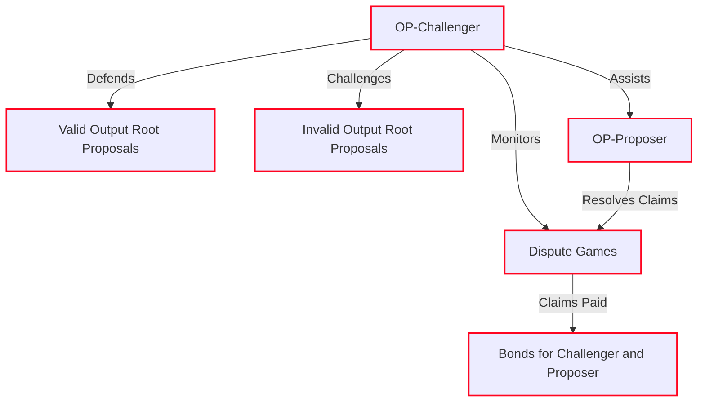

<Callout>
  The `cannon` and `op-program` executables are run in the `op-challenger` docker container as sub-processes when required to generate game trace data.
</Callout>

## Fault detection responses

`op-challenger` assesses each claim's validity, countering only those deemed invalid, following this logic:

1.  If the trusted node agrees with the output, `op-challenger` takes no action. An honest challenger does nothing because there are no claims it disagrees with. It continues to monitor the game in case someone posts a counter-claim to the valid root claim, in which case the challenger will participate in the game to defend the proposal.
2.  If the trusted node disagrees, `op-challenger` posts a counter-claim to challenge the proposed output. In contrast to the above scenario, an honest challenger aims to delete any output roots that its trusted node disagrees with in order to claim the bond attached to it. The honest challenger assumes that their rollup node is synced to the canonical state and that the fault proof program is correct, so it is willing to put its money on the line to counter any faults.

## Fault dispute game responses

`op-challenger` iterates through claims as stored in the contract, ensuring ancestors are processed before their descendants. For each claim, the honest challenger determines and tracks the set of honest responses to all claims, regardless of whether that response already exists in the full game state.

### Root claim

The root claim is considered to be an honest claim if and only if it has a [state witness Hash](https://specs.optimism.io/fault-proof/stage-one/fault-dispute-game.html#claims) that agrees with the honest challenger's state witness hash for the root claim.

### Counter claims

When a new claim is made in a dispute game, the honest challenger processes it and performs a response. The honest challenger should counter a claim if and only if:

1.  The claim is a child of a claim in the set of honest responses
2.  The set of honest responses, contains a sibling to the claim with a trace index greater than or equal to the claim's trace index

<Callout>
  This implies the honest challenger never counters its own claim, since there is at most one honest counter to each claim, so an honest claim never has an honest sibling.
</Callout>

### Possible moves

The challenger monitors each game as new claims are added and reacts according to the [honest actor algorithm](https://specs.optimism.io/fault-proof/stage-one/honest-challenger-fdg.html) to defend valid proposals and invalidate invalid proposals. A **move** is a challenge against an existing claim and must include an alternate claim asserting a different trace (e.g., attack, defend, or step).

<br />

<Image src="/img/op-stack/protocol/challenger-moves.png" alt="Challenger Moves flow" width={700} height={600} />

<Callout type="warning">
  See the [specs](https://specs.optimism.io/fault-proof/stage-one/honest-challenger-fdg.html) for the full scope of the honest actor algorithm.
</Callout>

## Resolution

When one side of a `FaultDisputeGame`'s chess clock runs out, the honest challenger's responsibility is to resolve each claim in the game by calling the `resolveClaim` function on the `FaultDisputeGame` contract. Once the root claim's subgame is resolved, the challenger then finally calls the `resolve` function to resolve the entire game.

The `FaultDisputeGame` does not put a time cap on resolution - because of the liveness assumption on honest challengers and the bonds attached to the claims they've countered, challengers are economically motivated to resolve the game quickly, thereby liquidating their funds and securing rewards.

## Next steps

*   Ready to get started? Read our guide on how to [configure `op-challenger` on your OP Stack chain](/operators/chain-operators/tools/op-challenger).
*   For more info about how `op-challenger` works under the hood, [check out the specs](https://specs.optimism.io/fault-proof/stage-one/honest-challenger-fdg.html).

## FAQs

### If I don't have a blob archiver with access to historical data, can I lose the game?

Most likely, yes. If nobody has access to the historical data. All the honest actors work together without needing to coordinate offense because they're all trying to play the same moves. So, if there's only one honest actor that lacks a blob archiver, and the actor gets pushed down to the bottom half of the game (\~ 32 claims deep in the game), then challenger would log errors and wouldn't be able to respond without the blob archiver. The actor would have 3.5 days on their side of the game to address the problem by switching to a beacon node that does have blobs, and could then proceed as usual.

Note: An actor would only be pushed down to the bottom half of the game if the block being disputed is older than the blob retention period (\~18 days).  If valid proposals are resolving regularly, this is not possible because each valid proposal becomes the starting point for newly created dispute games. So if there are regular valid proposals, then only \~3.5 days worth of blocks are normally being disputed, which is well within the retention period.

### How many CPUs should I run for challenger to work efficiently?

The default `--max-concurrency` setting suits most operators. Increase it if the challenger lags, or decrease it if it overloads with requests.

### How much ETH do you need to challenge in a game?

The honest challengers need to have more combined ETH than the attacker, or they may run out of funds and be unable to respond to games (requiring the security overrides to be used to protect funds). So, there's no strict amount challengers need to have, but here are some general guidelines chain operators can use to estimate:

*   Generally speaking, a minimum to play 1 game = bond amount \* game max depth + gas costs for each move
*   To play one game all the way down to the final step call in a single "chain" costs just over 631.2 ETH in total, so about 315.6 ETH per "side".

### What is the bond? What is the bond's role in the FP system?

Each *claim* pays a bond, including the root claim created when the game is created (thus the bond is paid when the game is created). Every time a new claim posts to the game, an additional bond must be paid based on the depth of the claim being posted. It is not necessary to prepay bonds (i.e., its not like staking). Instead, the bond amount is sent as the value of the transaction when calling `attack` or `defend` on `FaultDisputeGame` or calling `create` on `DisputeGameFactory`.

Claims that are found to be correct have their bonds refunded. Claims that are found to be incorrect have their bonds paid to the account that posted the left-most uncountered child claim of the incorrect claim. More importantly, the bond for invalid claims is paid to whoever successfully counters the claim, but its setup so that the bond is only ever paid to a single person and never shared.

*   There is a delay on claiming bonds of 7 days after the claim is resolved.
*   The 7-day period restarts each time a new bond from that game is paid to the same user. Typically this means that bonds are claimable 7 days after the game is resolved.

The calculation for the bond amounts are hard-coded in the [`FaultDisputeGame` contract](https://github.com/ethereum-optimism/optimism/blob/547ea72d9849e13ce169fd31df0f9197651b3f86/packages/contracts-bedrock/src/dispute/DisputeGameFactory.sol#L99-L100), and there's a `getRequiredBond` method on the contract that suggests what bond to use.

### How much ETH is required for the challenger bond?

The dispute game factory has the bond value set. To ensure correct game outcomes, the combined funding of all honest actors must be more than the funding available to an attacker. Otherwise the attacker can just post so many claims that the honest actors run out of funds and can no longer counter them. There isn't a fixed amount that guarantees this, so chain operators should have significant funds available at short notice to respond to claims.

Given the guardian can intervene and reallocate bond payments if needed, attackers who try to outspend the honest actors are guaranteed to lose their funds because the guardian will just intervene and pay all their bonds to the honest actors which is a very strong disincentive against trying to win games by outspending people.

---


### Fault proofs explainer

> Learn about the OP Stack's Fault Proof System.

*source: `stack/fault-proofs/explainer.mdx`*

import { Callout } from 'nextra/components'
import Image from 'next/image'

# Fault proofs explainer

Fault Proofs are an important part of an Optimistic Rollup system like the OP Stack.
Users withdraw ETH and tokens from OP Stack chains like OP Mainnet by submitting a withdrawal proof that shows the withdrawal was actually included in the OP Stack chain.
Fault Proofs allow users to permissionlessly submit and challenge the proposals about the state of an OP Stack chain that are used to prove withdrawals.

On June 10, 2024, Fault Proofs were officially added to the OP Stack and were activated on OP Mainnet.
This Fault Proofs upgrade moves the OP Stack closer to technical decentralization by:
*   allowing anyone to make proposals about the state of the L2
*   allowing anyone to challenge proposals made by other users
*   allowing users to send messages from L2 to L1 without the need for a trusted third party
*   allowing users to trigger withdrawals from L2 to L1 without the need for a trusted third party
*   introducing a modular fault proof design that can easily integrate additional proving mechanisms

Although the fault proof game is permissionless, the Optimism Security Council acting as the Guardian role provides a backstop in case of a failure in the fault proof game.
Each proposal must wait for a delay period during which the Guardian can prevent invalid proposals from being used to withdraw ETH or tokens through a number of safety hatches.
The Guardian can also choose to shift the system to use a PermissionedDisputeGame, in which only specific `PROPOSER` and `CHALLENGER` roles can submit and challenge proposals.

## Permissionless proposals

"Proposals" or "State Proposals" are claims about the state of an OP Stack chain that are submitted to Ethereum through the `DisputeGameFactory` contract.
Proposals can be used for many things but are most commonly used by end-users to prove that they created a withdrawal on an OP Stack chain.
With the Fault Proofs upgrade to the OP Stack, proposals become permissionless and can be submitted by anyone.

See the permissionless fault proofs diagram below for more details:

<br />
<Image src="/img/op-stack/protocol/fp-permissionless.png" alt="Permissionless Fault Proofs flow" width={700} height={600} />

## Permissionless challenges

Because anyone can submit a proposal, it's important that invalid proposals can be challenged.
In [Optimistic Rollups like OP Stack Chains](/stack/rollup/overview) there is a \~1 week challenge period during which users can challenge a proposal if they believe it to be incorrect.
With the Fault Proofs upgrade to the OP Stack, challenges become permissionless and can be submitted by anyone.
Any user can run a node for the OP Stack chain in question and use the `op-challenger` tool to participate in the dispute process.

## Modular design and multi-layer security

The OP Stack Fault Proof System is [modular in design](/stack/fault-proofs/fp-components#system-design--modularity) and lays the groundwork for achieving a "multi-proof" system. This allows the OP Stack to support multiple proof systems alongside the initial [Cannon](/stack/fault-proofs/cannon) proof system.
With multiple proof systems in place, the OP Stack can be more resilient to potential attacks and bugs in any one proof system.

Additionally, the following [security safeguards](/stack/fault-proofs/fp-security) have been built around the game, as follows:

*   An off chain monitoring system has been set up to monitor all proposed roots and ensure they align with the correct state. See [`op-dispute-mon`](https://github.com/ethereum-optimism/optimism/blob/develop/op-dispute-mon/README.md?plain=1) for more details.
*   After a root is finalized through a game, an additional delay called the "airgap window" has been added before withdrawals can occur. During this period, the `GUARDIAN` role can reject the root.
*   A contract called `DelayedWETH` has been set up to hold the bonds and only allow payouts after a delay, so that bonds can be redirected towards the correct recipient in the case that a game resolves incorrectly.

## Next steps

*   Ready to get started? Review the [FP Components](fp-components) to learn how the different components work together to enhance decentralization in the Optimism ecosystem.
*   See the [Fault Proof Mainnet Security](/stack/fault-proofs/fp-security) to understand changes to `OptimismPortal` and `FaultDisputeGame` contracts.
*   For more info about how the FP system works under the hood, [check out the specs](https://specs.optimism.io/fault-proof/index.html).

## FAQs

### How many steps/transactions are required to settle a dispute (worst-case scenario)?

The maximum depth of a game is 73, but there can be any number of claims and counter-claims within a dispute game.
Due to the permissionless structure where many different actors can participate in the same game, a single claim may be countered by any number of different counter-claims, effectively combining multiple disputes into a single game.

### Are there any dependencies to consider when proposing a new state root (in the event of sequencer and proposer failure)?

Users can complete the full withdrawal cycle without depending on any privileged action.
The Guardian role can override the system by pausing withdrawals, blacklisting games, or reverting to a permissioned system.
As a result, the trust assumption is reduced to requiring only that the Guardian role does not act to intervene, inline with the stage 1 requirements.
### Since the roles of proposer and challenger will be open to everyone, are guides available outlining the best practices for running them?

It's not expected that normal users run `op-proposer` to regularly propose output roots.
Users would generally just propose a single output root if they need to withdraw and the chain operator isn't proposing outputs for them via direct calls to the `DisputeGameFactory` via Etherscan or using the [`create-game`](https://github.com/ethereum-optimism/optimism/tree/develop/op-challenger#create-game) subcommand of `op-challenger`.
Documentation for `op-challenger` is forthcoming.

### How much ETH should a chain operator put aside to operate the Fault Proof System?

The nominal operating cost of running FPs (i.e., assuming no invalid proposals or malicious actors) will depend on the initial bond set for the `FaultDisputeGame` and the frequency of posting proposals.
Assuming OP Mainnet parameters, where proposals will be posted hourly, that's 0.08 ETH per hour.
Assuming a 7 day dispute window, you'll need roughly 14 ETH (including gas costs) to make proposals.
If chains are using the similar FP deploy configs as OP Mainnet, it's recommended to stick to a 0.08 ETH initial bond.

However, the capital requirements for operating a FP chain in itself are much larger than 14 ETH.
An operator that secures their chain using FPs must be willing to stake a lot of ETH to secure the chain.
One may decide the capital requirements aren't worth it, and use only a Permissioned FP system.
The capital requirements will be improved in the later stages of Fault Proofs to make it more feasible for smaller chains.

### How large are the bonds expected to be needed to sustain and win a dispute?

The bonds are sized based on the anticipated cost to post a counter-claim as well as to deter spamming invalid claims.
As an example, on OP Sepolia, the game [`0xcf8f181497DAD07277781517A76cb131C54A1BEE`](https://sepolia.etherscan.io/address/0xcf8f181497DAD07277781517A76cb131C54A1BEE) shows the escalating bond sizes.
The list-claims subcommand of op-challenger can also provide a good view of the claims in the game:

```
./op-challenger/bin/op-challenger list-claims --l1-eth-rpc <SEPOLIA_L1> --game-address 0xcf8f181497DAD07277781517A76cb131C54A1BEE
```

See the [specs](https://specs.optimism.io/experimental/fault-proof/stage-one/bond-incentives.html) for more details.

---


### FP system components

> Learn about Fault Proof System components and how they work together to enhance decentralization in the Optimism ecosystem.

*source: `stack/fault-proofs/fp-components.mdx`*

import Image from 'next/image'
import { Callout } from 'nextra/components'

# FP system components

This page explains the fault proof system components and how they work together to enhance decentralization in the Optimism ecosystem.

The Fault Proof System is comprised of three main components: a Fault Proof Program (FPP), a Fault Proof Virtual Machine (FPVM), and a dispute game protocol.
The system is designed to eventually enable secure bridging without central fallback.
The modular design of the Fault Proof System lays the foundation for a multi-proof future, inclusive of ZK proofs, and significantly increases the opportunities for ecosystem contributors to build alternative fault proof components to secure the system.

<Callout type="info">
  Visit the [Immunefi bug bounty page](https://immunefi.com/bounty/optimism/) for details on testing and helping to build a robust fault proof system.
</Callout>

## System design & modularity

The Fault Proof System is comprised of three main components: a Fault Proof Program (FPP), a Fault Proof Virtual Machine (FPVM), and a dispute game protocol.
These components will work together to challenge malicious or faulty activity on the network to preserve trust and consistency within the system.
See the video below for a full technical walkthrough of the OP Stack's first fault proof system.

<iframe width="560" height="315" src="https://www.youtube.com/embed/nIN5sNc6nQM?si=TL9TcoV01PNcD8D2" title="Walkthrough: OP Stack Fault Proof System Alpha Release" frameborder="0" allow="accelerometer; autoplay; clipboard-write; encrypted-media; gyroscope; picture-in-picture; web-share" allowfullscreen />

The OP Stack's unique, modular design allows the decoupling of the FPP and FPVM, resulting in the following:

*   development of multiple proof systems, unique dispute games, and a variety of FPVMs in the future.
*   custom-built Fault Proof Systems comprised of any combination of these isolated components—including validity proofs, attestation proofs, or ZKVM.
*   dispute games in the dispute protocol backed by multiple security mechanisms.

## Fault proof program

The default for this system component is `op-program`, which implements a fault proof program that runs through the rollup state-transition to verify an L2 output from L1 inputs. This verifiable output can then resolve a disputed output on L1.
The FPP is a combination of `op-node` and `op-geth`, so it has both the consensus and execution "parts" of the protocol in a single process. This means Engine API calls that would normally be made over HTTP are instead made as direct method calls to the op-geth code.

The FPP is designed so that it can be run in a deterministic way such that two invocations with the same input data will result in not only the same output, but the same program execution trace. This allows it to be run in an onchain VM as part of the dispute resolution process.

All data is retrieved via the [Preimage Oracle API](https://specs.optimism.io/experimental/fault-proof/index.html#pre-image-oracle). The preimages could be provided via the FPVM when onchain or by a native "host" implementation that can download the required data from nodes via JSON-RPC requests. The native host implementation is also provided by `op-program` but doesn't run as part of the onchain execution.  Basically, `op-program` has two halves: the "client" Fault Proof Program part covered in this section and the "host" part used to fetch required preimages.

## Fault proof virtual machine

The Fault Proof Virtual Machine (FPVM) is one of the modules in the OP Stack's fault proof system.
OP Stack's modularity decouples the Fault Proof Program (FPP) from the Fault Proof Virtual Machine (FPVM) to enable next-level composability and efficient parallelized upgrades to both components. The FPP (client-side) that runs within the FPVM is the part that expresses the L2 state-transition, and the interface between FPVM and FPP is standardized and documented in the [specs](https://github.com/ethereum-optimism/optimism/blob/546fb2c7a5796b7fe50b0b7edc7666d3bd281d6f/specs/cannon-fault-proof-vm.md).

Through this separation, the VM stays ultra-minimal: Ethereum protocol changes, like EVM op-code additions, do not affect the VM. Instead, when the protocol changes, the FPP can simply be updated to import the new state-transition components from the node software. Similar to playing a new version of a game on the same game console, the L1 proof system can be updated to prove a different program.

The FPVM is tasked with lower-level instruction execution. The FPP needs to be emulated. The VM requirements are low: the program is synchronous, and all inputs are loaded through the same pre-image oracle, but all of this still has to be proven in the L1 EVM onchain.
To do this, only one instruction is proven at a time. The bisection game will narrow down the task of proving a full execution trace to just a single instruction. Proving the instruction may look different for each FPVM, but generally it looks similar to Cannon, which proves the instruction as follows:

*   To execute the instruction, the VM emulates something akin to an instruction-cycle of a thread-context: the instruction is read from memory, interpreted, and the register-file and memory may change a little.
*   To support the pre-image oracle, and basic program runtime needs like memory-allocation, the execution also supports a subset of linux syscalls. Read/write syscalls allow interaction with the pre-image oracle: the program writes a hash as request for a pre-image, and then reads the value in small chunks at a time.

[Cannon](cannon) is the default FPVM used in all disputes. [MIPS](mips) is the onchain smart contract implementation of Cannon that can be implemented due to the modularity of the dispute game.

## Dispute game protocol

In the Dispute protocol, different types of dispute games can be created, managed, and upgraded through the [DisputeGameFactory](https://github.com/ethereum-optimism/optimism/blob/6a53c7a3294edf140d552962f81c0f742bf445f9/packages/contracts-bedrock/src/dispute/DisputeGameFactory.sol#L4).
This opens the door to innovative features, like aggregate proof systems and the ability to expand the protocol to allow for disputing things apart from the state of L2, such as a `FaultDisputeGame` geared towards onchain binary verification.

A dispute game is a core primitive to the dispute protocol. It models a simple state machine, and it is initialized with a 32 byte commitment to any piece of information of which the validity can be disputed.
They contain a function to resolve this commitment to be true or false, which is left for the implementer of the primitive to define. Dispute games themselves rely on two fundamental properties:

*   Incentive Compatibility: The system penalizes false claims and rewards truthful ones to ensure fair participation.
*   Resolution: Each game has a mechanism to definitively validate or invalidate the root claim.

The standard is the bisection game. This is a specific type of dispute game, and the first game built in the OP Stack's dispute protocol.
We bisect over output roots (which each correspond to single L2 blocks), until we get to a single block `n -> n+1` state transition. Then, we bisect over a single block state transition's execution trace as described before. This is an optimization to reduce the runtime of the off-chain VM.
After bisection has reached commitments to the state at individual trace instructions, the `FaultDisputeGame` executes a single instruction step on chain using a generic VM.
The VM's state transition function, which we'll call `T`, can be anything, so long as it adheres to the form `T(s, i) -> s'`, where `s` = the agreed upon prestate, `i` = the state transition inputs, and `s'` = the post state.

The first full implementation of the VM generic in the bisection game includes a single MIPS thread context on top of the EVM to execute a single instruction within an execution trace generated by `Cannon` and the `op-program`.

## Next steps

*   For more detail on Cannon and its default operation as part of Optimism's Fault Proof Virtual Machine, see [Cannon FPVM](cannon).
*   For a detailed walk-thru of significant changes to Fault Proof Mainnet, see [FP Mainnet Security](fp-security).
*   For detailed information about the entire FP program, FP virtual machine, and dispute game, see the [specs](https://specs.optimism.io/fault-proof/index.html).

---


### Fault proofs Mainnet security

> Learn about changes to the security model for the Fault Proofs Mainnet System.

*source: `stack/fault-proofs/fp-security.mdx`*

import { Callout } from 'nextra/components'

# Fault proofs Mainnet security

<Callout type="info">
  Source code for Fault Proof Mainnet contracts approved by Optimism Governance can be found [here](https://github.com/ethereum-optimism/optimism/tree/op-contracts/v1.5.0).
</Callout>

This page details changes to the security model of the OP Stack with the introduction of the Fault Proof Mainnet upgrade.
The most significant change introduced by the Fault Proof Mainnet upgrade is the modification of the `OptimismPortal` to reference the `DisputeGameFactory` instead of the permissioned `L2OutputOracle`.
*   The `DisputeGameFactory` contract generates `FaultDisputeGame` contract instances that each act as a host to a proposal about the state of the OP Stack chain at a given block number.
*   Unlike the `L2OutputOracle`, the `DisputeGameFactory` contract offers users the ability to permissionlessly play "fault dispute games" in which the correctness of the proposal is determined programmatically.

## Security model

Fault Proof Mainnet is a large contract upgrade that introduces a number of novel components.
Given the relative complexity of these novel components, the approach to security for FPM has been to limit the blast radius of potential bugs to very specific contracts and fallback mechanisms that can be easily audited.

### Handling invalid game results

All of the security mechanisms put in place generally revolve around the possibility that a `FaultDisputeGame` contract may incorrectly finalize an invalid game result.
There are two variations of this:

1.  Resolving that an invalid proposal is valid potentially leading to stolen funds, and 
2.  Resolving that a valid proposal is invalid causing liveness delays or failures.

Both cases would cause honest challengers to lose bonds (unless the `Guardian` stepped in). Potential impact is managed through the introduction of a number of safeguards within the `OptimismPortal` and `FaultDisputeGame` contracts.

### Safeguards within `OptimismPortal`

The `OptimismPortal` contract includes various security mechanisms that allow the `Guardian` and `SystemOwner` roles to collaborate to prevent invalid proposals from impacting withdrawals.

*   The `SystemOwner` can replace the `Guardian` address.
*   The `Guardian` can trigger the global pause mechanism found in the original system.
*   The `Guardian` can "blacklist" specific `FaultDisputeGame` contracts that resolve incorrectly.
*   The `Guardian` can change the respected type of `FaultDisputeGame` contract in the case that an entire class of `FaultDisputeGame` contracts is found to have critical bugs. If desired, the `Guardian` can also choose to revert to a `PermissionedDisputeGame` contract that only allows specific roles to submit and challenge proposals.

### Safeguards within `FaultDisputeGame`

The `FaultDisputeGame` contracts store bonds within a `DelayedWETH` contract that is managed by the `SystemOwner`. Withdrawals from the `DelayedWETH` contract are delayed which gives the `SystemOwner` the ability to manually recover from situations in which bonds would be incorrectly distributed. This delay is set to 7 days on OP Mainnet to give the `SystemOwner` or `Guardian` sufficient time to respond to potential security concerns.

### Safeguards within `DelayedWETH`

*   The `SystemOwner` can replace the `Guardian` address.
*   The `SystemOwner` can hold funds from any specific `DisputeGame` contract.
*   The `SystemOwner` can remove funds from the `DelayedWETH` contract if the issue extends to so many `DisputeGame` contracts that holding funds from specific contracts is not viable.
*   The `Guardian` can trigger the global pause mechanism to halt WETH withdrawals.

### Cumulative security impact

As with the original system, the cumulative effect of these security capabilities is that the `Guardian` role provides fast response capabilities while the `SystemOwner` can always step in to resolve all classes of bugs that could result in a loss of funds.
With the introduction of Fault Proof Mainnet, The most significant change in the security model is that `SystemOwner` can take a more passive role. Invalid proposals will generally be rejected by the Fault Proof System, while the `Guardian` can act as a backstop only in case of a failure in the fault proof game.

## Next steps

*   See the [FP Components](fp-components) for an overview of FP system components and how they work together to enhance decentralization in the Optimism ecosystem.
*   See the [specs](https://specs.optimism.io/fault-proof/index.html) for detailed information about the entire FP program, FP virtual machine, and dispute game.

---


### Fault proof VM: MIPS.sol

> Learn about the `MIPS.sol` smart contract that works as part of Optimism's Fault Proof Virtual Machine.

*source: `stack/fault-proofs/mips.mdx`*

import Image from 'next/image'
import { Callout } from 'nextra/components'

# Fault proof VM: MIPS.sol

The `MIPS.sol` smart contract is an onchain implementation of a big-endian virtual machine (VM) that encompasses the MIPS32 R1 Instruction Set Architecture (ISA).
This smart contract is the counterpart to the off-chain MIPSEVM golang implementation of the same ISA. Together, the onchain and off-chain VM implementations make up [Cannon](cannon),
Optimism's Fault Proof Virtual Machine (FPVM). Cannon is a singular instance of a FPVM that can be used as part of the Dispute Game for Optimism's (and Base's) optimistic rollup L2 blockchain.
The Dispute Game itself is modular, allowing for any FPVM to be used in a dispute; however, Cannon is currently the only FPVM implemented and thus will be used in all disputes.

## Control flow

The `FaultDisputeGame.sol` interacts with `MIPS.sol` and then `MIPS.sol` calls into `PreimageOracle.sol`. `MIPS.sol` is only called at the max depth of the game when someone needs to call `step`.
`FaultDisputeGame.sol` is the deployed instance of a Fault Dispute Game for an active dispute, and `PreimageOracle.sol` stores Pre-images.

*   Pre-images contain data from both L1 and L2, which includes information such as block headers, transactions, receipts, world state nodes, and more. Pre-images are used as the inputs to the derivation process used to calculate the true L2 state, and subsequently the true L2 state is used to resolve a dispute game.
*   A Fault Dispute Game, at a high-level, will effectively determine what L2 state is currently agreed-upon, and move through L2 state until the first disagreed-upon state is found. How the Pre-images are determined and populated into the `PreimageOracle.sol` contract is out-of-scope for this reference document on the `MIPS.sol` contract, as that contract only consumes Pre-images that have already been populated by the off-chain Cannon implementation.

The `MIPS.sol` contract is called by a running instance of a dispute game (i.e. by a `FaultDisputeGame.sol` contract), and is only called once a dispute game reaches a leaf node in the state transition tree that is currently being disputed.
A leaf node represents a single MIPS instruction (in the case that we're using Cannon as the FPVM) that can then be run onchain. Given a Pre-image, which is the previously agreed-upon L2 state up until this instruction, and the instruction
state to run in the `MIPS.sol` contract, the fault dispute game can determine the true post state (or Post-image). This true post state will then be used to determine the outcome of the fault dispute game by comparing the disputed post-state
at the leaf node with the post-state proposed by the disputer.

## Contract state

The `MIPS.sol` contract only contains a single immutable variable, which corresponds to the address of the `PreimageOracle.sol` contract.
Otherwise, the contract is stateless, meaning that all state related to playing a MIPS instruction onchain comes from either the `FaultDisputeGame.sol` instance, or the `PreimageOracle.sol`.
Having a stateless `MIPS.sol` contract means that it can be used by any fault dispute game that is using the Cannon FPVM; the `MIPS.sol` contract does not need to be re-deployed per fault dispute game instance.
Subsequently, any fault dispute game that is using the same `MIPS.sol` contract will also share the same `PreimageOracle.sol` contract.
Note that the `PreimageOracle.sol` contract is stateful, but how state is stored in the contract and differentiated between different fault dispute game instances is out-of-scope for this document.

While the `MIPS.sol` contract is stateless, meaning it does not store state in the contract directly, the contract does require up to 3 different types of witness data in order to perform a single MIPS instruction onchain:

*   Packed VM execution state
*   Memory proofs
*   Pre-images

The Pre-images have already been discussed above, so we will discuss the packed VM execution state and the memory proofs.
As a final note on Pre-images during onchain execution, it is entirely possible that the `MIPS.sol` contract never runs a MIPS instruction onchain that requires the contract to read from `PreimageOracle.sol` .
There is no requirement to read from the `PreimageOracle.sol` during instruction execution, but that doesn't mean the `PreimageOracle.sol`  contract is not being used.
The Pre-image information that has been read in previous off-chain instructions leading up to the execution of a single instruction onchain may still reside in the constructed VM memory.
Thus, even when the instruction run onchain does not explicitly read from `PreimageOracle.sol` , Pre-image data may still influence the merkle root that represents the VM's memory.

### Packed VM execution state

In order to execute a MIPS instruction onchain, the `MIPS.sol` contract needs to know important state information such as the instruction to run, the values in each of the general purpose registers, etc.
More specifically, a tightly-packed `State` struct contains all the relevant information that the `MIPS.sol` contract needs to know. This struct is passed to the contract from the `FaultDisputeGame.sol` contract when it invokes the `step` function in `MIPS.sol` (which in-turn executes a single MIPS instruction onchain).
The following information is stored in the `State` struct. See [doc reference](https://specs.optimism.io/experimental/fault-proof/cannon-fault-proof-vm.html#state) and [code reference](https://github.com/ethereum-optimism/optimism/blob/546fb2c7a5796b7fe50b0b7edc7666d3bd281d6f/packages/contracts-bedrock/src/cannon/MIPS.sol#L26) for details:

1.  `memRoot` - The merkle root hash of the binary merkle tree that represents the MIPS VM's monolithic 32-bit memory space.
2.  `preimageKey` - Key that uniquely identifies the Pre-image data to be read (if applicable) from the `PreimageOracle.sol`  contract.
3.  `preimageOffset` - Each Pre-image is 32 bytes long, however the word size for 32-bit MIPS is 4 bytes. Therefore, only 4 bytes from a Pre-image will be read during a read syscall. The `preimageOffset` serves as the offset into the Pre-image being read, so that an instruction can continue reading a Pre-image 4 bytes at a time.
4.  `pc` - The program counter, which points to the memory location that contains the MIPS instruction to execute onchain.
5.  `nextPC` - The next program counter, which functions similarly to the program counter except that it points to the next instruction to be executed onchain. Note that the next instruction may or may not be `PC + 8` in the event of a branch or jump instruction. Additionally, the `nextPC` effectively functions as the [branch delay slot](https://en.wikipedia.org/wiki/MIPS_architecture#cpu_instructions) for the MIPS ISA.
6.  `lo` - Special purpose 32-bit register that stores the low-order 32-bits from certain multiplication instructions (or special move instructions that store into this register).
7.  `hi` - Special purpose 32-bit register that stores the high-order 32-bits from certain multiplication instructions (or special move instructions that store into this register)
8.  `heap` - Pointer to the most recent memory allocation returned via the `mmap` syscall.
9.  `exitCode` - `uint8` value that represents UNIX exit status code of the VM.
10. `exited` - Boolean that indicates whether the VM has exited or not.
11. `step` - Counts the total number of instructions that have been executed.
12. `registers` - Array of 32, 32-bit values that represent the general purpose registers for the MIPS ISA.

### State hash

The state hash is the `bytes32` value returned to the active Fault Dispute Game upon the completion of a single MIPS instruction in the `MIPS.sol` contract.
The hash is derived by taking the `keccak256` of the above packed VM execution `State` struct, then replacing the first byte of the hash with a value that represents the status of the VM.
This value is derived from the `exitCode` and `exited` values, and can be:

*   Valid (0)
*   Invalid (1)
*   Panic (2) or
*   Unfinished (3)

The reason for adding the VM status to the state hash is to communicate to the dispute game whether the VM determined the proposed output root was valid or not.
This in turn prevents a user from disputing an output root during a dispute game, while providing the state hash from a cannon trace that actually proves the output root is valid.

### Memory proofs

Using a 32-bit ISA means that the total size of the address space (assuming no virtual address space) is `2^32 = 4GiB`. Additionally, the `MIPS.sol` contract is stateless, so it does not store the MIPS memory in contract storage. The primary reason for this is because having to load the entire memory into the `MIPS.sol` contract in order to execute a single instruction onchain is prohibitively expensive. Additionally, the entire memory would need to be loaded per fault proof game, requiring multiple instances of the `MIPS.sol` contract. Therefore, in order to optimize the amount of data that needs to be provided per onchain instruction execution while still maintaining integrity over the entire 32-bit address space, Optimism has converted the memory into a binary merkle tree.

The binary merkle tree (i.e. hash tree) used to store the memory of the MIPS VM has leaf values that are 32 bytes and has a fixed depth of 27 levels. This in turn allows the binary merkle tree to span the full 32-bit address space: `2^27 * 32 = 2^32` (See [memory proofs](https://github.com/ethereum-optimism/optimism/blob/546fb2c7a5796b7fe50b0b7edc7666d3bd281d6f/cannon/docs/README.md#memory-proofs) for more details). In order to ensure the integrity of the entire address space each time memory is read or written to, one or more memory proofs are provided by the FaultDisputeGame.sol contract each time a MIPS instruction is executed onchain in MIPS.sol. A memory proof consists of the current leaf value and 27 sibling nodes (28, 32-byte values in total), where the sibling nodes are the `keccak256` hash of its own child nodes. Using the leaf value, its 27 sibling nodes, and the memory address converted to its binary representation as a guide (0 or 1 tells the order to concatenate left and right values), we can calculate a merkle root. This merkle root should be exactly the same as the merkle root stored in the VM execution State struct.

Reading to memory and writing to memory work similarly, both involve calculating the merkle root. In the case of a memory write, `MIPS.sol` must take care to verify that the provided proof for the memory location to write to is correct. Additionally, writing to memory will change the merkle root stored in the VM execution `State` struct.

### State calculation

While the MIPS.sol contract may only execute a single instruction onchain, the off-chain Cannon implementation executes all prerequisite MIPS instructions for all state transitions in the disputed L2 state. These transitions are required to reach the disputed instruction that will be executed onchain. This ensures that the MIPS instruction executed onchain has the correct VM state and necessary Pre-images stored in the `PreimageOracle.sol`  contract to generate the true post-state that can be used to resolve the dispute game.

## Functions

### oracle

The external view [`oracle`](https://github.com/ethereum-optimism/optimism/blob/546fb2c7a5796b7fe50b0b7edc7666d3bd281d6f/packages/contracts-bedrock/src/cannon/MIPS.sol#L65) function is a getter function that returns the PreimageOracle address cast as a `IPreimageOracle` interface.

### SE

The internal pure [`SE`](https://github.com/ethereum-optimism/optimism/blob/546fb2c7a5796b7fe50b0b7edc7666d3bd281d6f/packages/contracts-bedrock/src/cannon/MIPS.sol#L70) function performs a sign-extension (SE) on the provided `uint32` value given the number of bits that currently represents the value. While the function operates over an unsigned integer, it follows the typical procedure for [sign-extension of signed values](https://en.wikipedia.org/wiki/Two%27s_complement#Sign_extension) represented using two's complement.

### outputState

The internal [`outputState`](https://github.com/ethereum-optimism/optimism/blob/546fb2c7a5796b7fe50b0b7edc7666d3bd281d6f/packages/contracts-bedrock/src/cannon/MIPS.sol#L81) function computes the `keccak256` hash of all values in the VM execution `State` struct, and then masks the first two bits of the hash with the current status of the VM as derived from the `exitCode` and `exited` values. Despite the complexity of the function (due to the use of assembly), the implementation is effectively tightly packing all the variables in the `State` struct together, then taking the `keccak256` of the packed bytes. A Solidity equivalent implementation can be viewed in the [`outputState`](https://github.com/ethereum-optimism/optimism/blob/546fb2c7a5796b7fe50b0b7edc7666d3bd281d6f/packages/contracts-bedrock/test/MIPS.t.sol#L1574) function located in the foundry test suite.

### handleSyscall

The internal [`handleSyscall`](https://github.com/ethereum-optimism/optimism/blob/546fb2c7a5796b7fe50b0b7edc7666d3bd281d6f/packages/contracts-bedrock/src/cannon/MIPS.sol#L145) function handles the syscall MIPS instruction. Only a subset of all syscall numbers are supported by the `MIPS.sol` contract; however, any syscall that is not explicitly supported will return 0s instead of reverting. Most syscalls that are supported partially mimic the behavior specified by the linux manual pages. The two most important syscall numbers that are supported are read and write.

#### syscall read

When given file descriptor 5 as the target of the read syscall, `handleSyscall` will call the `PreimageOracle.sol`  contract to read a 32-byte Pre-image at the current location determined by the `preimageKey` stored in the VM execution `State` struct. Once the 32-byte Pre-image has been read, the function will then determine the number of bytes to read (up to 4 bytes) and the location in memory to store the bytes. The number of bytes to read may be any value between 1 and 4, depending on the alignment of the offset in the returned Pre-image and the alignment of the memory position to write the data to.

#### syscall write

When given the file descriptor 6 as the target of the write syscall, `handleSyscall` will not call the `PreimageOracle.sol`  contract to write a new Pre-image. Only the off-chain Cannon implementation writes to the `PreimageOracle.sol`  contract. Instead, the function computes the new value of the `preimageKey` given the 4-byte value that would be written to the `PreimageOracle.sol`  contract. Additionally, the function resets the `preimageOffset` to 0. It is expected that the off-chain Cannon implementation has already written the data to the `PreimageOracle.sol`  contract at the location of the newly-derived `preimageKey`.

### handleBranch

The internal [`handleBranch`](https://github.com/ethereum-optimism/optimism/blob/546fb2c7a5796b7fe50b0b7edc7666d3bd281d6f/packages/contracts-bedrock/src/cannon/MIPS.sol#L313) function handles the multiple branch opcodes and conforms to the MIPS specification for the instructions.

### handleHiLo

The internal [`handleHiLo`](https://github.com/ethereum-optimism/optimism/blob/546fb2c7a5796b7fe50b0b7edc7666d3bd281d6f/packages/contracts-bedrock/src/cannon/MIPS.sol#L377) function handles the multiplication, division, and move opcodes that interact with the `hi` and `lo` registers and conforms to the MIPS specification for the instructions.

### handleJump

The internal [`handleJump`](https://github.com/ethereum-optimism/optimism/blob/546fb2c7a5796b7fe50b0b7edc7666d3bd281d6f/packages/contracts-bedrock/src/cannon/MIPS.sol#L448) function handles J-type opcodes and conforms to the MIPS specification for the instructions.

### handleRd

The internal [`handleRd`](https://github.com/ethereum-optimism/optimism/blob/546fb2c7a5796b7fe50b0b7edc7666d3bd281d6f/packages/contracts-bedrock/src/cannon/MIPS.sol#L480) function handles storing a value into a specified register. Certain instructions may include a conditional value, which determines whether the value is stored in the register or not.

### proofOffset

The internal pure [`proofOffset`](https://github.com/ethereum-optimism/optimism/blob/546fb2c7a5796b7fe50b0b7edc7666d3bd281d6f/packages/contracts-bedrock/src/cannon/MIPS.sol#L508) function handles calculating the offset in calldata to the start of a memory proof given an index. The calldata is provided to this function via the top-level `step` function call. Looking at the calldata, there are two bytes values passed: `stateData` and `proof`. The `bytes stateData` value is the packed VM execution `State` struct, and the `bytes proof` value represents one or more memory proofs that may be necessary for the onchain execution of the MIPS instruction. The `stateData` and memory proof(s) are encoded in calldata using the [Solidity ABI encoding specification](https://docs.soliditylang.org/en/develop/abi-spec.html). Using this information, we can derive the hardcoded values that are being used in the `proofOffset` function:

| Offset Description                                                   | Num. Bytes     | Notes                                                                                                                                                                                      |
| -------------------------------------------------------------------- | -------------- | ------------------------------------------------------------------------------------------------------------------------------------------------------------------------------------------ |
| Start of the calldata                                                | 4              | Function selector                                                                                                                                                                          |
|                                                                      | 32             | Contains the offset to the first dynamic bytes argument aka `stateData`                                                                                                                    |
|                                                                      | 32             | Contains the offset to the second dynamic bytes argument aka `proof`                                                                                                                       |
|                                                                      | 32             | Contains the length of the first dynamic bytes argument `stateData`                                                                                                                        |
| Start + 100 bytes = Offset to the start of the packed `State` struct | 256            | 226 bytes for the packed VM execution `State` struct + 32-byte word alignment for calldata = 256 bytes                                                                                     |
|                                                                      | 32             | Contains the length of the `bytes calldata proof`                                                                                                                                          |
| Start + 388 bytes = Offset to the start of the memory proof(s)       | 28 \* 32 = 896 | The first memory proof (required), which is 28, 32-byte values where the first value is the leaf node and the 27 proceeding values are the sibling nodes used to calculate the merkle root |
|                                                                      | 28 \* 32 = 896 | Within the `bytes calldata proof` parameter, there can be either 1 or 2 memory proofs                                                                                                      |

### readMem

The internal pure [`readMem`](https://github.com/ethereum-optimism/optimism/blob/546fb2c7a5796b7fe50b0b7edc7666d3bd281d6f/packages/contracts-bedrock/src/cannon/MIPS.sol#L526) function is a helper function that, given a 32-bit address and an index to a memory proof in calldata, validates the leaf node using the memory proof and then returns the specific 4-byte value to read. Note that a leaf node is 32-bytes so at most `readMem` will only read 4-bytes due to the 32-bit MIPS architecture. The validation given a leaf node and its 27 sibling nodes follows the standard logic for verifying inclusion in a merkle tree. The address is used as the path in order to determine the order for hashing two nodes (or the leaf and a node) together. Once the top of the tree has been reached, and the merkle root calculated, the calculated root is checked against the merkle root stored in the VM execution `State` struct. Once the leaf node has been verified, the logic will shift to the correct location within the 32-bytes value to read from. Also note that `readMem` will always start at an aligned 4-byte location; therefore it is up to subsequent logic to determine the correct position within a 4-byte word in unaligned memory read or write situations.

### writeMem

The internal pure [`writeMem`](https://github.com/ethereum-optimism/optimism/blob/546fb2c7a5796b7fe50b0b7edc7666d3bd281d6f/packages/contracts-bedrock/src/cannon/MIPS.sol#L580) function is a helper function that, given a 32-bit address, an index to a memory proof in calldata, and a 32-bit value to write, calculates the new merkle root of the VM execution `State` struct.
Calculating the new merkle root follows the same logic as in the `readMem` function, except that the new value will be stored in the State struct. Note that `writeMem` does not verify the proof used to calculate the new merkle root.

<Callout type="warning">
  It is **critically important** that the memory proof being used is verified beforehand by calling the `readMem` function.
</Callout>

Also note that `writeMem`, similar to `readMem`, only works over 4-byte aligned words. Therefore, it is up to the logic that calls `writeMem` to generate a value to write such that if an unaligned memory write occurs, the value already reflects that.

### step

The public [`step`](https://github.com/ethereum-optimism/optimism/blob/546fb2c7a5796b7fe50b0b7edc7666d3bd281d6f/packages/contracts-bedrock/src/cannon/MIPS.sol#L624) function is the top-level call that executes a single MIPS instruction. This function will be called by an active dispute game in order to determine the true post state given a pre state and a MIPS instruction to run. At a high-level, the function performs the following steps:

1.  Verifies and unpacks the stateData variable into the VM execution `State` struct (in memory).
2.  Reads the instruction located at the program counter (`pc`).
3.  Interprets and executes the MIPS instruction according to the MIPS specification.
4.  Writes results to registers or memory (if applicable) and updates the VM execution `State` struct accordingly.

### execute

The internal pure [`execute`](https://github.com/ethereum-optimism/optimism/blob/546fb2c7a5796b7fe50b0b7edc7666d3bd281d6f/packages/contracts-bedrock/src/cannon/MIPS.sol#L793) function handles the execution of MIPS instructions that are not handled by other functions. The `execute` function primarily handles R-type instructions according to the MIPS specification, however other instructions will pass through this function. Instructions handled by other functions will simply return. Invalid or unsupported instructions will cause the `execute` function to revert.

## Common bitwise operation use cases

1.  Isolating certain bits from a number can be done using the & operator (and(x,y) in Yul), this is also known as generating a bitmask.
2.  Combining bits from two numbers together can be done using the | operator (or(x, y) in Yul).
3.  Modulo arithmetic can be expressed using the following bitwise operation: `x % y = x & (y - 1), ex. x % 4 = x & 3.` Note this is only equivalent for unsigned integers.
4.  Multiplication using a value with a base of 2 can be expressed using the following bitwise operation: `x * y = x << z, where y = 2^z`
    Ex. `x * 8 = x << 3, where 8 = 2^3`

## Table of supported MIPS instructions

| Instruction Name                               | Opcode Num. | Funct Num. | Other Num. |
| ---------------------------------------------- | ----------- | ---------- | ---------- |
| SYSCALL (System Call)                          | 0x00        | 0x0C       | -          |
| J (Jump)                                       | 0x02        | -          | -          |
| JR (Jump Register)                             | 0x00        | 0x08       | -          |
| JAL (Jump and Link)                            | 0x03        | -          | -          |
| JALR (Jump and Link Register)                  | 0x00        | 0x09       | -          |
| BEQ (Branch on Equal)                          | 0x04        | -          | -          |
| BNE (Branch on Not Equal)                      | 0x05        | -          | -          |
| BLEZ (Branch on Less Than or Equal to Zero)    | 0x06        | -          | -          |
| BGTZ (Branch on Greater Than Zero)             | 0x07        | -          | -          |
| BLTZ (Branch on Less Than Zero)                | 0x01        | -          | 0x00       |
| BGEZ (Branch on Greater Than or Equal to Zero) | 0x01        | -          | 0x01       |
| MOVZ (Move Conditional on Zero)                | 0x00        | 0x0A       | -          |
| MOVN (Move Conditional on Not Zero)            | 0x00        | 0x0B       | -          |
| MFHI (Move from HI)                            | 0x00        | 0x10       | -          |
| MTHI (Move to HI)                              | 0x00        | 0x11       | -          |
| MFLO (Move from LO)                            | 0x00        | 0x12       | -          |
| MTLO (Move to LO)                              | 0x00        | 0x13       | -          |
| MULT (Multiply Word)                           | 0x00        | 0x18       | -          |
| MULTU (Multiply Unsigned Word)                 | 0x00        | 0x19       | -          |
| DIV (Divide Word)                              | 0x00        | 0x1A       | -          |
| DIVU (Divide Unsigned Word)                    | 0x00        | 0x1B       | -          |
| ADD (Add Word)                                 | 0x00        | 0x20       | -          |
| ADDU (Add Unsigned Word)                       | 0x00        | 0x21       | -          |
| ADDI (Add Immediate Word)                      | 0x08        | -          | -          |
| ADDIU (Add Immediate Unsigned Word)            | 0x09        | -          | -          |
| SUB (Subtract Word)                            | 0x00        | 0x22       | -          |
| SUBU (Subtract Unsigned Word)                  | 0x00        | 0x23       | -          |
| SLT (Set on Less Than)                         | 0x00        | 0x2A       | -          |
| SLTU (Set on Less Than Unsigned)               | 0x00        | 0x2B       | -          |
| SLTI (Set on Less Than Immediate)              | 0x0A        | -          | -          |
| SLTIU (Set on Less Than Immediate Unsigned)    | 0x0B        | -          | -          |
| AND (And)                                      | 0x00        | 0x24       | -          |
| ANDI (And Immediate)                           | 0x0C        | -          | -          |
| OR (Or)                                        | 0x00        | 0x25       | -          |
| ORI (Or Immediate)                             | 0x0D        | -          | -          |
| XOR (Exclusive Or)                             | 0x00        | 0x26       | -          |
| XORI (Exclusive Or Immediate)                  | 0x0E        | -          | -          |
| NOR (Nor)                                      | 0x00        | 0x27       | -          |
| SLL (Shift Word Left Logical)                  | 0x00        | 0x00       | -          |
| SRL (Shift Word Right Logical)                 | 0x00        | 0x02       | -          |
| SRA (Shift Word Right Arithmetic)              | 0x00        | 0x03       | -          |
| SLLV (Shift Word Left Logical Variable)        | 0x00        | 0x04       | -          |
| SRLV (Shift Word Right Logical Variable)       | 0x00        | 0x06       | -          |
| SRAV (Shift Word Right Arithmetic Variable)    | 0x00        | 0x07       | -          |
| MUL (Multiply Word to Register)                | 0x1C        | 0x02       | -          |
| CLZ (Count Leading Zeros in Word)              | 0x1C        | 0x20       | -          |
| CLO (Count Leading Ones in Word)               | 0x1C        | 0x21       | -          |
| LUI (Load Upper Immediate)                     | 0x0F        | -          | -          |
| LL (Load Linked Word)                          | 0x30        | -          | -          |
| LB (Load Byte)                                 | 0x20        | -          | -          |
| LBU (Load Byte Unsigned)                       | 0x24        | -          | -          |
| LH (Load Halfword)                             | 0x21        | -          | -          |
| LHU (Load Halfword Unsigned)                   | 0x25        | -          | -          |
| LW (Load Word)                                 | 0x23        | -          | -          |
| LWL (Load Word Left)                           | 0x22        | -          | -          |
| LWR (Load Word Right)                          | 0x26        | -          | -          |
| SB (Store Byte)                                | 0x28        | -          | -          |
| SH (Store Halfword)                            | 0x29        | -          | -          |
| SW (Store Word)                                | 0x2B        | -          | -          |
| SWL (Store Word Left)                          | 0x2A        | -          | -          |
| SWR (Store Word Right)                         | 0x2E        | -          | -          |
| SC (Store Conditional Word)                    | 0x38        | -          | -          |
| SYNC (Synchronize Shared Memory)               | 0x00        | 0x0F       | -          |

## Further reading

*   [Cannon Overview](https://github.com/ethereum-optimism/optimism/blob/546fb2c7a5796b7fe50b0b7edc7666d3bd281d6f/cannon/docs/README.md)
*   [Cannon FPVM Specification](https://specs.optimism.io/experimental/fault-proof/cannon-fault-proof-vm.html)
*   [MIPS IV ISA Specification](https://www.cs.cmu.edu/afs/cs/academic/class/15740-f97/public/doc/mips-isa.pdf)
*   [MIPS32 Architecture For Programmers Volume II (for SPECIAL2 opcodes)](https://www.cs.cornell.edu/courses/cs3410/2008fa/MIPS_Vol2.pdf)
*   [MIPS Assembly Wiki Book](https://en.wikibooks.org/wiki/MIPS_Assembly)
*   [MIPS syscall numbers](https://github.com/torvalds/linux/blob/e2be04c7f9958dde770eeb8b30e829ca969b37bb/arch/mips/include/uapi/asm/unistd.h#L23)
*   [Yul Instructions](https://docs.soliditylang.org/en/latest/yul.html#evm-dialect)
*   [Solidity ABI Encoding Specification](https://docs.soliditylang.org/en/develop/abi-spec.html)

---


## Features

> Documentation covering Send Raw Transaction Conditional in the Features section of the OP Stack ecosystem.

*source: `stack/features.mdx`*

import { Card, Cards } from 'nextra/components'

# Features

Documentation covering Send Raw Transaction Conditional in the Features section of the OP Stack ecosystem.

<Cards>
  <Card title="SendRawTransactionConditional explainer" href="/stack/features/send-raw-transaction-conditional" />
</Cards>

---


### SendRawTransactionConditional explainer

> Learn about the eth_sendRawTransactionConditional RPC method for conditional transaction inclusion on the OP Stack.

*source: `stack/features/send-raw-transaction-conditional.mdx`*

import { Callout } from 'nextra/components'

# SendRawTransactionConditional explainer

A sequencer RPC method, `eth_sendRawTransactionConditional`, allows callers to conditionally include a transaction based on a set of provided options.

This feature is meant to unblock use cases that require atomic inclusion, otherwise possible on Ethereum through specialized block builders like Flashbots. Some examples:

*   4337 Bundlers utilizing a shared mempool of UserOperations. Reverted transactions due to conflicting UserOperations would make it too costly for bundlers to operate on L2, forcing the use of private mempools.

## Specification

This endpoint is an extension of `eth_sendRawTransaction`, with an extra parameter of "options" with the following structure:

```
{
    "knownAccounts": [optional] A map of accounts with expected storage. The key is account address
                                If the value is hex string, it is the known storage root hash of that account.
                                If the value is an object, then each member is in the format of "slot": "value", which are explicit slot values within that account storage.
    "blockNumberMin": [optional] minimal block number for inclusion
    "blockNumberMax": [optional] maximum block number for inclusion
    "timestampMin": [optional] minimum block timestamp for inclusion
    "timestampMax": [optional] maximum block timestamp for inclusion
}
```

The "cost" of a given conditional is *approximately* determined by the number of storage lookups that would be incurred by validating this conditional. There's a predefined max of `1000` that is allowed to prevent DoS.

<Callout type="info">
  Since the sequencer is not compensated for the additional state checks, otherwise through the GAS of the transaction, a configured rate limit is applied to this cost.

  To also discourage the use of this endpoint for MEV in comparison to `eth_sendRawTransaction`, the conditional is checked against the parent of the latest block.
</Callout>

This conditional is checked once at the RPC layer prior to mempool submission. If rejected against chain state, the RPC will return an error with the following spec

*   error code `-32003` (transaction rejected) with a reason string as to the specific failed check
*   error code `-32005` (conditional cost) with a reason string if the conditional cost exceeded the maximum OR the cost was rate limited due to network conditions.

Successful submission does **NOT** guarantee inclusion! The caller must observe the chain for a receipt with some timeout to determine non-inclusion. The conditional is also re-checked in the block building phase to handle intra-block conflicts.

<Callout type="warning">
  Conditional transactions are tied to the block builder they are submitted to. This means that these transactions **are not gossiped between configured peers!!!**

  If you are running an active/passive setup with replicas that gossip txs to an active sequencer, this endpoint should be fronted by a proxy that can broadcast the request to all replicas.
</Callout>

## How to enable

This feature can be enabled with the addition of a flag to op-geth.

*   `--rollup.sequencertxconditionalenabled` (default: false) a boolean flag which enables the rpc.
*   `--rollup.sequencertxconditionalcostratelimit` (default: 5000) an integer flag that sets the rate limit for cost observable per second. 

<Callout type="warning">
  It is not advised to publicly expose this sequencer endpoint due to DoS concerns. This supplemental proxy, [op-txproxy](/operators/chain-operators/tools/op-txproxy), should be used to apply additional constraints on this endpoint prior to passing through to the sequencer.
</Callout>

---


## Getting started with the OP Stack

> Learn the basics of OP Stack development.

*source: `stack/getting-started.mdx`*

import { Callout } from 'nextra/components'

# Getting started with the OP Stack

**The OP Stack is the standardized, shared, and open-source development stack that powers Optimism, maintained by the Optimism Collective.**

<Callout type="info">
  Stay up to date on the Superchain and the OP Stack by subscribing to the [Optimism Developer Blog](https://blog.oplabs.co/)
</Callout>

The OP Stack consists of the many different software components managed and maintained by the Optimism Collective that, together, form the backbone of Optimism.
The OP Stack is built as a public good for the Ethereum and Optimism ecosystems.
To understand how to operate an OP Stack chain, including roll-up and chain deployment basics, visit [Chain Operator guide](/operators/chain-operators/self-hosted). Check out these guides to get an overview of everything you need to know to properly support OP mainnet within your [exchange](/app-developers/get-started) and [wallet](/app-developers/get-started).

## The OP Stack powers Optimism

The OP Stack is the set of software that powers Optimism — currently in the form of the software behind OP Mainnet and eventually in the form of the Optimism Superchain and its governance.

With the advent of the Superchain concept, it has become increasingly important for Optimism to easily support the secure creation of new chains that can interoperate within the proposed Superchain ecosystem.
As a result, the OP Stack is primarily focused around the creation of a shared, high-quality, and fully open-source system for creating new L2 blockchains.
By coordinating on shared standards, the Optimism Collective can avoid rebuilding the same software in silos repeatedly.

Although the OP Stack today significantly simplifies the process of creating L2 blockchains, it's important to note that this does not fundamentally define what the OP Stack **is**.
The OP Stack is *all* of the software that powers Optimism.
As Optimism evolves, so will the OP Stack.

**The OP Stack can be thought of as software components that either help define a specific layer of the Optimism ecosystem or fill a role as a module within an existing layer.**
Although the current heart of the OP Stack is infrastructure for running L2 blockchains, the OP Stack theoretically extends to layers on top of the underlying blockchain including tools like block explorers, message passing mechanisms, governance systems, and more.

Layers are generally more tightly defined towards the bottom of the stack (like the Data Availability Layer) but become more loosely defined towards the top of the stack (like the Governance Layer).

## The OP Stack today

Optimism Bedrock is the current iteration of the OP Stack.
The Bedrock release provides the tools for launching a production-quality Optimistic Rollup blockchain.
At this point in time, the APIs for the different layers of the OP Stack are still tightly coupled to this Rollup configuration of the stack.

The OP Stack of today was built to support [the Optimism Superchain](/superchain/superchain-explainer), a proposed network of L2s that share security, communication layers, and a common development stack (the OP Stack itself).
The Bedrock release of the OP Stack makes it easy to spin up an L2 that will be compatible with the Superchain when it launches.
If you'd like to launch a Superchain-ready L2, check out our guide for running a chain based on the Bedrock release of the OP Stack.

It is possible to modify components of the OP Stack to build novel L2 systems.
If you're interested in experimenting with the OP Stack, check out [the OP Stack Hacks developers repo](https://github.com/ethereum-optimism/developers/tree/main/docs).
Please note that, as of the Bedrock release, the OP Stack is *not* designed to support these modifications and you will very much be *hacking* on the codebase.
As a result, **you should, for the moment, expect limited (if any) developer support for OP Stack Hacks.**
OP Stack Hacks will likely make your chain incompatible with the Optimism Superchain.
Have fun, but at your own risk and **stick to the Bedrock release if you're looking to join the Superchain!**

## The OP Stack tomorrow

The OP Stack is an evolving concept.
As Optimism grows, so will the OP Stack.
Today, the Bedrock Release of the OP Stack simplifies the process of deploying new L2 Rollups.
As work on the stack continues, it should become easier to plug in and configure different modules.
As the [Superchain](/superchain/superchain-explainer) begins to take shape, the OP Stack can evolve alongside it, to include the message-passing infrastructure that allows different chains to interoperate seamlessly.
At the end of the day, the OP Stack becomes what Optimism needs.

## Dive deeper into the OP Stack

Ready to dive into the world of the OP Stack?

*   If you're interested in understanding the OP Stack in more depth, start with the [Design Principles](/stack/design-principles).
*   If you're excited to join the Superchain, launch your first [Superchain-ready L2](/operators/chain-operators/self-hosted) or dive directly into the OP Stack codebase to learn more.

The OP Stack is the next frontier for Ethereum. You're already here, so what are you waiting for?

---


## Interop

> Documentation covering Cross Chain Message, Explainer, Message Passing, Op Supervisor, Superchain Erc20, Superchain Weth, Supersim, Transfer Superchainerc20 in the Interop section of the OP Stack ecosystem.

*source: `stack/interop.mdx`*

import { Card, Cards } from 'nextra/components'

# Interop

Documentation covering explainers and tutorials for using Superchain interop.

<Cards>
  <Card title="Superchain interop explainer" href="/stack/interop/explainer" icon={} />

  <Card title="Superchain interop architecture" href="/stack/interop/explainer#superchain-interoperability-architecture" icon={} />  

  <Card title="Superchain interop message passing" href="/stack/interop/message-passing" icon={} />

  <Card title="Superchain interop logs" href="/stack/interop/reading-logs" icon={} />

  <Card title="Superchain interop compatible tokens" href="/stack/interop/compatible-tokens" icon={} />

  <Card title="OP Supervisor" href="/stack/interop/op-supervisor" icon={} />

  <Card title="Supersim multichain development environment" href="/stack/interop/tools/supersim" icon={} />

  <Card title="Superchain interop devnet" href="/stack/interop/tools/devnet" icon={} />

  <Card title="Superchain interop predeploys" href="/stack/interop/predeploy" icon={} />

  <Card title="SuperchainERC20" href="/stack/interop/superchain-erc20" icon={} />

  <Card title="Superchain ETH" href="/stack/interop/superchain-weth" icon={} />

  <Card title="Tutorials" href="/stack/interop/tutorials" icon={} />

  <Card title="Tools" href="/stack/interop/tools" icon={} />

  <Card title="Superchain interop transaction safety" href="/stack/interop/interop-security" icon={} />

  <Card title="Superchain interop reorg awareness" href="/stack/interop/reorg" icon={}/>
</Cards>

---


### Superchain interop compatible tokens

> Learn how different tokens can use Superchain interop to benefit from secure, low-latency, cross-chain composability.

*source: `stack/interop/compatible-tokens.mdx`*

import { Callout } from 'nextra/components'
import { InteropCallout } from '@/components/WipCallout'

<Callout>
The SuperchainERC20 standard is ready for production use with active Mainnet deployments. 
Please note that the OP Stack interoperability upgrade, required for crosschain messaging, is currently still in active development.
</Callout>

# Superchain interop compatible tokens

Superchain interop enables **trust-minimized, 1-block latency cross-chain composability** on the [Superchain interop cluster](/stack/interop/explainer#superchain-interop-cluster).
The recommended approach for giving tokens Superchain interop capabilities is using [SuperchainERC20](/stack/interop/superchain-erc20), but there are other options depending on your needs.

## How to enable cross-chain token interoperability

Compared to traditional ERC-20 tokens deployments on a single blockchain, cross-chain tokens can move between different blockchains through giving `crosschainMint` and `crosschainBurn` permissions to a verification mechanism (such as a bridge protocol) that validates when tokens should be burned on one chain and minted on another.

For example when transferring a `SuperchainERC20` between chains in the Superchain interop cluster, the Superchain interop protocol ensures the tokens are burned on the source chain before authorizing the corresponding mint on the destination chain.

When enabling cross-chain functionality for your token, it is essential to evaluate the security, cost, and latency of the respective verification mechanism.


## Why use Superchain interop to enable cross-chain token interoperability

Apps built with Superchain interop can essentially teleport tokens from one blockchain to another, providing users with a secure, low-latency, and capital-efficient way to transact on the Superchain.

3rd party interop solutions for L2s often wait for Ethereum finalization (15min+) when transferring tokens from an L2 to mitigate the double spend problem. However, that solution results in high latency and poor user experience. 
Superchain interop is [reorg aware](./reorg) - this means users can transfer assets across chains in the Superchain with 1-block latency, and should a reorg happen, either both the source and destination transactions would remain, or both of them would revert. In every case, there is no window of opportunity to double spend. 
Low latency interop that mitigates the double spend problem is now possible with Superchain interop.

If a 3rd party interop solution is providing faster-than-Ethereum L1 finality (15min+) cross-chain composability but not using Superchain interop as its verification mechanism, you should be clear on how the solution is mitigating finality risk and what will happen in the event there is a double spend problem. 

## SuperchainERC20

`SuperchainERC20` is a simple and trust-minimized way to enable token interoperability within the Superchain. You can learn more about `SuperchainERC20` [here](/stack/interop/superchain-erc20).

*   **Security:** Fault Proofs secure Superchain interop end to end. No third-party dependencies to enable token interoperability.
*   **Latency:** 1-block latency within the Superchain interop cluster.
*   **Cost:** Gas on source chain and destination chain. 
*   **Cross-chain address:** Deterministic, no token registry required. 
*   **Supported ecosystem:** Superchain interop cluster.


## Considerations when using other token implementations

While the `SuperchainERC20` is a trust-minimized way to enable for giving your token Superchain interop capabilities, other token implementations can also benefit from Superchain interop. If you choose a token standard other than SuperchainERC20 here are a few things to consider:

#### ERC-7802
[`ERC-7802`](https://eips.ethereum.org/EIPS/eip-7802) is a minimal cross-chain mint/burn interface designed to establish a common standard across the EVM ecosystem for tokens to communicate cross-chain. Adding this interface to your token ensures downstream integrators can easily support your token.

#### SuperchainTokenBridge and L2ToL2CrossDomainMessenger
Tokens can benefit from Superchain interop by either giving cross-chain mint/burn permissions to the `SuperchainTokenBridge` or the `L2ToL2CrossDomainMessenger`. 

The [`SuperchainTokenBridge`](https://github.com/ethereum-optimism/optimism/blob/develop/packages/contracts-bedrock/src/L2/SuperchainTokenBridge.sol) is an abstraction built on top of the [`L2ToL2CrossDomainMessenger`](https://github.com/ethereum-optimism/optimism/blob/develop/packages/contracts-bedrock/src/L2/L2ToL2CrossDomainMessenger.sol) that facilitates token bridging using Superchain interop, but requires the token address be deterministic across chains. 

Alternatively, you can build a custom bridge using the `L2ToL2CrossDomainMessenger` to facilitate cross-chain mint/burns that **does not** require a deterministic address across chains but does require the token issuer to manage a token registry per chain. 

#### Cross-chain token address

When deploying your token cross-chain it is critical to ensure the verification mechanism knows what the valid address mapping to facilitate cross-chain mint/burns is. When using the `SuperchainTokenBridge`, there is an invariant that tokens must be deployed at a [deterministic address across chains](/stack/interop/superchain-erc20#requirements) in the Superchain interop cluster. This simplifies development experience by ensuring the token issuer does not need to manage a cross-chain token registry per chain. 

If using another verification mechanism you likely will need to maintain a token registry per chain that indicates the valid address mapping to facilitate cross-chain mint/burns when moving across chains. 


#### Weakest link scenario

If you allowlist both Superchain interop and a third-party verification mechanism, your token's security is only as strong as the weakest verification mechanism.

## Alternative token implementations

### xERC20 (ERC-7281)

xERC20 tokens are crosschain ERC-20 which can be transferred across chains by allowing the token owner to approve which bridges can mint/burn their token and the ability to set rate limits per bridge. You can learn more about xERC20 and Superchain interop [here](https://github.com/defi-wonderland/crosschainERC20).

*   **Security:** Variable due to weakest-link scenario based on allowlisted verification mechanisms.
*   **Latency:** 1-block latency in the Superchain. Outside the Superchain, latency is variable based on allowlisted verification mechanism.
*   **Cost:** Variable based on allowlisted verification mechanisms.
*   **Cross-chain address:** Deterministic or requires cross-chain registry per deployment.
*   **Supported ecosystem:** EVM

### OFT

OFT is a token standard used to send, receive, and compose tokens across chains LayerZero supports. More information will be added about how OFTs can benefit from Superchain interop at a later date. 

*   **Security:** Variable due to weakest-link scenario based on allowlisted verification mechanisms.
*   **Latency:** 1-block latency within the Superchain. Outside the Superchain, latency is variable based on allowlisted verification (DVN) mechanism.
*   **Cost:** Variable based on allowlisted verification mechanisms.
*   **Cross-chain address:** Requires cross-chain registry per deployment.
*   **Supported ecosystem:** EVM, Solana, MoveVM

### NTT

NTT is a token standard used to send, receive, and compose tokens across chains Wormhole supports. More information will be added about how NTTs can benefit from Superchain interop at a later date. 

*   **Security:** Variable due to weakest-link scenario based on allowlisted verification mechanisms.
*   **Latency:** 1-block latency within the Superchain. Outside the Superchain, latency is variable based on allowlisted verification (transceiver) mechanism.
*   **Cost:** Variable based on allowlisted verification mechanisms.
*   **Cross-chain address:** Requires cross-chain registry per deployment.
*   **Supported ecosystem:** EVM, Solana, MoveVM


## Key takeaways

*   `SuperchainERC20` is a simple and trust-minimized way for token issuers to make their token available across the Superchain interop cluster.
*   Token issuers can use other token standards (xERC20, OFT, NTT) and give  `crosschainMint` and `crosschainBurn` permissions to the `SuperchainTokenBridge` or `L2ToL2CrossDomainMessenger` to benefit from Superchain interop. 
*   Token issuers should include a [ERC-7802](https://eips.ethereum.org/EIPS/eip-7802) interface on their token to simplify downstream integrations.

## Next steps

*   Build a [revolutionary app](/app-developers/get-started) that uses multiple blockchains within the Superchain
*   Deploy a [SuperchainERC20](/stack/interop/tutorials/deploy-superchain-erc20) to the Superchain
*   [Learn more about SuperchainERC20](/stack/interop/superchain-erc20)

---


### Superchain interoperability explainer

> Learn the basics of Superchain interoperability.

*source: `stack/interop/explainer.mdx`*

import { Callout } from 'nextra/components'
import Image from 'next/image'

import { InteropCallout } from '@/components/WipCallout'

<InteropCallout />

# Superchain interoperability explainer

## Why do we need Superchain interoperability?

It is easy for a blockchain to be certain about information it generates itself.
Information that comes from other sources is harder to provide in a safe, decentralized, and uncensorable manner (this is called [The Oracle Problem](https://chain.link/education-hub/oracle-problem)).
The next major scalability improvement to the OP Stack is to enable a network of chains, the Superchain, to feel like a single blockchain.
This goal requires low-latency, seamless message passing and asset bridging.

*Superchain interoperability* is a set of protocols and services that lets OP Stack blockchains read each other's state.
Superchain interoperability provides the following benefits:

*   ETH and ERC-20 tokens to move securely between chains via native minting and burning.  Asset interoperability solves the issues of liquidity fragmentation and poor user experiences caused by asset wrapping or liquidity pools.
*   Apps to compose with data that exist on other chains.
*   Horizontal scalability for applications that need it.

## Superchain interoperability architecture

A pre-interop OP Stack node consists of two pieces of software: a consensus client (e.g. op-node) and an execution client, which is responsible for processing user transactions and constructing blocks (e.g. op-geth).
Superchain interoperability among OP Stack chains is enabled via a new service called [*OP Supervisor*](/stack/interop/op-supervisor).
Every node operator is expected to run this service in addition to the [rollup node](/operators/node-operators/architecture#rollup-node) and [execution client](/operators/node-operators/architecture#execution-client).

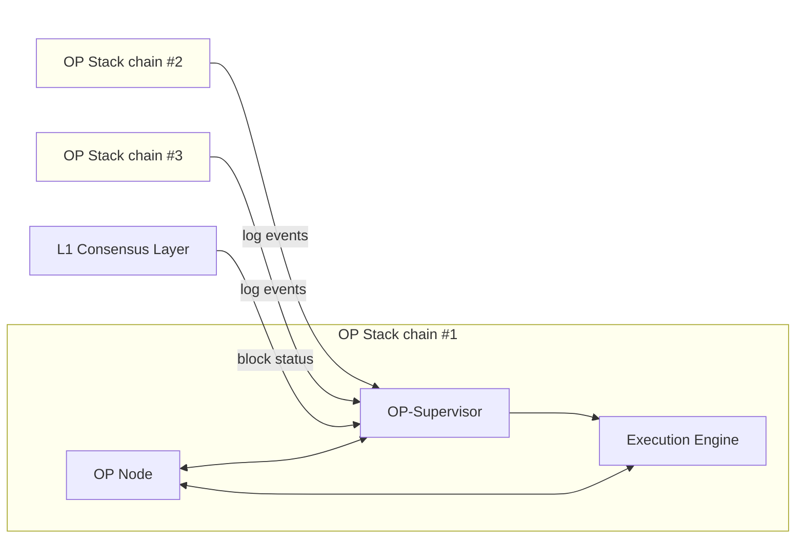

OP-Supervisor holds a database of all the log events of all the chains in the Superchain interoperability cluster.
Every event can potentially initiate a cross-domain message, and it is the job of OP-Supervisor to validate that the log event really happened on the source chain.
Additionally, OP-Supervisor reads information from L1's consensus layer to determine the transaction safety of L2 blocks.

## How messages get from one chain to the other

To understand *why* we need this additional service, it is useful to know how interop messages get from one OP Stack chain to another.

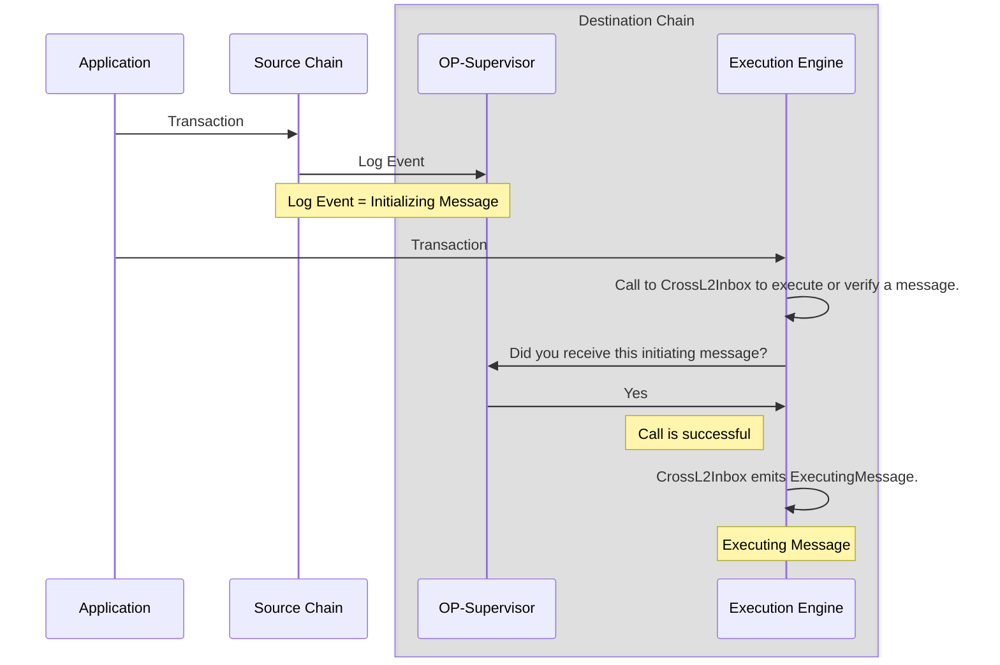

Cross-domain messages require two transactions.
The first transaction creates an *initiating message* on the source chain.
The second transaction creates an *executing message* on the destination chain.
This executing message could result in a contract function being executed on the destination chain.

The initiating message is simply a log event.
Any log event on any chain that interoperates with the destination can initiate a cross-domain message.

The transaction that receives the message on the destination chain calls a contract called [`CrossL2Inbox`](https://specs.optimism.io/interop/predeploys.html#crossl2inbox).
This call can be at the top level, directly from the externally owned account, or come through a smart contract.
The call to `CrossL2Inbox`, also known as the *executing message*, needs to [identify the initiating message uniquely](https://github.com/ethereum-optimism/optimism/blob/develop/packages/contracts-bedrock/src/L2/CrossL2Inbox.sol#L35-L42), using the chain ID of the source chain, the block number, and the index of the log event within that block, as well as a few other fields as a sanity check.

`CrossL2Inbox` can either [validate the message exists](https://github.com/ethereum-optimism/optimism/blob/develop/packages/contracts-bedrock/src/L2/CrossL2Inbox.sol#L171-L185), or [call a contract if the message exists](https://github.com/ethereum-optimism/optimism/blob/develop/packages/contracts-bedrock/src/L2/CrossL2Inbox.sol#L171-L185).

## Block safety levels

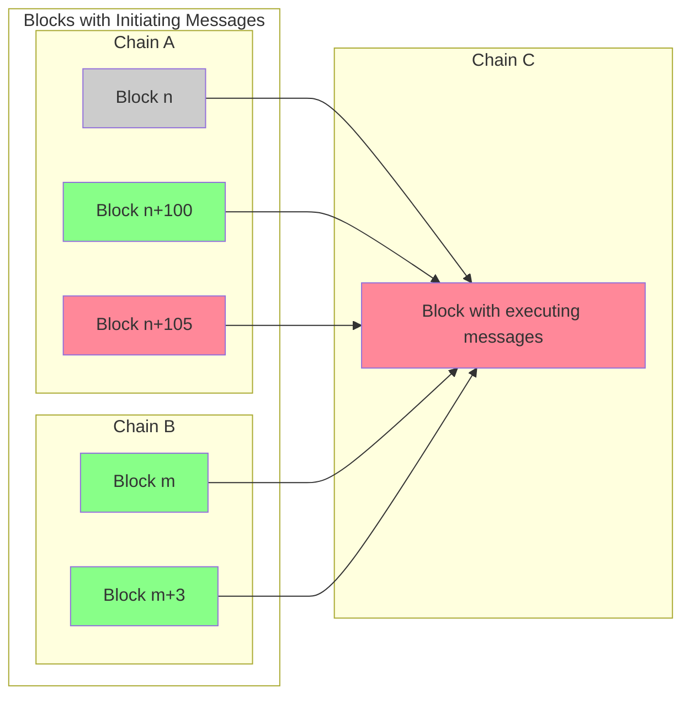

Superchain interop expands the scope of trust for unsafe blocks (blocks that are shared through [the gossip protocol](/operators/chain-operators/architecture#sequencer)).
If a sequencer chooses to accept unsafe messages, the sequencer must trust the sequencer that produces the inbound message as well as any referenced unsafe messages produced from sequencers in the transitive dependency set.

<details>
  <summary>What is the transitive dependency set?</summary>

  The transitive dependency set of a blockchain is all the chains on which it depends, and all the chains that depend on them, and so on.
  For example, in the illustration above, the dependency set of chain A is just chain B.
  However, the *transitive* dependency set includes chain B, the chains that depend on it (C and D) and the chains that depend on them (E).
  If there was a chain that depended on E, that chain would be part of the transitive dependency set too.

  ```mermaid

  flowchart LR
      A[Chain A] <--> B[Chain B]
      B <--> C[Chain C]
      B <--> D[Chain D]
      D <--> E[Chain E]
      F[Chain F] <--> G[Chain G]
  ```

  For example, there could be a block in chain D that depends on an initiating message in chain E.
  If the block with that initiating message is still unsafe (not written to L1), then the block in chain D is also unsafe, even if it has been written to L1.
  As a result, a block in chain B that depends on the chain D block can also be unsafe, as can a block in chain A that depends on the block in chain B.
</details>

Notably this trust assumption is only for *unsafe* blocks, and *only* if the sequencer allows messages from unsafe blocks to be processed.

In Superchain interop, [the traditional safe level](https://docs.optimism.io/stack/transactions/transaction-finality#steps-to-finality) of a block is divided into two types of safety.
A block is *local safe* once it is written to L1.
But it is only *cross safe* when in addition to the block itself all of the blocks on which it depends (directly or indirectly) are written to L1, including the dependencies of previous blocks in the same chain.

For example, in the image above, most blocks are safe.
Block `n` in chain `A` is even finalized, and immune from reorgs.
However, block `n+105` in chain `A` is unsafe, it (or a block on which it depends) is not written to L1.
Because the new block depends upon it, it can be either unsafe or local safe, but it cannot be cross safe.

## Interop clusters

The interop protocol works via a dependency set which is configured on a per-chain basis.
The dependency set defines the set of chains that can send and receive messages with a specific chain.

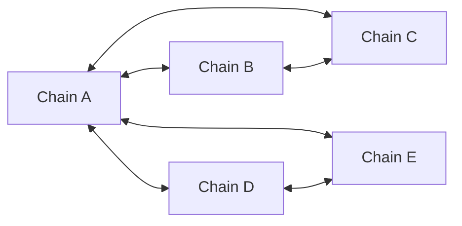

For example, in the illustration above, the dependency set of chain B is chains A and C.
To move an asset from chain E to chain B, it is necessary to move the asset from chain E to chain A, and then from chain A to chain B, because there is no direct dependency between B and E.

### Superchain interop cluster

The Superchain builds on top of the interop protocol and implements a single mesh network with complete dependencies.
In this model, each blockchain in the Superchain interop cluster would have direct connections to every other blockchain, creating a fully connected mesh network.
This model provides the highest level of interoperability, as any blockchain can transact directly with any other.

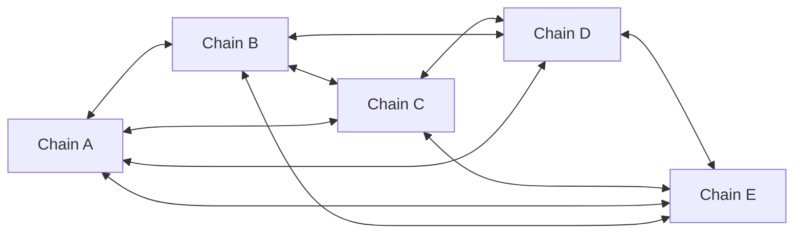

Each blockchain in the Superchain interop cluster shares the same security model to mitigate the weakest-link scenario. As outlined in the [Standard Rollup Charter](/superchain/blockspace-charter), these chains share the same L1 `ProxyAdmin` Owner. Any changes to the Superchain interop cluster must follow the standard Protocol Upgrade vote procedure—the established governance process for Superchain modifications.

The Superchain interop cluster will be rolled out iteratively, but to see a list of eligible chains that could join the cluster visit the [Superchain Index](https://www.superchain.eco/superchain-index) and look at chains that have a `Standard` charter.

{/* 
## Superchain interop assets

Superchain interop includes both the protocol layer message passing asset interoperability for ETH and SuperchainERC20 tokens.

*   **Message passing protocol:** the initial + finalizing/executing [message-cross-chain-message] that fire events to be consumed by the chains in the [dependency set](https://specs.optimism.io/interop/dependency-set.html)
*   ****: the [SuperchainERC20 superchain-erc20] turns message passing into asset transfer between chains in the interop set. Learn more about how the SuperchainERC20 token standard enables asset interoperability in the Superchain [here](/stack/interop/superchain-erc20)

This means ETH and ERC-20s can seamlessly and securely move across L2s, and intent-based protocols (i.e., bridges) can build better experiences on top of the message passing protocol.
*/}

## Next steps

*   Build a [revolutionary app](/app-developers/get-started) that uses multiple blockchains within the Superchain
*   Deploy a [SuperchainERC20](/stack/interop/tutorials/deploy-superchain-erc20) to the Superchain
*   Learn [how messages get from one chain to another chain](/stack/interop/message-passing)
*   Watch [this video](https://www.youtube.com/watch?v=FKc5RgjtGes), which gives an overview of Superchain interoperability.

---


### Crosschain security measures for safe interoperability

> Learn more about crosschain security measures for safe interoperability

*source: `stack/interop/interop-security.mdx`*

import { Callout } from 'nextra/components'
import Image from 'next/image'

import { InteropCallout } from '@/components/WipCallout'

<InteropCallout />

# Crosschain security measures for safe interoperability

## The trust model

This interop vulnerability arises when an initiating message seems to exist, prompting the processing of the executing message. However, the initiating message ends up not actually appearing in the canonical chain.
Excluding L1 reorgs, this can happen in two ways:

*   *Equivocation*. A sequencer publishes a block using the gossip protocol that is different from the one that eventually gets written to L1.
    The problem happens when the gossip protocol block includes a log entry that is used as an initiating message, but the real block (the one written to L1) doesn't.
    The way this is handled is that a block that depends on an unsafe block is, itself, unsafe.
    It does not get treated as safe until all the blocks on which it depends (directly or indirectly) are also written to L1.

*   *Faulty information*. The sequencer operator can run a verifier node for every chain in the dependency set, in which case it can deduce the initiating messages from the safe transactions of every chain.
    To save on resources, the sequencer can choose to query existing nodes of the source blockchain.
    In that case, if the information provided to sequencer is incorrect, of course the blocks posted by the sequencer will be also incorrect.

    In this case, invalid blocks will be replaced with deposit only blocks by other verifiers.

    <details>
      <summary>What are deposit only blocks?</summary>

      Normally the blocks that make it to the canonical blockchain are those posted to L1 by the sequencer.
      However, when those blocks are missing or invalid (for example because they rely on an initiating message that is missing), they're replaced by *deposit only blocks*, blocks whose content can be calculated from L1 without relying on the sequencer.

      The way this works is that there are two types of user transactions in an OP Stack block:

      *   Sequencer transactions, which go through the sequencer.
          These transactions are extremely cheap, but in theory a sequencer could censor them.
      *   Deposit transactions, which users submit through L1.
          These transactions have the cost of an L1 transaction, which is a lot higher, but they cannot be censored by the sequencer.

      A deposit only block only contains the deposit transactions and some internal transactions, not the sequencer transactions.

      For more information about this process, [see the technical specifications](https://specs.optimism.io/protocol/derivation.html#deriving-the-transaction-list).
    </details>

## The latency/security tradeoff

The initiating message comes from a block on a different blockchain.
If we accept initiating messages as soon as the block is available through the gossip protocol, we have minimal latency but at a security cost (because the source sequencer can send incorrect information through gossip).
Alternatively, we can wait until the source sequencer posts the block to L1.
In that case we can be more certain that the block is correct, but at the cost of higher latency.

There are three different possibilities, at different levels of latency and security.

### Unsafe initiating messages

L2 blocks start as unsafe, meaning that there's no L1 evidence for them, and the sequencer for that blockchain can send out incorrect information.
Sending out incorrect information, for example that a certain transaction is included in a block when it isn't, is called *equivocation*.
A sequencer that builds blocks with interop can choose to accept messages from unsafe blocks (received through the gossip protocol), for minimal latency.

To minimize the risk of equivocation, a block written to L1 (*local safe*) is only considered fully safe (*cross safe*) once both that block and all preceding blocks in its blockchain are also written to L1.
If the source block is written to L1 first, the destination sequencer can detect it. 
If the source block is missing an initiating message that the sequencer relied on due to equivocation, the sequencer can identify the error and recalculate the state. In this scenario, no significant harm occurs.

However, if the destination block—containing the executing message that depends on the initiating message—is written to L1 first (e.g., due to higher traffic on the chain), a different risk arises. 
If the source block that is eventually written to L1 lacks the initiating message, verifiers will detect that the derivation of the destination block, and any blocks dependent on it, is incorrect. 
In this case, the destination block and all subsequent blocks on any chain that depend on it are classified as deposit-only blocks.

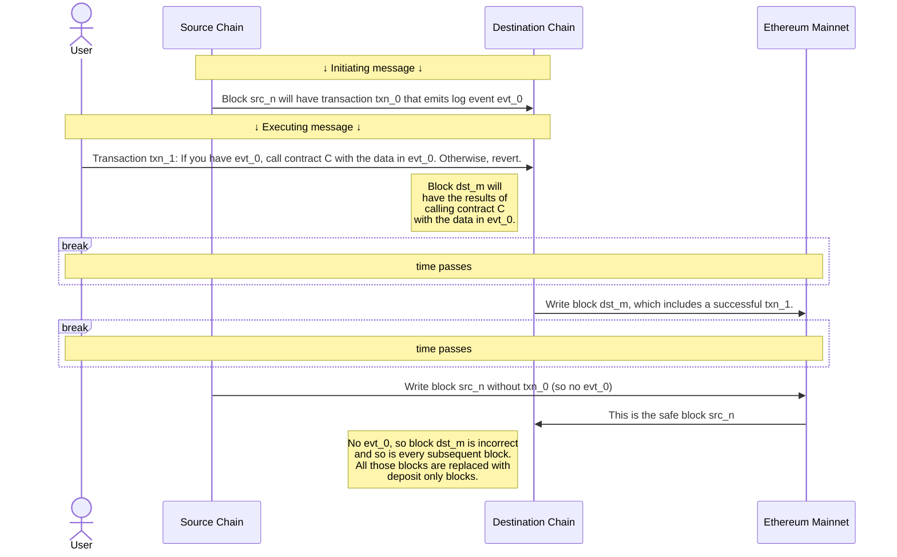

### Safe initiating messages

Alternatively, a sequencer can be configured to only accept executing messages once the initiating message is in a cross safe block.
A cross safe block is one that is written to L1, and whose dependencies (direct or indirect, including dependencies of previous blocks in the same chain) are all written to L1.

When a block is cross safe, the source sequencer cannot equivocate, and the state will only need to be recalculated if there's an [L1 reorg](https://www.alchemy.com/overviews/what-is-a-reorg#what-happens-to-reorgs-after-the-merge).
The cost of this enhanced security that it would take longer for a message to pass from one blockchain to the other.
Higher throughput OP Stack chains like Base and OP Mainnet submit a batch about every 5 minutes, so on average it takes about 2.5 minutes for an initiating message to become safe.

You can use [this dune dashboard](https://dune.com/oplabspbc/op-stack-chains-l1-activity#submission-frequency) to see how often OP Stack chains submit batches.

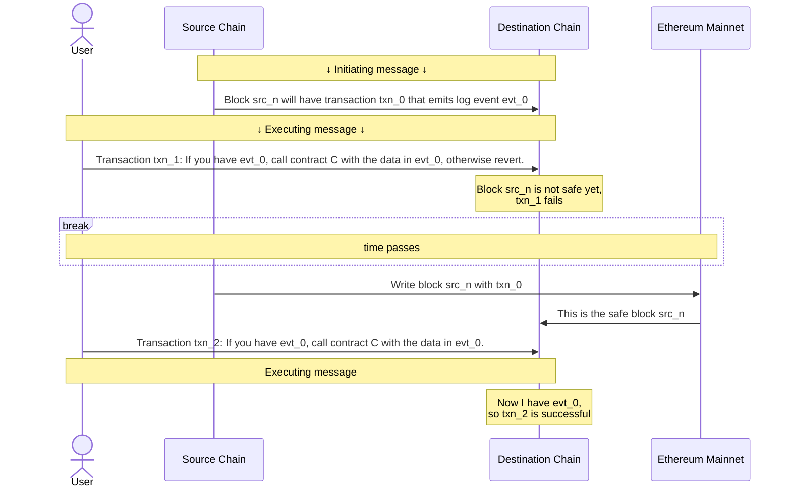

### Finalized initiating messages

A sequencer can also be configured to reject all executing messages until the initiating message is *finalized*, meaning it's irrevocably on L1 and immune to reorgs.
Currently, this adds [about 15 minutes](https://ethereum.org/en/roadmap/single-slot-finality/) to the message latency.

<br />

<Image src="/img/op-stack/protocol/safe-unsafe.png" alt="Safe and Unsafe Security Diagram" width={700} height={500} />

<Callout>
  Even if a sequencer accepts unsafe initiating messages, the blocks it constructs that rely on them are considered unsafe until the blocks with those initiating messages are written to L1 and become safe.
</Callout>

{/* 
## What is stopping a sequencer from censoring a cross-chain message?
There is nothing stopping a sequencer from censoring a transaction when it is sent directly to the sequencer. This does not mean the network has no censorship resistance, users can always send a deposit transaction for censorship resistance as strong as L1 guarantees. The tradeoff here is the latency, instead of being confirmed in ~2 seconds, the transaction can be confirmed at the rate of L1 block production. It may be possible to adopt something like [EIP-7547](https://eips.ethereum.org/EIPS/eip-7547) in the future to enable low latency censorship resistance.


## What is stopping a shared sequencer from including just the executing message and not the initiating message?
The protocol enforces the fact that all executing messages are valid. It does this by reorganizing out executing messages that have invalid initiating messages. Running software that does not enforce this would be non-standard behavior and would leave yourself at risk of accepting an invalid executing message and therefore running on a forked chain.

*/}

*   Build a [revolutionary app](/app-developers/get-started) that uses multiple blockchains within the Superchain
*   Deploy a [SuperchainERC20](/stack/interop/tutorials/deploy-superchain-erc20) to the Superchain
*   For more info about how Superchain interoperability works under the hood, [check out the specs](https://specs.optimism.io/interop/overview.html)
*   View more [interop tutorials](/stack/interop/tutorials)

---


### Interop message passing overview

> Learn about cross-chain message passing in the Superchain.

*source: `stack/interop/message-passing.mdx`*

import { Callout, Steps } from 'nextra/components'

import { InteropCallout } from '@/components/WipCallout'

<InteropCallout />

# Interop message passing overview

<Callout>
  This is an explanation of how interop works.
  You can find a step by step tutorial [here](/stack/interop/tutorials/message-passing).
</Callout>

The low-level [`CrossL2Inbox`](https://github.com/ethereum-optimism/optimism/blob/develop/packages/contracts-bedrock/src/L2/CrossL2Inbox.sol) contract handles basic message execution. It verifies whether an initiating message exists but does not check the message's destination, processing status, or other attributes.

The [`L2ToL2CrossDomainMessenger`](https://github.com/ethereum-optimism/optimism/blob/develop/packages/contracts-bedrock/src/L2/L2ToL2CrossDomainMessenger.sol) contract extends `CrossL2Inbox` by providing complete cross-domain messaging functionality.

For high-level interoperability, both messages use the `L2ToL2CrossDomainMessenger` contract on their respective chains.

## Initiating message

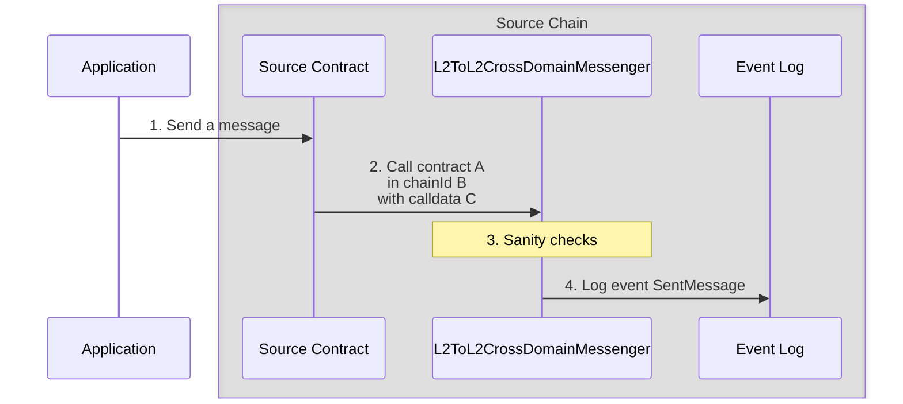

1.  The application sends a transaction to a contract on the source chain.

2.  The contract calls [`L2ToL2CrossDomainMessenger.SendMessage`](https://github.com/ethereum-optimism/optimism/blob/develop/packages/contracts-bedrock/src/L2/L2ToL2CrossDomainMessenger.sol#L125-L142).
    The call requires these parameters:

    *   `_destination`: The chain ID of the destination blockchain.
    *   `_target`: The address of the contract on that blockchain.
    *   `_message`: The actual message.
    
    This message is provided to `_target` as calldata, which means it includes a function selector and the parameters for that function call.

3.  `L2ToL2CrossDomainMessenger` on the source chain verifies the message is legitimate:
    *   The destination chain is one to which this chain can send messages.
    *   The destination chain is *not* the source chain.
    *   The target is neither `CrossL2Inbox` nor `L2ToL2CrossDomainMessenger`.

4.  `L2ToL2CrossDomainMessenger` emits a log entry.
    In addition to the parameters, the log entry also includes:

    *   `_nonce`: A [nonce](https://en.wikipedia.org/wiki/Cryptographic_nonce) value to ensure the message is only executed once.

    *   `_sender`: The contract that sent the cross domain message.

## Executing message

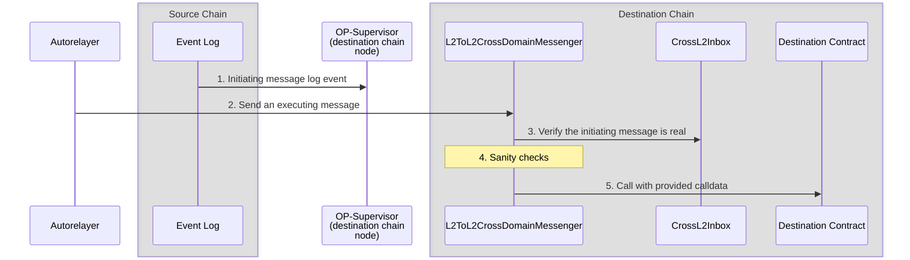

1.  Before the executing message is processed, the log event of the initiating message has to get to `op-supervisor` on the destination chain.

2.  The autorelayer, the application, or a contract calling on the application's behalf calls [`L2ToL2CrossDomainMessenger.relayMessage`](https://github.com/ethereum-optimism/optimism/blob/develop/packages/contracts-bedrock/src/L2/L2ToL2CrossDomainMessenger.sol#L150-L203).
    This call includes the message that was sent (`_sentMessage`), as well as the [fields required to find that message (`_id`)](https://github.com/ethereum-optimism/optimism/blob/develop/packages/contracts-bedrock/interfaces/L2/ICrossL2Inbox.sol#L4-L10).

3.  The `L2ToL2CrossDomainMessenger` uses `CrossL2Inbox` to verify the message was sent from the source.

4.  `L2ToL2CrossDomainMessenger` on the destination chain verifies the message is legitimate:

    *   The origin (of the log entry) is `L2ToL2CrossDomainMessenger` on the other side.
    *   The destination chain ID is correct.
    *   The target is neither `CrossL2Inbox` nor `L2ToL2CrossDomainMessenger`.
    *   This message has not been relayed before.
    
    This is the reason we need the nonce value, to enable us to send multiple messages that would be otherwise identical.

5.  If everything checks out, `L2ToL2CrossDomainMessenger` calls the destination contract with the calldata provided in the message.

## Next steps

*   Build a [revolutionary app](/app-developers/get-started) that uses multiple blockchains within the Superchain
*   Learn how to [pass messages between blockchains](/stack/interop/tutorials/message-passing).
*   Deploy a [SuperchainERC20](/stack/interop/tutorials/deploy-superchain-erc20) to the Superchain.

---


### OP-Supervisor

> Learn the basics of OP-Supervisor.

*source: `stack/interop/op-supervisor.mdx`*

import { Callout, Tabs, Steps } from 'nextra/components'
import { InteropCallout } from '@/components/WipCallout'

<InteropCallout />

# OP-Supervisor

OP-Supervisor is a service that verifies cross-chain messages and manages interoperability between chains in the OP Stack.
The main information it contains about other blockchains is:

*   Log entries, which could be [initiating messages](./explainer#how-messages-get-from-one-chain-to-the-other) for cross-domain messages.
*   Blockchain heads, which are the latest blocks at various levels of confidence and safety:
    *   Unsafe (the latest block available through the gossip protocol)
    *   Local-safe (the latest block written to L1)
    *   Cross-safe (the latest block written to L1, and for which all the dependencies are written to L1)
    *   Finalized (the latest block written to L1, and that L1 block is safe from reorgs)


To do this, OP-Supervisor has to have RPC access to all the chains in the dependency set (all those that can contain an initiating message whose destination is this blockchain).

## How other components use OP-Supervisor

*   The execution client (typically `op-geth`) queries `op-supervisor` during block-building to verify if a message is sufficiently safe to include.
    To do this, the execution client looks at every executing message and  queries `op-supervisor` to see if there is a corresponding initiating message.

*   `op-node` queries cross-chain safety information and coordinates safety updates between OP stack nodes and `op-supervisor`. It uses the API provided by `op-supervisor` to:
    *   Retrieve the unsafe, local-safe, cross-safe, and finalized heads for other chains.
    *   Update the unsafe, local-safe, and finalized heads for its own chain.
    *   Attempt to promote blocks in its own chain to cross-safe status.
    *   Attempt to finalize L2 blocks based on L1 finality.

### API

Here are the most important API methods exposed by OP-Supervisor.
For a full listing of API names, see the [source code](https://github.com/ethereum-optimism/optimism/blob/develop/op-service/sources/supervisor_client.go).

| Method(s)                                 | Description                                                                           |
| ----------------------------------------- | ------------------------------------------------------------------------------------- |
| `UnsafeView` and `SafeView`               | Return the Local and Cross heads for their respective levels                          |
| `DerivedFrom`                             | OP Nodes use to check the L1 source of the Supervisor (needed for Safe Head tracking) |
| `UpdateLocalSafe` and `UpdateLocalUnsafe` | Tell the Supervisor when the Node's heads change                                      |
| `Finalized`                               | Returns the Finalized Head                                                            |
| `UpdateFinalizedL1`                       | Signals to the Supervisor new finality signals                                        |
| `CheckMessage`                            | Checks logs in the DB directly in tests                                               |

## Next steps

*   Build a [revolutionary app](/app-developers/get-started) that uses multiple blockchains within the Superchain
*   Deploy a [SuperchainERC20](/stack/interop/tutorials/deploy-superchain-erc20) to the Superchain
*   Learn [how ETH can move across chains](https://docs.optimism.io/stack/interop/superchain-weth)
*   For more info about how Superchain interoperability works under the hood, [check out the specs](https://specs.optimism.io/interop/overview.html).

---


### Interoperability predeploys

> Learn how interoperability predeploys work.

*source: `stack/interop/predeploy.mdx`*

import { Callout } from 'nextra/components'
import Image from 'next/image'

import { InteropCallout } from '@/components/WipCallout'

<InteropCallout />

# Interoperability predeploys

The following predeploys have been added to enable interoperability.
*Predeployed smart contracts* exist at predetermined addresses, coming from the genesis state.
They're similar to [precompiles](https://www.evm.codes/precompiled) but run directly in the EVM instead of running as native code.

## CrossL2Inbox

The `CrossL2Inbox` is the system predeploy for cross chain messaging.
Anyone can trigger the execution or validation of cross chain messages, on behalf of any user.

*   **Address:** `0x4200000000000000000000000000000000000022`
*   **Specs:** [`CrossL2Inbox`](https://specs.optimism.io/interop/predeploys.html#crossl2inbox)
*   **Source code:** [`CrossL2Inbox`](https://github.com/ethereum-optimism/optimism/blob/develop/packages/contracts-bedrock/src/L2/CrossL2Inbox.sol)

## L2ToL2CrossDomainMessenger

The `L2ToL2CrossDomainMessenger` is a higher level abstraction on top of the `CrossL2Inbox` that provides general message passing.
It's utilized for secure ERC20 token transfers between L2 chains.
Messages sent through the `L2ToL2CrossDomainMessenger` on the source chain receive both replay protection and domain binding (the executing transaction can only be valid on a single chain).

*   **Address:** `0x4200000000000000000000000000000000000023`
*   **Specs:** [`L2ToL2CrossDomainMessenger`](https://specs.optimism.io/interop/predeploys.html#l2tol2crossdomainmessenger)
*   **Source code:** [`L2ToL2CrossDomainMessenger`](https://github.com/ethereum-optimism/optimism/blob/develop/packages/contracts-bedrock/src/L2/L2ToL2CrossDomainMessenger.sol)

{/* 
## OptimismSuperchainERC20Factory

`OptimismSuperchainERC20Factory` creates ERC20 contracts that implement the SuperchainERC20 standard, grants mint-burn rights to the `L2StandardBridge`, and includes a remoteToken variable. These ERC20s are called `OptimismSuperchainERC20` and can be converted back and forth with `OptimismMintableERC20` tokens. The goal of the `OptimismSuperchainERC20` is to extend functionalities of the `OptimismMintableERC20` so that they are interop compatible.

- **Address:** `0x4200000000000000000000000000000000000026`
- **Specs:** [`OptimismSuperchainERC20Factory`](https://specs.optimism.io/interop/predeploys.html#optimismsuperchainerc20factory)
- **Source code:** [`OptimismSuperchainERC20Factory`](https://github.com/ethereum-optimism/optimism/blob/develop/packages/contracts-bedrock/src/L2/OptimismSuperchainERC20Factory.sol)

## OptimismSuperchainERC20Beacon

To enable upgrades, `OptimismSuperchainERC20` contracts use [the `BeaconProxy` pattern](https://docs.openzeppelin.com/contracts/3.x/api/proxy#beacon).
This contract is the `Beacon` part, which provides the implementation address for those proxies.

- **Address:** `0x4200000000000000000000000000000000000027`
- **Specs:** [`OptimismSuperchainERC20Beacon`](https://specs.optimism.io/interop/predeploys.html#beaconcontract)
- **Source code:** [`OptimismSuperchainERC20Beacon`](https://github.com/ethereum-optimism/optimism/blob/develop/packages/contracts-bedrock/src/L2/OptimismSuperchainERC20Beacon.sol)

*/}

## SuperchainTokenBridge

The `SuperchainTokenBridge` is an abstraction on top of the `L2ToL2CrossDomainMessenger` that facilitates token bridging using interop. It has mint and burn rights over `SuperchainERC20` tokens, as described in the [token bridging spec](https://specs.optimism.io/interop/token-bridging.html).

*   **Address:** `0x4200000000000000000000000000000000000028`
*   **Specs:** [`SuperchainTokenBridge`](https://specs.optimism.io/interop/predeploys.html#superchainerc20bridge)
*   **Source code:** [`SuperchainTokenBridge`](https://github.com/ethereum-optimism/optimism/blob/develop/packages/contracts-bedrock/src/L2/SuperchainTokenBridge.sol)


## Next steps

*   Build a [revolutionary app](/app-developers/get-started) that uses multiple blockchains within the Superchain
*   Deploy a [SuperchainERC20](/stack/interop/tutorials/deploy-superchain-erc20) to the Superchain
*   Learn [how messages get from one chain to another chain](/stack/interop/message-passing)

---


### Reading Logs with Superchain Interop

> Learn how to reference logs from one chain on another within the Superchain.

*source: `stack/interop/reading-logs.mdx`*

import { Callout } from 'nextra/components'
import { InteropCallout } from '@/components/WipCallout'

<InteropCallout />

# Reading Logs with Superchain Interop

Superchain interop enables developers to leverage current and historical logs from other blockchains within the [Superchain interop cluster](/stack/interop/explainer#superchain-interop-cluster) directly on their local chain.
This allows smart contracts to consume local and cross-chain logs with low latency in a trust-minimized way.

## Overview

Instead of relying solely on [`L2ToL2CrossDomainMessenger`](https://github.com/ethereum-optimism/optimism/blob/develop/packages/contracts-bedrock/src/L2/L2ToL2CrossDomainMessenger.sol), developers can use [`CrossL2Inbox#validateMessage`](https://github.com/ethereum-optimism/optimism/blob/af091753917c1d7101314cbfe8ac5cbc2efe0e5e/packages/contracts-bedrock/src/L2/CrossL2Inbox.sol#L49) and treat `CrossL2Inbox` as an oracle for logs that occurred on different chains or even their local chain.

This enables developers to:

*   Build cross-chain applications that react to events happening across the Superchain.
*   Create novel applications that leverage data from multiple chains.

## Why use `CrossL2Inbox`?

*   **Reference existing logs**: Allows contracts to verify and use logs that were already emitted, without requiring those logs to have been sent as cross-chain messages.
*   **Trust-minimized security**: Leverages the existing Superchain security model with no additional trust assumptions.
*   **Flexibility**: Can be used to validate events from another chain or even the local chain.

## How it works

### Architecture

The process works through the [`CrossL2Inbox`](https://github.com/ethereum-optimism/optimism/blob/af091753917c1d7101314cbfe8ac5cbc2efe0e5e/packages/contracts-bedrock/src/L2/CrossL2Inbox.sol#L33) contract, which serves as an oracle for logs from other chains in the Superchain:

1.  A smart contract on `Chain A` emits a log (event)
2.  Your contract on `Chain B` calls `CrossL2Inbox#validateMessage` with the log's identifier
3.  The `CrossL2Inbox` contract verifies the log's authenticity
4.  Your contract can then use the validated log data

### Key components

*   **[Identifier](/stack/interop/tutorials/relay-messages-cast#message-identifier)**: A struct containing information about the log, including `chainId`, `origin` (contract address), and other log metadata
*   **[validateMessage](https://github.com/ethereum-optimism/optimism/blob/develop/packages/contracts-bedrock/src/L2/CrossL2Inbox.sol#L79)**: Function that verifies a log's authenticity before allowing its use

## Example: cross-chain attestation verification

Let's walk through a conceptual example of verifying an Ethereum Attestation Service (EAS) attestation across chains.
EAS is a [predeploy](/stack/interop/predeploy) in the OP Stack for making attestations on or off-chain about anything.

### Source chain: creating an attestation

On the source chain (e.g., OP Mainnet), a user creates an attestation using EAS:

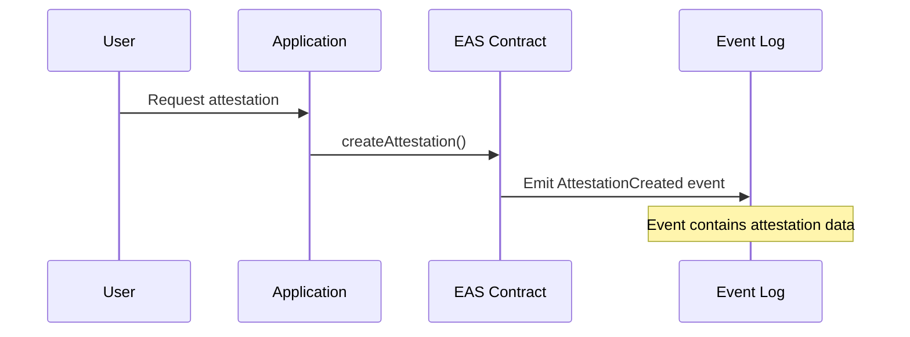

1.  The user initiates a request for an attestation through an application.

2.  The application calls the `createAttestation()` function on the EAS (Ethereum Attestation Service) contract on the source chain.

3.  The EAS contract processes the attestation request and emits an `AttestationCreated` event.

4.  The event is recorded in the chain's log, containing all necessary attestation data.

### Destination chain: verifying the attestation

On the destination chain (e.g., Unichain), a DeFi application wants to verify this attestation:

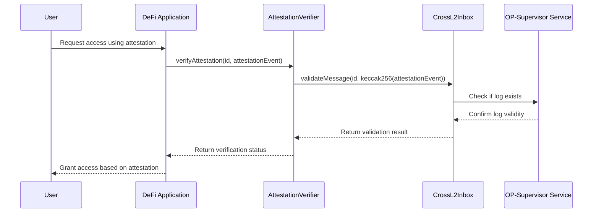

1.  The user requests access to a DeFi application on the destination chain, referencing an attestation created on the source chain.

2.  The DeFi application calls a verification function on an attestation verifier contract, passing the attestation's identifier and event data.

3.  The attestation verifier calls `validateMessage()` on the `CrossL2Inbox` contract, passing the attestation identifier and a hash of the event data.

4.  The [`CrossL2Inbox`](https://github.com/ethereum-optimism/optimism/blob/develop/packages/contracts-bedrock/src/L2/CrossL2Inbox.sol) contract interacts with the [`OP-Supervisor`](/stack/interop/op-supervisor) service to check if the specified log exists on the source chain.

5.  The `OP-Supervisor` confirms the validity of the log to the `CrossL2Inbox` contract.

6.  The `CrossL2Inbox` returns the validation result to the attestation verifier.

7.  The attestation verifier returns the verification status to the DeFi application.

8.  If validation is successful, the DeFi application grants the user access based on the verified attestation.

The primary benefit of this approach is that it allows your contract to verify attestations that already exist on another chain without requiring those attestations to have been explicitly sent as cross-chain messages.

## Overview of the process

To implement cross-chain log reading:

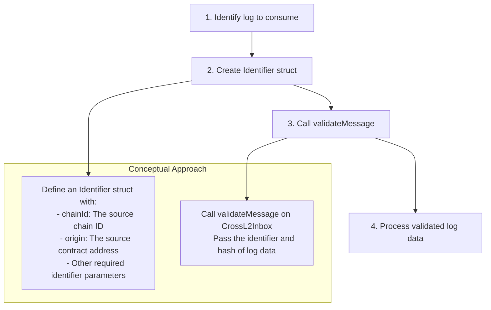

1.  First, identify which log from another chain you want to consume in your application.

2.  Create an Identifier struct that contains all necessary information about the log, including the chain ID and the contract address that emitted the log.

3.  Call the `validateMessage()` function on the `CrossL2Inbox` contract, passing the identifier and a hash of the log data.

4.  After validation, process the log data according to your application's requirements.

## Important considerations

*   This feature works between chains within the [Superchain interop cluster](/stack/interop/explainer#superchain-interop-cluster).
*   The same functionality can be used on a single chain (for example, to maintain a consistent architecture).

### Handling validation failures

*   The `validateMessage` call will revert the entire transaction if validation fails.
*   Consider implementing a try-catch pattern in your application's frontend to handle these failures.
*   Design your contract to allow for retry mechanisms where appropriate.

## Comparison with `L2ToL2CrossDomainMessenger`

| Feature    | L2ToL2CrossDomainMessenger                     | CrossL2Inbox#validateMessage                      |
| ---------- | ---------------------------------------------- | ------------------------------------------------- |
| Purpose    | Send messages between chains                   | Verify logs from other chains or local chain      |
| Initiation | Source explicitly sends message to destination | Destination queries for existing logs from source |
| Use Case   | Transfer tokens, trigger actions               | Verify attestations, reference events             |
| Flow       | Push model                                     | Pull model                                        |

## End-to-End flow comparison

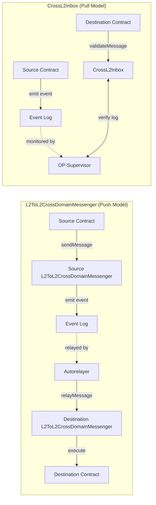

This diagram compares the two approaches for cross-chain communication:

### L2ToL2CrossDomainMessenger (Push Model):

1.  A source contract calls `sendMessage()` on the `L2ToL2CrossDomainMessenger`.

2.  The messenger emits an event to the event log.

3.  An autorelayer detects the event and relays it to the destination chain.

4.  The destination `L2ToL2CrossDomainMessenger` receives the relayed message.

5.  The destination messenger executes the message on the target contract.

### CrossL2Inbox (Pull Model):

1.  A source contract emits an event to the event log.

2.  The `OP-Supervisor` service monitors events across chains.

3.  A destination contract calls `validateMessage()` on the `CrossL2Inbox`.

4.  The `CrossL2Inbox` verifies the log's existence by communicating with the `OP-Supervisor`.

5.  The destination contract receives verification and proceeds with its logic.

## Next steps

*   [Build a revolutionary app](/app-developers/get-started) that uses multiple blockchains within the Superchain
*   Learn how to [pass messages between blockchains](/stack/interop/tutorials/message-passing)
*   Deploy a [SuperchainERC20](/stack/interop/tutorials/deploy-superchain-erc20) to the Superchain

---


### Interop reorg awareness

> How Superchain interop enables low-latency interop and avoids the double-spend problem.

*source: `stack/interop/reorg.mdx`*

import { Callout } from 'nextra/components'
import Image from 'next/image'

import { InteropCallout } from '@/components/WipCallout'

<InteropCallout />

# Interop reorg awareness

[A chain reorganization, or "reorg",](https://www.alchemy.com/overviews/what-is-a-reorg#what-happens-to-reorgs-after-the-merge) happens when validators disagree on the most accurate version of the blockchain.
If not handled correctly, reorgs in a cross-chain context could result in a [double-spend problem](https://en.wikipedia.org/wiki/Double-spending).
The most frequent solution to mitigate the double-spend problem is to wait for Ethereum finality; however, that solution results in high latency cross-chain communication and a poor user experience.

<details>
  <summary>What is double-spending?</summary>

  ```mermaid

  flowchart LR 
      subgraph init ["Initiating transaction (source chain)"]
          burn(tokens burned)
          burn-->send(send)
      end
      subgraph exec ["Executing transaction (destination chain)"]
          send==initiating message==>receive(receive)
          receive-->mint(tokens minted)
      end
  ```

  In a normal asset transfer tokens are burned on the source chain first, then a message is sent to the destination chain.
  When that message is received, the tokens are minted on the destination chain, where the user can now use those tokens.

  ```mermaid

  flowchart LR 
      subgraph init ["Not really the source chain"]
          err((error))
      end
      subgraph exec ["Executing transaction (destination chain)"]
          err==initiating message==>receive(receive)
          receive-->mint(tokens minted)
      end
  ```

  A double-spend problem occurs when the destination chain receives a valid initiating message, but due to issues on the source chain, such as a reorg, that initiating transaction is no longer valid.
  When that happens, the tokens are still on the source chain, but they are also on the destination chain.
</details>

Most solutions to mitigate the double-spend problem rely on [L1 finality](https://ethereum.org/en/developers/docs/consensus-mechanisms/pos/#finality). However, that solution results in high latency and poor user experience.

To mitigate the double-spend problem while delivering a low-latency cross-chain experience, Superchain interop uses [block safety levels](./explainer#block-safety-levels).
This means users can transfer assets across chains in the Superchain with 1-block latency, and should a reorg happen, either both the source and destination transactions would remain, or both of them would revert.
In every case, there is no window of opportunity to double spend.

## Block safety levels

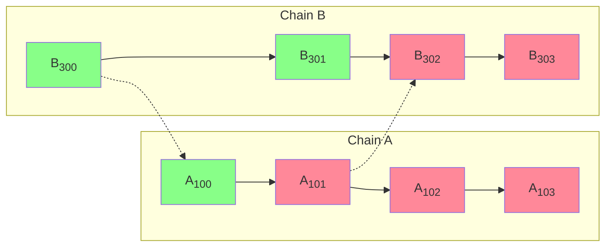

In the diagram above, solid arrows are the derivation of a block from the previous block in the chain.
Dotted arrows go from the block with the initiating message (the source) to the block with the executing message (the destination).
Blocks can either be finalized (grey), cross-safe (green), or unsafe (red).
Blockchain A has only written block A<sub>100</sub> to the blockchain.
As a result, block A<sub>101</sub> is unsafe, and so are all the blocks that depend on it, directly (A<sub>102</sub> and B<sub>302</sub>) or indirectly (A<sub>103</sub> and B<sub>303</sub>).
Blocks B<sub>302</sub> and B<sub>303</sub> may be *local-safe* (if they are written to L1), but they cannot be *cross-safe* because they depend on a block that isn't.
If all goes well, eventually A<sub>101</sub> will be written to L1, turn safe, and then the blocks that depend on it can become safe as well.

The message between A<sub>101</sub> and B<sub>302</sub> can be an asset moving across the bridge.
In that case, the initiating message (A<sub>101</sub>) burns `n` tokens on the source chain (A), and the executing message (B<sub>302</sub>) mints `n` tokens on the destination chain (B).

### L1 reorg

In this case, an L1 block is replaced, and the new block either contains the same blob with chain data that was contained in the old block, or it doesn't.
If the new block contains the same blob, the change is meaningless from the L2 perspective.
If the new block does not contain the same blob, then the sequencer on the chain will know it is missing and reposts it.

So L1 reorgs are basically invisible to L2.

### Equivocation

Sequencers inform the rest of the Superchain about a new block in two ways:

*   The gossip protocol, which is typically used as soon as the block is created.
    The problem is that the gossip protocol does not create a commitment.
*   Posting to L1, which typically happens a few minutes after the block is created.
    The reason is cost, it is a lot cheaper if compression and L1 posting are done in large batches, rather than for each individual block.

Equivocation happens when a sequencer publishes a block using the gossip protocol that is different from the one that eventually gets written to L1.
In this case, the block that is written to L1 (let's call it A'<sub>101</sub>) is the valid one, and that causes every dependent block to be recalculated.

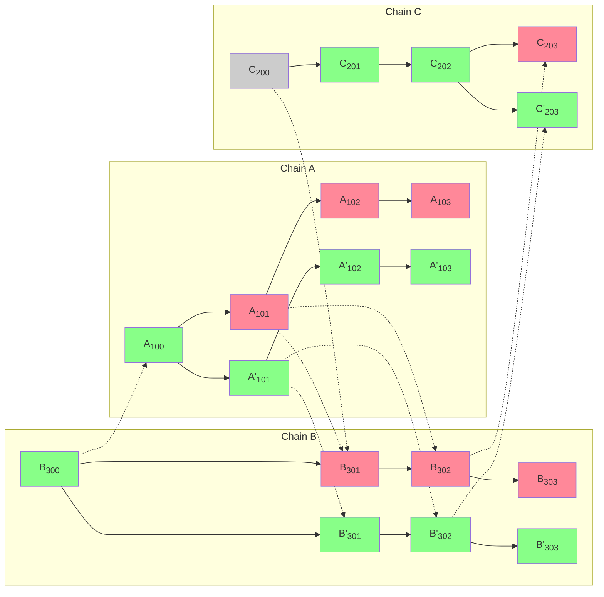

Note that a block can only depend directly on a block in a separate chain if the block includes an executing message that uses an initiating message from that block.
So the change from A<sub>101</sub> to A'<sub>101</sub> cannot invalidate any existing safe blocks.

### Invalid block

If a block is invalid, even if it is posted on L1, the canonical chain replaces it with a block that only includes the deposit transactions, those transactions posted to L1.

<details>
  <summary>What makes a block invalid?</summary>

  There are several potential reasons:

  *   The block posted to L1 includes incorrect information, for example because it relied on a node on a different blockchain for interop and that node reported incorrect information.
  *   The block was never posted.
      After a timeout of twelve hours all the verifiers will assume that the block that should have been posted is a deposit-only block.
</details>

This is functionally equivalent to equivocation, and dealt with the same way, so it can change unsafe blocks but only those blocks.

{/* 
### L2 reorg

An L2 reorg could happen after the sequencer is decentralized.
In that case, there is a deterministic FCU (fork choice update), just as there is on L1.
At worst, some unsafe blocks need to be recalculated (if one fork is chosen over another).
*/}

## Next steps

*   Build a [revolutionary app](/app-developers/get-started) that uses multiple blockchains within the Superchain.
*   Deploy a [SuperchainERC20](./tutorials/deploy-superchain-erc20) to the Superchain.
*   View more [interop tutorials](./tutorials).

---


### SuperchainERC20

> Learn about the basic details of the SuperchainERC20 implementation.

*source: `stack/interop/superchain-erc20.mdx`*

import { Callout } from 'nextra/components'

<Callout>
  The SuperchainERC20 standard is ready for production deployments.
  Please note that the OP Stack interoperability upgrade, required for crosschain messaging, is currently still in active development.
</Callout>

<Callout>
SuperchainERC20s can be deployed on any chain, but will only be interoperable within the [Superchain interop cluster](/stack/interop/explainer#superchain-interop-cluster).
</Callout>

# SuperchainERC20

<Callout>
  This tutorial provides a behind the scenes explanation of how `SuperchainERC20` tokens are transferred.

  *   [See the tutorial](tutorials/transfer-superchainERC20) for how your application can transfer `SuperchainERC20` tokens.
  *   For a sample UI that bridges a `SuperchainERC20` token, [see here](https://interop-alpha-app.superchain.tools/).
</Callout>

The [`SuperchainERC20`](https://github.com/ethereum-optimism/optimism/blob/develop/packages/contracts-bedrock/src/L2/SuperchainERC20.sol) contract implements [ERC-7802](https://ethereum-magicians.org/t/erc-7802-crosschain-token-interface/21508) to enable asset interoperability within the Superchain.

Asset interoperability allows tokens to move securely across the Superchain by burning tokens on the source chain and minting an equivalent amount on the destination chain. This approach addresses issues such as liquidity fragmentation and poor user experiences caused by asset wrapping or reliance on liquidity pools.

Instead of wrapping assets, this mechanism effectively "teleports" tokens between chains in the Superchain. It provides users with a secure and capital-efficient method for transacting across chains.

Additional features:

*   **Simplified deployments**: Zero infrastructure cost to make your token cross-chain.
    Provides a consistent, unified implementation for tokens across all Superchain-compatible networks and a common cross-chain interface for the EVM ecosystem at large.
*   **Common standard**: Implements [ERC-7802](https://eips.ethereum.org/EIPS/eip-7802), a unified interface that can be used across all of Ethereum to enable cross-chain mint/burn functionality.

## How it works

[`SuperchainERC20`](https://github.com/ethereum-optimism/optimism/blob/develop/packages/contracts-bedrock/src/L2/SuperchainERC20.sol) and [`SuperchainTokenBridge`](https://github.com/ethereum-optimism/optimism/blob/develop/packages/contracts-bedrock/src/L2/SuperchainTokenBridge.sol) work together to allow ERC-20 tokens to be transferred from one chain to the other.

The initiating message burns tokens on the source chain.
The executing message then mints them on the destination chain.

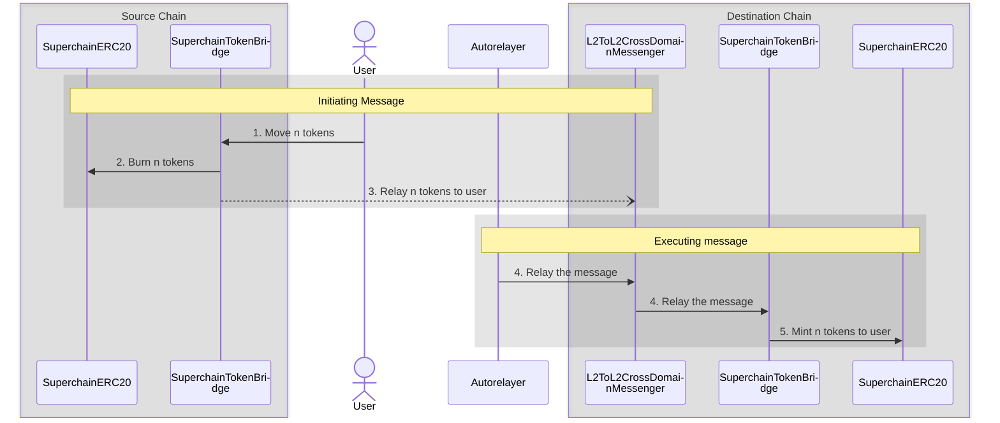

#### Initiating message (source chain)

1.  The user (or a contract) calls [`SuperchainTokenBridge.sendERC20`](https://github.com/ethereum-optimism/optimism/blob/develop/packages/contracts-bedrock/src/L2/SuperchainTokenBridge.sol#L52-L78).

2.  The token bridge calls [`SuperchainERC20.crosschainBurn`](https://github.com/ethereum-optimism/optimism/blob/develop/packages/contracts-bedrock/src/L2/SuperchainERC20.sol#L37-L46) to burn those tokens on the source chain.

3.  The source token bridge calls [`SuperchainTokenBridge.relayERC20`](https://github.com/ethereum-optimism/optimism/blob/develop/packages/contracts-bedrock/src/L2/SuperchainTokenBridge.sol#L80-L97) on the destination token bridge.
    This call is relayed using [`L2ToL2CrossDomainMessenger`](./message-passing).
    The call is *initiated* here, by emitting an initiating message. 
    It will be executed later, after the destination chain receives an executing message to [`L2ToL2CrossDomainMessenger`](./message-passing).

#### Executing message (destination chain)

4.  The autorelayer (or the user, or any offchain entity) sends an executing message to [`L2ToL2CrossDomainMessenger`](./message-passing) to relay the message.

5.  The destination token bridge calls [`SuperchainERC20.crosschainMint`](https://github.com/ethereum-optimism/optimism/blob/develop/packages/contracts-bedrock/src/L2/SuperchainERC20.sol#L26-L35) to mint tokens for the user/contract that called `SuperchainTokenBridge.sendERC20` originally.

## Requirements

Application developers must complete two steps to make their tokens compatible with `SuperchainERC20`.
Setting this up in advance ensures tokens will benefit from interop when it becomes available.

*   Grant permission to `SuperchainTokenBridge` (address `0x4200000000000000000000000000000000000028`) to call `crosschainMint` and `crosschainBurn`.
    If you are using [`SuperchainERC20`](https://github.com/ethereum-optimism/optimism/blob/develop/packages/contracts-bedrock/src/L2/SuperchainERC20.sol) this is already done for you.

    {/* 

      Add this after the tutorial is written

      For detailed, step-by-step instructions on implementing SuperchainERC20, refer to [Deploy assets using SuperchainERC20](/stack/interop/tutorials/deploy-superchain-erc20).

      */}

*   Deploy the `SuperchainERC20` at the same address on every chain in the Superchain where you want your token to be available. If you do not deploy the contract to a specific destination chain, users will be unable to successfully move their tokens to that chain. 

<Callout type="warning">
  To ensure security, you must either design the deployer to allow only a specific trusted ERC-20 contract, such as `SuperchainERC20`, to be deployed through it, or call `CREATE2` to deploy the contract directly from an EOA you control.

  This precaution is critical because if an unauthorized ERC-20 contract is deployed at the same address on any Superchain network, it could allow malicious actors to mint unlimited tokens and bridge them to the network where the original ERC-20 contract resides.
</Callout>


## Next steps

*   Deploy a [SuperchainERC20](/stack/interop/tutorials/deploy-superchain-erc20) to the Superchain.
*   Learn about [other token standards that can benefit from Superchain interop](/stack/interop/compatible-tokens).
*   Learn how to [modify an existing ERC20 contract](/stack/interop/tutorials/custom-superchain-erc20) to make it interoperable within the Superchain.

---


### Superchain ETH

> Learn basic details about Interoperable ETH.

*source: `stack/interop/superchain-weth.mdx`*

import { Callout } from 'nextra/components'

import { InteropCallout } from '@/components/WipCallout'

<InteropCallout />

# Superchain ETH

<Callout>
  This is an explanation of how interop ETH works.
  You can find a step by step tutorial [here](tutorials/bridge-crosschain-eth).
</Callout>


InteroperableETH enables seamless ETH transfers across Superchain blockchains. It is implemented using three key contracts:

*   [`SuperchainWETH`](https://github.com/ethereum-optimism/optimism/blob/develop/packages/contracts-bedrock/src/L2/SuperchainWETH.sol): A bridge contract that facilitates ETH transfers between Superchain blockchains.
*   [`ETHLiquidity`](https://github.com/ethereum-optimism/optimism/blob/develop/packages/contracts-bedrock/src/L2/ETHLiquidity.sol): A liquidity provider for ETH transfers. 
`SuperchainWETH` uses this contract as a liquidity repository to ensure ETH availability on the destination chain.
*   [`L2ToL2CrossDomainMessenger`](https://github.com/ethereum-optimism/optimism/blob/develop/packages/contracts-bedrock/src/L2/L2ToL2CrossDomainMessenger.sol): A messaging contract that [facilitates cross-chain communication](/stack/interop/message-passing).

Superchain ETH deposits ETH into the `ETHLiquidity` contract on the source chain and withdraws an equivalent amount on the destination chain. 
This mechanism improves capital efficiency and eliminates liquidity fragmentation and poor user experiences caused by asset wrapping or reliance on liquidity pools.

## Features and benefits

*   Enables seamless ETH transfers across different chains in the Superchain interop cluster 
*   Maintains fungibility of ETH across the Superchain interop cluster 
*   Provides liquidity for cross-chain transactions
*   Improves user experience by abstracting complex bridging processes

## How it works

```mermaid

%%{
  init: {
    "sequence": {
      "wrap": true
    }
  }
}%%

sequenceDiagram
  box rgba(0,0,0,0.1) Source Chain
    participant src-liquidity as ETHLiquidity
    participant src-weth as SuperchainWETH
  end
  actor user as User
  participant any-offchain as User, Relayer, etc.  
  box rgba(0,0,0,0.1) Destination Chain
    participant dst-l2Xl2 as L2ToL2CrossDomainMessenger
    participant dst-weth as SuperchainWETH
    participant dst-liquidity as ETHLiquidity       
    participant dst-final as ETH Destination
  end
  rect rgba(0,0,0,0.1)
    note over src-weth, dst-l2Xl2: Initiating Message
    user->>src-weth: 1. sendETH(to, chainId) with n ETH
    src-weth->>src-liquidity: 2. Deposit n ETH
    src-weth->>dst-l2Xl2: 3. Send relayETH to Superchain WETH on chainId
  end
  rect rgba(0,0,0,0.1)
    note over any-offchain,dst-weth: Executing message
    any-offchain->>dst-l2Xl2: 4. Relay the message
    dst-l2Xl2->>dst-weth: 5. relayETH(from, to, amount)
    dst-weth->>dst-liquidity: 6. Withdraw amount ETH
    dst-weth->>dst-final: 7. Here are amount ETH
  end
```

#### Initiating message

1.  The user (or a contract operating on a user's behalf) calls `SuperchainWETH.sendETH` with a destination address and a chainId.
    ETH, in the amount to transfer must be attached to this call.

2.  `SuperchainWETH` transfers the specified ETH amount to `ETHLiquidity`, removing it from circulation on the source chain.

3.  `SuperchainWETH` on the source chain sends a [`relayETH`](https://github.com/ethereum-optimism/optimism/blob/develop/packages/contracts-bedrock/src/L2/SuperchainWETH.sol#L125-L145) message to `SuperchainWETH` on the destination chain using the [`L2ToL2CrossDomainMessenger`](/stack/interop/message-passing).

#### Executing message

4.  An off-chain entity submits a transaction to execute the message.
    Any address can submit this transaction, but it must have ETH on the destination chain.
    Typically, this would be the chain's autorelayer.

5.  `L2ToL2CrossDomainMessenger` on the destination chain calls `SuperchainWETH` with the following details:

    *   Source of the ETH
    *   Destination address
    *   Amount of ETH

    `SuperchainWETH` performs several sanity checks:

    *   The `relayETH` call must originate from `L2ToL2CrossDomainMessenger`.
    *   The interop message must have been sent by `SuperchainWETH`

6.  `SuperchainWETH` withdraws the specified amount of ETH from `ETHLiquidity`.
    Only `SuperchainWETH` can withdraw from `ETHLiquidity`, ensuring that the ETH is correctly reintroduced into circulation on the destination chain.

7.  `SuperchainWETH` uses [`SafeSend`](https://github.com/ethereum-optimism/optimism/blob/develop/packages/contracts-bedrock/src/universal/SafeSend.sol) to send ETH.
    This ensures that even if the destination is a smart contract, its custom logic is not executed.
This behavior differs from [standard ETH transfers](https://docs.base.org/learn/address-and-payable/address-and-payable#receiving-ether-with-payable-addresses), where smart contracts can trigger custom logic upon receiving ETH.

## L1 Treasury

Every ETH in circulation on the Superchain—excluding ETH held by `ETHLiquidity`—must be backed by ETH on L1.

This is enforced by a lockbox contract on L1, which holds all ETH bridged to [Superchain interop cluster chains](/stack/interop/explainer#superchain-interop-cluster) that has not yet been withdrawn.
New ETH can only be minted on L2 when it is locked on L1, and it is burned on L2 before it can be released from the lockbox.

Here is an example of how this works.

| Step | User on L1 | Lockbox | User on chain A | ETHLiquidity on chain A | User on chain B | ETHLiquidity on chain B |
| ---: | ---------: | ------: | --------------: | ----------------------: | --------------: | ----------------------: |
|    1 |          7 |     200 |               0 |                  100000 |               0 |                  100000 |
|    2 |          4 |     203 |               3 |                  100000 |               0 |                  100000 |
|    3 |          4 |     203 |               2 |                  100001 |               0 |                  100000 |
|    4 |          4 |     203 |               2 |                  100001 |               1 |                   99999 |
|    5 |          4 |     203 |               2 |                  100001 |               0 |                   99999 |
|    6 |          5 |     202 |               2 |                  100001 |               0 |                   99999 |

1.  The initial state. The user has 7 ETH on L1, and nothing on chains A and B.

2.  The user bridges 3 ETH to chain A.
    The user sends 3 ETH on L1 to the bridge, which is locked in the lockbox.
    The bridge on chain A then mints 3 ETH for the user.

3.  The user sent the initiating message to `SuperchainWETH` on chain A, along with 1 ETH to bridge to chain B.
    This 1 ETH is sent to `ETHLiquidity` on chain A.

4.  Somebody (the user, a relayer action on behalf of the user, etc.) sent the corresponding executing message to chain B.
    `SuperchainWETH` transfers 1 ETH from `ETHLiquidity` on chain B to the user.

5.  The user decides to withdraw 1 ETH from chain B back into L1.
    Normally, a user would do this through a third-party bridge, which is faster and usually cheaper, but for illustration purposes this user uses the standard OP bridge.
    The user starts with an initiating message on chain B, which burns 1 ETH and sends a message to L1.

6.  After the week long [challenge period](/connect/resources/glossary#challenge-period), the user finalizes the withdrawal on L1.
    The lock box releases 1 ETH, which is then sent to the user.

## Next steps

*   Build a [revolutionary app](/app-developers/get-started) that uses multiple blockchains within the Superchain.
*   Learn about [SuperchainERC20](/stack/interop/superchain-erc20).
*   Practice [transferring ETH across chains using Superchain interop](/stack/interop/tutorials/bridge-crosschain-eth).

---


### Interop

> Documentation covering Interop devnet, Supersim in the Interop section of the OP Stack ecosystem.

*source: `stack/interop/tools.mdx`*

import { Card, Cards } from 'nextra/components'

# Interop

Documentation covering Interop devnet, Supersim in the Interop section of the OP Stack ecosystem.

<Cards>
  <Card title="Supersim" href="/stack/interop/tools/supersim" icon={} />

  <Card title="Interop devnet" href="/stack/interop/tools/devnet" icon={} />

  <Card title="Release Candidate Alpha devnet" href="/stack/interop/tools/rc-alpha" icon={} />

</Cards>

---


#### Superchain interop devnet

> Details on the public Superchain interoperability devnet

*source: `stack/interop/tools/devnet.mdx`*

import { Callout, Tabs, Steps } from 'nextra/components'

# Superchain interop devnet

<Callout>
  Superchain interop devnet is currently in active development and may experience periods of instability, including potential outages, as the networks are regularly updated and improved. Developers should expect some level of unreliability when interacting with the devnet. The devnet is intended for testing and development purposes only, and should not be relied upon for mission-critical applications.
</Callout>

The Superchain interop devnet is a temporary public network of two OP Stack Sepolia instances that support Superchain interop enabling native ETH and SuperchainERC20 cross-chain token transfers. As we iterate on Superchain interop, these networks will be deprecated once the next devnets are released.

## Interop devnet 0

| Parameter                   | Value                                                                                                                                                                                    |
| --------------------------- | ---------------------------------------------------------------------------------------------------------------------------------------------------------------------------------------- |
| Network Name                | `interop-alpha-0`                                                                                                                                                                        |
| Chain ID                    | `420120000`                                                                                                                                                                              |
| Currency Symbol<sup>1</sup> | ETH                                                                                                                                                                                      |
| Block Explorer              | [https://optimism-interop-alpha-0.blockscout.com/](https://optimism-interop-alpha-0.blockscout.com/), [https://420120000.testnet.routescan.io/](https://420120000.testnet.routescan.io/) |
| Public RPC URL              | [https://interop-alpha-0.optimism.io](https://interop-alpha-0.optimism.io)                                                                                                               |
| Sequencer URL               | [https://interop-alpha-0.optimism.io](https://interop-alpha-0.optimism.io)                                                                                                               |
| OptimismPortal<sup>2</sup>  | `0x7385d89d38ab79984e7c84fab9ce5e6f4815468a`                                                                                                                                             |

To support Superchain Interop and DeFi experimentation, Uni V4 has been deployed on Interop devnet 0.

| Contract                                                                                                                                                      | Address                                                                                                                                                                     |
| ------------------------------------------------------------------------------------------------------------------------------------------------------------- | --------------------------------------------------------------------------------------------------------------------------------------------------------------------------- |
| [PoolManager](https://github.com/Uniswap/v4-core/blob/main/src/PoolManager.sol)                                                                               | [`0x9131b9084e6017be19c6a0ef23f73dbb1bf41f96`](https://optimism-interop-alpha-0.blockscout.com/address/0x9131b9084e6017be19c6a0ef23f73dbb1bf41f96?tab=contract_source_code) |
| [Universal Router](https://github.com/Uniswap/universal-router/blob/dev/contracts/UniversalRouter.sol)                                                        | [`0x4a5C956e6626c552c9e830beFDDf8F5e02bBf60a`](https://optimism-interop-alpha-0.blockscout.com/address/0x4a5C956e6626c552c9e830beFDDf8F5e02bBf60a?tab=contract_source_code) |
| [PositionManager](https://github.com/Uniswap/v4-periphery/blob/main/src/PositionManager.sol)                                                                  | [`0x4498FE0b1DF6B476453440664A16E269B7587D0F`](https://optimism-interop-alpha-0.blockscout.com/address/0x4498FE0b1DF6B476453440664A16E269B7587D0F?tab=contract_source_code) |
| [StateView](https://github.com/Uniswap/v4-periphery/blob/main/src/lens/StateView.sol)                                                                         | [`0xF3c2E547e8da2052E2fC997ee94d54FbE59a6375`](https://optimism-interop-alpha-0.blockscout.com/address/0xF3c2E547e8da2052E2fC997ee94d54FbE59a6375?tab=contract_source_code) |
| [Quoter](https://github.com/Uniswap/v4-periphery/blob/main/src/lens/V4Quoter.sol)                                                                             | [`0x7C594D9B533ac43D3595dd4117549111Ec48F8B2`](https://optimism-interop-alpha-0.blockscout.com/address/0x7C594D9B533ac43D3595dd4117549111Ec48F8B2?tab=contract_source_code) |
| [PositionDescriptor](https://github.com/Uniswap/v4-periphery/blob/main/src/PositionDescriptor.sol)                                                            | [`0x0ebb8526647744204cda2edb3f6bded2ec56403f`](https://optimism-interop-alpha-0.blockscout.com/address/0x0ebb8526647744204cda2edb3f6bded2ec56403f?tab=contract_source_code) |
| [TransparentUpgradeableProxy](https://github.com/OpenZeppelin/openzeppelin-contracts/blob/master/contracts/proxy/transparent/TransparentUpgradeableProxy.sol) | [`0x73162af50bf62750ff1b28c926e092b55022324d`](https://optimism-interop-alpha-0.blockscout.com/address/0x73162af50bf62750ff1b28c926e092b55022324d?tab=contract_source_code) |

## Interop devnet 1

| Parameter                   | Value                                                                                                                                                                                    |
| --------------------------- | ---------------------------------------------------------------------------------------------------------------------------------------------------------------------------------------- |
| Network Name                | `interop-alpha-1`                                                                                                                                                                        |
| Chain ID                    | `420120001`                                                                                                                                                                              |
| Currency Symbol<sup>1</sup> | ETH                                                                                                                                                                                      |
| Block Explorer              | [https://optimism-interop-alpha-1.blockscout.com/](https://optimism-interop-alpha-1.blockscout.com/), [https://420120001.testnet.routescan.io/](https://420120001.testnet.routescan.io/) |
| Public RPC URL              | [https://interop-alpha-1.optimism.io](https://interop-alpha-1.optimism.io)                                                                                                               |
| Sequencer URL               | [https://interop-alpha-1.optimism.io](https://interop-alpha-1.optimism.io)                                                                                                               |
| OptimismPortal<sup>2</sup>  | `0x55f5c4653dbcde7d1254f9c690a5d761b315500c`                                                                                                                                             |

To support Superchain Interop and DeFi experimentation, Uni V4 has been deployed on Interop devnet 1.

| Contract                                                                                                                                                      | Address                                                                                                                                                                     |
| ------------------------------------------------------------------------------------------------------------------------------------------------------------- | --------------------------------------------------------------------------------------------------------------------------------------------------------------------------- |
| [PoolManager](https://github.com/Uniswap/v4-core/blob/main/src/PoolManager.sol)                                                                               | [`0x9131b9084e6017be19c6a0ef23f73dbb1bf41f96`](https://optimism-interop-alpha-1.blockscout.com/address/0x9131b9084e6017be19c6a0ef23f73dbb1bf41f96?tab=contract_source_code) |
| [Universal Router](https://github.com/Uniswap/universal-router/blob/dev/contracts/UniversalRouter.sol)                                                        | [`0x4a5C956e6626c552c9e830beFDDf8F5e02bBf60a`](https://optimism-interop-alpha-1.blockscout.com/address/0x4a5C956e6626c552c9e830beFDDf8F5e02bBf60a?tab=contract_source_code) |
| [PositionManager](https://github.com/Uniswap/v4-periphery/blob/main/src/PositionManager.sol)                                                                  | [`0x4498FE0b1DF6B476453440664A16E269B7587D0F`](https://optimism-interop-alpha-1.blockscout.com/address/0x4498FE0b1DF6B476453440664A16E269B7587D0F?tab=contract_source_code) |
| [StateView](https://github.com/Uniswap/v4-periphery/blob/main/src/lens/StateView.sol)                                                                         | [`0xF3c2E547e8da2052E2fC997ee94d54FbE59a6375`](https://optimism-interop-alpha-1.blockscout.com/address/0xF3c2E547e8da2052E2fC997ee94d54FbE59a6375?tab=contract_source_code) |
| [Quoter](https://github.com/Uniswap/v4-periphery/blob/main/src/lens/V4Quoter.sol)                                                                             | [`0x7C594D9B533ac43D3595dd4117549111Ec48F8B2`](https://optimism-interop-alpha-1.blockscout.com/address/0x7C594D9B533ac43D3595dd4117549111Ec48F8B2?tab=contract_source_code) |
| [PositionDescriptor](https://github.com/Uniswap/v4-periphery/blob/main/src/PositionDescriptor.sol)                                                            | [`0x0ebb8526647744204cda2edb3f6bded2ec56403f`](https://optimism-interop-alpha-1.blockscout.com/address/0x0ebb8526647744204cda2edb3f6bded2ec56403f?tab=contract_source_code) |
| [TransparentUpgradeableProxy](https://github.com/OpenZeppelin/openzeppelin-contracts/blob/master/contracts/proxy/transparent/TransparentUpgradeableProxy.sol) | [`0x73162af50bf62750ff1b28c926e092b55022324d`](https://optimism-interop-alpha-1.blockscout.com/address/0x73162af50bf62750ff1b28c926e092b55022324d?tab=contract_source_code) |

1.  The "currency symbol" is required by some wallets like MetaMask.
2.  The `OptimismPortal` is a low-level contract responsible for passing messages between L1 and L2. You can send `ETH` directly to the portal to receive it to the sender address on the L2.

## Getting testnet ETH on the interop devnet

<Steps>
  ### Get testnet ETH from the Superchain Faucet

  You can utilize the [Superchain Faucet](https://console.optimism.io/faucet) to get `ETH` on `interop-alpha-0` and `interop-alpha-1`.
</Steps>

## Bridging ETH to the interop devnet

<Steps>
  ### Get Sepolia ETH from the Superchain Faucet

  You can utilize the [Superchain Faucet](https://console.optimism.io/faucet) to get `ETH` on Sepolia.

  ### Send the Sepolia ETH to the devnet

  You can send `ETH` directly to the `OptimismPortal` address and it will go to the same sender address on the devnet. Alternatively, you can use this [bridge front end](https://interop-devnet.superbridge.app/) to bridge `ETH` from Sepolia to `interop-alpha-0` and `interop-alpha-1` or between `interop-alpha-0` and `interop-alpha-1`.

  ### Wait for bridging to complete

  It'll take approximately 2 minutes for the bridging process from Sepolia to L2 to complete and the `ETH` to appear in your wallet.
</Steps>

## Block explorers

A unified block explorer of the Interop Devnet can be found here [https://sid.testnet.routescan.io/](https://sid.testnet.routescan.io/).

Alternatively block explorers per chain can be found below:

*   Interop devnet 0: [Blockscout](https://optimism-interop-alpha-0.blockscout.com/), [Routescan](https://420120000.testnet.routescan.io/)
*   Interop devnet 1: [Blockscout](https://optimism-interop-alpha-1.blockscout.com/), [Routescan](https://420120001.testnet.routescan.io/)

## Superchain interop transaction relayer

Superchain cross-domain messages require two transactions. The first transaction creates an initiating message on the source chain. The second transaction creates an executing message on the destination chain.

To simplify user experience, the Superchain interop devnet has a relayer running that will automatically execute the second transaction. If your transaction does not get relayed or you prefer to relay manually you can do so by following this [tutorial](https://docs.optimism.io/stack/interop/tutorials/message-passing#implement-manual-message-relaying).

## Next steps

*   Build a [revolutionary app](/app-developers/get-started) that uses multiple blockchains within the Superchain
*   Deploy a [SuperchainERC20](/stack/interop/tutorials/deploy-superchain-erc20) to the Superchain
*   View more [interop tutorials](/stack/interop/tutorials)

---


#### Release candidate - Alpha

> Details on the public Release candidate - Alpha devnet

*source: `stack/interop/tools/rc-alpha.mdx`*

import { Callout, Tabs, Steps } from 'nextra/components'

# Release Candidate - Alpha

<Callout>
  Release candidate - Alpha devnet is currently in active development and may experience periods of instability, including potential outages, as the networks are regularly updated and improved. Developers should expect some level of unreliability when interacting with the devnet. The devnet is intended for protocol testing only, and should not be relied upon for mission-critical applications.
</Callout>

<Callout>
  Release Candidate - Alpha is meant only for protocol testing. If you're an application developer looking to test your interop-enabled application we recommend using the [Superchain interop devnet](https://docs.optimism.io/stack/interop/tools/devnet).
</Callout>

## Interop RC Alpha 0

| Parameter                   | Value                                                                            |
| --------------------------- | -------------------------------------------------------------------------------- |
| Network Name                | `interop-rc-alpha-0`                                                             |
| Chain ID                    | `420120003`                                                                      |
| Currency Symbol<sup>1</sup> | ETH                                                                              |
| Block Explorer              | n/a                                                                              |
| Public RPC URL              | [https://interop-rc-alpha-0.optimism.io](https://interop-rc-alpha-0.optimism.io) |
| Sequencer URL               | [https://interop-rc-alpha-0.optimism.io](https://interop-rc-alpha-0.optimism.io) |
| OptimismPortal<sup>2</sup>  | `0xbd80b66b60a6c6580aa0a92783bdb4c42b1405c4`                                     |

## Interop RC Alpha 1

| Parameter                   | Value                                                                            |
| --------------------------- | -------------------------------------------------------------------------------- |
| Network Name                | `interop-rc-alpha-1`                                                             |
| Chain ID                    | `420120004`                                                                      |
| Currency Symbol<sup>1</sup> | ETH                                                                              |
| Block Explorer              | n/a                                                                              |
| Public RPC URL              | [https://interop-rc-alpha-1.optimism.io](https://interop-rc-alpha-1.optimism.io) |
| Sequencer URL               | [https://interop-rc-alpha-1.optimism.io](https://interop-rc-alpha-1.optimism.io) |
| OptimismPortal<sup>2</sup>  | `0x92b3b2d4032492cd177fefa20e67c64826ccbc70`                                     |

1.  The "currency symbol" is required by some wallets like MetaMask.
2.  The `OptimismPortal` is a low-level contract responsible for passing messages between L1 and L2. You can send `ETH` directly to the portal to receive it to the sender address on the L2.

## Bridging ETH to the Release Candidate - Alpha devnet

<Steps>
  ### Get Sepolia ETH from the Superchain Faucet

  You can utilize the [Superchain Faucet](https://console.optimism.io/faucet) to get `ETH` on Sepolia.

  ### Send the Sepolia ETH to the devnet

  You can send `ETH` directly to the `OptimismPortal` address and it will go to the same sender address on the devnet.

  ### Wait for bridging to complete

  It'll take approximately 2 minutes for the bridging process from Sepolia to L2 to complete and the `ETH` to appear in your wallet.
</Steps>

## Next steps

*   Build a [revolutionary app](/app-developers/get-started) that uses multiple blockchains within the Superchain
*   Deploy a [SuperchainERC20](/stack/interop/tutorials/deploy-superchain-erc20) to the Superchain
*   View more [interop tutorials](/stack/interop/tutorials)

---


#### Supersim

> Learn how to use the Supersim local dev environment tool designed to simulate the Optimism Superchain.

*source: `stack/interop/tools/supersim.mdx`*

import Supersim from '@/pages/app-developers/tools/supersim.mdx'

<Supersim />

---


### Interop tutorials

> Documentation covering Interop related tutorials.

*source: `stack/interop/tutorials.mdx`*

import { Card, Cards } from 'nextra/components'

# Interop tutorials

Documentation covering Interop related tutorials.

<Cards>
  <Card title="Interop message passing tutorial" href="/stack/interop/tutorials/message-passing" icon={} />

  <Card title="Deploying a SuperchainERC20" href="/stack/interop/tutorials/deploy-superchain-erc20" icon={} />

  <Card title="Transferring a SuperchainERC20" href="/stack/interop/tutorials/transfer-superchainERC20" icon={} />

  <Card title="Bridging native cross-chain ETH transfers" href="/stack/interop/tutorials/bridge-crosschain-eth" icon={} />

  <Card title="Relaying interop messages using `cast`" href="/stack/interop/tutorials/relay-messages-cast" icon={} />

  <Card title="Relaying interop messages using `viem`" href="/stack/interop/tutorials/relay-messages-viem" icon={} />

  <Card title="Making crosschain contract calls (ping pong)" href="/stack/interop/tutorials/contract-calls" icon={} />

  <Card title="Making crosschain event reads (tic-tac-toe)" href="/stack/interop/tutorials/event-reads" icon={} />

  <Card title="Deploying crosschain event composability (contests)" href="/stack/interop/tutorials/event-contests" icon={} />

  <Card title="Creating custom SuperchainERC20 tokens" href="/stack/interop/tutorials/custom-superchain-erc20" icon={} />

</Cards>

---


#### Bridging native cross-chain ETH transfers

> Learn how to bridge native cross-chain ETH transfers.

*source: `stack/interop/tutorials/bridge-crosschain-eth.mdx`*

import { Callout, Steps, Tabs } from 'nextra/components'
import { InteropCallout } from '@/components/WipCallout'
import { AutorelayCallout } from '@/components/AutorelayCallout'

<InteropCallout />

# Bridging native cross-chain ETH transfers

<Callout>
  This tutorial provides step-by-step instructions for bridging ETH from one Superchain Interop chain to another.
  For a conceptual overview,
  see the [interoperable ETH explainer](/stack/interop/superchain-weth).
</Callout>

## Overview

Crosschain ETH transfers in the Superchain are facilitated through the [SuperchainWETH](https://github.com/ethereum-optimism/optimism/blob/develop/packages/contracts-bedrock/src/L2/SuperchainWETH.sol) contract.
This tutorial walks through how to send native ETH from one chain to another.
You can do this on [Supersim](/stack/interop/tools/supersim), [the Interop devnet](/stack/interop/tools/devnet), or production once it is released.

### What you'll build

*   A TypeScript application to transfer ETH chains

### What you'll learn

*   How to send ETH on the blockchain and between blockchains
*   How to relay messages between chains

## Prerequisites

Before starting this tutorial, ensure your development environment meets the following requirements:

### Technical knowledge

*   Intermediate TypeScript knowledge
*   Understanding of smart contract development
*   Familiarity with blockchain concepts

### Development environment

*   Unix-like operating system (Linux, macOS, or WSL for Windows)
*   Node.js version 16 or higher
*   Git for version control

### Required tools

The tutorial uses these primary tools:

*   Foundry: For smart contract development
*   Supersim: For local blockchain simulation
*   TypeScript: For implementation
*   Viem: For blockchain interaction

<Steps>
  ### Install prerequisite software

  1.  Install [Foundry](https://book.getfoundry.sh/getting-started/installation).
  1.  Install [Node](https://nodejs.org/en).
  1.  Install [git](https://git-scm.com/book/en/v2/Getting-Started-Installing-Git).
      The exact mechanism to do this depends on your operating system; most come with it preinstalled.

  ### Configure the network

  You can run this tutorial either with [Supersim](/stack/interop/tools/supersim) running locally, or using the [Interop devnet](/stack/interop/tools/devnet).
  Select the correct tab and follow the directions. 


  <Tabs items={['Supersim', 'Interop devnet']}>
    <Tabs.Tab>
      1.  Follow the [Installation Guide](/app-developers/tutorials/supersim/getting-started/installation) to install Supersim for running blockchains with Interop.

      1.  Start Supersim.

          ```sh
          ./supersim --interop.autorelay
          ```  

      1.  Supersim uses Foundry's `anvil` blockchains, which start with ten prefunded accounts.
          Set these environment variables to access one of those accounts on the L2 blockchains.

          ```sh
          export PRIVATE_KEY=0xac0974bec39a17e36ba4a6b4d238ff944bacb478cbed5efcae784d7bf4f2ff80
          ```

      1.  Specify the URLs to the chains.

          ```sh
          SRC_URL=http://localhost:9545
          DST_URL=http://localhost:9546
          ```

      <details>
        <summary>Sanity check</summary>

        Get the ETH balances for your address on both the source and destination chains.

        ```sh
        cast balance --ether `cast wallet address $PRIVATE_KEY` --rpc-url $SRC_URL
        cast balance --ether `cast wallet address $PRIVATE_KEY` --rpc-url $DST_URL
        ```

      </details>


    </Tabs.Tab>

    <Tabs.Tab>
      1.  Set `PRIVATE_KEY` to the private key of an address that has [Sepolia ETH](https://cloud.google.com/application/web3/faucet/ethereum/sepolia).

          ```sh
          export PRIVATE_KEY=0x <<<PRIVATE_KEY>>>
          ```

      1.  Send ETH to the two L2 blockchains via their OptimismPortal contracts on Sepolia.

          ```sh
          cast send --rpc-url https://endpoints.omniatech.io/v1/eth/sepolia/public --private-key $PRIVATE_KEY --value 0.02ether 0x7385d89d38ab79984e7c84fab9ce5e6f4815468a
          cast send --rpc-url https://endpoints.omniatech.io/v1/eth/sepolia/public --private-key $PRIVATE_KEY --value 0.02ether 0x55f5c4653dbcde7d1254f9c690a5d761b315500c
          ```

      1.  Wait a few minutes until you can see the ETH [on the block explorer](https://sid.testnet.routescan.io/) for your address.

      1.  Specify the URLs to the chains.

          ```sh
          SRC_URL=https://interop-alpha-0.optimism.io
          DST_URL=https://interop-alpha-1.optimism.io          
          ```      

      <details>
        <summary>Sanity check</summary>

        Get the ETH balances for your address on both the source and destination chains.

        ```sh
        cast balance --ether `cast wallet address $PRIVATE_KEY` --rpc-url $SRC_URL
        cast balance --ether `cast wallet address $PRIVATE_KEY` --rpc-url $DST_URL
        ```
      </details>
    </Tabs.Tab>
  </Tabs>

  ### Transfer ETH using Foundry

  Run these commands:

  ```sh
  DST_CHAINID=`cast chain-id --rpc-url $DST_URL`
  MY_ADDRESS=`cast wallet address $PRIVATE_KEY`
  SUPERCHAIN_WETH=0x4200000000000000000000000000000000000024
  BEFORE=`cast balance $MY_ADDRESS --rpc-url $DST_URL | cast from-wei`          
  cast send --rpc-url $SRC_URL --private-key $PRIVATE_KEY $SUPERCHAIN_WETH "sendETH(address,uint256)" $MY_ADDRESS $DST_CHAINID --value 0.001ether
  sleep 10
  AFTER=`cast balance $MY_ADDRESS --rpc-url $DST_URL | cast from-wei`
  echo -e Balance before transfer\\t$BEFORE
  echo -e Balance after transfer\\t$AFTER
  ```

  ### Create the TypeScript project

  <AutorelayCallout />

  To create an executing message on the destination chain we use [the `@eth-optimism/viem` package](https://www.npmjs.com/package/@eth-optimism/viem).
  For that we need TypeScript code.

  1.  Create a new TypeScript project.

      ```sh
      mkdir transfer-eth
      cd transfer-eth
      npm init -y
      npm install --save-dev -y viem tsx @types/node @eth-optimism/viem typescript
      mkdir src
      ```

  2.  Download the ABI for `SuperchainWETH`.

      ```sh
      curl https://raw.githubusercontent.com/ethereum-optimism/optimism/refs/heads/develop/packages/contracts-bedrock/snapshots/abi/SuperchainWETH.json > src/SuperchainWETH.abi.json
      ```

  3.  Place this in `src/transfer-eth.mts`:

      ```typescript file=<rootDir>/public/tutorials/transfer-eth.mts hash=c6032f96e0fc040ad8fff7bc2892bbb6 
      ```

      <details>
        <summary>Explanation of `transfer-eth.mts`</summary>

        ```typescript file=<rootDir>/public/tutorials/transfer-eth.mts#L13-L18 hash=5312f4634ac8762504935cd52d18c8ab 
        ```

        Import all chain definitions from `@eth-optimism/viem`.

        ```typescript file=<rootDir>/public/tutorials/transfer-eth.mts#L29-L32 hash=e8c21357997ea12151305337eced7d71 
        ```

        If the address we use is `0xf39Fd6e51aad88F6F4ce6aB8827279cffFb92266`, one of the prefunded addresses on `anvil`, assume we're using Supersim.
        Otherwise, use Interop devnet.

        ```typescript file=<rootDir>/public/tutorials/transfer-eth.mts#L78-L80 hash=4933c70a9078c2369ef90bfe163f5fd7 
        ```

        To relay a message we need the information in the receipt.
        Also, we need to wait until the transaction with the relayed message is actually part of a block.

        ```typescript file=<rootDir>/public/tutorials/transfer-eth.mts#L87-L89 hash=573f22b2b21415ff51c59c713fda07d1 
        ```

        A single transaction can send multiple messages.
        But here we know we sent just one, so we look for the first one in the list.

        ```typescript file=<rootDir>/public/tutorials/transfer-eth.mts#L90-L96 hash=4b26775b46c116262af4c7299d6f1127 
        ```

        This is how you use `@eth-optimism/viem` to create an executing message.
      </details>

  ### Run the example

  1.  Run the example.

      ```sh
      npx tsx src/transfer-eth.mts
      ```

  2.  Read the results.

      ```
      Before transfer

              Address: 0x7ED53BfaA58B79Dd655B2f229258C093b6C09A8C
              Balance on source chain: 0.020999799151902245
              Balance on destination chain: 0.026999459226731331
      ```

      The initial state. Note that the address depends on your private key; it should be different from mine.

      ```
      After transfer on source chain

              Address: 0x7ED53BfaA58B79Dd655B2f229258C093b6C09A8C
              Balance on source chain: 0.019999732176717961
              Balance on destination chain: 0.026999459226731331
      ```

      After the initiating message the balance on the source chain is immediately reduced.
      Notice that even though we are sending 0.001 ETH, the balance on the source chain is reduced by a bit more (here, approximately 67 gwei).
      This is the cost of the initiating transaction on the source chain.
      Of course, as there has been no transaction on the destination chain, that balance is unchanged.

      ```
      After relaying message to destination chain

              Address: 0x7ED53BfaA58B79Dd655B2f229258C093b6C09A8C
              Balance on source chain: 0.019999732176717961
              Balance on destination chain: 0.027999278943880868    
      ```

      Now the balance on the destination chain increases, by slightly less than 0.001 ETH.
      The executing message also has a transaction cost (in this case, about 180gwei).
</Steps>

## Next steps

*   Check out the [SuperchainWETH guide](/stack/interop/superchain-weth) for more information.
*   Use the [SuperchainERC20 Starter Kit](/app-developers/starter-kit) to deploy your token across the Superchain.
*   Review the [Superchain interop explainer](/stack/interop/explainer) for answers to common questions about interoperability.

---


#### Making crosschain contract calls (ping pong)

> Learn how to make crosschain contract calls using ping pong.

*source: `stack/interop/tutorials/contract-calls.mdx`*

import { Callout, Steps } from 'nextra/components'
import { InteropCallout } from '@/components/WipCallout'

<InteropCallout />

# Making crosschain contract calls (ping pong)

This guide walks through the `CrossChainPingPong.sol` contract, focusing on high level design and steps to integrating the `L2ToL2CrossChainMessenger` contract. For more info, view the [source code](https://github.com/ethereum-optimism/supersim/blob/main/contracts/src/pingpong/CrossChainPingPong.sol).

## High level overview

`CrossChainPingPong.sol` implements a cross-chain ping-pong game using the `L2ToL2CrossDomainMessenger`.

*   Players hit a **virtual ball** back and forth between allowed L2 chains. The game starts with a serve
*   from a designated start chain, and each hit increases the rally count. The contract tracks the last hitter's address, chain ID, and the current rally count.

### Diagram

```mermaid
sequenceDiagram
    participant Chain1 as Chain 1
    participant Chain2 as Chain 2
    
    Note over Chain1: 🚀 Game Starts (starting chain)
    Note over Chain1: 🏓 Hit Ball
    Chain1->>Chain2: 📤 Send PingPongBall {rallyCount: 1, lastHitter: Chain1}
    Chain1-->>Chain1: Emit BallSent event
    activate Chain2
    Note over Chain2: 📥 Receive Ball
        Chain2-->>Chain2: Emit BallReceived event

    Note over Chain2: 🏓 Hit Ball
    Chain2->>Chain1: 📤 Send PingPongBall {rallyCount: 2, lastHitter: Chain2}
    Chain2-->>Chain2: Emit BallSent event
    deactivate Chain2
    activate Chain1
    Note over Chain1: 📥 Receive Ball
        Chain1-->>Chain1: Emit BallReceived event

    Note over Chain1,Chain2: Game continues...
```

### Flow

<Steps>
  ### Contract Deployment

  *   Deployed on all participating chains
  *   Utilizes CREATE2 with the same parameter, `_serverChainId`, resulting in the same address and initial state.

  ### Hit the Ball (Starting Move)

  *   Call `hitBallTo` on the chain with the ball, specifying a destination chain.
  *   Contract uses `L2ToL2CrossDomainMessenger` to send the ball data to the specified chain.
  *   The reference to the ball is deleted from the serving chain.

  ### Receive on Destination Chain

  *   `L2ToL2CrossDomainMessenger` on destination chain calls `receiveBall`.
  *   Contract verifies the message sender and origin.
  *   Ball data is stored, indicating its presence on this chain.

  ### Continue Game (Hit)

  *   Any user on the chain currently holding the ball calls `hitBallTo` to send it to another chain.
  *   Contract updates the `PingPongBall` data (increment rally count, update last hitter).
  *   Process repeats from step 2.
</Steps>

## Walkthrough

Here's an explanation of the functions in the contract, with a focus on how it interacts with `L2ToL2CrossChainMessenger`.

### Initialize contract state

#### Constructor Setup

```solidity
constructor(uint256 _serverChainId) {
    if (block.chainid == _serverChainId) {
        ball = PingPongBall(1, block.chainid, msg.sender);
    }
}
```

If the starting chain, initialize the ball allowing it to be hittable.

#### Reliance on CREATE2 for cross chain consistency

While not explicitly mentioned in the code, this contract's design implicitly assumes the use of CREATE2 for deployment. Here's why CREATE2 is crucial for this setup:

*   **Predictable Addresses**:
    CREATE2 enables deployment at the same address on all chains, crucial for cross-chain message verification:
    ```solidity
    if (messenger.crossDomainMessageSender() != address(this)) revert InvalidCrossDomainSender();
    ```

*   **Self-referential Messaging**:
    The contract sends messages to itself on other chains:
    ```solidity
    messenger.sendMessage(_toChainId, address(this), _message);
    ```
    This requires `address(this)` to be consistent across chains.

*   **Initialization State Considerations**:

    The starting chain id is part of the initcode, meaning a deployment with a differing value would result in a different address via CREATE2. This is a nice feature as there's an implicit agreement on the starting chain from the address.

    Without CREATE2, you would need to:

    *   Manually track contract addresses for each chain.
    *   Implement a more complex initialization process to register contract addresses across chains.
    *   Potentially redesign the security model that relies on address matching.

### Hit the ball

`hitBallTo`: This function is used to hit the ball, when present, to another chain

#### Hitting constraints

```solidity
function hitBallTo(uint256 _toChainId) public {
    if (ball.lastHitterAddress == address(0)) revert BallNotPresent();
    if (_toChainId == block.chainid) revert InvalidDestination();
    ...
}
```

*   The `ball` contract variable is populated on the chain, indicating its presence
*   The destination must be a different chain

### Define receiving handler

```solidity
modifier onlyCrossDomainCallback() {
    if (msg.sender != address(messenger)) revert CallerNotL2ToL2CrossDomainMessenger();
    if (messenger.crossDomainMessageSender() != address(this)) revert InvalidCrossDomainSender();

    _;
}

function receiveBall(PingPongBall memory _ball) onlyCrossDomainCallback() external {
    // Hold reference to the ball
    ball = _ball;

    emit BallReceived(messenger.crossDomainMessageSource(), block.chainid, _ball);
}
```

*   The handler simply stores reference to the received ball
*   The handler can only be invocable by the cross chain messenger
*   Since the contract is self-referential, the cross chain sender must be the same contract address

### Hit the ball cross-chain

```solidity
function hitBallTo(uint256 _toChainId) public {
    ...

    // Construct a new ball
    PingPongBall memory newBall = PingPongBall(ball.rallyCount + 1, block.chainid, msg.sender);

    // Delete current reference
    delete ball;

    // Send to the destination
    messenger.sendMessage(_toChainId, address(this), abi.encodeCall(this.receiveBall, (newBall)));

    emit BallSent(block.chainid, _toChainId, newBall);
}
```

*   Populate a new ball with updated properties
*   Delete reference to the current ball so it's no longer hittable
*   Invoke the contract on the destination chain matching the `receiveBall` handler defined in (2).

## Takeaways

This is just one of many patterns to use the `L2ToL2CrossDomainMessenger` in your contract to power cross chain calls. Key points to remember:

*   **Simple Message Passing**: This design sends simple messages between identical contracts on different chains. Each message contains only the essential game state (rally count, last hitter). More complex systems might involve multiple contracts, intermediary relayers.

*   **Cross Chain Sender Verification**: Always verify the sender of cross-chain messages. This includes checking both the immediate caller (the messenger) and the original sender on the source chain.

*   **Cross Chain Contract Coordination**: This design uses CREATE2 for consistent contract addresses across chains, simplifying cross-chain verification. Alternative approaches include:
    *   Beacon proxy patterns for upgradeable contracts
    *   Post-deployment setup where contract addresses are specified after deployment

---


#### Custom SuperchainERC20 tokens

> Create SuperchainERC20 tokens with custom behaviors

*source: `stack/interop/tutorials/custom-superchain-erc20.mdx`*

import { Callout } from 'nextra/components'
import { Steps } from 'nextra/components'

<Callout>
  The SuperchainERC20 standard is ready for production deployments.
  Please note that the OP Stack interoperability upgrade, required for crosschain messaging, is currently still in active development.
</Callout>

# Custom SuperchainERC20 tokens

## Overview

This guide explains how to upgrade an ERC20 to a [`SuperchainERC20`](https://github.com/ethereum-optimism/optimism/blob/develop/packages/contracts-bedrock/src/L2/SuperchainERC20.sol)  that can then teleport across the Superchain interop cluster quickly and safely using the [`SuperchainTokenBridge`](https://github.com/ethereum-optimism/optimism/blob/develop/packages/contracts-bedrock/src/L2/SuperchainTokenBridge.sol) contract. For more information on how it works, [see the explainer](/stack/interop/superchain-erc20).

To ensure fungibility across chains, `SuperchainERC20` assets must have the same contract address on all chains. This requirement abstracts away the complexity of cross-chain validation. Achieving this requires deterministic deployment methods. There are [many ways to do this](https://github.com/Arachnid/deterministic-deployment-proxy).
Here we will use the [SuperchainERC20 Starter Kit](/app-developers/starter-kit).

### What you'll do

*   Use the [SuperchainERC20 Starter Kit](/app-developers/starter-kit) to deploy tokens with your custom code.

### What you'll learn

*   How to deploy custom ERC20 tokens across multiple chains at the same address so that they can be bridged with the [`SuperchainTokenBridge`](https://github.com/ethereum-optimism/optimism/blob/develop/packages/contracts-bedrock/src/L2/SuperchainTokenBridge.sol) contract.

### How does this work?

To benefit from Superchain Interoperability, an ERC-20 token has to implement [ERC-7802](https://eips.ethereum.org/EIPS/eip-7802). You can either use the SuperchainERC20 implementation, or write your own.

At a high level you will:

<Steps>

### Create a basic ERC20 contract

The following code implements a basic ERC20 contract:

```solidity
// SPDX-License-Identifier: MIT
pragma solidity ^0.8.20;

import {ERC20} from "@openzeppelin/contracts/token/ERC20/ERC20.sol";
import {Ownable} from "@openzeppelin/contracts/access/Ownable.sol";

contract MyERC20 is ERC20, Ownable {
    constructor(address owner, string memory name, string memory symbol) ERC20(name, symbol) Ownable(owner) {}

    function mint(address to, uint256 amount) public onlyOwner {
        _mint(to, amount);
    }
}

```

### Add the new SuperchainERC20 interface 

The first step is simply to implement [`IERC7802`](https://eips.ethereum.org/EIPS/eip-7802) and `IERC165`. Note that we've renamed the contract at this point:

```solidity
// SPDX-License-Identifier: MIT
pragma solidity ^0.8.20;

import {ERC20} from "@openzeppelin/contracts/token/ERC20/ERC20.sol";
import {Ownable} from "@openzeppelin/contracts/access/Ownable.sol";
import {ERC165} from "@openzeppelin/contracts/interfaces/IERC165.sol";
import {IERC7802} from "@openzeppelin/contracts/token/ERC20/IERC7802.sol";

contract MySuperchainERC20 is ERC20, Ownable, IERC7802 {
    error NotSuperchainERC20Bridge();

    constructor(address owner, string memory name, string memory symbol) ERC20(name, symbol) Ownable(owner) {}

    function mint(address to, uint256 amount) public onlyOwner {
        _mint(to, amount);
    }


    function supportsInterface(bytes4 _interfaceId) public view virtual returns (bool) {
        return _interfaceId == type(IERC7802).interfaceId || 
               _interfaceId == type(ERC20).interfaceId 
               || _interfaceId == type(ERC165).interfaceId;
    }
}

```

### Implement burn and mint functions

There are two functions we need to implement: `CrosschainMint` and `CrosschainBurn`. These two functions allow two chains to bridge a token by burning them on one chain and mint them on another. Read more about these functions in our [SuperchainERC20 docs](/stack/interop/superchain-erc20).

Here's what our contract looks like once we've implemented the functions:


```solidity
// SPDX-License-Identifier: MIT
pragma solidity ^0.8.20;

import {ERC20} from "@openzeppelin/contracts/token/ERC20/ERC20.sol";
import {Ownable} from "@openzeppelin/contracts/access/Ownable.sol";
import {ERC165} from "@openzeppelin/contracts/interfaces/IERC165.sol";
import {IERC7802} from "@openzeppelin/contracts/token/ERC20/IERC7802.sol";

contract MySuperchainERC20 is ERC20, Ownable, IERC7802 {
    error NotSuperchainERC20Bridge();

    constructor(address owner, string memory name, string memory symbol) ERC20(name, symbol) Ownable(owner) {}

    function mint(address to, uint256 amount) public onlyOwner {
        _mint(to, amount);
    }

    /// @notice Allows the SuperchainTokenBridge to mint tokens.
    /// @param _to Address to mint tokens to.
    /// @param _amount Amount of tokens to mint.
    function crosschainMint(address _to, uint256 _amount) external {
        if (msg.sender != 0x4200000000000000000000000000000000000028) revert NotSuperchainERC20Bridge();

        _mint(_to, _amount);

        emit CrosschainMint(_to, _amount, msg.sender);
    }

    /// @notice Allows the SuperchainTokenBridge to burn tokens.
    /// @param _from Address to burn tokens from.
    /// @param _amount Amount of tokens to burn.
    function crosschainBurn(address _from, uint256 _amount) external {
        if (msg.sender != 0x4200000000000000000000000000000000000028) revert NotSuperchainERC20Bridge();
        
        _burn(_from, _amount);

        emit CrosschainBurn(_from, _amount, msg.sender);
    }

    function supportsInterface(bytes4 _interfaceId) public view virtual returns (bool) {
        return _interfaceId == type(IERC7802).interfaceId || 
               _interfaceId == type(ERC20).interfaceId 
               || _interfaceId == type(ERC165).interfaceId;
    }
}
```

</Steps>

For more details [see the explainer](/stack/interop/superchain-erc20).

## Prerequisites

Before starting this tutorial, ensure your development environment meets the following requirements:

### Technical knowledge

*   Understanding of smart contract development
*   Familiarity with blockchain concepts
*   Familiarity with [standard SuperchainERC20 deployments](./deploy-superchain-erc20).

### Development environment

*   Unix-like operating system (Linux, macOS, or WSL for Windows)
*   Git for version control

### Required tools

The tutorial uses these primary tools:

*   Foundry: For sending transactions to blockchains.

## Step by step explanation

<Steps>
  ### Prepare for deployment

  1.  Follow the setup steps in the [SuperchainERC20 Starter Kit](/app-developers/starter-kit#setup).
      Don't start the development environment (step 5).

  2.  Follow [the deployment preparations steps](./deploy-superchain-erc20#prepare-for-deployment) in the issuing new assets page.
      Don't deploy the contracts yet.

      **Note:** Make sure to specify a previously unused value for the salt, for example your address and a timestamp.
      This is necessary because if the same constructor code is used with the same salt when using the deployment script, it gets the same address, which is a problem if you want a fresh deployment.

  ### Create the custom contract

  The easiest way to do this is to copy and modify the `L2NativeSuperchainERC20.sol` contract.
  Use this code, for example, as `packages/contracts/src/CustomSuperchainToken.sol`.

  ```solidity file=<rootDir>/public/tutorials/CustomSuperchainToken.sol hash=4ad95b9203ce523351eba0501f8b972d 
  ```

  <details>
    <summary>Explanation</summary>

    ```solidity file=<rootDir>/public/tutorials/CustomSuperchainToken.sol#L36-L38 hash=4e402ea88c9cd796500425172a6de16d 
    ```

    This function lets users get tokens for themselves.
    This token is for testing purposes, so it is useful for users to get their own tokens to run tests.
  </details>

  ### Deploy the new token

  1.  Edit `packages/contracts/scripts/SuperchainERC20Deployer.s.sol`:

      *   Change line 6 to import the new token.

          ```solidity
          import {CustomSuperchainToken} from "../src/CustomSuperchainToken.sol";
          ```

      *   Update lines 52-54 to get the `CustomSuperchainToken` initialization code.

          ```solidity
          bytes memory initCode = abi.encodePacked(
                type(CustomSuperchainToken).creationCode, abi.encode(ownerAddr_, name, symbol, uint8(decimals))
          );
          ```

      *   Modify line 62 to deploy a `CustomSuperchainToken` contract.

          ```solidity
            addr_ = address(new CustomSuperchainToken{salt: _implSalt()}(ownerAddr_, name, symbol, uint8(decimals)));
          ```

  2.  Deploy the token contract.

  ```sh
  pnpm contracts:deploy:token
  ```

  <details>
    <summary>Sanity check</summary>

    1.  Set `TOKEN_ADDRESS` to the address where the token is deployed.
        You can also play with the token I created, which is at address [`0xF3Ce0794cB4Ef75A902e07e5D2b75E4D71495ee8`](https://sid.testnet.routescan.io/address/0xF3Ce0794cB4Ef75A902e07e5D2b75E4D71495ee8).

        ```sh
        TOKEN_ADDRESS=0xF3Ce0794cB4Ef75A902e07e5D2b75E4D71495ee8
        ```

    2.  Source the `.env` file to get the private key and the address to which it corresponds.

        ```sh
        . packages/contracts/.env
        MY_ADDRESS=`cast wallet address $DEPLOYER_PRIVATE_KEY`
        ```

    3.  Set variables for the RPC URLs.

        ```sh
        RPC_DEV0=https://interop-alpha-0.optimism.io
        RPC_DEV1=https://interop-alpha-1.optimism.io
        ```

    4.  Get your current balance (it should be zero).

        ```sh
        cast call --rpc-url $RPC_DEV0 $TOKEN_ADDRESS "balanceOf(address)" $MY_ADDRESS | cast --from-wei
        ```

    5.  Call the faucet to get a token and check the balance again.

        ```sh
        cast send  --private-key $DEPLOYER_PRIVATE_KEY --rpc-url $RPC_DEV0 $TOKEN_ADDRESS "faucet()"
        cast call --rpc-url $RPC_DEV0 $TOKEN_ADDRESS "balanceOf(address)" $MY_ADDRESS | cast --from-wei
        ```
  </details>
</Steps>

For more details [see the explainer](/stack/interop/superchain-erc20).

## Next steps
*   Use the [SuperchainERC20 Starter Kit](/app-developers/starter-kit) to deploy your token across the Superchain.
*   If you'd like a guided walkthrough, check out our [tutorial video](https://x.com/i/status/1866095114374045969) instead.
*   Review the [Superchain Interop Explainer](/stack/interop/explainer) for answers to common questions about interoperability.

---


#### Deploying a SuperchainERC20

> Learn about the basic details of deploying assets on SuperchainERC20

*source: `stack/interop/tutorials/deploy-superchain-erc20.mdx`*

import { Callout } from 'nextra/components'
import { Steps } from 'nextra/components'

<Callout>
  The SuperchainERC20 standard is ready for production deployments.
  However, the OP Stack interoperability upgrade, required for crosschain messaging, is currently still in active development.
</Callout>

# Deploying a SuperchainERC20

## Overview

This guide explains how to issue new assets with the [`SuperchainERC20`](https://github.com/ethereum-optimism/optimism/blob/develop/packages/contracts-bedrock/src/L2/SuperchainERC20.sol) contract.
Those assets can then be bridged quickly and safely using the [`SuperchainTokenBridge`](https://github.com/ethereum-optimism/optimism/blob/develop/packages/contracts-bedrock/src/L2/SuperchainTokenBridge.sol) contract (once interop is operational).
For more information on how it works, [see the explainer](/stack/interop/superchain-erc20).

Note that bridging assets through the Superchain using `SuperchainTokenBridge` *never* affects the total supply of your asset.
The supply remains fixed, bridging only changes the chain on which the asset is located.
The token's total amount across all networks always remains the same, ensuring value stability.

To ensure fungibility across chains, `SuperchainERC20` assets *must* have the same contract address on all chains.
This requirement abstracts away the complexity of cross-chain validation.
Achieving this requires deterministic deployment methods. There are multiple ways to do this.
Here we will use the [SuperchainERC20 Starter Kit](/app-developers/starter-kit).

### What you'll do

*   Use the [SuperchainERC20 Starter Kit](/app-developers/starter-kit) to deploy an `SuperchainERC20` token on the devnet.

### What you'll learn

*   How to deploy `SuperchainERC20` tokens on different chains at the same address.

## Prerequisites

Before starting this tutorial, ensure your development environment meets the following requirements:

### Technical knowledge

*   Understanding of smart contract development
*   Familiarity with blockchain concepts

### Development environment

*   Unix-like operating system (Linux, macOS, or WSL for Windows)
*   Git for version control

### Required tools

The tutorial uses these primary tools:

*   Foundry: For sending transactions to blockchains.

## Step by step explanation

<Steps>
  ### Install the prerequisites and the SuperchainERC20 Starter Kit

  Follow the setup steps in the [SuperchainERC20 Starter Kit](/app-developers/starter-kit#setup).

  ### Prepare for deployment

  The Starter Kit already deploys a `SuperchainERC20` token to [Supersim](/stack/interop/tools/supersim).
  Here we will deploy it to the [Interop devnet](/stack/interop/tools/devnet).

  1.  Edit `packages/contracts/foundry.toml` to add the RPC endpoints for the devnet (add the bottom two rows).

      ```toml
      [rpc_endpoints]
      op_chain_a = "http://127.0.0.1:9545"
      op_chain_b = "http://127.0.0.1:9546"
      devnet0 = "https://interop-alpha-0.optimism.io"
      devnet1 = "https://interop-alpha-1.optimism.io"
      ```

      You can import most RPC endpoints with this command, but it does not include the Interop devnet.

      ```sh
      pnpm contracts:update:rpcs
      ```

  2.  Edit `packages/contracts/configs/deploy-config.toml` for the deployment settings.  

      *   Set these parameters in the `[deploy-config]` section:

          | Parameter | Meaning                                       | Example                |
          | --------- | --------------------------------------------- | ---------------------- |
          | salt      | A unique identifier                           | Carthage               |
          | chains    | The chains to deploy the contract<sup>1</sup> | \["devnet0","devnet1"] |

          (1) These names must correspond to the chain names in the `[rpc-endpoints]` section of `foundry.toml` you updated in the previous step.

      *   Set these parameters in the `[token]` section:

          | Parameter      | Meaning                  | Example                  |                                            |
          | -------------- | ------------------------ | ------------------------ | ------------------------------------------ |
          | owner\_address | Owner of the token       | Your address<sup>1</sup> |                                            |
          | name           | Token name               | Quick Transfer Token     |                                            |
          | symbol         | Token symbol             | QTT                      |                                            |
          | decimals       | Number of decimal places | 18                       |                                            |

          (1) This should be an address you control (for which you know the private key), which has some ETH on the devnets.
          [See here](/stack/interop/tools/devnet#sending-eth-to-the-interop-devnets) to add ETH to the devnets.

      Here is a sample `packages/contracts/configs/deploy-config.toml` file you can use, as long as you update `owner_address`.

      ```toml
      [deploy_config]
      salt = "is the source of our word salary"
      chains = ["devnet0","devnet1"]

      [token]
      owner_address = "0xf39Fd6e51aad88F6F4ce6aB8827279cffFb92266"
      name = "Quick Transfer Token"
      symbol = "QTT"
      decimals = 18
      ```

  3.  Set the private key.
      Edit `packages/contracts/.env` to set `DEPLOYER_PRIVATE_KEY` to the private key of an account that has ETH on both devnet blockchains.

      ```sh
      DEPLOYER_PRIVATE_KEY= <<<private key goes here>>>
      ```

  ### Deploy the contracts

  Run the deployment script.

  ```sh
  pnpm contracts:deploy:token
  ```

  <details>
    <summary>Sanity check</summary>

    1.  Set `TOKEN_ADDRESS` to the address where the token is deployed.

        ```sh
        TOKEN_ADDRESS=0x322f4aF25D370BE2A2C74eEFf0DD0d2AF2e7eD75
        ```

    2.  Set `PRIVATE_KEY` to the private key for the owner address.

        ```sh
        PRIVATE_KEY= <<<private key goes here>>>
        ```

    3.  Mint tokens for an address you control on both chains.
        The owner address is the easiest to use.

        ```sh
        OWNER_ADDRESS=`cast wallet address --private-key $PRIVATE_KEY`
        RPC_DEV0=https://interop-alpha-0.optimism.io
        RPC_DEV1=https://interop-alpha-1.optimism.io
        cast send --private-key $PRIVATE_KEY $TOKEN_ADDRESS "mintTo(address,uint256)" $OWNER_ADDRESS 1000 --rpc-url $RPC_DEV0
        cast send --private-key $PRIVATE_KEY $TOKEN_ADDRESS "mintTo(address,uint256)" $OWNER_ADDRESS 2000 --rpc-url $RPC_DEV1       
        ```

    4.  Check the balance of the owner address on both blockchains.

        ```sh
        cast call $TOKEN_ADDRESS "balanceOf(address)" $OWNER_ADDRESS --rpc-url $RPC_DEV0 | cast to-dec        
        cast call $TOKEN_ADDRESS "balanceOf(address)" $OWNER_ADDRESS --rpc-url $RPC_DEV1 | cast to-dec
        ```
  </details>
</Steps>

## Next steps

*   Learn how to [transfer tokens between chains inside the Superchain](transfer-superchainERC20).
*   Use the [SuperchainERC20 Starter Kit](/app-developers/starter-kit) to deploy your token across the Superchain.
*   Explore the [SuperchainERC20 specifications](https://specs.optimism.io/interop/token-bridging.html) for in-depth implementation details.
*   Review the [Superchain Interop Explainer](/stack/interop/explainer) for answers to common questions about interoperability.

---


#### Deploying crosschain event composability (contests)

> Learn how to deploy crosschain event composability using contests.

*source: `stack/interop/tutorials/event-contests.mdx`*

import { Callout, Steps } from 'nextra/components'
import { InteropCallout } from '@/components/WipCallout'

<InteropCallout />

# Deploying crosschain event composability (contests)

We showcase cross chain composability through the implementation of contests. Leveraging the same underlying mechanism powering [TicTacToe](event-reads), these contests can permissionlessly integrate with the events emitted by any contract in the Superchain.

<Callout type="info">
  See the [frontend documentation](https://github.com/ethereum-optimism/supersim/tree/main/examples/contests) for how the contests UI is presented to the user.
</Callout>

## How it works

Unlike [TicTacToe](/stack/interop/tutorials/event-reads) which is deployed on every participating chain, the contests are deployed on a single L2, behaving like an application-specific OP Stack chain rather than a horizontally scaled app.

<Steps>
  ### Implement contests

  [Contests.sol](https://github.com/ethereum-optimism/supersim/blob/main/contracts/src/contests/Contests.sol) contains the implementation of the contests. We won't go into the details of the implementation here, but instead focus on how the contests can leverage cross chain event reading to compose with other contracts in the Superchain.

  ### Read cross-chain events

  The system predeploy that enables pulling in validated cross-chain events is the [CrossL2Inbox](https://specs.optimism.io/interop/predeploys.html#crossl2inbox).

  ```solidity
  contract ICrossL2Inbox {
      function validateMessage(Identifier calldata _id, bytes32 _msgHash) external view;
  }
  ```

  ### Create the contest

  The two contest options are detailed below: [BlockHash contest](#blockhash-contest) and [TicTacToe contest](#tictactoe-contest).

  #### BlockHash contest

  With the existence of an event that emits the blockhash and height of a block, we can create a contest on the parity of the blockhash being even or odd.

  ```solidity
  contract BlockHashEmitter {
      event BlockHash(uint256 blockHeight, bytes32 blockHash);

      function emitBlockHash(uint256 _blockHeight) external {
          bytes32 hash = blockhash(_blockHeight);
          require(hash != bytes32(0));

          emit BlockHash(_blockHeight, hash);
      }
  }
  ```

  Integrating this emitter into a contest is extremely simple.  The `BlockHashContestFactory` is a simple factory that creates a new contest for a given chain and block height.

  #### TicTacToe contest

  A contest for TicTacToe is created on an accepted game between two players, captured by the emitted `AcceptedGame` event. When decoding the event, the game is uniquely identified by the chain it was created on, `chainId`, and the associated `gameId`. These identifying properties of the game are used to create the resolver for the game.

  ```solidity
  contract TicTacToeContestFactory {
      Contests  public contests;
      TicTacToe public tictactoe;

      function newContest(Identifier calldata _id, bytes calldata _data) public payable {
          // Validate Log
          require(_id.origin == address(tictactoe), "not an event from the TicTacToe contract");
          CrossL2Inbox(Predeploys.CROSS_L2_INBOX).validateMessage(_id, keccak256(_data));

          bytes32 selector = abi.decode(_data[:32], (bytes32));
          require(selector == TicTacToe.AcceptedGame.selector, "incorrect event");

          // Decode the event data
          (uint256 chainId, uint256 gameId, address creator,) = abi.decode(_data[32:], (uint256, uint256, address, address));

          IContestResolver resolver = new TicTacToeGameResolver(contests, tictactoe, chainId, gameId, creator);
          contests.newContest{ value: msg.value }(resolver, msg.sender);
      }
  }
  ```

  ### Resolve contest

  A contest is identified by and has its outcome determined by the `IContestResolver` instance. The resolver starts in the `UNDECIDED` state, updated into `YES` or `NO` when resolving itself
  with the contest.

  ```solidity
  enum ContestOutcome {
      UNDECIDED,
      YES,
      NO
  }

  interface IContestResolver {
      function outcome() external returns (ContestOutcome);
  }
  ```

  #### Resolve BlockHash contest

  When live, **anyone** can resolve the BlockHash contest by simply providing the right `BlockHash` event to the deployed resolver.

  ```solidity
  contract BlockHashContestFactory {
      Contests         public contests;
      BlockHashEmitter public emitter; // Same emitter deployed on every chain

      function newContest(uint256 _chainId, uint256 _blockNumber) public payable {
          IContestResolver resolver = new BlockHashResolver(contests, emitter, _chainId, _blockNumber);
          contests.newContest{ value: msg.value }(resolver, msg.sender);
      }
  }

  contract BlockHashResolver is IContestResolver {
      Contests         public contests;
      ContestOutcome   public outcome;
      BlockHashEmitter public emitter;

      // The target chain & block height
      uint256 public chainId;
      uint256 public blockNumber;

      function resolve(Identifier calldata _id, bytes calldata _data) external {
          require(outcome == ContestOutcome.UNDECIDED);

          // Validate Log
          require(_id.origin == address(emitter), "not an event from the emitter");
          require(_id.chainId == chainId, "must match target chain");
          CrossL2Inbox(Predeploys.CROSS_L2_INBOX).validateMessage(_id, keccak256(_data));

          bytes32 selector = abi.decode(_data[:32], (bytes32));
          require(selector == BlockHashEmitter.BlockHash.selector, "incorrect event");

          // Event should correspond to the right contest
          uint256 dataBlockNumber = abi.decode(_data[32:64], (uint256));
          require(dataBlockNumber == blockNumber, "must match target block height");

          // Resolve the contest (yes if odd, no if even)
          bytes32 blockHash = abi.decode(_data[64:], (bytes32));
          outcome = uint256(blockHash) % 2 != 0 ? ContestOutcome.YES : ContestOutcome.NO;
          contests.resolveContest(this);
      }

  }
  ```

  #### Resolve TicTacToe contest

  When live, **anyone** can resolve the TicTacToe contest by providing the `GameWon` or `GameDraw` event of the associated game from the TicTacToe contract.

  ```solidity
  contract TicTacToeGameResolver is IContestResolver {
      Contests       public contests;
      ContestOutcome public outcome;
      TicTacToe      public tictactoe;

      // @notice Game for this resolver
      Game public game;

      constructor(Contests _contest, TicTacToe _tictactoe, uint256 _chainId, uint256 _gameId, address _creator) {
          contests = _contest;
          tictactoe = _tictactoe;

          game = Game({chainId: _chainId, gameId: _gameId, creator: _creator});
          outcome = ContestOutcome.UNDECIDED;
      }

      // @notice resolve this game by providing the game ending event
      function resolve(Identifier calldata _id, bytes calldata _data) external {
          // Validate Log
          require(_id.origin == address(tictactoe));
          CrossL2Inbox(Predeploys.CROSS_L2_INBOX).validateMessage(_id, keccak256(_data));

          // Ensure this is a finalizing event
          bytes32 selector = abi.decode(_data[:32], (bytes32));
          require(selector == TicTacToe.GameWon.selector || selector == TicTacToe.GameDraw.selector, "event not a game outcome");

          // Event should correspond to the right game
          (uint256 _chainId, uint256 gameId, address winner,,) = abi.decode(_data[32:], (uint256, uint256, address, uint8, uint8));
          require(_chainId == game.chainId && gameId == game.gameId);

          // Resolve based on if the creator has won (non-draw)
          outcome = winner == game.creator && selector != TicTacToe.GameDraw.selector ? ContestOutcome.YES : ContestOutcome.NO;
          contests.resolveContest(this);
      }
  }
  ```
</Steps>

## Takeaways

*   Leveraging superchain interop, contracts in the superchain can compose with each other in a similar fashion to how they would on a single chain. No restrictions are placed on the kinds of events a contract can consume via the `CrossL2Inbox`.
*   In this example, the `BlockHashContestFactory` and `TicTacToeContestFactory` can be seen as just starting points for the `Contests` app chain. As more contracts and apps are created in the superchain, developers can compose with them in a similar fashion without needing to change the `Contests` contract at all.

---


#### Making crosschain event reads (tic-tac-toe)

> Learn how to make crosschain event reads using tic-tac-toe.

*source: `stack/interop/tutorials/event-reads.mdx`*

import { Callout, Steps } from 'nextra/components'
import { InteropCallout } from '@/components/WipCallout'

<InteropCallout />

# Making crosschain event reads (tic-tac-toe)

This guide reviews a horizontally scalable implementation of TicTacToe. This [implementation](https://github.com/ethereum-optimism/supersim/blob/main/contracts/src/tictactoe/TicTacToe.sol) allows players to play each other from any chain without cross-chain calls, instead relying on cross-chain event reading. Since superchain interop can allow for event reading with a 1-block latency, the experience is the **same as a single-chain implementation**.

<Callout type="info">
  Check out the [frontend documentation](https://github.com/ethereum-optimism/supersim/tree/main/examples/tictactoe) to see how the game UI is presented to the player.
</Callout>

## How it works

We use events to define the ordering of a game with players only maintaining a local view. By default, a chain is also a part of its own interoperable dependency set, which means players on the same chain can also play each other **with no code changes**!

The system predeploy that enables pulling in validated cross-chain events is the [CrossL2Inbox](https://specs.optimism.io/interop/predeploys.html#crossl2inbox).

```solidity
contract ICrossL2Inbox {
    function validateMessage(Identifier calldata _id, bytes32 _msgHash) external view;
}
```

This contract relies on a **CREATE2** deployment to ensure a consistent address across all chains, used to assert the origin of the pulled in game event.

<Steps>
  ### Intent to play

  A game is uniquely identified by the chain it was started from with a unique nonce. This identifier is included in all event fields such that each player can uniquely reference it locally.

  To start a game, a player invokes `newGame` which broadcasts a `NewGame` event that any opponent **on any chain** can react to.

  ```solidity
  event NewGame(uint256 chainId, uint256 gameId, address player);

  function newGame() external {
      emit NewGame(block.chainid, nextGameId, msg.sender);
      nextGameId++;
  }
  ```

  ### Accepting a game

  When a `NewGame` event is observed, any player can declare their intent to play via `acceptGame`, referencing the `NewGame` event. An `AcceptedGame` event is emitted to signal to the creator that a game is ready to begin.

  ```solidity
  event AcceptedGame(uint256 chainId, uint256 gameId, address opponent, address player);

  function acceptGame(ICrossL2Inbox.Identifier calldata _newGameId, bytes calldata _newGameData) external {
      if (_newGameId.origin != address(this)) revert IdOriginNotTicTacToe();
      ICrossL2Inbox(Predeploys.CROSS_L2_INBOX).validateMessage(_newGameId, keccak256(_newGameData));

      bytes32 selector = abi.decode(_newGameData[:32], (bytes32));
      if (selector != NewGame.selector) revert DataNotNewGame();

      ...

      emit AcceptedGame(chainId, gameId, game.opponent, game.player);
  }
  ```

  To prepare for the game, the event data is decoded and a local view of this game is stored.

  ```solidity
  (uint256 chainId, uint256 gameId, address opponent) = abi.decode(_newGameData[32:], (uint256, uint256, address));
  if (opponent == msg.sender) revert SenderIsOpponent();

  // Record Game Metadata (no moves)
  Game storage game = games[chainId][gameId][msg.sender];
  game.player = msg.sender;
  game.opponent = opponent;
  game.gameId = gameId;
  game.lastOpponentId = _newGameId;
  game.movesLeft = 9;

  emit AcceptedGame(chainId, gameId, game.opponent, game.player);
  ```

  ### Starting the game

  As `AcceptedGame` events are emitted, the player must pick one opponent to play. The opponent's `AcceptedGame` event is used to instantiate the game and play the starting move via the `MovePlayed` event.

  ```solidity
  event MovePlayed(uint256 chainId, uint256 gameId, address player, uint8 _x, uint8 _y);

  function startGame(ICrossL2Inbox.Identifier calldata _acceptedGameId, bytes calldata _acceptedGameData, uint8 _x, uint8 _y) external {
      if (_acceptedGameId.origin != address(this)) revert IdOriginNotTicTacToe();
      ICrossL2Inbox(Predeploys.CROSS_L2_INBOX).validateMessage(_acceptedGameId, keccak256(_acceptedGameData));

      bytes32 selector = abi.decode(_acceptedGameData[:32], (bytes32));
      if (selector != AcceptedGame.selector) revert DataNotAcceptedGame();

      ...

      emit MovePlayed(chainId, gameId, game.player, _x, _y);
  ```

  The event fields contain the information required to perform the necessary validation.

  *   The game identifier for lookup
  *   The caller is the appropriate player
  *   The player is accepting from the same starting chain

  ```solidity
  (uint256 chainId, uint256 gameId, address player, address opponent) = // player, opponent swapped in local view
      abi.decode(_acceptedGameData[32:], (uint256, uint256, address, address));

  // The accepted game was started from this chain, from the sender
  if (chainId != block.chainid) revert GameChainMismatch();
  if (msg.sender != player) revert SenderNotPlayer();

  // Game has not already been started with an opponent.
  Game storage game = games[chainId][gameId][msg.sender];
  if (game.opponent != address(0)) revert GameStarted();

  // Store local view of this game
  ...

  // Locally record the move by the player with 1
  game.moves[_x][_y] = 1;
  game.lastOpponentId = _acceptedGameId;

  emit MovePlayed(chainId, gameId, game.player, _x, _y);
  ```

  ### Making moves

  Once a game is started, players can continually make moves by invoking `makeMove`, reacting to a `MovePlayed` event of their opponent.

  ```solidity
  function makeMove(ICrossL2Inbox.Identifier calldata _movePlayedId, bytes calldata _movePlayedData, uint8 _x, uint8 _y) external {
      if (_movePlayedId.origin != address(this)) revert IdOriginNotTicTacToe();
      ICrossL2Inbox(Predeploys.CROSS_L2_INBOX).validateMessage(_movePlayedId, keccak256(_movePlayedData));

      bytes32 selector = abi.decode(_movePlayedData[:32], (bytes32));
      if (selector != MovePlayed.selector) revert DataNotMovePlayed();
  }
  ```

  Similar to `acceptGame`, validation is performed and the move of their opponent is first locally recorded.

  *   The game identifier for lookup
  *   The caller is the player for this game
  *   The opponent event corresponds to the same game
  *   Ordering is enforced by ensuring that the supplied event is always forward progressing.

  ```solidity
  (uint256 chainId, uint256 gameId,, uint8 oppX, uint8 oppY) = abi.decode(_movePlayedData[32:], (uint256, uint256, address, uint8, uint8));

  // Game was instantiated for this player & the move is for the same game
  Game storage game = games[chainId][gameId][msg.sender];
  if (game.player != msg.sender) revert GameNotExists();
  if (game.gameId != gameId) revert GameNotExists();

  // The move played event is forward progressing from the last observed event
  if (_movePlayedId.chainId != game.lastOpponentId.chainId) revert IdChainMismatch();
  if (_movePlayedId.blockNumber <= game.lastOpponentId.blockNumber) revert MoveNotForwardProgressing();
  game.lastOpponentId = _movePlayedId;

  // Mark the opponents move
  game.moves[oppX][oppY] = 2;
  game.movesLeft--;
  ```

  When a move is played we check if the game has been drawn or won, determining the subsequent event to emit.

  The `makeMove` function is only callable when an opponent has a new `MovePlayed` event. Therefore, if the game is won or drawn, it cannot be progressed any further by the opponent.

  ```solidity
  // Make the players move
  game.moves[_x][_y] = 1;
  game.movesLeft--;

  // Determine the status of the game
  if (_isGameWon(game)) {
      emit GameWon(chainId, gameId, game.player, _x, _y);
  } else if (game.movesLeft == 0) {
      emit GameDraw(chainId, gameId, game.player, _x, _y);
  } else {
      emit MovePlayed(chainId, gameId, game.player, _x, _y);
  }
  ```
</Steps>

## Takeaways

Leveraging superchain interop, we can build new types of horizontally scalable contracts that do not rely on hub/spoke messaging with relayers.

*   As new chains are added to the superchain, this contract can be installed by anyone and immediately playable with no necessary code changes. The frontend simply needs to react the addition of a new chain.
*   The concept of a "chain" can be completely abstracted away from the user. When connecting their wallet, the frontend can simply pick the chain which the user has funds on with the lowest gas fees.
*   Event reading enables a new level of composability for cross-chain interactions. Imagine [contests](/stack/interop/tutorials/event-contests) contract that resolves based on the outcome of a TicTacToe game via the `GameWon` or `GameLost` event without the need for a trusted oracle, nor permission or native integration with the TicTacToe contract.

---


#### Interop message passing tutorial

> Learn to implement cross-chain communication in the Superchain by building a message passing system using the L2ToL2CrossDomainMessenger contract.

*source: `stack/interop/tutorials/message-passing.mdx`*

import { Callout } from 'nextra/components'
import { Steps } from 'nextra/components'
import { InteropCallout } from '@/components/WipCallout'
import { AutorelayCallout } from '@/components/AutorelayCallout'

<InteropCallout />

# Interop message passing tutorial

## Overview

This tutorial demonstrates how to implement cross-chain communication within the Superchain ecosystem. You'll build a complete
message passing system that enables different chains to interact with each other using the `L2ToL2CrossDomainMessenger` contract.

### What You'll Build

*   A Greeter contract that stores and updates messages
*   A GreetingSender contract that sends cross-chain messages
*   A TypeScript application to relay messages between chains

### What you'll learn

*   How to deploy contracts across different chains
*   How to implement cross-chain message passing
*   How to handle sender verification across chains
*   How to relay messages manually between chains

<Callout>
  This tutorial provides step-by-step instructions for implementing cross-chain messaging.
  For a conceptual overview,
  see the [message passing explainer](/stack/interop/message-passing).
</Callout>

In this tutorial, you will learn how to use the [`L2ToL2CrossDomainMessenger`](https://github.com/ethereum-optimism/optimism/blob/develop/packages/contracts-bedrock/src/L2/L2ToL2CrossDomainMessenger.sol) contract to pass messages between interoperable blockchains.

## Prerequisites

Before starting this tutorial, ensure your development environment meets the following requirements:

### Technical knowledge

*   Intermediate Solidity programming
*   Basic TypeScript knowledge
*   Understanding of smart contract development
*   Familiarity with blockchain concepts

### Development environment

*   Unix-like operating system (Linux, macOS, or WSL for Windows)
*   Node.js version 16 or higher
*   Git for version control

### Required tools

The tutorial uses these primary tools:

*   Foundry: For smart contract development
*   Supersim: For local blockchain simulation
*   TypeScript: For implementation
*   Viem: For blockchain interaction

## Setting up your development environment

<Steps>
  ### Follow the [Installation Guide](/app-developers/tutorials/supersim/getting-started/installation) to install:

  *   Foundry for smart contract development
  *   Supersim for local blockchain simulation

  ### Verify your installation:

  ```sh
  forge --version
  supersim --version
  ```
</Steps>

## Implementing onchain message passing (in Solidity)

The implementation consists of three main components:

1.  **Greeter Contract**: Deployed on `Chain B`, receives and stores messages.
2.  **GreetingSender Contract**: Deployed on `Chain A`, initiates cross-chain messages.
3.  **Message relay system**: Ensures message delivery between chains.

For development purposes, we'll first use autorelay mode to handle message execution automatically. Later sections cover [manual message relaying](#javascript-message-relaying) for production environments.

<Steps>
  ### Setting up test networks

  <Callout type="warning" emoji="⚠️">
    If you attempt to run these steps with the [devnet](/stack/interop/tools/devnet), you *must* Send the executing message yourself, as explained [here](#implement-manual-message-relaying).
  </Callout>

  1.  In the directory where Supersim is installed, start it with autorelay.

      ```sh
      ./supersim --interop.autorelay
      ```

      Supersim creates three `anvil` blockchains:

      | Role     | ChainID | RPC URL                                        |
      | -------- | ------: | ---------------------------------------------- |
      | L1       |     900 | [http://127.0.0.1:8545](http://127.0.0.1:8545) |
      | OPChainA |     901 | [http://127.0.0.1:9545](http://127.0.0.1:9545) |
      | OPChainB |     902 | [http://127.0.0.1:9546](http://127.0.0.1:9546) |

  2.  In a separate shell, store the configuration in environment variables.

      ```sh
      USER_ADDR=0xf39Fd6e51aad88F6F4ce6aB8827279cffFb92266
      PRIV_KEY=0xac0974bec39a17e36ba4a6b4d238ff944bacb478cbed5efcae784d7bf4f2ff80
      RPC_L1=http://localhost:8545
      RPC_A=http://localhost:9545
      RPC_B=http://localhost:9546
      ```

  <details>
    <summary>Sanity check</summary>

    To verify that the chains are running, check the balance of `$USER_ADDR`.

    ```sh
    cast balance --ether $USER_ADDR --rpc-url $RPC_L1
    cast balance --ether $USER_ADDR --rpc-url $RPC_A
    cast balance --ether $USER_ADDR --rpc-url $RPC_B        
    ```
  </details>

  ### Create the contracts

  1.  Create a new Foundry project.

      ```sh
      mkdir onchain-code
      cd onchain-code
      forge init 
      ```

  2.  In `src/Greeter.sol` put this file.
      This is a variation on [Hardhat's Greeter contract](https://github.com/matter-labs/hardhat-zksync/blob/main/examples/upgradable-example/contracts/Greeter.sol).

      ```solidity file=<rootDir>/public/tutorials/Greeter.sol#L1-L20 hash=b3c5550bcc2cc4272125388ef23a67e7
      ```

  3.  Deploy the `Greeter` contract to Chain B and store the resulting contract address in the `GREETER_B_ADDR` environment variable.

      ```sh
      GREETER_B_ADDR=`forge create --rpc-url $RPC_B --private-key $PRIV_KEY Greeter --broadcast | awk '/Deployed to:/ {print $3}'`
      ```

  <details>
    <summary>Explanation</summary>

    The command that deploys the contract is:

    ```sh
    forge create --rpc-url $RPC_B --private-key $PRIV_KEY Greeter --broadcast
    ```

    The command output gives us the deployer address, the address of the new contract, and the transaction hash:

    ```
    Deployer: 0xf39Fd6e51aad88F6F4ce6aB8827279cffFb92266
    Deployed to: 0x5FC8d32690cc91D4c39d9d3abcBD16989F875707
    Transaction hash: 0xf155d360ec70ee10fe0e02d99c16fa5d6dc2a0e79b005fec6cbf7925ff547dbf
    ```

    The [`awk`](https://www.tutorialspoint.com/awk/index.htm) command looks for the line that has `Deployed to:` and writes the third word in that line, which is the address.

    ```sh
    awk '/Deployed to:/ {print $3}'
    ```

    Finally, in UNIX (including Linux and macOS) the when the command line includes backticks (\`\`\`), the shell executes the code between the backticks and puts the output, in this case the contract address, in the command.
    So we get.

    ```sh
    GREETER_B_ADDR=<the address>
    ```
  </details>

  <details>
    <summary>Sanity check</summary>

    Run these commands to verify the contract works.
    The first and third commands retrieve the current greeting, while the second command updates it.

    ```sh
    cast call --rpc-url $RPC_B $GREETER_B_ADDR "greet()" | cast --to-ascii 
    cast send --private-key $PRIV_KEY --rpc-url $RPC_B $GREETER_B_ADDR "setGreeting(string)" Hello
    cast call --rpc-url $RPC_B $GREETER_B_ADDR "greet()" | cast --to-ascii
    ```
  </details>

  4.  Install the Optimism Solidity libraries into the project.

      ```sh
      cd lib
      npm install @eth-optimism/contracts-bedrock
      cd ..
      echo @eth-optimism/=lib/node_modules/@eth-optimism/ >> remappings.txt
      ```

  5.  The [`@eth-optimism/contracts-bedrock`](https://www.npmjs.com/package/@eth-optimism/contracts-bedrock) library does not have the Interop Solidity code yet.
      Run these commands to add it.

      ```sh
      mkdir -p lib/node_modules/@eth-optimism/contracts-bedrock/interfaces/L2
      wget https://raw.githubusercontent.com/ethereum-optimism/optimism/refs/heads/develop/packages/contracts-bedrock/interfaces/L2/IL2ToL2CrossDomainMessenger.sol
      mv IL2ToL2CrossDomainMessenger.sol lib/node_modules/@eth-optimism/contracts-bedrock/interfaces/L2
      ```

  6.  Create `src/GreetingSender.sol`.

      ```solidity file=<rootDir>/public/tutorials/GreetingSender.sol#L1-L28 hash=75d197d1e1da112421785c2160f6a55a
      ```

  <details>
    <summary>Explanation</summary>

    ```solidity file=<rootDir>/public/tutorials/GreetingSender.sol#L21-L27 hash=6c27ebcf4916e5aa2325d30f99c65436
    ```

    This function encodes a call to `setGreeting` and sends it to a contract on another chain.
    `abi.encodeCall(Greeter.setGreeting, (greeting))` constructs the [calldata](https://docs.soliditylang.org/en/latest/internals/layout_in_calldata.html) by encoding the function selector and parameters.
    The encoded message is then passed to `messenger.sendMessage`, which forwards it to the destination contract (`greeterAddress`) on the specified chain (`greeterChainId`).

    This ensures that `setGreeting` is executed remotely with the provided `greeting` value (as long as there is an executing message to relay it).
  </details>

  7.  Deploy `GreetingSender` to chain A.

      ```sh
      GREETER_A_ADDR=`forge create --rpc-url $RPC_A --private-key $PRIV_KEY --broadcast GreetingSender --constructor-args $GREETER_B_ADDR 902 | awk '/Deployed to:/ {print $3}'`
      ```

  ### Send a message

  Send a greeting from chain A to chain B.

  ```sh
  cast call --rpc-url $RPC_B $GREETER_B_ADDR "greet()" | cast --to-ascii 
  cast send --private-key $PRIV_KEY --rpc-url $RPC_A $GREETER_A_ADDR "setGreeting(string)" "Hello from chain A"
  sleep 2
  cast call --rpc-url $RPC_B $GREETER_B_ADDR "greet()" | cast --to-ascii
  ```

  The `sleep` call is because the message is not relayed until the next chain B block, which can take up to two seconds.
</Steps>

## Sender information

Run this command to view the events to see who called `setGreeting`.

```sh
cast logs --rpc-url $RPC_B 'SetGreeting(address,string)'
```

The sender information is stored in the second event topic.
However, for cross-chain messages, this value corresponds to the local `L2ToL2CrossDomainMessenger` contract address (`4200000000000000000000000000000000000023`), making it ineffective for identifying the original sender.

In this section we change `Greeter.sol` to emit a separate event in it receives a cross domain message, with the sender's identity (address and chain ID).

<Steps>
  ### Modify the Greeter contract

  1.  Modify `src/Greeter.sol` to this code.

      ```solidity
      //SPDX-License-Identifier: MIT
      pragma solidity ^0.8.0;

      import { Predeploys } from "@eth-optimism/contracts-bedrock/src/libraries/Predeploys.sol";
      import { IL2ToL2CrossDomainMessenger } from "@eth-optimism/contracts-bedrock/interfaces/L2/IL2ToL2CrossDomainMessenger.sol";    

      contract Greeter {

          IL2ToL2CrossDomainMessenger public immutable messenger =
              IL2ToL2CrossDomainMessenger(Predeploys.L2_TO_L2_CROSS_DOMAIN_MESSENGER);

          string greeting;

          event SetGreeting(
              address indexed sender,     // msg.sender
              string greeting
          ); 

          event CrossDomainSetGreeting(
              address indexed sender,   // Sender on the other side
              uint256 indexed chainId,  // ChainID of the other side
              string greeting
          );

          function greet() public view returns (string memory) {
              return greeting;
          }

          function setGreeting(string memory _greeting) public {
              greeting = _greeting;
              emit SetGreeting(msg.sender, _greeting);

              if (msg.sender == Predeploys.L2_TO_L2_CROSS_DOMAIN_MESSENGER) {
                  (address sender, uint256 chainId) =
                      messenger.crossDomainMessageContext();              
                  emit CrossDomainSetGreeting(sender, chainId, _greeting);
              }
          }
      }
      ```

  <details>
    <summary>Explanation</summary>

    ```solidity
            if (msg.sender == Predeploys.L2_TO_L2_CROSS_DOMAIN_MESSENGER) {
                (address sender, uint256 chainId) =
                    messenger.crossDomainMessageContext();              
                emit CrossDomainSetGreeting(sender, chainId, _greeting);
            }
    ```

    If we see that we got a message from `L2ToL2CrossDomainMessenger`, we call [`L2ToL2CrossDomainMessenger.crossDomainMessageContext`](https://github.com/ethereum-optimism/optimism/blob/develop/packages/contracts-bedrock/src/L2/L2ToL2CrossDomainMessenger.sol#L118-L126).
  </details>

  2.  Redeploy the contracts.
      Because the address of `Greeter` is immutable in `GreetingSender`, we need to redeploy both contracts.

      ```sh
      GREETER_B_ADDR=`forge create --rpc-url $RPC_B --private-key $PRIV_KEY Greeter --broadcast | awk '/Deployed to:/ {print $3}'`
      GREETER_A_ADDR=`forge create --rpc-url $RPC_A --private-key $PRIV_KEY --broadcast GreetingSender --constructor-args $GREETER_B_ADDR 902 | awk '/Deployed to:/ {print $3}'`
      ```

  ### Verify you can see cross chain sender information

  1.  Set the greeting through `GreetingSender`.

      ```sh
      cast call --rpc-url $RPC_B $GREETER_B_ADDR "greet()" | cast --to-ascii 
      cast send --private-key $PRIV_KEY --rpc-url $RPC_A $GREETER_A_ADDR "setGreeting(string)" "Hello from chain A, with a CrossDomainSetGreeting event"
      sleep 2
      cast call --rpc-url $RPC_B $GREETER_B_ADDR "greet()" | cast --to-ascii
      ```

  2.  Read the log entries.

      ```sh
      cast logs --rpc-url $RPC_B 'CrossDomainSetGreeting(address,uint256,string)'
      echo $GREETER_A_ADDR
      echo 0x385 | cast --to-dec
      ```

      See that the second topic (the first indexed log parameter) is the same as `$GREETER_A_ADDR`.
      The third topic is `0x385=901`, which is the chain ID for chain A.
</Steps>

## Implement manual message relaying

<AutorelayCallout />

<Steps>
  ### Set up

  We are going to use a [Node](https://nodejs.org/en) project, to be able to get executing messages from the command line.
  We use [TypeScript](https://www.typescriptlang.org/) to have type safety combined with JavaScript functionality.

  1.  Initialize a new Node project.

      ```sh
      mkdir ../offchain-code
      cd ../offchain-code
      npm init -y
      npm install --save-dev -y viem tsx @types/node @eth-optimism/viem
      mkdir src
      ```

  2.  Edit `package.json` to add the `start` script.

      ```json
      {
          "name": "offchain-code",
          "version": "1.0.0",
          "main": "index.js",
          "scripts": {
              "test": "echo \"Error: no test specified\" && exit 1",
              "start": "tsx src/app.mts"
          },
          "keywords": [],
          "author": "",
          "license": "ISC",
          "type": "commonjs",
          "description": "",
          "devDependencies": {
              "@eth-optimism/viem": "^0.3.2",
              "@types/node": "^22.13.1",
              "tsx": "^4.19.2",
              "viem": "^2.22.23"
          }
      }
      ```

  3.  Export environment variables.
      This is necessary because those variables are currently limited to the shell process.
      We need them in the Node process that the shell creates.

      ```sh
      export GREETER_A_ADDR GREETER_B_ADDR PRIV_KEY
      ```

  <details>
    <summary>Sanity check</summary>

    1.  Create a simple `src/app.mts` file.

        ```typescript
        console.log(`Greeter A ${process.env.GREETER_A_ADDR}`)
        console.log(`Greeter B ${process.env.GREETER_B_ADDR}`)
        ```

    2.  Run the program.

        ```sh
        npm run start
        ```
  </details>

  ### Send a greeting

  1.  Link the compiled versions of the onchain code, which include the ABI, to the source code.

      ```sh
      cd src
      ln -s ../../onchain-code/out/Greeter.sol/Greeter.json .
      ln -s ../../onchain-code/out/GreetingSender.sol/GreetingSender.json .
      cd ..
      ```

  2.  Create or replace `src/app.mts` with this code.

      ```typescript file=<rootDir>/public/tutorials/app.mts#L1-L51 hash=8f6f776884b8e37ae613f7aea8cd6a3b
      ```

  3.  Run the program, see that a greeting from chain A is relayed to chain B.

      ```sh
      npm start
      ```

  ### Rerun supersim

  Now we need to rerun Supersim *without* autorelay.

  1.  In the window that runs Supersim, stop it and restart with this command:

      ```sh
      ./supersim
      ```

  2.  In the window you used for your earlier tests, redeploy the contracts.
      Export the addresses so we'll have them in JavaScript

      ```sh
      cd ../onchain-code
      export GREETER_B_ADDR=`forge create --rpc-url $RPC_B --private-key $PRIV_KEY Greeter --broadcast | awk '/Deployed to:/ {print $3}'`
      export GREETER_A_ADDR=`forge create --rpc-url $RPC_A --private-key $PRIV_KEY --broadcast GreetingSender --constructor-args $GREETER_B_ADDR 902 | awk '/Deployed to:/ {print $3}'`
      cd ../offchain-code
      ```

  3.  Rerun the JavaScript program.

      ```sh
      npm start
      ```

      See that the transaction to chain B changes the greeting, but the transaction to chain A does not.

      ```
      > offchain-code@1.0.0 start
      > tsx src/app.mts

      Chain B Greeting: Greeting directly to chain B
      Chain A Greeting: Greeting directly to chain B
      ```

  ### Add manual relaying logic

  1.  Replace `src/app.mts` with:

      ```typescript file=<rootDir>/public/tutorials/app_v2.mts hash=a7b0f60aa6f1e48fc9994178ed3d5498
      ```

  <details>
    <summary>Explanation</summary>

    ```typescript file=<rootDir>/public/tutorials/app_v2.mts#L11-L15 hash=721ed87241535b606be281539baa8770
    ```

    Import from the [`@eth-optimism/viem`](https://www.npmjs.com/package/@eth-optimism/viem) package.

    ```typescript file=<rootDir>/public/tutorials/app_v2.mts#L22-L28 hash=ffa76edb1191121e15eb4286e16ad041
    ```

    In addition to extending the wallets with [Viem public actions](https://viem.sh/docs/accounts/local#5-optional-extend-with-public-actions), extend with the OP-Stack actions, both the public ones and the ones that require an account.

    ```typescript file=<rootDir>/public/tutorials/app_v2.mts#L59 hash=23aa6f24baeb5757130361f30c1b0e9c
    ```

    To relay a message we need the information in the receipt.
    Also, we need to wait until the transaction with the relayed message is actually part of a block.

    ```typescript file=<rootDir>/public/tutorials/app_v2.mts#L61-L63 hash=da4b8733c578a393eb36f154a4e816e1
    ```

    A single transaction can send multiple messages.
    But here we know we sent just one, so we look for the first one in the list.

    ```typescript file=<rootDir>/public/tutorials/app_v2.mts#L64-L70 hash=6bfcd99f2e79df79897d230f36d4a682
    ```

    Here we first send the relay message on chain B, and then wait for the receipt for it.
  </details>

  2.  Rerun the JavaScript program, and see that the message is relayed.

      ```sh
      npm start
      ```

  ### Using devnet

  The same contracts are deployed on [the devnet](/stack/interop/tools/devnet).
  You can relay messages in exactly the same way you'd do it on Supersim.

  | Contract         | Network                                                  | Address                                                                                                                                                                               |
  | ---------------- | -------------------------------------------------------- | ------------------------------------------------------------------------------------------------------------------------------------------------------------------------------------- |
  | `Greeter`        | [Devnet 1](/stack/interop/tools/devnet#interop-devnet-1) | [`0x1A183FCf61053B7dcd2322BbE766f7E1946d3718`](https://sid.testnet.routescan.io/address/0x1A183FCf61053B7dcd2322BbE766f7E1946d3718)                                                   |
  | `GreetingSender` | [Devnet 0](/stack/interop/tools/devnet#interop-devnet-1) | [`0x9De9f84a4EB3616B44CF1d68cD1A9098Df6cB25f`](https://sid.testnet.routescan.io/address/0x9De9f84a4EB3616B44CF1d68cD1A9098Df6cB25f/contract/420120000/readContract?chainid=420120000) |

  To modify the program to relay messages on devnet, follow these steps:

  1.  In `src/app.mts`, replace these lines to update the chains and contract addresses.

      | Line number | New content                                                                |
      | ----------: | -------------------------------------------------------------------------- |
      |           9 | `import { interopAlpha0, interopAlpha1 } from '@eth-optimism/viem/chains'` |
      |          23 | `    chain: interopAlpha0,`                                                |
      |          31 | `    chain: interopAlpha1,`                                                |
      |          39 | `    address: "0x1A183FCf61053B7dcd2322BbE766f7E1946d3718",`               |
      |          45 | `    address: "0x9De9f84a4EB3616B44CF1d68cD1A9098Df6cB25f",`               |

  2.  Set `PRIV_KEY` to the private key of an address that has [Sepolia ETH](https://cloud.google.com/application/web3/faucet/ethereum/sepolia).

      ```sh
      export PRIV_KEY=0x<private key here>
      ```

  3.  Send ETH to the two L2 blockchains.

      ```sh
      cast send --rpc-url https://endpoints.omniatech.io/v1/eth/sepolia/public --private-key $PRIV_KEY --value 0.001ether 0x7385d89d38ab79984e7c84fab9ce5e6f4815468a
      cast send --rpc-url https://endpoints.omniatech.io/v1/eth/sepolia/public --private-key $PRIV_KEY --value 0.001ether 0x55f5c4653dbcde7d1254f9c690a5d761b315500c
      ```

      Wait a few minutes until you can see the ETH [on your explorer](https://sid.testnet.routescan.io/).

  4.  Rerun the test.

      ```sh
      npm start
      ```

  5.  You can see the transactions in a block explorer.

      *   The first transaction, which sets the greeting directly, [on the `Greeter` contract on interop1](https://sid.testnet.routescan.io/address/0x1A183FCf61053B7dcd2322BbE766f7E1946d3718).
      *   The second transaction, the initiation message for the cross chain greeting change, [on the `GreetingSender` contract on interop0](https://sid.testnet.routescan.io/address/0x9De9f84a4EB3616B44CF1d68cD1A9098Df6cB25f).
      *   The third transaction, the executing message for the cross chain greeting change, [on the `Greeter` contract on interop1 as an internal transaction](https://sid.testnet.routescan.io/address/0x1A183FCf61053B7dcd2322BbE766f7E1946d3718/internalTx).

  ### Debugging

  To see what messages were relayed by a specific transaction you can use this code:

  ```typescript
  import { decodeRelayedL2ToL2Messages } from '@eth-optimism/viem'

  const decodedRelays = decodeRelayedL2ToL2Messages(
      {receipt: receiptRelay})

  console.log(decodedRelays)
  console.log(decodedRelays.successfulMessages[0].log)
  ```
</Steps>

## Next steps

*   Review the [Superchain Interop Explainer](/stack/interop/explainer) for answers to common questions about interoperability.
*   Read the [Message Passing Explainer](/stack/interop/message-passing) to understand what happens "under the hood".
*   Write a revolutionary app that uses multiple blockchains within the Superchain.

---


#### Relaying interop messages using `cast`

> Learn how to relay interop messages using `cast` commands.

*source: `stack/interop/tutorials/relay-messages-cast.mdx`*

import { Callout } from 'nextra/components'
import { Steps } from 'nextra/components'

<Callout>
The SuperchainERC20 standard is ready for production deployments. 
Please note that the OP Stack interoperability upgrade, required for crosschain messaging, is currently still in active development.
</Callout>

# Relaying interop messages using `cast`

This tutorial walks through how to form a [message identifier](https://specs.optimism.io/interop/messaging.html#message-identifier) to relay a [L2ToL2CrossDomainMessenger](https://github.com/ethereum-optimism/optimism/blob/develop/packages/contracts-bedrock/src/L2/L2ToL2CrossDomainMessenger.sol) cross-chain call.

We'll perform the SuperchainERC20 interop transfer in [Supersim first steps](/app-developers/tutorials/supersim/getting-started/first-steps##send-an-interoperable-superchainerc20-token-from-chain-901-to-902-l2-to-l2-message-passing) by manually relaying the message without the autorelayer.

## Contracts used

*   [L2NativeSuperchainERC20](https://github.com/ethereum-optimism/supersim/blob/main/contracts/src/L2NativeSuperchainERC20.sol)
    *   `0x420beeF000000000000000000000000000000001`
*   [L2ToL2CrossDomainMessenger](https://github.com/ethereum-optimism/optimism/blob/92ed64e171c6eb9c6a080c626640e8836f0653cc/packages/contracts-bedrock/src/L2/L2ToL2CrossDomainMessenger.sol)
    *   `0x4200000000000000000000000000000000000023`

## High level steps

Sending an interop message using the `L2ToL2CrossDomainMessenger`:

### On source chain (OPChainA 901)

1.  Invoke `L2NativeSuperchainERC20.sentERC20` to bridge funds
    *   this leverages `L2ToL2CrossDomainMessenger.sendMessage` to make the cross chain call
2.  Retrieve the log identifier and the message payload for the `SentMessage` event.

### On destination chain (OPChainB 902)

3.  Relay the message with `L2ToL2CrossDomainMessenger.relayMessage`
    *   which then calls `L2NativeSuperchainERC20.relayERC20`

## Message identifier

A message identifier uniquely identifies a log emitted on a chain.
The sequencer and smart contracts (CrossL2Inbox) use the identifier to perform [invariant checks](https://specs.optimism.io/interop/messaging.html#messaging-invariants) to confirm that the message is valid.

```solidity
struct Identifier {
    address origin;      // Account (contract) that emits the log
    uint256 blocknumber; // Block number in which the log was emitted
    uint256 logIndex;    // Index of the log in the array of all logs emitted in the block
    uint256 timestamp;   // Timestamp that the log was emitted
    uint256 chainid;     // Chain ID of the chain that emitted the log
}
```

## Steps

<Steps>
  ### Start `supersim`

  ```sh
  supersim
  ```

  ### Mint tokens to transfer on chain 901

  Run the following command to mint 1000 `L2NativeSuperchainERC20` tokens to the recipient address:

  ```sh
  cast send 0x420beeF000000000000000000000000000000001 "mint(address _to, uint256 _amount)"  0xf39Fd6e51aad88F6F4ce6aB8827279cffFb92266 1000  --rpc-url http://127.0.0.1:9545 --private-key 0xac0974bec39a17e36ba4a6b4d238ff944bacb478cbed5efcae784d7bf4f2ff80
  ```

  ### Initiate the send transaction on chain 901

  Send the tokens from Chain 901 to Chain 902 using the following command:

  ```sh
  cast send 0x4200000000000000000000000000000000000028 "sendERC20(address _token, address _to, uint256 _amount, uint256 _chainId)" 0x420beeF000000000000000000000000000000001 0xf39Fd6e51aad88F6F4ce6aB8827279cffFb92266 1000 902 --rpc-url http://127.0.0.1:9545 --private-key 0xac0974bec39a17e36ba4a6b4d238ff944bacb478cbed5efcae784d7bf4f2ff80
  ```

  ### Get the log emitted by the `L2ToL2CrossDomainMessenger`

  The token contract calls the [L2ToL2CrossDomainMessenger](https://github.com/ethereum-optimism/optimism/blob/92ed64e171c6eb9c6a080c626640e8836f0653cc/packages/contracts-bedrock/src/L2/L2ToL2CrossDomainMessenger.sol), which emits a message (log) that can be relayed on the destination chain.

  ```sh
  $ cast logs --address 0x4200000000000000000000000000000000000023 --rpc-url http://127.0.0.1:9545

  address: 0x4200000000000000000000000000000000000023
  blockHash: 0x3905831f1b109ce787d180c1ed977ebf0ff1a6334424a0ae8f3731b035e3f708
  blockNumber: 4
  data: 0x000000000000000000000000420beef00000000000000000000000000000000100000000000000000000000000000000000000000000000000000000000000400000000000000000000000000000000000000000000000000000000000000064d9f50046000000000000000000000000f39fd6e51aad88f6f4ce6ab8827279cfffb92266000000000000000000000000f39fd6e51aad88f6f4ce6ab8827279cfffb9226600000000000000000000000000000000000000000000000000000000000003e800000000000000000000000000000000000000000000000000000000
  logIndex: 1
  topics: [
        0x382409ac69001e11931a28435afef442cbfd20d9891907e8fa373ba7d351f320
        0x0000000000000000000000000000000000000000000000000000000000000386
        0x000000000000000000000000420beef000000000000000000000000000000001
        0x0000000000000000000000000000000000000000000000000000000000000000
  ]
  ...
  ```

  ### Retrieve the block timestamp the log was emitted in

  Since the message identifier requires the block timestamp, fetch the block info to get the timestamp.

  ```sh
  $ cast block 0xREPLACE_WITH_CORRECT_BLOCKHASH --rpc-url http://127.0.0.1:9545
  ...
  timestamp            1728507703
  ...
  ```

  ### Prepare the message identifier & payload

  Now we have all the information needed for the message (log) identifier.

  | **Parameter** | **Value**                                  | **Note**                   |
  | ------------- | ------------------------------------------ | -------------------------- |
  | origin        | 0x4200000000000000000000000000000000000023 | L2ToL2CrossDomainMessenger |
  | blocknumber   | 4                                          | from step 4                |
  | logIndex      | 1                                          | from step 4                |
  | timestamp     | 1728507703                                 | from step 5                |
  | chainid       | 901                                        | OPChainA chainID           |

  The message payload is the concatenation of the \[...topics, data] in order.

  ```
  0x + 382409ac69001e11931a28435afef442cbfd20d9891907e8fa373ba7d351f320
     + 0000000000000000000000000000000000000000000000000000000000000386
     + 000000000000000000000000420beef000000000000000000000000000000001
     + 0000000000000000000000000000000000000000000000000000000000000000
     + 000000000000000000000000420beef00000000000000000000000000000000100000000000000000000000000000000000000000000000000000000000000400000000000000000000000000000000000000000000000000000000000000064d9f50046000000000000000000000000f39fd6e51aad88f6f4ce6ab8827279cfffb92266000000000000000000000000f39fd6e51aad88f6f4ce6ab8827279cfffb9226600000000000000000000000000000000000000000000000000000000000003e800000000000000000000000000000000000000000000000000000000
  ```

  Payload: `0x382409ac69001e11931a28435afef442cbfd20d9891907e8fa373ba7d351f3200000000000000000000000000000000000000000000000000000000000000386000000000000000000000000420beef0000000000000000000000000000000010000000000000000000000000000000000000000000000000000000000000000000000000000000000000000420beef00000000000000000000000000000000100000000000000000000000000000000000000000000000000000000000000400000000000000000000000000000000000000000000000000000000000000064d9f50046000000000000000000000000f39fd6e51aad88f6f4ce6ab8827279cfffb92266000000000000000000000000f39fd6e51aad88f6f4ce6ab8827279cfffb9226600000000000000000000000000000000000000000000000000000000000003e800000000000000000000000000000000000000000000000000000000`

  ### Send the relayMessage transaction

  Call `relayMessage` on the [L2ToL2CrossDomainMessenger](https://github.com/ethereum-optimism/optimism/blob/92ed64e171c6eb9c6a080c626640e8836f0653cc/packages/contracts-bedrock/src/L2/L2ToL2CrossDomainMessenger.sol#L126)

  ```solidity
  // L2ToL2CrossDomainMessenger.sol (truncated for brevity)

  contract L2ToL2CrossDomainMessenger {

    // ...

    function relayMessage(
        ICrossL2Inbox.Identifier calldata _id,
        bytes calldata _sentMessage
    ) payable

    // ...
  }
  ```

  #### `relayMessage` parameters

  *   `ICrossL2Inbox.Identifier calldata _id`: identifier pointing to the `SentMessage` log on the source chain
  *   `bytes memory _sentMessage`: encoding of the log topics & data

  Below is an example call, but make sure to replace them with the correct values you received in previous steps.

  ```sh
  $ cast send 0x4200000000000000000000000000000000000023 --gas-limit 200000 \
      "relayMessage((address, uint256, uint256, uint256, uint256), bytes)" \
      "(0x4200000000000000000000000000000000000023, 4, 1, 1728507703, 901)" \
      0x382409ac69001e11931a28435afef442cbfd20d9891907e8fa373ba7d351f3200000000000000000000000000000000000000000000000000000000000000386000000000000000000000000420beef0000000000000000000000000000000010000000000000000000000000000000000000000000000000000000000000000000000000000000000000000420beef00000000000000000000000000000000100000000000000000000000000000000000000000000000000000000000000400000000000000000000000000000000000000000000000000000000000000064d9f50046000000000000000000000000f39fd6e51aad88f6f4ce6ab8827279cfffb92266000000000000000000000000f39fd6e51aad88f6f4ce6ab8827279cfffb9226600000000000000000000000000000000000000000000000000000000000003e800000000000000000000000000000000000000000000000000000000 \
      --rpc-url http://127.0.0.1:9546 \
      --private-key 0xac0974bec39a17e36ba4a6b4d238ff944bacb478cbed5efcae784d7bf4f2ff80
  ```

  ### Check the balance on chain 902

  Verify that the balance of the L2NativeSuperchainERC20 on chain 902 has increased:

  ```sh
  cast balance --erc20 0x420beeF000000000000000000000000000000001 0xf39Fd6e51aad88F6F4ce6aB8827279cffFb92266 --rpc-url http://127.0.0.1:9546
  ```
</Steps>

## Alternatives

This is obviously very tedious to do by hand 😅. Here are some alternatives:

*   use `supersim --interop.autorelay` - this only works on supersim, but relayers for the testnet/prod environment will be available soon!
*   [use `viem` bindings/actions](relay-messages-viem) - if you're using typescript, we have bindings available to make fetching identifiers and relaying messages easy

## Next steps

*   Check out the collection of [Supersim tutorials](/app-developers/tutorials/supersim) for more resources on building with Interop.
*   Use the [SuperchainERC20 Starter Kit](/app-developers/starter-kit) to deploy your token across the Superchain.
*   Review the [Superchain Interop Explainer](/stack/interop/explainer) for answers to common questions about interoperability.

---


#### Relaying interop messages using `viem`

> Learn how to relay interop messages using `viem`.

*source: `stack/interop/tutorials/relay-messages-viem.mdx`*

import { Callout } from 'nextra/components'
import { Steps } from 'nextra/components'

<Callout>
The SuperchainERC20 standard is ready for production deployments. 
Please note that the OP Stack interoperability upgrade, required for crosschain messaging, is currently still in active development.
</Callout>

# Relaying interop messages using `viem`

This tutorial walks through how to use [`viem`](https://viem.sh/) to send and relay interop messages using the `L2ToL2CrossDomainMessenger`.

We'll perform the SuperchainERC20 interop transfer in [Supersim first steps](/app-developers/tutorials/supersim/getting-started/first-steps##send-an-interoperable-superchainerc20-token-from-chain-901-to-902-l2-to-l2-message-passing) and [Manually relaying interop messages with `cast`](relay-messages-cast), but use `viem` to relay the message without the autorelayer.

<Callout type="info">
If you'd like to skip ahead, the full code snippet can be found at the [end of the tutorial](#full-code-snippet).
</Callout>

## Steps
<Steps>

### Start `supersim`

```sh
supersim
```

### Install TypeScript packages
```sh
npm i viem @eth-optimism/viem
```

### Imports & Setup
```ts
import {
	http,
	encodeFunctionData,
	createWalletClient,
	parseAbi,
	defineChain,
	publicActions,
} from "viem";
import { privateKeyToAccount } from "viem/accounts";
import {
    contracts,
	publicActionsL2,
	walletActionsL2,
    supersimL2A,
    supersimL2B,
    createInteropSentL2ToL2Messages,
    decodeRelayedL2ToL2Messages,
} from "@eth-optimism/viem";

// SuperERC20 is in development so we manually define the address here
const L2_NATIVE_SUPERCHAINERC20_ADDRESS = "0x420beeF000000000000000000000000000000001";
const SUPERCHAIN_TOKEN_BRIDGE_ADDRESS = "0x4200000000000000000000000000000000000028";

// Account for 0xf39Fd6e51aad88F6F4ce6aB8827279cffFb92266
const account = privateKeyToAccount("0xac0974bec39a17e36ba4a6b4d238ff944bacb478cbed5efcae784d7bf4f2ff80");

// Define chains
// ... left out as we'll use the supersim chain definitions

// Configure clients with optimism extension
const opChainAClient = createWalletClient({
	transport: http(),
	chain: supersimL2A,
	account,
}).extend(walletActionsL2())
	.extend(publicActionsL2())
	.extend(publicActions);

const opChainBClient = createWalletClient({
	transport: http(),
	chain: supersimL2B,
	account,
}).extend(walletActionsL2())
	.extend(publicActionsL2())
	.extend(publicActions);
```

### Mint and Bridge `L2NativeSuperchainERC20` from source chain
```ts
// #######
// OP Chain A
// #######

// 1. Mint 1000 `L2NativeSuperchainERC20` token on chain A

const mintTxHash = await opChainAClient.writeContract({
	address: L2_NATIVE_SUPERCHAINERC20_ADDRESS,
	abi: parseAbi(["function mint(address to, uint256 amount)"]),
	functionName: "mint",
	args: [account.address, 1000n],
});

await opChainAClient.waitForTransactionReceipt({ hash: mintTxHash });

// 2. Initiate sendERC20 tx to bridge funds to chain B

console.log("Initiating sendERC20 on OPChainA to OPChainB...");
const sendERC20TxHash = await opChainAClient.writeContract({
	address: SUPERCHAIN_TOKEN_BRIDGE_ADDRESS,
	abi: parseAbi([
		"function sendERC20(address _token, address _to, uint256 _amount, uint256 _chainId)",
	]),
	functionName: "sendERC20",
	args: [L2_NATIVE_SUPERCHAINERC20_ADDRESS, account.address, 1000n, BigInt(supersimL2B.id)],
});

const sendERC20Receipt = await opChainAClient.waitForTransactionReceipt({ hash: sendERC20TxHash });

// 3. Construct the interoperable log data from the sent message

const { sentMessages } = await createInteropSentL2ToL2Messages(opChainAClient, { receipt: sendERC20Receipt })
const sentMessage = sentMessages[0] // We only sent 1 message
```

### Relay the sent message on the destination chain
```ts

// ##########
// OP Chain B
// ##########

// 4. Relay the sent message

console.log("Relaying message on OPChainB...");
const relayTxHash = await opChainBClient.relayL2ToL2Message({
    sentMessageId: sentMessage.id,
    sentMessagePayload: sentMessage.payload,
});

const relayReceipt = await opChainBClient.waitForTransactionReceipt({ hash: relayTxHash });

// 5. Ensure the message was relayed successfully

const { successfulMessages, failedMessages } = decodeRelayedL2ToL2Messages({ receipt: relayReceipt });
if (successfulMessages.length != 1) {
    throw new Error("failed to relay message!")
}

// 6. Check balance on OPChainB
const balance = await opChainBClient.readContract({
	address: L2_NATIVE_SUPERCHAINERC20_ADDRESS,
	abi: parseAbi(["function balanceOf(address) view returns (uint256)"]),
	functionName: "balanceOf",
	args: [account.address],
});

console.log(`Balance on OPChainB: ${balance}`);
```
</Steps>

## Next steps
*   Check out the collection of [Supersim tutorials](/app-developers/tutorials/supersim) for more resources on building with Interop.
*   Use the [SuperchainERC20 Starter Kit](/app-developers/starter-kit) to deploy your token across the Superchain.
*   Review the [Superchain Interop Explainer](/stack/interop/explainer) for answers to common questions about interoperability.

## Full code snippet

<details>
  <summary>Click to view</summary>

```ts
// Using viem to transfer L2NativeSuperchainERC20

import {
	http,
	encodeFunctionData,
	createWalletClient,
	parseAbi,
	defineChain,
	publicActions,
} from "viem";
import { privateKeyToAccount } from "viem/accounts";
import {
    contracts,
	publicActionsL2,
	walletActionsL2,
    supersimL2A,
    supersimL2B,
    createInteropSentL2ToL2Messages,
    decodeRelayedL2ToL2Messages,
} from "@eth-optimism/viem";

// SuperERC20 is in development so we manually define the address here
const L2_NATIVE_SUPERCHAINERC20_ADDRESS =
	"0x420beeF000000000000000000000000000000001";

// account for 0xf39Fd6e51aad88F6F4ce6aB8827279cffFb92266
const account = privateKeyToAccount("0xac0974bec39a17e36ba4a6b4d238ff944bacb478cbed5efcae784d7bf4f2ff80");

// Define chains
// ... left out as we'll use the supersim chain definitions

// Configure op clients
const opChainAClient = createWalletClient({
	transport: http(),
	chain: supersimL2A,
	account,
}).extend(walletActionsL2())
	.extend(publicActionsL2())
	.extend(publicActions);

const opChainBClient = createWalletClient({
	transport: http(),
	chain: supersimL2B,
	account,
}).extend(walletActionsL2())
	.extend(publicActionsL2())
	.extend(publicActions);

// #######
// OP Chain A
// #######

// 1. Mint 1000 `L2NativeSuperchainERC20` token

const mintTxHash = await opChainAClient.writeContract({
	address: L2_NATIVE_SUPERCHAINERC20_ADDRESS,
	abi: parseAbi(["function mint(address to, uint256 amount)"]),
	functionName: "mint",
	args: [account.address, 1000n],
});

await opChainAClient.waitForTransactionReceipt({ hash: mintTxHash });

// 2. Initiate sendERC20 tx to bridge funds to chain B

console.log("Initiating sendERC20 on OPChainA...");
const sendERC20TxHash = await opChainAClient.writeContract({
	address: SUPERCHAIN_TOKEN_BRIDGE_ADDRESS,
	abi: parseAbi([
		"function sendERC20(address _token, address _to, uint256 _amount, uint256 _chainId)",
	]),
	functionName: "sendERC20",
	args: [L2_NATIVE_SUPERCHAINERC20_ADDRESS, account.address, 1000n, BigInt(supersimL2B.id)],
});

const sendERC20Receipt = await opChainAClient.waitForTransactionReceipt({ hash: sendERC20TxHash });

// 3. Construct the interoperable log data from the sent message

const { sentMessages } = await createInteropSentL2ToL2Messages(opChainAClient, { receipt: sendERC20Receipt })
const sentMessage = sentMessages[0] // We only sent 1 message

// ##########
// OP Chain B
// ##########

// 4. Relay the sent message

console.log("Relaying message on OPChainB...");
const relayTxHash = await opChainBClient.relayL2ToL2Message({
    sentMessageId: sentMessage.id,
    sentMessagePayload: sentMessage.payload,
});

const relayReceipt = await opChainBClient.waitForTransactionReceipt({ hash: relayTxHash });

// 5. Ensure the message was relayed successfully

const { successfulMessages, failedMessages } = decodeRelayedL2ToL2Messages({ receipt: relayReceipt });
if (successfulMessages.length != 1) {
    throw new Error("failed to relay message!")
}

// 6. Check balance on OPChainB
const balance = await opChainBClient.readContract({
	address: L2_NATIVE_SUPERCHAINERC20_ADDRESS,
	abi: parseAbi(["function balanceOf(address) view returns (uint256)"]),
	functionName: "balanceOf",
	args: [account.address],
});

console.log(`Balance on OPChainB: ${balance}`);
```
</details>

---


#### Transferring a SuperchainERC20

> Learn how to transfer a SuperchainERC20 between chains using L2ToL2CrossDomainMessenger.

*source: `stack/interop/tutorials/transfer-superchainERC20.mdx`*

import { Callout, Steps } from 'nextra/components'
import { AutorelayCallout } from '@/components/AutorelayCallout'

<Callout>
  The SuperchainERC20 standard is ready for production deployments.
  Please note that the OP Stack interoperability upgrade, required for crosschain messaging, is currently still in active development.
</Callout>

# Transferring SuperchainERC20 tokens

This guide shows how to transfer `SuperchainERC20` tokens between chains programmatically.

Note that this tutorial provides step-by-step instructions for transferring `SuperchainERC20` tokens using code.

*   For a detailed behind-the-scenes explanation, [see the explainer](/stack/interop/superchain-erc20#how-it-works).
*   For a sample UI that bridges a `SuperchainERC20` token, [see here](https://interop-alpha-app.superchain.tools/).

## Overview

<Callout type="warning">
  Always verify your addresses and amounts before sending transactions.
  Cross-chain transfers cannot be reversed.
</Callout>

### What you'll build

*   A TypeScript application to transfer `SuperchainERC20` tokens between chains

### What you'll learn

*   How to send `SuperchainERC20` tokens on the blockchain and between blockchains
*   How to relay messages between chains

## Prerequisites

Before starting this tutorial, ensure your development environment meets the following requirements:

### Technical knowledge

*   Intermediate TypeScript knowledge
*   Understanding of smart contract development
*   Familiarity with blockchain concepts

### Development environment

*   Unix-like operating system (Linux, macOS, or WSL for Windows)
*   Node.js version 16 or higher
*   Git for version control

### Required tools

The tutorial uses these primary tools:

*   Foundry: For issuing transactions
*   TypeScript: For implementation
*   Node: For running TypeScript code from the command line
*   Viem: For blockchain interaction

## Directions

<Steps>
  ### Preparation

  You need onchain `SuperchainERC20` tokens.
  You can [deploy your own token](./deploy-superchain-erc20), but in this tutorial we will use [`CustomSuperchainToken`](https://sid.testnet.routescan.io/address/0xF3Ce0794cB4Ef75A902e07e5D2b75E4D71495ee8),  existing `SuperchainERC20` token on the [Interop devnet](/stack/interop/tools/devnet).

  1.  Create environment variables for the RPC endpoints for the blockchains and the token address.

      ```sh
      RPC_DEV0=https://interop-alpha-0.optimism.io
      RPC_DEV1=https://interop-alpha-1.optimism.io
      TOKEN_ADDRESS=0xF3Ce0794cB4Ef75A902e07e5D2b75E4D71495ee8
      ```

  2.  Set `PRIVATE_KEY` to the private key of an address that has [Sepolia ETH](https://cloud.google.com/application/web3/faucet/ethereum/sepolia).

      ```sh
      export PRIVATE_KEY=0x<private key here>
      MY_ADDRESS=`cast wallet address $PRIVATE_KEY`
      ```

  3.  Send ETH to the two L2 blockchains.

      ```sh
      cast send --rpc-url https://endpoints.omniatech.io/v1/eth/sepolia/public --private-key $PRIVATE_KEY --value 0.02ether 0x7385d89d38ab79984e7c84fab9ce5e6f4815468a
      cast send --rpc-url https://endpoints.omniatech.io/v1/eth/sepolia/public --private-key $PRIVATE_KEY --value 0.02ether 0x55f5c4653dbcde7d1254f9c690a5d761b315500c
      ```

  4.  Wait a few minutes until you can see the ETH [on the block explorer](https://sid.testnet.routescan.io/) for your address.

      <details>
        <summary>Sanity check</summary>

        Check the ETH balance of your address on both blockchains.

        ```sh
        cast balance --ether $MY_ADDRESS --rpc-url $RPC_DEV0
        cast balance --ether $MY_ADDRESS --rpc-url $RPC_DEV1
        ```
      </details>

  5.  Obtain tokens on Interop devnet 0.
      When using `CustomSuperchainToken`, there are two ways to do this:

      *   Use the [block explorer](https://sid.testnet.routescan.io/address/0xF3Ce0794cB4Ef75A902e07e5D2b75E4D71495ee8/contract/420120000/writeContract?chainid=420120000) and a browser wallet to run the [faucet](https://sid.testnet.routescan.io/address/0xF3Ce0794cB4Ef75A902e07e5D2b75E4D71495ee8/contract/420120000/writeContract?chainid=420120000#F6) function.

      *   Use `cast` to call the `faucet` function.

          ```sh
          cast send --rpc-url $RPC_DEV0 --private-key $PRIVATE_KEY $TOKEN_ADDRESS "faucet()"
          ```

      <details>
        <summary>Sanity check</summary>

        Run this command to check your token balance.

        ```sh
        cast call --rpc-url $RPC_DEV0 $TOKEN_ADDRESS "balanceOf(address)" $MY_ADDRESS | cast --from-wei
        ```
      </details>

  ### Transfer tokens using TypeScript

  We are going to use a [Node](https://nodejs.org/en) project, to be able to use [`@eth-optimism/viem`](https://www.npmjs.com/package/@eth-optimism/viem) to send the executing message.
  We use [TypeScript](https://www.typescriptlang.org/) to have [type safety](https://en.wikipedia.org/wiki/Type_safety) combined with JavaScript functionality.

  1.  Initialize a new Node project.

      ```sh
      mkdir xfer-erc20
      cd xfer-erc20
      npm init -y
      npm install --save-dev -y viem tsx @types/node @eth-optimism/viem
      mkdir src
      ```

  2.  Edit `package.json` to add the `start` script.

      ```json
      {
        "name": "xfer-erc20",
        "version": "1.0.0",
        "main": "index.js",
        "scripts": {
          "test": "echo \"Error: no test specified\" && exit 1",
          "start": "tsx src/xfer-erc20.mts"
        },
        "keywords": [],
        "author": "",
        "license": "ISC",
        "type": "module",
        "description": "",
        "devDependencies": {
          "@eth-optimism/viem": "^0.3.2",
          "@types/node": "^22.13.4",
          "tsx": "^4.19.3",
          "viem": "^2.23.3"
        }
      }      
      ```

  3.  Create `src/xfer-erc20.mts`:

      ```typescript file=<rootDir>/public/tutorials/xfer-erc20.mts hash=19a948eeb482046afb1a55ccc5019599
      ```

      <details>
        <summary>Explanation of `xfer-erc20.mts`</summary>

        ```typescript file=<rootDir>/public/tutorials/xfer-erc20.mts#L79-L84 hash=85f317d0cbe2b59e303e36a3e6154c62
        ```

        Use `@eth-optimism/viem`'s `walletActionsL2().sendSuperchainERC20` to send the `SuperchainERC20` tokens.
        Internally, this function calls [`SuperchainTokenBridge.sendERC20`](https://github.com/ethereum-optimism/optimism/blob/develop/packages/contracts-bedrock/src/L2/SuperchainTokenBridge.sol#L52-L78) to send the tokens.

        <AutorelayCallout />

        ```typescript file=<rootDir>/public/tutorials/xfer-erc20.mts#L88-L90 hash=cab6e961b558f4f5a7b877062b1cfa45 
        ```

        To relay a message, we need the information in the receipt.
        Also, we need to wait until the transaction with the relayed message is actually part of a block.

        ```typescript file=<rootDir>/public/tutorials/xfer-erc20.mts#L92-L94 hash=1da0981adb2fbd38cccf1b0602158418 
        ```

        A single transaction can send multiple messages.
        But here we know we sent just one, so we look for the first one in the list.

        ```typescript file=<rootDir>/public/tutorials/xfer-erc20.mts#L96-L99 hash=b5ad9f0c44aee84742cd20c348fdb156 
        ```

        This is how you use `@eth-optimism/viem` to create an executing message.
      </details>

  4.  Run the TypeScript program, and see the change in your `CustomSuperchainToken` balances.

      ```sh
      npm start
      ```
</Steps>

## Next steps

*   Read the [Superchain Interop Explainer](/stack/interop/explainer#faqs) or check out this [Superchain interop design video walk-thru](https://www.youtube.com/watch?v=FKc5RgjtGes).
*   Learn [how this works](/stack/interop/superchain-erc20).
*   Use [Supersim](/app-developers/tools/supersim), a local dev environment that simulates Superchain interop for testing applications against a local version of the Superchain.

---


## OP Contracts Manager

> Learn how OP Contracts Manager deploys of the OP Stack with one transaction.

*source: `stack/opcm.mdx`*

import { Callout, Tabs, Steps } from 'nextra/components'

# OP Contracts Manager

The OP Contracts Manager is a contract that deploys the L1 contracts for an OP Stack chain in a single transaction. It provides a minimal set of user-configurable parameters to ensure that the resulting chain meets the standard configuration requirements. Additionally, as of [Upgrade 13](https://gov.optimism.io/t/upgrade-proposal-13-opcm-and-incident-response-improvements/9739), instances of OPCM can upgrade existing OP Stack chains.

The version deployed is always a governance-approved contract release. The set of governance approved contract releases can be found on the Optimism Monorepo releases page, and is the set of releases named `op-contracts/vX.Y.Z`. It deploys the [Fault Proof System](/stack/fault-proofs/explainer), using the [PermissionedDisputeGame](/stack/smart-contracts#permissioneddisputegame).

## Purpose

OPCM simplifies the L1 contract deployments for new OP Stack chains. For each smart contract release there will be a new OPCM instance. It addresses three aspects of deploying the OP Stack's L1 contracts:

1.  **Deploy Superchain Contracts.** Superchain contracts are shared between many OP chains, so this occurs only occasionally in production.
2.  **Deploy Shared Implementation Contracts.** This occurs once per contracts release in production.
3.  **Deploy OP Chain Contracts.** This occurs for every OP chain deployment in production.

Additionally, after the Upgrade 13 network upgrade, OPCM instances will be used to upgrade existing OP Stack chains.

## Learn more

*   Checkout the [OPCM specs](https://specs.optimism.io/experimental/op-contracts-manager.html)
*   Checkout the [OPCM design document](https://github.com/ethereum-optimism/design-docs/blob/main/protocol/op-contracts-manager-arch.md)

---


## Overview

> Learn about alphanets and betanets - the development networks for testing upcoming OP Stack releases.

*source: `stack/public-devnets.mdx`*

# Overview

OP Labs maintains development networks (devnets) to test new OP Stack features.
There are two different kinds of public devnets: alphanets and betanets, which serve different purposes and are deployed on different timelines.

## Network types

### Alphanets

**Alphanets** are monthly devnets that include production-bound protocol upgrades that are ready for testing.
We rely on alphanets to move faster while improving the reliability of upgrades.
If a feature is ready by the monthly deployment date (typically the third Wednesday of the month), the feature will be included in that month's devnet.
Otherwise, the feature must wait for the next alphanet.
Features must be included on an alphanet before they can be deployed on a betanet.

Alphanets decouple feature development and testing from hardfork scheduling, allowing teams to test and iterate on features well in advance of their release on mainnet.

They're designed to stay fresh: Each one is deployed monthly and replaced, so they won't be usable as long-term networks.
Each alphanet is launched from genesis, meaning that new features are encoded in genesis rather than undergoing a network upgrade from a preexisting version.
The alphanet is then tested, with an emphasis on acceptance testing for new features followed by fault injection testing and performance / load testing.
After five weeks, the alphanet is spun down and a new alphanet takes its place, with whatever new features have been developed in that time.

Alphanets are named after animals and ordered alphabetically.

### Betanets

**Betanets** are devnets that are deployed on an as-needed basis, typically ahead of an upcoming hardfork.
Features are activated using hardfork timestamps, mimicking the production upgrade process.

Betanets are used to solidify the scope of the next hardfork before deploying to the production testnet (e.g., OP Sepolia).
A betanet includes the exact set of features planned for inclusion in the next network upgrade.
Features must be included on a betanet before they can be deployed on a testnet.

## Devnet comparison

| Network type       | Alphanet                                   | Betanet                                |
| ------------------ | ------------------------------------------ | -------------------------------------- |
| Purpose            | Early testing of production-bound features | Final validation for the next hardfork |
| Deployment         | Monthly                                    | As-needed                              |
| Feature activation | Included and activated at genesis          | Activated through a network upgrade    |
| Lifecycle          | 5 weeks                                    | Until replaced by the next betanet     |

## Current devnets

A full list of active alpha and betanets is available at [https://devnets.optimism.io/](https://devnets.optimism.io/).

---


## Research

> Documentation covering Block Time Research in the Research section of the OP Stack ecosystem.

*source: `stack/research.mdx`*

import { Card, Cards } from 'nextra/components'

# Research

Documentation covering Block Time Research in the Research section of the OP Stack ecosystem.

<Cards>
  <Card title="Block time research" href="/stack/research/block-time-research" />
</Cards>

---


### Block time research

> Sunnyside Labs' (formerly Test in Prod) and OP Labs 1 second block time research.

*source: `stack/research/block-time-research.mdx`*

# Block time research

Sunnyside Labs (formerly Test in Prod) and OP Labs have researched whether we can drop OP Chains' block time to one second.

To validate if dropping the block time is safe, we should check if nodes can build a block under a second when the block spends maximum gas in the production environment–i.e., block building time should take less than one second when the block spends maximum gas. We benchmarked the block-building time of every block at Base and grouped the data in various gas ranges using multiple clients–op-geth & op-reth.

## Method and raw data

This [GitHub repository](https://github.com/testinprod-io/block-building-stats/tree/main) contains the test methods, data sets, client versions, and raw data.

The following benchmarks are available in this [notebook](https://github.com/testinprod-io/block-building-stats/blob/main/stats.ipynb).

## Benchmarks

|  |
| :----------------------------------------------------------------------------------------------------------------------: |
|                              **Figure 1**: op-geth / archive node / block 5492540 \~ 9816497                             |

|  |
| :-------------------------------------------------------------------------------------------------------------------: |
|                              **Figure 2**: op-geth / full node / block 5492540 \~ 9816497                             |

Figures 1 and 2 show the Base nodes' block-building time distribution with op-geth archive node & full node from block 5492540 to 9816497. We can see that the average block building time takes 0.58 and 0.36 seconds each for blocks that spent 25M \~ 30M gas, which is less than one second.

|  |
| :----------------------------------------------------------------------------------------------------------------------: |
|                              **Figure 3**: op-reth / archive node / block 5492540 \~ 9816497                             |

Figure 3 shows the Base nodes' block-building time distribution using the op-reth archive node from block 5492540 to 9816497. Compared to op-geth's archive node, we can see that op-reth shows a better performance in all ranges.

|  |
| :------------------------------------------------------------------------------------------------------------------------: |
|                              **Figure 4:** op-geth / archive node / block 13686867 \~ 15074141                             |

|  |
| :---------------------------------------------------------------------------------------------------------------------: |
|                              **Figure 5:** op-geth / full node / block 14567037 \~ 15074141                             |

Throughout the research, we found that the node meaningfully takes longer to build a block as the chain stores more states and transactions to access more historical data. Therefore, we benchmarked the latest blocks in Figures 4 and 5. On average, both the full node and archive node could build a congested block on time. It is worth noting that the average block-building time of high gas spending range is similar to the older blocks, but the average block-building time is higher on the newer blocks.

|  |
| :----------------------------------------------------------------------------------------------------------------------------------------------------------: |
|                              **Figure 6**: op-geth / archive node / block 13686867 \~ 15074141 / histogram of 25m\~30m gas range                             |

If we zoom in on the 25m\~30m gas range of the archive node, the average could be potentially concerning–0.51 sec. It is worth noting that we can see the average is diverged from p50 (0.4 sec) because of outliers in the histogram (Figure 6), and p50 is a more important metric than the average for the block progression (Sequencer) because of its asynchronous nature.

When the sequencer seals the block after the block time, it stops to include the transactions and yields the current processing transactions to the next block. Therefore, the sequencer can include most transactions that took less than one second in the block on time and include outliers in the next block. Therefore, we can expect the system to be able to build blocks in one second in most cases, even in the highest gas range (25m\~30m gas).

As a result, we can learn that nodes can build the latest blocks of Base Mainnet with the highest level of production loads in one second with an [i3en.3xlarge instance](https://aws.amazon.com/ec2/instance-types/i3en/) (or similar specs).

## Expected impacts

### Verifier

*   Sync from genesis: If OP Chains' block time drops to one second, verifiers may need longer to sync the chain from the genesis with L1 derivation. However, we expect it won't be a notable issue for verifiers as OP Stack supports the [engine sync](/operators/node-operators/management/snap-sync).
*   Following the tip: The research suggests that verifiers are less likely to have a problem following the tip because nodes could build a block under one second at the highest gas range, especially since most verifiers are full nodes.

### Sequencer

*   Block progression: As the previous paragraph mentioned, the data suggests we don't expect problems on a shorter block time.

## Limitation

The data suggests we don't expect a problem dropping the block time to one second for now, as the average block building time of the latest blocks takes 0.19 seconds for the Base Mainnet. One concerning point: the benchmark shows that it takes longer to build a block as the chain progresses. When the chain stores more states over time and usage surges to a peak like 2017 Ethereum, we might need performance patches then.

However, it is also worth noting that the research assumes that the Base Mainnet handles 2x of their current traffic–dropping the block time to half but still spending gas as current (when it runs two seconds of block time). Plus, the Base Mainnet's average block gas spending is 10M. To make all blocks reach the highest gas level that this research focuses on (25M), it's another 2.5x.

Therefore, this research assumes the chain processes approximately 5x traffic compared to the current Base Mainnet (2x in block time \* 2.5x in gas spending).

## Reference

Base's prior research for raising gas limit: [replayor](https://github.com/danyalprout/replayor)

---


## Rollup

> The big idea that makes Optimism possible is the Optimistic Rollup. We'll go through a brief explainer of *how* Optimistic Rollups work at a high l...

*source: `stack/rollup.mdx`*

import { Card, Cards } from 'nextra/components'

# Rollup

The big idea that makes Optimism possible is the Optimistic Rollup. We'll go through a brief explainer of *how* Optimistic Rollups work at a high l...

<Cards>
  <Card title="Rollup protocol overview" href="/stack/rollup/overview" />

  <Card title="Derivation pipeline" href="/stack/rollup/derivation-pipeline" />

  <Card title="Sequencer outages" href="/stack/rollup/outages" />
</Cards>

---


### Derivation pipeline

> Overview of the derivation pipeline in the OP Stack protocol.

*source: `stack/rollup/derivation-pipeline.mdx`*

# Derivation pipeline

The derivation pipeline is a fundamental component of the OP Stack protocol, responsible for processing and validating transactions in the Optimism network. It ensures the integrity and security of the blockchain by deriving a consistent state from the sequenced transactions and batches submitted by the sequencer.

## Key functions of the derivation pipeline

The following are key functions of the derivation pipeline:

*   **Batch Submission and Sequencing**: Transactions are collected and sequenced into batches by the sequencer. These batches are then submitted to Layer 1 (L1) for finality and inclusion in the blockchain.
*   **Safe Head and Unsafe Blocks**: The derivation pipeline maintains two types of heads: the Safe Head and the Unsafe Head. The Safe Head represents the most recent confirmed state on L1, while the Unsafe Head represents the highest unsafe L2 block that the rollup node knows about. Unsafe Blocks are those that have been sequenced but not yet confirmed on L1 (i.e. those from above the Safe Head up to and including the Unsafe Head).
*   **Reorg and Recovery**: If the sequencing window (typically 12 hours) is exceeded without a valid batch being discovered on L1, the pipeline will revert all Unsafe Blocks from that period. The pipeline then progresses using a default block that is empty except for deposits, allowing the network to recover and continue processing new transactions.

## Sequencer window

The sequencer window defines the maximum time allowed for batches to be submitted and confirmed on L1. If this window is exceeded, the derivation pipeline takes corrective actions to ensure the network's integrity and continued operation.

For example:

*   In a 12-hour sequencing window, if no valid batch is discovered on L1, the pipeline reverts to Unsafe Blocks and uses a default block to move forward.
*   Increasing the window to 24 hours allows nodes to wait longer before reorging out unsafe blocks, but it may introduce additional challenges such as increased resource constraints and difficulty in processing larger batches.

## Configuration and adjustments

The `sequencerWindowSize` parameter is set during the deployment configurations and may be difficult to change once established. It is important for chain operators to carefully consider the appropriate window size to balance network performance and stability.

## Next steps

*   For more detailed information, refer to the [derivation pipeline specification](https://specs.optimism.io/protocol/derivation.html).
*   Have questions? You can ask a question in the [developer support forum](https://github.com/ethereum-optimism/developers/discussions).

---


### Sequencer outages

> Learn what happens if the Sequencer goes down and how you can be prepared.

*source: `stack/rollup/outages.mdx`*

# Sequencer outages

All OP Stack chains have a Sequencer that can receive, order, and publish L2 transactions to L1.
Like any software system, a Sequencer could potentially become unavailable for any number of different reasons.
It's important to be aware of the implications of a Sequencer outage and how you can be prepared for it.

Sequencer outages can broadly be categorized into two different types:

1.  **Sequencer Downtime Outages** occur when the Sequencer is entirely unable to receive and/or process L2 transactions from users. Outages of this type will appear to users as a complete inability to submit transactions to the Sequencer.
1.  **Transaction Submission Outages** occur when the Sequencer is still able to receive and process L2 transactions from users but is unable to publish these transactions to L1. Outages of this type generally do not impact users unless they remain unresolved for an extended period of time.

Both outage types can be circumvented by submitting transactions directly to the [`OptimismPortal`](https://github.com/ethereum-optimism/optimism/blob/111f3f3a3a2881899662e53e0f1b2f845b188a38/packages/contracts-bedrock/src/L1/OptimismPortal.sol#L209) contract on L1 with certain important caveats.
Keep reading to learn more about these potential outages and how to handle them.

## Sequencer downtime outages

### Description

Sequencer downtime outages occur when the Sequencer is unable to receive and/or process L2 transactions from users.
Outages of this type may be caused by any number of different issues, including bugs in client software, cloud outages, or other similar errors.
Exact causes of Sequencer downtime outages can be dependent on the specific infrastructure used to run the Sequencer for any given OP Stack chain.

### Impact

Sequencer downtime outages can have a significant impact on the user experience.
During an outage of this type, users will be unable to submit transactions directly to the Sequencer.
Users may observe that the network appears to be "stuck" at a particular block height.

### Mitigation

Users can always bypass the Sequencer by sending L2 transactions directly to the [`OptimismPortal`](https://github.com/ethereum-optimism/optimism/blob/111f3f3a3a2881899662e53e0f1b2f845b188a38/packages/contracts-bedrock/src/L1/OptimismPortal.sol#L209) contract on L1.
Refer to the [Bypassing the Sequencer](#bypassing-the-sequencer) section below for more information about this functionality.

## Transaction submission outages

### Description

Transaction submission outages occur when the Sequencer is still able to receive and process L2 transactions from users but is unable to publish these transactions to L1.
Outages of this type may be caused by any number of different issues including unexpected L1 network conditions, bugs in transaction submission software, or other similar errors.

### Impact

Transaction submission outages generally do not have a significant impact on the user experience unless they remain unresolved for an extended period of time.
During an outage of this type, users will be able to submit transactions directly to the Sequencer but the blocks including these transactions will not be published to L1.
Users may observe that the "safe" and "finalized" block heights of the L2 chain appear to remain stuck while the "unsafe" block height continues to increase.

Transaction submission outages can cause a more significant impact if they remain unresolved.
Crucially, L2 transactions sent directly to the Sequencer must be published within a certain amount of time after they are included in an L2 block by the Sequencer.
If this time limit is exceeded, the L2 chain must be reorganized to include these transactions in a later block.
This can appear to users as a large change in the expected state of the L2 chain.

### Mitigation

Users can always bypass the Sequencer by sending L2 transactions directly to the [`OptimismPortal`](https://github.com/ethereum-optimism/optimism/blob/111f3f3a3a2881899662e53e0f1b2f845b188a38/packages/contracts-bedrock/src/L1/OptimismPortal.sol#L209) contract on L1.
Refer to the [Bypassing the Sequencer](#bypassing-the-sequencer) section for more information about this functionality.

## Bypassing the sequencer

A core security goal of OP Stack chains is that the Sequencer should not be able to prevent users from submitting transactions to the L2 chain.
Users of OP Stack chains can always bypass the sequencer and include transactions in the L2 chain by sending their L2 transactions directly to the [`OptimismPortal`](https://github.com/ethereum-optimism/optimism/blob/111f3f3a3a2881899662e53e0f1b2f845b188a38/packages/contracts-bedrock/src/L1/OptimismPortal.sol#L209) contract on L1.

### About the OptimismPortal

The `OptimismPortal` contract is an L1 smart contract that can be used by both smart contracts and EOAs to create L2 transactions without the direct involvement of the Sequencer.
Many users already interact with this contract indirectly when they bridge ETH or other tokens between L1 and L2 via the Standard Bridge system available on all OP Stack chains.

The `OptimismPortal` contract is currently a unique contract for each OP Stack chain.
Refer to the contract addresses page for your OP Stack chain to find the address of the `OptimismPortal` contract.
L2 transactions can be triggered on L1 by calling the `depositTransaction` function on the `OptimismPortal` contract.

### Capabilities

Users can send any type of L2 transaction to the `OptimismPortal` contract including contract creations and transactions that carry ETH value.
As a security measure, transactions sent via the `OptimismPortal` are indistinguishable from transactions sent via the Sequencer from the perspective of smart contracts on L2.

### Address aliasing

Transactions triggered via the `OptimismPortal` contract will appear to have been sent by the L1 address that triggered the transaction **unless** the transaction was sent by a smart contract.
L2 transactions sent by smart contracts via the `OptimismPortal` contract will appear to have been sent by an "aliased" version of the smart contract's address.
Refer to the [address aliasing](/stack/differences#address-aliasing) explainer for more information about address aliasing.

### Inclusion rules

Transactions sent to the `OptimismPortal` contract are processed according to a set of rules designed to limit the impact of a failed Sequencer.
It's important to understand these rules in detail to properly mitigate the effects of an outage.

For all transactions sent to the `OptimismPortal`:

1.  Transactions sent within a specific L1 block are processed together.
2.  Transactions are given a timestamp no more than [`max_sequencer_drift`](https://specs.optimism.io/protocol/derivation.html#overview) in the future.
3.  Transactions are processed in the order they are received.
4.  Transactions are processed within the [`sequencer_window`](https://specs.optimism.io/glossary.html#sequencing-window).

In practice, this means that transactions sent to the `OptimismPortal` contract will always be processed in the order they are received and within a maximum delay of the `sequencer_window` (set to 12 hours by default but may differ from chain to chain).
If the Sequencer is unavailable or transactions are not published to L1 within this `sequencer_window`, OP Stack chains will automatically reorganize themselves to guarantee that these transactions are included in the L2 chain.

Refer to the [L2 Chain Derivation Specification](https://specs.optimism.io/protocol/derivation.html) for a much more detailed explanation of how transactions sent to the `OptimismPortal` contract are processed.

### Inclusion scenarios

It can be helpful to understand how transactions sent to the `OptimismPortal` contract are processed in different scenarios.
The following scenarios make different assumptions about the state of the Sequencer and the L2 chain to illustrate how transactions sent to the `OptimismPortal` contract are processed.

#### Total sequencer outage

In this scenario we'll assume that the Sequencer is completely unavailable and unable to process any transactions.
Users must send transactions directly to the `OptimismPortal` contract to have them included in the L2 chain.
We'll also assume that the `sequencer_window` has been set to 12 hours.
Here, two users are sending transactions to the `OptimismPortal` contract.

Observe how the transactions sent by both users are included in the L2 chain automatically after the `sequencer_window` has elapsed.
The transactions are included in the L2 chain in the order they were received by the `OptimismPortal` contract.

```mermaid
sequenceDiagram
    participant S as Sequencer
    participant U1 as User 1
    participant U2 as User 2
    participant OP as OptimismPortal Contract
    participant L2 as Layer 2

    Note over S: Sequencer goes offline
    U1->>OP: User 1 sends transaction 1 to OptimismPortal
    U2->>OP: User 2 sends transaction 2 to OptimismPortal
    Note over U1: User 1 waits 12 hours
    Note over U2: User 2 waits 12 hours
    OP->>L2: Transaction 1 included in L2 automatically
    OP->>L2: Transaction 2 included in L2 automatically
```
#### Partial sequencer outage

In this scenario we'll assume that the Sequencer is down for some period of time but comes back online before the `sequencer_window` has elapsed.
A user sends a transaction to the `OptimismPortal` during the downtime and but the Sequencer comes back online and includes the transaction in an L2 block before the full `sequencer_window` ends.

```mermaid  
sequenceDiagram
    participant S as Sequencer
    participant U as User
    participant OP as OptimismPortal Contract
    participant L2 as Layer 2

    Note over S: Sequencer goes offline
    U->>OP: User sends transaction to OptimismPortal
    Note over U: User waits 1 hour
    Note over S: Sequencer comes back online after 1 hour
    S->>L2: Transaction included by Sequencer
```

#### Partial outage ordering

Here we'll again assume that the Sequencer is down for some period of time but comes back online before the `sequencer_window` has elapsed.
In this scenario, we'll observe the ability that the Sequencer has to include additional transactions in the L2 chain in between transactions sent to the `OptimismPortal` contract.

Here, even though the first user sends their transaction to the `OptimismPortal` contract before the second user sends their transaction to the Sequencer, the Sequencer is able to include the second user's transaction before the first user's transaction is included.
**Sequencers will typically choose to include transactions sent to the `OptimismPortal` contract before any other transactions but this is not guaranteed.**

```mermaid
sequenceDiagram
    participant S as Sequencer
    participant U1 as User 1
    participant U2 as User 2
    participant OP as OptimismPortal Contract
    participant L2 as Layer 2

    Note over S: Sequencer goes offline
    U1->>OP: User 1 sends transaction 1 to OptimismPortal
    Note over U1: User waits 1 hour
    Note over S: Sequencer comes back online after 1 hour
    
    U2->>S: User 2 sends transaction 2 to Sequencer
    S->>L2: Transaction 2 included by Sequencer
    S->>L2: Transaction 1 included by Sequencer
```

---


### Rollup protocol overview

> Learn how Optimistic Rollups work at a high level.

*source: `stack/rollup/overview.mdx`*

# Rollup protocol overview

The big idea that makes Optimism possible is the Optimistic Rollup.
We'll go through a brief explainer of *how* Optimistic Rollups work at a high level.
Then we'll explain *why* Optimism is built as an Optimistic Rollup and why we believe it's the best option for a system that addresses all of our design goals.
Check out the [protocol specs](https://specs.optimism.io/), if you want more details about the rollup protocol.

## Optimistic rollups TL;DR

Optimism is an "Optimistic Rollup," which is basically just a fancy way of describing a blockchain that piggy-backs off of the security of another "parent" blockchain.
Specifically, Optimistic Rollups leverage the consensus mechanism (like PoW or PoS) of their parent chain instead of providing their own. In OP Mainnet's case, this parent blockchain is Ethereum.


## Block storage

In Bedrock, L2 blocks are saved to the Ethereum blockchain using a non-contract address ([`0xff00..0010` on Ethereum](https://etherscan.io/address/0xff00000000000000000000000000000000000010)) to minimize the L1 gas expense.
As these blocks are submitted as transactions using EIP-4844 [blobs](/operators/chain-operators/management/blobs), there is no way to modify or censor them after the "transaction" is included in a block that has enough attestations.
This is the way that OP Mainnet inherits the availability and integrity guarantees of Ethereum.

Blocks are written to L1 in [a compressed format](https://specs.optimism.io/protocol/derivation.html#batch-submission-wire-format) to reduce costs.
This is important because writing to L1 is [the major cost of OP Mainnet transactions](/stack/transactions/fees).

## Block production

Optimism block production is primarily managed by a single party, called the "sequencer," which helps the network by providing the following services:

*   Providing transaction confirmations and state updates.
*   Constructing and executing L2 blocks.
*   Submitting user transactions to L1.

In Bedrock, the sequencer does have a mempool, similar to L1 Ethereum, but the mempool is private to avoid opening opportunities for MEV.
In OP Mainnet, blocks are produced every two seconds, regardless of whether they are empty (no transactions), filled up to the block gas limit with transactions, or anything in between.

Transactions get to the sequencer in two ways:

1.  Transactions submitted directly to the sequencer.
    These transactions are a lot cheaper to submit, as they do not require the expense of a separate L1 transaction. However, they cannot be made censorship resistant since the sequencer is the only participant that knows about them.

2.  Transactions submitted on L1 (called *deposits*) are included in the chain in the appropriate L2 block.
    Every L2 block is identified by the "epoch" (the L1 block to which it corresponds, which typically has happened a few minutes before the L2 block) and its serial number within that epoch.
    The first block of the epoch includes all the deposits that happened in the L1 block to which it corresponds.
    If the sequencer attempts to ignore a legitimate L1 transaction, it ends up with a state that is inconsistent with the verifiers, same as if the sequencer tried to fake the state by other means.
    This provides OP Mainnet with L1 Ethereum level censorship resistance.
    You can read more about this mechanism [in the protocol specifications](https://specs.optimism.io/protocol/derivation.html#deriving-the-transaction-list).

For the moment, [The Optimism Foundation](https://www.optimism.io/) runs the only block producer on OP Mainnet. 

## Block execution

The execution engine (implemented as the `op-geth` component) receives blocks using two mechanisms:

1.  The execution engine can update itself using a peer-to-peer network with other execution engines.
    This operates in the same way that the L1 execution clients synchronize the state across the network.
    You can read more about it [in the specs](https://specs.optimism.io/protocol/exec-engine.html#happy-path-sync).

2.  The rollup node (implemented as the `op-node` component) derives the L2 blocks from L1.
    This mechanism is slower, but censorship resistant.
    You can read more about it [in the specs](https://specs.optimism.io/protocol/exec-engine.html#worst-case-sync).

## Bridging ETH or tokens between layers

Optimism is designed so that users can send arbitrary messages between smart contracts on L2 (OP Mainnet, OP Sepolia, etc.) and the underlying L1 (Ethereum mainnet, Sepolia, etc.).
This makes it possible to transfer ETH or tokens, including ERC20 tokens, between the two networks.
The exact mechanism by which this communication occurs differs depending on the direction in which messages are being sent.

OP Mainnet uses this functionality in the Standard bridge to allow users to deposit tokens from Ethereum to OP Mainnet and also to allow withdrawals of the same tokens from OP Mainnet back to Ethereum.
See the [developer documentation and examples](/app-developers/bridging/standard-bridge) for details on the inner workings of the Standard bridge.

### Moving from Ethereum to OP Mainnet

In Optimism terminology, transactions going from Ethereum (L1) to OP Mainnet (L2) are called *deposits*.

You use [`L1CrossDomainMessenger`](https://github.com/ethereum-optimism/optimism/blob/v1.1.4/packages/contracts-bedrock/src/L1/L1CrossDomainMessenger.sol) or [`L1StandardBridge`](https://github.com/ethereum-optimism/optimism/blob/v1.1.4/packages/contracts-bedrock/src/L1/L1StandardBridge.sol).
Deposit transactions become part of the canonical blockchain in the first L2 block of the "epoch" corresponding to the L1 block where the deposits were made.
This L2 block will usually be created a few minutes after the corresponding L1 block.
You can read more about this [in the specs](https://specs.optimism.io/protocol/deposits.html).

### Moving from OP Mainnet to Ethereum

Withdrawals (the term is used for any OP Mainnet to Ethereum message) have three stages:

1.  You initialize withdrawals with an L2 transaction.

2.  Wait for the next output root to be submitted to L1 (you can see this on [the SDK](https://sdk.optimism.io)) and then submit the withdrawal proof using `proveWithdrawalTransaction`.
    This new step enables offchain monitoring of the withdrawals, which makes it easier to identify incorrect withdrawals or output roots.
    This protects OP Mainnet users against a whole class of potential bridge vulnerabilities.

3.  After the fault challenge period ends (a week on mainnet, less than that on the test network), finalize the withdrawal.

[You can read the full withdrawal specifications here](https://specs.optimism.io/protocol/withdrawals.html)

## Fault proofs

In an Optimistic Rollup, state commitments are published to L1 (Ethereum in the case of OP Mainnet) without any direct proof of the validity of these commitments.
Instead, these commitments are considered pending for a period of time (called the "challenge window").
If a proposed state commitment goes unchallenged for the duration of the challenge window (currently set to 7 days), then it is considered final.
Once a commitment is considered final, smart contracts on Ethereum can safely accept withdrawal proofs about the state of OP Mainnet based on that commitment.

When a state commitment is challenged, it can be invalidated through a "fault proof" ([formerly known as a "fraud proof"](https://specs.optimism.io/experimental/fault-proof/index.html)) process.
If the commitment is successfully challenged, then it is removed from the `StateCommitmentChain` to eventually be replaced by another proposed commitment.
It's important to note that a successful challenge does not roll back OP Mainnet itself, only the published commitments about the state of the chain.
The ordering of transactions and the state of OP Mainnet is unchanged by a fault proof challenge.

## Next steps

*   If you want to learn more about rollup protocol, check out the guides on [deposit flow](/stack/transactions/deposit-flow), [withdrawal flow](/stack/transactions/withdrawal-flow), or [transaction flow](/stack/transactions/transaction-flow).
*   To learn about operating your own L2 rollup, see the guide on [starting a self-hosted chain](/operators/chain-operators/self-hosted) or go directly to the tutorial on [creating your own L2 rollup](/operators/chain-operators/tutorials/create-l2-rollup).

---


## Security

> Documentation covering Faq, Pause in the Security section of the OP Stack ecosystem.

*source: `stack/security.mdx`*

import { Card, Cards } from 'nextra/components'

# Security

Documentation covering Faq, Pause in the Security section of the OP Stack ecosystem.

<Cards>
  <Card title="OP Stack security FAQs" href="/stack/security/faq" />

  <Card title="Pausing the bridge" href="/stack/security/pause" />

  <Card title="Audit report" href="/stack/security/audits-report" />

  <Card title="OP Stack security model" href="/stack/security/faq-sec-model" />
  <Card title="Security policy and bug bounty program" href="/stack/security/security-policy" />
</Cards>

---


### Audit reports

> A comprehensive list of security reviews for the OP Stack, including links to detailed audit reports and descriptions of their scope.

*source: `stack/security/audits-report.mdx`*

import Link from "next/link"

# Audit reports

Security is a top priority for the OP Stack. Below, you'll find a comprehensive list of past audits conducted on various components of the OP Stack ecosystem. Each report includes the scope, focus, and a link to the full audit documentation. These reviews ensure that the system is secure and reliable for all users.

## Summary

The following table summarizes all security audits conducted to date:

| Audit Date | Reviewer             | Focus and Scope                                                  | View report                                                                                                                                                       |
| ---------- | -------------------- | ---------------------------------------------------------------- | ----------------------------------------------------------------------------------------------------------------------------------------------------------------- |
| 2020-10    | Trail of Bits        | Rollup                                                           | <Link href="/audit-reports/2020_10-Rollup-TrailOfBits.pdf" target="_blank"> view </Link>                                                                          |
| 2020-11    | Dapphub              | ECDSA Wallet                                                     | <Link href="/audit-reports/2020_11-Dapphub-ECDSA_Wallet.pdf" target="_blank"> view </Link>                                                                        |
| 2021-03    | OpenZeppelin         | OVM and Rollup                                                   | <Link href="/audit-reports/2021_03-OVM_and_Rollup-OpenZeppelin.pdf" target="_blank"> view </Link>                                                                 |
| 2021-03    | ConsenSys Diligence  | Safety Checker                                                   | <Link href="/audit-reports/2021_03-SafetyChecker-ConsenSysDiligence.pdf" target="_blank"> view </Link>                                                            |
| 2022-05    | Zeppelin             | Bedrock Contracts                                                | <Link href="/audit-reports/2022_05-Bedrock_Contracts-Zeppelin.pdf" target="_blank"> view </Link>                                                                  |
| 2022-05    | Trail of Bits        | OpNode                                                           | <Link href="/audit-reports/2022_05-OpNode-TrailOfBits.pdf" target="_blank"> view </Link>                                                                          |
| 2022-08    | Sigma Prime          | Bedrock GoLang                                                   | <Link href="/audit-reports/2022_08-Bedrock_GoLang-SigmaPrime.pdf" target="_blank"> view </Link>                                                                   |
| 2022-09    | Zeppelin             | Bedrock and Periphery Contracts                                  | <Link href="/audit-reports/2022_09-Bedrock_and_Periphery-Zeppelin.pdf" target="_blank"> view </Link>                                                              |
| 2022-10    | Spearbit             | Drippie: `Drippie.sol`                                           | <Link href="/audit-reports/2022_10-Drippie-Spearbit.pdf" target="_blank"> view </Link>                                                                            |
| 2022-11    | Trail of Bits        | Invariant Testing: `OptimismPortal.sol`                          | <Link href="/audit-reports/2022_11-Invariant_Testing-TrailOfBits.pdf" target="_blank"> view </Link>                                                               |
| 2022-12    | Runtime Verification | Deposit Transaction: `OptimismPortal.sol`                        | <Link href="/audit-reports/2022_12-DepositTransaction-RuntimeVerification.pdf" target="_blank"> view </Link>                                                      |
| 2023-01    | Trail of Bits        | Bedrock Updates: `SystemConfig.sol`                              | <Link href="/audit-reports/2023_01-Bedrock_Updates-TrailOfBits.pdf" target="_blank"> view </Link>                                                                 |
| 2023-01    | Sherlock             | Bedrock: All contracts in `packages/contracts-bedrock/src`       | [view](https://github.com/sherlock-audit/2023-01-optimism)                                                                                                        |
| 2023-03    | Sherlock             | Bedrock Fixes: All contracts in `packages/contracts-bedrock/src` | [view](https://github.com/sherlock-audit/2023-03-optimism)                                                                                                        |
| 2023-12    | Trust                | Superchain Config Upgrade: Various contracts                     | <Link href="/audit-reports/2023_12_SuperchainConfigUpgrade_Trust.pdf" target="_blank"> view </Link>                                                               |
| 2024-02    | Runtime Verification | Pausability                                                      | [view](https://github.com/ethereum-optimism/optimism/blob/develop/packages/contracts-bedrock/test/kontrol/README.md)                                              |
| 2024-02    | Cantina              | MCP L1: Various contracts                                        | <Link href="/audit-reports/2024_02-MCP_L1-Cantina.pdf" target="_blank"> view </Link>                                                                              |
| 2024-03    | Sherlock             | Fault Proofs                                                     | [view](https://github.com/sherlock-audit/2024-02-optimism-2024)                                                                                                   |
| 2024-08    | Cantina              | Fault proof MIPS: `MIPS.sol`                                     | <Link href="/audit-reports/2024_08_Fault-Proofs-MIPS_Cantina.pdf" target="_blank"> view </Link>                                                                   |
| 2024-08    | Spearbit             | Fault proof no-MIPS: Dispute contracts                           | <Link href="/audit-reports/2024_08_Fault-Proofs-No-MIPS_Spearbit.pdf" target="_blank"> view </Link>                                                               |
| 2024-10    | 3Doc Security        | Fault proof MIPS: `MIPS.sol`                                     | <Link href="https://github.com/ethereum-optimism/optimism/blob/develop/docs/security-reviews/2024_10-Cannon-FGETFD-3DocSecurity.md" target="_blank"> view </Link> |

---


### OP Stack security model

> Learn about the OP Stack security model and answers to common questions.

*source: `stack/security/faq-sec-model.mdx`*

import { Callout } from 'nextra/components'

# OP Stack security model

Many OP Stack chains, such as OP Mainnet, are a work in progress.
Constant, iterative improvement of the security mechanisms that safeguard OP Stack users is a top priority for the entire [Optimism Collective](https://community.optimism.io/docs/governance/).
The Optimism Collective strives to be clear and transparent about the security of OP Stack chains and the OP Stack as a whole.

## Bottom line

The security model of any blockchain system is only as strong as its lowest common denominator.
At the moment, **it's important to understand that the security of OP Stack chains is dependent on a [multisig](https://etherscan.io/address/0x5a0Aae59D09fccBdDb6C6CcEB07B7279367C3d2A)** managed jointly by the [Optimism Security Council](https://gov.optimism.io/t/intro-to-optimisms-security-council/6885) and the Optimism Foundation.
OP Stack chains **may also contain unknown bugs that could lead to the loss of some or all of the ETH or tokens held within the system**.

## OP Stack multisig

The security of OP Stack chains is currently dependent on a multisig managed jointly by the [Optimism Security Council](https://gov.optimism.io/t/intro-to-optimisms-security-council/6885) and the Optimism Foundation.
This multisig is a [2-of-2 nested multisig](https://etherscan.io/address/0x5a0Aae59D09fccBdDb6C6CcEB07B7279367C3d2A) which is in turn governed by a [10-of-13 multisig](https://etherscan.io/address/0xc2819DC788505Aac350142A7A707BF9D03E3Bd03) managed by the Optimism Security Council and a [5-of-7 multisig](https://etherscan.io/address/0x847B5c174615B1B7fDF770882256e2D3E95b9D92) managed by the Optimism Foundation.

This multisig can be used to upgrade core OP Stack smart contracts **without upgrade delays** to allow for quick responses to potential security concerns.
All upgrades to the OP Stack system must be approved by both component multisigs and either can veto an upgrade.

## Fault proofs

<Callout>
  It is important to understand that **fault proofs are not a silver bullet** and that **fault proofs provide limited improvements to the security of a system if the system still has a multisig or security council that can instantly upgrade the system**.
  OP Stack chains are following a multi-client and multi-proof approach designed to eventually remove the need for instant upgrades entirely.
</Callout>

Users can withdraw ETH and tokens from OP Stack chains to Ethereum by submitting a withdrawal proof that shows the withdrawal was actually included inside of the OP Stack chain.
Withdrawals are proven against proposals about the state of the chain that are published through the [`DisputeGameFactory`](https://github.com/ethereum-optimism/optimism/blob/363c5d7f4fb14180a0e2a28cc948fe2146f03dce/packages/contracts-bedrock/src/dispute/DisputeGameFactory.sol) contract.

Proposals can be submitted to the `DisputeGameFactory` contract by any user and submissions do not require any special permissions.
Each submitted proposal creates a [`FaultDisputeGame`](https://github.com/ethereum-optimism/optimism/blob/develop/packages/contracts-bedrock/src/dispute/FaultDisputeGame.sol) contract that allows any other user to challenge the validity of a proposal by participating in a "fault proof" process.
A more detailed explanation of the fault proof game can be found in the [Fault Proofs Explainer](/stack/fault-proofs/explainer).

Although the fault proof game is permissionless, the Optimism Security Council acting as the [Guardian](/superchain/privileged-roles#guardian) role provides a backstop in case of a failure in the fault proof game.

Each proposal must wait for a delay period during which the Guardian can prevent invalid proposals from being used to withdraw ETH or tokens through a number of safety hatches.
The Guardian can also choose to shift the system to use a `PermissionedDisputeGame` in which only specific `PROPOSER` and `CHALLENGER` roles can submit and challenge proposals.

## Bugs and unknowns

Please also keep in mind that just like any other system, **the Optimism codebase may contain unknown bugs** that could lead to the loss of some or all of the ETH or tokens held within the system.
The OP Stack has been audited [on many occasions](https://github.com/ethereum-optimism/optimism/tree/v1.1.4/technical-documents/security-reviews), but **audits are not a stamp of approval** and **a completed audit does not mean that the audited codebase is free of bugs.**

It's important to understand that using OP Stack chains inherently exposes you to the risk of bugs within the Optimism codebase, and that you use these chains at your own risk.

## Work in progress

### Sequencer decentralization

The Optimism Foundation currently operates the sole sequencer on OP Stack chains.
Although users can always bypass the Sequencer by sending transactions directly to the [`OptimismPortal`](https://github.com/ethereum-optimism/optimism/blob/5877ee24cc9aaef5848c1372e0e196707fb336a0/packages/contracts-bedrock/src/L1/OptimismPortal.sol) contract, sequencer decentralization can still help mitigate the effect of short-term outages for users.

## Security model FAQ

### Do OP Stack chains have fault proofs?

**Yes**, fault proofs are available to OP Stack chains.
It is important to note that **fault proofs are not a silver bullet** and that **fault proofs provide limited improvements to the security of a system if the system still has a multisig or security council that can instantly upgrade the system**.
A system with fast upgrade keys, such as OP Mainnet, is fully dependent on the upgrade keys for security.
The goal is to be the first system that deploys fault proofs that can secure the system by themselves, without fast upgrade keys.

### How is Optimism planning to remove the multisig?

Check out Optimism's detailed [Pragmatic Path to Decentralization](https://web.archive.org/web/20230331065342/https://medium.com/ethereum-optimism/our-pragmatic-path-to-decentralization-cb5805ca43c1) post for a detailed view into how the multisig may be removed in a way that makes OP Stack chains the first with true fault proof security.

### How can I help make OP Stack chains more secure?

[OP Stack has one of the biggest bug bounties (ever)](/stack/security/security-policy).
You can earn up to $2,000,042 by finding critical bugs in the Optimism codebase.
You can also run your own verifier node to detect network faults.

### Where do I report bugs?

For details about reporting vulnerabilities and available bug bounty programs, see the [Security Policy](/stack/security/security-policy).

---


### OP Stack security FAQs

> Learn answers to common questions about OP Stack security.

*source: `stack/security/faq.mdx`*

import { Callout } from 'nextra/components'

# OP Stack security FAQs

<Callout type="warning">
  🚧 The OP Stack is a work in progress. Constantly pushing to improve the overall security and decentralization of the OP Stack is a top priority.
</Callout>

## Security in the decentralized context

The OP Stack is a decentralized development stack that powers Optimism. Components of the OP Stack may be maintained by various different teams within the Optimism Collective. It is generally easier to talk about the security model of specific chains built on the OP Stack rather than the security model of the stack itself. **The OP Stack security baseline is to create safe defaults while still giving developers the flexibility to make modifications and extend the stack.**

## FAQ

### Is every OP Stack chain safe?

The security model of an OP Stack based blockchain depends on the modules used for its components. Because of the flexibility and permissionless nature of the OP Stack, it is always possible for someone to maliciously or in error set up a chain which does not make use of core security features, but uses other components of OP Stack. **The goal of the OP Stack is to provide safe defaults.**

Please also keep in mind that just like any other system, **the OP Stack (or chains built using the OP Stack) may contain unknown bugs**  that could lead to the loss of some or all of the ETH and tokens held within an OP Stack based system.
Many components of the OP Stack codebase have been [audited](https://github.com/ethereum-optimism/optimism/tree/v1.1.4/technical-documents/security-reviews), but successful audits do not remove all potential risk from an emerging technology, and a completed audit does not mean that the codebase is completely free of bugs.
It's important to understand that using the OP Stack inherently exposes you to the risk of bugs within the OP Stack codebase.

### Is the OP Stack safe to modify?

As with anything, modify the OP Stack at your own risk. There is no guarantee that modifications to the stack will be safe. If you aren't entirely sure about what you're doing, stick with the safer defaults that the OP Stack provides. At the moment, the OP Stack is not particularly amenable to modifications and **you should not expect any technical support for modifications that fall outside of the standard Rollup configuration of the stack**.

### Can I use fault proofs?

**Yes!** On June 10, 2024, Fault Proofs were officially added to the OP Stack and were activated on OP Mainnet. Please refer to the [documentation on fault proofs](/stack/fault-proofs/explainer) for more information.

Fault proofs are a key milestone and top priority for the OP Stack. In the meantime, the OP Stack can be shipped with several other excellent security options for systems that want to improve security before fault proofs are available in production.

### How can I help make the OP Stack more secure?

One of the easiest ways to help secure the OP Stack is to look for bugs and vulnerabilities. [OP Mainnet, a user of the OP Stack, has one of the biggest bug bounties (ever)](https://immunefi.com/bounty/optimism/). You can earn up to $2,000,042 by finding critical bugs in the OP Mainnet codebase (and by extension the OP Stack).

Don't forget that the OP Stack is a decentralized development stack. Anyone can start to contribute to the OP Stack by building software that follows [the stack's design principles](/stack/design-principles). You can always help make the OP Stack more secure by building components, like alternative client or proof implementations, that users of the OP Stack can take advantage of.

### Where do I report bugs?

For details about reporting vulnerabilities and available bug bounty programs, see the [Security Policy](/stack/security/security-policy).

---


### Pausing the bridge

> Learn how the OP Stack bridge can be paused as backup safety mechanism.

*source: `stack/security/pause.mdx`*

# Pausing the bridge

The [`OptimismPortal`](https://github.com/ethereum-optimism/optimism/blob/v1.1.4/packages/contracts-bedrock/src/L1/OptimismPortal.sol) is the low-level L1 message passing contract present on all standard OP Stack chains.
This contract handles the L1 side of the communication channel between an OP Stack chain and its L1 parent chain.

As a safety mechanism, the `OptimismPortal` contract can be configured to be pausable by a specific `GUARDIAN` address.
When paused, the `OptimismPortal` contract will prevent L2-to-L1 transactions from being executed.
This is a backup safety mechanism that can be used to help mitigate potential active security concerns.

Pause functionality and [two-step withdrawals](https://web.archive.org/web/20230608050641/https://blog.oplabs.co/two-step-withdrawals/) were introduced to the OP Stack to mitigate the risk of withdrawal bugs that have led to exploits in other bridging systems.

## Pause functionality

The `OptimismPortal` can be configured to allow a `GUARDIAN` address to pause and unpause L2-to-L1 transactions from being executed.
L2-to-L1 transactions allow users and smart contracts on the OP Stack chain to send messages to the L1 parent chain.
Pause functionality allows a `GUARDIAN` to halt L2-to-L1 transaction execution for the OP Stack chain in question.
L1-to-L2 transactions are not affected by pause functionality.

Pauses by the `GUARDIAN` impact all L2-to-L1 transactions for the OP Stack chain in question and cannot be targeted to specific users, smart contracts, or transactions.
Pauses are designed to be a backup safety mechanism and are expected to be used only in the event of an active pressing security concern.

## Pause and unpause functions

The `GUARDIAN` can pause and unpause L2-to-L1 transactions at any time by calling the [`pause`](https://github.com/ethereum-optimism/optimism/blob/v1.1.4/packages/contracts-bedrock/src/L1/OptimismPortal.sol#L151-L156) and [`unpause`](https://github.com/ethereum-optimism/optimism/blob/v1.1.4/packages/contracts-bedrock/src/L1/OptimismPortal.sol#L158-L163) functions on the `OptimismPortal` contract.
Additional controls on the `GUARDIAN` address can be implemented by configuring the `GUARDIAN` as a smart contract.

## Guardian address

The `GUARDIAN` address is initially configured when the OP Stack chain is deployed and can be modified by the network's administrative address or smart contract.
A chain can choose to remove the `GUARDIAN` role by configuring the `GUARDIAN` to be an inaccessible address such as the [zero address](https://etherscan.io/address/0x0000000000000000000000000000000000000000).

The `GUARDIAN` address is set as an `immutable` variable inside of the `OptimismPortal` contract.
To change the `GUARDIAN` address, the `OptimismPortal` proxy contract must be upgraded to a new implementation contract that has a different `GUARDIAN` address.

---


### Security policy and bug bounty program

> Learn about the bug bounty program and best practices for reporting bugs in the OP Stack codebase.

*source: `stack/security/security-policy.mdx`*

import { Callout } from 'nextra/components'

# Security policy and bug bounty program

This page describes general best practices for reporting bugs and provides specific reporting guidelines for OP Stack and OP Mainnet code contained within the [ethereum-optimism](https://github.com/ethereum-optimism) GitHub organization.

<Callout type="error">
  **Do not** disclose vulnerabilities publicly or by executing them against a production network. If you do, you will not only be putting users at risk, but you will forfeit your right to a reward. Always follow the appropriate reporting pathways as described below.

  *   **Do not** disclose the vulnerability publicly, for example by filing a public ticket.
  *   **Do not** test the vulnerability on a publicly available network, either the testnet or the mainnet.
</Callout>

## Optimism bug bounty program

The Optimism Bug Bounty Program offers up to [$2,000,042](https://immunefi.com/bounty/optimism/) for critical vulnerabilities found in the OP Mainnet codebase.
Below you can find information about the various available bug bounty programs and how to report bugs that are not covered by an existing bounty.

### Main bounty page

Optimism has a very detailed [Bug Bounty Page on Immunefi](https://immunefi.com/bounty/optimism/). In the listing you can find all the information relating to components in scope, reporting, and the payout process.

### Unscoped bugs

If you think you have found a significant bug or vulnerability in OP Stack smart contracts, infrastructure, etc., even if that component is not covered by an existing bug bounty, please report it via the [Immunefi program](https://immunefi.com/bounty/optimism/). The impact of any and all reported issues will be considered and the program has previously rewarded security researchers for bugs not within its stated scope.

## Reporting other vulnerabilities

For vulnerabilities in any websites, email servers, or other non-critical infrastructure within the OP Stack, please contact the Foundation's service provider at [security@oplabs.co](mailto:security@oplabs.co) and include detailed instructions for confirming and reproducing the vulnerability.

### Vulnerability disclosure

Each OP Stack component maintainer may determine its own process for vulnerability disclosure. However, the following describes a recommended process for disclosure.

In the event that an OP Stack component maintainer learns of a critical security vulnerability, the maintainer reserves the right to silently fix it without immediately publicly disclosing the existence or nature of the vulnerability.

In such a scenario, the disclosure process used is as follows:

1.  Silently fix the vulnerability and include the fix in release X.
2.  After 4-8 weeks, disclose that release X contained a security fix.
3.  After an additional 4-8 weeks, publish details of the vulnerability, along with credit to the reporter (with express permission from the reporter).

### Rights of maintainers

Alongside this policy, maintainers also reserve the right to:

*   Bypass this policy and publish details on a shorter timeline.
*   Directly notify a subset of downstream users prior to making a public announcement.

This policy is based on the [Geth](https://geth.ethereum.org/) team's [silent patch policy](https://geth.ethereum.org/docs/developers/geth-developer/disclosures#why-silent-patches).

---


## Smart Contract overview

> Learn about the smart contracts that make up the OP Stack.

*source: `stack/smart-contracts.mdx`*

import { Callout } from 'nextra/components'

# Smart Contract overview

This guide provides an overview of the functionality of the smart contract components. You can also find [contract addresses](/superchain/addresses) on OP Mainnet.

## Layer 1 contracts

The layer 1 contracts of the OP Stack are deployed on Ethereum. Their primary
purpose is to facilitate the cross domain message passing and maintain the
valid state root of the layer 2.

### Official releases

The full smart contract release process is documented in the [monorepo](https://github.com/ethereum-optimism/optimism/blob/develop/packages/contracts-bedrock/book/src/policies/versioning.md).
All production releases are always tagged, versioned as `<component-name>/v<semver>`.
Contract releases have a component name of `op-contracts` and therefore are tagged as `op-contract/vX.Y.Z`.

<Callout type="warning">
  For contract releases, refer to the GitHub release notes for a given release,
  which will list the specific contracts being released—**not all contracts are
  considered production ready within a release**, and many are under active
  development. These release pages are linked below.

  Releases or tags of the form `v<semver>` without a component name, such as `v1.1.4`, indicate releases of all Go code
  only, and **DO NOT** include smart contracts. DO NOT use these releases for deploying
  smart contracts—only deploy from `op-contracts/vX.Y.Z`
</Callout>

#### op-contracts/v1.8.0 - Holocene contract changes

This release is suitable for the L1 contracts as part of the Holocene network upgrade. The Holocene network upgrade contains three changes:

*   Holocene block derivation: a set of changes that render the derivation pipeline stricter and simpler, but also improve worst-case scenarios for Fault Proofs and Interoperability.

*   EIP-1559 configurability: The elasticity and denominator EIP-1559 parameters become configurable via the SystemConfig L1 contract, allowing gas target and gas limit to be independently configured.

*   MIPS contract upgrade: Updates to support additional calls made by the new op-program version.

*   [Official - Holocene Contract Release](https://github.com/ethereum-optimism/optimism/releases/tag/op-contracts%2Fv1.8.0)

*   [Governance Post](https://gov.optimism.io/t/upgrade-proposal-11-holocene-network-upgrade/9313)

<details>
  <summary>**Changelog**</summary>
  **Added:**

  *   MIPS: [1.2.1](https://github.com/ethereum-optimism/optimism/blob/op-contracts/v1.8.0/packages/contracts-bedrock/src/cannon/MIPS.sol)
  *   SystemConfig: [2.3.0](https://github.com/ethereum-optimism/optimism/blob/op-contracts/v1.8.0/packages/contracts-bedrock/src/L1/SystemConfig.sol)
  *   FaultDisputeGame: [1.3.1](https://github.com/ethereum-optimism/optimism/blob/op-contracts/v1.8.0/packages/contracts-bedrock/src/dispute/FaultDisputeGame.sol)
  *   PermissionedDisputeGame: [1.3.1](https://github.com/ethereum-optimism/optimism/blob/op-contracts/v1.8.0/packages/contracts-bedrock/src/dispute/PermissionedDisputeGame.sol)

  **No change:**

  *   AddressManager: [Latest (this has no version)](https://github.com/ethereum-optimism/optimism/blob/op-contracts/v1.2.0/packages/contracts-bedrock/src/legacy/AddressManager.sol)
  *   AnchorStateRegistry: [2.0.0](https://github.com/ethereum-optimism/optimism/blob/op-contracts/v1.6.0/packages/contracts-bedrock/src/dispute/AnchorStateRegistry.sol#L31)
  *   DelayedWETH: [1.1.0](https://github.com/ethereum-optimism/optimism/blob/op-contracts/v1.6.0/packages/contracts-bedrock/src/dispute/weth/DelayedWETH.sol#L25)
  *   L1CrossDomainMessenger: [2.3.0](https://github.com/ethereum-optimism/optimism/blob/op-contracts/v1.3.0/packages/contracts-bedrock/src/L1/L1CrossDomainMessenger.sol#L24)
  *   L1ERC721Bridge: [2.1.0](https://github.com/ethereum-optimism/optimism/blob/op-contracts/v1.3.0/packages/contracts-bedrock/src/L1/L1ERC721Bridge.sol#L27)
  *   L1StandardBridge: [2.1.0](https://github.com/ethereum-optimism/optimism/blob/op-contracts/v1.3.0/packages/contracts-bedrock/src/L1/L1StandardBridge.sol#L73)
  *   OptimismMintableERC20Factory: [1.9.0](https://github.com/ethereum-optimism/optimism/blob/op-contracts/v1.3.0/packages/contracts-bedrock/src/universal/OptimismMintableERC20Factory.sol#L46)
  *   OptimismPortal: [3.10.0](https://github.com/ethereum-optimism/optimism/blob/op-contracts/v1.4.0/packages/contracts-bedrock/src/L1/OptimismPortal2.sol#L144)
  *   DisputeGameFactory: [1.0.0](https://github.com/ethereum-optimism/optimism/blob/op-contracts/v1.4.0/packages/contracts-bedrock/src/dispute/DisputeGameFactory.sol#L25)
  *   PreimageOracle: [1.1.2](https://github.com/ethereum-optimism/optimism/blob/op-contracts/v1.6.0/packages/contracts-bedrock/src/cannon/PreimageOracle.sol)
  *   ProtocolVersions: [1.0.0](https://github.com/ethereum-optimism/optimism/blob/op-contracts/v1.2.0/packages/contracts-bedrock/src/L1/ProtocolVersions.sol#L39)
  *   SuperchainConfig: [1.1.0](https://github.com/ethereum-optimism/optimism/blob/op-contracts/v1.2.0/packages/contracts-bedrock/src/L1/SuperchainConfig.sol#L38)
</details>

#### op-contracts/v1.6.0 - Fault proof fixes

The release fixes security vulnerabilities found in Fault Proof contracts. They were made in response to security vulnerabilities identified during a series of third-party security audits by Spearbit, Cantina, and Code4rena. None of the vulnerabilities have been exploited, and user assets are not and were never at risk.

The upgrade was coupled with the Granite network upgrade to improve the stability and performance of the Fault Proof System. In addition, the capabilities of the Guardian and DeputyGuardian have been extended to set the anchor state for the Fault Proof System in order to prevent referencing invalid anchor states.

*   [Official - Fault Proof Fixes Release](https://github.com/ethereum-optimism/optimism/releases/tag/op-contracts%2Fv1.6.0)
*   [Governance Post](https://gov.optimism.io/t/upgrade-proposal-10-granite-network-upgrade/8733)

<details>
  <summary>**Changelog**</summary>
  **Added:**

  *   MIPS: [1.1.0](https://github.com/ethereum-optimism/optimism/blob/op-contracts/v1.6.0/packages/contracts-bedrock/src/cannon/MIPS.sol)
  *   PreimageOracle: [1.1.2](https://github.com/ethereum-optimism/optimism/blob/op-contracts/v1.6.0/packages/contracts-bedrock/src/cannon/PreimageOracle.sol)
  *   FaultDisputeGame: [1.3.0](https://github.com/ethereum-optimism/optimism/blob/op-contracts/v1.6.0/packages/contracts-bedrock/src/dispute/FaultDisputeGame.sol#L73)
  *   PermissionedDisputeGame: [1.3.0](https://github.com/ethereum-optimism/optimism/blob/op-contracts/v1.6.0/packages/contracts-bedrock/src/dispute/PermissionedDisputeGame.sol)
  *   DelayedWETH: [1.1.0](https://github.com/ethereum-optimism/optimism/blob/op-contracts/v1.6.0/packages/contracts-bedrock/src/dispute/weth/DelayedWETH.sol#L25)
  *   DeputyGuardianModule: [2.0.0](https://github.com/ethereum-optimism/optimism/blob/op-contracts/v1.6.0/packages/contracts-bedrock/src/Safe/SafeSigners.sol)
  *   AnchorStateRegistry: [2.0.0](https://github.com/ethereum-optimism/optimism/blob/op-contracts/v1.6.0/packages/contracts-bedrock/src/dispute/AnchorStateRegistry.sol#L31)

  **No change:**

  *   AddressManager: [Latest (this has no version)](https://github.com/ethereum-optimism/optimism/blob/op-contracts/v1.2.0/packages/contracts-bedrock/src/legacy/AddressManager.sol)
  *   L1CrossDomainMessenger: [2.3.0](https://github.com/ethereum-optimism/optimism/blob/op-contracts/v1.3.0/packages/contracts-bedrock/src/L1/L1CrossDomainMessenger.sol#L24)
  *   L1ERC721Bridge: [2.1.0](https://github.com/ethereum-optimism/optimism/blob/op-contracts/v1.3.0/packages/contracts-bedrock/src/L1/L1ERC721Bridge.sol#L27)
  *   L1StandardBridge: [2.1.0](https://github.com/ethereum-optimism/optimism/blob/op-contracts/v1.3.0/packages/contracts-bedrock/src/L1/L1StandardBridge.sol#L73)
  *   OptimismMintableERC20Factory: [1.9.0](https://github.com/ethereum-optimism/optimism/blob/op-contracts/v1.3.0/packages/contracts-bedrock/src/universal/OptimismMintableERC20Factory.sol#L46)
  *   OptimismPortal: [3.10.0](https://github.com/ethereum-optimism/optimism/blob/op-contracts/v1.4.0/packages/contracts-bedrock/src/L1/OptimismPortal2.sol#L144)
  *   SystemConfig: [2.2.0](https://github.com/ethereum-optimism/optimism/blob/op-contracts/v1.4.0/packages/contracts-bedrock/src/L1/SystemConfig.sol#L111)
  *   DisputeGameFactory: [1.0.0](https://github.com/ethereum-optimism/optimism/blob/op-contracts/v1.4.0/packages/contracts-bedrock/src/dispute/DisputeGameFactory.sol#L25)
  *   SuperchainConfig: [1.1.0](https://github.com/ethereum-optimism/optimism/blob/op-contracts/v1.2.0/packages/contracts-bedrock/src/L1/SuperchainConfig.sol#L38)
  *   ProtocolVersions: [1.0.0](https://github.com/ethereum-optimism/optimism/blob/op-contracts/v1.2.0/packages/contracts-bedrock/src/L1/ProtocolVersions.sol#L39)
</details>

#### op-contracts/v1.5.0 - Safe extensions

The Safe Extensions protocol upgrade is intended to increase the security and
decentralization of the Superchain by:

1.  Increasing the Security Council Safe's signing threshold, from 4 to 10, out
    of 13 owners. This meets the 75% threshold requirement for a Stage 1 rollup
    outlined in [L2Beat's Stages framework](https://medium.com/l2beat/stages-update-security-council-requirements-4c79cea8ef52)
2.  Reassigning the role of Guardian from the Foundation to a new Guardian Safe
    with the Security Council Safe as its sole owner. This moves the Superchain
    closer to satisfying the 1 week exit window requirement for Stage 1.
    *   Additionally the Foundation is appointed to the new DeputyGuardian role
        which is able to act as Guardian through the Guardian Safe. This
        appointment can be revoked by the Security Council Safe at any time.
3.  Reassigning the owner of the L2ProxyAdmin contract from the Foundation to
    the Security Council. This ensures the Security Council Safe has a blocking
    vote for L2 predeploy upgrades and is a requirement for Stage 1.

*   [Official - Safe Extensions Release](https://github.com/ethereum-optimism/optimism/releases/tag/op-contracts%2Fv1.5.0)
*   [Governance Post](https://gov.optimism.io/t/final-protocol-upgrade-8-guardian-security-council-threshold-and-l2-proxyadmin-ownership-changes-for-stage-1-decentralization/8157)

<details>
  <summary>**Changelog**</summary>\
  **Added:**

  *   LivenessGuard: [1.0.0](https://github.com/ethereum-optimism/optimism/blob/9047beb54c66a5c572784efec8984f259302ec92/packages/contracts-bedrock/src/Safe/LivenessGuard.sol#L29)
  *   LivenessModule: [1.2.0](https://github.com/ethereum-optimism/optimism/blob/9047beb54c66a5c572784efec8984f259302ec92/packages/contracts-bedrock/src/Safe/LivenessModule.sol#L57)
  *   DeputyGuardianModule: [1.1.0](https://github.com/ethereum-optimism/optimism/blob/op-contracts/v1.5.0/packages/contracts-bedrock/src/Safe/SafeSigners.sol)

  **No change:**

  *   AddressManager: [Latest (this has no version)](https://github.com/ethereum-optimism/optimism/blob/op-contracts/v1.2.0/packages/contracts-bedrock/src/legacy/AddressManager.sol)
  *   L1CrossDomainMessenger: [2.3.0](https://github.com/ethereum-optimism/optimism/blob/op-contracts/v1.3.0/packages/contracts-bedrock/src/L1/L1CrossDomainMessenger.sol#L24)
  *   L1ERC721Bridge: [2.1.0](https://github.com/ethereum-optimism/optimism/blob/op-contracts/v1.3.0/packages/contracts-bedrock/src/L1/L1ERC721Bridge.sol#L27)
  *   L1StandardBridge: [2.1.0](https://github.com/ethereum-optimism/optimism/blob/op-contracts/v1.3.0/packages/contracts-bedrock/src/L1/L1StandardBridge.sol#L73)
  *   OptimismMintableERC20Factory: [1.9.0](https://github.com/ethereum-optimism/optimism/blob/op-contracts/v1.3.0/packages/contracts-bedrock/src/universal/OptimismMintableERC20Factory.sol#L46)
  *   OptimismPortal: [3.10.0](https://github.com/ethereum-optimism/optimism/blob/op-contracts/v1.4.0/packages/contracts-bedrock/src/L1/OptimismPortal2.sol#L144)
  *   SystemConfig: [2.2.0](https://github.com/ethereum-optimism/optimism/blob/op-contracts/v1.4.0/packages/contracts-bedrock/src/L1/SystemConfig.sol#L111)
  *   FaultDisputeGame: [1.2.0](https://github.com/ethereum-optimism/optimism/blob/op-contracts/v1.4.0/packages/contracts-bedrock/src/dispute/FaultDisputeGame.sol#L73)
  *   PermissionedDisputeGame: [1.2.0](https://github.com/ethereum-optimism/optimism/blob/op-contracts/v1.4.0/packages/contracts-bedrock/src/dispute/PermissionedDisputeGame.sol)
  *   DisputeGameFactory: [1.0.0](https://github.com/ethereum-optimism/optimism/blob/op-contracts/v1.4.0/packages/contracts-bedrock/src/dispute/DisputeGameFactory.sol#L25)
  *   AnchorStateRegistry: [1.0.0](https://github.com/ethereum-optimism/optimism/blob/op-contracts/v1.4.0/packages/contracts-bedrock/src/dispute/AnchorStateRegistry.sol#L28)
  *   DelayedWETH: [1.0.0](https://github.com/ethereum-optimism/optimism/blob/op-contracts/v1.4.0/packages/contracts-bedrock/src/dispute/weth/DelayedWETH.sol#L25)
  *   MIPS: [1.0.1](https://github.com/ethereum-optimism/optimism/blob/op-contracts/v1.4.0/packages/contracts-bedrock/src/cannon/MIPS.sol#L47)
  *   PreimageOracle: [1.0.0](https://github.com/ethereum-optimism/optimism/blob/op-contracts/v1.4.0/packages/contracts-bedrock/src/cannon/PreimageOracle.sol#L33)
  *   SuperchainConfig: [1.1.0](https://github.com/ethereum-optimism/optimism/blob/op-contracts/v1.2.0/packages/contracts-bedrock/src/L1/SuperchainConfig.sol#L38)
  *   ProtocolVersions: [1.0.0](https://github.com/ethereum-optimism/optimism/blob/op-contracts/v1.2.0/packages/contracts-bedrock/src/L1/ProtocolVersions.sol#L39)
</details>

#### op-contracts/v1.4.0 - Fault proofs

This protocol upgrade reduces the trust assumptions for users of the OP Stack
by enabling permissionless output proposals and a permissionless fault proof
system. As part of a responsible and safe rollout of Fault Proofs, it preserves
the ability for the guardian to override if necessary to maintain security.

As a result, withdrawals no longer depend on the privileged proposer role
posting an output root, allowing the entire withdrawal process to be completed
without any privileged actions. The trust assumption is reduced to requiring
only that the Guardian role does not act to intervene.

Combined with the Guardian, Security Council Threshold and L2 ProxyAdmin
Ownership changes 23 proposals, this satisfies the criteria to have OP Chains
reach Stage 1 status.

*   [Official - Fault Proof Release](https://github.com/ethereum-optimism/optimism/releases/tag/op-contracts/v1.4.0)
*   [Governance Post](https://gov.optimism.io/t/final-protocol-upgrade-7-fault-proofs/8161)

<details>
  <summary>**Changelog**</summary>
  **Added:**

  *   FaultDisputeGame: [1.2.0](https://github.com/ethereum-optimism/optimism/blob/op-contracts/v1.4.0/packages/contracts-bedrock/src/dispute/FaultDisputeGame.sol#L73)
  *   PermissionedDisputeGame: [1.2.0](https://github.com/ethereum-optimism/optimism/blob/op-contracts/v1.4.0/packages/contracts-bedrock/src/dispute/PermissionedDisputeGame.sol)
  *   DisputeGameFactory: [1.0.0](https://github.com/ethereum-optimism/optimism/blob/op-contracts/v1.4.0/packages/contracts-bedrock/src/dispute/DisputeGameFactory.sol#L25)
  *   AnchorStateRegistry: [1.0.0](https://github.com/ethereum-optimism/optimism/blob/op-contracts/v1.4.0/packages/contracts-bedrock/src/dispute/AnchorStateRegistry.sol#L28)
  *   DelayedWETH: [1.0.0](https://github.com/ethereum-optimism/optimism/blob/op-contracts/v1.4.0/packages/contracts-bedrock/src/dispute/weth/DelayedWETH.sol#L25)
  *   MIPS: [1.0.1](https://github.com/ethereum-optimism/optimism/blob/op-contracts/v1.4.0/packages/contracts-bedrock/src/cannon/MIPS.sol#L47)
  *   PreimageOracle: [1.0.0](https://github.com/ethereum-optimism/optimism/blob/op-contracts/v1.4.0/packages/contracts-bedrock/src/cannon/PreimageOracle.sol#L33)

  **Upgraded:**

  *   OptimismPortal: [3.10.0](https://github.com/ethereum-optimism/optimism/blob/op-contracts/v1.4.0/packages/contracts-bedrock/src/L1/OptimismPortal2.sol#L144)
  *   SystemConfig: [2.2.0](https://github.com/ethereum-optimism/optimism/blob/547ea72d9849e13ce169fd31df0f9197651b3f86/packages/contracts-bedrock/src/L1/SystemConfig.sol#L111)

  **Deprecated:**

  *   L2OutputOracle: 1.8.0

  **No change:**

  *   AddressManager: [Latest (this has no version)](https://github.com/ethereum-optimism/optimism/blob/op-contracts/v1.2.0/packages/contracts-bedrock/src/legacy/AddressManager.sol)
  *   L1CrossDomainMessenger: [2.3.0](https://github.com/ethereum-optimism/optimism/blob/op-contracts/v1.3.0/packages/contracts-bedrock/src/L1/L1CrossDomainMessenger.sol#L24)
  *   L1ERC721Bridge: [2.1.0](https://github.com/ethereum-optimism/optimism/blob/op-contracts/v1.3.0/packages/contracts-bedrock/src/L1/L1ERC721Bridge.sol#L27)
  *   L1StandardBridge: [2.1.0](https://github.com/ethereum-optimism/optimism/blob/op-contracts/v1.3.0/packages/contracts-bedrock/src/L1/L1StandardBridge.sol#L73)
  *   OptimismMintableERC20Factory: [1.9.0](https://github.com/ethereum-optimism/optimism/blob/op-contracts/v1.3.0/packages/contracts-bedrock/src/universal/OptimismMintableERC20Factory.sol#L46)
  *   SuperchainConfig: [1.1.0](https://github.com/ethereum-optimism/optimism/blob/op-contracts/v1.2.0/packages/contracts-bedrock/src/L1/SuperchainConfig.sol#L38)
  *   ProtocolVersions: [1.0.0](https://github.com/ethereum-optimism/optimism/blob/op-contracts/v1.2.0/packages/contracts-bedrock/src/L1/ProtocolVersions.sol#L39)
</details>

#### op-contracts/v1.3.0 - Multi-Chain Prep (MCP)

<Callout type="info">
  This is the current recommended contract release for new production chains.
</Callout>

This protocol upgrade strengthens the security and upgradeability of the
Superchain by enabling L1 contracts to be upgraded atomically across multiple
chains in a single transaction. This upgrade also extends the `SystemConfig`
to contain the addresses of the contracts in the network, allowing users to
discover the system's contract addresses programmatically.

*   [Official - MCP Release](https://github.com/ethereum-optimism/optimism/releases/tag/op-contracts%2Fv1.3.0)
*   [Governance Post](https://gov.optimism.io/t/upgrade-proposal-6-multi-chain-prep-mcp-l1/7677)

<details>
  <summary>**Changelog**</summary>

  **Upgraded:**

  *   OptimismPortal: [2.5.0](https://github.com/ethereum-optimism/optimism/blob/op-contracts/v1.3.0/packages/contracts-bedrock/src/L1/OptimismPortal.sol#L94)
  *   L1CrossDomainMessenger: [2.3.0](https://github.com/ethereum-optimism/optimism/blob/op-contracts/v1.3.0/packages/contracts-bedrock/src/L1/L1CrossDomainMessenger.sol#L24)
  *   L1StandardBridge: [2.1.0](https://github.com/ethereum-optimism/optimism/blob/op-contracts/v1.3.0/packages/contracts-bedrock/src/L1/L1StandardBridge.sol#L73)
  *   L1ERC721Bridge: [2.1.0](https://github.com/ethereum-optimism/optimism/blob/op-contracts/v1.3.0/packages/contracts-bedrock/src/L1/L1ERC721Bridge.sol#L27)
  *   OptimismMintableERC20Factory: [1.9.0](https://github.com/ethereum-optimism/optimism/blob/op-contracts/v1.3.0/packages/contracts-bedrock/src/universal/OptimismMintableERC20Factory.sol#L46)
  *   L2OutputOracle: [1.8.0](https://github.com/ethereum-optimism/optimism/blob/op-contracts/v1.3.0/packages/contracts-bedrock/src/L1/L2OutputOracle.sol#L59)
  *   SystemConfig: [1.12.0](https://github.com/ethereum-optimism/optimism/blob/op-contracts/v1.3.0/packages/contracts-bedrock/src/L1/SystemConfig.sol#L104)

  **No change:**

  *   AddressManager: [Latest (this has no version)](https://github.com/ethereum-optimism/optimism/blob/op-contracts/v1.2.0/packages/contracts-bedrock/src/legacy/AddressManager.sol)
  *   SuperchainConfig: [1.1.0](https://github.com/ethereum-optimism/optimism/blob/op-contracts/v1.2.0/packages/contracts-bedrock/src/L1/SuperchainConfig.sol#L38)
  *   ProtocolVersions: [1.0.0](https://github.com/ethereum-optimism/optimism/blob/op-contracts/v1.2.0/packages/contracts-bedrock/src/L1/ProtocolVersions.sol#L39)
</details>

#### op-contracts/v1.2.0 - SuperchainConfig with Extended Pause Functionality

The SuperchainConfig contract is used to manage global configuration values for
multiple OP Chains within a single Superchain network.

*   [Official - SuperchainConfig and Extended Pause Release](https://github.com/ethereum-optimism/optimism/releases/tag/op-contracts%2Fv1.2.0)
*   [Governance post](https://gov.optimism.io/t/upgrade-proposal-4/7534)

<details>
  <summary>**Changelog**</summary>

  **Added:**

  *   SuperchainConfig: [1.1.0](https://github.com/ethereum-optimism/optimism/blob/op-contracts/v1.2.0/packages/contracts-bedrock/src/L1/SuperchainConfig.sol#L38)

  **Upgraded:**

  *   AddressManager: [Latest (this has no version)](https://github.com/ethereum-optimism/optimism/blob/op-contracts/v1.2.0/packages/contracts-bedrock/src/legacy/AddressManager.sol)
  *   L1CrossDomainMessenger: [2.2.0](https://github.com/ethereum-optimism/optimism/blob/op-contracts/v1.2.0/packages/contracts-bedrock/src/L1/L1CrossDomainMessenger.sol#L25)
  *   L1ERC721Bridge: [2.0.0](https://github.com/ethereum-optimism/optimism/blob/op-contracts/v1.2.0/packages/contracts-bedrock/src/L1/L1ERC721Bridge.sol#L26)
  *   L1StandardBridge: [2.0.0](https://github.com/ethereum-optimism/optimism/blob/op-contracts/v1.2.0/packages/contracts-bedrock/src/L1/L1StandardBridge.sol#L73)
  *   L2OutputOracle: [1.7.0](https://github.com/ethereum-optimism/optimism/blob/op-contracts/v1.2.0/packages/contracts-bedrock/src/L1/L2OutputOracle.sol#L63)
  *   OptimismMintableERC20Factory: [1.8.0](https://github.com/ethereum-optimism/optimism/blob/op-contracts/v1.2.0/packages/contracts-bedrock/src/universal/OptimismMintableERC20Factory.sol#L35)
  *   OptimismPortal: [2.4.0](https://github.com/ethereum-optimism/optimism/blob/op-contracts/v1.2.0/packages/contracts-bedrock/src/L1/OptimismPortal.sol#L96)
  *   SystemConfig: [1.11.0](https://github.com/ethereum-optimism/optimism/blob/op-contracts/v1.2.0/packages/contracts-bedrock/src/L1/SystemConfig.sol#L67)
  *   ProtocolVersions: [1.0.0](https://github.com/ethereum-optimism/optimism/blob/op-contracts/v1.2.0/packages/contracts-bedrock/src/L1/ProtocolVersions.sol#L39)

  **No change:**

  *   AddressManager: Latest (this has no version)
</details>

#### op-contracts/v1.1.0 - ProtocolVersions

The Protocol Version documents the progression of the total set of canonical
OP Stack specifications. Components of the OP Stack implement the subset of
their respective protocol component domain, up to a given Protocol Version
of the OP Stack.

The Protocol Version is NOT a hardfork identifier, but rather indicates
software-support for a well-defined set of features introduced in past and
future hardforks, not the activation of said hardforks.

<Callout type="info">
  The Protocol Version only applies to the Protocol specifications with the
  [Superchain Targets](https://specs.optimism.io/protocol/superchain-upgrades.html#superchain-target)
  specified within. This versioning is independent of the Semver versioning
  used in OP Stack smart contracts, and the Semver-versioned reference software
  of the OP-Stack. This is an optional feature.
</Callout>

*   [Official ProtocolVersions Release](https://github.com/ethereum-optimism/optimism/releases/tag/op-contracts%2Fv1.1.0)

<details>
  <summary>**Changelog**</summary>

  **Added:**

  *   ProtocolVersions: 1.0.0

  **No change:**

  *   AddressManager: [Latest (this has no version)](https://github.com/ethereum-optimism/optimism/blob/op-contracts/v1.2.0/packages/contracts-bedrock/src/legacy/AddressManager.sol)
  *   L1CrossDomainMessenger: [1.4.0](https://github.com/ethereum-optimism/optimism/blob/op-contracts/v1.0.0/packages/contracts-bedrock/contracts/L1/L1CrossDomainMessenger.sol#L23)
  *   L1ERC721Bridge: [1.1.1](https://github.com/ethereum-optimism/optimism/blob/op-contracts/v1.0.0/packages/contracts-bedrock/contracts/L1/L1ERC721Bridge.sol#L23)
  *   L1StandardBridge: [1.1.0](https://github.com/ethereum-optimism/optimism/blob/op-contracts/v1.0.0/packages/contracts-bedrock/contracts/L1/L1StandardBridge.sol#L94)
  *   L2OutputOracle: [1.3.0](https://github.com/ethereum-optimism/optimism/blob/op-contracts/v1.0.0/packages/contracts-bedrock/contracts/L1/L2OutputOracle.sol#L81)
  *   OptimismMintableERC20Factory: [1.1.0](https://github.com/ethereum-optimism/optimism/blob/op-contracts/v1.0.0/packages/contracts-bedrock/contracts/universal/OptimismMintableERC20Factory.sol#L47)
  *   OptimismPortal: [1.6.0](https://github.com/ethereum-optimism/optimism/blob/op-contracts/v1.0.0/packages/contracts-bedrock/contracts/L1/OptimismPortal.sol#L143)
  *   SystemConfig: [1.3.0](https://github.com/ethereum-optimism/optimism/blob/op-contracts/v1.0.0/packages/contracts-bedrock/contracts/L1/SystemConfig.sol#L83)
</details>

#### op-contracts/v1.0.0 - Bedrock

The Bedrock protocol upgrade was designed to minimize the amount
of code in the OP Stack, pushes it as close as possible to Ethereum-Equivalence,
and most importantly making the stack modular.

*   [Official - Bedrock Release](https://github.com/ethereum-optimism/optimism/releases/tag/op-contracts%2Fv1.0.0) ...
*   [Governance post](https://gov.optimism.io/t/final-upgrade-1-bedrock-protocol-upgrade-v2/5548)

<details>
  <summary>**Changelog**</summary>

  **Added:**

  *   AddressManager: [Latest (this has no version)](https://github.com/ethereum-optimism/optimism/blob/op-contracts/v1.2.0/packages/contracts-bedrock/src/legacy/AddressManager.sol)
  *   L1CrossDomainMessenger: [1.4.0](https://github.com/ethereum-optimism/optimism/blob/op-contracts/v1.0.0/packages/contracts-bedrock/contracts/L1/L1CrossDomainMessenger.sol#L23)
  *   L1ERC721Bridge: [1.1.1](https://github.com/ethereum-optimism/optimism/blob/op-contracts/v1.0.0/packages/contracts-bedrock/contracts/L1/L1ERC721Bridge.sol#L23)
  *   L1StandardBridge: [1.1.0](https://github.com/ethereum-optimism/optimism/blob/op-contracts/v1.0.0/packages/contracts-bedrock/contracts/L1/L1StandardBridge.sol#L94)
  *   L2OutputOracle: [1.3.0](https://github.com/ethereum-optimism/optimism/blob/op-contracts/v1.0.0/packages/contracts-bedrock/contracts/L1/L2OutputOracle.sol#L81)
  *   OptimismMintableERC20Factory: [1.1.0](https://github.com/ethereum-optimism/optimism/blob/op-contracts/v1.0.0/packages/contracts-bedrock/contracts/universal/OptimismMintableERC20Factory.sol#L47)
  *   OptimismPortal: [1.6.0](https://github.com/ethereum-optimism/optimism/blob/op-contracts/v1.0.0/packages/contracts-bedrock/contracts/L1/OptimismPortal.sol#L143)
  *   SystemConfig: [1.3.0](https://github.com/ethereum-optimism/optimism/blob/op-contracts/v1.0.0/packages/contracts-bedrock/contracts/L1/SystemConfig.sol#L83)
</details>

### L1 Contract Details

#### AddressManager

`AddressManager` is a legacy contract that was used in the old version of the
Optimism system to manage a registry of string names to addresses. We now use a
more standard proxy system for most contracts, but this contract is still used for
the L1CrossDomainMessenger, via ResolvedDelegateProxy

#### SuperchainConfig

The `SuperchainConfig` contract is used to manage configuration of global
superchain values. It has the ability to pause and unpause all withdrawals
in the Superchain.

#### L1CrossDomainMessenger

The `L1CrossDomainMessenger` is a message passing interface between L1 and L2
responsible for sending and receiving data on the L1 side. Users are encouraged
to use this interface instead of interacting with lower-level contracts directly.

#### L1ERC721Bridge

The `L1ERC721bridge` is a contract which works together with the `L2ERC721Bridge`
to make it possible to transfer ERC721 tokens from Ethereum to OP Mainnet. This
contract acts as an escrow for ERC721 tokens deposited into L2.

#### L1StandardBridge

<Callout type="warning">
  This contract is not intended to support all variations of ERC20 tokens. Examples
  of some token types that may not be properly supported by this contract include, but are
  not limited to: tokens with transfer fees, rebasing tokens, and tokens with blocklists.
</Callout>

The `L1StandardBridge` is responsible for transferring ETH and ERC20 tokens between L1 and
L2. In the case that an ERC20 token is native to L1, it will be escrowed within this
contract. If the ERC20 token is native to L2, it will be burnt.

#### OptimismPortal

The `OptimismPortal` is a low-level contract responsible for passing messages between L1
and L2. Messages sent directly to the `OptimismPortal` have no form of replayability.
Users are encouraged to use the `L1CrossDomainMessenger` for a higher-level interface.

#### ProtocolVersions

The `ProtocolVersions` contract is used to manage Superchain protocol version
information. It exposes a recommended and required version for node operators.
The recommended/required versions are changed with each hard fork. Nodes can
optionally halt if using the wrong version.

#### SystemConfig

The `SystemConfig` contract helps manage configuration of an OP Stack
network. Much of the network's configuration is stored on L1 and picked up by
L2 as part of the derivation of the L2 chain. The contract also contains
references to all other contract addresses for the chain.

#### DisputeGameFactory

The `DisputeGameFactory` deploys instances of `FaultDisputeGame` and `PermissionedDisputeGame`
to resolve disputes about the OP Stack chain state at specific block numbers.
It serves as the entry point for creating and managing dispute games.
The factory uses the `AnchorStateRegistry` for initialization,
and integrates the `DelayedWETH` contract to manage participant bonds.

#### FaultDisputeGame

The `FaultDisputeGame` resolves disputes about the OP Stack chain state by
allowing participants to propose or challenge states.
It is deployed by the `DisputeGameFactory` and includes logic to finalize disputes.
The contract uses the `AnchorStateRegistry` to start from trusted states,
`MIPS` to execute fault proofs, the `PreimageOracle` to validate hash-based claims,
and the `DelayedWETH` contract to handle bonds.

#### PermissionedDisputeGame

The `PermissionedDisputeGame` is also deployed by the `DisputeGameFactory`,
and inherits logic and dependencies from `FaultDisputeGame` while adding role-based restrictions.
It restricts participation to specific roles, such as designated proposers or challengers.
It is used when stricter access controls are required, as enforced by the Guardian.

#### AnchorStateRegistry

The `AnchorStateRegistry` stores the latest "anchor" state for each dispute game type.
An anchor state is the most recent state proposed on L1 that was not challenged within the challenge period.
These states allow new dispute games to start from a trusted, recent state, reducing offchain computation requirements.

#### DelayedWETH

The `DelayedWETH` contract manages bonds posted by participants during disputes.
It delays payouts to allow time for verification, ensuring that funds are distributed correctly.
This mechanism ensures participants are financially committed and disputes are finalized securely.

#### MIPS

The `MIPS` contract provides an on-chain implementation of a big-endian MIPS32 R1 virtual machine,
designed to execute fault proofs for disputes by processing a standardized instruction set.
This enables instances of `FaultDisputeGame` and `PermissionedDisputeGame` to resolve disputes
over state transitions accurately and consistently.
The process starts from the trusted anchor state provided by the `AnchorStateRegistry`,
ensuring that the dispute is based on a reliable foundation.
The `PreimageOracle` is then used to retrieve pre-images of hash-based claims,
validating the data used in the computation and ensuring its integrity.

#### PreimageOracle

The `PreimageOracle` maps hashes to their corresponding pre-images for secure and permissioned data retrieval.
It validates hash-based claims used in disputes, such as state transitions or computational steps.
This ensures the integrity of fault proofs in `FaultDisputeGame` and `PermissionedDisputeGame` instances.

#### DEPRECATED - L2OutputOracle

The `L2OutputOracle` contains an array of L2 state outputs, where each output is a
commitment to the state of the L2 chain. Other contracts like the `OptimismPortal` use
these outputs to verify information about the state of L2.

## Layer 2 Contracts (Predeploys)

Predeployed smart contracts exist at predetermined addresses in the genesis
state. They are similar to precompiles but instead run directly in the EVM
instead of running native code outside the EVM.

Predeploys are used instead of precompiles to make it easier for multiclient
implementations as well as allowing for more integration with hardhat/foundry
network forking.

### WETH9

`WETH9` is the standard implementation of Wrapped Ether. It is a commonly used
contract and is placed as a predeploy so that it is at a deterministic address.

*   **Address:** `0x4200000000000000000000000000000000000006`
*   **Introduced:** Legacy
*   **Deprecated:** no
*   **Proxied:** no

### L2CrossDomainMessenger

The `L2CrossDomainMessenger` is a high-level interface for message passing
between L1 and L2 on the L2 side. Users are generally encouraged to use this
contract instead of lower level message passing contracts.

*   **Address:** `0x4200000000000000000000000000000000000007`
*   **Introduced:** Legacy
*   **Deprecated:** no
*   **Proxied:** yes

### L2StandardBridge

<Callout type="warning">
  This contract is not intended to support all variations of ERC20 tokens. Examples
  of some token types that may not be properly supported by this contract include, but are
  not limited to: tokens with transfer fees, rebasing tokens, and tokens with blocklists.
</Callout>

The `L2StandardBridge` is responsible for transferring ETH and ERC20 tokens between L1 and
L2. In the case that an ERC20 token is native to L2, it will be escrowed within this
contract. If the ERC20 token is native to L1, it will be burnt.

*   **Address:** `0x4200000000000000000000000000000000000010`
*   **Introduced:** Legacy
*   **Deprecated:** no
*   **Proxied:** yes

### SequencerFeeVault

The `SequencerFeeVault` is the contract that holds any fees paid to the
Sequencer during transaction processing and block production.

*   **Address:** `0x4200000000000000000000000000000000000011`
*   **Introduced:** Legacy
*   **Deprecated:** no
*   **Proxied:** yes

### OptimismMintableERC20Factory

The `OptimismMintableERC20Factory` is responsible for creating ERC20 contracts
on L2 that can be used for depositing native L1 tokens into. These ERC20
contracts can be created permissionlessly and implement the interface required
by the StandardBridge to just work with deposits and withdrawals.

Each ERC20 contract that is created by the `OptimismMintableERC20Factory`
allows for the L2StandardBridge to mint and burn tokens, depending on if the
user is depositing from L1 to L2 or withdrawing from L2 to L1.

*   **Address:** `0x4200000000000000000000000000000000000012`
*   **Introduced:** Legacy
*   **Deprecated:** no
*   **Proxied:** yes

### GasPriceOracle

The `GasPriceOracle` is no longer a permissioned contract like in the legacy
system. It only exists to preserve the API for offchain gas estimation. The
function `getL1Fee(bytes)` accepts an unsigned RLP transaction and will return
the L1 portion of the fee. This fee pays for using L1 as a data availability
layer and should be added to the L2 portion of the fee, which pays for
execution, to compute the total transaction fee.

Following the Ecotone upgrade, the values used for L1 fee computation are:

*   `baseFeeScalar`
*   `blobBaseFeeScalar`
*   `decimals`

These new scalar values are managed by the `SystemConfig` contract on the L1 by
introducing a backwards compatible versioned encoding scheme of its scalars
storage slot. The decimals remain hardcoded to 6, and the overhead value is
ignored.

*   **Address:** `0x420000000000000000000000000000000000000F`
*   **Introduced:** Legacy
*   **Deprecated:** no
*   **Proxied:** yes

### GovernanceToken

The OP token used in governance and supporting voting and delegation.
Implements EIP 2612 allowing signed approvals. Contract is "owned" by a
`MintManager` instance with permission to the `mint` function only, for the
purposes of enforcing the token inflation schedule.

*   **Address:** `0x4200000000000000000000000000000000000042`
*   **Introduced:** Legacy
*   **Deprecated:** no
*   **Proxied:** no

### L1Block

The `L1Block` predeploy gives users access to information about the last known
L1 block. Values within this contract are updated once per epoch (every L1
block) and can only be set by the "depositor" account, a special system
address. Depositor account transactions are created by the protocol whenever we
move to a new epoch.

*   **Address:** `0x4200000000000000000000000000000000000015`
*   **Introduced:** Bedrock
*   **Deprecated:** no
*   **Proxied:** yes

### L2ToL1MessagePasser

The `L2ToL1MessagePasser` is a dedicated contract where messages that are being
sent from L2 to L1 can be stored. The storage root of this contract is pulled
up to the top level of the L2 output to reduce the cost of proving the
existence of sent messages.

*   **Address:** `0x4200000000000000000000000000000000000016`
*   **Introduced:** Bedrock
*   **Deprecated:** no
*   **Proxied:** yes

### L2ERC721Bridge

<Callout type="warning">
  Do not bridge an ERC721 that was originally deployed on Optimism. This
  bridge ONLY supports ERC721s originally deployed on Ethereum. Users will need to
  wait for the one-week challenge period to elapse before their Optimism-native NFT
  can be refunded on L2.
</Callout>

The `L2ERC721Bridge` is a contract which works together with the `L1ERC721Bridge` to
make it possible to transfer ERC721 tokens from Ethereum to Optimism. This contract
acts as a minter for new tokens when it hears about deposits into the `L1ERC721Bridge`.
This contract also acts as a burner for tokens being withdrawn.

*   **Address:** `0x4200000000000000000000000000000000000014`
*   **Introduced:** Legacy
*   **Deprecated:** no
*   **Proxied:** yes

### OptimismMintableERC721Factory

Factory contract for creating `OptimismMintableERC721` contracts.

*   **Address:** `0x4200000000000000000000000000000000000017`
*   **Introduced:** Bedrock
*   **Deprecated:** no
*   **Proxied:** yes

### ProxyAdmin

The `ProxyAdmin` is the owner of all of the proxy contracts set at the
predeploys. It is itself behind a proxy. The owner of the `ProxyAdmin` will
have the ability to upgrade any of the other predeploy contracts.

*   **Address:** `0x4200000000000000000000000000000000000018`
*   **Introduced:** Bedrock
*   **Deprecated:** no
*   **Proxied:** yes

### BaseFeeVault

The `BaseFeeVault` predeploy receives the base fees on L2. The base fee is not
burnt on L2 like it is on L1. Once the contract has received a certain amount
of fees, the ETH can be withdrawn to an immutable address on L1.

*   **Address:** `0x4200000000000000000000000000000000000019`
*   **Introduced:** Bedrock
*   **Deprecated:** no
*   **Proxied:** yes

### L1FeeVault

The `L1FeeVault` predeploy receives the L1 portion of the transaction fees.
Once the contract has received a certain amount of fees, the ETH can be
withdrawn to an immutable address on L1.

*   **Address:** `0x420000000000000000000000000000000000001a`
*   **Introduced:** Bedrock
*   **Deprecated:** no
*   **Proxied:** yes

### SchemaRegistry

The `SchemaRegistry` predeploy implements the global attestation schemas for the Ethereum Attestation Service protocol.

*   **Address:** `0x4200000000000000000000000000000000000020`
*   **Introduced:** Bedrock
*   **Deprecated:** no
*   **Proxied:** yes

The SchemaRegistry works alongside the Ethereum Attestation Service (EAS) to enable attestations. See [Build Decentralized Identity Apps with Attestations](https://community.optimism.io/identity/about-attestations) for more details on schemas and usage.

### EAS (Ethereum Attestation Service)

The [Ethereum Attestation Service (EAS)](https://attest.sh/) is an open-source public good included as a predeploy in the OP Stack. It allows developers to issue and manage attestations on-chain, supporting use cases such as decentralized identity and other data integrity scenarios.

The `EAS` predeploy implements the Ethereum Attestation Service protocol.

*   **Address:** `0x4200000000000000000000000000000000000021`
*   **Introduced:** Bedrock
*   **Deprecated:** no
*   **Proxied:** yes

### Contract addresses

EAS contracts are deployed on these networks:

| Network    | Attestation Contract                                                                                                                   | Schema Registry Contract                                                                                                               |
| ---------- | -------------------------------------------------------------------------------------------------------------------------------------- | -------------------------------------------------------------------------------------------------------------------------------------- |
| OP Sepolia | [0x4200000000000000000000000000000000000021](https://sepolia-optimism.etherscan.io/address/0x4200000000000000000000000000000000000021) | [0x4200000000000000000000000000000000000020](https://sepolia-optimism.etherscan.io/address/0x4200000000000000000000000000000000000020) |
| OP Mainnet | [0x4200000000000000000000000000000000000021](https://optimistic.etherscan.io/address/0x4200000000000000000000000000000000000021)       | [0x4200000000000000000000000000000000000020](https://optimistic.etherscan.io/address/0x4200000000000000000000000000000000000020)       |

### How to use EAS

You can interact with the Ethereum Attestation Service in several ways:

1.  **Using the EAS Scan UI:**
    *   [EAS Scan for OP Mainnet](https://optimism.easscan.org/)
    *   [EAS Scan for OP Sepolia](https://optimism-sepolia.easscan.org/)

2.  **Using the JavaScript SDK:**
    *   [EAS SDK Documentation](https://docs.attest.sh/docs/developer-tools/eas-sdk)

3.  **Access Directly Onchain:**
    *   See the [EAS Smart Contract Implementation](https://github.com/ethereum-attestation-service/eas-contracts/blob/master/contracts/EAS.sol).

### Indexing Attestations

Attestations made via EAS can be indexed through the following tools:

*   [GraphQL Endpoint](https://docs.attest.sh/docs/developer-tools/api)
*   [Ponder Graph](https://github.com/ethereum-attestation-service/eas-ponder-graph)
*   [Open Source Indexer](https://github.com/ethereum-attestation-service/eas-indexing-service)

For more information on working with attestations, see [Build Decentralized Identity Apps with Attestations](https://community.optimism.io/identity/about-attestations).

### BeaconBlockRoot

The `BeaconBlockRoot` predeploy provides access to the L1 beacon block roots.
This was added during the Ecotone network upgrade and is specified in
[EIP-4788](https://eips.ethereum.org/EIPS/eip-4788).

*   **Address:** `0x000F3df6D732807Ef1319fB7B8bB8522d0Beac02`
*   **Introduced:** Ecotone
*   **Deprecated:** no
*   **Proxied:** no

### DEPRECATED Contracts

#### DEPRECATED - LegacyMessagePasser

The `LegacyMessagePasser` was the low-level mechanism used to send messages
from L2 to L1 before the Bedrock upgrade.

*   **Address:** `0x4200000000000000000000000000000000000000`
*   **Introduced:** Legacy
*   **Deprecated:** yes
*   **Proxied:** yes

#### DEPRECATED - DeployerWhitelist

`DeployerWhitelist` is a legacy contract that was originally used to act as a
whitelist of addresses allowed to the Optimism network. The `DeployerWhitelist`
has since been disabled, but the code is kept in state for the sake of full
backwards compatibility. As of the Bedrock upgrade, the `DeployerWhitelist` is
completely unused by the Optimism system and could, in theory, be removed entirely.

*   **Address:** `0x4200000000000000000000000000000000000002`
*   **Introduced:** Legacy
*   **Deprecated:** yes
*   **Proxied:** yes

#### DEPRECATED - LegacyERC20ETH

`LegacyERC20ETH` is a legacy contract that held ETH balances before the Bedrock
upgrade. All ETH balances held within this contract were migrated to the state
trie as part of the Bedrock upgrade. Functions within this contract that mutate
state were already disabled as part of the EVM equivalence upgrade.

*   **Address:** `0xDeadDeAddeAddEAddeadDEaDDEAdDeaDDeAD0000`
*   **Introduced:** Legacy
*   **Deprecated:** yes
*   **Proxied:** yes

#### DEPRECATED - L1BlockNumber

`L1BlockNumber` is a legacy contract that fills the role of the
`OVM_L1BlockNumber` contract in the old version of the Optimism system. Only
necessary for backwards compatibility. If you want to access the L1 block
number going forward, you should use the `L1Block`contract instead.

*   **Address:** `0x4200000000000000000000000000000000000013`
*   **Introduced:** Legacy
*   **Deprecated:** yes
*   **Proxied:** yes

---


## Transactions

> Documentation covering Cross Domain, Deposit Flow, Fees, Forced Transaction, Transaction Flow, Transactions, Withdrawal Flow in the Transactions section of the OP Stack ecosystem.

*source: `stack/transactions.mdx`*

import { Card, Cards } from 'nextra/components'

# Transactions

Documentation covering Cross Domain, Deposit Flow, Fees, Forced Transaction, Transaction Flow, Withdrawal Flow in the Transactions section of the OP Stack ecosystem.

<Cards>

  <Card title="Transaction fees on OP Stack" href="/stack/transactions/fees" />

  <Card title="Transaction finality on OP Stack" href="/stack/transactions/transaction-finality" />

  <Card title="Forced transaction" href="/stack/transactions/forced-transaction" />

  <Card title="Cross-Domain" href="/stack/transactions/cross-domain" />

  <Card title="Deposit flow" href="/stack/transactions/deposit-flow" />

  <Card title="Transaction Flow" href="/stack/transactions/transaction-flow" />

  <Card title="Withdrawal flow" href="/stack/transactions/withdrawal-flow" />

</Cards>

---


### Cross-Domain Overview

> An overview of the lifecycle of an OP Stack cross-chain transaction, detailing the flow of transactions between Layer 2 and Layer 1.

*source: `stack/transactions/cross-domain.mdx`*

import { Callout, Steps } from 'nextra/components'

# Cross-Domain Overview

This overview provides a detailed walkthrough of the lifecycle of cross-chain transactions, covering deposits, withdrawals, and transaction flows between L1 and L2. The diagram below illustrates the main components and steps involved.


_Figure 1: The Lifecycle of an OP Stack Crosschain Transaction_

Cross-domain communication in the OP Stack involves moving assets and messages between L1 and L2. Key components, such as bridges, messengers, and portals, ensure these transactions are executed securely and transparently. This page breaks down the lifecycle of a cross-chain transaction into three main flows: Deposit Flow, Transaction Flow (Tx Flow), and Withdrawal Flow.

## Deposit Flow

Depositing assets from L1 to L2 follows a structured process that ensures funds are securely transferred and credited to the user's L2 account. The steps are as follows:

1.  **User Initiation (L1 Standard Bridge):**
  The user initiates a deposit by sending assets (e.g., ETH or tokens) to the L1 Standard Bridge contract. This contract receives the assets and prepares a message to relay to L2.

2.  **Message Relaying (L1 CrossDomain Messenger):**
  The L1 Standard Bridge sends a message to the L1 CrossDomain Messenger, which is responsible for handling inter-layer communication. The messenger emits a `TransactionDeposited` event to signal the start of the deposit process.

3.  **Processing on L2 (OptimismPortal):**
  The message is received by the OptimismPortal on L2. Here, the deposited assets are held securely until the transaction is finalized. The portal initiates the deposit transaction, updating the user's balance on L2.

4.  **Finalization (L2 CrossDomain Messenger):**
  The L2 CrossDomain Messenger processes the deposit by updating the user's account balance, and making the assets available for use on L2.

## Transaction (Tx) Flow

The transaction flow covers the steps involved in cross-domain message passing and state updates between L1 and L2:

1.  **Message Queuing (L2ToL1MessagePasser):**
During cross-layer communication, certain messages are queued for processing. The `L2ToL1MessagePasser` prepares these messages for state updates or withdrawals, ensuring they are available for proving and relaying.

2.  **State Reading and Proving (L2OutputOracle):**
The `L2OutputOracle` plays a critical role in validating state changes between L1 and L2. It reads the current state and submits a proposal using `proposeL2Output()`. This proposal includes information about queued messages or state changes that need to be relayed to L1.

3.  **Message Relay (CrossDomain Messengers):**
Messages are relayed between the L1 and L2 CrossDomain Messengers as part of transaction execution. This includes updating state or finalizing transactions on the target layer.


## Withdrawal Flow

Withdrawing assets from L2 back to L1 involves a multi-step process to ensure the transaction is validated and executed correctly:

1.  **User Initiation (L2 Standard Bridge):**
The withdrawal process starts when the user calls the `withdraw()` function on the L2 Standard Bridge, specifying the amount and asset to be withdrawn.

2.  **Message Relay (L2 CrossDomain Messenger):**
The L2 CrossDomain Messenger receives the withdrawal request and relays the message for processing. It may involve queuing the message in the `L2ToL1MessagePasser` for further steps.

3.  **Proving and Finalization (L2OutputOracle):**
The withdrawal message is proven using the `L2OutputOracle`, which submits a state output proving that the withdrawal is legitimate. This step involves reading the state and generating the required proofs during the proving time.

4.  **Finalization (L1 CrossDomain Messenger and L1 Standard Bridge):**
Once the withdrawal is proven, the message is finalized by the L1 CrossDomain Messenger. The L1 Standard Bridge completes the process by releasing the withdrawn assets to the user's L1 account.

---


### Deposit flow

> Learn the deposit flow process for L2 deposit transactions, triggered by events on L1.

*source: `stack/transactions/deposit-flow.mdx`*

import Image from 'next/image'
import { Callout } from 'nextra/components'

# Deposit flow

This guide explains the deposit flow process for L2 deposit transactions, triggered by transactions or events on L1. In Optimism terminology, "*deposit transaction*" refers to any L2 transaction that is triggered by a transaction or event on L1.

The process is somewhat similar to the way [most networking stacks work](https://en.wikipedia.org/wiki/Encapsulation_\(networking\)).
Information is encapsulated in lower layer packets on the sending side and then retrieved and used by those layers on the receiving side while going up the stack to the receiving application.


## L1 processing

1.  An L1 entity, either a smart contract or an externally owned account (EOA), sends a deposit transaction to [`L1CrossDomainMessenger`](https://github.com/ethereum-optimism/optimism/blob/62c7f3b05a70027b30054d4c8974f44000606fb7/packages/contracts-bedrock/contracts/L1/L1CrossDomainMessenger.sol), using [`sendMessage`](https://github.com/ethereum-optimism/optimism/blob/62c7f3b05a70027b30054d4c8974f44000606fb7/packages/contracts-bedrock/contracts/universal/CrossDomainMessenger.sol#L249-L289).
    This function accepts three parameters:

    *   `_target`, target address on L2.
    *   `_message`, the L2 transaction's calldata, formatted as per the [ABI](https://docs.soliditylang.org/en/v0.8.19/abi-spec.html) of the target account.
    *   `_minGasLimit`, the minimum gas limit allowed for the transaction on L2. Note that this is a *minimum* and the actual amount provided on L2 may be higher (but never lower) than the specified gas limit. The actual amount provided on L2 is often higher because the portal contract on L2 performs some processing before submitting the call to `_target`.

2.  The L1 cross domain messenger calls [its own `_sendMessage` function](https://github.com/ethereum-optimism/optimism/blob/62c7f3b05a70027b30054d4c8974f44000606fb7/packages/contracts-bedrock/contracts/L1/L1CrossDomainMessenger.sol#L42-L52).
    It uses these parameters:

    *   `_to`, the destination address, is the messenger on the other side.
        In the case of deposits, this is always [`0x4200000000000000000000000000000000000007`](https://sepolia-optimism.etherscan.io/address/0x4200000000000000000000000000000000000007).
    *   `_gasLimit`, the gas limit.
        This value is calculated using [the `baseGas` function](https://github.com/ethereum-optimism/optimism/blob/62c7f3b05a70027b30054d4c8974f44000606fb7/packages/contracts-bedrock/contracts/universal/CrossDomainMessenger.sol#L442-L471).
    *   `_value`, the ETH that is sent with the message.
        This amount is taken from the transaction value.
    *   `_data`, the calldata for the call on L2 that is needed to relay the message.
        This is an [ABI encoded](https://docs.soliditylang.org/en/v0.8.19/abi-spec.html) call to [`relayMessage`](https://github.com/ethereum-optimism/optimism/blob/62c7f3b05a70027b30054d4c8974f44000606fb7/packages/contracts-bedrock/contracts/universal/CrossDomainMessenger.sol#L291-L413).

3.  [`_sendMessage`](https://github.com/ethereum-optimism/optimism/blob/62c7f3b05a70027b30054d4c8974f44000606fb7/packages/contracts-bedrock/contracts/L1/L1CrossDomainMessenger.sol#L42-L52) calls the portal's [`depositTransaction` function](https://github.com/ethereum-optimism/optimism/blob/62c7f3b05a70027b30054d4c8974f44000606fb7/packages/contracts-bedrock/contracts/L1/OptimismPortal.sol#L422-L483).

    Note that other contracts can also call [`depositTransaction`](https://github.com/ethereum-optimism/optimism/blob/62c7f3b05a70027b30054d4c8974f44000606fb7/packages/contracts-bedrock/contracts/L1/OptimismPortal.sol#L422-L483) directly.
    However, doing so bypasses certain safeguards, so in most cases it's a bad idea.

4.  [The `depositTransaction` function](https://github.com/ethereum-optimism/optimism/blob/62c7f3b05a70027b30054d4c8974f44000606fb7/packages/contracts-bedrock/contracts/L1/OptimismPortal.sol#L422-L483) runs a few sanity checks, and then emits a [`TransactionDeposited`](https://github.com/ethereum-optimism/optimism/blob/62c7f3b05a70027b30054d4c8974f44000606fb7/packages/contracts-bedrock/contracts/L1/OptimismPortal.sol#L85-L99) event.

## L2 processing

1.  The `op-node` component [looks for `TransactionDeposited` events on L1](https://github.com/ethereum-optimism/optimism/blob/62c7f3b05a70027b30054d4c8974f44000606fb7/op-node/rollup/derive/deposits.go#L13-L33).
    If it sees any such events, it [parses](https://github.com/ethereum-optimism/optimism/blob/62c7f3b05a70027b30054d4c8974f44000606fb7/op-node/rollup/derive/deposit_log.go) them.

2.  Next, `op-node` [converts](https://github.com/ethereum-optimism/optimism/blob/62c7f3b05a70027b30054d4c8974f44000606fb7/op-node/rollup/derive/deposits.go#L35-L51) those `TransactionDeposited` events into [deposit transactions](https://specs.optimism.io/protocol/deposits.html#user-deposited-transactions).

3.  In most cases, user deposit transactions call the [`relayMessage`](https://github.com/ethereum-optimism/optimism/blob/62c7f3b05a70027b30054d4c8974f44000606fb7/packages/contracts-bedrock/contracts/universal/CrossDomainMessenger.sol#L291-L413) function of [`L2CrossDomainMessenger`](https://github.com/ethereum-optimism/optimism/blob/62c7f3b05a70027b30054d4c8974f44000606fb7/packages/contracts-bedrock/contracts/universal/CrossDomainMessenger.sol).

4.  `relayMessage` runs a few sanity checks and then, if everything is good, [calls the real target contract with the relayed calldata](https://github.com/ethereum-optimism/optimism/blob/62c7f3b05a70027b30054d4c8974f44000606fb7/packages/contracts-bedrock/contracts/universal/CrossDomainMessenger.sol#L394).

## Denial of service (DoS) prevention

As with all other L1 transactions, the L1 costs of a deposit are borne by the transaction's originator.
However, the L2 processing of the transaction is performed by the Optimism nodes.
If there were no cost attached, an attacker could submit a transaction that had high execution costs on L2, and that way perform a denial of service attack.

To avoid this DoS vector, [`depositTransaction`](https://github.com/ethereum-optimism/optimism/blob/62c7f3b05a70027b30054d4c8974f44000606fb7/packages/contracts-bedrock/contracts/L1/OptimismPortal.sol#L422-L483), and the functions that call it, require a gas limit parameter.
[This gas limit is encoded into the `TransactionDeposited` event](https://github.com/ethereum-optimism/optimism/blob/62c7f3b05a70027b30054d4c8974f44000606fb7/packages/contracts-bedrock/contracts/L1/OptimismPortal.sol#L469-L477), and used as the gas limit for the user deposit transaction on L2.

This L2 gas is paid for by burning L1 gas [here](https://github.com/ethereum-optimism/optimism/blob/62c7f3b05a70027b30054d4c8974f44000606fb7/packages/contracts-bedrock/contracts/L1/ResourceMetering.sol#L162).

## Replaying messages

Deposit transactions can fail due to several reasons:

*   Not enough gas provided.
*   The state on L2 does not allow the transaction to be successful.

It is possible to replay a failed deposit, possibly with more gas.

### Replays in action

To see how replays work, you can use [this contract on OP Sepolia](https://sepolia-optimism.etherscan.io/address/0xEF60cF6C6D0C1c755be104843bb72CDa3D778630#code).

1.  Call `stopChanges`, using this Foundry command:

    ```sh
    PRIV_KEY=<your private key here>
    export ETH_RPC_URL=https://sepolia.optimism.io
    GREETER=0xEF60cF6C6D0C1c755be104843bb72CDa3D778630
    cast send --private-key $PRIV_KEY $GREETER "stopChanges()"
    ```

2.  Verify that `getStatus()` returns false, meaning changes are not allowed, and see the value of `greet()` using Foundry.
    Note that Foundry returns false as zero.

    ```sh
    cast call $GREETER "greet()" | cast --to-ascii ; cast call $GREETER "getStatus()"
    ```

3.  Get the calldata.
    You can use this Foundry command:

    ```sh
    cast calldata "setGreeting(string)" "testing"
    ```

    Or just use this value:

    ```
    0xa41368620000000000000000000000000000000000000000000000000000000000000020000000000000000000000000000000000000000000000000000000000000000774657374696e6700000000000000000000000000000000000000000000000000
    ```

4.  Send a greeting change as a deposit.
    Use these commands:

    ```sh
    L1_RPC=https://sepolia.optimism.io
    L1XDM_ADDRESS=0x5086d1eef304eb5284a0f6720f79403b4e9be294
    FUNC="sendMessage(address,bytes,uint32)"
    CALLDATA=`cast calldata "setGreeting(string)" "testing"`
    cast send --rpc-url $L1_RPC --private-key $PRIV_KEY $L1XDM_ADDRESS $FUNC $GREETER $CALLDATA 10000000
    ```

    The transaction will be successful on L1, but then emit a fail event on L2.

5.  The next step is to find the hash of the failed relay.
    The easiest way to do this is to look in [the internal transactions of the destination contract](https://sepolia-optimism.etherscan.io/address/0xEF60cF6C6D0C1c755be104843bb72CDa3D778630#internaltx), and select the latest one that appears as a failure.
    It should be a call to `L2CrossDomainMessenger` at address `0x420...007`. This is the call you need to replay.

    If the latest internal transaction is a success, it probably means your transaction hasn't relayed yet. Wait until it is, that may take a few minutes.

6.  Get the transaction information using Foundry.

    ```sh
    TX_HASH=<transaction hash from Etherscan>
    L2XDM_ADDRESS=0x4200000000000000000000000000000000000007
    REPLAY_DATA=`cast tx $TX_HASH input`
    ```

7.  Call `startChanges()` to allow changes using this Foundry command:

    ```sh
    cast send --private-key $PRIV_KEY $GREETER "startChanges()"
    ```

    <Callout type="warning">
      Don't do this prematurely

      If you call `startChanges()` too early, it will happen when the message is relayed to L2, and then the initial deposit will be successful and there will be no need to replay it.
    </Callout>

8.  Verify that `getStatus()` returns true, meaning changes are not allowed, and see the value of `greet()`.
    Foundry returns true as one.

    ```sh
    cast call $GREETER "greet()" | cast --to-ascii ; cast call $GREETER "getStatus()"
    ```

9.  Now send the replay transaction.

    ```sh
    cast send --private-key $PRIV_KEY --gas-limit 10000000 $L2XDM_ADDRESS $REPLAY_DATA 
    ```

    <Callout type="info">
      Why do we need to specify the gas limit?

      The gas estimation mechanism tries to find the minimum gas limit at which the transaction would be successful.
      However, `L2CrossDomainMessenger` does not revert when a replay fails due to low gas limit, it just emits a failure message.
      The gas estimation mechanism considers that a success.

      To get a gas estimate, you can use this command:

      ```sh
      cast estimate --from 0x0000000000000000000000000000000000000001 $L2XDM_ADDRESS $REPLAY_DATA
      ```

      That address is a special case in which the contract does revert.
    </Callout>

10. Verify the greeting has changed:

    ```sh
    cast call $GREETER "greet()" | cast --to-ascii ; cast call $GREETER "getStatus()"
    ```

## Debugging

To debug deposit transactions, you can ask the L2 cross domain messenger for the state of the transaction.

1.  Look on Etherscan to see the `FailedRelayedMessage` event. Set `MSG_HASH` to that value.

2.  To check if the message is listed as failed, run this:

    ```sh
    cast call $L2XDM_ADDRESS "failedMessages(bytes32)" $MSG_HASH
    ```

    To check if it is listed as successful, run this:

    ```sh
    cast call $L2XDM_ADDRESS "successfulMessages(bytes32)" $MSG_HASH
    ```

---


### Transaction fees on OP Mainnet

> Learn how transaction fees work on OP Mainnet.

*source: `stack/transactions/fees.mdx`*

import { Callout } from 'nextra/components'

<Callout>
  The OP Stack maintains a distinct gas limit compared to the Ethereum mainnet.
  While both chains use the same underlying transaction formats, Optimism's gas limits are tailored for optimal Layer 2 performance and scalability.
  As a result, transactions on Optimism may behave differently from the mainnet regarding gas usage and fee estimation.
  For a detailed comparison of gas limits between Optimism and Ethereum, see the [Optimism Chain Differences documentation](https://docs.optimism.io/chain/differences#transaction-fees).
</Callout>

# Transaction fees on OP Mainnet

OP Mainnet is designed to be [EVM equivalent](https://web.archive.org/web/20231127160757/https://medium.com/ethereum-optimism/introducing-evm-equivalence-5c2021deb306), which means it reuses the same Ethereum code you're already familiar with and behaves as much like Ethereum as possible.
However, transaction fees on all Layer 2 systems need to diverge from Ethereum to some extent for a number of reasons.
This page provides a detailed look at exactly how transaction fees work on OP Mainnet so you can properly account for them in your application.

OP Mainnet transaction fees are composed of an [Execution Gas Fee](#execution-gas-fee) and an [L1 Data Fee](#l1-data-fee).
The total cost of a transaction is the sum of these two fees.
Continue reading to learn more about exactly how each of these fee components are charged.

## Execution gas fee

A transaction's execution gas fee is exactly the same fee that you would pay for the same transaction on Ethereum.
This fee is equal to the amount of gas used by the transaction multiplied by the gas price attached to the transaction.
Like Ethereum, OP Mainnet uses the [EIP-1559](https://eips.ethereum.org/EIPS/eip-1559) mechanism to set the [base fee](https://ethereum.org/en/developers/docs/gas/#base-fee) for transactions.
The total price per unit gas that a transaction pays is the sum of the [base fee](https://ethereum.org/en/developers/docs/gas/#base-fee) and the optional additional [priority fee](https://ethereum.org/en/developers/docs/gas/#priority-fee).

Because OP Mainnet is EVM equivalent, **the gas used by a transaction on OP Mainnet is exactly the same as the gas used by the same transaction on Ethereum**.
If a transaction costs 100,000 gas on Ethereum, it will cost 100,000 gas on OP Mainnet.
The only difference is that the gas price on OP Mainnet is much lower than the gas price on Ethereum so you'll end up paying much less in ETH.

For this component of the fee, you can estimate the total cost of a transaction using the same tools you would use to estimate the cost of a transaction on Ethereum.
You can read more about how Ethereum's gas fees work over on [Ethereum.org](https://ethereum.org/en/developers/docs/gas/).

### Base fee

The [base fee](https://ethereum.org/en/developers/docs/gas/#base-fee) is the minimum price per unit of gas that a transaction must pay to be included in a block.
Transactions must specify a maximum base fee higher than the block base fee to be included.
The actual fee charged is the block base fee, even if the transaction specifies a higher maximum base fee.

The OP Mainnet base fee behaves exactly like the Ethereum base fee, with a few small parameter changes to account for the much shorter block times on OP Mainnet.
None of these parameters should significantly impact your application, but you can read more about each of these parameters on the [OP Mainnet differences](/stack/differences#eip-1559-parameters) page.
Read more about the base fee in the [Ethereum.org documentation](https://ethereum.org/en/developers/docs/gas/#base-fee).

### Priority fee

Just like on Ethereum, OP Mainnet transactions can specify a **priority fee**.
This priority fee is a price per unit of gas that is paid on top of the base fee.
For example, if the block base fee is 1 gwei and the transaction specifies a priority fee of 1 gwei, the total price per unit of gas is 2 gwei.
The priority fee (i.e. tip) is an optional component of the execution gas fee and can technically be set to 0.
However, while EIP-1559 does not define a minimum priority fee, certain wallets and mempool implementations (like Geth) may enforce a minimum value. For instance, Geth typically defaults to a minimum priority fee of 1 gwei, but this can be configured to other values.

**The OP Mainnet sequencer will prioritize transactions with a higher priority fee** and execute them before any transactions with a lower priority fee.
If transaction speed is important to your application, you may want to set a higher priority fee to ensure that your transaction is included more quickly.
The [`eth_maxPriorityFeePerGas`](https://docs.alchemy.com/reference/eth-maxpriorityfeepergas) RPC method can be used to estimate a priority fee that will get your transaction included quickly.

## L1 data fee

The L1 Data Fee is the only part of the OP Mainnet transaction fee that differs from the Ethereum transaction fee.
This fee arises from the fact that the transaction data for all OP Mainnet transactions is published to Ethereum.
This guarantees that the transaction data is available for nodes to download and execute.
The L1 Data Fee accounts for the cost to publish an OP Mainnet transaction to Ethereum and is primarily determined
by the current base fee on Ethereum. After the Ecotone upgrade, OP Stack chains will have the option of posting
transactions using [`blobs`](https://www.eip4844.com/). For blob-enabled chains, the current Ethereum blob data
gas price will largely determine the L1 data fee.

### Mechanism

The L1 Data Fee is automatically charged for any transaction that is included in an OP Mainnet block.
This fee is deducted directly from the address that sent the transaction.
The exact amount paid depends on the estimated size of the transaction in bytes after compression,
the current Ethereum gas price and/or blob gas price, and several small parameters.

The L1 Data Fee is most heavily influenced by the Ethereum base fee that is continuously and trustlessly relayed from Ethereum to
OP Mainnet.  With the Ecotone upgrade, the Ethereum blob base fee also gets relayed to OP Mainnet, and will become the most
important factor for chains configured to use blobs instead of base fee.  The base fee and blob base fee are updated on OP
Mainnet for every Ethereum block, and each fluctuates at most by 12.5% between updates.  As a result, short-term fluctuations of
the L1 Data Fee are generally quite small and should not impact the average transaction.

<Callout>
  The L1 Data Fee is charged automatically.
  **It is currently not possible to limit the maximum L1 Data Fee that a transaction is willing to pay.**
  This is the result of limitations in existing Ethereum transaction formats and tradeoffs that the OP Stack makes to retain better EVM equivalence.
  Work is underway to improve this situation with the introduction of a new standardized transaction type.
  For now, you should be aware that the L1 Data Fee can fluctuate with the Ethereum gas price.
</Callout>

### Formula

#### Bedrock

<Callout>
  The L1 Data Fee formula changed with the Ecotone upgrade.
  Refer to the [Network Upgrade Overview](/operators/node-operators/network-upgrades) for network upgrade activation timestamps for OP Sepolia and OP Mainnet.
</Callout>

Prior to the Ecotone upgrade, the L1 Data Fee is calculated based on the following parameters:

*   The **signed** transaction, serialized according to [the standard Ethereum transaction RLP encoding](https://github.com/ethereum-optimism/op-geth/blob/11a890f1ee0348a17687149abc72f394f9faa5ce/core/types/transaction.go#L131-L141).
*   The current Ethereum base fee  (trustlessly relayed from Ethereum).
*   A fixed overhead cost for publishing a transaction (currently set to 188 gas).
*   A dynamic overhead cost which scales with the size of the transaction (currently set to 0.684).

The L1 Data Fee calculation first begins with counting the number of zero bytes and non-zero bytes in the transaction data.
Each zero byte costs 4 gas and each non-zero byte costs 16 gas.
This is the same way that Ethereum calculates the gas cost of transaction data.

```python
tx_data_gas = count_zero_bytes(tx_data) * 4 + count_non_zero_bytes(tx_data) * 16
```

After calculating the gas cost of the transaction data, the fixed and dynamic overhead values are applied.

```python
tx_total_gas = (tx_data_gas + fixed_overhead) * dynamic_overhead
```

Finally, the total L1 Data Fee is calculated by multiplying the total gas cost by the current Ethereum base fee.

```python
l1_data_fee = tx_total_gas * ethereum_base_fee
```

#### Ecotone

<Callout>
  The L1 Data Fee formula changed with the Ecotone upgrade.
  Refer to the [Network Upgrade Overview](/operators/node-operators/network-upgrades) for network upgrade activation timestamps for OP Sepolia and OP Mainnet.
</Callout>

The pricing function changes with Ecotone upgrade because of the introduction of the option to
post transaction batches to the L1 using blobs instead of through L1 calldata. This updated
function uses the following parameters:

*   The **signed** transaction serialized according to [the standard Ethereum transaction RLP encoding](https://github.com/ethereum-optimism/op-geth/blob/11a890f1ee0348a17687149abc72f394f9faa5ce/core/types/transaction.go#L131-L141).
*   The current Ethereum base fee and/or blob base fee (trustlessly relayed from Ethereum).
*   Two new scalar parameters that independently scale the **base fee** and **blob base fee**.

At the exact point of the Ecotone upgrade, the dynamic overhead parameter value is used to
initialize the Ecotone base fee scalar, and blob base fee is set to 0. The overhead parameter from
the previous function becomes ignored.

The Ecotone L1 Data Fee calculation begins with counting the number of zero bytes and non-zero
bytes in the transaction data.  Each zero byte costs 4 gas and each non-zero byte costs 16
gas. This value, when divided by 16, can be thought of as a rough estimate of the size of the
transaction data after compression.

```python
tx_compressed_size = [(count_zero_bytes(tx_data)*4 + count_non_zero_bytes(tx_data)*16)] / 16
```

Next, the two scalars are applied to the base fee and blob base fee parameters to compute a weighted
gas price multiplier.

```python
weighted_gas_price = 16*base_fee_scalar*base_fee + blob_base_fee_scalar*blob_base_fee
```

The L1 data fee is then:

```python
l1_data_fee = tx_compressed_size * weighted_gas_price
```

Recall that base\_fee\_scalar is set to dynamic\_overhead and blob\_base\_fee\_scalar is 0 immediately
following the upgrade. Because the old overhead parameter becomes ignored, new L1 data prices will
be (slightly, since overhead is typically very small) lower than before the fork.  Chain
operators will likely want to retune the parameters appropriately after the fork, particularly if
they plan on [enabling blobs](/operators/chain-operators/management/blobs).
Chain operators can use the [Ecotone fee parameter calculator](https://docs.google.com/spreadsheets/d/12VIiXHaVECG2RUunDSVJpn67IQp9NHFJqUsma2PndpE/edit#gid=186414307) to get a better estimate of scalar values to use for your chain.&#x20;

#### Fjord

<Callout>
  The L1 Data Fee formula changed with the Fjord upgrade. Refer to the [Network Upgrade Overview](/operators/node-operators/network-upgrades) for network upgrade activation timestamps for OP Sepolia and OP Mainnet.
</Callout>

The pricing function changes with the Fjord upgrade because of the FastLZ compression estimator, which more accurately charges for L1 data usage on a per-transaction basis.
The updated function uses the following parameters:

*   The FastLZ-compressed size of the signed transaction.
*   The current Ethereum base fee and/or blob base fee (trustlessly relayed from Ethereum).

The Fjord L1 Data Fee calculation begins with estimating the transaction size using a linear model over the FastLZ-compressed transaction size.

```
estimatedSizeScaled = max(minTransactionSize * 1e6, intercept + fastlzCoef*fastlzSize)
```

The model parameters `intercept` and `fastlzCoef` were determined by performing a linear regression analysis over a dataset of previous L2 transactions minimizing the root mean square error against the change in batch size, when compressed with Brotli, over historical OP mainnet data. These parameters are fixed in Fjord. The `minTransactionSize`, `intercept`, and `fastlzCoef` values are scaled by 1e6.

Next, the two chain parameters **base fee scalar** and **blob base fee scalar** are used to compute a weighted gas price multiplier.

```
l1FeeScaled = baseFeeScalar*l1BaseFee*16 + blobFeeScalar*l1BlobBaseFee
```

Both scalars are scaled by 1e6. The final L1 Data Fee is then

```
l1Cost = estimatedSizeScaled * l1FeeScaled / 1e12
```

The new cost function takes into account the compression ratio, so chain operators will need to adjust their `baseFeeScalar` and `blobFeeScalar`  to account for any previous compression ratios that they encountered on their chains. Chain operators can use the [Fjord fee parameter calculator](https://docs.google.com/spreadsheets/d/1V3CWpeUzXv5Iopw8lBSS8tWoSzyR4PDDwV9cu2kKOrs/edit#gid=186414307) to get a better estimate of scalar values to use for their chain.

## Sequencer Fee Vault

The Sequencer Fee Vault collects and holds transaction fees paid to the sequencer during block production on OP Mainnet. These fees cover the cost of posting transaction data to L1, ensuring network sustainability and data availability.

### Fee Collection and Distribution

*   **Purpose**: The sequencer deposits collected fees into the Sequencer Fee Vault. These fees reimburse the sequencer for gas costs when submitting transaction batches to L1.
*   **Vault Address**: The Sequencer Fee Vault is predeployed at the address `0x4200000000000000000000000000000000000011` on the OP Mainnet.
*   **Fee Usage**: Stored fees are eventually transferred to a designated recipient address (e.g., a treasury or distribution contract).

### How it works

1.  **Fee Collection**: During the processing of transactions, the sequencer collects fees from users as part of their transaction costs. These fees are primarily used to cover the gas expenses of posting transaction data to Ethereum L1.
2.  **Storage**: Collected fees are deposited into the Sequencer Fee Vault contract.
3.  **Distribution**: The fees are later distributed to the appropriate recipient, typically covering operational costs like L1 gas fees for data availability.

This system ensures effective fee management, maintaining the security and operation of the Optimism network.

## Next steps

*   Read the [differences between Ethereum and OP Stack Chains](/stack/differences) guide.
*   Read the [L2 to L1 Transactions](/app-developers/bridging/messaging#for-l1-to-l2-transactions) guide.

---


### Forced Transaction

> Learn the forced transaction flow during sequencer downtime.

*source: `stack/transactions/forced-transaction.mdx`*

import { Callout } from "nextra/components"

## Forced transaction flow

This guide explains the nuances of forced transactions during sequencer downtime.

In the OP Stack, forced transactions serve as a mechanism to ensure transaction inclusion, even during sequencer downtime.
Users are able to force-include transactions, which can initiate withdrawals, at any time. 
However, there are important nuances to understand about the chain derivation pipeline and sequencer behavior.


## Key concepts

*   **Sequencing Window**: A 12-hour rolling window to include L2 transactions, including native L2 transactions and deposit transactions.
*   **Max Time Drift**: 30 minutes, the maximum delay for including a deposit transaction, relative to the L2 chain.
*   **Sequencer Downtime**: Period when the sequencer is offline or not producing blocks.
*   **Forced Transactions**: Transactions that users can submit directly to the L1 chain, ensuring their inclusion in the L2 chain without sequencer intervention.
    This mechanism is crucial during sequencer downtime.

## Normal operation

Under normal circumstances:

1.  Deposit transactions are included within 30 minutes.
2.  The sequencer processes transactions and produces blocks regularly.

## Forced transaction mechanism

1.  **Submission to L1:**
    Users can send transactions directly to the `OptimismPortal` contract on L1 Ethereum. This bypasses the sequencer, ensuring that the transaction is recorded on L1.

2.  **Inclusion in L2:**
    Once submitted to L1, these transactions are automatically included in the L2 chain. The timing of their inclusion depends on the duration of the sequencer's downtime:

    *   **Short Downtime (< 30 minutes):**
        During short downtime `~ 30 minutes`, transactions may still be included within the usual 30-minute maximum time drift if the sequencer resumes operation within that window.

    *   **Extended Downtime (30 minutes to 12 hours):**
        During sequencer downtimes lasting between 30 minutes and 12 hours:

        *   Deposit Transactions: Users can submit forced transactions directly to the [`OptimismPortal`](https://github.com/ethereum-optimism/optimism/blob/111f3f3a3a2881899662e53e0f1b2f845b188a38/packages/contracts-bedrock/src/L1/OptimismPortal.sol#L209) contract on L1. However, these transactions will only be included in the L2 chain once the sequencer resumes or the 12-hour sequencing window expires.
            Refer to the [Bypassing the Sequencer](/stack/rollup/outages#bypassing-the-sequencer) section for more information about this functionality.
        *   L2 Chain State: The L2 chain's state remains uncertain until either:
            The sequencer resumes operations and processes pending transactions, or
            the 12-hour sequencing window expires (after which nodes begin generating blocks deterministically, incorporating only the forced-included deposit transactions).
    
    *   **Sequencer Catch-up Phase:**
        If the sequencer is offline for more than 30 minutes but less than 12 hours, it enters a **quick catch-up** phase upon restarting. 
        During this phase:
        *   The sequencer produces **deposit-only blocks** while moving the L1 origin forward with every block.
        *   This continues until the L1 origin is back inside the sequencer drift window.
        *   Normally, L2 blocks are produced at a **6:1 ratio** relative to their L1 origin (12s per L2 block vs. 2s per L1 block). However, during the catch-up phase, this ratio **switches to 1:1**, meaning each L2 block corresponds to a new L1 origin.

    *   **Prolonged Downtime (> 12 hours):**
        After 12 hours, nodes begin generating blocks deterministically, incorporating only the forced-included transactions. Regular L2 transactions are deferred until the sequencer is back online and has processed enough blocks to be within the last 12 hours of the L1 state.

## Benefits of forced transactions

*   **Censorship Resistance:** Users can ensure their transactions are processed even if the sequencer attempts to censor them.
*   **Network Resilience:** The network remains operational, allowing critical transactions to proceed during sequencer downtimes.
*   **User Autonomy:** Users are not entirely dependent on the sequencer for transaction inclusion, providing an additional layer of trust and reliability.

## Important considerations

*   Forced transactions, through deposits (no need for deposited value), ensure timely execution of actions, mitigating risks like DEX price divergence during sequencer downtime.
*   Actions remain speculative for up to 12 hours due to the sequencing window.
*   The 12-hour window is a balance between operational reliability and minimizing potential L2 reorganizations.

## Example scenario

If a deposit is initiated after the 30-minute mark but before the sequencing window expires:

1.  The deposit will be effective when the sequencing window expires (up to \~11 hours later).
2.  Nodes reading data from L1 will produce a block with the deposit after the sequencing window expires.
3.  The eventual L2 chain will include the deposit in a block with an onchain timestamp close to the L1 block where the deposit originated.

<Callout type="info">
  The sequencing window is a rolling 12-hour delay from when an L1 block is
  first known. This design allows the sequencer a grace period to come back
  online without causing L2 chain reorganizations.
</Callout>

## Conclusion

The forced transaction mechanism on OP Stack chains provides a robust way to handle [sequencer downtime](/stack/rollup/outages#sequencer-downtime-outages), ensuring that critical transactions are included in a timely manner. 
While the 12-hour sequencer window introduces a degree of uncertainty during downtime, the system is designed to guarantee eventual consistency and transaction inclusion.

---


### Transaction finality

> Learn when transactions on OP Stack chains can be considered finalized.

*source: `stack/transactions/transaction-finality.mdx`*

import Image from 'next/image'
import { Callout } from 'nextra/components'

# Transaction finality

This guide explains when transactions on OP Stack chains are considered finalized and addresses common misconceptions about transaction finality on the OP Stack.

## Basics of finality

Transaction finality refers to the point at which a transaction becomes irreversible under certain assumptions. For example, Ethereum transactions are considered finalized when specific conditions in Ethereum's consensus mechanism are met. Many applications built on Ethereum rely on this property when making decisions, such as crediting a user's account after they deposit funds.

## OP Stack finality

OP Stack chains in the standard configuration are Rollups that use Ethereum's consensus mechanism to order and finalize transactions rather than running a separate consensus protocol. Therefore, OP Stack chains inherit Ethereum's ordering and finality properties.

## Steps to finality

Transactions on OP Stack chains go through the following process to reach finality:

1.  A user submits a transaction to the network, which forwards it to the Sequencer.
2.  The Sequencer includes the transaction in a block and distributes it over a public peer-to-peer network. At this point, the transaction is considered **"unsafe"** - a technical term indicating that the transaction is in a block but its data has not yet been posted to Ethereum. This process typically takes a few seconds from transaction submission.
3.  The Sequencer publishes this block's data to Ethereum, either as [blob data](https://www.eip4844.com/) or as calldata attached to a standard Ethereum transaction. Once included in an Ethereum block, the transaction is considered **"safe"**. This step usually takes 5–10 minutes from transaction submission.
4.  The Ethereum block containing the Sequencer's transaction is finalized. At this point, the transaction reaches a **"finalized"** state. Ethereum finalization typically takes about 2 epochs (approximately 12.8 minutes from transaction submission) under normal network conditions, but may take longer during adverse conditions. Finality depends entirely on [Ethereum's consensus mechanism](https://ethereum.org/en/developers/docs/consensus-mechanisms/pos/#finality).

```mermaid

sequenceDiagram
    participant User
    participant Network
    participant Sequencer
    participant Ethereum

    User->>Network: Submit transaction
    Network->>Sequencer: Forward transaction
    Sequencer->>Sequencer: Include transaction in block
    Sequencer->>Network: Distribute block over P2P network
    Note right of Sequencer: Transaction status: "unsafe"<br>(block data not yet posted to Ethereum)<br>~a few seconds

    Sequencer->>Ethereum: Publish block data (as blob data<br>or calldata)
    Note right of Ethereum: Transaction status: "safe"<br>(included in Ethereum block)<br>~5–10 minutes

    Ethereum->>Ethereum: Finalize block (~65 blocks or ~13 mins)
    Note right of Ethereum: Transaction status: "finalized"<br>~13 minutes (may vary)


```
## Common misconceptions

### Transactions take 7 days to finalize

A common misconception is that transactions on OP Stack chains take 7 days to finalize. **This is incorrect.** Transactions on OP Stack chains become finalized when their data is included in a finalized Ethereum block, typically around 20–30 minutes after submission. To reorg a finalized OP Stack chain transaction, a reorg of the corresponding Ethereum block would be required.

This misconception often arises due to the OP Stack's Standard Bridge, which includes a 7-day delay on *withdrawals* of ETH and ERC-20 tokens. Withdrawing tokens from an OP Stack chain to Ethereum using the Standard Bridge requires a minimum 7-day wait. This delay affects only withdrawals through the Standard Bridge and does not impact transaction finality on the OP Stack chain.

### Challenges in the Standard Bridge can cause a chain reorg

Another misconception related to the belief that [finalization takes 7 days](#misconception-transactions-take-7-days-to-finalize) is that **Fault Proof challenges** created in response to withdrawals in the Standard Bridge can reorganize the OP Stack chain. **This is incorrect.** OP Stack transactions are not reorganized in response to Fault Proof challenges.

The [Standard Bridge](/app-developers/bridging/standard-bridge) is a bridge application that is included by default with any OP Stack chain and connects the chain to its "parent" blockchain (usually Ethereum). It offers a high level of security for ETH and ERC-20 tokens moved through the bridge.

When using the Standard Bridge, users who send ETH or ERC-20 tokens to Ethereum must first burn those tokens on the OP Stack chain and then create a **withdrawal claim** on Ethereum.

Because the Standard Bridge cannot immediately verify withdrawal claims, it delays the claim by 7 days to allow the OP Stack Fault Proof system to filter out any invalid claims. Challenges only remove bad claims without affecting the Standard Bridge or the OP Stack chain.

### The Sequencer can always reorg the chain

A common misconception is that the Sequencer can trigger reorganizations of the OP Stack chain at any time. However, while the Sequencer can reorganize **"unsafe"** blocks (not yet published to Ethereum), reorganizations become more challenging once blocks are **"safe"** and become effectively impossible once blocks are **"finalized."**

*   **Unsafe blocks:** The Sequencer can reorganize these blocks (typically within \~5–10 minutes).
*   **Safe blocks:** The Sequencer would need to trigger a reorg on Ethereum itself, which is complex and unlikely.
*   **Finalized blocks:** Once blocks are included in a finalized Ethereum block (typically after \~15–30 minutes), the Sequencer cannot reorganize them without compromising Ethereum's finality guarantees.

### Ethereum reorgs cause OP Stack chain reorgs

If Ethereum experiences a reorg, OP Stack chains will attempt a graceful recovery. OP Stack nodes will downgrade **"safe"** transactions to **"unsafe"** if needed, while the Sequencer republishes transaction data to maintain chain continuity. Although extreme Ethereum network conditions could potentially affect the OP Stack chain, **"finalized"** OP Stack transactions are protected from reorgs.

## Conclusion

Transaction finality on the OP Stack is simpler than it may seem. OP Stack chains inherit Ethereum's finality guarantees, so once a transaction is **"finalized,"** it cannot be reversed.

---


### Transaction flow

> Learn the transaction flow process for rollup transactions.

*source: `stack/transactions/transaction-flow.mdx`*

import { Callout } from 'nextra/components'

# Transaction flow

This guide explains the transaction flow process for rollup transactions. The process for a rollup transaction has two requirements.

*   The transaction needs to be written to L1 (Ethereum).
    This is typically performed by `op-batcher`, but any user can send an L1 transaction to submit an L2 transaction, in which case `op-batcher` is bypassed.

*   The transaction needs to be executed to modify the state (by `op-geth`).
    Afterwards, `op-proposer` writes a [commitment](https://en.wikipedia.org/wiki/Commitment_scheme) to the post-transaction state to L1.
    Note that `op-proposer` does not need to write a commitment after each transaction to L1; it is OK to commit to the state after a block of transactions.


## Writing the transaction to L1

[`op-batcher`](https://github.com/ethereum-optimism/optimism/tree/v1.1.4/op-batcher) has two main jobs:

*   Compress transactions into batches.
*   Post those batches to L1 to ensure availability and integrity.

### Compression

The batcher aggregates [sequencer batches](https://specs.optimism.io/glossary.html#sequencer-batch) into [channels](https://specs.optimism.io/glossary.html#channel).
This allows for more data per compression frame, and therefore a better compression ratio.
You can read more about this process [in the specs](https://specs.optimism.io/protocol/derivation.html#batch-submission).

When a channel is full or times out it is compressed and written.

The maximum time that a channel can be open, from the first transaction to the last, is specified in units of L1 block time (so a value of 5 means 5\*12=60 seconds).
You can specify it either as an environment variable (`OP_BATCHER_MAX_CHANNEL_DURATION`) or a command line parameter (`--max-channel-duration`).
Alternatively, you can set it to zero (the default) to avoid posting smaller, less cost efficient transactions.

A channel is full when the anticipated compressed size is the target L1 transaction size.
This is controlled by two parameters:

1.  The target L1 transaction size, which you can specify in bytes on the command line (`--target-l1-tx-size-bytes`) or as an environment variable (`OP_BATCHER_TARGET_L1_TX_SIZE_BYTES`)

2.  The expected compression ratio, which you can specify as a decimal value, again either on the command line (`--approx-compr-ratio`) or as an environment variable (`OP_BATCHER_APPROX_COMPR_RATIO`).

You can see the code that implements this process in [`channel_manager.go`](https://github.com/ethereum-optimism/optimism/blob/233ede59d16cb01bdd8e7ff662a153a4c3178bdd/op-batcher/batcher/channel_manager.go) and [`channel_builder.go`](https://github.com/ethereum-optimism/optimism/blob/233ede59d16cb01bdd8e7ff662a153a4c3178bdd/op-batcher/batcher/channel_builder.go).

### Posting to L1

When a channel is full it is posted, either as a single transaction or as multiple transactions (depending on data size) to L1.

Processed L2 transactions exist in one of three states:

*   **unsafe** transactions are already processed, but not written to L1 yet.
    A batcher fault might cause these transactions to be dropped.

*   **safe** transactions are already processed and written to L1.
    However, they might be dropped due to a reorganization at the L1 level.

*   **finalized** transactions are written to L1 in an L1 block that is old enough to be extremely unlikely to be re-organized.

<Callout type="info">
  When are transactions irrevocable?

  Once a transaction is finalized, you can rely that it has "happened".
  While the state after the transaction is subject to fault challenges, the transaction itself is fixed and immutable.
</Callout>

You can see the code that builds the channels to be written to L1 in [`channel_out.go`](https://github.com/ethereum-optimism/optimism/blob/233ede59d16cb01bdd8e7ff662a153a4c3178bdd/op-node/rollup/derive/channel_out.go) and [`channel_builder.go`](https://github.com/ethereum-optimism/optimism/blob/233ede59d16cb01bdd8e7ff662a153a4c3178bdd/op-node/rollup/derive/channel_out.go).
The transactions themselves are sent in [`op-batcher`'s main loop](https://github.com/ethereum-optimism/optimism/blob/915036aaa7eba7ee2ce290be90f78bb35df8d066/op-batcher/batcher/driver.go#L284-L299), which calls [`publishStateToL1`](https://github.com/ethereum-optimism/optimism/blob/915036aaa7eba7ee2ce290be90f78bb35df8d066/op-batcher/batcher/driver.go#L303-L344)

#### Determining the status of a transaction

This is the procedure to see a transaction's status.
The directions here are for [Foundry](https://book.getfoundry.sh/), but the concept is the same regardless of the method you use.

1.  Get the number of the L2 block in which the transaction is recorded.

    ```sh
    export ETH_RPC_URL=<URL to Optimism network>
    cast tx <transaction hash> blockNumber
    ```

2.  Get the number of the latest finalized block.
    If the result is greater than or equal to the block number of the transaction, the transaction is finalized.

    ```sh
    cast block finalized --field number
    ```

3.  Get the number of the latest safe block.
    If the result is greater than or equal to the block number of the transaction, the transaction is safe.

    ```sh
    cast block safe --field number
    ```

4.  If the transaction isn't finalized or safe, it's unsafe.

## State processing

State processing can be divided into two steps:

1.  Applying the transaction to the old state to produce the new state, which is performed by [`op-geth`](https://github.com/ethereum-optimism/op-geth).

2.  Proposing the new [Merkle root](https://en.wikipedia.org/wiki/Merkle_tree) of the state.
    Merkle roots are used because the actual state is long and would cost too much to write to L1.
    This step is performed by `op-proposer`.

### State changes

The state is stored and modified by [`op-geth`](https://github.com/ethereum-optimism/op-geth).
It is a [slightly modified](https://op-geth.optimism.io/) version of the standard [geth](https://geth.ethereum.org/).

### State root proposals

The state root proposals are posted by [`op-proposer`](https://github.com/ethereum-optimism/optimism/tree/v1.1.4/op-proposer) to [`L2OutputOracle`](https://github.com/ethereum-optimism/optimism/blob/233ede59d16cb01bdd8e7ff662a153a4c3178bdd/packages/contracts-bedrock/contracts/L1/L2OutputOracle.sol) on L1.

Output proposals are *not* immediately valid.
They can only be considered authoritative once the fault challenge period (7 days on the production network, less on test networks) has passed.

---


### Withdrawal flow

> Learn the withdrawal flow process for transactions sent from L2 to L1.

*source: `stack/transactions/withdrawal-flow.mdx`*

import { Callout } from 'nextra/components'

# Withdrawal flow

In Optimism terminology, a *withdrawal* is a transaction sent from L2 (OP Mainnet, OP Sepolia etc.) to L1 (Ethereum mainnet, Sepolia, etc.).

Withdrawals require the user to submit three transactions:

1.  **Withdrawal initiating transaction**, which the user submits on L2.
2.  **Withdrawal proving transaction**, which the user submits on L1 to prove that the withdrawal is legitimate (based on a Merkle-Patricia trie root that commits to the state of the `L2ToL1MessagePasser`'s storage on L2)
3.  **Withdrawal finalizing transaction**, which the user submits on L1 after the fault challenge period has passed, to actually run the transaction on L1.

<Callout type="info">
    You can see an example of how to do this [in the bridging tutorials](/app-developers/tutorials/bridging/cross-dom-bridge-erc20).
</Callout>

## Withdrawal initiating transaction

1.  On L2, a user, either an externally owned account (EOA) directly or a contract acting on behalf of an EOA, calls the [`sendMessage`](https://github.com/ethereum-optimism/optimism/blob/62c7f3b05a70027b30054d4c8974f44000606fb7/packages/contracts-bedrock/contracts/universal/CrossDomainMessenger.sol#L249-L289) function of the [`L2CrossDomainMessenger`](https://github.com/ethereum-optimism/optimism/blob/62c7f3b05a70027b30054d4c8974f44000606fb7/packages/contracts-bedrock/contracts/universal/CrossDomainMessenger.sol) contract.

    This function accepts three parameters:

    *   `_target`, target address on L1.
    *   `_message`, the L1 transaction's calldata, formatted as per the [ABI](https://docs.soliditylang.org/en/v0.8.19/abi-spec.html) of the target address.
    *   `_minGasLimit`, The minimum amount of gas that the withdrawal finalizing transaction can provide to the withdrawal transaction. This is enforced by the `SafeCall` library, and if the minimum amount of gas cannot be met at the time of the external call from the `OptimismPortal` -> `L1CrossDomainMessenger`, the finalization transaction will revert to allow for re-attempting with a higher gas limit. In order to account for the gas consumed in the `L1CrossDomainMessenger.relayMessage` function's execution, extra gas will be added on top of the `_minGasLimit` value by the `CrossDomainMessenger.baseGas` function when `sendMessage` is called on L2.

2.  `sendMessage` is a generic function that is used in both cross domain messengers.
    It calls [`_sendMessage`](https://github.com/ethereum-optimism/optimism/blob/62c7f3b05a70027b30054d4c8974f44000606fb7/packages/contracts-bedrock/contracts/L2/L2CrossDomainMessenger.sol#L48-L60), which is specific to [`L2CrossDomainMessenger`](https://github.com/ethereum-optimism/optimism/blob/62c7f3b05a70027b30054d4c8974f44000606fb7/packages/contracts-bedrock/contracts/L2/L2CrossDomainMessenger.sol).

3.  `_sendMessage` calls [`initiateWithdrawal`](https://github.com/ethereum-optimism/optimism/blob/62c7f3b05a70027b30054d4c8974f44000606fb7/packages/contracts-bedrock/contracts/L2/L2ToL1MessagePasser.sol#L91-L129) on [`L2ToL1MessagePasser`](https://github.com/ethereum-optimism/optimism/blob/62c7f3b05a70027b30054d4c8974f44000606fb7/packages/contracts-bedrock/contracts/L2/L2ToL1MessagePasser.sol).
    This function calculates the hash of the raw withdrawal fields.
    It then [marks that hash as a sent message in `sentMessages`](https://github.com/ethereum-optimism/optimism/blob/62c7f3b05a70027b30054d4c8974f44000606fb7/packages/contracts-bedrock/contracts/L2/L2ToL1MessagePasser.sol#L114) and [emits the fields with the hash in a `MessagePassed` event](https://github.com/ethereum-optimism/optimism/blob/62c7f3b05a70027b30054d4c8974f44000606fb7/packages/contracts-bedrock/contracts/L2/L2ToL1MessagePasser.sol#L116-L124).

    The raw withdrawal fields are:

    *   `nonce` - A single use value to prevent two otherwise identical withdrawals from hashing to the same value
    *   `sender` - The L2 address that initiated the transfer, typically [`L2CrossDomainMessenger`](https://github.com/ethereum-optimism/optimism/blob/62c7f3b05a70027b30054d4c8974f44000606fb7/packages/contracts-bedrock/contracts/L2/L2CrossDomainMessenger.sol)
    *   `target` - The L1 target address
    *   `value` - The amount of WEI transferred by this transaction
    *   `gasLimit` - Gas limit for the transaction, the system guarantees that at least this amount of gas will be available to the transaction on L1.
        Note that if the gas limit is not enough, or if the L1 finalizing transaction does not have enough gas to provide that gas limit, the finalizing transaction returns a failure, it does not revert.
    *   `data` - The calldata for the withdrawal transaction

4.  When `op-proposer` [proposes a new output](https://github.com/ethereum-optimism/optimism/blob/4a3d3fb444f50bed6a6991785ea5634e0efa07a4/op-proposer/proposer/driver.go#L311), the output proposal includes [the output root](https://github.com/ethereum-optimism/optimism/blob/62c7f3b05a70027b30054d4c8974f44000606fb7/op-proposer/proposer/l2_output_submitter.go#L316), provided as part of the block by `op-node`.
    This new output root commits to the state of the `sentMessages` mapping in the `L2ToL1MessagePasser` contract's storage on L2, and it can be used to prove the presence of a pending withdrawal within it.

## Withdrawal proving transaction

Once an output root that includes the `MessagePassed` event is published to L1, the next step is to prove that the message hash really is in L2.
Typically this is done [by the SDK](https://sdk.optimism.io/classes/crosschainmessenger#proveMessage-2).

### Offchain processing

1.  A user calls the SDK's [`CrossDomainMessenger.proveMessage()`](https://github.com/ethereum-optimism/optimism/blob/62c7f3b05a70027b30054d4c8974f44000606fb7/packages/sdk/src/cross-chain-messenger.ts#L1452-L1471) with the hash of the L2 message.
    This function calls [`CrossDomainMessenger.populateTransaction.proveMessage()`](https://github.com/ethereum-optimism/optimism/blob/62c7f3b05a70027b30054d4c8974f44000606fb7/packages/sdk/src/cross-chain-messenger.ts#L1746-L1798).

2.  To get from the L2 transaction hash to the raw withdrawal fields, the SDK uses [`toLowLevelMessage`](https://github.com/ethereum-optimism/optimism/blob/62c7f3b05a70027b30054d4c8974f44000606fb7/packages/sdk/src/cross-chain-messenger.ts#L368-L450).
    It gets them from the `MessagePassed` event in the receipt.

3.  To get the proof, the SDK uses [`getBedrockMessageProof`](https://github.com/ethereum-optimism/optimism/blob/62c7f3b05a70027b30054d4c8974f44000606fb7/packages/sdk/src/cross-chain-messenger.ts#L1348-L1395).

4.  Finally, the SDK calls [`OptimismPortal.proveWithdrawalTransaction()`](https://github.com/ethereum-optimism/optimism/blob/62c7f3b05a70027b30054d4c8974f44000606fb7/packages/contracts-bedrock/contracts/L1/OptimismPortal.sol#L234-L318) on L1.

### Onchain processing

[`OptimismPortal.proveWithdrawalTransaction()`](https://github.com/ethereum-optimism/optimism/blob/62c7f3b05a70027b30054d4c8974f44000606fb7/packages/contracts-bedrock/contracts/L1/OptimismPortal.sol#L234-L318) runs a few sanity checks.
Then it verifies that in `L2ToL1MessagePasser.sentMessages` on L2 the hash for the withdrawal is turned on, and that this proof has not been submitted before.
If everything checks out, it writes the output root, the timestamp, and the L2 output index to which it applies in `provenWithdrawals` and emits an event.

The next step is to wait the fault challenge period, to ensure that the L2 output root used in the proof is legitimate, and that the proof itself is legitimate and not a hack.

## Withdrawal finalizing transaction

Finally, once the fault challenge period passes, the withdrawal can be finalized and executed on L1.

To do so, a user, either an externally owned account (EOA) directly or a contract acting on behalf of an EOA, calls the [`finalizeWithdrawalTransaction`](https://github.com/ethereum-optimism/optimism/blob/62c7f3b05a70027b30054d4c8974f44000606fb7/packages/contracts-bedrock/contracts/L1/OptimismPortal.sol#L320-L420) function of the [`OptimismPortal`](https://github.com/ethereum-optimism/optimism/blob/62c7f3b05a70027b30054d4c8974f44000606fb7/packages/contracts-bedrock/contracts/L1/OptimismPortal.sol) contract.

## Expected internal reverts in withdrawal transactions

During the withdrawal process, users may observe internal reverts when viewing the transaction on **Etherscan**. This is a common point of confusion but is expected behavior.

These internal reverts often show up in yellow on the Etherscan UI and may cause concern that something went wrong with the transaction. However, these reverts occur due to the non-standard proxy used in Optimism, specifically the **Chugsplash Proxy**. The Chugsplash Proxy sometimes triggers internal calls that revert as part of the designed flow of the withdrawal process.

### Why do these reverts happen?

The Chugsplash Proxy operates differently than standard proxies. During a withdrawal transaction, it may trigger internal contract calls that result in reverts, but these reverts do not indicate that the withdrawal has failed. Instead, they are part of the internal logic of the system and are expected in certain scenarios.

### Key takeaways:

*   **Internal Reverts Are Expected**: These reverts are part of the normal operation of the Chugsplash Proxy during withdrawal transactions and do not represent an error.
*   **No Cause for Concern**: Although Etherscan highlights these reverts, they do not affect the final success of the transaction.
*   **User Assurance**: If you encounter these reverts during a withdrawal transaction, rest assured that the withdrawal will still finalize as expected.

### Offchain processing

1.  A user calls the SDK's [`CrossDomainMessenger.finalizeMessage()`](https://github.com/ethereum-optimism/optimism/blob/62c7f3b05a70027b30054d4c8974f44000606fb7/packages/sdk/src/cross-chain-messenger.ts#L1473-L1493) with the hash of the L1 message.
    This function calls [`CrossDomainMessenger.populateTransaction.finalizeMessage()`](https://github.com/ethereum-optimism/optimism/blob/62c7f3b05a70027b30054d4c8974f44000606fb7/packages/sdk/src/cross-chain-messenger.ts#L1800-L1853).

2.  To get from the L2 transaction hash to the raw withdrawal fields, the SDK uses [`toLowLevelMessage`](https://github.com/ethereum-optimism/optimism/blob/62c7f3b05a70027b30054d4c8974f44000606fb7/packages/sdk/src/cross-chain-messenger.ts#L368-L450).
    It gets them from the `MessagePassed` event in the receipt.

3.  Finally, the SDK calls [`OptimismPortal.finalizeWithdrawalTransaction()`](https://github.com/ethereum-optimism/optimism/blob/62c7f3b05a70027b30054d4c8974f44000606fb7/packages/contracts-bedrock/contracts/L1/OptimismPortal.sol#L320-L420) on L1.

### Onchain processing

1.  [`OptimismPortal.finalizeWithdrawalTransaction()`](https://github.com/ethereum-optimism/optimism/blob/62c7f3b05a70027b30054d4c8974f44000606fb7/packages/contracts-bedrock/contracts/L1/OptimismPortal.sol#L320-L420) runs several checks. The interesting ones are:

    *   [Verify the proof has already been submitted](https://github.com/ethereum-optimism/optimism/blob/62c7f3b05a70027b30054d4c8974f44000606fb7/packages/contracts-bedrock/contracts/L1/OptimismPortal.sol#L341-L347).
    *   [Verify the proof has been submitted long enough ago that the fault challenge period has already passed](https://github.com/ethereum-optimism/optimism/blob/62c7f3b05a70027b30054d4c8974f44000606fb7/packages/contracts-bedrock/contracts/L1/OptimismPortal.sol#L357-L364).
    *   [Verify that the proof applies to the current output root for that block (the output root for a block can be changed by the fault challenge process)](https://github.com/ethereum-optimism/optimism/blob/62c7f3b05a70027b30054d4c8974f44000606fb7/packages/contracts-bedrock/contracts/L1/OptimismPortal.sol#L366-L378).
    *   [Verify that the current output root for that block was proposed long enough ago that the fault challenge period has passed](https://github.com/ethereum-optimism/optimism/blob/62c7f3b05a70027b30054d4c8974f44000606fb7/packages/contracts-bedrock/contracts/L1/OptimismPortal.sol#L380-L384).
    *   [Verify that the transaction has not been finalized before to prevent replay attacks](https://github.com/ethereum-optimism/optimism/blob/62c7f3b05a70027b30054d4c8974f44000606fb7/packages/contracts-bedrock/contracts/L1/OptimismPortal.sol#L386-L390).

    If any of these checks fail, the transaction reverts.

2.  Mark the withdrawal as finalized in `finalizedWithdrawals`.

3.  Run the actual withdrawal transaction (call the `target` contract with the calldata in `data`).

4.  Emit a [`WithdrawalFinalized`](https://github.com/ethereum-optimism/optimism/blob/62c7f3b05a70027b30054d4c8974f44000606fb7/packages/contracts-bedrock/contracts/L1/OptimismPortal.sol#L118) event.

---


## Contract Addresses

> This reference guide lists all the contract addresses for Mainnet and Testnet.

*source: `superchain/addresses.mdx`*

import { Callout } from 'nextra/components'
import { L1ContractTable } from '@/components/L1ContractTable'
import { L2ContractTable } from '@/components/L2ContractTable'
import { SuperchainContractTable } from '@/components/SuperchainContractTable'

# Contract Addresses

This reference guide lists all the contract addresses for OP Stack chains, as found on the [superchain-registry](https://github.com/ethereum-optimism/superchain-registry/tree/main). This doc will periodically be updated with addresses across the Superchain.
See the [Smart Contracts Overview](/stack/smart-contracts) for high-level details and access to the source code.

<Callout>
This page is automatically generated from packages in the [superchain-registry](https://github.com/ethereum-optimism/superchain-registry/tree/main) which keeps the content synced and up-to-date.
</Callout>

## Mainnet

### Ethereum Superchain Contracts (L1)

<SuperchainContractTable chain="1" explorer="1" />

### Ethereum (L1)

<L1ContractTable chain="10" explorer="1" legacy={false} />

### Ethereum Legacy Contracts (L1)

<L1ContractTable chain="10" explorer="1" legacy={true} />

### OP Mainnet (L2)

<L2ContractTable chain="10" legacy={false} />

### OP Mainnet Legacy Contracts (L2)

<L2ContractTable chain="10" legacy={true} />

## Testnet (Sepolia)

### Sepolia Superchain Contracts (L1)

<SuperchainContractTable chain="11155111" explorer="11155111" />

### Sepolia (L1)

<L1ContractTable chain="11155420" explorer="11155111" legacy={false} />

### OP Sepolia (L2)

<L2ContractTable chain="11155420" legacy={false} />

---


## The Blockspace and Standard Rollup charters

> Learn about Blockspace Charters, the Standard Rollup Charter, and the Superchain Registry.

*source: `superchain/blockspace-charter.mdx`*

# The Blockspace and Standard Rollup charters

Blockspace Charters provide the essential technical and governance framework for the Superchain ecosystem. These frameworks provide a secure and scalable foundation for all stakeholders. By adhering to these charters, chain operators and users can operate confidently within the Superchain ecosystem. The Standard Rollup Charter is the first of several blockspace charters with different customizations and security guarantees.

These documents establish standards to ensure security, transparency, and long-term sustainability. This guide offers an overview of each charter, explains how chains can achieve compliance to be considered Standard Chains, and how the charters tie into the Superchain Registry.

This doc mostly covers the charters, but references the Superchain Registry as they are all deeply connected. Read more about the Superchain Registry [here](/superchain/superchain-registry).

## Summary of charters

The components work in unison to form a cohesive governance and technical framework:

*   **Blockspace Charters:** A type of framework that establishes criteria, governing policies, and precommitments for blockspace in the Optimism ecosystem, ensuring security, uptime, and alignment with the [Law of Chains](https://github.com/ethereum-optimism/OPerating-manual/blob/main/Law%20of%20Chains.md).
*   **Standard Rollup Charter:** The Standard Rollup Charter is the first blockspace charter, defining the technical and governance requirements for our highest-security blockspace. By adhering to the Standard Rollup Charter, chains can achieve "Standard" status, ensuring consistency, high security, and operational reliability.
*   **Superchain Registry:** The Superchain Registry is an index of chains which serves as the source of truth for who's in the Superchain ecosystem and the chain's configuration. The registry checks for compliance with the Standard Rollup Charter. Chains with `superchain_level = 2` meet all the criteria to be classified as a Standard Rollup.

Together, these components ensure a robust, scalable, and transparent ecosystem. Blockspace Charters provide the vision and principles, the Standard Rollup Charter translates these into concrete requirements, and the Superchain Registry certifies compliance.

## Blockspace Charters

Blockspace Charters outline the foundational framework for governing blockspace within the Optimism ecosystem.

They are structured around three main components, detailed below:

### Criteria

The technical parameters defining which chains are subject to the charter include:

*   **Version:** The OP Stack version powering the chain, validated via commit-hash or release tag.
*   **Configuration:** Parameter bounds for deployment, covering both static variables like Chain ID and dynamic variables such as sequencer roles or upgrade keys.
*   **Solvency:** Verification that all state transitions in the chain's history are valid, and free from invalid withdrawals or outputs that could undercollateralize the bridge.

### Governing policies

These establish rules and procedures for stakeholder interactions and blockspace management. For example:

*   Expected behaviors for roles like sequencers and upgrade key holders.
*   Processes for identifying and resolving violations, such as governance votes for removing non-compliant actors.
*   Alignment with the [Law of Chains](https://github.com/ethereum-optimism/OPerating-manual/blob/main/Law%20of%20Chains.md), ensuring user protections like censorship resistance and security.

### Precommitments

Commitments outlining long-term governance stability and anticipated changes. Examples include:

*   Future updates to fee models or role separations.
*   Guidance for evolving technical parameters like gas limits and fee margins.

By defining these components, blockspace charters ensures secure, scalable, and governed blockspace while fostering trust and alignment within the ecosystem.

### Criteria governance

The criteria for Blockspace Charters are set in two ways; either by a governance vote or by the Optimism Foundation.

*   **Governance controlled**: The three `TOML` files referenced in the charter ([standard config params](https://github.com/ethereum-optimism/superchain-registry/blob/main/validation/standard/standard-config-params-mainnet.toml), [standard config roles](https://github.com/ethereum-optimism/superchain-registry/blob/main/validation/standard/standard-config-roles-mainnet.toml), and [standard versions](https://github.com/ethereum-optimism/superchain-registry/blob/main/validation/standard/standard-versions-mainnet.toml)) require a governance vote to alter. Changes to the files require a governance vote, but changes to code or tools that consume or validate them don't "so long as they do not violate the semantic interpretation of those TOML files."
*   **Foundation discretion**: Changes to validation, outside of the three TOML files referenced above, remain at the Foundation's discretion. This includes changes to, but is not limited to, `BHIC`, other config checks, and RPC availability.

Read more about Blockspace Charters in the [governance post](https://gov.optimism.io/t/season-6-introducing-blockspace-charters-superchain-first-governance/8133).

## The Standard Rollup Charter

The Standard Rollup Charter is the blockspace charter that defines the requirements for being a standard chain, our highest-security flagship blockspace. The Standard Rollup Charter ensures that chains adhere to the technical and operational benchmarks necessary to maintain the highest standards of security, compatibility, and compliance in the Superchain.

Learn more about The Standard Charter in [the governance post](https://github.com/ethereum-optimism/OPerating-manual/blob/feat/standard-rollup-charter/Standard%20Rollup%20Charter.md#standard-rollup-charter).

Here are some specific criteria a chain must meet:

### Onchain criteria

*   **Version validation:** Chains must deploy a governance-approved, up-to-date OP Stack release. Contracts must match the [standard bytecode](https://github.com/ethereum-optimism/superchain-registry/blob/main/validation/standard/standard-versions-mainnet.toml).
*   **Configuration checks:** Chain parameters, such as block time and gas metering, must comply with governance-approved specifications. Administrative roles must align with Security Council requirements.

Read more about onchain checks in the [repo](https://github.com/ethereum-optimism/OPerating-manual/blob/feat/standard-rollup-charter/Standard%20Rollup%20Charter.md#onchain-criteria).

### Off-chain criteria

The Optimism Foundation performs off-chain checks to verify compliance. These include:

*   Ensuring unique Chain IDs.
*   Monitoring security configurations.
*   Verifying governance authenticity.

Such measures remain under the Foundation's oversight until governance transitions to fully autonomous control.

Read more about Off-Chain checks in the [repo](https://github.com/ethereum-optimism/OPerating-manual/blob/feat/standard-rollup-charter/Standard%20Rollup%20Charter.md#offchain-criteria)

### History integrity

The history integrity check identifies discrepancies in chain history, including invalid state transitions. These checks are only required for chains that have not been managed by the Optimism Security Council from launch.

### Understanding chain compliance

Chains must meet strict requirements to qualify as "Standard." Below are answers to common questions:

*   **Can I modify system smart contracts and remain Standard?** No, modifications invalidate compliance.
*   **Is an alt-DA mode chain Standard?** No, Standard Rollups must adhere to the default data availability model.
*   **Will beta features qualify as Standard?** No. Beta features have not yet been approved by Optimism Governance. When features graduate from Beta to GA, they may be included in the standard rollup charter.

## The Superchain Registry

The Superchain Registry serves as the source of truth for who's in the Superchain Ecosystem and what modifications they've made. The Superchain Registry has two main tasks:

*   **Validates version and configuration:** The registry validates that chains align with governance-approved standards in the form of the Standard Rollup Charter.
*   **Indicates adherence to the Standard Rollup Charter:** Once the registry validates that a chain meets the standard criteria, it promotes it to "Standard" by setting its `superchain_level` value to `2`.

By integrating with the Standard Rollup Charter, the registry offers an automated and transparent validation system. This ensures chains can independently demonstrate compliance. For additional details, refer to the [Superchain Registry documentation](/superchain/superchain-registry).

---


## OP Stack networks and public RPC endpoints

> Learn about the different OP Stack networks and public RPC endpoints.

*source: `superchain/networks.mdx`*

import { Callout } from 'nextra/components'

# OP Stack networks and public RPC endpoints

This reference guide provides a listing of the different OP Stack networks and public RPC endpoints.

<Callout>
  The public RPC URLs provided below are rate limited and do not support websocket connections.
  If you are experiencing rate limiting issues or need websocket functionality, consider [running your own node](/operators/node-operators/rollup-node) or signing up for a [third-party RPC provider](/app-developers/tools/connect/rpc-providers).
</Callout>

## OP Mainnet

| Parameter                   | Value                                                                                    |
| --------------------------- | ---------------------------------------------------------------------------------------- |
| Network Name                | `OP Mainnet`                                                                             |
| Chain ID                    | `10`                                                                                     |
| Currency Symbol<sup>1</sup> | ETH                                                                                      |
| Explorer                    | [https://optimistic.etherscan.io](https://optimistic.etherscan.io)                       |
| Public RPC URL              | [https://mainnet.optimism.io](https://mainnet.optimism.io)                               |
| Sequencer URL<sup>2</sup>   | [https://mainnet-sequencer.optimism.io](https://mainnet-sequencer.optimism.io)           |
| Contract Addresses          | Refer to the [Contract Addresses page](/superchain/addresses#mainnet)                    |
| Connect Wallet              | [Click here to connect your wallet to OP Mainnet](https://chainid.link?network=optimism) |

1.  The "currency symbol" is required by some wallets like MetaMask.
2.  The sequencer URL is write only.

## OP Sepolia

| Parameter                   | Value                                                                                      |
| --------------------------- | ------------------------------------------------------------------------------------------ |
| Network Name                | `OP Sepolia`                                                                               |
| Chain ID                    | `11155420`                                                                                 |
| Currency Symbol<sup>1</sup> | ETH                                                                                        |
| Explorer                    | [https://sepolia-optimistic.etherscan.io](https://sepolia-optimistic.etherscan.io)         |
| Public RPC URL              | [https://sepolia.optimism.io](https://sepolia.optimism.io)                                 |
| Sequencer URL<sup>2</sup>   | [https://sepolia-sequencer.optimism.io](https://sepolia-sequencer.optimism.io)             |
| Contract Addresses          | Refer to the [Contract Addresses page](/superchain/addresses#testnet-sepolia)              |
| Connect Wallet              | [Click here to connect your wallet to OP Sepolia](https://chainid.link?network=op-sepolia) |

1.  The "currency symbol" is required by some wallets like MetaMask.
2.  The sequencer URL is write only.

---


## Privileged Roles in OP Stack Chains

> Learn about the privileged roles in OP Stack chains.

*source: `superchain/privileged-roles.mdx`*

import { Callout } from 'nextra/components'

# Privileged Roles in OP Stack Chains

OP Stack chains follow a [Pragmatic Path to Decentralization](https://blog.oplabs.co/decentralization-roadmap/).
In their current state, OP Stack chains still include some "privileged" roles that give certain addresses the ability to carry out specific actions.
Read this page to understand these roles, why they exist, and what risks they pose.

## L1 Proxy Admin

The L1 Proxy Admin is an address that can be used to upgrade most OP Stack chains system contracts.

### Risks

*   Compromised L1 Proxy Admin could upgrade contracts to malicious versions.
*   Compromised L1 Proxy Admin could remove or lock ETH or tokens in the Standard Bridge.
*   Compromised L1 Proxy Admin could fail to mitigate a risk as described on this page.

### Mitigations

*   L1 Proxy Admin owner is a 2-of-2 [multisig](https://etherscan.io/address/0x5a0Aae59D09fccBdDb6C6CcEB07B7279367C3d2A#readProxyContract). One owner is an Optimism Foundation 5/7 [multisig](https://etherscan.io/address/0x847B5c174615B1B7fDF770882256e2D3E95b9D92#readProxyContract) and the other owner is the [Security Council](https://gov.optimism.io/t/intro-to-optimisms-security-council/6885) [multisig](https://etherscan.io/address/0xc2819DC788505Aac350142A7A707BF9D03E3Bd03#readProxyContract).

### Addresses

*   **Ethereum**: [`0x5a0Aae59D09fccBdDb6C6CcEB07B7279367C3d2A`](https://etherscan.io/address/0x5a0Aae59D09fccBdDb6C6CcEB07B7279367C3d2A)
*   **Sepolia:** [`0x1Eb2fFc903729a0F03966B917003800b145F56E2`](https://sepolia.etherscan.io/address/0x1Eb2fFc903729a0F03966B917003800b145F56E2)

## L2 Proxy Admin

The L2 Proxy Admin is an address that can be used to upgrade most OP Stack chains system contracts on L2. The L2 Proxy Admin owner is the [aliased address](/stack/differences#address-aliasing) of the L1ProxyAdmin owner, which means the L2 ProxyAdmin Owner is equal to the L1 ProxyAdmin Owner, but due to aliasing it's a different address. Here's how that works:

*   Given an L1 contract address, the aliased L2 address is equal to `L1_contract_address` + `0x1111000000000000000000000000000000001111`.
*   Using `0x6B1BAE59D09fCcbdDB6C6cceb07B7279367C4E3b` as an example, the `0x6B` address is the L2 address that's been aliased, so to figure out the original L1 address you calculate `0x6B1BAE59D09fCcbdDB6C6cceb07B7279367C4E3b` - `0x1111000000000000000000000000000000001111`.
*   That result gives an L1 contract address of `0x5a0Aae59D09fccBdDb6C6CcEB07B7279367C3d2A`, which should be the 2/2 Safe owned by Foundation + Security Council that is L1 ProxyAdmin Owner.
*   No one has the private key for `0x6B1BAE59D09fCcbdDB6C6cceb07B7279367C4E3b` on OP Stack chains, which means the only way for the L2 ProxyAdmin owner to send transactions is via deposit transactions from the L1 `0x5a0Aae59D09fccBdDb6C6CcEB07B7279367C3d2A` address.
*   For help with the calculations, see the [`AddressAliasHelper` library](https://github.com/ethereum-optimism/optimism/blob/develop/packages/contracts-bedrock/src/vendor/AddressAliasHelper.sol).

### Risks

*   Compromised L2 Proxy Admin could upgrade contracts to malicious versions.
*   Compromised L2 Proxy Admin could remove or lock ETH or tokens in the Standard Bridge.
*   Compromised L2 Proxy Admin could fail to mitigate a risk as described on this page.

### Mitigations

*   L2 Proxy Admin is controlled by the same L1 account as the [L1 Proxy Admin](#l1-proxy-admin). This is enabled by [address aliasing](/connect/resources/glossary#address-aliasing).

### Addresses

<Callout>
  These addresses are controlled by the same L1 Proxy Admin addresses. Please
  read the descriptions above for more details.
</Callout> 

*   **OP Stack chains**: [`0x6B1BAE59D09fCcbdDB6C6cceb07B7279367C4E3b`](https://optimistic.etherscan.io/address/0x6B1BAE59D09fCcbdDB6C6cceb07B7279367C4E3b) 
*   **OP Sepolia:** [`0x2FC3ffc903729a0f03966b917003800B145F67F3`](https://sepolia-optimism.etherscan.io/address/0x2FC3ffc903729a0f03966b917003800B145F67F3)


## System Config Owner

The System Config Owner is an address that can be used to change the values within the [`SystemConfig`](https://github.com/ethereum-optimism/optimism/blob/62c7f3b05a70027b30054d4c8974f44000606fb7/packages/contracts-bedrock/contracts/L1/SystemConfig.sol) contract on Ethereum.

### Risks

*   Compromised System Config Owner could cause a temporary network outage.
*   Compromised System Config Owner could cause users to be overcharged for transactions.

### Mitigations

*   System Config Owner is a 5-of-7 [multisig](https://etherscan.io/address/0x9BA6e03D8B90dE867373Db8cF1A58d2F7F006b3A#readProxyContract).
*   System Config Owner may eventually be operated by a [Security Council](https://gov.optimism.io/t/intro-to-optimisms-security-council/6885).
*   System Config Owner can be replaced by the [L1 Proxy Admin](#l1-proxy-admin).

### Addresses

*   **Ethereum**: [`0x9BA6e03D8B90dE867373Db8cF1A58d2F7F006b3A`](https://etherscan.io/address/0x9BA6e03D8B90dE867373Db8cF1A58d2F7F006b3A)
*   **Sepolia**: [`0xfd1D2e729aE8eEe2E146c033bf4400fE75284301`](https://sepolia.etherscan.io/address/0xfd1D2e729aE8eEe2E146c033bf4400fE75284301)

## Batcher

### Description

The Batcher is a software service that submits batches of transactions to Ethereum on behalf of the current OP Stack chains Sequencer.
OP Stack chains nodes will look for transactions from this address to find new batches of L2 transactions to process.

### Risks

*   Batcher address is typically a hot wallet.
*   Compromised batcher address can cause L2 reorgs or sequencer outages.

### Mitigations

*   Compromised batcher address cannot publish invalid transactions.
*   Compromised batcher address can be replaced by the [L1 Proxy Admin](#l1-proxy-admin).

### Addresses

*   **Ethereum**: [`0x6887246668a3b87F54DeB3b94Ba47a6f63F32985`](https://etherscan.io/address/0x6887246668a3b87F54DeB3b94Ba47a6f63F32985)
*   **Sepolia**: [`0x8F23BB38F531600e5d8FDDaAEC41F13FaB46E98c`](https://sepolia.etherscan.io/address/0x8F23BB38F531600e5d8FDDaAEC41F13FaB46E98c)

## Proposer

### Description

The Proposer is a role that is allowed to create instances of the `PermissionedDisputeGame` dispute game type.
The `PermissionedDisputeGame` can be used as a fallback dispute game in the case that the `FaultDisputeGame` is found to include a critical security vulnerability.
The Guardian role is responsible for changing the respected dispute game type if necessary.

### Capabilities

*   Can create instances of the `PermissionedDisputeGame` dispute game type.
*   Can participate in the `PermissionedDisputeGame` dispute game process.

### Risks

*   Proposer address is typically a hot wallet.
*   Compromised proposer address could propose invalid state proposals.
*   Invalid state proposals can be used to execute invalid withdrawals after 7 days.

### Mitigations

*   Compromised proposer address can be replaced by the [L1 Proxy Admin](#l1-proxy-admin).
*   Invalid state proposals can be challenged by the [Challenger](#challenger) within 7 days.

### Addresses

*   **Ethereum**: [`0x473300df21D047806A082244b417f96b32f13A33`](https://etherscan.io/address/0x473300df21D047806A082244b417f96b32f13A33)
*   **Sepolia**: [`0x49277EE36A024120Ee218127354c4a3591dc90A9`](https://sepolia.etherscan.io/address/0x49277EE36A024120Ee218127354c4a3591dc90A9)

## Challenger

### Description

The Challenger is an address that can participate in and challenge `PermissionedDisputeGame` instances created by the [Proposer](#proposer) role.

### Capabilities

*   Can participate in the `PermissionedDisputeGame` dispute game process.

### Risks

*   Compromised challenger could invalidate valid state proposals.
*   Compromised challenger could fail to challenge invalid state proposals.

### Mitigations

*   Compromised challenger address can be replaced by the [L1 Proxy Admin](#l1-proxy-admin).
*   Challenges can be executed by replaced challenger address.

### Addresses

*   **Ethereum**: [`0x9BA6e03D8B90dE867373Db8cF1A58d2F7F006b3A`](https://etherscan.io/address/0x9BA6e03D8B90dE867373Db8cF1A58d2F7F006b3A)
*   **Sepolia**: [`0xfd1D2e729aE8eEe2E146c033bf4400fE75284301`](https://sepolia.etherscan.io/address/0xfd1D2e729aE8eEe2E146c033bf4400fE75284301)

## Guardian

### Description

The Guardian is an address that can be used to pause several system contracts on OP Stack chains.
This is a backup safety mechanism that allows for a temporary halt, particularly of withdrawal logic, in the event of a security concern.
The Guardian can also manage various aspects of the `OptimismPortal` contract to address active security concerns.

### Capabilities

*   Pause several system contracts on OP Stack chains.
*   Disable the ability for specific dispute game types from being used to execute withdrawals.
*   Disable the ability for specific dispute game instances from being used to execute withdrawals.

### Risks

*   Compromised guardian could pause withdrawals indefinitely.

### Mitigations

*   Compromised guardian address can be replaced by the [L1 Proxy Admin](#l1-proxy-admin).
*   Withdrawals can be unpaused by replaced guardian address.

### Addresses

*   **Ethereum**: [`0x09f7150D8c019BeF34450d6920f6B3608ceFdAf2`](https://etherscan.io/address/0x09f7150D8c019BeF34450d6920f6B3608ceFdAf2)
*   **Sepolia**: [`0xf64bc17485f0B4Ea5F06A96514182FC4cB561977`](https://sepolia.etherscan.io/address/0xf64bc17485f0B4Ea5F06A96514182FC4cB561977)

## Mint Manager Owner

The Mint Manager Owner is an address that controls the [`MintManager`](https://github.com/ethereum-optimism/optimism/blob/62c7f3b05a70027b30054d4c8974f44000606fb7/packages/contracts-bedrock/contracts/governance/MintManager.sol) contract that can be used to mint new OP tokens on OP Stack chains.

### Risks

*   Compromised Mint Manager Owner could mint arbitrary amounts of OP tokens.
*   Compromised Mint Manager Owner could prevent OP tokens from being minted.

### Mitigations

*   Mint Manager Owner is a 3-of-5 [multisig](https://optimistic.etherscan.io/address/0x2a82ae142b2e62cb7d10b55e323acb1cab663a26#readProxyContract).

### Addresses

*   **Ethereum**: [`0x2a82ae142b2e62cb7d10b55e323acb1cab663a26`](https://optimistic.etherscan.io/address/0x2a82ae142b2e62cb7d10b55e323acb1cab663a26)
*   **Sepolia**: [`0x5c4e7ba1e219e47948e6e3f55019a647ba501005`](https://optimistic.etherscan.io/address/0x5c4e7ba1e219e47948e6e3f55019a647ba501005)

---


## What makes a chain standard?

> Learn what makes a chain standard, how op-deployer helps with standardization, and why being standard matters.

*source: `superchain/standard-configuration.mdx`*

import { Callout } from 'nextra/components'

# What makes a chain standard?

The standard configuration within the OP Stack ensures that chains deployed in the Superchain ecosystem adhere to a consistent set of technical and governance parameters.
This standardization is critical for Superchain interoperability, network security, and ease of upgrading your chain.

This guide provides an in-depth explanation of what defines a standard configuration, how the [op-deployer](/operators/chain-operators/tools/op-deployer) aids standardization, and why adhering to these standards is essential.

## What is a Standard chain?

A standard chain in the OP Stack refers to a rollup that adheres to the following principles:

1.  **Technical conformance:**
    *   Compliance with the consensus parameters, policy parameters, admin roles, and service roles defined in the specifications. 
        For more details, please see the [OP Stack Configurability Specification](https://specs.optimism.io/protocol/configurability.html).
    *   Utilization of officially supported features and modules of the OP Stack.

2.  **Governance alignment:**
    *   Adherence to the [Standard Rollup Charter](/superchain/blockspace-charter#the-standard-rollup-charter).
    *   Transparent and collaborative decision-making aligned with the Superchain ecosystem.

3.  **Interoperability:**
    *   Maintaining compatibility with the Superchain protocol level cross-chain interactions.

Chains that deviate from these principles, such as introducing unsupported features, are considered non-standard configurations.

## Role of op-deployer in standardization

The [op-deployer](/operators/chain-operators/tools/op-deployer) is a powerful tool designed to automate and streamline the deployment of standard configuration-compliant chains.
Key features include:

*   **Default values:**
    op-deployer provides default values that adhere to standard specifications.


*   **Ease of customization within standards:**
    The op-deployer tool allows for overriding default values. For example, you can override the L2 block time to 1s, which is standard. However, please ensure you know what you're doing when applying overrides because they may violate standard specifications.

By using op-deployer, chain operators can reduce the complexity of chain deployment while ensuring alignment with Superchain standards.


## Why standardization matters

Standardization benefits the Superchain ecosystem in several ways:

*   **Interoperability:**
    A standard stack and security model makes your chain eligible for interactions between other standard chains, such as single block cross-chain messaging and token transfers.

*   **Simplified upgrade path:**
    Reduces the complexity of upgrading your chain to the latest version.


*   **Reduced Support Overhead:**
    Minimizes the need for custom support by ensuring uniformity across deployments.


### Standard features

*   **Default system contracts:**
    Core protocol contracts must use governance approved release implementations of the OP Stack to provide security and compatibility.


*   **Specified sequencer configurations:**
    Sequencer settings must follow prescribed parameters for transaction ordering and submission to maintain network stability.

## What is Not Standard?

Certain configurations are explicitly not part of the standard setup. For example:

*   **Modified system contracts:**
    Any alterations to core system contracts break standardization and aren't supported in the official OP Stack specification.

For a detailed list of standard configurations, refer to the [Standard rollup configuration page](/superchain/blockspace-charter).

## Superchain Registry

The [Superchain Registry](/superchain/superchain-registry) is the authoritative index of all chains within the Superchain ecosystem. It ensures:

*   **Transparency:**
    All registered chains are publicly listed with their configurations.

*   **Superchain levels:**
    Chains listed in the registry are denoted with a [`superchain_level`](https://github.com/ethereum-optimism/superchain-registry/blob/main/docs/glossary.md#superchain-level-and-rollup-stage) which tells you which chains are standard.

*   **Community trust:**
    Being part of the registry signals reliability and alignment with Optimism Collective principles.

## Next Steps

1.  **Understand standards:**
    Familiarize yourself with the [OP Stack specifications](https://specs.optimism.io/protocol/configurability.html) and the Blockspace Charter.

2.  **Use op-deployer:**
    Leverage [op-deployer](/operators/chain-operators/tools/op-deployer) to ensure your chain aligns with standard configurations.

3.  **Verify deployment with op-validator:**
    Use [op-validator](/operators/chain-operators/tools/op-validator) to verify your chain's deployment.

4.  **Seek guidance:**
    Consult the [developer support](https://github.com/ethereum-optimism/developers/discussions) team for clarifications on standardization.

5.  **Contribute to the ecosystem:**
    Engage with the [Optimism Collective](https://community.optimism.io/) to share feedback and propose improvements.

## References

*   [OP Stack Specifications](https://specs.optimism.io/protocol/configurability.html)
*   [Blockspace Charter](/superchain/blockspace-charter)
*   [Superchain Registry](https://github.com/ethereum-optimism/superchain-registry)

---


## Superchain explainer

> Learn about Optimism Superchain components, features, and roadmap.

*source: `superchain/superchain-explainer.mdx`*

import { Callout } from 'nextra/components'

# Superchain explainer

<Callout type="info">
 **Superchain interop is in active development!**

  Superchain interop enables trust-minimized, low-latency, cross-chain composability. Superchain interop is in active development and is available for testing. [Learn more about Superchain Interop](https://docs.optimism.io/stack/interop/explainer).
</Callout>

The next major scalability improvement to the OP Stack after Bedrock is to introduce the concept of *a Superchain*: a network of chains that share bridging, decentralized governance, upgrades, a communication layer and more—all built on the OP Stack.

The launch of the Superchain would merge OP Mainnet and other chains into a single unified network of OP Chains (i.e., chains within the Superchain), and mark a major step towards bringing scalable and decentralized compute to the world. The goal of this document is to describe the scalability vision, the Superchain concept, and some changes to the OP Stack required to make this vision a reality.

This is the detailed explanation. [Click here for a less technical introduction](https://www.superchain.eco/).


## The scalability vision

<Callout type="info">
  Today, the Superchain is a concept and in-flight project, not a concrete reality.  This documentation represents our best current guess as to what the Superchain's components, features, and roadmap will be. Ultimately, its actualization will depend on (and change alongside) contributions from across the entire Optimism Collective. We cannot wait to see where it goes.
</Callout>

### Blockchain tech today is insufficient for the decentralized web

The unfortunate truth is that the blockchain ecosystem has not realized the potential of creating the decentralized web, a re-architected internet where trusted entities are replaced by permissionless protocols. This is largely due to the fact that a majority of web applications are unable to be run onchain due to scalability constraints inherent to the current state of blockchain technology—a problem which has plagued the industry since its inception.

In fact, in a display of remarkable foresight, the very first response to the Bitcoin whitepaper was:

> **We very, very much need such a system, but the way I understand your proposal, it does not seem to scale to the required size.**

More than a decade later, this has not changed.

### The value of scalable decentralized compute is immense…

Imagine a world where we solved the blockchain scalability problem. Imagine if transacting onchain would be as cheap as interacting with centralized backends. In this world, what would be possible?

*   Developers wouldn't need to worry about the backend infrastructure their app exists on because the chain guarantees correct execution, uptime, and [horizontal scalability](https://en.wikipedia.org/wiki/Scalability#Horizontal_\(scale_out\)_and_vertical_scaling_\(scale_up\)) of their app.
*   Due to the shared smart contract execution environment, composability would be supercharged far beyond the capabilities of traditional REST APIs.
*   With standardized gas markets, developers are not required to front all infrastructure costs for their users. Paying for a viral application would no longer be a barrier to entry for app developers, and more monetization strategies would be unlocked.

The combination of these features would make it possible to program highly scalable web applications without having to touch the traditional backend software stack. Removing the need to worry about backends is a value proposition which extends beyond decentralization enthusiasts into regular application developers who just want to ship a product. With scalability, blockchains can go from a niche interest to becoming a core component of every developer's toolkit.

Additionally, in this world where most applications go onchain more data becomes cryptographically verifiable. This cryptographic verifiability enables users to build reputations which transfer across all of their applications. The reputation can then be used for voting, loans, and collateral—facilitating trust on the internet. Plus, there is no risk of losing access because users retain ownership of their data, applications, and reputation.

There is no doubt that the promise of blockchains could change the internet as we know it.

### …and the decentralized web can still be realized

This hypothetical isn't a dream, it's a tangible vision for the future which has motivated many—including Optimism—to dedicate their lives to its pursuit. Due to these collective contributions, every year we learn more about the blockchain technology stack and get closer to realizing the vision.

With the support of the industry, we think a clear picture for how to architect a truly scalable blockchain is beginning to come into view. We call it the "Superchain". This document lays out the core technical principles underlying the Superchain architecture, as well as a set of tangible projects which, when complete, we believe will finally realize the blockchain scalability vision. It will be a multi-year (if not decade) journey. However, if we know roughly where we're going, we'll get there a little faster.

## Foundational Superchain concepts

### Horizontal scalability requires multiple chains…

Horizontal blockchain scalability fundamentally requires multiple chains. This is because the hardware requirements to sync a chain increase linearly with the amount of compute the chain performs. Therefore, to achieve horizontal scalability, we must run chains in parallel.

<Callout type="info">
  Chain

  A state [transition system](https://en.wikipedia.org/wiki/Transition_system)—consisting of an initial state, a state transition function, and a list of inputs (transactions)—which is cryptographically committed to and can be independently replicated with commodity computer hardware and internet connection.
</Callout>

### …but traditional multi-chain architectures are insufficient

Traditional approaches to 'multi-chain' architectures suffer from two fundamental problems:

1.  Each chain introduces a new security model, resulting in compounding systemic risk as new chains are introduced into the ecosystem. (related [link](https://twitter.com/VitalikButerin/status/1479501366192132099?s=20))
2.  New chains are costly to spin up because they require new validator sets & block producers.

These issues come from a lack of a single shared blockchain (an "L1"chain) which serves as a shared source of truth for all the chains ("L2"chains) within the multi-chain system. By using the shared source of truth it is possible to: a) enforce standard security models across all chains; and b) remove the requirement that chain deployments require a new set of validators because each L2 chain uses L1 consensus.

### Not multi-chain, not mono-chain… Superchain

By using L2 chains to comprise the multi-chain ecosystem, it becomes possible to begin to treat chains as commodities—interchangeable compute resources. This commodification of chains enables developers to build cross-chain applications without introducing systemic risk and without incurring large overhead as new chains are deployed for their application. The concept of a chain itself can become abstracted, and at this point it will become possible to treat this network of interoperable chains as a single unit: the Superchain.

<Callout type="info">
  Superchain

  A decentralized blockchain platform which consists of many chains that share security and a technology stack (OP Stack). The interoperability and standardization enables individual chains to be treated identically by tools and wallets.
</Callout>

## Superchain overview

### The Superchain at a glance

The Superchain is a network of L2 chains, known as OP Chains, which share security, a communication layer, and an open-source technology stack. However, unlike multi-chain designs, these chains are standardized and intended to be used as interchangeable resources. This enables developers to build applications which target the Superchain as a whole, and abstract away the underlying chains the apps are running on.

<Callout type="info">
  OP Chain

  An individual chain within the Optimism Superchain. All chains, regardless of their specific properties are considered OP Chains if they are officially governed by the Optimism Collective, and therefore part of the Superchain.
</Callout>


### Properties of the Superchain

In order for Optimism to upgrade to a Superchain, it must have the following properties:

| Property                                     | Purpose                                                                                    |
| -------------------------------------------- | ------------------------------------------------------------------------------------------ |
| Shared L1 blockchain                         | Provides a total ordering of transactions across all OP Chains.                            |
| Shared bridge for all OP Chains              | Enables OP Chains to have standardized security properties.                                |
| Cheap OP Chain deployment                    | Enables deploying and transacting on OP Chains without the high fees of transacting on L1. |
| Configuration options for OP Chains          | Enables OP Chains to configure their data availability provider, sequencer address, etc.   |
| Secure transactions and cross-chain messages | Enables users to safely migrate state between OP Chains.                                   |

Once Optimism has satisfied these properties, it may be considered a Superchain.

## Upgrading Optimism to become a Superchain

We believe the following changes (after the Bedrock release) are required to create an initial Superchain that makes it possible to deploy and upgrade many chains with the same bridge:

### Upgrade the Bedrock bridge to be a chain factory

Bedrock introduced the [SystemConfig contract](https://github.com/ethereum-optimism/optimism/blob/74a63c94d881442b4edd4df6492513e0113eb064/packages/contracts-bedrock/contracts/L1/SystemConfig.sol) which began to define some of the L2 chain directly with L1 smart contracts. This can be extended to put *all information* defining the L2 onchain on L1. Including generating a unique chain ID, key configuration values such as block gas limit, etc.

Once the chain data is entirely onchain, we can create a factory which deploys the configuration and all other required contracts for each chain. This can be extended further by making the contract addresses deterministic with CREATE2, meaning that given a chain config it is possible to determine all bridge addresses associated with that chain. This also enables chains to be interacted with without having to deploy their bridge contracts, making (counterfactual) chain deployment virtually free, and allowing chains to inherit standard security properties.

### Derive OP Chain data using the chain factory

Bedrock introduced L2 chain derivation from an L1 chain, where all chain data can be synced based on L1 blocks. With the L1 chain factory extending this to put all configuration onchain, it should become possible for Optimism nodes to sync *any* OP Chain deterministically given a single L1 address plus a connection to L1.

<Callout type="info">
  When the OP Chain is synced, the chain state is locally computed. This means determining the state of the OP Chain is fully permissionless & secure. No proof system is required for chain derivation because all invalid transactions are simply ignored by the local computation process performed by the node. A proof system is, however, still required to enable Superchain withdrawals.
</Callout>

### Permissionless proof system to enable withdrawals

In Bedrock, there is a permissioned role (the "proposer" role) that is required for users to submit withdrawals. Additionally, proposers must submit proposals to L1 at a set interval. This introduces linear overhead as the number of chains in the Superchain increases, and even introduces an upper bound on the number of chains due to the limited L1 resources.

In order to address these issues, we can introduce two features:

1.  Withdrawal claims (a.k.a. Permissionless proposals) — allow anyone to submit a withdrawal (a.k.a. a proposal), not just a designated proposer. This removes the permissioned role from the system, enabling users to submit their own withdrawal messages.
2.  On-demand proposals without submission intervals — enable withdrawal claims to be made *only* when a user needs to withdraw. This removes the overhead incurred when deploying a new OP Chain.

<Callout type="info">
  Withdrawal claims

  A claim about the state of one chain made on another chain. For instance, I can claim that in OP Mainnet I have burned my tokens with the intent to withdraw those tokens back to L1.
</Callout>

We can enable these two features first by introducing a permissionless proof system to the Optimism bridge contracts. With the modular proof design introduced in Bedrock, proofs may come in the form of fault proofs or validity proofs (e.g. zero knowledge proofs). However, until validity proofs are productionized, we assume withdrawals will use a Fault Proof System.

In the envisioned Fault Proof System, anyone can submit a withdrawal claim, and these withdrawal claims can be submitted at any time. Submitting withdrawal claims can be permissionless when claims come with bonds attached to them, as these bonds act as collateral if the claim is proven to be invalid. If a challenger successfully challenges the claim, the bond is paid out to the challenger for their participation in securing the system, thereby preventing spam even within this permissionless system. Additionally, there is no need to submit them at a regular interval because the fault proof game can efficiently prove the entire history of the chain since genesis.

The fault proof implementation may initially rely on a trusted set of chain attestors to be the final arbiter of disputes. Challengers must request attestations from a large number of chain attestors and combine these attestations into a single transaction called an attestation proof. The attestation proof is then used to challenge invalid claims.

The attestation-based fault proof should be designed to prefer safety over liveness. That means that if these chain attestors are malicious they cannot alone break the safety of withdrawals. The worst failure they can cause is preventing withdrawals from being processed until the next upgrade—a liveness failure.

In the future, the attestation proof will be incrementally phased out and replaced with trust-minimized proofs such as the [Cannon proof system](https://github.com/ethereum-optimism/optimism/tree/develop/cannon).

### Configurable sequencer per OP Chain

Bedrock introduced the ability to set the sequencer address in the SystemConfig contract. As we introduce multiple chains with their own SystemConfig contracts, we can enable the sequencer address to be configured by the OP Chain deployer. We call this configurable sequencer design modular sequencing. This enables OP Chains to be sequenced by different entities while retaining the standard \[Superchain bridge] security model—a critical step towards sequencer decentralization.

<Callout type="info">
  Modular sequencing

  The ability to configure the sequencer address during OP Chain deployment. This value can be configured by the OP Chain deployer.
</Callout>

<Callout type="info">
  Superchain bridge

  The L1 bridge contracts which govern all OP Chains in the Superchain. This bridge can be upgraded by the Optimism Collective.
</Callout>

Within the Superchain bridge security model, chain safety (i.e. validity) as well as chain liveness (i.e. censorship resistance) is guaranteed. Safety is guaranteed by the proof system, and liveness is guaranteed by the ability to submit transactions directly to L1. The combination of safety and liveness means that if an OP Chain sequencer were to misbehave, users can always submit transactions to L1 that migrates their usage to a new OP Chain with a correctly functioning sequencer.

Modular sequencing also enables permissionless experimentation with different sequencing models. Developers can envision implementing sequencing protocols such as: round robin sequencing, sequencer consensus protocols, PGA ordering, or FIFO ordering. We can expect that over time user friendly sequencing standards will emerge from the competition between competing sequencing protocols.

### One shared upgrade path for all OP Chains

To ship the initial Superchain with high confidence in security and decentralization, a decentralized security council should be introduced to govern upgrades. The security council should be able to update the set of chain attestors, initiate contract upgrades with a delay, and hit an emergency bridge pause button which also cancels pending upgrades.

The ability to pause the bridge in case of emergency means that in the worst case, where the requisite threshold of the security council participants had their private keys leaked, the result would be that withdrawals are indefinitely paused and bridge upgrades would be perpetually canceled. In other words, the L1 bridge would be frozen. This follows the design principle of safety over liveness—the principle that one should always prevent the loss of ETH or tokens (i.e. enforce safety) even if it means the ETH or tokens get locked (i.e. sacrifice liveness).

#### Unfreezing the bridge via L1 soft fork

In order to address the frozen bridge, there is a potential final recovery mechanism which has been discussed by the L2 community, which we call the "L1 Soft Fork Upgrade Recovery" mechanism. This mechanism enables L1 to initiate a bridge upgrade with a soft fork, bypassing all other permissions within the Superchain bridge contracts.

The mechanism is as follows:

*Anyone* may propose an upgrade by submitting a transaction to a special bridge contract, along with a very large bond. This begins a two week challenge period. During this challenge period, anyone may submit a challenge which immediately cancels the upgrade and claims the bond. Under normal circumstances, it is impossible that an upgrade would go uncancelled for the required two weeks, due to the large incentive provided for anyone to cancel the upgrade. However, if the upgrade is accompanied by a modification to Ethereum L1 validator software (the L1 soft fork), which ignores blocks that contain the cancellation transaction, then it may succeed.

<Callout type="warning">
  This mechanism may [introduce systemic risk](https://web.archive.org/web/20231102063913/https://vitalik.ca/general/2023/05/21/dont_overload.html) to Ethereum and requires research and community buy-in before implementation. It is not required for implementing the Superchain and is being documented for research completeness. Without further research into the implications and safety, it is not an approach the team currently endorses.
</Callout>

While a successful upgrade of this type would represent a soft fork of Ethereum L1, it would not incur long term technical debt to the Ethereum codebase because the soft fork logic can be removed once the upgrade has completed.

We expect this escape hatch will never be used, but its very existence could deter malicious behavior.

### The combination of these features results in a system satisfying the core Superchain properties

We believe these upgrades can provide a shared bridge for all OP Chains, cheap OP Chain deployment, important configuration options for the OP Chains, as well as secure transactions and cross-chain messages. Because the Bedrock release already provides the property of a shared L1 blockchain, after these changes we will have achieved all the core properties required for the Superchain.

## Extending the Superchain-enhancements to realize the vision

We expect that, if successful, the post-Bedrock Superchain release will mark a major milestone in the scalability and decentralization of Optimism. However, there will still be significant pain points which must be addressed before the full scalable blockchain vision has been realized. Anticipated pain points include:

1.  Withdrawal claims rely on a trusted set of chain attestors.
2.  Cross-chain transactions are slow because they require waiting a challenge period.
3.  Cross-chain transactions are asynchronous, breaking the ability to perform atomic cross-chain transactions (like flash loans).
4.  Posting transactions to the Superchain is not-scalable because the transaction data must be submitted to L1 which has limited capacity.
5.  There are no easy-to-use frameworks for building scalable apps which utilize many OP Chains.
6.  There is no easy-to-use wallet for managing tokens and apps across many OP Chains.

If each one of these pain points were addressed, it could be possible to build decentralized alternatives to even the most complex web2 applications.

The following is an overview of potential future enhancements, which when combined, addresses each one of these pain points.

### Multi-proof security

#### Pain point:

1.  Withdrawal claims rely on a trusted set of chain attestors.

#### Proposed Solution:

It is possible to replace the trusted set of chain attestors by introducing permissionless proofs—such as Cannon—where dispute resolution is entirely onchain. However, the challenge with entirely onchain proofs is there is no fallback mechanism if they were to break. To ensure that they will never fail, it is possible to introduce a multi-proof system which provides safety through redundancy. For more information on the multi-proof design click [here](https://web.archive.org/web/20230331065342/https://medium.com/ethereum-optimism/our-pragmatic-path-to-decentralization-cb5805ca43c1).

### Low latency L2 to L2 message passing

#### Pain point:

2.  Cross-chain transactions are slow because they require waiting a challenge period.

#### Proposed solution:

Fault proofs introduce a UX burden because they require waiting a challenge period in order to safely finalize. This means that, depending on the length of your challenge period, users may need to wait a long time before their ETH and tokens are migrated from one OP Chain to the next.

On the other hand, validity proofs do not have this problem. Validity proofs don't have a challenge period and therefore provide instant withdrawals from one OP Chain to the next. This is extremely important if users are expected to migrate between chains frequently, even during normal app execution. However, validity proofs are commonly implemented using zero-knowledge proofs (ZKPs), which are expensive and bug-prone. It will likely take years to truly productionize ZKPs enough such that they can be the primary cross-chain communication protocol.

While ZKPs are being productionized, it is possible to achieve low-latency L2 to L2 message passing using OP Stack's modular proof system. With modular proofs, it is possible to use two proof systems for the same chain. This opens up the possibility to use one proof system to provide low-latency bridging (which trades off security) while *also* using the other proof system to provide high-security, high-latency bridging.

This heterogeneous bridging system means that developers can build their applications using one of many bridge types, such as:

1.  High-security, high-latency fault proof (standard high-security bridge)
2.  Low-security, low-latency fault proof (a short challenge period to achieve low-latency)
3.  Low-security, low-latency validity proof (using trusted chain attestors in place of a ZKP)
4.  High-security, low-latency validity proof (once ZKPs are ready)

Mixing multiple proof systems enables developers to provide low-latency bridging for low value state and high-latency for high value state. It is even possible to turn low-security state which was instantly bridged into high-security state by proving the state's validity using a high-security high-latency bridge. This building block enables developers to make interesting security tradeoffs such as using a high threshold attestation proof with a high-security, high-latency fault proof fallback.

### Synchronous cross-chain transactions

#### Pain point:

3.  Cross-chain transactions are asynchronous, breaking the ability to perform atomic cross-chain transactions (like flash loans).

#### Proposed solution:

Traditional cross-chain messaging is done asynchronously, which means that cross-chain transactions are *not* atomic. For example, if a user would like to execute a cross-chain arbitrage transaction—buying token A on chain A, and selling token B on chain B—there is no guarantee that their transaction executes in its entirety. The user might end up buying token A without having sold token B.

It is possible to introduce synchronous cross-chain messaging and enable atomic cross-chain interactions by using a shared sequencing protocol on both OP Chains. In our example, the sequencers on chain A and chain B would each receive the arbitrage transaction, come to consensus on when they will include it, and then atomically include each transaction in the linked block. Fees would only be paid if the transaction was indeed included on each chain, meaning the sequencers take the synchronization risk as opposed to the user in our initial example. These shared sequencing protocols can be implemented permissionlessly on top of the modular sequencing layer of the post-Bedrock Superchain.

With the combination of low-latency L2 to L2 message passing as well as shared sequencing, it is possible to perform complex transactions such as cross-chain flash loans. It is even possible to go further and create an EVM abstraction where individual smart contracts (or even individual storage slots) exist on different chains.

### Alt-Data availability layer — Alt-DA Protocol

#### Pain point:

4.  Posting transactions to the Superchain is not-scalable because the transaction data must be submitted to L1 which has limited capacity.

#### Proposed solution:

Today L1 data availability (DA) does not scale nearly enough to be able to support internet-level scale. However, it is possible to extend the amount of data availability accessible to OP Chains by using a Alt-DA protocol which enables alternative DA providers to supplement the more limited L1 DA.

<Callout type="info">
  Alt-DA chain

  A chain where transaction data is committed to on L1 but not supplied to L1 directly, with a data availability challenge fallback.
</Callout>

A generic Alt-DA protocol is able to scale beyond what is possible on L1 because only the users who are interested in the transaction data will download the Alt-DA data, whereas on L1 every Ethereum node downloads all of the transaction data on L1. This means that Alt-DA data is extremely cheap. However, Alt-DA has a worse security model than L1 — it is possible for Alt-DA chain data to temporarily become unavailable, meaning users must withdraw from the chain. Note, this security model still guarantees safety of the Alt-DA chains, just not liveness.

**Alt-DA protocol overview:**

*   Data Availability (DA) Providers receive transaction data from users.
*   DA Providers then hash the transaction data and submit the hash to the Alt-DA Contract.
*   Once the hash has been submitted, the DA Provider sends a proof to the user which proves inclusion of their transaction data in the hash. The DA Provider can misbehave by withholding the proof, i.e., not sending it to the user.
*   If the DA Provider does not send the proof to the user, the user may submit a DA challenge. This forces the DA Provider to post the transaction data onchain. If the DA Provider does not submit the proof onchain, the hash is deleted. This ensures the user can always (after the challenge period) sync the Alt-DA chain.
    *   DA challenge periods may be extended in case of heavy L1 congestion.
*   The user may also submit an L1 transaction to withdraw from the Alt-DA chain in order to switch their DA Provider.
*   Settlement of Alt-DA chains use a near identical Fault Proof System to Rollup chains with the only difference being that additional data is derived from the chain using the hashes that are finalized in the Alt-DA Contract.

Because of the ability for hashes to reduce arbitrary size data into a constant size commitment, and the ability to parallelize transaction data hashing, it is possible to achieve near-perfect horizontal scalability of data commitments using Alt-DA DA. This means that it is possible to put massively scalable applications such as games or social media on Alt-DA chains.

### Multi-chain app frameworks

#### Pain points:

5.  There are no easy-to-use frameworks for building scalable apps which utilize many OP Chains.

6.  There is no easy-to-use wallet for managing ETH and tokens and apps across many OP Chains.

#### Proposed solution (Sketch):

This is not a core protocol change, but instead tooling which can be built on top of the core Superchain protocols. The suggestions here are intended to give rough intuitions for how to build tools which improve the experience of deploying to the Superchain.

These are some tools which could make developing on the Superchain a better experience:

1.  Content-addressable smart contracts — this enables contracts to have the same address on all chains. This way developers can write smart contracts which are counterfactually deployed to all OP Chains at the same address. If a user on an OP Chain would like to use the smart contract that is not yet available on their chain, they can independently deploy the code.

2.  Cross-chain contract state management standards — creating standards for how smart contract state can migrate from one chain to the next enables developers to shard their applications on many chains. Additionally, this logic can be used in wallets to display user state as if it is all on the same chain. For instance, if a user has tokens split across many chains, the wallet can use the cross-chain state management logic to know that it should display the user balance as a sum of all of their token balances across all chains.

    <Callout type="info">
      For the Ethereum scalability nerds: the state growth problem can be addressed in these frameworks by making it easy to migrate user state from bloated chains into fresh chains. Old bloated chains can be maintained with a low gas limit or deprecated entirely.
    </Callout>

3.  Superchain RPC endpoint — creating a single RPC endpoint where users can send their Superchain transactions regardless of which OP Chain they are intended to enables users to avoid constantly switching their network.

With robust multi-chain app frameworks, it may become as easy to deploy cross-chain apps as it is to deploy apps which target a single chain.

## Get involved

We believe scaling blockchains will radically decentralize the internet and make it easy to create horizontally scalable, secure, and decentralized web applications. We think the Superchain release of the OP Stack could mark a major step towards realizing this vision. However, after the release, it will still take an enormous amount of work to realize the scalability vision.

However, with great challenge comes great opportunity! The work needed to arrive at the initial Superchain release of the OP stack, as well as the resulting ecosystem should create exciting greenfield opportunities for developers who want to contribute. There will be an enormous amount of low-hanging fruit contributions unlocked. We can't pick it alone! The only way we can hope to achieve it is through open-source contributions from folks like you! And with [retroactive public goods funding](https://web.archive.org/web/20231217000541/https://medium.com/ethereum-optimism/retroactive-public-goods-funding-33c9b7d00f0c), your open source contributions may be rewarded too!

Exciting times ahead.

Stay Optimistic 🔴✨

---


## The Superchain Registry

> Learn about the members of the Optimism Superchain ecosystem.

*source: `superchain/superchain-registry.mdx`*

import { Callout } from 'nextra/components'

# The Superchain Registry

The Superchain Registry serves as the source of truth for who's in the Superchain Ecosystem and what modifications they've made. The Superchain Registry introduces:

*   A step-by-step process new chains can follow to join the Registry
*   Validation checks to ensure standard chains comply with the Standard Rollup Charter and non-standard chains pass baseline validation before joining the Superchain Registry
*   A Superchain Registry repository that shows who's in the registry and the chain's configuration. Chains with `superchain_level = 2` have proven that they follow the Standard Rollup Charter, and can be classified as a Standard Rollup.

## The Standard Rollup

An OP Stack Standard Rollup follows the Standard Rollup Charter.

This configuration targets the Optimism Collective's highest bar for security, uptime, and decentralization.

You can find more details in the [Standard Rollup Charter documentation](/superchain/blockspace-charter).

<Callout type="info">
  We **strongly** recommend using the [op-deployer](/operators/chain-operators/tools/op-deployer) to deploy L1 contracts and generate the L2 genesis file that meets the configuration requirements outlined in the [Standard Rollup Charter](/superchain/blockspace-charter).
</Callout>

## Joining the Registry

All Superchain Ecosystem members are welcome to join the Superchain Registry, regardless of whether they adhere to the standard rollup charter or not. To join the Registry, [follow the steps in this guide](https://github.com/ethereum-optimism/superchain-registry/blob/main/docs/ops.md#adding-a-chain) to submit a pull request and join the Superchain Ecosystem. This guide will help you set up your chain, create your environment, and run all the validation checks needed to ensure your chain is ready to join the Registry.

---


## Superchain upgrades

> Learn about superchain upgrades.

*source: `superchain/superchain-upgrades.mdx`*

import { Callout, Tabs, Steps } from 'nextra/components'
import { InteropCallout } from '@/components/WipCallout'

# Superchain upgrades

The Superchain architecture is designed to implement coordinated, consensus-breaking changes—commonly known as hardforks—across all chains in the Superchain. 
This document provides a high-level overview of the key components and processes involved in executing these upgrades.

## Superchain target

In the context of Superchain upgrades, the **[Superchain target](https://specs.optimism.io/protocol/superchain-upgrades.html#superchain-target)** refers to a set of upgrade parameters that multiple chains in the Superchain should adhere to, enabling synchronized network upgrades. 
By aligning with a common Superchain target, chains can implement consensus-breaking changes simultaneously, maintaining compatibility and coherence across the Superchain ecosystem. 
This approach streamlines the upgrade process and reduces fragmentation within the Superchain.

## ProtocolVersion L1 smart contract

The **[ProtocolVersion](https://specs.optimism.io/protocol/superchain-upgrades.html#protocolversions-l1-contract)** L1 smart contract serves as an on-chain registry that records the protocol versions supported by various chains within the Superchain. 
It provides a standardized mechanism for chains to signal their current protocol version, facilitating coordination and compatibility checks among different chains. 
This contract is instrumental in managing and tracking the progression of protocol versions across the Superchain.

## Superchain version signaling

**[Superchain version signaling](https://specs.optimism.io/protocol/superchain-upgrades.html#superchain-version-signaling)** is a mechanism that allows nodes and clients to be aware of and prepare for upcoming protocol changes.
This signaling is achieved through the **ProtocolVersion smart contract**, allowing chains to indicate their readiness for upcoming upgrades and ensuring that all participating chains are synchronized. 
If the node see's a versioning signal onchain before the node software has been updated for a hardfork, the node will [halt](/superchain/superchain-upgrades#rolluphalt-flags-on-node-binaries) to prevent chain divergence
Through this signaling:
*   Nodes can anticipate and implement necessary adjustments ahead of time.
*   Clients are informed about the protocol version they should be compatible with, ensuring seamless interactions across the Superchain.

## Activation rules

**[Activation rules](https://specs.optimism.io/protocol/superchain-upgrades.html#activation-rules)** define the conditions under which a network upgrade or hardfork becomes active within the Superchain. 
These rules are based on specific timestamps, dictating when the new protocol changes take effect. 

*   **Block Height Activation:** The upgrade activates at a predetermined block number.
*   **Time-Based Activation:** The upgrade becomes effective at a specific timestamp.

## `rollup.halt` flags on node binaries

The [`rollup.halt`](/operators/node-operators/configuration/execution-config#rolluphalt) flag is an opt-in configuration option available in both the execution and consensus layer node binaries. 
Its primary function is to temporarily halt node activities, during the transition phase of an upgrade, if or when it encounters an incompatible or unsupported protocol version requirement.

*   Execution layer configuration: In the execution layer *(op-geth)*, the [`--rollup.halt`](/operators/node-operators/configuration/execution-config#rolluphalt) flag can be set to specify the level of incompatibility (major, minor, patch, none) that will trigger a halt. This ensures that nodes do not process transactions under unsupported protocol versions.
*   Consensus layer configuration: Similarly, in the consensus layer *(op-node)*, the [`--rollup.halt`](/operators/node-operators/configuration/consensus-config#rolluphalt) flag serves the same purpose, allowing nodes to halt when encountering incompatible protocol versions.

<Callout type="warning">
Failing to upgrade your node with new hardfork rules will trigger the use of the `rollup.halt` flag on the Superchain signaling and your node will halt.
Ensure you understand its implications before applying it to your node configuration.
</Callout>

## Conclusion

Coordinated upgrades within the Superchain are essential for maintaining network integrity and performance. 
By understanding and implementing all the components mentioned in this guide, network participants can ensure smooth transitions during protocol upgrades. 
For comprehensive guidelines and technical specifications, refer to the [Superchain upgrades spec](https://specs.optimism.io/protocol/superchain-upgrades.html).

---


## Bridged token addresses

> This reference guide lists the correct bridged token addresses for each token.

*source: `superchain/tokenlist.mdx`*

import { Callout } from 'nextra/components'
import { TokenListTable } from '@/components/TokenListTable'

# Bridged token addresses

Various ERC-20 tokens originally deployed to Ethereum also have corresponding "bridged" representations on OP Mainnet.
The [Superchain Token List](https://github.com/ethereum-optimism/ethereum-optimism.github.io) exists to help users discover the correct bridged token addresses for each token.
This page is automatically generated from the Superchain Token List.

<Callout>
  **Tokens listed on this page are provided for convenience only** and are automatically derived from the [Superchain Token List](https://github.com/ethereum-optimism/ethereum-optimism.github.io).
  **The presence of a token on this page does not imply any endorsement of the token or its minter.**
</Callout>

### USDC on OP Mainnet

<Callout>
The legacy bridged version of USDC (USDC.e) at address `0x7f5c764cbc14f9669b88837ca1490cca17c31607` is being deprecated on OP Mainnet. 
Users and developers should migrate to using the native USDC token issued directly by [Circle](https://www.circle.com/en/), the issuer of [USDC](https://www.circle.com/en/usdc?gad_source=1).
</Callout>

Information about the bridged `USDC.e` token and native USDC token can be found below.

| Symbol   | Description                  | Address                                                                                                                          |
| -------- | ---------------------------- | -------------------------------------------------------------------------------------------------------------------------------- |
| `USDC.e` | Bridged USDC from Ethereum   | [`0x7f5c764cbc14f9669b88837ca1490cca17c31607`](https://optimistic.etherscan.io/token/0x7f5c764cbc14f9669b88837ca1490cca17c31607) |
| `USDC`   | Native USDC issued by Circle | [`0x0b2C639c533813f4Aa9D7837CAf62653d097Ff85`](https://optimistic.etherscan.io/token/0x0b2c639c533813f4aa9d7837caf62653d097ff85) |


## OP Mainnet

<TokenListTable l1="1" l2="10" />

## OP Sepolia

<TokenListTable l1="11155111" l2="11155420" />

---

